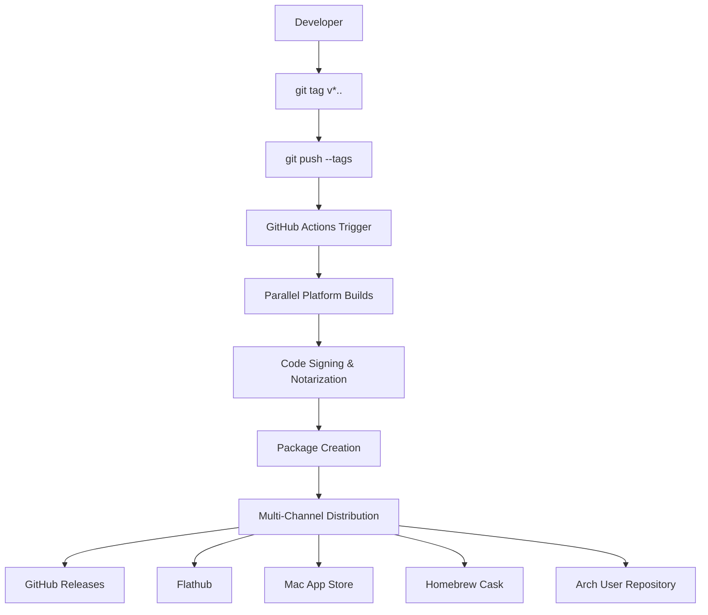
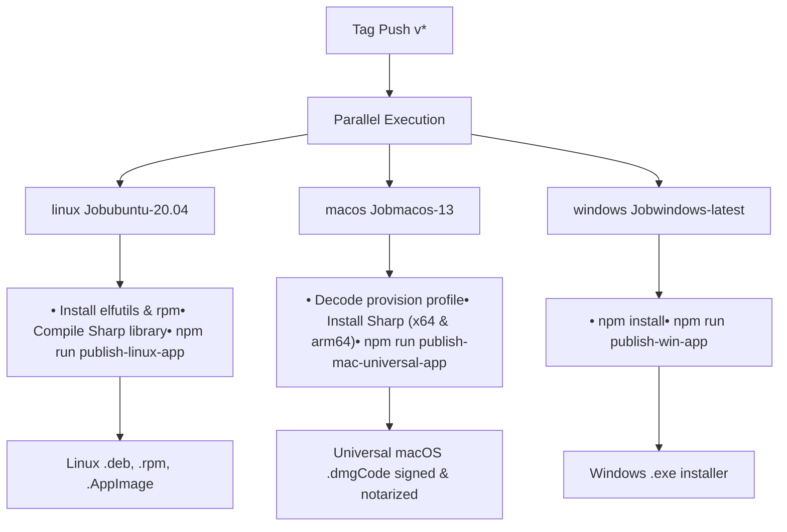
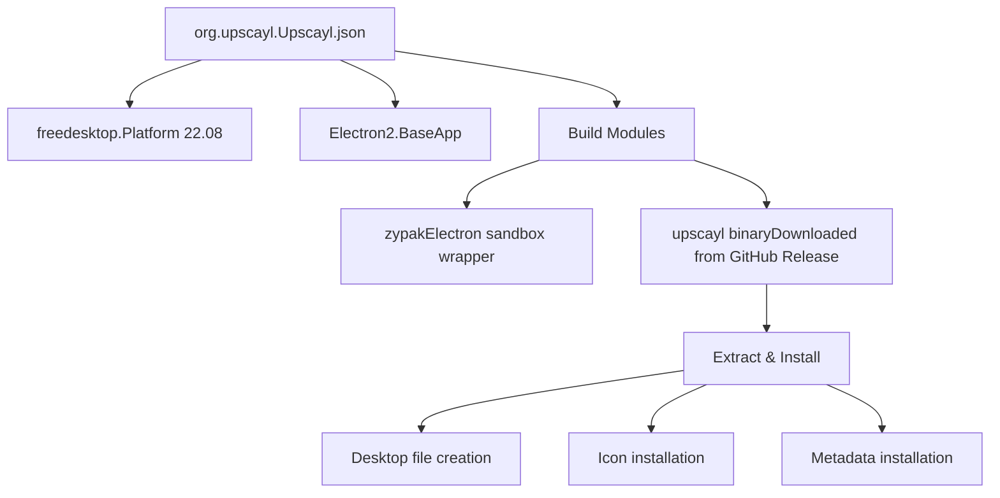

# 发布过程 (Release Process)

相关源文件 (Source files)

-   [.github/workflows/main.yml](https://github.com/upscayl/upscayl/blob/1fdbd3e5/.github/workflows/main.yml)
-   [1080p\_banner.jpg](https://github.com/upscayl/upscayl/blob/1fdbd3e5/1080p_banner.jpg)
-   [1080p\_explainer.jpg](https://github.com/upscayl/upscayl/blob/1fdbd3e5/1080p_explainer.jpg)
-   [download.jpg](https://github.com/upscayl/upscayl/blob/1fdbd3e5/download.jpg)
-   [flatpak/org.upscayl.Upscayl.json](https://github.com/upscayl/upscayl/blob/1fdbd3e5/flatpak/org.upscayl.Upscayl.json)
-   [flatpak/org.upscayl.Upscayl.metainfo.xml](https://github.com/upscayl/upscayl/blob/1fdbd3e5/flatpak/org.upscayl.Upscayl.metainfo.xml)
-   [screen1.png](https://github.com/upscayl/upscayl/blob/1fdbd3e5/screen1.png)

本文档涵盖了 Upscayl 的发布工作流 (Workflow)，包括版本管理 (Version management)、自动化 (Automated) 构建、代码签名 (Code signing) 以及跨多个平台和渠道 (Channels) 的分发 (Distribution)。发布过程主要由 GitHub Actions 驱动，并支持 Windows、macOS 和 Linux 分发版。

有关构建配置和环境设置的信息，请参阅 [构建配置](/upscayl/upscayl/6.1-build-configuration)。有关 CI/CD 流水线 (Pipeline) 实现的详细信息，请参阅 [CI/CD 流水线](/upscayl/upscayl/6.2-cicd-pipeline)。

## 发布触发器 (Release Trigger) 和版本管理

发布过程通过推送遵循 `v*` 模式（例如 `v2.9.1`）的 Git 标签 (Git tags) 触发。这种自动化方法确保了版本控制 (Versioning) 的一致性，并消除了手动启动发布的需要。

### 发布工作流概述 (Release Workflow Overview)

**来源：** [.github/workflows/main.yml1-10](https://github.com/upscayl/upscayl/blob/1fdbd3e5/.github/workflows/main.yml#L1-L10)

## CI/CD 流水线架构

GitHub Actions 工作流由三个并行任务 (Job) 组成，这些任务构建平台特定的分发版。每个任务在其各自的平台上运行，以确保原生编译 (Compilation) 和正确的二进制文件 (Binary) 生成。

### 流水线任务结构 (Pipeline Job Structure)

**来源：** [.github/workflows/main.yml10-69](https://github.com/upscayl/upscayl/blob/1fdbd3e5/.github/workflows/main.yml#L10-L69)

## 平台特定构建过程

### Linux 构建过程

Linux 构建任务执行多项专门任务，包括系统包安装和 Sharp 库编译：

-   安装用于构建工具的 `elfutils` 和 `rpm` 系统包。
-   删除现有的 Sharp 模块，并使用特定的架构标志重新构建它。
-   使用 `SHARP_IGNORE_GLOBAL_LIBVIPS=1` 以确保正确编译。
-   执行 `publish-linux-app` 脚本进行最终打包。

### macOS 构建过程

macOS 构建包括通用二进制文件创建和代码签名：

-   从 base64 编码的秘密 (Secrets) 中解码预置描述文件 (Provisioning profile)。
-   为 x64 和 ARM64 架构编译 Sharp 库。
-   创建通用 (Universal) macOS 应用程序包。
-   使用 Apple 开发者证书执行代码签名和公证 (Notarization)。

所需环境变量：

-   `CSC_KEY_PASSWORD`：证书密码。
-   `CSC_LINK`：证书文件。
-   `APPLEID`：用于公证的 Apple ID。
-   `APPLEIDPASS`：应用程序专用密码。
-   `TEAMID`：Apple 开发者团队 ID。
-   `PROVISION_PROFILE`：Base64 编码的预置描述文件。

### Windows 构建过程

Windows 构建过程最简单，仅需要标准的 npm 操作，无需额外的系统依赖项或签名要求。

**来源：** [.github/workflows/main.yml11-68](https://github.com/upscayl/upscayl/blob/1fdbd3e5/.github/workflows/main.yml#L11-L68)

## 分发渠道 (Distribution Channels)

### GitHub Releases

主要分发方法使用 GitHub Releases，由 CI/CD 流水线自动创建。每个平台任务都使用 `GH_TOKEN` 秘密发布其产物 (Artifacts)。

### Flatpak 分发 (Flatpak Distribution)

Flatpak 包通过 Flathub 分发，并由清单 (Manifest) 配置定义：

Flatpak 构建参考特定的发布版本和 SHA256 校验和以确保完整性。

### 其他分发渠道

-   **Mac App Store**：使用带有 App Store 特定权利 (Entitlements) 的单独 MAS 构建配置。
-   **Homebrew**：社区维护的 Cask 公式。
-   **AUR (Arch User Repository)**：为 Arch Linux 用户提供的社区维护包。

**来源：** [flatpak/org.upscayl.Upscayl.json1-62](https://github.com/upscayl/upscayl/blob/1fdbd3e5/flatpak/org.upscayl.Upscayl.json#L1-L62) [flatpak/org.upscayl.Upscayl.metainfo.xml1-130](https://github.com/upscayl/upscayl/blob/1fdbd3e5/flatpak/org.upscayl.Upscayl.metainfo.xml#L1-L130)

## 发布元数据管理 (Release Metadata Management)

### 版本历史追踪 (Version History Tracking)

发布信息维护在 Flatpak 元数据文件中，其中包括：

-   版本号和发布日期。
-   带有功能描述的变更日志 (Changelog) 条目。
-   平台兼容性信息。
-   许可证和项目元数据。

### 元数据结构

| 字段 | 用途 | 示例 |
| --- | --- | --- |
| `version` | 发布版本标签 | `v2.9.1` |
| `date` | 发布日期 | `2023-10-28` |
| `description` | 变更日志条目 | 功能列表和错误修复 |

元数据遵循 AppStream 规范 (AppStream specification)，并包括屏幕截图、项目 URL 和内容评级。

**来源：** [flatpak/org.upscayl.Upscayl.metainfo.xml51-129](https://github.com/upscayl/upscayl/blob/1fdbd3e5/flatpak/org.upscayl.Upscayl.metainfo.xml#L51-L129)

## 自动化发布检查清单 (Automated Release Checklist)

启动发布时，会发生以下自动化过程：

1.  **标签验证**：确保标签遵循 `v*` 模式。
2.  **依赖项安装**：平台特定的构建工具和库。
3.  **Sharp 库编译**：平台特定的图像处理库构建。
4.  **代码签名**：macOS 二进制文件已签名并公证。
5.  **包创建**：每个平台的原生安装程序。
6.  **GitHub Release**：自动创建带有产物的发布。
7.  **分发更新**：Flatpak 和其他渠道接收新版本信息。

整个过程旨在完全自动化，仅需要初始标签推送即可触发完整的多平台发布周期。

**来源：** [.github/workflows/main.yml1-69](https://github.com/upscayl/upscayl/blob/1fdbd3e5/.github/workflows/main.yml#L1-L69)
