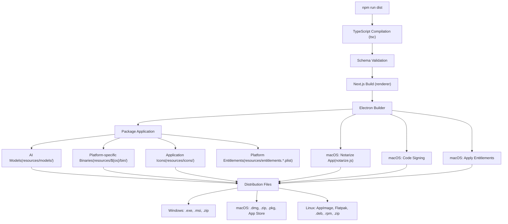
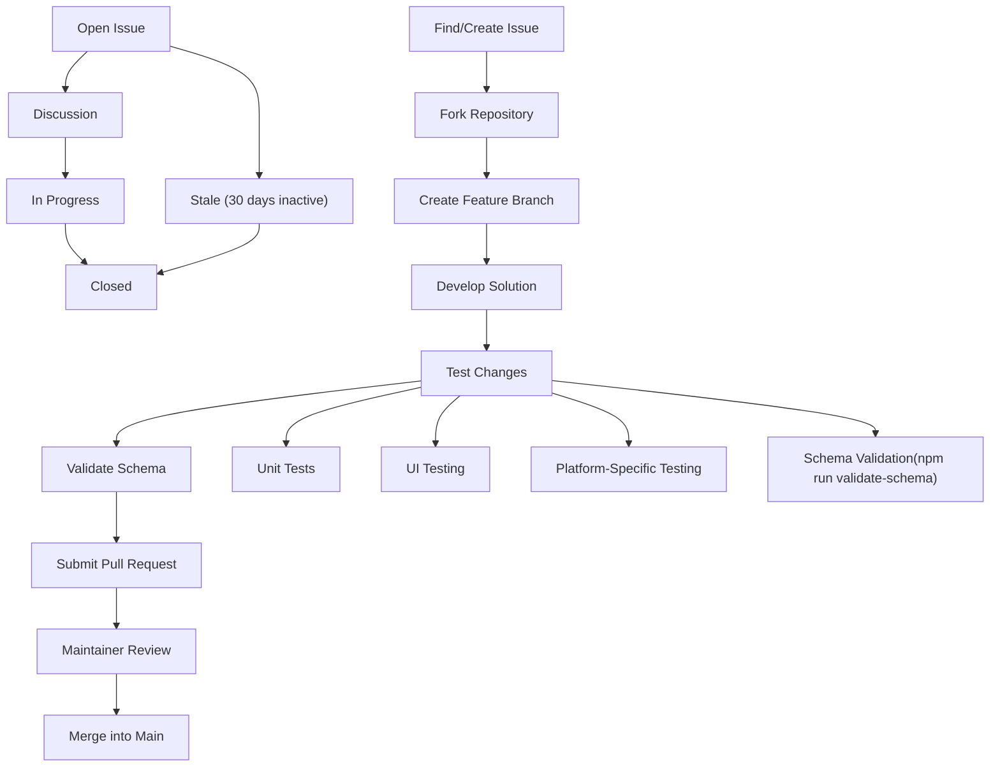
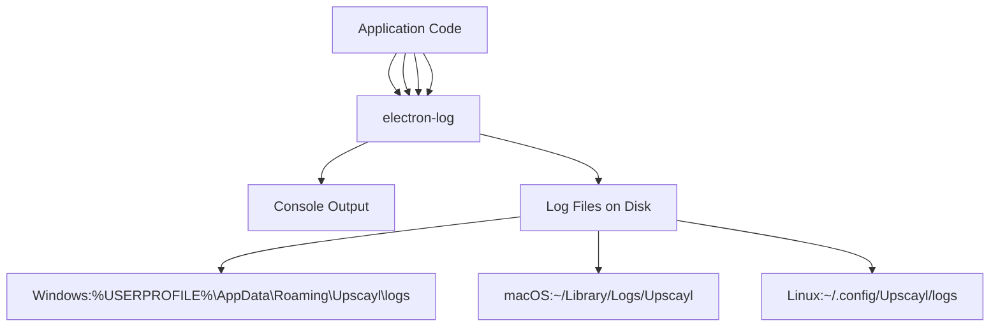

# 开发指南 (Development Guide)

相关源文件 (source files)

-   [.github/ISSUE\_TEMPLATE/bug\_report.yml](https://github.com/upscayl/upscayl/blob/1fdbd3e5/.github/ISSUE_TEMPLATE/bug_report.yml)
-   [package-lock.json](https://github.com/upscayl/upscayl/blob/1fdbd3e5/package-lock.json)
-   [package.json](https://github.com/upscayl/upscayl/blob/1fdbd3e5/package.json)
-   [renderer/components/sidebar/settings-tab/auto-update-toggle.tsx](https://github.com/upscayl/upscayl/blob/1fdbd3e5/renderer/components/sidebar/settings-tab/auto-update-toggle.tsx)
-   [renderer/components/sidebar/settings-tab/enable-contributions-toggle.tsx](https://github.com/upscayl/upscayl/blob/1fdbd3e5/renderer/components/sidebar/settings-tab/enable-contributions-toggle.tsx)

本指南为想要为 Upscayl 做出贡献的开发者 (developers) 提供重要信息，重点关注设置开发环境 (development environment) 和了解贡献流程。有关应用架构 (application architecture) 和核心系统 (core systems) 的信息，请参阅 [应用架构](/upscayl/upscayl/2-application-architecture)。

## 开发环境设置

### 先决条件 (Prerequisites)

在开始开发之前，请确保您拥有：

-   用于版本控制 (version control) 的 Git
-   Node.js（建议使用 Volta 管理）
-   用于测试放大 (upscaling) 功能的兼容 Vulkan 的 GPU
-   平台特定的构建工具（如果为分发进行构建）

### 安装步骤

1.  **安装 Volta（推荐）：**

    ```
    curl https://get.volta.sh | bash# Or follow instructions at https://volta.sh
    ```

    Upscayl 使用 Volta 来管理 Node.js 版本（在 `package.json` 中指定）。

2.  **使用 Volta 安装 Node.js：**

    ```
    volta install node@18.20.5
    ```

3.  **克隆仓库：**

    ```
    git clone https://github.com/upscayl/upscaylcd upscayl
    ```

4.  **安装依赖：**

    ```
    npm install
    ```

5.  **启动开发服务器 (development server)：**

    ```
    npm run start# ornpm run dev
    ```

这将编译 TypeScript 文件并启动应用程序。您的日志将显示在终端中。

来源：[package.json38-41](https://github.com/upscayl/upscayl/blob/1fdbd3e5/package.json#L38-L41) [package.json257-259](https://github.com/upscayl/upscayl/blob/1fdbd3e5/package.json#L257-L259)

## 开发工作流

### 项目结构图

```mermaid
flowchart TD
    MainProcess["Electron Main Process"]
    Renderer["React Renderer Process"]
    Resources["Application Resources"]
    Common["Common Modules"]
    MainIndex["index.ts - Entry point"]
    Commands["commands/ - IPC handlers"]
    Utils["utils/ - Utility functions"]
    UpscaylSpawner["spawnUpscayl.ts - Core upscaling process"]
    Pages["pages/ - Next.js pages"]
    Components["components/ - UI components"]
    StateAtoms["atoms/ - Jotai state atoms"]
    Styles["styles/ - Tailwind CSS"]
    Lib["lib/ - Utility functions"]
    Types["types.ts - Shared type definitions"]
    Constants["constants.ts - Shared constants"]
    FeatureFlags["feature-flags.ts - Feature toggles"]
    Models["models/ - AI models"]
    Binaries["bin/ - Platform binaries"]
    Icons["icons/ - Application icons"]
    Entitlements["entitlements.*.plist - macOS entitlements"]

    MainProcess --> MainIndex
    MainIndex --> Commands
    MainIndex --> Utils
    Utils --> UpscaylSpawner
    Renderer --> Pages
    Renderer --> Components
    Renderer --> StateAtoms
    Renderer --> Styles
    Renderer --> Lib
    Common --> Types
    Common --> Constants
    Common --> FeatureFlags
    Resources --> Models
    Resources --> Binaries
    Resources --> Icons
    Resources --> Entitlements
    MainProcess --> Renderer
    MainProcess --> Resources
    MainProcess --> Common
    Renderer --> Resources
    Renderer --> Common
```


来源：[package.json37](https://github.com/upscayl/upscayl/blob/1fdbd3e5/package.json#L37-L37) [package.json196-199](https://github.com/upscayl/upscayl/blob/1fdbd3e5/package.json#L196-L199) [renderer/tsconfig.json17-22](https://github.com/upscayl/upscayl/blob/1fdbd3e5/renderer/tsconfig.json#L17-L22) [resources/entitlements.mas.plist](https://github.com/upscayl/upscayl/blob/1fdbd3e5/resources/entitlements.mas.plist)

### 开发过程流

> **[Mermaid sequence]**
> *(图表结构无法解析)*

来源：[package.json38-42](https://github.com/upscayl/upscayl/blob/1fdbd3e5/package.json#L38-L42) [package.json71](https://github.com/upscayl/upscayl/blob/1fdbd3e5/package.json#L71-L71)

## 构建与打包

Upscayl 支持多个构建目标和平台。构建过程由 Electron Builder 处理，它将应用程序与所有必要资源打包在一起。

### 可用构建命令

| 命令 | 描述 |
| --- | --- |
| `npm run dist` | 为所有平台构建 |
| `npm run dist:win` | 为 Windows 构建 (exe) |
| `npm run dist:mac` | 为 macOS 构建 (universal) |
| `npm run dist:mac-arm64` | 为 macOS 构建 (Apple Silicon) |
| `npm run dist:linux` | 为 Linux 构建（所有格式） |
| `npm run dist:appimage` | 构建 Linux AppImage |
| `npm run dist:flatpak` | 构建 Linux Flatpak |
| `npm run dist:deb` | 构建 Debian 软件包 |
| `npm run dist:rpm` | 构建 RPM 软件包 |
| `npm run dist:zip` | 构建 Linux zip 软件包 |
| `npm run dist:mac-zip` | 构建 macOS zip 软件包 |
| `npm run dist:dmg` | 构建 macOS DMG |
| `npm run dist:mas` | 为 Mac App Store 构建 |
| `npm run dist:mas-dev` | 为 Mac App Store 构建（开发版） |

用于发布到分发渠道：

| 命令 | 描述 |
| --- | --- |
| `npm run publish-app` | 为所有平台发布 |
| `npm run publish-linux-app` | 发布 Linux 构建版本 |
| `npm run publish-win-app` | 发布 Windows 构建版本 |
| `npm run publish-mac-universal-app` | 发布 macOS 通用构建版本 |
| `npm run publish-mac-app` | 发布 macOS x64 构建版本 |
| `npm run publish-mac-arm-app` | 发布 macOS arm64 构建版本 |

来源：[package.json45-67](https://github.com/upscayl/upscayl/blob/1fdbd3e5/package.json#L45-L67) [package.json62-67](https://github.com/upscayl/upscayl/blob/1fdbd3e5/package.json#L62-L67)

### 构建过程图


来源：[package.json42-70](https://github.com/upscayl/upscayl/blob/1fdbd3e5/package.json#L42-L70) [package.json73-202](https://github.com/upscayl/upscayl/blob/1fdbd3e5/package.json#L73-L202) [notarize.js1-19](https://github.com/upscayl/upscayl/blob/1fdbd3e5/notarize.js#L1-L19) [resources/entitlements.mas.plist](https://github.com/upscayl/upscayl/blob/1fdbd3e5/resources/entitlements.mas.plist)

## 贡献指南

### 合并请求 (Pull Request) 流程

1.  派生仓库并创建特性分支 (feature branch)
2.  进行更改，并遵循代码风格指南
3.  彻底测试您的更改
4.  提交具有清晰描述的合并请求

### 贡献工作流图


来源：[package.json71](https://github.com/upscayl/upscayl/blob/1fdbd3e5/package.json#L71-L71) [.gitignore1-57](https://github.com/upscayl/upscayl/blob/1fdbd3e5/.gitignore#L1-L57)

### 代码风格指南

-   使用 TypeScript 以确保类型安全
-   遵循仓库中现有的代码模式
-   保持组件小巧且专注
-   使用 Tailwind CSS 和 DaisyUI 进行样式设计
-   使用 Jotai 进行状态管理
-   使用 Prettier 格式化代码（项目中已配置）
-   为复杂的逻辑添加注释以解释您的实现方法

### 架构验证 (Schema Validation)

在提交 PR 之前，运行架构验证以确保所有本地化 (localization) 文件和其他基于架构的资源均有效：

```
npm run validate-schema
```
此验证也是构建过程的一部分，如果架构无效，构建将失败。

来源：[package.json71](https://github.com/upscayl/upscayl/blob/1fdbd3e5/package.json#L71-L71)

## 调试 (Debugging) 技巧

### Electron 进程调试

可以在运行 `npm run start` 的终端中查看 Electron 主进程 (Main Process) 日志。这些日志对于调试与文件系统操作、放大流程和 IPC 通信相关的问题至关重要。

如需更详细的调试，可以使用 `DEBUG` 环境变量：

```
cross-env DEBUG=* npm run start
```
这在调试构建问题时特别有用：

```
cross-env DEBUG=* npm run dist
```
来源：[package.json45](https://github.com/upscayl/upscayl/blob/1fdbd3e5/package.json#L45-L45)

### 渲染进程 (Renderer Process) 调试

对于 React 渲染进程：

1.  在运行的应用程序中按 `Ctrl+Shift+I`（在 macOS 上为 `Cmd+Option+I`）使用 Chrome DevTools
2.  检查 Console 选项卡以查看错误和警告
3.  使用 Elements 选项卡检查 UI 组件
4.  使用 Network 选项卡调试网络请求（针对 Upscayl Cloud API）
5.  使用 React DevTools 扩展进行组件调试

### 日志记录 (Logging) 系统

Upscayl 使用 `electron-log` 进行日志记录。这提供了跨平台的一致日志记录，并将日志持久化到磁盘，以便调试生产版本：


来源：[package.json236](https://github.com/upscayl/upscayl/blob/1fdbd3e5/package.json#L236-L236)

## 平台特定开发

### macOS 开发

对于 macOS App Store 开发：

-   使用 `npm run dist:mas-dev` 创建 Mac App Store 的开发构建版本
-   请注意，App Store 构建版本具有特殊的授权 (entitlements) 和限制

### Linux 开发

在为 Linux 开发时：

-   如果可能，请在您针对的特定发行版上进行测试
-   在测试期间，使用 `npm run dist:appimage` 获取最便携的格式

### Windows 开发

对于 Windows 开发：

-   安装依赖项时，请确保您拥有管理员权限
-   使用 `npm run dist:win` 测试 Windows 特定的打包

## 其他资源

-   有关模型转换和自定义模型的信息，请参阅 [Wiki](https://github.com/upscayl/upscayl/blob/1fdbd3e5/Wiki)
-   有关开发期间的故障排除，请参考 [故障排除](https://github.com/upscayl/upscayl/blob/1fdbd3e5/Troubleshooting) 页面

请记住，Upscayl 需要兼容 Vulkan 的 GPU 才能正常工作。大多数集成 GPU 不支持放大流程所需的功能。
