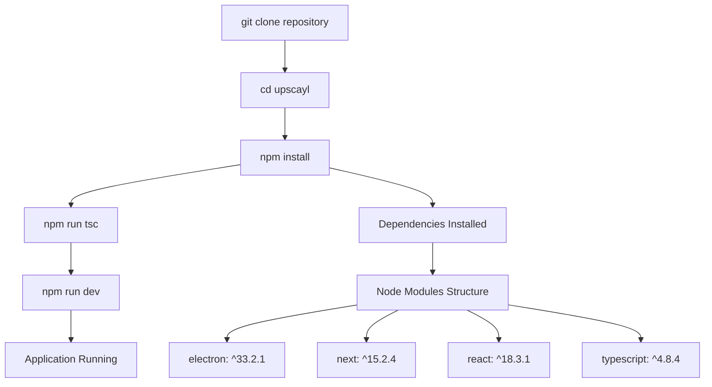
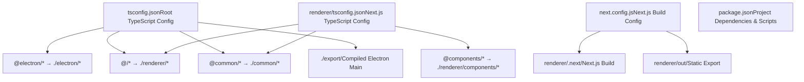
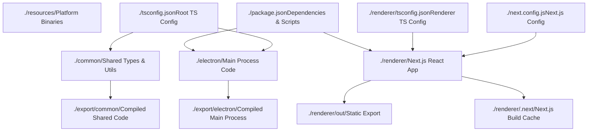

# 设置开发环境 (Setup Development Environment)

相关源文件 (source files)

-   [.gitignore](https://github.com/upscayl/upscayl/blob/1fdbd3e5/.gitignore)
-   [next.config.js](https://github.com/upscayl/upscayl/blob/1fdbd3e5/next.config.js)
-   [notarize.js](https://github.com/upscayl/upscayl/blob/1fdbd3e5/notarize.js)
-   [package-lock.json](https://github.com/upscayl/upscayl/blob/1fdbd3e5/package-lock.json)
-   [package.json](https://github.com/upscayl/upscayl/blob/1fdbd3e5/package.json)
-   [renderer/components/sidebar/settings-tab/auto-update-toggle.tsx](https://github.com/upscayl/upscayl/blob/1fdbd3e5/renderer/components/sidebar/settings-tab/auto-update-toggle.tsx)
-   [renderer/components/sidebar/settings-tab/enable-contributions-toggle.tsx](https://github.com/upscayl/upscayl/blob/1fdbd3e5/renderer/components/sidebar/settings-tab/enable-contributions-toggle.tsx)
-   [renderer/components/sidebar/upscayl-tab/upscayl-steps.tsx](https://github.com/upscayl/upscayl/blob/1fdbd3e5/renderer/components/sidebar/upscayl-tab/upscayl-steps.tsx)
-   [renderer/tsconfig.json](https://github.com/upscayl/upscayl/blob/1fdbd3e5/renderer/tsconfig.json)
-   [scripts/generate-schema.js](https://github.com/upscayl/upscayl/blob/1fdbd3e5/scripts/generate-schema.js)
-   [scripts/validate-schema.js](https://github.com/upscayl/upscayl/blob/1fdbd3e5/scripts/validate-schema.js)
-   [tsconfig.json](https://github.com/upscayl/upscayl/blob/1fdbd3e5/tsconfig.json)

本文档为设置 Upscayl 的本地开发环境 (development environment) 提供全面指南。内容涵盖了为参与代码库贡献所需的先决条件安装、项目设置和开发工作流。

有关整体项目结构的信息，请参阅 [项目结构](/upscayl/upscayl/1.1-project-structure)。有关构建和分发应用程序的详细信息，请参阅 [构建配置](/upscayl/upscayl/6.1-build-configuration)。

## 先决条件 (Prerequisites)

Upscayl 需要特定的软件版本和系统依赖 (system dependencies) 才能在开发模式 (Development mode) 下正常运行。

### Node.js 和软件包管理器 (package manager)

如 [package.json258-260](https://github.com/upscayl/upscayl/blob/1fdbd3e5/package.json#L258-L260) 中所述，项目使用 Node.js 版本 `18.20.5`。请使用您首选的 Node.js 版本管理器安装确切版本：

| 工具 | 安装命令 |
| --- | --- |
| Volta（推荐） | `volta install node@18.20.5` |
| nvm | `nvm install 18.20.5 && nvm use 18.20.5` |
| 直接下载 | 从 [Node.js 官方网站](https://nodejs.org/) 下载 |

### 系统依赖

Upscayl 的 AI 处理 (AI processing) 需要平台特定的依赖：

| 平台 | 要求 |
| --- | --- |
| **所有平台** | 兼容 Vulkan 的 GPU 及驱动程序 |
| **Linux** | `vulkan-tools`、`vulkan-utils`、构建必需项 (build essentials) |
| **macOS** | Xcode Command Line Tools、MoltenVK（已包含） |
| **Windows** | Visual Studio Build Tools、Vulkan SDK |

### 开发工具

安装以下可选但推荐的开发工具：

-   **TypeScript**: 通过 `npm install -g typescript` 进行全局安装
-   **Git**: 用于版本控制和贡献工作流
-   **代码编辑器**: 带有 TypeScript 和 React 扩展插件的 VS Code

来源：[package.json258-260](https://github.com/upscayl/upscayl/blob/1fdbd3e5/package.json#L258-L260) [package.json204-224](https://github.com/upscayl/upscayl/blob/1fdbd3e5/package.json#L204-L224)

## 开发环境设置

### 克隆并安装依赖项


**安装过程：**

1.  **克隆仓库**

    ```
    git clone https://github.com/upscayl/upscayl.gitcd upscayl
    ```

2.  **安装依赖项**

    ```
    npm install
    ```

    这将安装来自 [package.json225-257](https://github.com/upscayl/upscayl/blob/1fdbd3e5/package.json#L225-L257) 和 [package.json204-224](https://github.com/upscayl/upscayl/blob/1fdbd3e5/package.json#L204-L224) 的所有依赖项。

3.  **初始 TypeScript 编译**

    ```
    npm run tsc
    ```

    根据 [tsconfig.json1-26](https://github.com/upscayl/upscayl/blob/1fdbd3e5/tsconfig.json#L1-L26) 编译 TypeScript 文件。


来源：[package.json38-71](https://github.com/upscayl/upscayl/blob/1fdbd3e5/package.json#L38-L71) [tsconfig.json1-26](https://github.com/upscayl/upscayl/blob/1fdbd3e5/tsconfig.json#L1-L26)

### 项目配置概览

开发环境使用多种 TypeScript 配置和构建工具：


**关键配置细节：**

-   **根 TypeScript 配置 (Root TypeScript Config)** [tsconfig.json12-16](https://github.com/upscayl/upscayl/blob/1fdbd3e5/tsconfig.json#L12-L16)：映射 `@electron/*`、`@/*` 和 `@common/*` 路径。
-   **渲染器 TypeScript 配置 (Renderer TypeScript Config)** [renderer/tsconfig.json17-22](https://github.com/upscayl/upscayl/blob/1fdbd3e5/renderer/tsconfig.json#L17-L22)：React 组件的其他映射。
-   **Next.js 配置 (Next.js Config)** [next.config.js5-16](https://github.com/upscayl/upscayl/blob/1fdbd3e5/next.config.js#L5-L16)：使用未优化图像的静态导出 (Static Export) 模式。
-   **输出目录**：`./export` 用于主进程 (Main Process)，`renderer/out` 用于静态文件。

来源：[tsconfig.json12-16](https://github.com/upscayl/upscayl/blob/1fdbd3e5/tsconfig.json#L12-L16) [renderer/tsconfig.json17-22](https://github.com/upscayl/upscayl/blob/1fdbd3e5/renderer/tsconfig.json#L17-L22) [next.config.js5-16](https://github.com/upscayl/upscayl/blob/1fdbd3e5/next.config.js#L5-L16)

## 开发工作流

### 可用开发脚本

项目为不同的开发任务提供了多个 npm 脚本：

| 脚本 | 命令 | 用途 |
| --- | --- | --- |
| **开发** | `npm run dev` | 启动开发服务器 |
| **替代启动** | `npm start` | 与 `npm run dev` 相同 |
| **TypeScript 编译** | `npm run tsc` | 仅编译 TypeScript |
| **完整构建** | `npm run build` | 构建渲染器 + 编译 TypeScript |
| **清理** | `npm run clean` | 删除构建产物 (build artifacts) |

### 开发服务器启动

> **[Mermaid sequence]**
> *(图表结构无法解析)*

**启动过程细节：**

1.  **TypeScript 编译** [package.json40-41](https://github.com/upscayl/upscayl/blob/1fdbd3e5/package.json#L40-L41)：将 `/electron` 和 `/common` 中的文件编译到 `/export`。
2.  **Electron 主进程**：从 [package.json37](https://github.com/upscayl/upscayl/blob/1fdbd3e5/package.json#L37-L37) 入口点 `export/electron/index.js` 启动。
3.  **渲染进程 (Renderer Process)**：Next.js 开发服务器提供 React 应用程序。
4.  **热重载 (Hot Reload)**：对渲染器文件的更改将触发自动重新编译。

来源：[package.json40-41](https://github.com/upscayl/upscayl/blob/1fdbd3e5/package.json#L40-L41) [package.json37](https://github.com/upscayl/upscayl/blob/1fdbd3e5/package.json#L37-L37)

### 文件监听 (File Watching) 和热重载

开发环境支持不同层级的文件监听：

| 组件 | 文件类型 | 重载行为 |
| --- | --- | --- |
| **Electron 主进程** | `/electron`、`/common` 中的 `*.ts` | 需要手动重启 |
| **Next.js 渲染器** | `/renderer` 中的 `*.tsx`、`*.ts` | 自动热重载 |
| **共享通用代码** | `/common` 中的 `*.ts` | 重启主进程，重载渲染器 |

## 用于开发的项目结构

### 源目录组织


**关键开发目录：**

-   **`/electron`**：包含 Electron 主进程 TypeScript 文件、IPC 处理程序和系统集成。
-   **`/renderer`**：包含组件、页面和 UI 逻辑的 Next.js React 应用程序。
-   **`/common`**：两个进程共同使用的共享 TypeScript 定义、常量和工具函数。
-   **`/resources`**：平台特定的二进制文件 (`upscayl-ncnn`) 和 AI 模型。

来源：[tsconfig.json18-25](https://github.com/upscayl/upscayl/blob/1fdbd3e5/tsconfig.json#L18-L25) [.gitignore8-22](https://github.com/upscayl/upscayl/blob/1fdbd3e5/.gitignore#L8-L22)

### 导入路径解析 (Import Path Resolution)

TypeScript 路径映射系统允许在整个代码库中进行整洁的导入：

| 导入模式 | 解析为 | 使用场景 |
| --- | --- | --- |
| `@electron/*` | `./electron/*` | 主进程导入 |
| `@/*` | `./renderer/*` | 渲染进程导入 |
| `@common/*` | `./common/*` | 跨进程共享代码 |
| `@components/*` | `./renderer/components/*` | React 组件导入 |

**导入使用示例：**

```
// 在主进程中import { ELECTRON_COMMANDS } from '@common/electron-commands'; // 在渲染进程中  import { useAtom } from '@/atoms/user-settings-atom';import Button from '@components/ui/button';
```
来源：[tsconfig.json12-16](https://github.com/upscayl/upscayl/blob/1fdbd3e5/tsconfig.json#L12-L16) [renderer/tsconfig.json17-22](https://github.com/upscayl/upscayl/blob/1fdbd3e5/renderer/tsconfig.json#L17-L22)

## 常用开发任务

### 构建用于测试

用于在没有开发工具的情况下测试完整的应用程序：

```
# 完整生产构建npm run build # 打包应用程序（不进行分发）npm run pack-app
```
构建过程遵循 [package.json42-45](https://github.com/upscayl/upscayl/blob/1fdbd3e5/package.json#L42-L45) 中定义的顺序：

1.  **TypeScript 编译**：`tsc` 编译主进程代码。
2.  **架构验证**：`npm run validate-schema` 验证翻译文件。
3.  **Next.js 构建**：`next build renderer` 创建优化的 React 包。
4.  **Electron Builder**：`electron-builder --dir` 打包应用程序。

### 架构验证 (Schema Validation)

项目包含使用 [scripts/validate-schema.js1-37](https://github.com/upscayl/upscayl/blob/1fdbd3e5/scripts/validate-schema.js#L1-L37) 自动验证翻译文件的功能：

```
npm run validate-schema
```
这可确保 `renderer/locales/` 中的所有语言环境文件 (locale files) 都与基础英语翻译文件的结构匹配。

### 调试和日志记录

在开发过程中，利用以下调试方法：

| 组件 | 调试方法 | 输出位置 |
| --- | --- | --- |
| **Electron 主进程** | `console.log()` | 运行 `npm run dev` 的终端 |
| **渲染进程** | `console.log()` | Electron DevTools 控制台 |
| **IPC 通信** | Electron IPC 调试 | 主进程和渲染器日志 |

通过在 Electron 窗口中按 `Ctrl+Shift+I` (Windows/Linux) 或 `Cmd+Option+I` (macOS) 访问渲染器 DevTools。

来源：[scripts/validate-schema.js1-37](https://github.com/upscayl/upscayl/blob/1fdbd3e5/scripts/validate-schema.js#L1-L37) [package.json42-45](https://github.com/upscayl/upscayl/blob/1fdbd3e5/package.json#L42-L45)

## 环境变量和配置

### 开发环境文件

为开发配置创建这些可选的环境文件：

| 文件 | 用途 | Git 忽略 |
| --- | --- | --- |
| `.env` | 通用环境变量 (environment variables) | 是 |
| `.env.local` | 本地开发覆盖 | 是 |
| `.env.development.local` | 开发特定变量 | 是 |

### 平台特定开发

不同平台可能需要为 AI 处理二进制文件进行额外设置：

**Linux 开发：**

-   确保已安装 Vulkan 驱动程序：`sudo apt install vulkan-tools vulkan-utils`
-   验证 GPU 兼容性：`vulkaninfo`

**macOS 开发：**

-   安装 Xcode Command Line Tools：`xcode-select --install`
-   如果公证 (notarization) 测试需要，请启用开发人员工具

**Windows 开发：**

-   安装带有 C++ 支持的 Visual Studio Build Tools
-   从 LunarG 安装 Vulkan SDK

来源：[.gitignore32-37](https://github.com/upscayl/upscayl/blob/1fdbd3e5/.gitignore#L32-L37) [package.json106-127](https://github.com/upscayl/upscayl/blob/1fdbd3e5/package.json#L106-L127)

## 常见问题排查

### TypeScript 编译错误

如果 TypeScript 编译失败：

1.  **清理并重新安装依赖项：**

    ```
    npm run cleanrm -rf node_modules package-lock.jsonnpm install
    ```

2.  **检查路径映射**，见 [tsconfig.json12-16](https://github.com/upscayl/upscayl/blob/1fdbd3e5/tsconfig.json#L12-L16) 和 [renderer/tsconfig.json17-22](https://github.com/upscayl/upscayl/blob/1fdbd3e5/renderer/tsconfig.json#L17-L22)。

3.  **验证 Node.js 版本**是否匹配 [package.json258-260](https://github.com/upscayl/upscayl/blob/1fdbd3e5/package.json#L258-L260)。


### Electron 应用程序无法启动

常见的启动问题及解决方案：

| 问题 | 解决方案 |
| --- | --- |
| **"Module not found"** | 运行 `npm run tsc` 编译 TypeScript |
| **"Permission denied"** | 检查 `/resources` 二进制文件的文件权限 |
| **"Vulkan not available"** | 安装 GPU 驱动程序和 Vulkan 支持 |

### Next.js 构建失败

如果渲染器构建失败：

1.  **检查 Next.js 配置**，见 [next.config.js5-16](https://github.com/upscayl/upscayl/blob/1fdbd3e5/next.config.js#L5-L16)。
2.  **验证依赖项中的 React/TypeScript 兼容性**。
3.  **清除 Next.js 缓存**：`rm -rf renderer/.next`。

来源：[package.json39](https://github.com/upscayl/upscayl/blob/1fdbd3e5/package.json#L39-L39) [next.config.js5-16](https://github.com/upscayl/upscayl/blob/1fdbd3e5/next.config.js#L5-L16) [.gitignore15-22](https://github.com/upscayl/upscayl/blob/1fdbd3e5/.gitignore#L15-L22)
