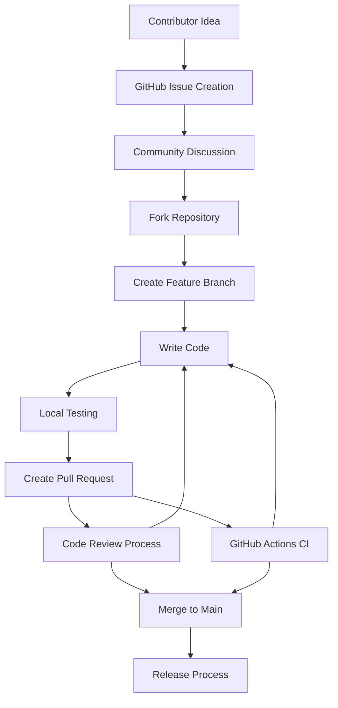
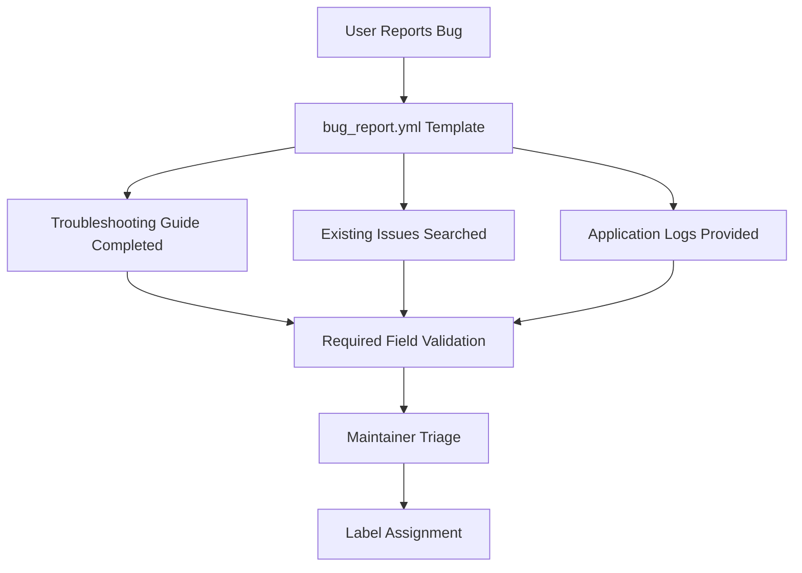
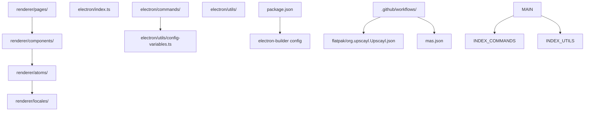
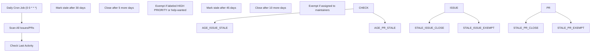

# 贡献指南 (Contributing Guidelines)

相关源文件 (source files)

-   [.github/ISSUE\_TEMPLATE/bug\_report.yml](https://github.com/upscayl/upscayl/blob/1fdbd3e5/.github/ISSUE_TEMPLATE/bug_report.yml)
-   [.github/workflows/stale.yml](https://github.com/upscayl/upscayl/blob/1fdbd3e5/.github/workflows/stale.yml)
-   [README.md](https://github.com/upscayl/upscayl/blob/1fdbd3e5/README.md?plain=1)
-   [electron/utils/show-notification.ts](https://github.com/upscayl/upscayl/blob/1fdbd3e5/electron/utils/show-notification.ts)
-   [upscayl.mp4](https://github.com/upscayl/upscayl/blob/1fdbd3e5/upscayl.mp4)

本文档概述了参与 Upscayl 项目贡献的流程、标准和指南。内容涵盖了从报告错误、建议新功能到提交代码更改以及参与开发社区的所有方面。

有关设置开发环境的信息，请参阅 [设置开发环境](/upscayl/upscayl/7.1-setup-development-environment)。有关贡献者应了解的整体项目架构的详细信息，请参阅 [应用架构](/upscayl/upscayl/2-application-architecture)。

## 贡献类型

Upscayl 欢迎社区提供各种类型的贡献：

| 贡献类型 | 描述 | 入口点 |
| --- | --- | --- |
| 错误报告 (Bug Reports) | 报告应用程序中的问题 | [GitHub Issues](https://github.com/upscayl/upscayl/blob/1fdbd3e5/GitHub Issues) |
| 功能请求 (Feature Requests) | 建议新功能 | GitHub Issues |
| 代码贡献 (Code Contributions) | 提交错误修复或新功能 | Pull Requests |
| 文档 | 改进文档和指南 | Pull Requests |
| 翻译 (Translations) | 添加或改进 i18n 支持 | Pull Requests |
| 模型贡献 (Model Contributions) | 贡献 AI 模型 | [Custom Models Repository](https://github.com/upscayl/upscayl/blob/1fdbd3e5/Custom Models Repository) |

## 贡献工作流

### 整体贡献流程

来源：[README.md162-181](https://github.com/upscayl/upscayl/blob/1fdbd3e5/README.md?plain=1#L162-L181) [.github/workflows/](https://github.com/upscayl/upscayl/blob/1fdbd3e5/.github/workflows/) [.github/ISSUE\_TEMPLATE/bug\_report.yml](https://github.com/upscayl/upscayl/blob/1fdbd3e5/.github/ISSUE_TEMPLATE/bug_report.yml)

### 问题生命周期管理 (Issue Lifecycle Management)

> **[Mermaid stateDiagram]**
> *(图表结构无法解析)*

来源：[.github/workflows/stale.yml1-27](https://github.com/upscayl/upscayl/blob/1fdbd3e5/.github/workflows/stale.yml#L1-L27) [.github/ISSUE\_TEMPLATE/bug\_report.yml](https://github.com/upscayl/upscayl/blob/1fdbd3e5/.github/ISSUE_TEMPLATE/bug_report.yml)

## 错误报告流程

### 所需信息

在提交错误报告之前，贡献者必须完成问题模板中定义的结构化核查清单：

| 字段 | 描述 | 是否必填 |
| --- | --- | --- |
| 故障排除验证 | 确认已尝试所有故障排除步骤 | 是 |
| 问题搜索 | 确认该问题尚未被报告过 | 是 |
| 错误描述 | 问题的清晰描述 | 是 |
| 复现步骤 (Reproduction Steps) | 逐步复现指南 | 是 |
| 版本信息 | Upscayl 版本或提交哈希 | 是 |
| 平台 | 操作系统和分发方式 | 是 |
| 操作系统版本 | 具体操作系统版本详情 | 是 |
| GPU 信息 | 显卡规格 (Graphics card specifications) | 是 |
| 预期行为 (Expected Behavior) | 应该发生的情况 | 否 |
| 屏幕截图 | 问题的视觉证据 | 否 |
| 日志 | 来自该问题的应用程序日志 | 是 |

### 错误报告模板结构

错误报告流程通过 GitHub 的问题模板系统实现自动化：

来源：[.github/ISSUE\_TEMPLATE/bug\_report.yml1-78](https://github.com/upscayl/upscayl/blob/1fdbd3e5/.github/ISSUE_TEMPLATE/bug_report.yml#L1-L78)

## 代码标准与实践

### 项目结构理解

贡献者应熟悉代码库的组织结构：

来源：[项目结构](/upscayl/upscayl/1.1-project-structure)、[renderer/](https://github.com/upscayl/upscayl/blob/1fdbd3e5/renderer/) [electron/](https://github.com/upscayl/upscayl/blob/1fdbd3e5/electron/) [.github/workflows/](https://github.com/upscayl/upscayl/blob/1fdbd3e5/.github/workflows/)

### 开发命令

| 命令 | 用途 | 使用场景 |
| --- | --- | --- |
| `npm install` | 安装依赖项 | 开发前必做 |
| `npm run start` | 启动开发服务器 | 本地开发与测试 |
| `npm run dist` | 构建生产包 | 打包验证 |
| `npm run publish-app` | 发布版本 | 仅限维护者 |

来源：[README.md175-195](https://github.com/upscayl/upscayl/blob/1fdbd3e5/README.md?plain=1#L175-L195)

### 代码质量要求

1.  **类型安全 (Type Safety)**：项目在主进程和渲染进程中始终使用 TypeScript。
2.  **代码检查 (Linting)**：代码必须通过为项目配置的 ESLint 检查。
3.  **测试**：在适用的情况下，更改应包含适当的测试。
4.  **文档**：新功能需要更新文档。

## 合并请求流程

### PR 提交指南

> **[Mermaid sequence]**
> *(图表结构无法解析)*

来源：[README.md162-195](https://github.com/upscayl/upscayl/blob/1fdbd3e5/README.md?plain=1#L162-L195) [.github/workflows/](https://github.com/upscayl/upscayl/blob/1fdbd3e5/.github/workflows/)

### 审查标准 (Review Criteria)

维护者根据以下标准评估合并请求：

1.  **功能性**：更改是否按预期工作？
2.  **代码质量**：代码结构是否良好且易于维护？
3.  **性能**：它是否会影响应用程序性能？
4.  **兼容性**：是否可在支持的平台上运行？
5.  **文档**：更改是否已正确记录？
6.  **测试**：是否包含测试且测试是否通过？

## 自动问题管理

项目使用自动化工作流来维护问题状态：

### 过期问题处理 (Stale Issue Handling)

来源：[.github/workflows/stale.yml1-27](https://github.com/upscayl/upscayl/blob/1fdbd3e5/.github/workflows/stale.yml#L1-L27)

### 豁免规则 (Exemption Rules)

自动化系统遵循某些类别的豁免规则：

| 类型 | 豁免规则 | 原因 |
| --- | --- | --- |
| 高优先级问题 | `HIGH PRIORITY` 标签 | 关键错误或功能 |
| 寻求帮助 | `help-wanted` 标签 | 社区贡献机会 |
| 已分配问题 | 已分配给 `aaronliu0130`、`NayamAmarshe` 或 `TGS963` | 维护者正在积极处理的工作 |

来源：[.github/workflows/stale.yml25-26](https://github.com/upscayl/upscayl/blob/1fdbd3e5/.github/workflows/stale.yml#L25-L26)

## 沟通渠道 (Communication Channels)

### 官方渠道

| 平台 | 用途 | 链接 |
| --- | --- | --- |
| GitHub Issues | 错误报告与功能请求 | 仓库 issues 选项卡 |
| GitHub Discussions | 通用讨论与问题解答 | 仓库 discussions 选项卡 |
| Telegram | 社区聊天 (Community chat) | @iamnayam |
| X (Twitter) | 项目动态 | @upscayl |

来源：[README.md44-50](https://github.com/upscayl/upscayl/blob/1fdbd3e5/README.md?plain=1#L44-L50)

### 维护者联系方式

本项目由以下人员维护：

-   **NayamAmarshe** - 核心维护者
-   **TGS963** - 核心维护者
-   **aaronliu0130** - 社区支持

来源：[README.md229](https://github.com/upscayl/upscayl/blob/1fdbd3e5/README.md?plain=1#L229-L229) [.github/workflows/stale.yml26](https://github.com/upscayl/upscayl/blob/1fdbd3e5/.github/workflows/stale.yml#L26-L26)

## 特殊贡献领域

### 自定义 AI 模型

贡献者可以通过以下方式扩展 Upscayl 的功能：

1.  使用转换指南转换新的 AI 模型
2.  向 [custom-models 仓库](https://github.com/upscayl/upscayl/blob/1fdbd3e5/custom-models repository) 做出贡献
3.  测试跨平台的模型兼容性

### 本地化 (Internationalization)

项目通过位于 [`renderer/locales/`](https://github.com/upscayl/upscayl/blob/1fdbd3e5/`renderer/locales/`) 的 i18n 系统支持多种语言。贡献者可以：

1.  添加新的语言文件
2.  改进现有翻译
3.  测试语言切换功能

### 平台特定功能

平台维护者可以针对以下内容做出贡献：

-   **Flatpak**：[`flatpak/org.upscayl.Upscayl.json`](https://github.com/upscayl/upscayl/blob/1fdbd3e5/`flatpak/org.upscayl.Upscayl.json`)
-   **macOS App Store**：[`mas.json`](https://github.com/upscayl/upscayl/blob/1fdbd3e5/`mas.json`)
-   **Windows**：平台特定通知处理
-   **Linux**：分发版特定打包

来源：[README.md146-149](https://github.com/upscayl/upscayl/blob/1fdbd3e5/README.md?plain=1#L146-L149) [flatpak/](https://github.com/upscayl/upscayl/blob/1fdbd3e5/flatpak/) [mas.json](https://github.com/upscayl/upscayl/blob/1fdbd3e5/mas.json) [electron/utils/show-notification.ts8-24](https://github.com/upscayl/upscayl/blob/1fdbd3e5/electron/utils/show-notification.ts#L8-L24)
