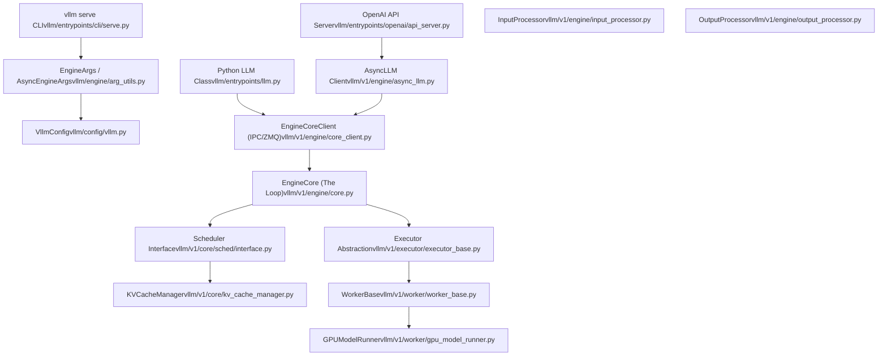

# 概览

相关源文件

-   [.gitignore](https://github.com/vllm-project/vllm/blob/7cc302dd/.gitignore)
-   [README.md](https://github.com/vllm-project/vllm/blob/7cc302dd/README.md?plain=1)
-   [docs/.nav.yml](https://github.com/vllm-project/vllm/blob/7cc302dd/docs/.nav.yml)
-   [docs/README.md](https://github.com/vllm-project/vllm/blob/7cc302dd/docs/README.md?plain=1)
-   [docs/community/contact\_us.md](https://github.com/vllm-project/vllm/blob/7cc302dd/docs/community/contact_us.md?plain=1)
-   [docs/community/meetups.md](https://github.com/vllm-project/vllm/blob/7cc302dd/docs/community/meetups.md?plain=1)
-   [docs/community/sponsors.md](https://github.com/vllm-project/vllm/blob/7cc302dd/docs/community/sponsors.md?plain=1)
-   [docs/configuration/serve\_args.md](https://github.com/vllm-project/vllm/blob/7cc302dd/docs/configuration/serve_args.md?plain=1)
-   [docs/contributing/model/README.md](https://github.com/vllm-project/vllm/blob/7cc302dd/docs/contributing/model/README.md?plain=1)
-   [docs/contributing/model/basic.md](https://github.com/vllm-project/vllm/blob/7cc302dd/docs/contributing/model/basic.md?plain=1)
-   [docs/contributing/model/multimodal.md](https://github.com/vllm-project/vllm/blob/7cc302dd/docs/contributing/model/multimodal.md?plain=1)
-   [docs/contributing/model/registration.md](https://github.com/vllm-project/vllm/blob/7cc302dd/docs/contributing/model/registration.md?plain=1)
-   [docs/contributing/model/tests.md](https://github.com/vllm-project/vllm/blob/7cc302dd/docs/contributing/model/tests.md?plain=1)
-   [docs/contributing/model/transcription.md](https://github.com/vllm-project/vllm/blob/7cc302dd/docs/contributing/model/transcription.md?plain=1)
-   [docs/deployment/frameworks/hf\_inference\_endpoints.md](https://github.com/vllm-project/vllm/blob/7cc302dd/docs/deployment/frameworks/hf_inference_endpoints.md?plain=1)
-   [docs/design/plugin\_system.md](https://github.com/vllm-project/vllm/blob/7cc302dd/docs/design/plugin_system.md?plain=1)
-   [docs/examples/README.md](https://github.com/vllm-project/vllm/blob/7cc302dd/docs/examples/README.md?plain=1)
-   [docs/features/README.md](https://github.com/vllm-project/vllm/blob/7cc302dd/docs/features/README.md?plain=1)
-   [docs/features/prompt\_embeds.md](https://github.com/vllm-project/vllm/blob/7cc302dd/docs/features/prompt_embeds.md?plain=1)
-   [docs/getting\_started/quickstart.md](https://github.com/vllm-project/vllm/blob/7cc302dd/docs/getting_started/quickstart.md?plain=1)
-   [docs/mkdocs/hooks/generate\_argparse.py](https://github.com/vllm-project/vllm/blob/7cc302dd/docs/mkdocs/hooks/generate_argparse.py)
-   [docs/mkdocs/hooks/url\_schemes.py](https://github.com/vllm-project/vllm/blob/7cc302dd/docs/mkdocs/hooks/url_schemes.py)
-   [docs/mkdocs/javascript/edit\_and\_feedback.js](https://github.com/vllm-project/vllm/blob/7cc302dd/docs/mkdocs/javascript/edit_and_feedback.js)
-   [docs/mkdocs/javascript/mathjax.js](https://github.com/vllm-project/vllm/blob/7cc302dd/docs/mkdocs/javascript/mathjax.js)
-   [docs/mkdocs/javascript/slack\_and\_forum.js](https://github.com/vllm-project/vllm/blob/7cc302dd/docs/mkdocs/javascript/slack_and_forum.js)
-   [docs/mkdocs/stylesheets/extra.css](https://github.com/vllm-project/vllm/blob/7cc302dd/docs/mkdocs/stylesheets/extra.css)
-   [docs/models/generative\_models.md](https://github.com/vllm-project/vllm/blob/7cc302dd/docs/models/generative_models.md?plain=1)
-   [docs/models/pooling\_models/classify.md](https://github.com/vllm-project/vllm/blob/7cc302dd/docs/models/pooling_models/classify.md?plain=1)
-   [docs/models/pooling\_models/embed.md](https://github.com/vllm-project/vllm/blob/7cc302dd/docs/models/pooling_models/embed.md?plain=1)
-   [docs/models/pooling\_models/reward.md](https://github.com/vllm-project/vllm/blob/7cc302dd/docs/models/pooling_models/reward.md?plain=1)
-   [docs/models/pooling\_models/scoring.md](https://github.com/vllm-project/vllm/blob/7cc302dd/docs/models/pooling_models/scoring.md?plain=1)
-   [docs/serving/offline\_inference.md](https://github.com/vllm-project/vllm/blob/7cc302dd/docs/serving/offline_inference.md?plain=1)
-   [docs/serving/openai\_compatible\_server.md](https://github.com/vllm-project/vllm/blob/7cc302dd/docs/serving/openai_compatible_server.md?plain=1)
-   [docs/training/trl.md](https://github.com/vllm-project/vllm/blob/7cc302dd/docs/training/trl.md?plain=1)
-   [docs/usage/README.md](https://github.com/vllm-project/vllm/blob/7cc302dd/docs/usage/README.md?plain=1)
-   [docs/usage/troubleshooting.md](https://github.com/vllm-project/vllm/blob/7cc302dd/docs/usage/troubleshooting.md?plain=1)
-   [docs/usage/v1\_guide.md](https://github.com/vllm-project/vllm/blob/7cc302dd/docs/usage/v1_guide.md?plain=1)
-   [examples/online\_serving/disaggregated\_encoder/README.md](https://github.com/vllm-project/vllm/blob/7cc302dd/examples/online_serving/disaggregated_encoder/README.md?plain=1)
-   [mkdocs.yaml](https://github.com/vllm-project/vllm/blob/7cc302dd/mkdocs.yaml)
-   [requirements/docs.txt](https://github.com/vllm-project/vllm/blob/7cc302dd/requirements/docs.txt)
-   [tests/compile/README.md](https://github.com/vllm-project/vllm/blob/7cc302dd/tests/compile/README.md?plain=1)
-   [tests/compile/backend.py](https://github.com/vllm-project/vllm/blob/7cc302dd/tests/compile/backend.py)
-   [tests/compile/fullgraph/\_\_init\_\_.py](https://github.com/vllm-project/vllm/blob/7cc302dd/tests/compile/fullgraph/__init__.py)
-   [tests/compile/fullgraph/test\_basic\_correctness.py](https://github.com/vllm-project/vllm/blob/7cc302dd/tests/compile/fullgraph/test_basic_correctness.py)
-   [tests/compile/fullgraph/test\_full\_cudagraph.py](https://github.com/vllm-project/vllm/blob/7cc302dd/tests/compile/fullgraph/test_full_cudagraph.py)
-   [tests/compile/fullgraph/test\_full\_graph.py](https://github.com/vllm-project/vllm/blob/7cc302dd/tests/compile/fullgraph/test_full_graph.py)
-   [tests/entrypoints/test\_api\_server\_process\_manager.py](https://github.com/vllm-project/vllm/blob/7cc302dd/tests/entrypoints/test_api_server_process_manager.py)
-   [tests/utils\_/test\_cache.py](https://github.com/vllm-project/vllm/blob/7cc302dd/tests/utils_/test_cache.py)
-   [tests/v1/engine/test\_engine\_core.py](https://github.com/vllm-project/vllm/blob/7cc302dd/tests/v1/engine/test_engine_core.py)
-   [tests/v1/engine/test\_engine\_core\_client.py](https://github.com/vllm-project/vllm/blob/7cc302dd/tests/v1/engine/test_engine_core_client.py)
-   [vllm/benchmarks/\_\_init\_\_.py](https://github.com/vllm-project/vllm/blob/7cc302dd/vllm/benchmarks/__init__.py)
-   [vllm/config/parallel.py](https://github.com/vllm-project/vllm/blob/7cc302dd/vllm/config/parallel.py)
-   [vllm/engine/async\_llm\_engine.py](https://github.com/vllm-project/vllm/blob/7cc302dd/vllm/engine/async_llm_engine.py)
-   [vllm/engine/llm\_engine.py](https://github.com/vllm-project/vllm/blob/7cc302dd/vllm/engine/llm_engine.py)
-   [vllm/engine/protocol.py](https://github.com/vllm-project/vllm/blob/7cc302dd/vllm/engine/protocol.py)
-   [vllm/entrypoints/cli/serve.py](https://github.com/vllm-project/vllm/blob/7cc302dd/vllm/entrypoints/cli/serve.py)
-   [vllm/entrypoints/launcher.py](https://github.com/vllm-project/vllm/blob/7cc302dd/vllm/entrypoints/launcher.py)
-   [vllm/entrypoints/llm.py](https://github.com/vllm-project/vllm/blob/7cc302dd/vllm/entrypoints/llm.py)
-   [vllm/env\_override.py](https://github.com/vllm-project/vllm/blob/7cc302dd/vllm/env_override.py)
-   [vllm/model\_executor/models/config.py](https://github.com/vllm-project/vllm/blob/7cc302dd/vllm/model_executor/models/config.py)
-   [vllm/utils/cache.py](https://github.com/vllm-project/vllm/blob/7cc302dd/vllm/utils/cache.py)
-   [vllm/v1/engine/async\_llm.py](https://github.com/vllm-project/vllm/blob/7cc302dd/vllm/v1/engine/async_llm.py)
-   [vllm/v1/engine/coordinator.py](https://github.com/vllm-project/vllm/blob/7cc302dd/vllm/v1/engine/coordinator.py)
-   [vllm/v1/engine/core.py](https://github.com/vllm-project/vllm/blob/7cc302dd/vllm/v1/engine/core.py)
-   [vllm/v1/engine/core\_client.py](https://github.com/vllm-project/vllm/blob/7cc302dd/vllm/v1/engine/core_client.py)
-   [vllm/v1/engine/llm\_engine.py](https://github.com/vllm-project/vllm/blob/7cc302dd/vllm/v1/engine/llm_engine.py)
-   [vllm/v1/engine/utils.py](https://github.com/vllm-project/vllm/blob/7cc302dd/vllm/v1/engine/utils.py)
-   [vllm/v1/utils.py](https://github.com/vllm-project/vllm/blob/7cc302dd/vllm/v1/utils.py)
-   [vllm/vllm\_flash\_attn/\_\_init\_\_.py](https://github.com/vllm-project/vllm/blob/7cc302dd/vllm/vllm_flash_attn/__init__.py)

本页对 vLLM 的架构、核心组件和设计原则进行了高层介绍。它作为理解 vLLM 如何在多个硬件平台上编排大语言模型推理并优化内存管理和执行的入口。

vLLM V1 代表了核心引擎（调度器、KV 缓存管理器、工作进程和采样器）的重大重新架构，旨在提供一个内聚、模块化且高性能的框架，同时保留 V0 中的稳定模型实现和内核 [docs/usage/v1\_guide.md9-15](https://github.com/vllm-project/vllm/blob/7cc302dd/docs/usage/v1_guide.md?plain=1#L9-L15)

---

## 什么是 vLLM

vLLM 是一个用于大语言模型（LLM）的高性能推理引擎，通过以下方式优化吞吐量和内存效率：

-   **PagedAttention**：基于块的 KV 缓存（KV cache）管理，消除了内存碎片 [README.md31](https://github.com/vllm-project/vllm/blob/7cc302dd/README.md?plain=1#L31-L31)
-   **连续批处理 (Continuous Batching)**：动态请求调度，最大化 GPU 利用率 [README.md32](https://github.com/vllm-project/vllm/blob/7cc302dd/README.md?plain=1#L32-L32)
-   **分块预填充 (Chunked Prefill)**：在 V1 中默认启用，它将大的预填充过程分成较小的块处理，以平衡计算密集型和内存密集型操作 [docs/usage/v1\_guide.md37-39](https://github.com/vllm-project/vllm/blob/7cc302dd/docs/usage/v1_guide.md?plain=1#L37-L39)
-   **多平台支持**：原生支持 NVIDIA GPU、AMD CPU/GPU、Intel CPU/GPU、PowerPC、Arm 和 TPU [README.md46](https://github.com/vllm-project/vllm/blob/7cc302dd/README.md?plain=1#L46-L46)
-   **推测解码 (Speculative Decoding)**：支持各种“草稿-验证”机制以加速生成 [README.md36](https://github.com/vllm-project/vllm/blob/7cc302dd/README.md?plain=1#L36-L36)

**来源：** [README.md24-62](https://github.com/vllm-project/vllm/blob/7cc302dd/README.md?plain=1#L24-L62) [docs/usage/v1\_guide.md1-31](https://github.com/vllm-project/vllm/blob/7cc302dd/docs/usage/v1_guide.md?plain=1#L1-L31)

---

## 系统架构

vLLM 采用分层架构，在不同的功能层之间有明确的关注点分离。V1 引擎引入了解耦的执行模型，其中 `EngineCore` 可以运行在与 API 前端不同的进程中 [vllm/v1/engine/core\_client.py89-103](https://github.com/vllm-project/vllm/blob/7cc302dd/vllm/v1/engine/core_client.py#L89-L103)

### 高层系统组件

标题：vLLM 系统架构（自然语言到代码实体）

**分层架构概览**

| 层 | 目的 | 关键组件 |
| --- | --- | --- |
| **外部接口** | 用户的入口点 | `LLM`, `AsyncLLM`, OpenAI API server, CLI commands |
| **配置** | 参数解析和配置组装 | `EngineArgs`, `VllmConfig`, `ModelConfig` |
| **引擎编排** | 请求调度和协调 | `EngineCore`, `InputProcessor`, `OutputProcessor` |
| **调度与内存** | 资源管理 | `Scheduler`, `KVCacheManager`, `BlockPool` |
| **执行** | 设备上的模型前向传递 | `Executor`, `Worker`, `GPUModelRunner` |

**来源：** [vllm/v1/engine/core.py87-150](https://github.com/vllm-project/vllm/blob/7cc302dd/vllm/v1/engine/core.py#L87-L150) [vllm/v1/engine/async\_llm.py71-161](https://github.com/vllm-project/vllm/blob/7cc302dd/vllm/v1/engine/async_llm.py#L71-L161) [vllm/entrypoints/llm.py111-200](https://github.com/vllm-project/vllm/blob/7cc302dd/vllm/entrypoints/llm.py#L111-L200) [vllm/v1/engine/core\_client.py69-103](https://github.com/vllm-project/vllm/blob/7cc302dd/vllm/v1/engine/core_client.py#L69-L103)

---

## 核心组件

### EngineCore：中心服务循环

`EngineCore` 是 V1 引擎的内层循环。它管理 `Scheduler` 和 `Executor` 的生命周期 [vllm/v1/engine/core.py87-97](https://github.com/vllm-project/vllm/blob/7cc302dd/vllm/v1/engine/core.py#L87-L97)。它通常使用 `EngineCoreProc` 在后台进程中启动 [vllm/v1/engine/core.py756-760](https://github.com/vllm-project/vllm/blob/7cc302dd/vllm/v1/engine/core.py#L756-L760)。

**关键职责：**

-   **初始化**：根据 `VllmConfig` 设置 KV 缓存、模型执行器（executor）和调度器 [vllm/v1/engine/core.py113-150](https://github.com/vllm-project/vllm/blob/7cc302dd/vllm/v1/engine/core.py#L113-L150)
-   **请求处理**：通过基于 ZMQ 的 IPC 机制接收 `EngineCoreRequest` 对象（Add, Abort, Reset） [vllm/v1/engine/core.py545-580](https://github.com/vllm-project/vllm/blob/7cc302dd/vllm/v1/engine/core.py#L545-L580)
-   **迭代循环**：执行 `_run_iteration` 方法，该方法调用调度器、执行模型并处理输出 [vllm/v1/engine/core.py410-480](https://github.com/vllm-project/vllm/blob/7cc302dd/vllm/v1/engine/core.py#L410-L480)
-   **状态管理**：跟踪请求状态并通过调度器管理抢占（preemption） [vllm/v1/engine/core.py415-430](https://github.com/vllm-project/vllm/blob/7cc302dd/vllm/v1/engine/core.py#L415-L430)

### EngineCoreClient 与 IPC

为了支持高吞吐量服务，V1 将 Python API 与引擎循环解耦。`EngineCoreClient` 提供了与引擎交互的抽象 [vllm/v1/engine/core\_client.py69-78](https://github.com/vllm-project/vllm/blob/7cc302dd/vllm/v1/engine/core_client.py#L69-L78)：

-   **InprocClient**：在同一个进程中运行引擎（V0 风格的兼容性） [vllm/v1/engine/core\_client.py103](https://github.com/vllm-project/vllm/blob/7cc302dd/vllm/v1/engine/core_client.py#L103-L103)
-   **AsyncMPClient**：使用 ZMQ 和多进程与后台 `EngineCore` 进程通信，非常适合 `AsyncLLM` [vllm/v1/engine/core\_client.py114-130](https://github.com/vllm-project/vllm/blob/7cc302dd/vllm/v1/engine/core_client.py#L114-L130)
-   **DPLBAsyncMPClient**：跨多个数据并行（Data Parallel, DP）引擎 rank 提供内部负载均衡 [vllm/v1/engine/core\_client.py129](https://github.com/vllm-project/vllm/blob/7cc302dd/vllm/v1/engine/core_client.py#L129-L129)

**来源：** [vllm/v1/engine/core.py87-180](https://github.com/vllm-project/vllm/blob/7cc302dd/vllm/v1/engine/core.py#L87-L180) [vllm/v1/engine/core\_client.py69-130](https://github.com/vllm-project/vllm/blob/7cc302dd/vllm/v1/engine/core_client.py#L69-L130) [vllm/v1/engine/async\_llm.py154-161](https://github.com/vllm-project/vllm/blob/7cc302dd/vllm/v1/engine/async_llm.py#L154-L161)

---

## 请求处理流程

下图显示了 V1 架构中请求的端到端流程，弥补了面向用户的 API 与底层执行之间的鸿沟。

标题：vLLM V1 请求生命周期（代码实体空间）

> **[Mermaid sequence]**
> *(图表结构无法解析)*

**请求生命周期阶段：**

1.  **输入处理**：`InputProcessor` 将高层 `EngineInput`（文本、token 或多模态）转换为 `EngineCoreRequest` [vllm/v1/engine/input\_processor.py44-55](https://github.com/vllm-project/vllm/blob/7cc302dd/vllm/v1/engine/input_processor.py#L44-L55)
2.  **调度**：`Scheduler` 从等待队列中选择请求，确保它们符合 token 预算和 KV 缓存容量 [vllm/v1/engine/core.py415-425](https://github.com/vllm-project/vllm/blob/7cc302dd/vllm/v1/engine/core.py#L415-L425)
3.  **执行**：`Executor`（例如 `MultiprocExecutor`）协调跨工作进程（worker）的模型前向传递 [vllm/v1/engine/core.py455-465](https://github.com/vllm-project/vllm/blob/7cc302dd/vllm/v1/engine/core.py#L455-L465)
4.  **输出处理**：收集 `ModelRunnerOutput` 并将其转换为 `EngineCoreOutputs`，然后流式传输回客户端 [vllm/v1/engine/core.py470-485](https://github.com/vllm-project/vllm/blob/7cc302dd/vllm/v1/engine/core.py#L470-L485)
5.  **反分词 (Detokenization)**：客户端进程中的 `OutputProcessor` 处理反分词并格式化最终的 `RequestOutput` [vllm/v1/engine/async\_llm.py146-151](https://github.com/vllm-project/vllm/blob/7cc302dd/vllm/v1/engine/async_llm.py#L146-L151)

**来源：** [vllm/v1/engine/core.py410-485](https://github.com/vllm-project/vllm/blob/7cc302dd/vllm/v1/engine/core.py#L410-L485) [vllm/v1/engine/async\_llm.py143-161](https://github.com/vllm-project/vllm/blob/7cc302dd/vllm/v1/engine/async_llm.py#L143-L161) [vllm/v1/engine/input\_processor.py44-60](https://github.com/vllm-project/vllm/blob/7cc302dd/vllm/v1/engine/input_processor.py#L44-L60)

---

## 多模态及特殊支持

vLLM V1 扩展了其核心架构以支持复杂的模型类型：

-   **多模态**：使用 `InputProcessor` 处理图像/音频，并在 `EngineCore` 中使用 `mm_receiver_cache` 进行高效的数据传输 [vllm/v1/engine/core.py155-158](https://github.com/vllm-project/vllm/blob/7cc302dd/vllm/v1/engine/core.py#L155-L158)
-   **推测解码**：在调度器和模型运行器中管理，以协调草稿模型（draft model）和目标模型（target model）的执行 [vllm/v1/engine/core.py151](https://github.com/vllm-project/vllm/blob/7cc302dd/vllm/v1/engine/core.py#L151-L151)
-   **混合模型**：专门的配置（例如 `HybridAttentionMambaModelConfig`）确保不同层类型（如 KV 缓存中的 Attention 和 Mamba）之间的兼容性 [vllm/model\_executor/models/config.py103-135](https://github.com/vllm-project/vllm/blob/7cc302dd/vllm/model_executor/models/config.py#L103-L135)

**来源：** [vllm/v1/engine/core.py151-158](https://github.com/vllm-project/vllm/blob/7cc302dd/vllm/v1/engine/core.py#L151-L158) [vllm/model\_executor/models/config.py103-140](https://github.com/vllm-project/vllm/blob/7cc302dd/vllm/model_executor/models/config.py#L103-L140)

---

## 优化与硬件

V1 引擎专为硬件无关的高性能而设计：

-   **编译**：支持各种优化级别（从 `O0` 到 `O3`）和 CUDA 图形捕获（CUDA graph captures） [vllm/model\_executor/models/config.py70-80](https://github.com/vllm-project/vllm/blob/7cc302dd/vllm/model_executor/models/config.py#L70-L80)
-   **分布式执行**：通过 `Executor` 和 `ParallelConfig` 编排张量并行 (Tensor Parallelism, TP) 和流水线并行 (Pipeline Parallelism, PP) [vllm/config/parallel.py96-105](https://github.com/vllm-project/vllm/blob/7cc302dd/vllm/config/parallel.py#L96-L105)
-   **弹性服务**：通过 `DPCoordinator` 和 `scale_elastic_ep` 支持数据并行（DP）rank 的动态扩展 [vllm/v1/engine/core\_client.py207-208](https://github.com/vllm-project/vllm/blob/7cc302dd/vllm/v1/engine/core_client.py#L207-L208)

**来源：** [vllm/config/parallel.py96-122](https://github.com/vllm-project/vllm/blob/7cc302dd/vllm/config/parallel.py#L96-L122) [vllm/v1/engine/core\_client.py207-208](https://github.com/vllm-project/vllm/blob/7cc302dd/vllm/v1/engine/core_client.py#L207-L208) [vllm/model\_executor/models/config.py70-80](https://github.com/vllm-project/vllm/blob/7cc302dd/vllm/model_executor/models/config.py#L70-L80)
