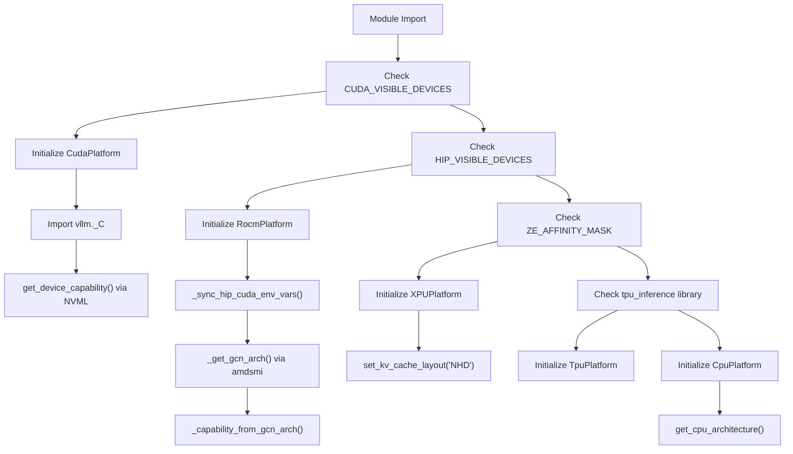
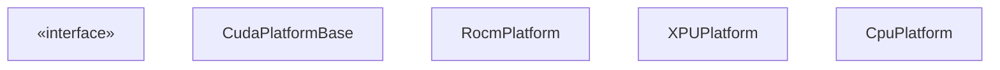
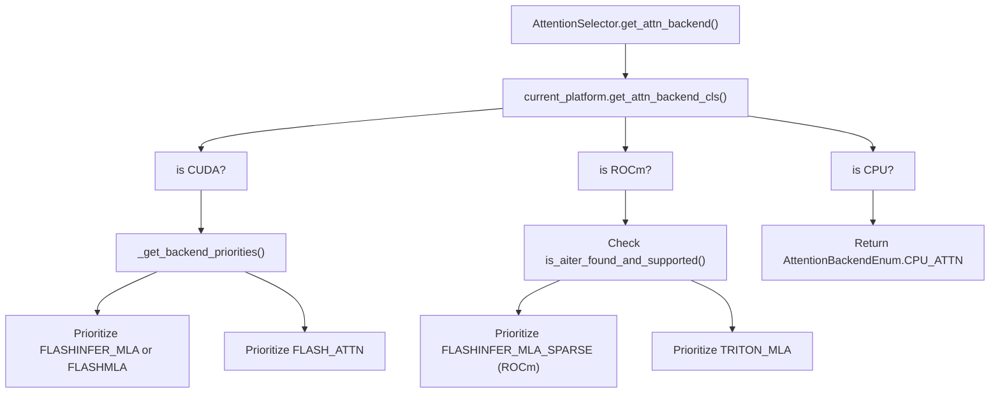

# 平台支持

相关源文件

-   [vllm/_aiter_ops.py](https://github.com/vllm-project/vllm/blob/7cc302dd/vllm/_aiter_ops.py)
-   [vllm/model_executor/layers/quantization/quark/schemes/quark_ocp_mx.py](https://github.com/vllm-project/vllm/blob/7cc302dd/vllm/model_executor/layers/quantization/quark/schemes/quark_ocp_mx.py)
-   [vllm/platforms/cpu.py](https://github.com/vllm-project/vllm/blob/7cc302dd/vllm/platforms/cpu.py)
-   [vllm/platforms/cuda.py](https://github.com/vllm-project/vllm/blob/7cc302dd/vllm/platforms/cuda.py)
-   [vllm/platforms/interface.py](https://github.com/vllm-project/vllm/blob/7cc302dd/vllm/platforms/interface.py)
-   [vllm/platforms/rocm.py](https://github.com/vllm-project/vllm/blob/7cc302dd/vllm/platforms/rocm.py)
-   [vllm/platforms/tpu.py](https://github.com/vllm-project/vllm/blob/7cc302dd/vllm/platforms/tpu.py)
-   [vllm/platforms/xpu.py](https://github.com/vllm-project/vllm/blob/7cc302dd/vllm/platforms/xpu.py)

## 目的与范围

本文档描述了 vLLM 的平台抽象层（platform abstraction layer），该层支持在 NVIDIA GPU (CUDA)、AMD GPU (ROCm)、Intel GPU (XPU)、CPU 和 TPU 上进行跨平台执行。平台层为硬件检测、设备能力查询、注意力后端（attention backend）选择以及平台特定的配置调整提供了统一的接口。

有关注意力后端实现，请参阅 [Attention Backends](/vllm-project/vllm/8-attention-backends)。有关分布式执行和通信后端，请参阅 [Distributed Execution](/vllm-project/vllm/9-distributed-execution)。

---

## 平台抽象架构

### 平台检测与初始化

vLLM 在模块加载时通过检查环境变量和库的可用性来检测硬件平台。检测遵循优先级顺序并初始化相应的平台单例（singleton）。

**来源：** [vllm/platforms/interface.py36-46](https://github.com/vllm-project/vllm/blob/7cc302dd/vllm/platforms/interface.py#L36-L46) [vllm/platforms/rocm.py70-91](https://github.com/vllm-project/vllm/blob/7cc302dd/vllm/platforms/rocm.py#L70-L91) [vllm/platforms/rocm.py125-146](https://github.com/vllm-project/vllm/blob/7cc302dd/vllm/platforms/rocm.py#L125-L146) [vllm/platforms/xpu.py31-40](https://github.com/vllm-project/vllm/blob/7cc302dd/vllm/platforms/xpu.py#L31-L40) [vllm/platforms/xpu.py55-61](https://github.com/vllm-project/vllm/blob/7cc302dd/vllm/platforms/xpu.py#L55-L61) [vllm/platforms/cpu.py72-79](https://github.com/vllm-project/vllm/blob/7cc302dd/vllm/platforms/cpu.py#L72-L79) [vllm/platforms/tpu.py9-21](https://github.com/vllm-project/vllm/blob/7cc302dd/vllm/platforms/tpu.py#L9-L21)

---

### 平台接口

`Platform` 基类定义了所有平台实现必须提供的接口。关键职责包括设备管理、配置验证和后端选择。

**来源：** [vllm/platforms/interface.py100-210](https://github.com/vllm-project/vllm/blob/7cc302dd/vllm/platforms/interface.py#L100-L210) [vllm/platforms/cuda.py128-140](https://github.com/vllm-project/vllm/blob/7cc302dd/vllm/platforms/cuda.py#L128-L140) [vllm/platforms/rocm.py355-385](https://github.com/vllm-project/vllm/blob/7cc302dd/vllm/platforms/rocm.py#L355-L385) [vllm/platforms/xpu.py31-40](https://github.com/vllm-project/vllm/blob/7cc302dd/vllm/platforms/xpu.py#L31-L40) [vllm/platforms/cpu.py72-79](https://github.com/vllm-project/vllm/blob/7cc302dd/vllm/platforms/cpu.py#L72-L79)

---

### 设备能力检测

每个平台都提供了查询硬件能力的方法，这些能力为后端选择和配置验证提供信息。能力通常表示为包含 `major`（主版本）和 `minor`（次版本）的 `DeviceCapability` 命名元组。

| 平台 | 能力表示 | 检测方法 | 关键属性 |
| --- | --- | --- | --- |
| **CUDA** | `DeviceCapability(major, minor)` | NVML API: `nvmlDeviceGetCudaComputeCapability()` | SM 版本 (例如, 8.0, 9.0, 10.0) |
| **ROCm** | `DeviceCapability(major, minor)` | GCN 架构字符串解析: `gfx942` → `(9, 4)` | GCN 系列 (gfx942, gfx11, 等) |
| **XPU** | `None` | 不适用 | 通过 `torch.xpu` 查询设备名称 |
| **CPU** | `None` | 不适用 | `CpuArchEnum` (x86, ARM, POWERPC, 等) |
| **TPU** | 未定义 | 外部包 | 来自 `tpu_inference` 的 TPU 版本 |

**来源：** [vllm/platforms/interface.py58-98](https://github.com/vllm-project/vllm/blob/7cc302dd/vllm/platforms/interface.py#L58-L98) [vllm/platforms/cuda.py164-165](https://github.com/vllm-project/vllm/blob/7cc302dd/vllm/platforms/cuda.py#L164-L165) [vllm/platforms/rocm.py155-204](https://github.com/vllm-project/vllm/blob/7cc302dd/vllm/platforms/rocm.py#L155-L204) [vllm/platforms/xpu.py128-134](https://github.com/vllm-project/vllm/blob/7cc302dd/vllm/platforms/xpu.py#L128-L134) [vllm/platforms/cpu.py81-98](https://github.com/vllm-project/vllm/blob/7cc302dd/vllm/platforms/cpu.py#L81-L98)

---

## 平台特定实现

### CUDA 平台

详情请参阅 [CUDA Platform](/vllm-project/vllm/10.2-cuda-platform)。

CUDA 平台支持 NVIDIA GPU。它利用 `pynvml` 进行硬件发现，而不会过早初始化 CUDA 上下文。它处理注意力的后端优先级，在 Blackwell (SM 10.0) 上优先选择 `FLASHINFER` 或 `FLASHMLA`，在旧架构上优先选择 `FLASH_ATTN`。

**来源：** [vllm/platforms/cuda.py43-113](https://github.com/vllm-project/vllm/blob/7cc302dd/vllm/platforms/cuda.py#L43-L113) [vllm/platforms/cuda.py128-183](https://github.com/vllm-project/vllm/blob/7cc302dd/vllm/platforms/cuda.py#L128-L183)

### ROCm 平台

详情请参阅 [ROCm Platform](/vllm-project/vllm/10.3-rocm-platform)。

ROCm 平台支持 AMD GPU。它使用 `amdsmi` 解析 GCN 架构字符串（例如，MI300X 为 `gfx942`）以确定能力。它支持用于 MoE 和 MLA 的专用 `AITER` 操作，并处理 `HIP_VISIBLE_DEVICES` 和 `CUDA_VISIBLE_DEVICES` 之间的环境变量同步。

**来源：** [vllm/platforms/rocm.py70-152](https://github.com/vllm-project/vllm/blob/7cc302dd/vllm/platforms/rocm.py#L70-L152) [vllm/platforms/rocm.py355-385](https://github.com/vllm-project/vllm/blob/7cc302dd/vllm/platforms/rocm.py#L355-L385) [vllm/_aiter_ops.py36-56](https://github.com/vllm-project/vllm/blob/7cc302dd/vllm/_aiter_ops.py#L36-L56)

### XPU, CPU, 和 TPU 平台

详情请参阅 [XPU, CPU, and TPU Platforms](/vllm-project/vllm/10.4-xpu-cpu-and-tpu-platforms)。

-   **XPU**：支持 Intel GPU。它强制使用 `NHD` KV 缓存布局并管理 `XPU Graph` 捕获限制。
-   **CPU**：支持多种架构 (x86, ARM, PowerPC)。它实现了 NUMA 感知内存分配，并利用 `Gloo` 分布式后端。
-   **TPU**：集成 `tpu_inference` 库以在 Google TPU 上执行。

**来源：** [vllm/platforms/xpu.py31-61](https://github.com/vllm-project/vllm/blob/7cc302dd/vllm/platforms/xpu.py#L31-L61) [vllm/platforms/cpu.py72-98](https://github.com/vllm-project/vllm/blob/7cc302dd/vllm/platforms/cpu.py#L72-L98) [vllm/platforms/tpu.py9-21](https://github.com/vllm-project/vllm/blob/7cc302dd/vllm/platforms/tpu.py#L9-L21)

---

## 注意力后端选择

平台层是选择最佳注意力后端的核心。每个平台实现提供 `get_attn_backend_cls` 或在 `_get_backend_priorities` 中定义优先级。

**来源：** [vllm/platforms/cuda.py51-113](https://github.com/vllm-project/vllm/blob/7cc302dd/vllm/platforms/cuda.py#L51-L113) [vllm/platforms/rocm.py309-353](https://github.com/vllm-project/vllm/blob/7cc302dd/vllm/platforms/rocm.py#L309-L353) [vllm/platforms/cpu.py105-117](https://github.com/vllm-project/vllm/blob/7cc302dd/vllm/platforms/cpu.py#L105-L117) [vllm/_aiter_ops.py36-56](https://github.com/vllm-project/vllm/blob/7cc302dd/vllm/_aiter_ops.py#L36-L56)

---

## 配置生命周期

平台通过验证和更新 `VllmConfig` 对象参与配置组装。

| 方法 | 角色 |
| --- | --- |
| `apply_config_platform_defaults` | 设置平台特定的默认值，如 `custom_ops` 和量化支持。 |
| `check_and_update_config` | 调整 `block_size`、`worker_cls`，并禁用不兼容的特性（例如某些硬件上的分块预填充 chunked prefill）。 |
| `update_block_size_for_backend` | 根据所选注意力后端的性能要求最终确定块大小。 |

**来源：** [vllm/platforms/interface.py397-472](https://github.com/vllm-project/vllm/blob/7cc302dd/vllm/platforms/interface.py#L397-L472) [vllm/platforms/cuda.py184-205](https://github.com/vllm-project/vllm/blob/7cc302dd/vllm/platforms/cuda.py#L184-L205) [vllm/platforms/cpu.py157-210](https://github.com/vllm-project/vllm/blob/7cc302dd/vllm/platforms/cpu.py#L157-210) [vllm/platforms/xpu.py162-229](https://github.com/vllm-project/vllm/blob/7cc302dd/vllm/platforms/xpu.py#L162-229)

---

## 测试平台支持

vLLM 使用专用测试来确保平台抽象能正确选择后端并处理设备特定限制。

-   `test_backend_selection`：验证硬件能力与注意力后端之间的映射。
-   `test_rocm_attention_selector`：专门测试 ROCm 特定的逻辑，如 AITER 激活。

**来源：** [vllm/platforms/rocm.py148-152](https://github.com/vllm-project/vllm/blob/7cc302dd/vllm/platforms/rocm.py#L148-L152) [vllm/_aiter_ops.py36-56](https://github.com/vllm-project/vllm/blob/7cc302dd/vllm/_aiter_ops.py#L36-L56)
