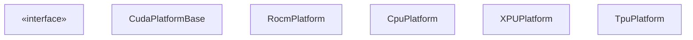
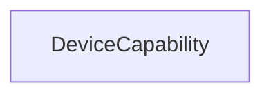
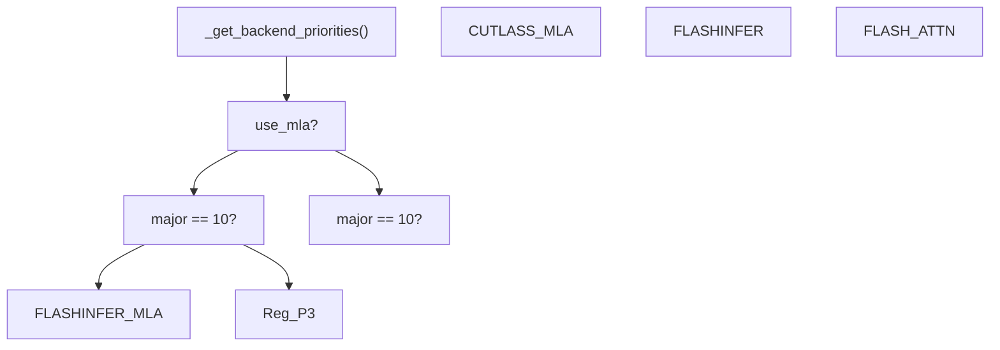
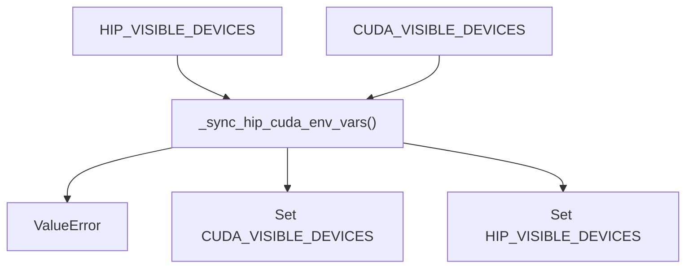

# 平台抽象层 (Platform Abstraction Layer)

相关源文件

-   [vllm/_aiter_ops.py](https://github.com/vllm-project/vllm/blob/7cc302dd/vllm/_aiter_ops.py)
-   [vllm/model_executor/layers/quantization/quark/schemes/quark_ocp_mx.py](https://github.com/vllm-project/vllm/blob/7cc302dd/vllm/model_executor/layers/quantization/quark/schemes/quark_ocp_mx.py)
-   [vllm/platforms/cpu.py](https://github.com/vllm-project/vllm/blob/7cc302dd/vllm/platforms/cpu.py)
-   [vllm/platforms/cuda.py](https://github.com/vllm-project/vllm/blob/7cc302dd/vllm/platforms/cuda.py)
-   [vllm/platforms/interface.py](https://github.com/vllm-project/vllm/blob/7cc302dd/vllm/platforms/interface.py)
-   [vllm/platforms/rocm.py](https://github.com/vllm-project/vllm/blob/7cc302dd/vllm/platforms/rocm.py)
-   [vllm/platforms/tpu.py](https://github.com/vllm-project/vllm/blob/7cc302dd/vllm/platforms/tpu.py)
-   [vllm/platforms/xpu.py](https://github.com/vllm-project/vllm/blob/7cc302dd/vllm/platforms/xpu.py)

平台抽象层为 vLLM 在不同硬件加速器（NVIDIA CUDA、AMD ROCm、Intel XPU、Google TPU 和 CPU）上运行提供了统一接口。该层封装了平台特定的设备能力、内核操作、后端选择逻辑和配置要求，使 vLLM 的其余代码库能够尽可能保持与硬件无关。

有关分布式通信后端的信息，请参阅 [Communication Infrastructure](/vllm-project/vllm/9.2-communication-infrastructure)。有关注意力后端实现的详细信息，请参阅 [Attention Backend Selection](/vllm-project/vllm/8.1-attention-backend-selection)。

---

## 架构概览

平台抽象层由一个定义公共接口的 `Platform` 基类和覆盖（override）方法以提供硬件特定行为的平台特定实现组成。每个平台实现负责设备检测、能力查询、内核导入、注意力后端选择和配置验证。

### 平台类层次结构 (Platform Class Hierarchy)

该层次结构遵循策略模式（strategy pattern），其中 `current_platform` 是在运行时确定的 `Platform` 子类的单例实例。

标题：平台类层次结构

**来源：** [vllm/platforms/interface.py100-205](https://github.com/vllm-project/vllm/blob/7cc302dd/vllm/platforms/interface.py#L100-L205) [vllm/platforms/cuda.py128-181](https://github.com/vllm-project/vllm/blob/7cc302dd/vllm/platforms/cuda.py#L128-L181) [vllm/platforms/rocm.py258-285](https://github.com/vllm-project/vllm/blob/7cc302dd/vllm/platforms/rocm.py#L258-L285) [vllm/platforms/cpu.py72-98](https://github.com/vllm-project/vllm/blob/7cc302dd/vllm/platforms/cpu.py#L72-L98) [vllm/platforms/xpu.py31-41](https://github.com/vllm-project/vllm/blob/7cc302dd/vllm/platforms/xpu.py#L31-L41) [vllm/platforms/tpu.py9-21](https://github.com/vllm-project/vllm/blob/7cc302dd/vllm/platforms/tpu.py#L9-L21)

---

## 平台枚举与检测

### PlatformEnum

`PlatformEnum` 定义了在整个代码库中用于条件逻辑的受支持硬件平台。

| 枚举值 | 描述 |
| --- | --- |
| `CUDA` | 支持 CUDA 的 NVIDIA GPU |
| `ROCM` | 支持 ROCm 的 AMD GPU |
| `TPU` | Google Cloud TPU |
| `XPU` | Intel GPU (Data Center GPU Max, Arc) |
| `CPU` | x86, ARM, PowerPC, RISC-V CPU |
| `OOT` | 树外（Out-of-tree）自定义平台 |
| `UNSPECIFIED` | 平台尚未确定 |

**来源：** [vllm/platforms/interface.py36-46](https://github.com/vllm-project/vllm/blob/7cc302dd/vllm/platforms/interface.py#L36-L46)

---

## 设备能力系统

`DeviceCapability` 类表示设备的计算能力，主要用于 CUDA/ROCm GPU 以确定功能支持（例如 FP8 或特定的注意力内核）。

### DeviceCapability 类

标题：设备能力数据结构

**DeviceCapability 方法：**

| 方法 | 描述 | 示例 |
| --- | --- | --- |
| `as_version_str()` | 返回 "major.minor" 字符串 | "8.0", "9.4" |
| `to_int()` | 返回 `major*10 + minor` | 80, 94 |
| 比较运算符 | 比较能力 | `DeviceCapability(8,0) < DeviceCapability(9,0)` |

**来源：** [vllm/platforms/interface.py58-98](https://github.com/vllm-project/vllm/blob/7cc302dd/vllm/platforms/interface.py#L58-L98)

---

## 平台基类

`Platform` 基类定义了所有平台实现必须遵循的接口。它包括 PyTorch 分发键（dispatch keys）和 Ray 特定的资源键。

### 核心平台属性

| 属性 | 用途 | 示例 (CUDA) |
| --- | --- | --- |
| `device_name` | 设备字符串标识符 | "cuda" |
| `dispatch_key` | PyTorch 内部分发键 | "CUDA" |
| `ray_device_key` | Ray actor 放置的资源键 | "GPU" |
| `dist_backend` | 默认 `torch.distributed` 后端 | "nccl" |
| `device_control_env_var` | 用于掩码设备的变量 | "CUDA_VISIBLE_DEVICES" |

**来源：** [vllm/platforms/interface.py100-141](https://github.com/vllm-project/vllm/blob/7cc302dd/vllm/platforms/interface.py#L100-L141) [vllm/platforms/cuda.py128-139](https://github.com/vllm-project/vllm/blob/7cc302dd/vllm/platforms/cuda.py#L128-L139)

---

## CUDA 平台

CUDA 平台支持 NVIDIA GPU。它利用 NVML（通过 `pynvml`）查询设备信息，而无需初始化 CUDA 上下文，这对于多进程协调至关重要。

### CUDA 注意力后端选择

CUDA 使用 `_get_backend_priorities` 根据设备的计算能力（Blackwell 为主版本 10）以及是否请求多潜变量注意力（Multi-Latent Attention, MLA）来对注意力内核进行排序。

标题：CUDA 注意力后端优先级逻辑

**来源：** [vllm/platforms/cuda.py50-113](https://github.com/vllm-project/vllm/blob/7cc302dd/vllm/platforms/cuda.py#L50-L113)

### CUDA 配置更新

在 `check_and_update_config()` 中，CUDA 平台：

1.  将默认 worker 设置为 `vllm.v1.worker.gpu_worker.Worker` [vllm/platforms/cuda.py188-189](https://github.com/vllm-project/vllm/blob/7cc302dd/vllm/platforms/cuda.py#L188-L189)
2.  针对特定模型类型禁用分块多模态输入（chunked multimodal input） [vllm/platforms/cuda.py193-203](https://github.com/vllm-project/vllm/blob/7cc302dd/vllm/platforms/cuda.py#L193-L203)

---

## ROCm 平台

ROCm 平台支持 AMD GPU。它执行广泛的环境同步，以确保 `HIP_VISIBLE_DEVICES` 和 `CUDA_VISIBLE_DEVICES` 保持一致。

### ROCm 架构检测

ROCm 使用 `amdsmi` 检测架构，以避免过早的 HIP 初始化。这允许 Ray worker 在导入模块后设置可见性。

| GCN 架构 | 检测标志 | 示例硬件 |
| --- | --- | --- |
| `gfx942`, `gfx950` | `_ON_MI3XX` | MI300X, MI325X |
| `gfx90a`, `gfx942` | `_ON_GFX9` | MI200, MI300 |
| `gfx11`, `gfx12` | `_ON_GFX1X` | Radeon RX 7900 |

**来源：** [vllm/platforms/rocm.py146-152](https://github.com/vllm-project/vllm/blob/7cc302dd/vllm/platforms/rocm.py#L146-L152) [vllm/platforms/rocm.py111-123](https://github.com/vllm-project/vllm/blob/7cc302dd/vllm/platforms/rocm.py#L111-L123)

### ROCm AITER 集成

ROCm 集成了 `aiter` 库以获得优化的内核（MoE, Attention）。`is_aiter_found_and_supported()` 检查可确保平台是 ROCm 且硬件为 MI3xx。

**来源：** [vllm/_aiter_ops.py36-56](https://github.com/vllm-project/vllm/blob/7cc302dd/vllm/_aiter_ops.py#L36-L56) [vllm/model_executor/layers/quantization/quark/schemes/quark_ocp_mx.py49-60](https://github.com/vllm-project/vllm/blob/7cc302dd/vllm/model_executor/layers/quantization/quark/schemes/quark_ocp_mx.py#L49-L60)

---

## CPU 平台

CPU 平台支持多种架构 (x86, ARM, PowerPC, RISC-V) 且具备 NUMA 感知能力。

### CPU 架构与内存

CPU 平台通过检查 `VLLM_CPU_KVCACHE_SPACE` 来计算 `kv_cache_space`。如果未设置，它默认为系统总内存的 50% 除以 NUMA 节点数，以防止多节点设置中的 OOM。

**来源：** [vllm/platforms/cpu.py120-143](https://github.com/vllm-project/vllm/blob/7cc302dd/vllm/platforms/cpu.py#L120-L143)

### CPU 配置限制

1.  **块大小 (Block Size)**：为了性能，优先选择 32 的倍数 [vllm/platforms/cpu.py168-173](https://github.com/vllm-project/vllm/blob/7cc302dd/vllm/platforms/cpu.py#L168-L173)
2.  **调度 (Scheduling)**：禁用 `async_scheduling`，因为 CPU 不需要它 [vllm/platforms/cpu.py176](https://github.com/vllm-project/vllm/blob/7cc302dd/vllm/platforms/cpu.py#L176-L176)
3.  **量化 (Quantization)**：不支持 KV 缓存量化；回退到 "auto" [vllm/platforms/cpu.py186-190](https://github.com/vllm-project/vllm/blob/7cc302dd/vllm/platforms/cpu.py#L186-L190)

---

## XPU 平台

XPU 平台支持 Intel GPU，并使用 `xccl` 分布式后端。

### XPU 特定逻辑

1.  **KV 缓存布局 (KV Cache Layout)**：强制将 `VLLM_KV_CACHE_LAYOUT` 设置为 `NHD`，因为这是 XPU 内核唯一支持的布局 [vllm/platforms/xpu.py57-61](https://github.com/vllm-project/vllm/blob/7cc302dd/vllm/platforms/xpu.py#L57-L61)
2.  **图支持 (Graph Support)**：如果 PyTorch 版本不支持 XPU 图或通过 `VLLM_XPU_ENABLE_XPU_GRAPH` 禁用了该功能，则禁用 `cudagraph_mode` [vllm/platforms/xpu.py179-190](https://github.com/vllm-project/vllm/blob/7cc302dd/vllm/platforms/xpu.py#L179-L190)

**来源：** [vllm/platforms/xpu.py54-90](https://github.com/vllm-project/vllm/blob/7cc302dd/vllm/platforms/xpu.py#L54-L90) [vllm/platforms/xpu.py162-192](https://github.com/vllm-project/vllm/blob/7cc302dd/vllm/platforms/xpu.py#L162-L192)

---

## 与平台无关的环境同步

ROCm 需要 HIP 和 CUDA 环境变量之间进行严格同步，以防止库冲突。

标题：ROCm 环境同步逻辑

**来源：** [vllm/platforms/rocm.py70-88](https://github.com/vllm-project/vllm/blob/7cc302dd/vllm/platforms/rocm.py#L70-L88)
