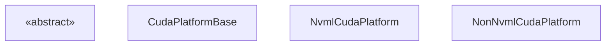
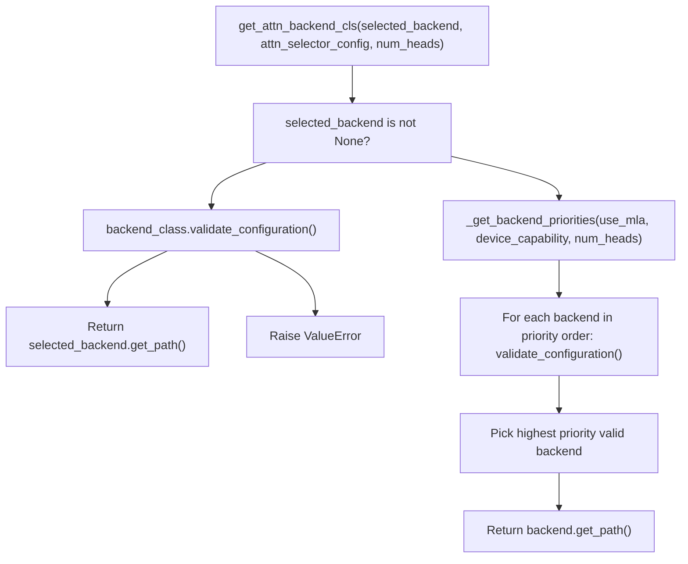
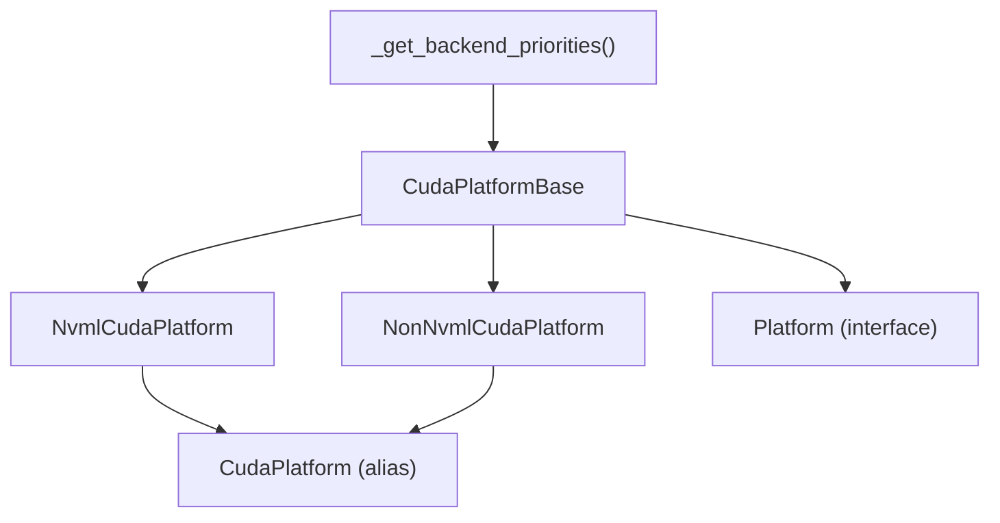

# CUDA 平台

相关源文件

-   [CMakeLists.txt](https://github.com/vllm-project/vllm/blob/7cc302dd/CMakeLists.txt)
-   [benchmarks/kernels/bench_cp_gather_fp8.py](https://github.com/vllm-project/vllm/blob/7cc302dd/benchmarks/kernels/bench_cp_gather_fp8.py)
-   [cmake/utils.cmake](https://github.com/vllm-project/vllm/blob/7cc302dd/cmake/utils.cmake)
-   [csrc/cache.h](https://github.com/vllm-project/vllm/blob/7cc302dd/csrc/cache.h)
-   [csrc/cache_kernels.cu](https://github.com/vllm-project/vllm/blob/7cc302dd/csrc/cache_kernels.cu)
-   [csrc/ops.h](https://github.com/vllm-project/vllm/blob/7cc302dd/csrc/ops.h)
-   [csrc/sampler.cu](https://github.com/vllm-project/vllm/blob/7cc302dd/csrc/sampler.cu)
-   [csrc/topk.cu](https://github.com/vllm-project/vllm/blob/7cc302dd/csrc/topk.cu)
-   [csrc/torch_bindings.cpp](https://github.com/vllm-project/vllm/blob/7cc302dd/csrc/torch_bindings.cpp)
-   [tests/kernels/attention/test_cache.py](https://github.com/vllm-project/vllm/blob/7cc302dd/tests/kernels/attention/test_cache.py)
-   [tests/kernels/attention/test_deepgemm_attention.py](https://github.com/vllm-project/vllm/blob/7cc302dd/tests/kernels/attention/test_deepgemm_attention.py)
-   [tests/kernels/test_apply_repetition_penalties.py](https://github.com/vllm-project/vllm/blob/7cc302dd/tests/kernels/test_apply_repetition_penalties.py)
-   [tests/kernels/test_cp_gather_fp8.py](https://github.com/vllm-project/vllm/blob/7cc302dd/tests/kernels/test_cp_gather_fp8.py)
-   [tests/kernels/test_top_k_per_row.py](https://github.com/vllm-project/vllm/blob/7cc302dd/tests/kernels/test_top_k_per_row.py)
-   [vllm/_aiter_ops.py](https://github.com/vllm-project/vllm/blob/7cc302dd/vllm/_aiter_ops.py)
-   [vllm/_custom_ops.py](https://github.com/vllm-project/vllm/blob/7cc302dd/vllm/_custom_ops.py)
-   [vllm/model_executor/layers/quantization/quark/schemes/quark_ocp_mx.py](https://github.com/vllm-project/vllm/blob/7cc302dd/vllm/model_executor/layers/quantization/quark/schemes/quark_ocp_mx.py)
-   [vllm/model_executor/layers/sparse_attn_indexer.py](https://github.com/vllm-project/vllm/blob/7cc302dd/vllm/model_executor/layers/sparse_attn_indexer.py)
-   [vllm/platforms/cpu.py](https://github.com/vllm-project/vllm/blob/7cc302dd/vllm/platforms/cpu.py)
-   [vllm/platforms/cuda.py](https://github.com/vllm-project/vllm/blob/7cc302dd/vllm/platforms/cuda.py)
-   [vllm/platforms/interface.py](https://github.com/vllm-project/vllm/blob/7cc302dd/vllm/platforms/interface.py)
-   [vllm/platforms/rocm.py](https://github.com/vllm-project/vllm/blob/7cc302dd/vllm/platforms/rocm.py)
-   [vllm/platforms/tpu.py](https://github.com/vllm-project/vllm/blob/7cc302dd/vllm/platforms/tpu.py)
-   [vllm/platforms/xpu.py](https://github.com/vllm-project/vllm/blob/7cc302dd/vllm/platforms/xpu.py)
-   [vllm/v1/attention/backends/mla/indexer.py](https://github.com/vllm-project/vllm/blob/7cc302dd/vllm/v1/attention/backends/mla/indexer.py)

本页记录了 vLLM 中的 CUDA 平台实现：类层次结构、设备能力检测、注意力后端选择逻辑、内存管理以及针对 NVIDIA GPU 的特定配置验证。

有关 `CudaPlatform` 实现的抽象 `Platform` 接口背景，请参阅 [Platform Abstraction Layer](/vllm-project/vllm/10.1-platform-abstraction-layer)。有关遵循类似但不同模式的 ROCm 实现，请参阅 [ROCm Platform](/vllm-project/vllm/10.3-rocm-platform)。

---

## 类层次结构 (Class Hierarchy)

CUDA 平台通过三个具体类和一个模块级别别名来实现。在导入时，vLLM 根据 NVML (NVIDIA Management Library) 是否可用自动在两个实现之间进行选择。

**类层次结构图**


模块级别别名 `CudaPlatform` 是在 `vllm/platforms/cuda.py` 底部根据 `nvml_available` 赋值的。

来源：[vllm/platforms/cuda.py128-735](https://github.com/vllm-project/vllm/blob/7cc302dd/vllm/platforms/cuda.py#L128-L735) [vllm/platforms/interface.py100-204](https://github.com/vllm-project/vllm/blob/7cc302dd/vllm/platforms/interface.py#L100-L204)

---

## NVML 与 Non-NVML 的选择

在导入时，`vllm/platforms/cuda.py` 尝试通过 `import_pynvml()` 导入 `pynvml`。如果成功，则使用 `NvmlCudaPlatform`。否则，回退到 `NonNvmlCudaPlatform`，后者直接使用 `torch.cuda` 调用。

| 特性 | `NvmlCudaPlatform` | `NonNvmlCudaPlatform` |
| --- | --- | --- |
| 计算能力 | 通过 `pynvml.nvmlDeviceGetCudaComputeCapability` | 通过 `torch.cuda.get_device_capability` |
| 设备名称 | 通过 `pynvml.nvmlDeviceGetName` | 通过 `torch.cuda.get_device_name` |
| 总内存 | 通过 `pynvml.nvmlDeviceGetMemoryInfo` | 通过 `torch.cuda.get_device_properties().total_memory` |
| NVLink 检查 | 通过 `pynvml.nvmlDeviceGetP2PStatus` | 返回 `False`, 记录警告 |
| 设备 UUID | 通过 `pynvml.nvmlDeviceGetUUID` | 未实现 |
| CUDA 上下文初始化 | 避免初始化 (NVML 是独立的) | 首次调用时初始化 CUDA 上下文 |

NVML 的关键优势在于它可以在**不初始化 CUDA 上下文**的情况下查询设备属性，这对于基于 Ray 的部署非常重要，因为 worker 在模块导入后设置 `CUDA_VISIBLE_DEVICES`。

来源：[vllm/platforms/cuda.py43](https://github.com/vllm-project/vllm/blob/7cc302dd/vllm/platforms/cuda.py#L43-L43) [vllm/platforms/cuda.py598-735](https://github.com/vllm-project/vllm/blob/7cc302dd/vllm/platforms/cuda.py#L598-L735)

---

## 设备能力检测

`DeviceCapability` 是一个带有 `major` 和 `minor` 字段的 `NamedTuple`，定义在 `vllm/platforms/interface.py` 中。实现了比较运算符，因此像 `has_device_capability(80)` 这样的能力检查可以简洁地工作。

`NvmlCudaPlatform.get_device_capability` 使用 `with_nvml_context` 装饰器在调用前后封装 `pynvml` 的初始化/关闭：

```
@cache
@with_nvml_context
def get_device_capability(cls, device_id: int = 0) -> DeviceCapability | None:
    physical_device_id = cls.device_id_to_physical_device_id(device_id)
    handle = pynvml.nvmlDeviceGetHandleByIndex(physical_device_id)
    major, minor = pynvml.nvmlDeviceGetCudaComputeCapability(handle)
    return DeviceCapability(major=major, minor=minor)
```
`device_id_to_physical_device_id` 方法（继承自 `Platform`）读取 `CUDA_VISIBLE_DEVICES` 以将逻辑设备 ID 映射到物理设备 ID。

来源：[vllm/platforms/cuda.py116-125](https://github.com/vllm-project/vllm/blob/7cc302dd/vllm/platforms/cuda.py#L116-L125) [vllm/platforms/cuda.py602-613](https://github.com/vllm-project/vllm/blob/7cc302dd/vllm/platforms/cuda.py#L602-L613) [vllm/platforms/interface.py58-98](https://github.com/vllm-project/vllm/blob/7cc302dd/vllm/platforms/interface.py#L58-L98) [vllm/platforms/interface.py209-222](https://github.com/vllm-project/vllm/blob/7cc302dd/vllm/platforms/interface.py#L209-L222)

### vLLM 中使用的能力阈值

| 最低能力 | 整数值 | GPU 系列 | 解锁功能 |
| --- | --- | --- | --- |
| 6.0 | 60 | Pascal, Volta, Turing | FP16 支持 |
| 8.0 | 80 | Ampere, Hopper | BF16 支持 |
| 8.9 | 89 | Ada Lovelace, H100 | FP8 支持 |
| 10.x | 100 | Blackwell | 优先选择 FlashInfer MLA / CUTLASS MLA |

来源：[vllm/platforms/cuda.py142-150](https://github.com/vllm-project/vllm/blob/7cc302dd/vllm/platforms/cuda.py#L142-L150) [vllm/platforms/cuda.py488-491](https://github.com/vllm-project/vllm/blob/7cc302dd/vllm/platforms/cuda.py#L488-L491)

---

## 注意力后端选择

`CudaPlatformBase.get_attn_backend_cls` 实现了一个选择过程，通过 `_get_backend_priorities` 构建一个优先级的候选列表。

**后端优先级选择流程**


来源：[vllm/platforms/cuda.py359-429](https://github.com/vllm-project/vllm/blob/7cc302dd/vllm/platforms/cuda.py#L359-L429)

### 后端优先级表

`_get_backend_priorities`（已缓存）根据 `use_mla` 和 `device_capability.major` 返回不同的排序。

**非 MLA 后端 (Non-MLA backends)**

| 优先级 | Blackwell (CC 10.x) | 其他 NVIDIA GPU |
| --- | --- | --- |
| 1 | `FLASHINFER` | `FLASH_ATTN` |
| 2 | `FLASH_ATTN` | `FLASHINFER` |
| 3 | `TRITON_ATTN` | `TRITON_ATTN` |
| 4 | `FLEX_ATTENTION` | `FLEX_ATTENTION` |

**MLA 后端 (MLA backends)**

| 优先级 | Blackwell (CC 10.x) | 其他 NVIDIA GPU |
| --- | --- | --- |
| 1 | `FLASHINFER_MLA` | `FLASH_ATTN_MLA` |
| 2 | `CUTLASS_MLA` | `FLASHMLA` |
| 3 | `FLASH_ATTN_MLA` | `FLASHINFER_MLA` |
| 4 | `FLASHMLA` | `TRITON_MLA` |
| 5 | `TRITON_MLA` | `FLASHMLA_SPARSE` |

在支持 MLA 的 Blackwell 上，如果 `kv_cache_dtype` 为 `fp8`，则 `FLASHINFER_MLA_SPARSE` 优于 `FLASHMLA_SPARSE`。

来源：[vllm/platforms/cuda.py51-113](https://github.com/vllm-project/vllm/blob/7cc302dd/vllm/platforms/cuda.py#L51-L113)

---

## 配置验证：`check_and_update_config`

在引擎初始化期间调用 `CudaPlatformBase.check_and_update_config`，以对 `VllmConfig` 实施 CUDA 特定的约束。

**职责：**

1.  **Worker 类**：如果 `parallel_config.worker_cls == "auto"`，则将其设置为 `"vllm.v1.worker.gpu_worker.Worker"`。
2.  **KV 缓存块大小 (KV cache block size)**：如果尚未设置，则设置 `cache_config.block_size = 16`。
3.  **MLA 块大小强制实施**：
    -   `FLASHMLA`: 64
    -   `CUTLASS_MLA`: 128
    -   `FLASHINFER_MLA`: 32 或 64
4.  **多模态分块 (Multimodal chunking)**：如果模型使用 `is_mm_prefix_lm`，则强制设置 `scheduler_config.disable_chunked_mm_input = True`。

来源：[vllm/platforms/cuda.py184-314](https://github.com/vllm-project/vllm/blob/7cc302dd/vllm/platforms/cuda.py#L184-L314)

---

## 内存管理

`CudaPlatformBase` 提供了 GPU 内存操作的实现：

### 当前内存使用量

```
@classmethod
def get_current_memory_usage(cls, device=None) -> float:
    torch.cuda.empty_cache()
    torch.cuda.reset_peak_memory_stats(device)
    return torch.cuda.max_memory_allocated(device)
```
来源：[vllm/platforms/cuda.py316-323](https://github.com/vllm-project/vllm/blob/7cc302dd/vllm/platforms/cuda.py#L316-L323)

### 块传输工具 (Block Transfer Utilities)

| 方法 | 操作 |
| --- | --- |
| `insert_blocks_to_device` | GPU → GPU: 在缓存张量之间复制块。 |
| `swap_out_blocks_to_host` | GPU → CPU: 将块复制到主机内存。 |

来源：[vllm/platforms/cuda.py561-584](https://github.com/vllm-project/vllm/blob/7cc302dd/vllm/platforms/cuda.py#L561-L584)

---

## NVLink 连接性检查

`NvmlCudaPlatform.is_fully_connected` 查询每一对物理设备 ID 的 `pynvml.nvmlDeviceGetP2PStatus`。它检查 `NVML_P2P_CAPS_INDEX_NVLINK` 能力，以确保组中的所有设备都可以通过 NVLink 进行通信。

来源：[vllm/platforms/cuda.py647-671](https://github.com/vllm-project/vllm/blob/7cc302dd/vllm/platforms/cuda.py#L647-L671)

---

## Dtype 与 FP8 支持

`CudaPlatformBase.supported_dtypes` 返回一个受能力门控的列表：

-   CC >= 8.0: `[bfloat16, float16, float32]`
-   CC >= 6.0: `[float16, float32]`
-   否则: `[float32]`

当 `has_device_capability(89)` 时，`supports_fp8()` 返回 `True`。

来源：[vllm/platforms/cuda.py141-150](https://github.com/vllm-project/vllm/blob/7cc302dd/vllm/platforms/cuda.py#L141-L150) [vllm/platforms/cuda.py488-491](https://github.com/vllm-project/vllm/blob/7cc302dd/vllm/platforms/cuda.py#L488-L491)

---

## 自定义算子与内核 (Custom Ops and Kernels)

CUDA 平台集成了几个自定义 C++ 和 CUDA 内核，用于对性能至关重要的操作。这些通过 `csrc/torch_bindings.cpp` 中的 `TORCH_LIBRARY_EXPAND` 注册。

| 算子类别 | 代码实体 |
| --- | --- |
| 注意力 (Attention) | `paged_attention_v1`, `paged_attention_v2`, `merge_attn_states` |
| 归一化 (Normalization) | `rms_norm`, `fused_add_rms_norm`, `fused_qk_norm_rope` |
| 激活 (Activation) | `silu_and_mul`, `gelu_and_mul`, `fatrelu_and_mul` |
| MoE | `topk_softmax`, `moe_align_block_size`, `moe_sum` |

来源：[csrc/torch_bindings.cpp19-172](https://github.com/vllm-project/vllm/blob/7cc302dd/csrc/torch_bindings.cpp#L19-L172) [vllm/_custom_ops.py108-200](https://github.com/vllm-project/vllm/blob/7cc302dd/vllm/_custom_ops.py#L108-L200)

---

## 模块级副作用 (Module-Level Side Effects)

导入 `vllm/platforms/cuda.py` 时，会发生几个副作用：

| 副作用 | 目的 |
| --- | --- |
| `import vllm._C` | 触发自定义 CUDA 算子的注册。 |
| `torch.backends.cuda.enable_cudnn_sdp(False)` | 禁用 cuDNN SDPA 以避免在某些模型上崩溃。 |
| `import_pynvml()` | 探测 NVML 的可用性。 |

来源：[vllm/platforms/cuda.py21](https://github.com/vllm-project/vllm/blob/7cc302dd/vllm/platforms/cuda.py#L21-L21) [vllm/platforms/cuda.py43-47](https://github.com/vllm-project/vllm/blob/7cc302dd/vllm/platforms/cuda.py#L43-L47)

---

## 摘要：关键类职责


来源：[vllm/platforms/cuda.py51-113](https://github.com/vllm-project/vllm/blob/7cc302dd/vllm/platforms/cuda.py#L51-L113) [vllm/platforms/cuda.py128-735](https://github.com/vllm-project/vllm/blob/7cc302dd/vllm/platforms/cuda.py#L128-L735)
