# ROCm 平台

相关源文件

-   [csrc/rocm/attention.cu](https://github.com/vllm-project/vllm/blob/7cc302dd/csrc/rocm/attention.cu)
-   [csrc/rocm/ops.h](https://github.com/vllm-project/vllm/blob/7cc302dd/csrc/rocm/ops.h)
-   [csrc/rocm/skinny_gemms.cu](https://github.com/vllm-project/vllm/blob/7cc302dd/csrc/rocm/skinny_gemms.cu)
-   [csrc/rocm/torch_bindings.cpp](https://github.com/vllm-project/vllm/blob/7cc302dd/csrc/rocm/torch_bindings.cpp)
-   [tests/kernels/quantization/test_rocm_skinny_gemms.py](https://github.com/vllm-project/vllm/blob/7cc302dd/tests/kernels/quantization/test_rocm_skinny_gemms.py)
-   [tests/model_executor/layers/test_rocm_unquantized_gemm.py](https://github.com/vllm-project/vllm/blob/7cc302dd/tests/model_executor/layers/test_rocm_unquantized_gemm.py)
-   [vllm/_aiter_ops.py](https://github.com/vllm-project/vllm/blob/7cc302dd/vllm/_aiter_ops.py)
-   [vllm/model_executor/layers/quantization/compressed_tensors/schemes/compressed_tensors_24.py](https://github.com/vllm-project/vllm/blob/7cc302dd/vllm/model_executor/layers/quantization/compressed_tensors/schemes/compressed_tensors_24.py)
-   [vllm/model_executor/layers/quantization/quark/schemes/quark_ocp_mx.py](https://github.com/vllm-project/vllm/blob/7cc302dd/vllm/model_executor/layers/quantization/quark/schemes/quark_ocp_mx.py)
-   [vllm/model_executor/layers/quantization/utils/w8a8_utils.py](https://github.com/vllm-project/vllm/blob/7cc302dd/vllm/model_executor/layers/quantization/utils/w8a8_utils.py)
-   [vllm/model_executor/layers/utils.py](https://github.com/vllm-project/vllm/blob/7cc302dd/vllm/model_executor/layers/utils.py)
-   [vllm/platforms/cpu.py](https://github.com/vllm-project/vllm/blob/7cc302dd/vllm/platforms/cpu.py)
-   [vllm/platforms/cuda.py](https://github.com/vllm-project/vllm/blob/7cc302dd/vllm/platforms/cuda.py)
-   [vllm/platforms/interface.py](https://github.com/vllm-project/vllm/blob/7cc302dd/vllm/platforms/interface.py)
-   [vllm/platforms/rocm.py](https://github.com/vllm-project/vllm/blob/7cc302dd/vllm/platforms/rocm.py)
-   [vllm/platforms/tpu.py](https://github.com/vllm-project/vllm/blob/7cc302dd/vllm/platforms/tpu.py)
-   [vllm/platforms/xpu.py](https://github.com/vllm-project/vllm/blob/7cc302dd/vllm/platforms/xpu.py)

## 目的与范围

本文档描述了 vLLM 中的 ROCm 平台实现，该实现通过 HIP/ROCm 生态系统提供 AMD GPU 支持。ROCm 平台负责设备检测、GCN 架构识别、AITER 操作集成，以及针对 MI300X、MI325X 和其他 AMD 加速器的 AMD 特定优化。

有关通用平台抽象概念，请参阅 [Platform Abstraction Layer](/vllm-project/vllm/10.1-platform-abstraction-layer)。有关 CUDA 平台的详细信息，请参阅 [CUDA Platform](/vllm-project/vllm/10.2-cuda-platform)。有关注意力后端的详细信息，请参阅 [ROCm and Platform-Specific Attention](/vllm-project/vllm/8.4-rocm-and-platform-specific-attention)。

## 平台检测与环境设置

### 环境变量同步

ROCm 平台在模块导入时同步 GPU 可见性环境变量，以确保 HIP 和 CUDA 惯例之间的一致性：

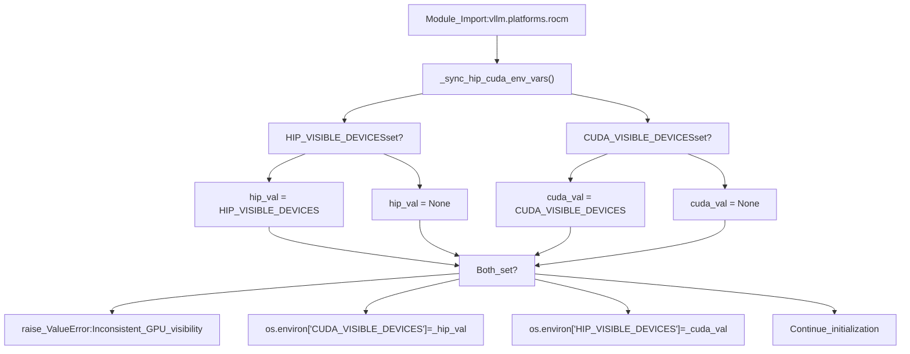
来源：[vllm/platforms/rocm.py70-91](https://github.com/vllm-project/vllm/blob/7cc302dd/vllm/platforms/rocm.py#L70-L91)

### GCN 架构检测

平台在模块加载时使用 AMDSMI 检测 GCN (Graphics Core Next) 架构，以避免 CUDA 初始化：

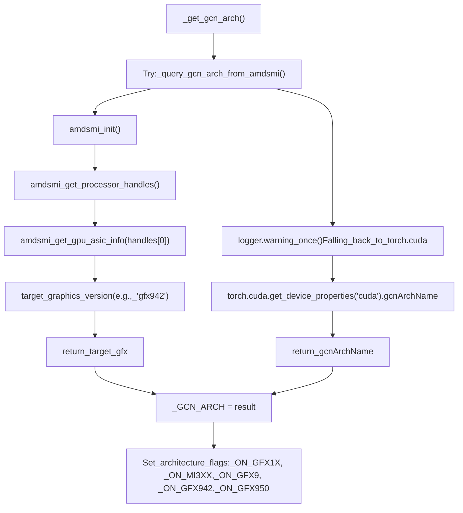
检测到的架构驱动整个代码库中的硬件特定优化：

| 架构标志 | GCN 模式 | 硬件示例 | 关键特性 |
| --- | --- | --- | --- |
| `_ON_GFX1X` | `gfx11`, `gfx12` | RDNA3 (RX 7900 XTX) | Triton Flash Attention |
| `_ON_MI3XX` | `gfx942`, `gfx950` | MI300X, MI325X | 原生 FP8 FNUZ, XGMI |
| `_ON_GFX9` | `gfx90a`, `gfx942`, `gfx950` | MI200/300 系列 | 自定义 Paged Attention |
| `_ON_GFX942` | `gfx942` | MI300X, MI308X | FP8 FNUZ 格式 |
| `_ON_GFX950` | `gfx950` | MI325X | MX 格式支持 |

来源：[vllm/platforms/rocm.py125-152](https://github.com/vllm-project/vllm/blob/7cc302dd/vllm/platforms/rocm.py#L125-L152)

### 设备能力解析

平台从 GCN 架构字符串中解析设备能力，以启用计算能力检查：

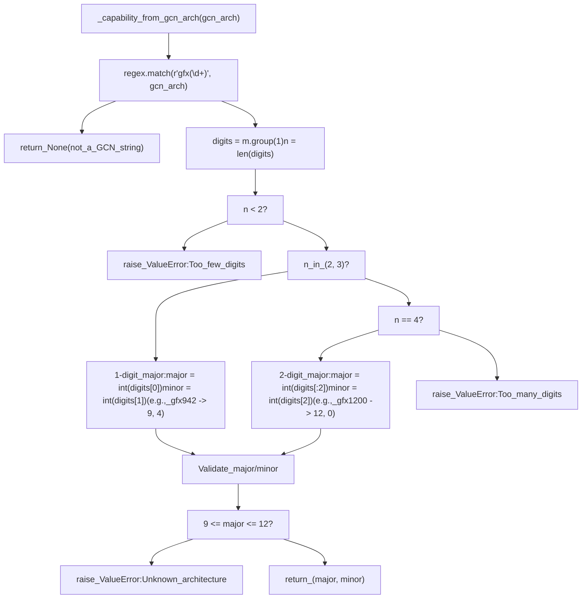
**示例映射：**

-   `gfx90a` → `(9, 0)` - MI200 系列
-   `gfx942` → `(9, 4)` - MI300X/MI308X/MI325X
-   `gfx950` → `(9, 5)` - 未来的 MI300 变体
-   `gfx1100` → `(11, 0)` - RDNA3 (RX 7900 XTX)
-   `gfx1200` → `(12, 0)` - RDNA4

来源：[vllm/platforms/rocm.py155-203](https://github.com/vllm-project/vllm/blob/7cc302dd/vllm/platforms/rocm.py#L155-L203)

## 硬件支持与设备管理

### 受支持的 AMD 设备

平台维护了从 PCI 设备 ID 到商用 GPU 名称的映射：

```mermaid
flowchart TD
    MI300A["0x74a0AMD_Instinct_MI300A"]
    MI300X_1["0x74a1AMD_Instinct_MI300X"]
    MI300X_VF["0x74b5AMD_Instinct_MI300X_VF"]
    MI308X["0x74a2AMD_Instinct_MI308X"]
    MI325X_1["0x74a5AMD_Instinct_MI325X"]
    MI325X_VF["0x74b9AMD_Instinct_MI325X_VF"]
    MI300X_HF["0x74a9AMD_Instinct_MI300X_HF"]
    MI300X_HF2["0x74bdAMD_Instinct_MI300X_HF"]
    RX7900XTX["0x744cAMD_Radeon_RX7900XTX"]
```
来源：[vllm/platforms/rocm.py57-67](https://github.com/vllm-project/vllm/blob/7cc302dd/vllm/platforms/rocm.py#L57-L67)

### AMDSMI 集成

平台使用 AMDSMI (AMD System Management Interface) 进行设备查询，而无需初始化 CUDA 上下文：

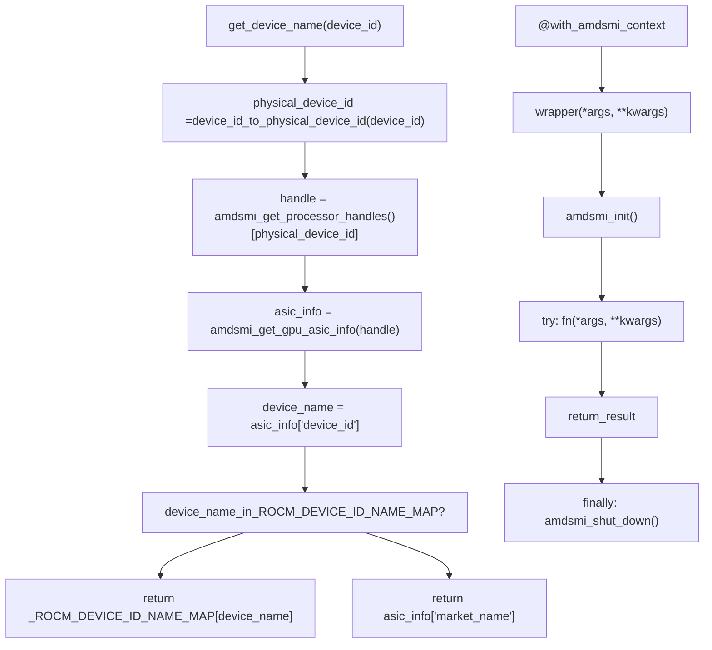
来源：[vllm/platforms/rocm.py99-108](https://github.com/vllm-project/vllm/blob/7cc302dd/vllm/platforms/rocm.py#L99-L108) [vllm/platforms/rocm.py599-609](https://github.com/vllm-project/vllm/blob/7cc302dd/vllm/platforms/rocm.py#L599-L609)

### 拓扑检测

平台检测 XGMI（AMD 的高速 GPU 互连）拓扑以优化多 GPU 配置：

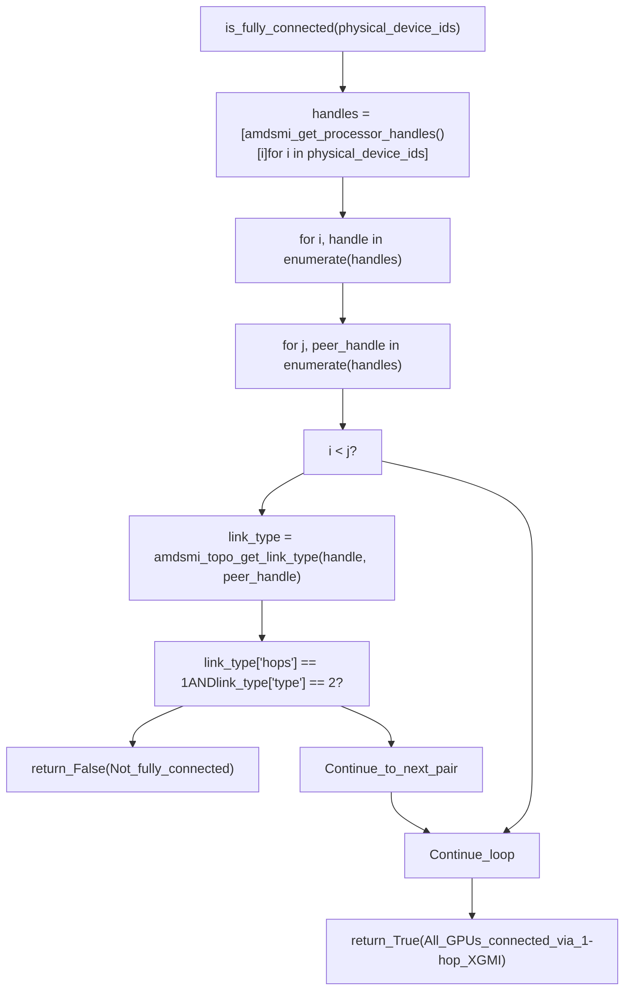
**XGMI 链路类型值：**

-   `type == 2`: XGMI 链路（高速互连）
-   `hops == 1`: 直接连接（张量并行的最佳选择）

来源：[vllm/platforms/rocm.py579-597](https://github.com/vllm-project/vllm/blob/7cc302dd/vllm/platforms/rocm.py#L579-L597)

## 注意力后端选择

### 后端优先级系统

ROCm 平台使用基于优先级的系统，根据模型架构和环境配置选择注意力后端：

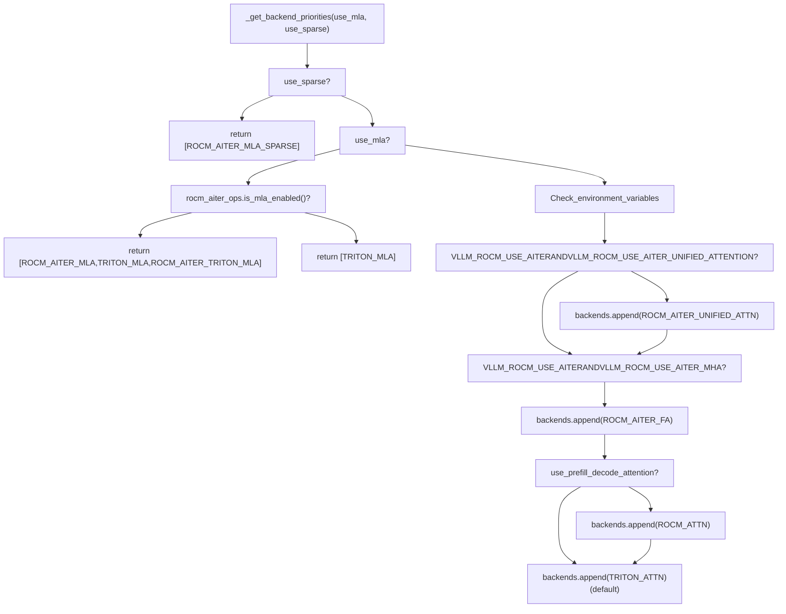
**后端特征：**

| 后端 | 架构 | 配置 | 块大小 | 特性 |
| --- | --- | --- | --- | --- |
| `ROCM_AITER_MLA` | MLA | 启用 AITER | 1 | 原生 MLA 支持 |
| `TRITON_MLA` | MLA | 回退 | 任意 | 基于 Triton 的 MLA |
| `ROCM_AITER_TRITON_MLA` | MLA | AITER + Triton | 任意 | 混合方案 |
| `ROCM_AITER_UNIFIED_ATTN` | 标准 | AITER 统一 | 64 | 所有阶段使用单一内核 |
| `ROCM_AITER_FA` | 标准 | AITER MHA | 16 | 相当于 Flash Attention |
| `ROCM_ATTN` | 标准 | 预填充-解码分离 | 16 | 分离预填充/解码 |
| `TRITON_ATTN` | 标准 | 默认 | 任意 | PyTorch Triton |

来源：[vllm/platforms/rocm.py309-352](https://github.com/vllm-project/vllm/blob/7cc302dd/vllm/platforms/rocm.py#L309-L352)

### 后端验证与选择

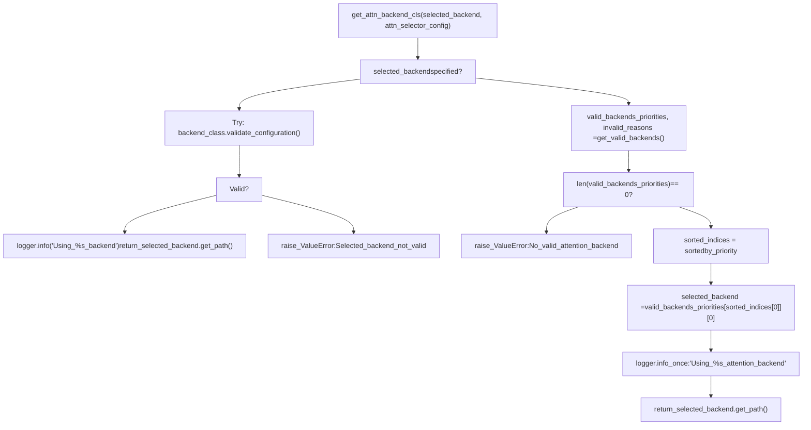
来源：[vllm/platforms/rocm.py431-501](https://github.com/vllm-project/vllm/blob/7cc302dd/vllm/platforms/rocm.py#L431-L501)

### 自定义 Paged Attention 选择

ROCm 平台提供了针对特定硬件配置优化的自定义 Paged Attention 内核：

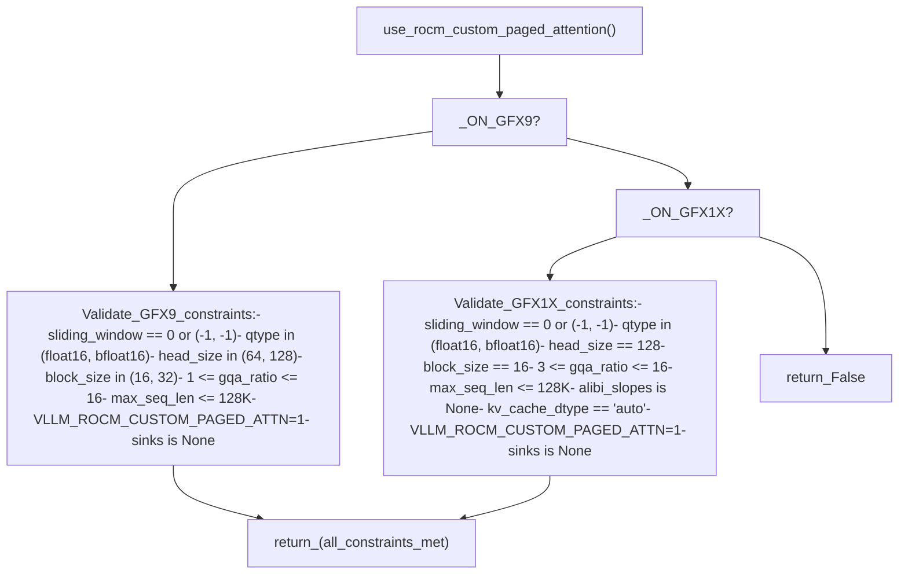
来源：[vllm/platforms/rocm.py245-284](https://github.com/vllm-project/vllm/blob/7cc302dd/vllm/platforms/rocm.py#L245-L284)

### Vision Transformer (ViT) 注意力

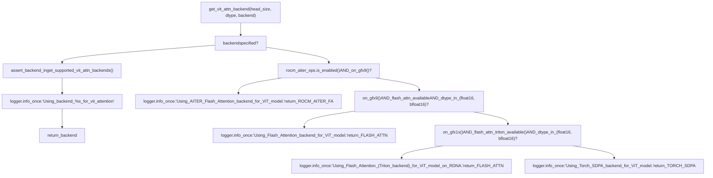
**受支持的 ViT 后端：**

-   `AttentionBackendEnum.FLASH_ATTN` - Flash Attention (需要安装)
-   `AttentionBackendEnum.ROCM_AITER_FA` - AITER Flash Attention
-   `AttentionBackendEnum.TRITON_ATTN` - Triton Attention
-   `AttentionBackendEnum.TORCH_SDPA` - PyTorch SDPA (回退)

来源：[vllm/platforms/rocm.py503-555](https://github.com/vllm-project/vllm/blob/7cc302dd/vllm/platforms/rocm.py#L503-L555)

## 量化与精度支持

### FP8 与 FNUZ 格式

ROCm 平台为 MI300 系列 GPU 提供了带 FNUZ (Finite-No-Underflow-Zero) 格式的原生 FP8 支持：

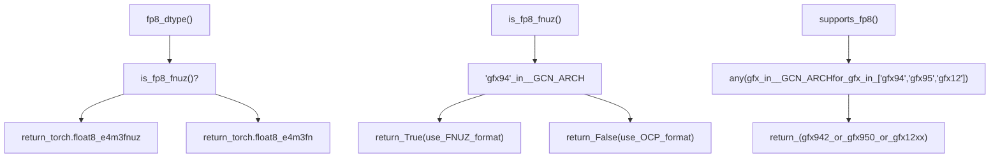
**FP8 格式比较：**

| 格式 | 硬件 | 规范 | 范围 | 精度 | 用例 |
| --- | --- | --- | --- | --- | --- |
| **FNUZ** | MI300X, MI325X (gfx942, gfx950) | AMD 专有 | 仅有限值, 无 NaN/Inf, -0 映射到 0 | E4M3 | 原生 AMD 硬件支持 |
| **OCP** | RDNA4 (gfx12xx) | Open Compute Project | 标准类 IEEE | E4M3/E5M2 | 跨平台兼容性 |

来源：[vllm/platforms/rocm.py760-777](https://github.com/vllm-project/vllm/blob/7cc302dd/vllm/platforms/rocm.py#L760-L777)

### MX 格式支持

平台检测用于高级量化的 MX (Microscaling) 格式支持：

```
def supports_mx(cls) -> bool:    """Returns whether the current platform supports MX types."""    return any(gfx in _GCN_ARCH for gfx in ["gfx95"])
```
目前，仅 gfx950 (MI325X) 支持 MX 格式。

来源：[vllm/platforms/rocm.py759-761](https://github.com/vllm-project/vllm/blob/7cc302dd/vllm/platforms/rocm.py#L759-L761)

### 受支持的量化方法

```mermaid
flowchart TD
    Support["supported_quantization"]
    AWQ["awq(triton-based)"]
    AWQMarlin["awq_marlin(overwritten_with_awq)"]
    GPTQ["gptq"]
    GPTQMarlin["gptq_marlin(overwritten_with_gptq)"]
    FP8["fp8(native_FNUZ_on_MI300)"]
    CompressedTensors["compressed-tensors"]
    FBGEMMFP8["fbgemm_fp8"]
    GGUF["gguf"]
    Quark["quark(AMD-optimized)"]
    PTPC["ptpc_fp8"]
    MXFP4["mxfp4(requires_gfx950)"]
    PetitNVFP4["petit_nvfp4"]
    TorchAO["torchao"]
    BitsAndBytes["bitsandbytes"]

    Support --> AWQ
    Support --> AWQMarlin
    Support --> GPTQ
    Support --> GPTQMarlin
    Support --> FP8
    Support --> CompressedTensors
    Support --> FBGEMMFP8
    Support --> GGUF
    Support --> Quark
    Support --> PTPC
    Support --> MXFP4
    Support --> PetitNVFP4
    Support --> TorchAO
    Support --> BitsAndBytes
```
来源：[vllm/platforms/rocm.py370-385](https://github.com/vllm-project/vllm/blob/7cc302dd/vllm/platforms/rocm.py#L370-L385)

### 量化配置

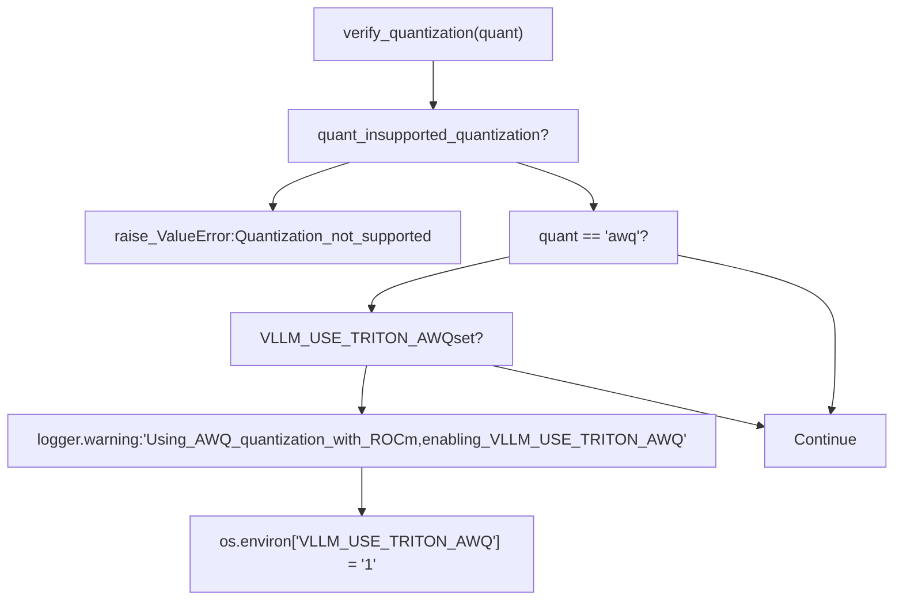
来源：[vllm/platforms/rocm.py731-739](https://github.com/vllm-project/vllm/blob/7cc302dd/vllm/platforms/rocm.py#L731-L739)

## 平台配置

### 配置应用流程

> **[Mermaid sequence]**
> *(图表结构无法解析)*

来源：[vllm/platforms/rocm.py616-662](https://github.com/vllm-project/vllm/blob/7cc302dd/vllm/platforms/rocm.py#L616-L662)

### 块大小配置

平台根据注意力后端要求调整 KV 缓存块大小：

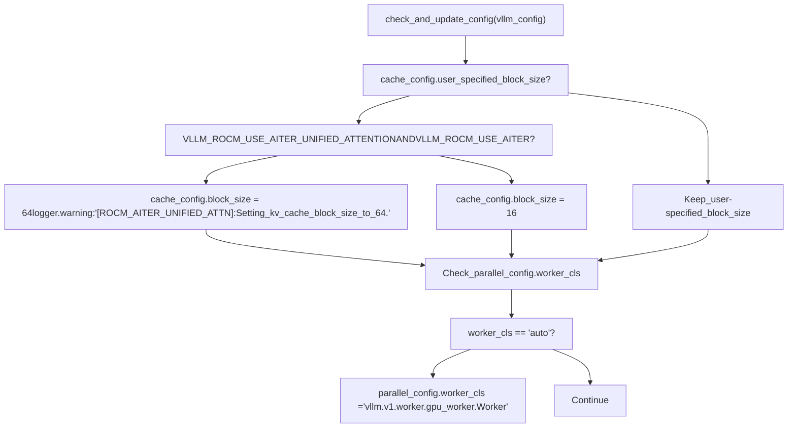
**块大小指南：**

-   **块大小 64**: AITER Unified Attention 需要（内存效率更高）
-   **块大小 16**: 其他 ROCm 后端的默认值（兼容性更好）
-   **用户指定**: 如果通过 `--block-size` 明确设置，则予以保留

来源：[vllm/platforms/rocm.py664-715](https://github.com/vllm-project/vllm/blob/7cc302dd/vllm/platforms/rocm.py#L664-L715)

### CUDA 图模式处理 (CUDA Graph Mode Handling)

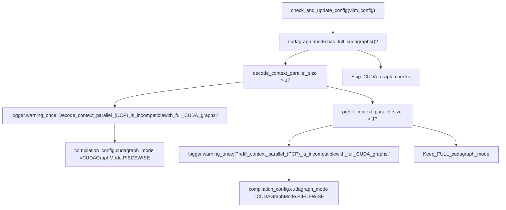
来源：[vllm/platforms/rocm.py664-688](https://github.com/vllm-project/vllm/blob/7cc302dd/vllm/platforms/rocm.py#L664-L688)

## ROCm 特定操作与优化

### AITER 操作集成

AITER (AMD Integrated Tensor Execution Runtime) 为 ROCm 提供了优化的内核：

```mermaid
flowchart TD
    ApplyDefaults["apply_config_platform_defaults()"]
    AddRMSNorm["+rms_norm"]
    AddQuantFP8["+quant_fp8"]
    AddGroupedTopK["+grouped_topk"]
    AddRotary["+rotary_embedding"]
    AddSparseIndexer["+sparse_attn_indexer"]
    EnvVars["Environment_Variables"]
    AITER_ON["VLLM_ROCM_USE_AITER=1"]
    AITER_MHA["VLLM_ROCM_USE_AITER_MHA=1"]
    AITER_UNIFIED["VLLM_ROCM_USE_AITER_UNIFIED_ATTENTION=1"]
    CUSTOM_PAGED["VLLM_ROCM_CUSTOM_PAGED_ATTN=1"]
    AITERMain["rocm_aiter_ops"]
    CheckMLA["is_mla_enabled()"]
    CheckFusedMoE["is_fused_moe_enabled()"]
    CheckRMSNorm["is_rmsnorm_enabled()"]
    CheckLinearFP8["is_linear_fp8_enabled()"]
    CheckFusedSE["is_fusion_moe_shared_experts_enabled()"]
    CheckEnabled["is_enabled()"]

    ApplyDefaults --> AddRMSNorm
    ApplyDefaults --> AddQuantFP8
    ApplyDefaults --> AddGroupedTopK
    ApplyDefaults --> AddRotary
    ApplyDefaults --> AddSparseIndexer
    EnvVars --> AITER_ON
    EnvVars --> AITER_MHA
    EnvVars --> AITER_UNIFIED
    EnvVars --> CUSTOM_PAGED
    AITERMain --> CheckMLA
    AITERMain --> CheckFusedMoE
    AITERMain --> CheckRMSNorm
    AITERMain --> CheckLinearFP8
    AITERMain --> CheckFusedSE
    AITERMain --> CheckEnabled
```
**AITER 环境变量：**

| 变量 | 目的 | 默认值 | 影响 |
| --- | --- | --- | --- |
| `VLLM_ROCM_USE_AITER` | 全局启用 AITER ops | 0 | 启用所有 AITER 操作 |
| `VLLM_ROCM_USE_AITER_MHA` | 启用 AITER 多头注意力 (MHA) | 0 | 使用 AITER Flash Attention |
| `VLLM_ROCM_USE_AITER_UNIFIED_ATTENTION` | 启用 AITER 统一注意力 | 0 | 预填充+解码使用单一内核 |
| `VLLM_ROCM_CUSTOM_PAGED_ATTN` | 启用自定义 Paged Attention | 0 | ROCm 优化的 Paged Attention |

来源：[vllm/platforms/rocm.py333-352](https://github.com/vllm-project/vllm/blob/7cc302dd/vllm/platforms/rocm.py#L333-L352) [vllm/platforms/rocm.py617-662](https://github.com/vllm-project/vllm/blob/7cc302dd/vllm/platforms/rocm.py#L617-L662)

### 内核导入与注册

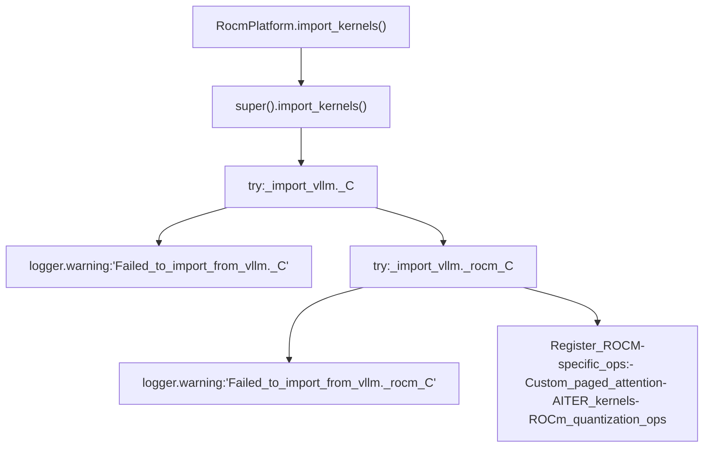
来源：[vllm/platforms/rocm.py387-396](https://github.com/vllm-project/vllm/blob/7cc302dd/vllm/platforms/rocm.py#L387-L396) [vllm/platforms/rocm.py39-48](https://github.com/vllm-project/vllm/blob/7cc302dd/vllm/platforms/rocm.py#L39-L48)

### 内存与通信

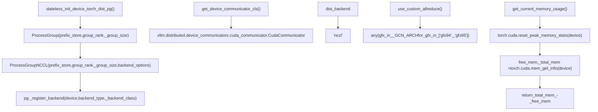
**自定义 Allreduce 支持：**

-   仅为 MI300 系列 (gfx94, gfx95) 启用
-   使用优化的 XGMI 感知集体操作 (collective operations)
-   对于其他硬件回退到 NCCL

来源：[vllm/platforms/rocm.py746-825](https://github.com/vllm-project/vllm/blob/7cc302dd/vllm/platforms/rocm.py#L746-L825)

### 平台能力摘要

```mermaid
flowchart TD
    OpaqueAttn["opaque_attention_op()"]
    ReturnTrue4["return_True(attention_as_custom_op)"]
    IsNavi["is_navi()"]
    CheckNavi["'gfx1'_in__GCN_ARCH"]
    GetGraphWrapper["get_static_graph_wrapper_cls()"]
    CUDAWrapper["'vllm.compilation.cuda_graph.CUDAGraphWrapper'"]
    GetPunica["get_punica_wrapper()"]
    PunicaGPU["'vllm.lora.punica_wrapper.punica_gpu.PunicaWrapperGPU'"]
    NumCU["num_compute_units(device_id)"]
    GetProps["torch.cuda.get_device_properties(device_id)"]
    ReturnCU["return_multi_processor_count"]
    SupportHybrid["support_hybrid_kv_cache()"]
    ReturnTrue1["return_True"]
    SupportStatic["support_static_graph_mode()"]
    ReturnTrue2["return_True"]
    SupportCustomOps["use_custom_op_collectives()"]
    ReturnTrue3["return_True"]

    OpaqueAttn --> ReturnTrue4
    IsNavi --> CheckNavi
    GetGraphWrapper --> CUDAWrapper
    GetPunica --> PunicaGPU
    NumCU --> GetProps
    GetProps --> ReturnCU
    SupportHybrid --> ReturnTrue1
    SupportStatic --> ReturnTrue2
    SupportCustomOps --> ReturnTrue3
```
来源：[vllm/platforms/rocm.py742-866](https://github.com/vllm-project/vllm/blob/7cc302dd/vllm/platforms/rocm.py#L742-L866)

## RocmPlatform 类参考

### 关键类属性

| 属性 | 值 | 目的 |
| --- | --- | --- |
| `_enum` | `PlatformEnum.ROCM` | 平台标识符 |
| `device_name` | `"rocm"` | 面向用户的设备名称 |
| `device_type` | `"cuda"` | PyTorch 设备类型 (ROCm 使用 CUDA API) |
| `dispatch_key` | `"CUDA"` | PyTorch 分发键 |
| `ray_device_key` | `"GPU"` | Ray 加速器键 |
| `dist_backend` | `"nccl"` | 分布式后端 (RCCL/NCCL) |
| `device_control_env_var` | `"CUDA_VISIBLE_DEVICES"` | 设备可见性变量 |

来源：[vllm/platforms/rocm.py355-368](https://github.com/vllm-project/vllm/blob/7cc302dd/vllm/platforms/rocm.py#L355-L368)

### 重要方法

| 方法 | 目的 | 返回值 |
| --- | --- | --- |
| `get_device_capability(device_id)` | 解析 GCN 架构以获取设备能力 | `DeviceCapability(major, minor)` |
| `get_device_name(device_id)` | 获取商用 GPU 名称 | `str` (例如 "AMD_Instinct_MI300X") |
| `get_attn_backend_cls(...)` | 选择最佳注意力后端 | 后端类路径字符串 |
| `get_vit_attn_backend(...)` | 选择 ViT 注意力后端 | `AttentionBackendEnum` |
| `is_fully_connected(device_ids)` | 检查 XGMI 全连接性 | `bool` |
| `supports_fp8()` | 检查 FP8 硬件支持 | `bool` |
| `is_fp8_fnuz()` | 检查是否优先使用 FNUZ 格式 | `bool` |
| `supports_mx()` | 检查 MX 格式支持 | `bool` |
| `use_custom_allreduce()` | 检查自定义 Allreduce 可用性 | `bool` |

来源：[vllm/platforms/rocm.py355-867](https://github.com/vllm-project/vllm/blob/7cc302dd/vllm/platforms/rocm.py#L355-L867)
