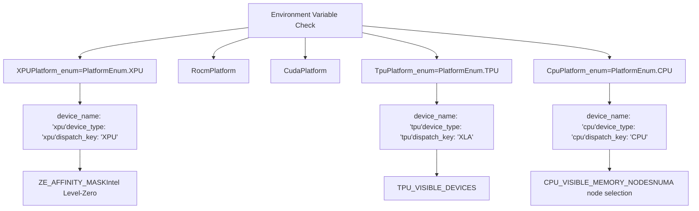
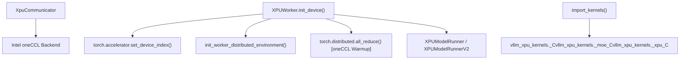

# XPU, CPU, 和 TPU 平台

相关源文件

-   [.buildkite/hardware_tests/cpu.yaml](https://github.com/vllm-project/vllm/blob/7cc302dd/.buildkite/hardware_tests/cpu.yaml)
-   [.buildkite/scripts/hardware_ci/run-cpu-test-arm.sh](https://github.com/vllm-project/vllm/blob/7cc302dd/.buildkite/scripts/hardware_ci/run-cpu-test-arm.sh)
-   [.buildkite/scripts/hardware_ci/run-cpu-test-s390x.sh](https://github.com/vllm-project/vllm/blob/7cc302dd/.buildkite/scripts/hardware_ci/run-cpu-test-s390x.sh)
-   [.buildkite/scripts/hardware_ci/run-cpu-test.sh](https://github.com/vllm-project/vllm/blob/7cc302dd/.buildkite/scripts/hardware_ci/run-cpu-test.sh)
-   [.buildkite/scripts/hardware_ci/run-xpu-test.sh](https://github.com/vllm-project/vllm/blob/7cc302dd/.buildkite/scripts/hardware_ci/run-xpu-test.sh)
-   [cmake/cpu_extension.cmake](https://github.com/vllm-project/vllm/blob/7cc302dd/cmake/cpu_extension.cmake)
-   [csrc/cpu/cpu_types_vsx.hpp](https://github.com/vllm-project/vllm/blob/7cc302dd/csrc/cpu/cpu_types_vsx.hpp)
-   [csrc/cpu/shm.cpp](https://github.com/vllm-project/vllm/blob/7cc302dd/csrc/cpu/shm.cpp)
-   [csrc/cpu/torch_bindings.cpp](https://github.com/vllm-project/vllm/blob/7cc302dd/csrc/cpu/torch_bindings.cpp)
-   [csrc/cpu/utils.cpp](https://github.com/vllm-project/vllm/blob/7cc302dd/csrc/cpu/utils.cpp)
-   [docker/Dockerfile.cpu](https://github.com/vllm-project/vllm/blob/7cc302dd/docker/Dockerfile.cpu)
-   [docker/Dockerfile.s390x](https://github.com/vllm-project/vllm/blob/7cc302dd/docker/Dockerfile.s390x)
-   [docker/Dockerfile.tpu](https://github.com/vllm-project/vllm/blob/7cc302dd/docker/Dockerfile.tpu)
-   [docker/Dockerfile.xpu](https://github.com/vllm-project/vllm/blob/7cc302dd/docker/Dockerfile.xpu)
-   [docs/deployment/frameworks/anything-llm.md](https://github.com/vllm-project/vllm/blob/7cc302dd/docs/deployment/frameworks/anything-llm.md?plain=1)
-   [docs/getting_started/installation/.nav.yml](https://github.com/vllm-project/vllm/blob/7cc302dd/docs/getting_started/installation/.nav.yml)
-   [docs/getting_started/installation/README.md](https://github.com/vllm-project/vllm/blob/7cc302dd/docs/getting_started/installation/README.md?plain=1)
-   [docs/getting_started/installation/cpu.md](https://github.com/vllm-project/vllm/blob/7cc302dd/docs/getting_started/installation/cpu.md?plain=1)
-   [examples/tool_chat_template_phi4_mini.jinja](https://github.com/vllm-project/vllm/blob/7cc302dd/examples/tool_chat_template_phi4_mini.jinja)
-   [requirements/cpu-build.txt](https://github.com/vllm-project/vllm/blob/7cc302dd/requirements/cpu-build.txt)
-   [requirements/cpu.txt](https://github.com/vllm-project/vllm/blob/7cc302dd/requirements/cpu.txt)
-   [requirements/tpu.txt](https://github.com/vllm-project/vllm/blob/7cc302dd/requirements/tpu.txt)
-   [requirements/xpu-test.in](https://github.com/vllm-project/vllm/blob/7cc302dd/requirements/xpu-test.in)
-   [requirements/xpu-test.txt](https://github.com/vllm-project/vllm/blob/7cc302dd/requirements/xpu-test.txt)
-   [requirements/xpu.txt](https://github.com/vllm-project/vllm/blob/7cc302dd/requirements/xpu.txt)
-   [tests/entrypoints/llm/test_accuracy.py](https://github.com/vllm-project/vllm/blob/7cc302dd/tests/entrypoints/llm/test_accuracy.py)
-   [tests/transformers_utils/test_config.py](https://github.com/vllm-project/vllm/blob/7cc302dd/tests/transformers_utils/test_config.py)
-   [tools/install_nixl_from_source_ubuntu.py](https://github.com/vllm-project/vllm/blob/7cc302dd/tools/install_nixl_from_source_ubuntu.py)
-   [vllm/distributed/device_communicators/cpu_communicator.py](https://github.com/vllm-project/vllm/blob/7cc302dd/vllm/distributed/device_communicators/cpu_communicator.py)
-   [vllm/model_executor/layers/fused_moe/xpu_fused_moe.py](https://github.com/vllm-project/vllm/blob/7cc302dd/vllm/model_executor/layers/fused_moe/xpu_fused_moe.py)
-   [vllm/model_executor/layers/quantization/utils/marlin_utils_test.py](https://github.com/vllm-project/vllm/blob/7cc302dd/vllm/model_executor/layers/quantization/utils/marlin_utils_test.py)
-   [vllm/platforms/__init__.py](https://github.com/vllm-project/vllm/blob/7cc302dd/vllm/platforms/__init__.py)
-   [vllm/plugins/__init__.py](https://github.com/vllm-project/vllm/blob/7cc302dd/vllm/plugins/__init__.py)
-   [vllm/plugins/io_processors/__init__.py](https://github.com/vllm-project/vllm/blob/7cc302dd/vllm/plugins/io_processors/__init__.py)
-   [vllm/utils/cpu_triton_utils.py](https://github.com/vllm-project/vllm/blob/7cc302dd/vllm/utils/cpu_triton_utils.py)
-   [vllm/v1/worker/cpu_model_runner.py](https://github.com/vllm-project/vllm/blob/7cc302dd/vllm/v1/worker/cpu_model_runner.py)
-   [vllm/v1/worker/cpu_worker.py](https://github.com/vllm-project/vllm/blob/7cc302dd/vllm/v1/worker/cpu_worker.py)
-   [vllm/v1/worker/xpu_model_runner.py](https://github.com/vllm-project/vllm/blob/7cc302dd/vllm/v1/worker/xpu_model_runner.py)
-   [vllm/v1/worker/xpu_worker.py](https://github.com/vllm-project/vllm/blob/7cc302dd/vllm/v1/worker/xpu_worker.py)

本文档描述了 vLLM 中的 Intel XPU、CPU 和 TPU 平台实现。这些平台通过统一的平台抽象层扩展了 vLLM 的硬件支持，使其不局限于 NVIDIA CUDA 和 AMD ROCm GPU，从而能够在其他硬件上进行推理。

有关平台抽象接口和检测机制的信息，请参阅 [Platform Abstraction Layer](/vllm-project/vllm/10.1-platform-abstraction-layer)。有关 GPU 平台 (CUDA 和 ROCm)，请参阅 [CUDA Platform](/vllm-project/vllm/10.2-cuda-platform) 和 [ROCm Platform](/vllm-project/vllm/10.3-rocm-platform)。

## 概览

vLLM 通过专用平台实现支持另外三个硬件平台：

-   **XPU 平台**：Intel 数据中心 GPU（例如 Max 系列）和 Arc GPU，使用 Intel oneAPI 堆栈和 Intel Extension for PyTorch。
-   **CPU 平台**：通用 CPU（x86, ARM, PowerPC, S390X, RISC-V），具备 NUMA 拓扑感知能力和针对架构的特定优化。
-   **TPU 平台**：通过外部 `tpu-inference` 包支持 Google TPU。

每个平台都继承自 `Platform` 基类，并覆盖方法以提供针对硬件的设备管理、注意力后端选择、内存管理和分布式通信行为。

**来源：** [vllm/platforms/xpu.py30-39](https://github.com/vllm-project/vllm/blob/7cc302dd/vllm/platforms/xpu.py#L30-L39) [vllm/platforms/cpu.py72-78](https://github.com/vllm-project/vllm/blob/7cc302dd/vllm/platforms/cpu.py#L72-L78) [requirements/tpu.txt14](https://github.com/vllm-project/vllm/blob/7cc302dd/requirements/tpu.txt#L14-L14)

## 平台枚举与检测

平台系统通过 `PlatformEnum` 识别受支持的硬件，并在初始化期间检测活动环境。

### 检测机制

标题：平台检测与环境映射

**来源：** [vllm/platforms/xpu.py30-39](https://github.com/vllm-project/vllm/blob/7cc302dd/vllm/platforms/xpu.py#L30-L39) [vllm/platforms/cpu.py72-78](https://github.com/vllm-project/vllm/blob/7cc302dd/vllm/platforms/cpu.py#L72-L78) [vllm/platforms/__init__.py10-50](https://github.com/vllm-project/vllm/blob/7cc302dd/vllm/platforms/__init__.py#L10-L50)

## XPU 平台 (Intel GPU)

`XPUPlatform` 为 Intel 数据中心 GPU 和 Arc GPU 提供支持。它利用了 Intel oneAPI Base Toolkit 和 Level Zero 驱动程序。

### XPU 架构与初始化

XPU 实现依赖于 `vllm_xpu_kernels` 和 Intel 的 oneCCL 进行分布式通信。

标题：XPU Worker 初始化与数据流

**来源：** [vllm/platforms/xpu.py41-46](https://github.com/vllm-project/vllm/blob/7cc302dd/vllm/platforms/xpu.py#L41-L46) [vllm/v1/worker/xpu_worker.py55-119](https://github.com/vllm-project/vllm/blob/7cc302dd/vllm/v1/worker/xpu_worker.py#L55-L119) [docker/Dockerfile.xpu54-61](https://github.com/vllm-project/vllm/blob/7cc302dd/docker/Dockerfile.xpu#L54-L61) [requirements/xpu.txt18](https://github.com/vllm-project/vllm/blob/7cc302dd/requirements/xpu.txt#L18-L18)

### XPU 特定功能与能力

-   **注意力后端 (Attention Backends)**：支持 `TRITON_ATTN` 和优化的 XPU 内核。Flash Attention 是主要目标，但具有特定的 dtype 约束 [vllm/platforms/xpu.py48-116](https://github.com/vllm-project/vllm/blob/7cc302dd/vllm/platforms/xpu.py#L48-L116)
-   **量化 (Quantization)**：已验证支持 `fp8` 和 `GPTQ-Int4` 模型 [docker/Dockerfile.xpu41-42](https://github.com/vllm-project/vllm/blob/7cc302dd/docker/Dockerfile.xpu#L41-L42)
-   **分布式 (Distributed)**：支持 Ray 和多进程 (`mp`) 后端 [vllm/v1/worker/xpu_worker.py104](https://github.com/vllm-project/vllm/blob/7cc302dd/vllm/v1/worker/xpu_worker.py#L104-L104)
-   **内存管理 (Memory Management)**：使用 Level Zero 亲和掩码 (`ZE_AFFINITY_MASK`) 进行设备隔离 [vllm/v1/worker/xpu_worker.py30](https://github.com/vllm-project/vllm/blob/7cc302dd/vllm/v1/worker/xpu_worker.py#L30-L30)

**来源：** [vllm/v1/worker/xpu_worker.py55-119](https://github.com/vllm-project/vllm/blob/7cc302dd/vllm/v1/worker/xpu_worker.py#L55-L119) [.buildkite/scripts/hardware_ci/run-xpu-test.sh36-44](https://github.com/vllm-project/vllm/blob/7cc302dd/.buildkite/scripts/hardware_ci/run-xpu-test.sh#L36-L44)

## CPU 平台

`CpuPlatform` 支持跨多种架构的推理，重点关注 NUMA 局部性和 SIMD 优化。

### CPU 架构与 Worker 流程

`CPUWorker` 管理执行环境，包括 OpenMP 线程亲和性和 NUMA 绑定。

标题：CPU 执行管道与原生绑定

```mermaid
flowchart TD
    Bindings["TORCH_LIBRARY_EXPAND"]
    OneDNN["onednn_mm / onednn_scaled_mm"]
    Attn["cpu_attention_with_kv_cache"]
    MoE["cpu_fused_moe / dynamic_4bit_int_moe_cpu"]
    CPURunner["CPUModelRunner"]
    Load["load_model() -> get_model()"]
    PostProcess["_postprocess_tensors() [Move to CPU]"]
    Warmup["warming_up_model() [Inductor Freezing]"]
    Init["CPUWorker.init_device()"]
    LibCheck["Check LD_PRELOAD (libtcmalloc, libiomp)"]
    Affinity["_get_autobind_cpu_ids() [NUMA Aware]"]
    OMP["torch.ops._C.init_cpu_threads_env()"]
    Runner["CPUModelRunner"]

    Bindings --> OneDNN
    Bindings --> Attn
    Bindings --> MoE
    CPURunner --> Load
    CPURunner --> PostProcess
    CPURunner --> Warmup
    Init --> LibCheck
    Init --> Affinity
    Init --> OMP
    Init --> Runner
```

**来源：** [vllm/v1/worker/cpu_worker.py55-125](https://github.com/vllm-project/vllm/blob/7cc302dd/vllm/v1/worker/cpu_worker.py#L55-L125) [vllm/v1/worker/cpu_model_runner.py19-84](https://github.com/vllm-project/vllm/blob/7cc302dd/vllm/v1/worker/cpu_model_runner.py#L19-L84) [csrc/cpu/torch_bindings.cpp135-165](https://github.com/vllm-project/vllm/blob/7cc302dd/csrc/cpu/torch_bindings.cpp#L135-L165)

### CPU 架构支持矩阵

vLLM 在构建和运行时通过 CMake 逻辑检测指令集 (ISA) 并选择优化的内核。

| 架构 | 检测符号 | 优化特性 |
| --- | --- | --- |
| **x86_64** | `ENABLE_X86_ISA` | AVX512 (F/VL/BW/DQ), AVX2, AMX (BF16/Tile), VNNI [cmake/cpu_extension.cmake92-112](https://github.com/vllm-project/vllm/blob/7cc302dd/cmake/cpu_extension.cmake#L92-L112) |
| **ARM** | `ASIMD_FOUND` | NEON (ASIMD), SVE, BF16 扩展, dotprod [cmake/cpu_extension.cmake128-138](https://github.com/vllm-project/vllm/blob/7cc302dd/cmake/cpu_extension.cmake#L128-L138) |
| **PowerPC** | `POWERPC` | VSX (Power9/10/11), mcpu/mtune 优化 [cmake/cpu_extension.cmake114-127](https://github.com/vllm-project/vllm/blob/7cc302dd/cmake/cpu_extension.cmake#L114-L127) |
| **S390X** | `S390_FOUND` | 向量设施 (VX/VXE), mzvector [cmake/cpu_extension.cmake139-146](https://github.com/vllm-project/vllm/blob/7cc302dd/cmake/cpu_extension.cmake#L139-L146) |
| **RISC-V** | `riscv64` | 向量扩展 (RVV), BF16/FP16 支持 (zvfh/zfbfmin) [cmake/cpu_extension.cmake147-160](https://github.com/vllm-project/vllm/blob/7cc302dd/cmake/cpu_extension.cmake#L147-L160) |

**来源：** [cmake/cpu_extension.cmake92-160](https://github.com/vllm-project/vllm/blob/7cc302dd/cmake/cpu_extension.cmake#L92-L160) [vllm/v1/worker/cpu_worker.py78-91](https://github.com/vllm-project/vllm/blob/7cc302dd/vllm/v1/worker/cpu_worker.py#L78-L91)

### 内存与线程管理

CPU 平台在系统 RAM 中管理 KV 缓存空间，并确保 worker 被固定到物理核心。

-   **KV 缓存空间 (KV Cache Space)**：通过 `VLLM_CPU_KVCACHE_SPACE` (以 GiB 为单位) 进行配置。`determine_available_memory` 方法会返回配置的空间 [vllm/v1/worker/cpu_worker.py137-138](https://github.com/vllm-project/vllm/blob/7cc302dd/vllm/v1/worker/cpu_worker.py#L137-L138)
-   **NUMA 绑定**：worker 被绑定到特定的 NUMA 节点。`_get_autobind_cpu_ids` 会根据可用节点和本地等级 (local rank) 计算 ID [vllm/v1/worker/cpu_worker.py147-176](https://github.com/vllm-project/vllm/blob/7cc302dd/vllm/v1/worker/cpu_worker.py#L147-L176)
-   **线程亲和性 (Thread Affinity)**：使用 `torch.ops._C.init_cpu_threads_env` 将 OpenMP 线程绑定到特定的 CPU ID，以避免 SMT 竞争并提高缓存局部性 [vllm/v1/worker/cpu_worker.py106-109](https://github.com/vllm-project/vllm/blob/7cc302dd/vllm/v1/worker/cpu_worker.py#L106-L109)

**来源：** [vllm/v1/worker/cpu_worker.py74-109](https://github.com/vllm-project/vllm/blob/7cc302dd/vllm/v1/worker/cpu_worker.py#L74-L109) [docs/getting_started/installation/cpu.md147-150](https://github.com/vllm-project/vllm/blob/7cc302dd/docs/getting_started/installation/cpu.md?plain=1#L147-L150)

## TPU 平台

TPU 实现作为一个可插拔平台集成，将核心逻辑委托给 `tpu-inference` 包，并使用 `nixl` 进行高性能通信。

### TPU 平台特征

-   **设备类型 (Device Type)**：在 vLLM 配置中标识为 `tpu` [requirements/tpu.txt4](https://github.com/vllm-project/vllm/blob/7cc302dd/requirements/tpu.txt#L4-L4)
-   **依赖项**：需要 `tpu-inference` (v0.12.0+) 和 `nixl` (v0.3.0+) [requirements/tpu.txt13-14](https://github.com/vllm-project/vllm/blob/7cc302dd/requirements/tpu.txt#L13-L14)
-   **分布式执行**：利用 Ray 进行多主机协调和数据并行操作 [requirements/tpu.txt10-11](https://github.com/vllm-project/vllm/blob/7cc302dd/requirements/tpu.txt#L10-L11)
-   **分发 (Dispatch)**：对操作使用 `XLA` 分发键 [requirements/tpu.txt14](https://github.com/vllm-project/vllm/blob/7cc302dd/requirements/tpu.txt#L14-L14)

**来源：** [requirements/tpu.txt1-15](https://github.com/vllm-project/vllm/blob/7cc302dd/requirements/tpu.txt#L1-L15)

## 平台比较矩阵

| 特性 | XPU (Intel) | CPU (通用) | TPU (Google) |
| --- | --- | --- | --- |
| **运行时后端** | Intel Extension for PyTorch | oneDNN / 原生 C++ | tpu-inference / XLA |
| **注意力** | XPU 内核 / Triton | `cpu_attention_with_kv_cache` | XLA 优化 |
| **分布式后端** | oneCCL / NIXL | Gloo / SHM AllReduce | NIXL / Ray |
| **量化** | FP8, GPTQ, AWQ | Int8 (oneDNN), 4bit | (外部支持) |
| **KV 缓存** | 设备内存 (HBM) | 系统 RAM (NUMA 感知) | TPU HBM |
| **并行性** | TP, EP, DP | TP, DP | TP, DP |

**来源：** [vllm/v1/worker/cpu_worker.py41](https://github.com/vllm-project/vllm/blob/7cc302dd/vllm/v1/worker/cpu_worker.py#L41-L41) [vllm/v1/worker/xpu_worker.py111](https://github.com/vllm-project/vllm/blob/7cc302dd/vllm/v1/worker/xpu_worker.py#L111-L111) [csrc/cpu/torch_bindings.cpp97](https://github.com/vllm-project/vllm/blob/7cc302dd/csrc/cpu/torch_bindings.cpp#L97-L97) [docker/Dockerfile.xpu121-123](https://github.com/vllm-project/vllm/blob/7cc302dd/docker/Dockerfile.xpu#L121-L123) [requirements/tpu.txt13-14](https://github.com/vllm-project/vllm/blob/7cc302dd/requirements/tpu.txt#L13-L14)
