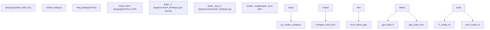
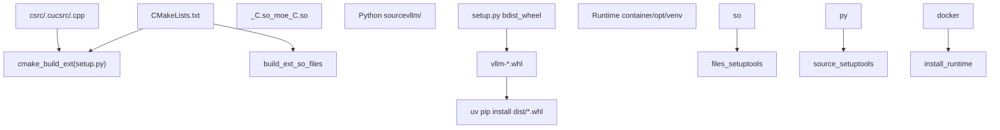

# 构建系统与部署

相关源文件

-   [.buildkite/scripts/generate-nightly-index.py](https://github.com/vllm-project/vllm/blob/7cc302dd/.buildkite/scripts/generate-nightly-index.py)
-   [.pre-commit-config.yaml](https://github.com/vllm-project/vllm/blob/7cc302dd/.pre-commit-config.yaml)
-   [docker/Dockerfile](https://github.com/vllm-project/vllm/blob/7cc302dd/docker/Dockerfile)
-   [docker/Dockerfile.nightly_torch](https://github.com/vllm-project/vllm/blob/7cc302dd/docker/Dockerfile.nightly_torch)
-   [docker/Dockerfile.rocm](https://github.com/vllm-project/vllm/blob/7cc302dd/docker/Dockerfile.rocm)
-   [docker/Dockerfile.rocm_base](https://github.com/vllm-project/vllm/blob/7cc302dd/docker/Dockerfile.rocm_base)
-   [docker/docker-bake.hcl](https://github.com/vllm-project/vllm/blob/7cc302dd/docker/docker-bake.hcl)
-   [docker/versions.json](https://github.com/vllm-project/vllm/blob/7cc302dd/docker/versions.json)
-   [docs/assets/contributing/dockerfile-stages-dependency.png](https://github.com/vllm-project/vllm/blob/7cc302dd/docs/assets/contributing/dockerfile-stages-dependency.png)
-   [docs/deployment/docker.md](https://github.com/vllm-project/vllm/blob/7cc302dd/docs/deployment/docker.md?plain=1)
-   [docs/deployment/frameworks/lws.md](https://github.com/vllm-project/vllm/blob/7cc302dd/docs/deployment/frameworks/lws.md?plain=1)
-   [docs/deployment/integrations/kaito.md](https://github.com/vllm-project/vllm/blob/7cc302dd/docs/deployment/integrations/kaito.md?plain=1)
-   [docs/deployment/integrations/kserve.md](https://github.com/vllm-project/vllm/blob/7cc302dd/docs/deployment/integrations/kserve.md?plain=1)
-   [docs/deployment/integrations/kthena.md](https://github.com/vllm-project/vllm/blob/7cc302dd/docs/deployment/integrations/kthena.md?plain=1)
-   [docs/deployment/integrations/llm-d.md](https://github.com/vllm-project/vllm/blob/7cc302dd/docs/deployment/integrations/llm-d.md?plain=1)
-   [docs/deployment/k8s.md](https://github.com/vllm-project/vllm/blob/7cc302dd/docs/deployment/k8s.md?plain=1)
-   [docs/getting_started/installation/cpu.apple.inc.md](https://github.com/vllm-project/vllm/blob/7cc302dd/docs/getting_started/installation/cpu.apple.inc.md?plain=1)
-   [docs/getting_started/installation/cpu.arm.inc.md](https://github.com/vllm-project/vllm/blob/7cc302dd/docs/getting_started/installation/cpu.arm.inc.md?plain=1)
-   [docs/getting_started/installation/cpu.s390x.inc.md](https://github.com/vllm-project/vllm/blob/7cc302dd/docs/getting_started/installation/cpu.s390x.inc.md?plain=1)
-   [docs/getting_started/installation/cpu.x86.inc.md](https://github.com/vllm-project/vllm/blob/7cc302dd/docs/getting_started/installation/cpu.x86.inc.md?plain=1)
-   [docs/getting_started/installation/gpu.cuda.inc.md](https://github.com/vllm-project/vllm/blob/7cc302dd/docs/getting_started/installation/gpu.cuda.inc.md?plain=1)
-   [docs/getting_started/installation/gpu.md](https://github.com/vllm-project/vllm/blob/7cc302dd/docs/getting_started/installation/gpu.md?plain=1)
-   [docs/getting_started/installation/gpu.rocm.inc.md](https://github.com/vllm-project/vllm/blob/7cc302dd/docs/getting_started/installation/gpu.rocm.inc.md?plain=1)
-   [docs/getting_started/installation/gpu.xpu.inc.md](https://github.com/vllm-project/vllm/blob/7cc302dd/docs/getting_started/installation/gpu.xpu.inc.md?plain=1)
-   [docs/getting_started/installation/python_env_setup.inc.md](https://github.com/vllm-project/vllm/blob/7cc302dd/docs/getting_started/installation/python_env_setup.inc.md?plain=1)
-   [docs/models/extensions/runai_model_streamer.md](https://github.com/vllm-project/vllm/blob/7cc302dd/docs/models/extensions/runai_model_streamer.md?plain=1)
-   [examples/online_serving/multi-node-serving.sh](https://github.com/vllm-project/vllm/blob/7cc302dd/examples/online_serving/multi-node-serving.sh)
-   [pyproject.toml](https://github.com/vllm-project/vllm/blob/7cc302dd/pyproject.toml)
-   [requirements/build.txt](https://github.com/vllm-project/vllm/blob/7cc302dd/requirements/build.txt)
-   [requirements/common.txt](https://github.com/vllm-project/vllm/blob/7cc302dd/requirements/common.txt)
-   [requirements/cuda.txt](https://github.com/vllm-project/vllm/blob/7cc302dd/requirements/cuda.txt)
-   [requirements/nightly_torch_test.txt](https://github.com/vllm-project/vllm/blob/7cc302dd/requirements/nightly_torch_test.txt)
-   [requirements/rocm-build.txt](https://github.com/vllm-project/vllm/blob/7cc302dd/requirements/rocm-build.txt)
-   [requirements/rocm-test.in](https://github.com/vllm-project/vllm/blob/7cc302dd/requirements/rocm-test.in)
-   [requirements/rocm-test.txt](https://github.com/vllm-project/vllm/blob/7cc302dd/requirements/rocm-test.txt)
-   [requirements/rocm.txt](https://github.com/vllm-project/vllm/blob/7cc302dd/requirements/rocm.txt)
-   [requirements/test.in](https://github.com/vllm-project/vllm/blob/7cc302dd/requirements/test.in)
-   [requirements/test.txt](https://github.com/vllm-project/vllm/blob/7cc302dd/requirements/test.txt)
-   [setup.py](https://github.com/vllm-project/vllm/blob/7cc302dd/setup.py)
-   [tests/model_executor/model_loader/runai_streamer_loader/test_runai_utils.py](https://github.com/vllm-project/vllm/blob/7cc302dd/tests/model_executor/model_loader/runai_streamer_loader/test_runai_utils.py)
-   [tests/quantization/test_cpu_wna16.py](https://github.com/vllm-project/vllm/blob/7cc302dd/tests/quantization/test_cpu_wna16.py)
-   [tests/standalone_tests/python_only_compile.sh](https://github.com/vllm-project/vllm/blob/7cc302dd/tests/standalone_tests/python_only_compile.sh)
-   [tests/tools/__init__.py](https://github.com/vllm-project/vllm/blob/7cc302dd/tests/tools/__init__.py)
-   [tests/v1/kv_connector/unit/test_moriio_connector.py](https://github.com/vllm-project/vllm/blob/7cc302dd/tests/v1/kv_connector/unit/test_moriio_connector.py)
-   [tools/generate_versions_json.py](https://github.com/vllm-project/vllm/blob/7cc302dd/tools/generate_versions_json.py)
-   [tools/install_deepgemm.sh](https://github.com/vllm-project/vllm/blob/7cc302dd/tools/install_deepgemm.sh)
-   [use_existing_torch.py](https://github.com/vllm-project/vllm/blob/7cc302dd/use_existing_torch.py)
-   [vllm/transformers_utils/runai_utils.py](https://github.com/vllm-project/vllm/blob/7cc302dd/vllm/transformers_utils/runai_utils.py)

本页记录了 vLLM 是如何构建、打包和部署的。它涵盖了 Python 打包配置、用于 CUDA/HIP 扩展的 CMake 构建系统、Docker 镜像构建以及依赖管理。

有关影响运行时行为的环境变量信息，请参阅 [环境变量系统](/vllm-project/vllm/2.3-environment-variables-system)。有关 `torch.compile` 集成和编译模式的信息，请参阅 [编译配置与优化级别](/vllm-project/vllm/2.4-compilation-configuration-and-optimization-levels)。有关平台特定的运行时详细信息 (CUDA, ROCm, CPU, TPU)，请参阅 [平台支持](/vllm-project/vllm/10-platform-support)。

---

## 概览

vLLM 有两个不同的构建阶段：

1.  **C++/CUDA 扩展构建** — 使用 CMake 驱动将 GPU 内核和自定义算子编译为共享库 (`.so` 文件)。这是耗时较长的步骤，需要 CUDA/ROCm 工具链，并处理特定架构的代码生成。
2.  **Python wheel 构建** — 使用标准的 `setuptools` 构建，将 Python 源代码与编译后的 `.so` 文件一起打包成可分发的 wheel。

Docker 构建进一步将这些阶段分离为并行阶段，以最大限度地减少重新构建时间并优化镜像大小。

来源：[setup.py1-50](https://github.com/vllm-project/vllm/blob/7cc302dd/setup.py#L1-L50) [docker/Dockerfile1-50](https://github.com/vllm-project/vllm/blob/7cc302dd/docker/Dockerfile#L1-L50)

---

## Python 打包

### pyproject.toml

[pyproject.toml](https://github.com/vllm-project/vllm/blob/7cc302dd/pyproject.toml) 是权威的打包配置，使用 `setuptools` 作为构建后端。

| 字段 | 值 |
| --- | --- |
| 包名称 | `vllm` |
| 构建后端 | `setuptools.build_meta` |
| 版本控制 | `setuptools-scm` (源自 git 标签) |
| Python 要求 | `>=3.10,<3.14` |
| 控制台入口点 | `vllm = "vllm.entrypoints.cli.main:main"` |
| 许可证 | Apache-2.0 |

**构建系统要求** ([pyproject.toml3-12](https://github.com/vllm-project/vllm/blob/7cc302dd/pyproject.toml#L3-L12)):

-   `cmake>=3.26.1`
-   `ninja`
-   `packaging>=24.2`
-   `setuptools>=77.0.3,<81.0.0`
-   `setuptools-scm>=8.0`
-   `torch == 2.10.0`
-   `wheel`
-   `jinja2`

**插件入口点** ([pyproject.toml44-46](https://github.com/vllm-project/vllm/blob/7cc302dd/pyproject.toml#L44-L46)):

-   `lora_filesystem_resolver` — `vllm.plugins.lora_resolvers.filesystem_resolver:register_filesystem_resolver`
-   `lora_hf_hub_resolver` — `vllm.plugins.lora_resolvers.hf_hub_resolver:register_hf_hub_resolver`

来源：[pyproject.toml1-53](https://github.com/vllm-project/vllm/blob/7cc302dd/pyproject.toml#L1-L53)

### setup.py

`setup.py` 通过连接 Python 的 `setuptools` 与 CMake 来协调构建。关键类：

| 类 | 用途 |
| --- | --- |
| `CMakeExtension` | 声明一个由 CMake 项目支持的 C++ 扩展 [setup.py145-149](https://github.com/vllm-project/vllm/blob/7cc302dd/setup.py#L145-L149) |
| `cmake_build_ext` | 自定义 `build_ext` 命令；调用 `cmake` 配置和构建步骤 [setup.py151-200](https://github.com/vllm-project/vllm/blob/7cc302dd/setup.py#L151-L200) |

**目标设备检测** ([setup.py40-65](https://github.com/vllm-project/vllm/blob/7cc302dd/setup.py#L40-L65)): `VLLM_TARGET_DEVICE` 环境变量控制编译内容。如果未设置，`setup.py` 会根据 `torch.version` 自动检测：

-   `torch.version.hip is not None` → `"rocm"` [setup.py54-55](https://github.com/vllm-project/vllm/blob/7cc302dd/setup.py#L54-L55)
-   `torch.version.xpu is not None` → `"xpu"` [setup.py57-58](https://github.com/vllm-project/vllm/blob/7cc302dd/setup.py#L57-L58)
-   `torch.version.cuda is not None` → `"cuda"` [setup.py60-61](https://github.com/vllm-project/vllm/blob/7cc302dd/setup.py#L60-L61)
-   macOS → `"cpu"` [setup.py42-44](https://github.com/vllm-project/vllm/blob/7cc302dd/setup.py#L42-L44)

**编译器缓存** ([setup.py67-75](https://github.com/vllm-project/vllm/blob/7cc302dd/setup.py#L67-L75)): `setup.py` 会首先检查 `sccache`，然后检查 `ccache`。如果找到，它会启用它们以加速后续构建。

**作业并行性** ([setup.py158-195](https://github.com/vllm-project/vllm/blob/7cc302dd/setup.py#L158-L195)): `compute_num_jobs` 读取 `MAX_JOBS` (环境变量) 和 `NVCC_THREADS` (环境变量) 来确定构建并发数。当设置了 `NVCC_THREADS` (用于 CUDA 11.2+) 时，`num_jobs` 会按比例减少，以避免系统过载 [setup.py182-191](https://github.com/vllm-project/vllm/blob/7cc302dd/setup.py#L182-L191)

来源：[setup.py1-200](https://github.com/vllm-project/vllm/blob/7cc302dd/setup.py#L1-L200)

---

## CMake 构建系统

顶级 CMake 系统构建所有 C++/CUDA 扩展，包括主要的 `_C` 绑定和像 MoE 这样的专用模块。

### 架构处理

**CUDA 架构集**：vLLM 支持广泛的计算能力。根据检测到或指定的目标设备生成特定架构的标志。

**HIP/ROCm 架构集** ([docker/Dockerfile.rocm_base30-33](https://github.com/vllm-project/vllm/blob/7cc302dd/docker/Dockerfile.rocm_base#L30-L33)):

```
gfx90a;gfx942;gfx950;gfx1100;gfx1101;gfx1200;gfx1201;gfx1150;gfx1151
```
### CMake 构建流程图

**CMake 扩展构建过程**


来源：[setup.py137-180](https://github.com/vllm-project/vllm/blob/7cc302dd/setup.py#L137-L180) [docker/Dockerfile.rocm_base30-33](https://github.com/vllm-project/vllm/blob/7cc302dd/docker/Dockerfile.rocm_base#L30-L33)

---

## 依赖管理

### 依赖文件结构

vLLM 使用模块化依赖结构来处理不同的硬件后端和测试环境。

| 文件 | 用途 |
| --- | --- |
| `requirements/common.txt` | 跨所有平台共享的运行时依赖 (例如 `transformers`, `fastapi`, `pydantic`) [requirements/common.txt1-57](https://github.com/vllm-project/vllm/blob/7cc302dd/requirements/common.txt#L1-L57) |
| `requirements/cuda.txt` | CUDA 平台：包括 `common.txt`, 添加了 `torch`, `flashinfer-python`, 以及 `quack-kernels` [requirements/cuda.txt1-20](https://github.com/vllm-project/vllm/blob/7cc302dd/requirements/cuda.txt#L1-L20) |
| `requirements/rocm.txt` | ROCm 平台：包括 `common.txt`, 添加了 AMD 特定包。 |
| `requirements/build.txt` | 仅构建时：`cmake`, `ninja`, `setuptools`, `torch` [pyproject.toml3-12](https://github.com/vllm-project/vllm/blob/7cc302dd/pyproject.toml#L3-L12) |
| `requirements/test.txt` | 针对 CUDA 的完整固定测试依赖锁定文件 [requirements/test.txt1-100](https://github.com/vllm-project/vllm/blob/7cc302dd/requirements/test.txt#L1-L100) |
| `requirements/rocm-test.txt` | ROCm 测试依赖 [requirements/rocm-test.txt1-115](https://github.com/vllm-project/vllm/blob/7cc302dd/requirements/rocm-test.txt#L1-L115) |

### 关键固定版本

| 包 | 固定版本 | 来源 |
| --- | --- | --- |
| `torch` | 2.10.0 | [requirements/cuda.txt7](https://github.com/vllm-project/vllm/blob/7cc302dd/requirements/cuda.txt#L7-L7) |
| `flashinfer-python` | 0.6.6 | [requirements/cuda.txt12](https://github.com/vllm-project/vllm/blob/7cc302dd/requirements/cuda.txt#L12-L12) |
| `transformers` | 4.56.0+ | [requirements/common.txt10](https://github.com/vllm-project/vllm/blob/7cc302dd/requirements/common.txt#L10-L10) |
| `vllm` (测试) | 0.22.0 (tokenizers) | [requirements/test.in43](https://github.com/vllm-project/vllm/blob/7cc302dd/requirements/test.in#L43-L43) |

来源：[requirements/common.txt1-60](https://github.com/vllm-project/vllm/blob/7cc302dd/requirements/common.txt#L1-L60) [requirements/cuda.txt1-21](https://github.com/vllm-project/vllm/blob/7cc302dd/requirements/cuda.txt#L1-L21) [requirements/test.txt1-100](https://github.com/vllm-project/vllm/blob/7cc302dd/requirements/test.txt#L1-L100) [requirements/test.in1-80](https://github.com/vllm-project/vllm/blob/7cc302dd/requirements/test.in#L1-L80)

---

## Docker 多阶段构建 (CUDA)

主要的 [docker/Dockerfile](https://github.com/vllm-project/vllm/blob/7cc302dd/docker/Dockerfile) 使用多阶段构建以最大化层缓存。详情请参阅 [Docker 多阶段构建](/vllm-project/vllm/11.1-docker-multi-stage-build)。

### 构建参数

| 参数 | 默认值 | 目的 |
| --- | --- | --- |
| `CUDA_VERSION` | `12.9.1` | 基础 CUDA 版本 [docker/Dockerfile25](https://github.com/vllm-project/vllm/blob/7cc302dd/docker/Dockerfile#L25-L25) |
| `PYTHON_VERSION` | `3.12` | Python 版本 [docker/Dockerfile26](https://github.com/vllm-project/vllm/blob/7cc302dd/docker/Dockerfile#L26-L26) |
| `PYTORCH_NIGHTLY` | 未设置 | 启用 PyTorch nightly 安装 [docker/Dockerfile157](https://github.com/vllm-project/vllm/blob/7cc302dd/docker/Dockerfile#L157-L157) |
| `INSTALL_KV_CONNECTORS` | `false` | 包含 KV-connector 库 [docker/Dockerfile89](https://github.com/vllm-project/vllm/blob/7cc302dd/docker/Dockerfile#L89-L89) |

### 阶段详情

**`base` 阶段** ([docker/Dockerfile93-126](https://github.com/vllm-project/vllm/blob/7cc302dd/docker/Dockerfile#L93-L126)):

-   安装 GCC 10 以避免 CUTLASS 编译问题 [docker/Dockerfile110-112](https://github.com/vllm-project/vllm/blob/7cc302dd/docker/Dockerfile#L110-L112)
-   安装 `uv` 以实现高性能包管理 [docker/Dockerfile120](https://github.com/vllm-project/vllm/blob/7cc302dd/docker/Dockerfile#L120-L120)
-   创建 `/opt/venv` 虚拟环境 [docker/Dockerfile121](https://github.com/vllm-project/vllm/blob/7cc302dd/docker/Dockerfile#L121-L121)

**`build` 阶段**:

-   编译 C++ 扩展并将它们捆绑到最终的 wheel 中。

来源：[docker/Dockerfile1-150](https://github.com/vllm-project/vllm/blob/7cc302dd/docker/Dockerfile#L1-L150)

---

## ROCm 特定构建

ROCm 构建利用单独的管道来处理 AMD 的软件栈。详情请参阅 [构建变体与配置](/vllm-project/vllm/11.3-build-variants-and-configuration)。

### Dockerfile.rocm_base

[docker/Dockerfile.rocm_base](https://github.com/vllm-project/vllm/blob/7cc302dd/docker/Dockerfile.rocm_base) 从源代码编译整个 ROCm 栈：

-   **Triton**: `github.com/ROCm/triton.git` [docker/Dockerfile.rocm_base3](https://github.com/vllm-project/vllm/blob/7cc302dd/docker/Dockerfile.rocm_base#L3-L3)
-   **PyTorch**: `github.com/ROCm/pytorch.git` [docker/Dockerfile.rocm_base5](https://github.com/vllm-project/vllm/blob/7cc302dd/docker/Dockerfile.rocm_base#L5-L5)
-   **AITER**: `github.com/ROCm/aiter.git` [docker/Dockerfile.rocm_base13](https://github.com/vllm-project/vllm/blob/7cc302dd/docker/Dockerfile.rocm_base#L13-L13)

### Dockerfile.rocm

[docker/Dockerfile.rocm](https://github.com/vllm-project/vllm/blob/7cc302dd/docker/Dockerfile.rocm) 构建针对 ROCm 的 vLLM。它支持从本地源构建或通过 `REMOTE_VLLM` 克隆远程仓库 [docker/Dockerfile.rocm81-95](https://github.com/vllm-project/vllm/blob/7cc302dd/docker/Dockerfile.rocm#L81-L95)。它还处理专门的 ROCm 组件，如 `RIXL` 和 `DeepEP` [docker/Dockerfile.rocm117-191](https://github.com/vllm-project/vllm/blob/7cc302dd/docker/Dockerfile.rocm#L117-L191)。

来源：[docker/Dockerfile.rocm1-115](https://github.com/vllm-project/vllm/blob/7cc302dd/docker/Dockerfile.rocm#L1-L115) [docker/Dockerfile.rocm_base1-136](https://github.com/vllm-project/vllm/blob/7cc302dd/docker/Dockerfile.rocm_base#L1-L136)

---

## 运行时 JIT 编译

vLLM 在运行时对几个高性能内核执行即时 (Just-In-Time, JIT) 编译，以适应特定的模型配置。详情请参阅 [运行时 JIT 编译](/vllm-project/vllm/11.4-runtime-jit-compilation)。

-   **FlashInfer JIT**: 生成专门的注意力内核。
-   **DeepGemm**: 用于 FP8 和 MoE 操作的 JIT 编译内核 [docker/Dockerfile311](https://github.com/vllm-project/vllm/blob/7cc302dd/docker/Dockerfile#L311-L311)。

---

## 构建产物流向 (Build Artifact Flow)

**产物从源代码到运行时的流向**


来源：[docker/Dockerfile191-437](https://github.com/vllm-project/vllm/blob/7cc302dd/docker/Dockerfile#L191-L437) [setup.py145-180](https://github.com/vllm-project/vllm/blob/7cc302dd/setup.py#L145-L180)
