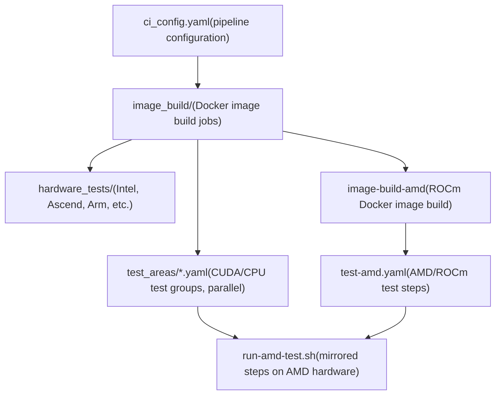
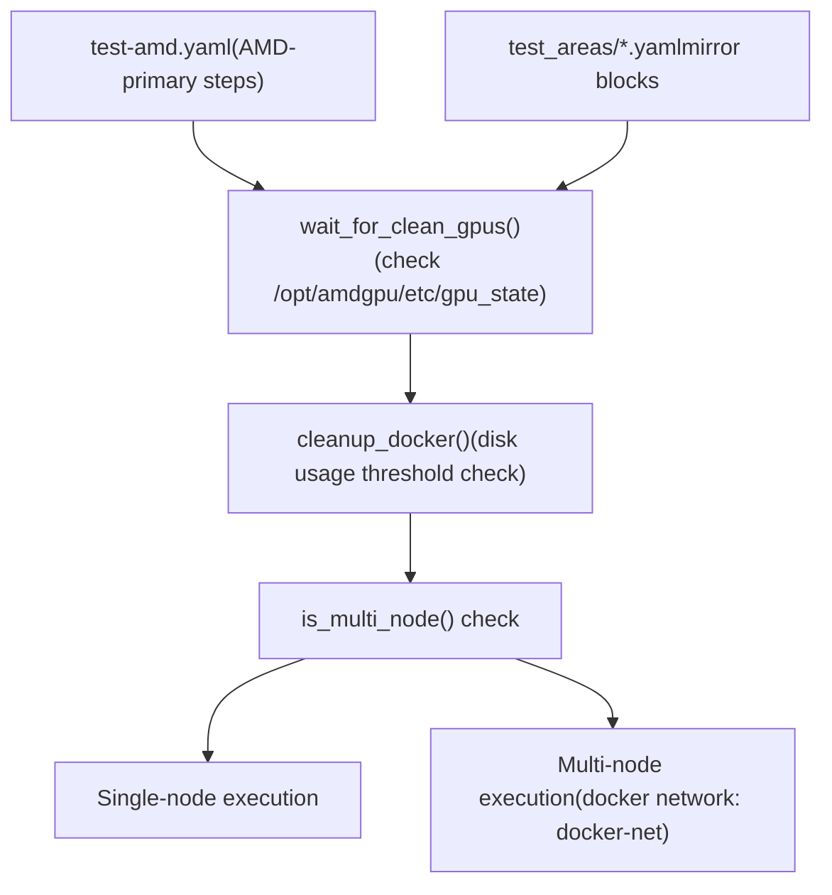
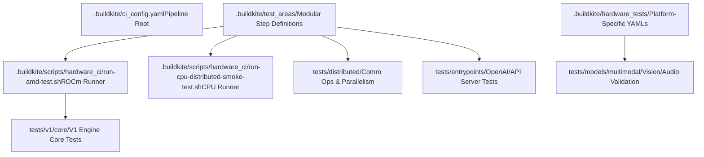

# 测试和 CI/CD

相关源文件

-   [.buildkite/hardware\_tests/amd.yaml](https://github.com/vllm-project/vllm/blob/7cc302dd/.buildkite/hardware_tests/amd.yaml)
-   [.buildkite/hardware\_tests/ascend\_npu.yaml](https://github.com/vllm-project/vllm/blob/7cc302dd/.buildkite/hardware_tests/ascend_npu.yaml)
-   [.buildkite/hardware\_tests/gh200.yaml](https://github.com/vllm-project/vllm/blob/7cc302dd/.buildkite/hardware_tests/gh200.yaml)
-   [.buildkite/hardware\_tests/intel.yaml](https://github.com/vllm-project/vllm/blob/7cc302dd/.buildkite/hardware_tests/intel.yaml)
-   [.buildkite/scripts/hardware\_ci/run-amd-test.sh](https://github.com/vllm-project/vllm/blob/7cc302dd/.buildkite/scripts/hardware_ci/run-amd-test.sh)
-   [.buildkite/scripts/hardware\_ci/run-cpu-distributed-smoke-test.sh](https://github.com/vllm-project/vllm/blob/7cc302dd/.buildkite/scripts/hardware_ci/run-cpu-distributed-smoke-test.sh)
-   [.buildkite/test-amd.yaml](https://github.com/vllm-project/vllm/blob/7cc302dd/.buildkite/test-amd.yaml)
-   [.buildkite/test-pipeline.yaml](https://github.com/vllm-project/vllm/blob/7cc302dd/.buildkite/test-pipeline.yaml)
-   [.buildkite/test\_areas/basic\_correctness.yaml](https://github.com/vllm-project/vllm/blob/7cc302dd/.buildkite/test_areas/basic_correctness.yaml)
-   [.buildkite/test\_areas/distributed.yaml](https://github.com/vllm-project/vllm/blob/7cc302dd/.buildkite/test_areas/distributed.yaml)
-   [.buildkite/test\_areas/entrypoints.yaml](https://github.com/vllm-project/vllm/blob/7cc302dd/.buildkite/test_areas/entrypoints.yaml)
-   [.buildkite/test\_areas/misc.yaml](https://github.com/vllm-project/vllm/blob/7cc302dd/.buildkite/test_areas/misc.yaml)
-   [.buildkite/test\_areas/models\_basic.yaml](https://github.com/vllm-project/vllm/blob/7cc302dd/.buildkite/test_areas/models_basic.yaml)
-   [.buildkite/test\_areas/models\_language.yaml](https://github.com/vllm-project/vllm/blob/7cc302dd/.buildkite/test_areas/models_language.yaml)
-   [.buildkite/test\_areas/models\_multimodal.yaml](https://github.com/vllm-project/vllm/blob/7cc302dd/.buildkite/test_areas/models_multimodal.yaml)
-   [.buildkite/test\_areas/plugins.yaml](https://github.com/vllm-project/vllm/blob/7cc302dd/.buildkite/test_areas/plugins.yaml)
-   [.buildkite/test\_areas/samplers.yaml](https://github.com/vllm-project/vllm/blob/7cc302dd/.buildkite/test_areas/samplers.yaml)
-   [.github/CODEOWNERS](https://github.com/vllm-project/vllm/blob/7cc302dd/.github/CODEOWNERS)
-   [.github/mergify.yml](https://github.com/vllm-project/vllm/blob/7cc302dd/.github/mergify.yml)
-   [AGENTS.md](https://github.com/vllm-project/vllm/blob/7cc302dd/AGENTS.md?plain=1)
-   [CLAUDE.md](https://github.com/vllm-project/vllm/blob/7cc302dd/CLAUDE.md?plain=1)
-   [docs/contributing/README.md](https://github.com/vllm-project/vllm/blob/7cc302dd/docs/contributing/README.md?plain=1)
-   [docs/contributing/editing-agent-instructions.md](https://github.com/vllm-project/vllm/blob/7cc302dd/docs/contributing/editing-agent-instructions.md?plain=1)
-   [docs/contributing/incremental\_build.md](https://github.com/vllm-project/vllm/blob/7cc302dd/docs/contributing/incremental_build.md?plain=1)
-   [docs/design/dbo.md](https://github.com/vllm-project/vllm/blob/7cc302dd/docs/design/dbo.md?plain=1)
-   [docs/governance/collaboration.md](https://github.com/vllm-project/vllm/blob/7cc302dd/docs/governance/collaboration.md?plain=1)
-   [docs/governance/committers.md](https://github.com/vllm-project/vllm/blob/7cc302dd/docs/governance/committers.md?plain=1)
-   [docs/governance/process.md](https://github.com/vllm-project/vllm/blob/7cc302dd/docs/governance/process.md?plain=1)
-   [examples/offline\_inference/data\_parallel.py](https://github.com/vllm-project/vllm/blob/7cc302dd/examples/offline_inference/data_parallel.py)
-   [requirements/lint.txt](https://github.com/vllm-project/vllm/blob/7cc302dd/requirements/lint.txt)
-   [tests/detokenizer/test\_disable\_detokenization.py](https://github.com/vllm-project/vllm/blob/7cc302dd/tests/detokenizer/test_disable_detokenization.py)
-   [tests/plugins\_tests/test\_terratorch\_io\_processor\_plugins.py](https://github.com/vllm-project/vllm/blob/7cc302dd/tests/plugins_tests/test_terratorch_io_processor_plugins.py)
-   [tests/v1/spec\_decode/\_\_init\_\_.py](https://github.com/vllm-project/vllm/blob/7cc302dd/tests/v1/spec_decode/__init__.py)
-   [tests/v1/spec\_decode/test\_acceptance\_length.py](https://github.com/vllm-project/vllm/blob/7cc302dd/tests/v1/spec_decode/test_acceptance_length.py)
-   [tools/generate\_cmake\_presets.py](https://github.com/vllm-project/vllm/blob/7cc302dd/tools/generate_cmake_presets.py)
-   [vllm/distributed/device\_communicators/xpu\_communicator.py](https://github.com/vllm-project/vllm/blob/7cc302dd/vllm/distributed/device_communicators/xpu_communicator.py)
-   [vllm/usage/usage\_lib.py](https://github.com/vllm-project/vllm/blob/7cc302dd/vllm/usage/usage_lib.py)

本页说明 vLLM 如何进行测试以及其持续集成流水线如何组织。它涵盖测试基础设施的整体布局、Buildkite CI 流水线组织、硬件特定测试（包括 AMD/ROCm、Intel XPU 和 TPU）以及模型正确性验证框架。

有关各个主题的详细信息，请参见子页面：

-   **测试组织和基础设施** — 目录布局、测试类别和 fixtures：参见 [测试组织和基础设施](/vllm-project/vllm/12.1-test-organization-and-infrastructure)
-   **Buildkite CI 流水线** — 流水线生成、步骤配置和发布流水线：参见 [Buildkite CI 流水线](/vllm-project/vllm/12.2-buildkite-ci-pipelines)
-   **硬件特定测试** — ROCm 硬件设置、`run-amd-test.sh` 和多节点配置：参见 [硬件特定测试](/vllm-project/vllm/12.3-hardware-specific-testing)
-   **模型正确性验证** — 模型正确性测试、参考实现对比和验收标准：参见 [模型正确性验证](/vllm-project/vllm/12.4-model-correctness-validation)

---

## 概览

vLLM 使用 [Buildkite](https://buildkite.com) 作为主要 CI 平台。每个 pull request 都会触发一个流水线，构建 Docker 镜像，并将并行化的测试步骤分发到 NVIDIA 和 AMD GPU 池，以及 CPU、TPU 和 XPU 环境中。

流水线配置在 2026 年初从一个单体文件 [.buildkite/test-pipeline.yaml](https://github.com/vllm-project/vllm/blob/7cc302dd/.buildkite/test-pipeline.yaml) 迁移为模块化结构。旧文件现在充当新组织方式的指引：

-   `.buildkite/test_areas/` — CUDA、CPU 和通用逻辑的测试作业定义（例如 [distributed.yaml](https://github.com/vllm-project/vllm/blob/7cc302dd/distributed.yaml) [entrypoints.yaml](https://github.com/vllm-project/vllm/blob/7cc302dd/entrypoints.yaml) [misc.yaml](https://github.com/vllm-project/vllm/blob/7cc302dd/misc.yaml)）。
-   `.buildkite/image_build/` — Docker 镜像构建作业。
-   `.buildkite/hardware_tests/` — 面向特定硬件架构的作业（例如 [amd.yaml](https://github.com/vllm-project/vllm/blob/7cc302dd/amd.yaml) [intel.yaml](https://github.com/vllm-project/vllm/blob/7cc302dd/intel.yaml) [ascend\_npu.yaml](https://github.com/vllm-project/vllm/blob/7cc302dd/ascend_npu.yaml) [gh200.yaml](https://github.com/vllm-project/vllm/blob/7cc302dd/gh200.yaml)）。
-   `.buildkite/ci_config.yaml` — CI 流水线的中心配置。

来源： [.buildkite/test-pipeline.yaml1-9](https://github.com/vllm-project/vllm/blob/7cc302dd/.buildkite/test-pipeline.yaml#L1-L9) [.buildkite/test\_areas/distributed.yaml1-4](https://github.com/vllm-project/vllm/blob/7cc302dd/.buildkite/test_areas/distributed.yaml#L1-L4) [.buildkite/test\_areas/misc.yaml1-4](https://github.com/vllm-project/vllm/blob/7cc302dd/.buildkite/test_areas/misc.yaml#L1-L4)

---

## CI 流水线架构

**Buildkite 流水线高层流程**


每个 test area YAML 都定义一个包含多个 `steps` 的 `group`。这些步骤通常依赖于镜像构建完成。例如，[.buildkite/test\_areas/distributed.yaml1-4](https://github.com/vllm-project/vllm/blob/7cc302dd/.buildkite/test_areas/distributed.yaml#L1-L4) 中的 `Distributed` 组依赖 `image-build`。

来源： [.buildkite/test-pipeline.yaml1-9](https://github.com/vllm-project/vllm/blob/7cc302dd/.buildkite/test-pipeline.yaml#L1-L9) [.buildkite/test\_areas/misc.yaml1-4](https://github.com/vllm-project/vllm/blob/7cc302dd/.buildkite/test_areas/misc.yaml#L1-L4) [.buildkite/test\_areas/distributed.yaml1-4](https://github.com/vllm-project/vllm/blob/7cc302dd/.buildkite/test_areas/distributed.yaml#L1-L4)

---

## 测试区域与步骤配置

测试步骤通过元数据来定义，以控制执行环境和触发逻辑。

**测试步骤字段参考**

| 字段 | 说明 |
| --- | --- |
| `label` | 在 Buildkite UI 中显示的名称。 |
| `timeout_in_minutes` | 步骤在被终止前允许的最长运行时间。 |
| `commands` | 要执行的 shell 命令列表（例如 `pytest`）。 |
| `source_file_dependencies` | 文件路径前缀；仅当这些文件发生变更时步骤才会运行。 |
| `device` / `gpu` | 指定硬件需求（例如 `cpu-small`、`h100`、`mi325_1`）。 |
| `num_devices` / `num_devices` | 所需 GPU 数量（例如 2、4、8）。 |
| `mirror` | 将该步骤在其他硬件上重新运行的配置（例如 `amd`）。 |

**来自 `.buildkite/test_areas/misc.yaml` 的示例步骤：**

```
- label: Regression  timeout_in_minutes: 20  source_file_dependencies:  - vllm/  - tests/test_regression  commands:  - pip install modelscope  - pytest -v -s test_regression.py
```
来源： [.buildkite/test-amd.yaml8-27](https://github.com/vllm-project/vllm/blob/7cc302dd/.buildkite/test-amd.yaml#L8-L27) [.buildkite/test\_areas/misc.yaml87-95](https://github.com/vllm-project/vllm/blob/7cc302dd/.buildkite/test_areas/misc.yaml#L87-L95) [.buildkite/test\_areas/distributed.yaml5-12](https://github.com/vllm-project/vllm/blob/7cc302dd/.buildkite/test_areas/distributed.yaml#L5-L12)

---

## 硬件特定测试基础设施

vLLM 支持广泛的硬件平台。非 NVIDIA 平台的测试通常通过专用脚本和 YAML 配置进行管理。

### AMD/ROCm 基础设施

AMD 测试通过 [.buildkite/test-amd.yaml](https://github.com/vllm-project/vllm/blob/7cc302dd/.buildkite/test-amd.yaml) 以及标准测试区域中的 `mirror` 块进行管理。执行由 [.buildkite/scripts/hardware\_ci/run-amd-test.sh](https://github.com/vllm-project/vllm/blob/7cc302dd/.buildkite/scripts/hardware_ci/run-amd-test.sh) 包装脚本处理。

**AMD 测试基础设施图**


运行器脚本包含 `re_quote_pytest_markers`，用于处理将复杂的 `pytest -m` 表达式通过 Buildkite 传递到 ROCm 容器时被 shell 去掉引号的问题。

来源： [.buildkite/test-amd.yaml1-44](https://github.com/vllm-project/vllm/blob/7cc302dd/.buildkite/test-amd.yaml#L1-L44) [.buildkite/scripts/hardware\_ci/run-amd-test.sh38-100](https://github.com/vllm-project/vllm/blob/7cc302dd/.buildkite/scripts/hardware_ci/run-amd-test.sh#L38-L100) [.buildkite/scripts/hardware\_ci/run-amd-test.sh141-158](https://github.com/vllm-project/vllm/blob/7cc302dd/.buildkite/scripts/hardware_ci/run-amd-test.sh#L141-L158)

### 其他平台

-   **Intel XPU/CPU**：定义在 [.buildkite/hardware\_tests/intel.yaml](https://github.com/vllm-project/vllm/blob/7cc302dd/.buildkite/hardware_tests/intel.yaml) 和 [.buildkite/scripts/hardware\_ci/run-cpu-distributed-smoke-test.sh](https://github.com/vllm-project/vllm/blob/7cc302dd/.buildkite/scripts/hardware_ci/run-cpu-distributed-smoke-test.sh)
-   **TPU**：平台检测和用于使用情况报告的信息收集由 [vllm/usage/usage\_lib.py177-187](https://github.com/vllm-project/vllm/blob/7cc302dd/vllm/usage/usage_lib.py#L177-L187) 处理
-   **Ascend NPU**：配置位于 [.buildkite/hardware\_tests/ascend\_npu.yaml](https://github.com/vllm-project/vllm/blob/7cc302dd/.buildkite/hardware_tests/ascend_npu.yaml)

---

## 测试基础设施代码映射

下图将 CI 组件映射到其对应的代码实体以及 `tests/` 目录结构：


来源： [.buildkite/test-pipeline.yaml1-9](https://github.com/vllm-project/vllm/blob/7cc302dd/.buildkite/test-pipeline.yaml#L1-L9) [.buildkite/test\_areas/distributed.yaml5-16](https://github.com/vllm-project/vllm/blob/7cc302dd/.buildkite/test_areas/distributed.yaml#L5-L16) [.buildkite/test\_areas/entrypoints.yaml5-13](https://github.com/vllm-project/vllm/blob/7cc302dd/.buildkite/test_areas/entrypoints.yaml#L5-L13) [.buildkite/test\_areas/models\_multimodal.yaml5-13](https://github.com/vllm-project/vllm/blob/7cc302dd/.buildkite/test_areas/models_multimodal.yaml#L5-L13)

---

## 与其他子系统的关系

测试基础设施连接了开发与部署之间的鸿沟：

-   **分布式执行**： [.buildkite/test\_areas/distributed.yaml](https://github.com/vllm-project/vllm/blob/7cc302dd/.buildkite/test_areas/distributed.yaml) 中的测试通过 `torchrun` 和自定义执行器验证 `TP`、`PP` 和 `DP` 策略。
-   **V1 引擎**： [.buildkite/test\_areas/misc.yaml](https://github.com/vllm-project/vllm/blob/7cc302dd/.buildkite/test_areas/misc.yaml) 中的专用测试标签覆盖 `V1 Spec Decode`、`V1 Sample + Logits` 以及 `V1 Core + KV + Metrics`。
-   **入口点**： [.buildkite/test\_areas/entrypoints.yaml](https://github.com/vllm-project/vllm/blob/7cc302dd/.buildkite/test_areas/entrypoints.yaml) 中验证 API 正确性，包括与 OpenAI 兼容的聊天和补全端点。
-   **可观测性**：使用情况报告和平台遥测通过 [vllm/usage/usage\_lib.py](https://github.com/vllm-project/vllm/blob/7cc302dd/vllm/usage/usage_lib.py) 进行验证，该模块会检测云提供商和硬件运行时。

来源： [.buildkite/test\_areas/distributed.yaml98-108](https://github.com/vllm-project/vllm/blob/7cc302dd/.buildkite/test_areas/distributed.yaml#L98-L108) [.buildkite/test\_areas/misc.yaml5-42](https://github.com/vllm-project/vllm/blob/7cc302dd/.buildkite/test_areas/misc.yaml#L5-L42) [.buildkite/test\_areas/entrypoints.yaml28-37](https://github.com/vllm-project/vllm/blob/7cc302dd/.buildkite/test_areas/entrypoints.yaml#L28-L37) [vllm/usage/usage\_lib.py77-110](https://github.com/vllm-project/vllm/blob/7cc302dd/vllm/usage/usage_lib.py#L77-L110)
