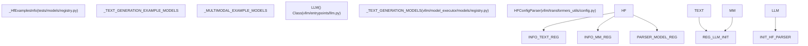
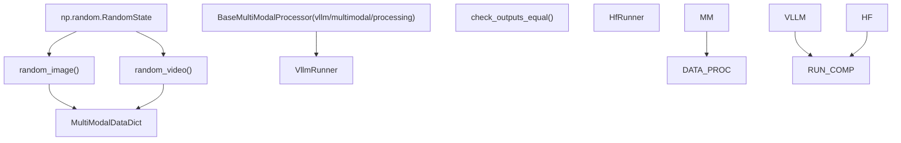

# 测试组织和基础设施

相关源文件

-   [docs/models/supported\_models.md](https://github.com/vllm-project/vllm/blob/7cc302dd/docs/models/supported_models.md?plain=1)
-   [examples/offline\_inference/audio\_language.py](https://github.com/vllm-project/vllm/blob/7cc302dd/examples/offline_inference/audio_language.py)
-   [examples/offline\_inference/vision\_language.py](https://github.com/vllm-project/vllm/blob/7cc302dd/examples/offline_inference/vision_language.py)
-   [examples/offline\_inference/vision\_language\_multi\_image.py](https://github.com/vllm-project/vllm/blob/7cc302dd/examples/offline_inference/vision_language_multi_image.py)
-   [tests/conftest.py](https://github.com/vllm-project/vllm/blob/7cc302dd/tests/conftest.py)
-   [tests/distributed/test\_pipeline\_parallel.py](https://github.com/vllm-project/vllm/blob/7cc302dd/tests/distributed/test_pipeline_parallel.py)
-   [tests/models/fixtures/qwen2\_5\_math\_prm\_reward\_step.json](https://github.com/vllm-project/vllm/blob/7cc302dd/tests/models/fixtures/qwen2_5_math_prm_reward_step.json)
-   [tests/models/language/pooling/embed\_utils.py](https://github.com/vllm-project/vllm/blob/7cc302dd/tests/models/language/pooling/embed_utils.py)
-   [tests/models/language/pooling/test\_embedding.py](https://github.com/vllm-project/vllm/blob/7cc302dd/tests/models/language/pooling/test_embedding.py)
-   [tests/models/language/pooling/test\_reward.py](https://github.com/vllm-project/vllm/blob/7cc302dd/tests/models/language/pooling/test_reward.py)
-   [tests/models/multimodal/generation/test\_common.py](https://github.com/vllm-project/vllm/blob/7cc302dd/tests/models/multimodal/generation/test_common.py)
-   [tests/models/multimodal/generation/vlm\_utils/model\_utils.py](https://github.com/vllm-project/vllm/blob/7cc302dd/tests/models/multimodal/generation/vlm_utils/model_utils.py)
-   [tests/models/multimodal/processing/test\_common.py](https://github.com/vllm-project/vllm/blob/7cc302dd/tests/models/multimodal/processing/test_common.py)
-   [tests/models/multimodal/processing/test\_tensor\_schema.py](https://github.com/vllm-project/vllm/blob/7cc302dd/tests/models/multimodal/processing/test_tensor_schema.py)
-   [tests/models/registry.py](https://github.com/vllm-project/vllm/blob/7cc302dd/tests/models/registry.py)
-   [tests/models/test\_initialization.py](https://github.com/vllm-project/vllm/blob/7cc302dd/tests/models/test_initialization.py)
-   [tests/models/utils.py](https://github.com/vllm-project/vllm/blob/7cc302dd/tests/models/utils.py)
-   [vllm/model\_executor/models/adapters.py](https://github.com/vllm-project/vllm/blob/7cc302dd/vllm/model_executor/models/adapters.py)
-   [vllm/model\_executor/models/mistral\_large\_3\_eagle.py](https://github.com/vllm-project/vllm/blob/7cc302dd/vllm/model_executor/models/mistral_large_3_eagle.py)
-   [vllm/model\_executor/models/registry.py](https://github.com/vllm-project/vllm/blob/7cc302dd/vllm/model_executor/models/registry.py)
-   [vllm/transformers\_utils/config.py](https://github.com/vllm-project/vllm/blob/7cc302dd/vllm/transformers_utils/config.py)
-   [vllm/transformers\_utils/configs/\_\_init\_\_.py](https://github.com/vllm-project/vllm/blob/7cc302dd/vllm/transformers_utils/configs/__init__.py)
-   [vllm/transformers\_utils/configs/mistral.py](https://github.com/vllm-project/vllm/blob/7cc302dd/vllm/transformers_utils/configs/mistral.py)
-   [vllm/transformers\_utils/model\_arch\_config\_convertor.py](https://github.com/vllm-project/vllm/blob/7cc302dd/vllm/transformers_utils/model_arch_config_convertor.py)

## 目的和范围

本文档解释了 vLLM 代码库中的测试组织方式，包括目录结构、pytest 配置、测试类别、fixture 以及测试注册表系统。它涵盖测试如何组织、分类，以及如何基于不同的硬件和功能标准进行选择并执行。

有关 CI/CD 流水线配置和测试执行基础设施的信息，请参见 [Buildkite CI 流水线](/vllm-project/vllm/12.2-buildkite-ci-pipelines)。有关硬件特定测试的详细信息，请参见 [硬件特定测试](/vllm-project/vllm/12.3-hardware-specific-testing)。有关模型正确性测试方法，请参见 [模型正确性验证](/vllm-project/vllm/12.4-model-correctness-validation)。

---

## 测试目录结构

vLLM 将测试组织在 `tests/` 目录下的层级化目录结构中。每个目录都对应代码库中的一个主要功能区域。

### 顶层测试组织

```mermaid
flowchart TD
    tests["tests/"]
    basic_correctness["basic_correctness/Basic inference correctness"]
    entrypoints["entrypoints/API and entrypoint tests"]
    distributed["distributed/Multi-GPU/node tests"]
    kernels["kernels/Low-level kernel tests"]
    models["models/Model-specific tests"]
    engine["engine/Engine component tests"]
    compile["compile/PyTorch compilation tests"]
    lora["lora/LoRA adapter tests"]
    quantization["quantization/Quantization tests"]
    samplers["samplers/Sampling tests"]
    v1["v1/V1 engine tests"]
    benchmarks_t["benchmarks/Test suite for benchmarks"]
    utils["utils_/Utility tests"]
    multimodal["multimodal/Multimodal input tests"]
    config["config/Configuration tests"]
    standalone_tests["standalone_tests/Standalone test scripts"]

    tests --> basic_correctness
    tests --> entrypoints
    tests --> distributed
    tests --> kernels
    tests --> models
    tests --> engine
    tests --> compile
    tests --> lora
    tests --> quantization
    tests --> samplers
    tests --> v1
    tests --> benchmarks_t
    tests --> utils
    tests --> multimodal
    tests --> config
    tests --> standalone_tests
```

**来源：** [tests/conftest.py130-133](https://github.com/vllm-project/vllm/blob/7cc302dd/tests/conftest.py#L130-L133) [tests/models/registry.py193-205](https://github.com/vllm-project/vllm/blob/7cc302dd/tests/models/registry.py#L193-L205)

### 目录详细划分

| 目录 | 目的 | 关键测试 |
| --- | --- | --- |
| `basic_correctness/` | 基础推理正确性 | `test_basic_correctness.py`、`test_cpu_offload.py` |
| `entrypoints/` | API 和接口测试 | `llm/`、`openai/`、`rpc/`、`pooling/` |
| `distributed/` | 并行执行测试 | `test_pipeline_parallel.py` |
| `models/` | 模型加载和执行 | `language/`、`multimodal/`、`test_initialization.py` |
| `models/multimodal/` | 视觉/音频/视频处理 | `processing/test_common.py`、`generation/test_common.py` |

**来源：** [tests/models/test\_initialization.py32-45](https://github.com/vllm-project/vllm/blob/7cc302dd/tests/models/test_initialization.py#L32-L45) [tests/models/multimodal/processing/test\_common.py193-212](https://github.com/vllm-project/vllm/blob/7cc302dd/tests/models/multimodal/processing/test_common.py#L193-L212)

---

## 模型测试注册表系统

vLLM 使用一个专门的注册表系统来管理大量受支持模型及其测试需求。它在 HuggingFace 架构与 vLLM 的内部执行逻辑之间架起了桥梁。

### 测试注册表数据流

**来源：** [tests/models/registry.py15-120](https://github.com/vllm-project/vllm/blob/7cc302dd/tests/models/registry.py#L15-L120) [vllm/model\_executor/models/registry.py70-158](https://github.com/vllm-project/vllm/blob/7cc302dd/vllm/model_executor/models/registry.py#L70-L158) [vllm/transformers\_utils/config.py156-200](https://github.com/vllm-project/vllm/blob/7cc302dd/vllm/transformers_utils/config.py#L156-L200)

### 关键注册表组件

-   **\_HfExamplesInfo**：一个 dataclass，用于存储特定架构的测试元数据，包括默认模型 ID、所需的 `transformers` 版本，以及诸如 `max_model_len` 之类的 CI 专用覆盖项 [tests/models/registry.py15-120](https://github.com/vllm-project/vllm/blob/7cc302dd/tests/models/registry.py#L15-L120)
-   **HF\_EXAMPLE\_MODELS**：一个注册表类（`HfExampleModels` 的别名），提供诸如 `get_hf_info()` 之类的辅助方法，用于在测试参数化期间获取模型元数据 [tests/models/multimodal/processing/test\_common.py87-91](https://github.com/vllm-project/vllm/blob/7cc302dd/tests/models/multimodal/processing/test_common.py#L87-L91)
-   **Transformers 建模后端**：列在 `_TRANSFORMERS_BACKEND_MODELS` 中的模型会在 vLLM 内部使用 HuggingFace Transformers 实现进行测试，而不是使用原生 vLLM 内核 [tests/models/test\_initialization.py166-168](https://github.com/vllm-project/vllm/blob/7cc302dd/tests/models/test_initialization.py#L166-L168) [docs/models/supported\_models.md16-18](https://github.com/vllm-project/vllm/blob/7cc302dd/docs/models/supported_models.md?plain=1#L16-L18)

**来源：** [tests/models/registry.py15-120](https://github.com/vllm-project/vllm/blob/7cc302dd/tests/models/registry.py#L15-L120) [tests/models/test\_initialization.py166-168](https://github.com/vllm-project/vllm/blob/7cc302dd/tests/models/test_initialization.py#L166-L168) [docs/models/supported\_models.md16-18](https://github.com/vllm-project/vllm/blob/7cc302dd/docs/models/supported_models.md?plain=1#L16-L18)

---

## 测试类别和 pytest 标记

vLLM 使用 pytest 标记对测试进行分类，并支持选择性执行，尤其用于管理硬件需求。

### 模型初始化子集

为了优化 CI 时间，模型初始化测试被拆分为两类：

1.  **MINIMAL\_MODEL\_ARCH\_LIST**：一组人工挑选的代表性架构子集（例如 `LlavaForConditionalGeneration`、`Gemma3nForCausalLM`、`DeepSeekMTPModel`），在每个 PR 上都会运行 [tests/models/test\_initialization.py32-45](https://github.com/vllm-project/vllm/blob/7cc302dd/tests/models/test_initialization.py#L32-L45)
2.  **OTHER\_MODEL\_ARCH\_LIST**：最小列表的补集，运行频率较低，或在专门的流水线中运行 [tests/models/test\_initialization.py47-52](https://github.com/vllm-project/vllm/blob/7cc302dd/tests/models/test_initialization.py#L47-L52)

### 常见 pytest 标记

-   `core_model`：任何发布都必须通过的关键模型 [tests/models/multimodal/generation/test\_common.py108](https://github.com/vllm-project/vllm/blob/7cc302dd/tests/models/multimodal/generation/test_common.py#L108-L108)
-   `cpu_model`：能够在 CPU 上运行初始化或基础处理的模型 [tests/models/multimodal/generation/test\_common.py108](https://github.com/vllm-project/vllm/blob/7cc302dd/tests/models/multimodal/generation/test_common.py#L108-L108)
-   `large_gpu_mark`：需要高显存的测试（例如 A100/H100） [tests/models/multimodal/generation/test\_common.py32](https://github.com/vllm-project/vllm/blob/7cc302dd/tests/models/multimodal/generation/test_common.py#L32-L32)

**来源：** [tests/models/test\_initialization.py32-52](https://github.com/vllm-project/vllm/blob/7cc302dd/tests/models/test_initialization.py#L32-L52) [tests/models/multimodal/generation/test\_common.py108](https://github.com/vllm-project/vllm/blob/7cc302dd/tests/models/multimodal/generation/test_common.py#L108-L108)

---

## 测试基础设施与 fixtures

vLLM 利用 `tests/conftest.py` 中的 `pytest` fixtures 来管理模型和分布式环境的生命周期。

### 核心 fixtures 与工具

| fixture / 工具 | 目的 |
| --- | --- |
| `dist_init` | 使用 `init_distributed_environment` 初始化单进程分布式环境 [tests/conftest.py224-237](https://github.com/vllm-project/vllm/blob/7cc302dd/tests/conftest.py#L224-L237) |
| `IMAGE_ASSETS` | 为多模态测试提供标准化图片（例如 `stop_sign`、`cherry_blossom`）的单例 [tests/conftest.py208-209](https://github.com/vllm-project/vllm/blob/7cc302dd/tests/conftest.py#L208-L209) |
| `create_new_process_for_each_test` | 通过为每个测试用例派生一个新进程来隔离 GPU 内存和状态的装饰器 [tests/models/test\_initialization.py55-65](https://github.com/vllm-project/vllm/blob/7cc302dd/tests/models/test_initialization.py#L55-L65) |
| `HFConfigParser` | 适配 HuggingFace 配置的组件，会应用测试注册表中定义的 `hf_overrides` [vllm/transformers\_utils/config.py156-183](https://github.com/vllm-project/vllm/blob/7cc302dd/vllm/transformers_utils/config.py#L156-L183) |

**来源：** [tests/conftest.py208-237](https://github.com/vllm-project/vllm/blob/7cc302dd/tests/conftest.py#L208-L237) [tests/models/test\_initialization.py55-65](https://github.com/vllm-project/vllm/blob/7cc302dd/tests/models/test_initialization.py#L55-L65) [vllm/transformers\_utils/config.py156-183](https://github.com/vllm-project/vllm/blob/7cc302dd/vllm/transformers_utils/config.py#L156-L183)

### 多模态测试基础设施

多模态测试使用通用处理框架来验证输入（图像、音频、视频）是否被正确分词并格式化为模型可接受的形式。

**来源：** [tests/models/multimodal/processing/test\_common.py121-168](https://github.com/vllm-project/vllm/blob/7cc302dd/tests/models/multimodal/processing/test_common.py#L121-L168) [tests/models/multimodal/generation/test\_common.py33-41](https://github.com/vllm-project/vllm/blob/7cc302dd/tests/models/multimodal/generation/test_common.py#L33-L41)

---

## 测试中的模型初始化流程

`tests/models/test_initialization.py` 中的 `can_initialize` 函数提供了一种标准化方式，用于验证模型能否在不执行完整前向传播的情况下加载到 vLLM 引擎中。

1.  **版本检查**：将已安装的 `transformers` 版本与模型要求进行比对 [tests/models/test\_initialization.py69-73](https://github.com/vllm-project/vllm/blob/7cc302dd/tests/models/test_initialization.py#L69-L73)
2.  **模拟 KV 缓存**：对 `V1EngineCore._initialize_kv_caches` 打补丁，以避免在简单初始化测试中分配巨大的内存块 [tests/models/test\_initialization.py83-99](https://github.com/vllm-project/vllm/blob/7cc302dd/tests/models/test_initialization.py#L83-L99)
3.  **Dummy 加载**：设置 `load_format="dummy"`，在仍然构建模型架构的同时跳过实际权重加载 [tests/models/test\_initialization.py165](https://github.com/vllm-project/vllm/blob/7cc302dd/tests/models/test_initialization.py#L165-L165)
4.  **后端选择**：根据注册表自动在 `vllm` 和 `transformers` 后端之间进行选择 [tests/models/test\_initialization.py166-168](https://github.com/vllm-project/vllm/blob/7cc302dd/tests/models/test_initialization.py#L166-L168)

**来源：** [tests/models/test\_initialization.py69-173](https://github.com/vllm-project/vllm/blob/7cc302dd/tests/models/test_initialization.py#L69-L173)
