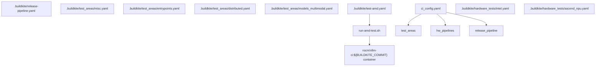
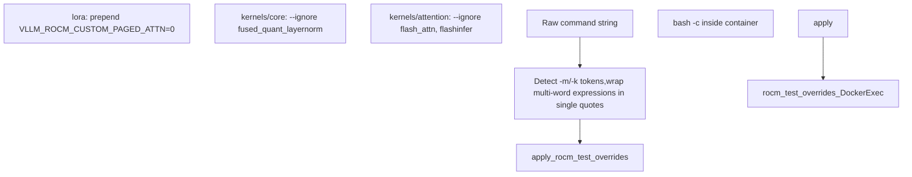
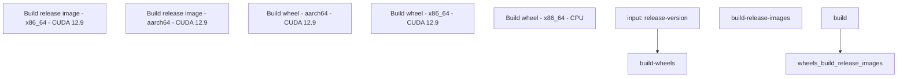

# Buildkite CI 流水线

相关源文件

-   [.buildkite/hardware\_tests/amd.yaml](https://github.com/vllm-project/vllm/blob/7cc302dd/.buildkite/hardware_tests/amd.yaml)
-   [.buildkite/hardware\_tests/ascend\_npu.yaml](https://github.com/vllm-project/vllm/blob/7cc302dd/.buildkite/hardware_tests/ascend_npu.yaml)
-   [.buildkite/hardware\_tests/gh200.yaml](https://github.com/vllm-project/vllm/blob/7cc302dd/.buildkite/hardware_tests/gh200.yaml)
-   [.buildkite/hardware\_tests/intel.yaml](https://github.com/vllm-project/vllm/blob/7cc302dd/.buildkite/hardware_tests/intel.yaml)
-   [.buildkite/release-pipeline.yaml](https://github.com/vllm-project/vllm/blob/7cc302dd/.buildkite/release-pipeline.yaml)
-   [.buildkite/scripts/annotate-release.sh](https://github.com/vllm-project/vllm/blob/7cc302dd/.buildkite/scripts/annotate-release.sh)
-   [.buildkite/scripts/annotate-rocm-release.sh](https://github.com/vllm-project/vllm/blob/7cc302dd/.buildkite/scripts/annotate-rocm-release.sh)
-   [.buildkite/scripts/cache-rocm-base-wheels.sh](https://github.com/vllm-project/vllm/blob/7cc302dd/.buildkite/scripts/cache-rocm-base-wheels.sh)
-   [.buildkite/scripts/cleanup-nightly-builds.sh](https://github.com/vllm-project/vllm/blob/7cc302dd/.buildkite/scripts/cleanup-nightly-builds.sh)
-   [.buildkite/scripts/hardware\_ci/run-amd-test.sh](https://github.com/vllm-project/vllm/blob/7cc302dd/.buildkite/scripts/hardware_ci/run-amd-test.sh)
-   [.buildkite/scripts/hardware\_ci/run-cpu-distributed-smoke-test.sh](https://github.com/vllm-project/vllm/blob/7cc302dd/.buildkite/scripts/hardware_ci/run-cpu-distributed-smoke-test.sh)
-   [.buildkite/scripts/push-nightly-builds-rocm.sh](https://github.com/vllm-project/vllm/blob/7cc302dd/.buildkite/scripts/push-nightly-builds-rocm.sh)
-   [.buildkite/scripts/push-nightly-builds.sh](https://github.com/vllm-project/vllm/blob/7cc302dd/.buildkite/scripts/push-nightly-builds.sh)
-   [.buildkite/scripts/upload-release-wheels-pypi.sh](https://github.com/vllm-project/vllm/blob/7cc302dd/.buildkite/scripts/upload-release-wheels-pypi.sh)
-   [.buildkite/scripts/upload-rocm-wheels.sh](https://github.com/vllm-project/vllm/blob/7cc302dd/.buildkite/scripts/upload-rocm-wheels.sh)
-   [.buildkite/test-amd.yaml](https://github.com/vllm-project/vllm/blob/7cc302dd/.buildkite/test-amd.yaml)
-   [.buildkite/test-pipeline.yaml](https://github.com/vllm-project/vllm/blob/7cc302dd/.buildkite/test-pipeline.yaml)
-   [.buildkite/test\_areas/basic\_correctness.yaml](https://github.com/vllm-project/vllm/blob/7cc302dd/.buildkite/test_areas/basic_correctness.yaml)
-   [.buildkite/test\_areas/distributed.yaml](https://github.com/vllm-project/vllm/blob/7cc302dd/.buildkite/test_areas/distributed.yaml)
-   [.buildkite/test\_areas/entrypoints.yaml](https://github.com/vllm-project/vllm/blob/7cc302dd/.buildkite/test_areas/entrypoints.yaml)
-   [.buildkite/test\_areas/misc.yaml](https://github.com/vllm-project/vllm/blob/7cc302dd/.buildkite/test_areas/misc.yaml)
-   [.buildkite/test\_areas/models\_basic.yaml](https://github.com/vllm-project/vllm/blob/7cc302dd/.buildkite/test_areas/models_basic.yaml)
-   [.buildkite/test\_areas/models\_language.yaml](https://github.com/vllm-project/vllm/blob/7cc302dd/.buildkite/test_areas/models_language.yaml)
-   [.buildkite/test\_areas/models\_multimodal.yaml](https://github.com/vllm-project/vllm/blob/7cc302dd/.buildkite/test_areas/models_multimodal.yaml)
-   [.buildkite/test\_areas/plugins.yaml](https://github.com/vllm-project/vllm/blob/7cc302dd/.buildkite/test_areas/plugins.yaml)
-   [.buildkite/test\_areas/samplers.yaml](https://github.com/vllm-project/vllm/blob/7cc302dd/.buildkite/test_areas/samplers.yaml)
-   [docs/design/dbo.md](https://github.com/vllm-project/vllm/blob/7cc302dd/docs/design/dbo.md?plain=1)
-   [examples/offline\_inference/data\_parallel.py](https://github.com/vllm-project/vllm/blob/7cc302dd/examples/offline_inference/data_parallel.py)
-   [tests/detokenizer/test\_disable\_detokenization.py](https://github.com/vllm-project/vllm/blob/7cc302dd/tests/detokenizer/test_disable_detokenization.py)
-   [tests/plugins\_tests/test\_terratorch\_io\_processor\_plugins.py](https://github.com/vllm-project/vllm/blob/7cc302dd/tests/plugins_tests/test_terratorch_io_processor_plugins.py)
-   [tests/v1/spec\_decode/\_\_init\_\_.py](https://github.com/vllm-project/vllm/blob/7cc302dd/tests/v1/spec_decode/__init__.py)
-   [tests/v1/spec\_decode/test\_acceptance\_length.py](https://github.com/vllm-project/vllm/blob/7cc302dd/tests/v1/spec_decode/test_acceptance_length.py)
-   [tools/vllm-rocm/generate-rocm-wheels-root-index.sh](https://github.com/vllm-project/vllm/blob/7cc302dd/tools/vllm-rocm/generate-rocm-wheels-root-index.sh)
-   [tools/vllm-rocm/pin\_rocm\_dependencies.py](https://github.com/vllm-project/vllm/blob/7cc302dd/tools/vllm-rocm/pin_rocm_dependencies.py)
-   [vllm/distributed/device\_communicators/xpu\_communicator.py](https://github.com/vllm-project/vllm/blob/7cc302dd/vllm/distributed/device_communicators/xpu_communicator.py)
-   [vllm/usage/usage\_lib.py](https://github.com/vllm-project/vllm/blob/7cc302dd/vllm/usage/usage_lib.py)

本文档描述了 vLLM 使用的 Buildkite 持续集成（CI）流水线配置系统，用于自动化测试。它涵盖流水线组织、YAML 配置格式、测试分类、硬件特定流水线、agent 池管理以及基于 Docker 的测试执行环境。有关通用测试组织和 pytest 配置，请参见第 12.1 页。有关 AMD 特定 GPU 测试流程和状态管理，请参见第 12.3 页。

## 流水线组织

Buildkite CI 配置已从一个单体文件重构为模块化结构。已废弃的 `.buildkite/test-pipeline.yaml` 文件表明迁移已于 2026 年 2 月 18 日完成，内容已拆分到多个目录中：

| 目录/文件 | 目的 |
| --- | --- |
| `.buildkite/test_areas/` | 按功能区域组织的测试作业定义（NVIDIA/通用） |
| `.buildkite/image_build/` | Docker 镜像构建作业 |
| `.buildkite/hardware_tests/` | 硬件特定测试作业（Intel、Ascend NPU、Arm 等） |
| `.buildkite/ci_config.yaml` | CI 流水线配置设置 |
| `.buildkite/test-amd.yaml` | AMD GPU 特定测试流水线（与 `test_areas/` 使用不同的 schema） |
| `.buildkite/release-pipeline.yaml` | 发布流水线：wheels、Docker 镜像、PyPI 发布 |

当前使用 **两种不同的 YAML schema**：

-   **`test_areas/*.yaml`**：用于 NVIDIA/通用 CI。每个文件定义一个命名组，其中的步骤可通过 `mirror:` 子键选择性镜像到 AMD 硬件。
-   **`test-amd.yaml`**：用于 AMD GPU 流水线。使用 `agent_pool:`、`mirror_hardwares:`、`fast_check:` 和 `torch_nightly:` 字段，这些字段在 `test_areas` schema 中不存在。

来源： [.buildkite/test-pipeline.yaml1-9](https://github.com/vllm-project/vllm/blob/7cc302dd/ .buildkite/test-pipeline.yaml#L1-L9) [.buildkite/test\_areas/misc.yaml1-4](https://github.com/vllm-project/vllm/blob/7cc302dd/ .buildkite/test_areas/misc.yaml#L1-L4) [.buildkite/test-amd.yaml1-34](https://github.com/vllm-project/vllm/blob/7cc302dd/ .buildkite/test-amd.yaml#L1-L34)

### 流水线架构

**流水线文件映射**


来源： [.buildkite/test-pipeline.yaml1-9](https://github.com/vllm-project/vllm/blob/7cc302dd/ .buildkite/test-pipeline.yaml#L1-L9) [.buildkite/test-amd.yaml1-34](https://github.com/vllm-project/vllm/blob/7cc302dd/ .buildkite/test-amd.yaml#L1-L34) [.buildkite/scripts/hardware\_ci/run-amd-test.sh1-28](https://github.com/vllm-project/vllm/blob/7cc302dd/ .buildkite/scripts/hardware_ci/run-amd-test.sh#L1-L28)

## 测试步骤配置

CI 配置中使用了两种不同的 YAML schema。

### `test_areas/*.yaml` 结构

`.buildkite/test_areas/` 中的每个文件都会定义一组用于 NVIDIA/通用测试的步骤。单个步骤可以选择性地镜像到 AMD 硬件上。

**顶层字段：**

| 字段 | 类型 | 说明 |
| --- | --- | --- |
| `group` | string | 在 Buildkite UI 中显示的组名 |
| `depends_on` | list | 必须先完成的步骤键（例如 `image-build`） |
| `steps` | list | 步骤定义列表 |

**`test_areas/` 中的逐步骤字段：**

| 字段 | 类型 | 说明 |
| --- | --- | --- |
| `label` | string | 步骤显示名称 |
| `timeout_in_minutes` | int | 步骤超时时间 |
| `commands` | list | 要运行的 shell 命令 |
| `source_file_dependencies` | list | 路径前缀；若无匹配变更则跳过该步骤 |
| `working_dir` | string | 容器内的工作目录 |
| `num_devices` | int | GPU 数量（1、2、4、8） |
| `parallelism` | int | 并行分片数量 |
| `optional` | bool | 需要手动解除阻塞后才能运行 |
| `device` | string | 目标设备类型（例如 `cpu`、`h100`、`a100`） |
| `mirror.amd.device` | string | 要镜像到的 AMD agent 池（例如 `mi325_1`） |

来自 `.buildkite/test_areas/distributed.yaml` 的示例：

```
group: Distributeddepends_on:   - image-buildsteps:- label: Distributed Comm Ops  timeout_in_minutes: 20  working_dir: "/vllm-workspace/tests"  num_devices: 2  source_file_dependencies:  - vllm/distributed  - tests/distributed  commands:  - pytest -v -s distributed/test_comm_ops.py
```
来源： [.buildkite/test\_areas/distributed.yaml1-17](https://github.com/vllm-project/vllm/blob/7cc302dd/ .buildkite/test_areas/distributed.yaml#L1-L17) [.buildkite/test\_areas/misc.yaml1-35](https://github.com/vllm-project/vllm/blob/7cc302dd/ .buildkite/test_areas/misc.yaml#L1-L35)

### `test-amd.yaml` 结构

`.buildkite/test-amd.yaml` 文件采用不同的 schema，并通过 Jinja2 模板进行处理。它包含 `test_areas/` 中没有的 AMD 特定字段：

| 字段 | 类型 | 说明 |
| --- | --- | --- |
| `agent_pool` | string | AMD GPU 池：`mi250_1`、`mi325_1` 等 |
| `mirror_hardwares` | list | 还会在以下硬件上运行：`amdexperimental`、`amdproduction`、`amdgfx90a` |
| `fast_check` | bool | 在快速检查流水线中对每个 commit 运行 |
| `torch_nightly` | bool | 包含在 torch nightly 流水线中 |
| `num_gpus` | int | GPU 数量覆盖 |
| `num_nodes` | int | 通过在一台主机上使用多个容器模拟多节点 |

来源： [.buildkite/test-amd.yaml8-27](https://github.com/vllm-project/vllm/blob/7cc302dd/ .buildkite/test-amd.yaml#L8-L27)

## 测试类别和组织

### 分布式和多 GPU 测试

分布式测试按 GPU 数量以及 Data Parallelism（DP）或 Pipeline Parallelism（PP）等特定功能进行分类。

| 测试标签 | GPU 数量 | 关键命令 / 环境 |
| --- | --- | --- |
| 分布式 DP 测试 | 2 / 4 GPU | `TP_SIZE=1 DP_SIZE=2 pytest ...` |
| 分布式 Torchrun | 4 GPU | `torchrun --nproc-per-node=4 ...` |
| 分布式通信操作 | 2 GPU | `pytest -v -s distributed/test_comm_ops.py` |

来源： [.buildkite/test\_areas/distributed.yaml5-38](https://github.com/vllm-project/vllm/blob/7cc302dd/ .buildkite/test_areas/distributed.yaml#L5-L38) [.buildkite/test\_areas/distributed.yaml83-114](https://github.com/vllm-project/vllm/blob/7cc302dd/ .buildkite/test_areas/distributed.yaml#L83-L114)

### 多模态模型测试

多模态测试分为“Standard”组，用于控制执行时间；以及“Extended”组，用于更深入的验证。

| 组 | 子类别 | 覆盖模型 |
| --- | --- | --- |
| Standard 1 | Qwen2 | `qwen2`、`ultravox` |
| Standard 2 | Qwen3/Gemma | `qwen3`、`gemma`、`qwen2_5_vl` |
| Standard 3 | LLaVA | `llava`、`qwen2_vl` |
| Standard 4 | Whisper/Other | `whisper`、`mantis` |

来源： [.buildkite/test\_areas/models\_multimodal.yaml5-64](https://github.com/vllm-project/vllm/blob/7cc302dd/ .buildkite/test_areas/models_multimodal.yaml#L5-L64)

## 测试执行环境

测试在具有特定 GPU 访问和资源配置的 Docker 容器中执行。`run-amd-test.sh` 脚本负责管理 ROCm 环境中的容器生命周期。

### Docker 容器执行流程

> **[Mermaid 序列图]**
> *(图表结构无法解析)*

来源： [.buildkite/scripts/hardware\_ci/run-amd-test.sh38-74](https://github.com/vllm-project/vllm/blob/7cc302dd/ .buildkite/scripts/hardware_ci/run-amd-test.sh#L38-L74) [.buildkite/scripts/hardware\_ci/run-amd-test.sh141-205](https://github.com/vllm-project/vllm/blob/7cc302dd/ .buildkite/scripts/hardware_ci/run-amd-test.sh#L141-L205)

### GPU 状态管理

脚本会在测试执行前通过检查硬件状态文件 `/opt/amdgpu/etc/gpu_state` 来确保 GPU 处于干净状态：

```
wait_for_clean_gpus() {  local timeout=${1:-300}  while true; do    if grep -q clean /opt/amdgpu/etc/gpu_state; then      echo "GPUs state is \"clean\""      return    fi    # ... timeout logic ...    sleep 3  done}
```
来源： [.buildkite/scripts/hardware\_ci/run-amd-test.sh38-53](https://github.com/vllm-project/vllm/blob/7cc302dd/ .buildkite/scripts/hardware_ci/run-amd-test.sh#L38-L53)

### 命令转换流水线

`run-amd-test.sh` 脚本会对命令字符串执行转换，以处理 shell 引号剥离以及 ROCm 特定覆盖。

**`run-amd-test.sh` 命令转换流程**


来源： [.buildkite/scripts/hardware\_ci/run-amd-test.sh141-205](https://github.com/vllm-project/vllm/blob/7cc302dd/ .buildkite/scripts/hardware_ci/run-amd-test.sh#L141-L205)

## 发布流水线

`.buildkite/release-pipeline.yaml` 文件负责协调 vLLM 发布，包括跨多个架构（x86_64、aarch64）和后端（CUDA 12.9、CUDA 13.0、CPU）的 wheel 包和 Docker 镜像发布。

### 发布流水线结构

**`.buildkite/release-pipeline.yaml` 步骤组**


来源： [.buildkite/release-pipeline.yaml1-118](https://github.com/vllm-project/vllm/blob/7cc302dd/ .buildkite/release-pipeline.yaml#L1-L118)

### 关键发布动作

| 动作 | 目标 / 命令 |
| --- | --- |
| **Wheel 构建** | `DOCKER_BUILDKIT=1 docker build --target build -f docker/Dockerfile` |
| **镜像构建** | `DOCKER_BUILDKIT=1 docker build --target vllm-openai -f docker/Dockerfile` |
| **S3 上传** | `bash .buildkite/scripts/upload-nightly-wheels.sh` |
| **ECR 推送** | `docker push public.ecr.aws/q9t5s3a7/vllm-release-repo:$BUILDKITE_COMMIT` |

来源： [.buildkite/release-pipeline.yaml19-22](https://github.com/vllm-project/vllm/blob/7cc302dd/ .buildkite/release-pipeline.yaml#L19-L22) [.buildkite/release-pipeline.yaml103-107](https://github.com/vllm-project/vllm/blob/7cc302dd/ .buildkite/release-pipeline.yaml#L103-L107)

## 源文件依赖

`source_file_dependencies` 字段可根据文件修改情况实现有选择性的测试执行。只有当其列出的任一文件前缀在当前 commit 中发生变更时，测试才会运行。

```
- label: Distributed Comm Ops  source_file_dependencies:  - vllm/distributed  - tests/distributed  commands:  - pytest -v -s distributed/test_comm_ops.py
```
来源： [.buildkite/test\_areas/distributed.yaml9-13](https://github.com/vllm-project/vllm/blob/7cc302dd/ .buildkite/test_areas/distributed.yaml#L9-L13) [.buildkite/test\_areas/misc.yaml5-10](https://github.com/vllm-project/vllm/blob/7cc302dd/ .buildkite/test_areas/misc.yaml#L5-L10)
