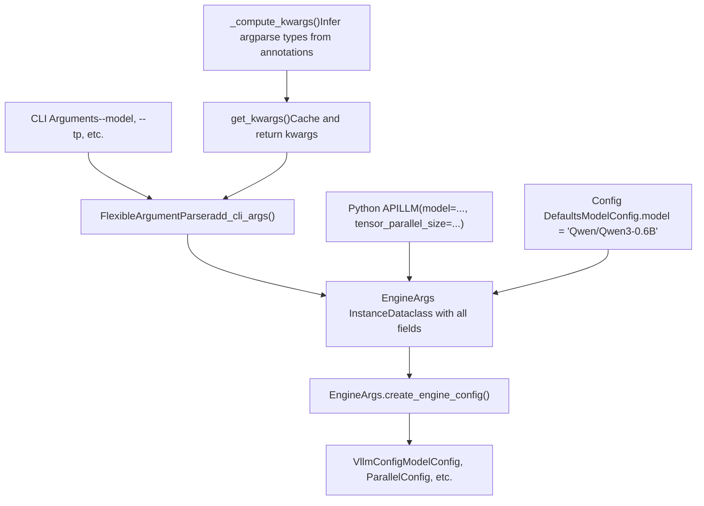
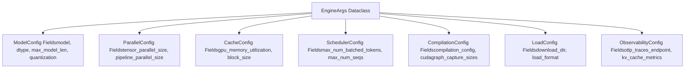
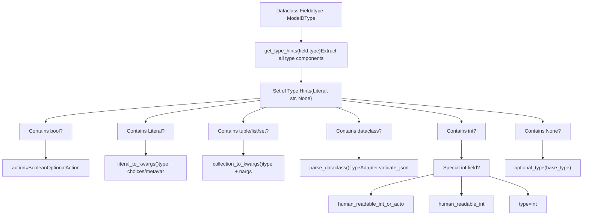
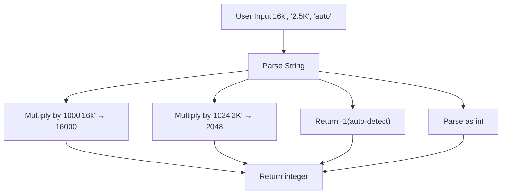

# 参数解析与 EngineArgs

相关源文件

-   [tests/compile/test\_aot\_compile.py](https://github.com/vllm-project/vllm/blob/7cc302dd/tests/compile/test_aot_compile.py)
-   [tests/compile/test\_compile\_ranges.py](https://github.com/vllm-project/vllm/blob/7cc302dd/tests/compile/test_compile_ranges.py)
-   [tests/compile/test\_config.py](https://github.com/vllm-project/vllm/blob/7cc302dd/tests/compile/test_config.py)
-   [tests/compile/test\_graph\_partition.py](https://github.com/vllm-project/vllm/blob/7cc302dd/tests/compile/test_graph_partition.py)
-   [tests/compile/test\_structured\_logging.py](https://github.com/vllm-project/vllm/blob/7cc302dd/tests/compile/test_structured_logging.py)
-   [tests/engine/test\_arg\_utils.py](https://github.com/vllm-project/vllm/blob/7cc302dd/tests/engine/test_arg_utils.py)
-   [tests/test\_config.py](https://github.com/vllm-project/vllm/blob/7cc302dd/tests/test_config.py)
-   [vllm/compilation/backends.py](https://github.com/vllm-project/vllm/blob/7cc302dd/vllm/compilation/backends.py)
-   [vllm/compilation/caching.py](https://github.com/vllm-project/vllm/blob/7cc302dd/vllm/compilation/caching.py)
-   [vllm/compilation/compiler\_interface.py](https://github.com/vllm-project/vllm/blob/7cc302dd/vllm/compilation/compiler_interface.py)
-   [vllm/compilation/counter.py](https://github.com/vllm-project/vllm/blob/7cc302dd/vllm/compilation/counter.py)
-   [vllm/compilation/decorators.py](https://github.com/vllm-project/vllm/blob/7cc302dd/vllm/compilation/decorators.py)
-   [vllm/compilation/monitor.py](https://github.com/vllm-project/vllm/blob/7cc302dd/vllm/compilation/monitor.py)
-   [vllm/compilation/piecewise\_backend.py](https://github.com/vllm-project/vllm/blob/7cc302dd/vllm/compilation/piecewise_backend.py)
-   [vllm/compilation/wrapper.py](https://github.com/vllm-project/vllm/blob/7cc302dd/vllm/compilation/wrapper.py)
-   [vllm/config/\_\_init\_\_.py](https://github.com/vllm-project/vllm/blob/7cc302dd/vllm/config/__init__.py)
-   [vllm/config/compilation.py](https://github.com/vllm-project/vllm/blob/7cc302dd/vllm/config/compilation.py)
-   [vllm/config/model.py](https://github.com/vllm-project/vllm/blob/7cc302dd/vllm/config/model.py)
-   [vllm/config/vllm.py](https://github.com/vllm-project/vllm/blob/7cc302dd/vllm/config/vllm.py)
-   [vllm/engine/arg\_utils.py](https://github.com/vllm-project/vllm/blob/7cc302dd/vllm/engine/arg_utils.py)

## 目的与范围

本文档描述了 vLLM 的参数解析系统，该系统以 `EngineArgs` dataclass 及其相关实用工具为中心，将命令行参数和 Python API 参数转换为配置对象。该系统将面向用户的接口（CLI, Python API）与驱动引擎初始化的内部 `VllmConfig` 对象连接起来。

有关 `EngineArgs` 生成的配置对象的信息，请参见 [VllmConfig 与专门的配置对象 (VllmConfig and Specialized Configuration Objects)](/vllm-project/vllm/2.2-vllmconfig-and-specialized-configuration-objects)。有关环境变量配置，请参见 [环境变量系统 (Environment Variables System)](/vllm-project/vllm/2.3-environment-variables-system)。有关编译特定的配置，请参见 [编译配置与优化级别 (Compilation Configuration and Optimization Levels)](/vllm-project/vllm/2.4-compilation-configuration-and-optimization-levels)。

---

## 系统概览

参数解析系统通过多阶段流水线将用户输入转换为经过验证的配置对象：

标题：参数解析流水线 (Argument Parsing Pipeline)


**来源：** [vllm/engine/arg\_utils.py1-1467](https://github.com/vllm-project/vllm/blob/7cc302dd/vllm/engine/arg_utils.py#L1-L1467) [vllm/utils/argparse\_utils.py1-200](https://github.com/vllm-project/vllm/blob/7cc302dd/vllm/utils/argparse_utils.py#L1-L200)

---

## EngineArgs Dataclass

`EngineArgs` dataclass 是所有引擎配置参数的中心聚合点。它包含大约 150 个字段，涵盖模型加载、并行、缓存、调度和专门特性。

### 关键特性

| 方面 | 详情 |
| --- | --- |
| **位置** | [vllm/engine/arg\_utils.py362-615](https://github.com/vllm-project/vllm/blob/7cc302dd/vllm/engine/arg_utils.py#L362-L615) |
| **类型** | 具有来自专门配置的字段默认值的 `@dataclass` |
| **字段数量** | 跨所有配置领域的约 150 个字段 |
| **初始化** | `__post_init__()` 处理插件加载和模型路径解析 |

### 字段组织

`EngineArgs` 中的字段按其目标配置对象进行组织：

标题：EngineArgs 字段映射 (EngineArgs Field Mapping)


**字段定义示例：**

```
# From vllm/engine/arg_utils.py:365-406model: str = ModelConfig.modeltensor_parallel_size: int = ParallelConfig.tensor_parallel_sizepipeline_parallel_size: int = ParallelConfig.pipeline_parallel_sizegpu_memory_utilization: float = CacheConfig.gpu_memory_utilizationmax_model_len: int = ModelConfig.max_model_len
```
**来源：** [vllm/engine/arg\_utils.py362-615](https://github.com/vllm-project/vllm/blob/7cc302dd/vllm/engine/arg_utils.py#L362-L615) [vllm/config/model.py100-143](https://github.com/vllm-project/vllm/blob/7cc302dd/vllm/config/model.py#L100-L143) [vllm/config/cache.py31-49](https://github.com/vllm-project/vllm/blob/7cc302dd/vllm/config/cache.py#L31-L49)

### 初始化后处理 (Post-Initialization Processing)

`__post_init__()` 方法执行关键的设置工作：

标题：EngineArgs 初始化流程 (EngineArgs Initialization Flow)

> **[Mermaid sequence]**
> *(图表结构无法解析)*

**`__post_init__()` 中的关键操作：**

1.  **配置对象转换** - [vllm/engine/arg\_utils.py622-633](https://github.com/vllm-project/vllm/blob/7cc302dd/vllm/engine/arg_utils.py#L622-L633)
    -   使用 `TypeAdapter` 将字典值的 `compilation_config`、`attention_config` 等转换为正确的配置对象。
2.  **插件加载** - [vllm/engine/arg\_utils.py635-637](https://github.com/vllm-project/vllm/blob/7cc302dd/vllm/engine/arg_utils.py#L635-L637)
    -   通过 `load_general_plugins()` 加载通用插件。
3.  **离线模型路径解析** - [vllm/engine/arg\_utils.py639-657](https://github.com/vllm-project/vllm/blob/7cc302dd/vllm/engine/arg_utils.py#L639-L657)
    -   当 `HF_HUB_OFFLINE=1` 时，通过 `get_model_path` 将模型 ID 替换为本地缓存路径。

**来源：** [vllm/engine/arg\_utils.py618-658](https://github.com/vllm-project/vllm/blob/7cc302dd/vllm/engine/arg_utils.py#L618-L658) [vllm/transformers\_utils/repo\_utils.py1-50](https://github.com/vllm-project/vllm/blob/7cc302dd/vllm/transformers_utils/repo_utils.py#L1-L50)

---

## CLI 参数注册

静态方法 `add_cli_args()` 为 `ArgumentParser` 填充所有 vLLM 引擎参数，并将其组织成逻辑组。

### 参数组结构

标题：CLI 参数组 (CLI Argument Groups)

```mermaid
flowchart TD
    Parser["FlexibleArgumentParser"]
    ModelGroup["ModelConfig Group--model, --dtype, --quantization--max-model-len, --tokenizer"]
    LoadGroup["LoadConfig Group--load-format, --download-dir"]
    AttentionGroup["AttentionConfig Group--attention-backend"]
    StructuredOutputsGroup["StructuredOutputsConfig Group--reasoning-parser"]
    ParallelGroup["ParallelConfig Group--tp, --pp, --dp--distributed-executor-backend"]
    SchedulerGroup["SchedulerConfig Group--max-num-batched-tokens--max-num-seqs, --policy"]
    CacheGroup["CacheConfig Group--gpu-memory-utilization--block-size, --kv-cache-dtype"]
    MultiModalGroup["MultiModalConfig Group--limit-mm-per-prompt--mm-processor-kwargs"]
    LoRAGroup["LoRAConfig Group--enable-lora, --max-loras--max-lora-rank"]
    CompilationGroup["CompilationConfig Group--compilation-configJSON or -cc.key=value"]
    ObservabilityGroup["ObservabilityConfig Group--otlp-traces-endpoint--kv-cache-metrics"]

    Parser --> ModelGroup
    Parser --> LoadGroup
    Parser --> AttentionGroup
    Parser --> StructuredOutputsGroup
    Parser --> ParallelGroup
    Parser --> SchedulerGroup
    Parser --> CacheGroup
    Parser --> MultiModalGroup
    Parser --> LoRAGroup
    Parser --> CompilationGroup
    Parser --> ObservabilityGroup
```


**实现模式：**

```
# From vllm/engine/arg_utils.py:660-752@staticmethoddef add_cli_args(parser: FlexibleArgumentParser) -> FlexibleArgumentParser:    # Model arguments    model_kwargs = get_kwargs(ModelConfig)    model_group = parser.add_argument_group(        title="ModelConfig",        description=ModelConfig.__doc__,    )    model_group.add_argument("--model", **model_kwargs["model"])    model_group.add_argument("--dtype", **model_kwargs["dtype"])    # ... more model arguments
```
**来源：** [vllm/engine/arg\_utils.py660-1162](https://github.com/vllm-project/vllm/blob/7cc302dd/vllm/engine/arg_utils.py#L660-L1162)

### 特殊参数处理

某些参数需要超出自动类型推断的自定义处理：

| 参数 | 特殊处理 | 位置 |
| --- | --- | --- |
| `--hf-token` | 支持 bool 或 str（flag 对应 const=True） | [vllm/engine/arg\_utils.py723-730](https://github.com/vllm-project/vllm/blob/7cc302dd/vllm/engine/arg_utils.py#L723-L730) |
| `--max-model-len` | 使用 `human_readable_int_or_auto()` 解析器 | [vllm/engine/arg\_utils.py309-311](https://github.com/vllm-project/vllm/blob/7cc302dd/vllm/engine/arg_utils.py#L309-L311) |
| `--compilation-config` | JSON 或简写 `-cc.key=value` 语法 | [vllm/engine/arg\_utils.py1128-1136](https://github.com/vllm-project/vllm/blob/7cc302dd/vllm/engine/arg_utils.py#L1128-L1136) |
| `--data-parallel-*` | 外部负载均衡器模式参数 | [vllm/engine/arg\_utils.py851-897](https://github.com/vllm-project/vllm/blob/7cc302dd/vllm/engine/arg_utils.py#L851-L897) |

**来源：** [vllm/engine/arg\_utils.py660-1162](https://github.com/vllm-project/vllm/blob/7cc302dd/vllm/engine/arg_utils.py#L660-L1162)

---

## 类型推断与参数生成

`get_kwargs()` 和 `_compute_kwargs()` 函数实现了复杂的类型推断，自动从配置 dataclass 的类型注解生成 `argparse` 参数规范。

### 类型推断流水线

标题：注解到 Argparse 逻辑 (Annotation to Argparse Logic)


### 类型注解到 Argparse 的映射

| 类型注解 | Argparse 配置 | 示例 |
| --- | --- | --- |
| `bool` | `action=BooleanOptionalAction` | `--enable-lora / --no-enable-lora` |
| `Literal["a", "b"]` | `type=str, choices=["a", "b"]` | `--policy fcfs/priority` |
| `Literal["a", "b"] | str` | `type=str, metavar=["a", "b"]` | 接受字面量或自定义值 |
| `list[int]` | `type=int, nargs="+"` | `--cudagraph-capture-sizes 1 2 4` |
| `tuple[int, int]` | `type=int, nargs=2` | 固定长度元组 |
| `int | None` | `type=optional_type(int)` | 接受 int 或 "None" |
| `SomeDataclass` | `type=parse_dataclass` | 通过 Pydantic 验证的 JSON 字符串 |

**来源：** [vllm/engine/arg\_utils.py132-346](https://github.com/vllm-project/vllm/blob/7cc302dd/vllm/engine/arg_utils.py#L132-L346)

---

## 配置对象创建

`create_engine_config()` 方法将 `EngineArgs` 实例转换为完全经过验证的 `VllmConfig` 对象。

### 配置组装流程

标题：EngineConfig 组装 (EngineConfig Assembly)

> **[Mermaid sequence]**
> *(图表结构无法解析)*

**配置创建的关键步骤：**

1.  **模型配置 (Model Configuration)** - [vllm/engine/arg\_utils.py1169-1225](https://github.com/vllm-project/vllm/blob/7cc302dd/vllm/engine/arg_utils.py#L1169-L1225)

    -   从模型相关参数创建 `ModelConfig`。
    -   通过 `get_pooling_config` 为池化模型设置 pooler 配置。
2.  **缓存配置 (Cache Configuration)** - [vllm/engine/arg\_utils.py1232-1250](https://github.com/vllm-project/vllm/blob/7cc302dd/vllm/engine/arg_utils.py#L1232-L1250)

    -   设置 KV 缓存参数，如 `gpu_memory_utilization` 和 `block_size`。
3.  **并行配置 (Parallel Configuration)** - [vllm/engine/arg\_utils.py1252-1281](https://github.com/vllm-project/vllm/blob/7cc302dd/vllm/engine/arg_utils.py#L1252-L1281)

    -   配置张量/流水线/数据并行大小。
4.  **调度配置 (Scheduler Configuration)** - [vllm/engine/arg\_utils.py1227-1230](https://github.com/vllm-project/vllm/blob/7cc302dd/vllm/engine/arg_utils.py#L1227-L1230)

    -   设置最大 token 数和序列数。

**来源：** [vllm/engine/arg\_utils.py1164-1413](https://github.com/vllm-project/vllm/blob/7cc302dd/vllm/engine/arg_utils.py#L1164-L1413) [vllm/config/vllm.py49-160](https://github.com/vllm-project/vllm/blob/7cc302dd/vllm/config/vllm.py#L49-L160)

---

## 特殊参数类型

### 人类可读的整数解析

`human_readable_int()` 和 `human_readable_int_or_auto()` 函数解析带有人类可读后缀的整数：

标题：人类可读的整数解析 (Human-Readable Integer Parsing)


**来源：** [vllm/engine/arg\_utils.py1393-1464](https://github.com/vllm-project/vllm/blob/7cc302dd/vllm/engine/arg_utils.py#L1393-L1464)

### 编译配置简写 (Compilation Config Shorthand)

`--compilation-config` 参数同时支持完整的 JSON 和简写 `-cc.key=value` 语法。简写语法在 `EngineArgs.from_cli_args()` 中处理，通过将 `-cc.key=value` 参数转换为嵌套字典更新来实现。

**来源：** [vllm/engine/arg\_utils.py1128-1162](https://github.com/vllm-project/vllm/blob/7cc302dd/vllm/engine/arg_utils.py#L1128-L1162)

---

## 验证与错误处理

验证发生在多个阶段，主要在配置类的 `__post_init__` 方法中以及通过 Pydantic 模型验证。

### 验证阶段

| 阶段 | 验证器 | 检查内容 |
| --- | --- | --- |
| **参数解析** | `argparse` 类型检查器 | 类型有效性、选择约束 |
| **EngineArgs 创建** | `__post_init__()` | 插件加载、路径解析 |
| **配置对象创建** | 单个配置的 `__post_init__()` | 字段特定约束 |
| **VllmConfig 组装** | `VllmConfig.__post_init__()` | 跨配置一致性、优化级别 |

**来源：** [vllm/config/vllm.py658-830](https://github.com/vllm-project/vllm/blob/7cc302dd/vllm/config/vllm.py#L658-L830) [vllm/engine/arg\_utils.py618-658](https://github.com/vllm-project/vllm/blob/7cc302dd/vllm/engine/arg_utils.py#L618-L658)

---

## 总结表：关键类和函数

| 符号 | 类型 | 目的 | 位置 |
| --- | --- | --- | --- |
| `EngineArgs` | `dataclass` | 中心参数聚合 | [vllm/engine/arg\_utils.py362-615](https://github.com/vllm-project/vllm/blob/7cc302dd/vllm/engine/arg_utils.py#L362-L615) |
| `AsyncEngineArgs` | `dataclass` | 异步特定引擎参数 | [vllm/engine/arg\_utils.py1416-1436](https://github.com/vllm-project/vllm/blob/7cc302dd/vllm/engine/arg_utils.py#L1416-L1436) |
| `add_cli_args()` | 静态方法 | 注册 CLI 参数 | [vllm/engine/arg\_utils.py660-1162](https://github.com/vllm-project/vllm/blob/7cc302dd/vllm/engine/arg_utils.py#L660-L1162) |
| `create_engine_config()` | 方法 | 转换为 `VllmConfig` | [vllm/engine/arg\_utils.py1164-1413](https://github.com/vllm-project/vllm/blob/7cc302dd/vllm/engine/arg_utils.py#L1164-L1413) |
| `get_kwargs()` | 函数 | 获取配置的 argparse kwargs | [vllm/engine/arg\_utils.py348-359](https://github.com/vllm-project/vllm/blob/7cc302dd/vllm/engine/arg_utils.py#L348-L359) |
| `_compute_kwargs()` | 函数 | 从类型推断 argparse kwargs | [vllm/engine/arg\_utils.py246-346](https://github.com/vllm-project/vllm/blob/7cc302dd/vllm/engine/arg_utils.py#L246-L346) |
| `VllmConfig` | 类 | 最终组装的配置 | [vllm/config/vllm.py49-160](https://github.com/vllm-project/vllm/blob/7cc302dd/vllm/config/vllm.py#L49-L160) |
| `FlexibleArgumentParser` | 类 | 扩展的 ArgumentParser | [vllm/utils/argparse\_utils.py14-200](https://github.com/vllm-project/vllm/blob/7cc302dd/vllm/utils/argparse_utils.py#L14-L200) |

**来源：** [vllm/engine/arg\_utils.py1-1467](https://github.com/vllm-project/vllm/blob/7cc302dd/vllm/engine/arg_utils.py#L1-L1467) [vllm/config/vllm.py1-160](https://github.com/vllm-project/vllm/blob/7cc302dd/vllm/config/vllm.py#L1-L160)
