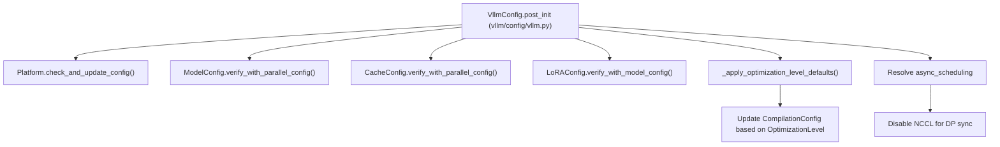

# VllmConfig 与专门的配置对象

相关源文件

-   [cmake/external\_projects/vllm\_flash\_attn.cmake](https://github.com/vllm-project/vllm/blob/7cc302dd/cmake/external_projects/vllm_flash_attn.cmake)
-   [examples/online\_serving/kv\_events\_subscriber.py](https://github.com/vllm-project/vllm/blob/7cc302dd/examples/online_serving/kv_events_subscriber.py)
-   [tests/compile/test\_aot\_compile.py](https://github.com/vllm-project/vllm/blob/7cc302dd/tests/compile/test_aot_compile.py)
-   [tests/compile/test\_compile\_ranges.py](https://github.com/vllm-project/vllm/blob/7cc302dd/tests/compile/test_compile_ranges.py)
-   [tests/compile/test\_config.py](https://github.com/vllm-project/vllm/blob/7cc302dd/tests/compile/test_config.py)
-   [tests/compile/test\_graph\_partition.py](https://github.com/vllm-project/vllm/blob/7cc302dd/tests/compile/test_graph_partition.py)
-   [tests/compile/test\_structured\_logging.py](https://github.com/vllm-project/vllm/blob/7cc302dd/tests/compile/test_structured_logging.py)
-   [tests/distributed/conftest.py](https://github.com/vllm-project/vllm/blob/7cc302dd/tests/distributed/conftest.py)
-   [tests/distributed/test\_events.py](https://github.com/vllm-project/vllm/blob/7cc302dd/tests/distributed/test_events.py)
-   [tests/engine/test\_arg\_utils.py](https://github.com/vllm-project/vllm/blob/7cc302dd/tests/engine/test_arg_utils.py)
-   [tests/test\_config.py](https://github.com/vllm-project/vllm/blob/7cc302dd/tests/test_config.py)
-   [tests/v1/cudagraph/test\_cudagraph\_dispatch.py](https://github.com/vllm-project/vllm/blob/7cc302dd/tests/v1/cudagraph/test_cudagraph_dispatch.py)
-   [tests/v1/cudagraph/test\_cudagraph\_mode.py](https://github.com/vllm-project/vllm/blob/7cc302dd/tests/v1/cudagraph/test_cudagraph_mode.py)
-   [tests/v1/kv\_connector/unit/test\_config.py](https://github.com/vllm-project/vllm/blob/7cc302dd/tests/v1/kv_connector/unit/test_config.py)
-   [tests/v1/kv\_connector/unit/test\_lmcache\_connector.py](https://github.com/vllm-project/vllm/blob/7cc302dd/tests/v1/kv_connector/unit/test_lmcache_connector.py)
-   [tools/pre\_commit/mypy.py](https://github.com/vllm-project/vllm/blob/7cc302dd/tools/pre_commit/mypy.py)
-   [vllm/compilation/backends.py](https://github.com/vllm-project/vllm/blob/7cc302dd/vllm/compilation/backends.py)
-   [vllm/compilation/caching.py](https://github.com/vllm-project/vllm/blob/7cc302dd/vllm/compilation/caching.py)
-   [vllm/compilation/compiler\_interface.py](https://github.com/vllm-project/vllm/blob/7cc302dd/vllm/compilation/compiler_interface.py)
-   [vllm/compilation/counter.py](https://github.com/vllm-project/vllm/blob/7cc302dd/vllm/compilation/counter.py)
-   [vllm/compilation/decorators.py](https://github.com/vllm-project/vllm/blob/7cc302dd/vllm/compilation/decorators.py)
-   [vllm/compilation/monitor.py](https://github.com/vllm-project/vllm/blob/7cc302dd/vllm/compilation/monitor.py)
-   [vllm/compilation/piecewise\_backend.py](https://github.com/vllm-project/vllm/blob/7cc302dd/vllm/compilation/piecewise_backend.py)
-   [vllm/compilation/wrapper.py](https://github.com/vllm-project/vllm/blob/7cc302dd/vllm/compilation/wrapper.py)
-   [vllm/config/\_\_init\_\_.py](https://github.com/vllm-project/vllm/blob/7cc302dd/vllm/config/__init__.py)
-   [vllm/config/attention.py](https://github.com/vllm-project/vllm/blob/7cc302dd/vllm/config/attention.py)
-   [vllm/config/cache.py](https://github.com/vllm-project/vllm/blob/7cc302dd/vllm/config/cache.py)
-   [vllm/config/compilation.py](https://github.com/vllm-project/vllm/blob/7cc302dd/vllm/config/compilation.py)
-   [vllm/config/device.py](https://github.com/vllm-project/vllm/blob/7cc302dd/vllm/config/device.py)
-   [vllm/config/kernel.py](https://github.com/vllm-project/vllm/blob/7cc302dd/vllm/config/kernel.py)
-   [vllm/config/kv\_events.py](https://github.com/vllm-project/vllm/blob/7cc302dd/vllm/config/kv_events.py)
-   [vllm/config/lora.py](https://github.com/vllm-project/vllm/blob/7cc302dd/vllm/config/lora.py)
-   [vllm/config/model.py](https://github.com/vllm-project/vllm/blob/7cc302dd/vllm/config/model.py)
-   [vllm/config/pooler.py](https://github.com/vllm-project/vllm/blob/7cc302dd/vllm/config/pooler.py)
-   [vllm/config/scheduler.py](https://github.com/vllm-project/vllm/blob/7cc302dd/vllm/config/scheduler.py)
-   [vllm/config/utils.py](https://github.com/vllm-project/vllm/blob/7cc302dd/vllm/config/utils.py)
-   [vllm/config/vllm.py](https://github.com/vllm-project/vllm/blob/7cc302dd/vllm/config/vllm.py)
-   [vllm/distributed/kv\_events.py](https://github.com/vllm-project/vllm/blob/7cc302dd/vllm/distributed/kv_events.py)
-   [vllm/engine/arg\_utils.py](https://github.com/vllm-project/vllm/blob/7cc302dd/vllm/engine/arg_utils.py)
-   [vllm/forward\_context.py](https://github.com/vllm-project/vllm/blob/7cc302dd/vllm/forward_context.py)
-   [vllm/model\_executor/layers/attention/mla\_attention.py](https://github.com/vllm-project/vllm/blob/7cc302dd/vllm/model_executor/layers/attention/mla_attention.py)
-   [vllm/v1/attention/backend.py](https://github.com/vllm-project/vllm/blob/7cc302dd/vllm/v1/attention/backend.py)
-   [vllm/v1/attention/backends/fa\_utils.py](https://github.com/vllm-project/vllm/blob/7cc302dd/vllm/v1/attention/backends/fa_utils.py)
-   [vllm/v1/attention/ops/paged\_attn.py](https://github.com/vllm-project/vllm/blob/7cc302dd/vllm/v1/attention/ops/paged_attn.py)
-   [vllm/v1/cudagraph\_dispatcher.py](https://github.com/vllm-project/vllm/blob/7cc302dd/vllm/v1/cudagraph_dispatcher.py)
-   [vllm/v1/worker/dp\_utils.py](https://github.com/vllm-project/vllm/blob/7cc302dd/vllm/v1/worker/dp_utils.py)

## 目的与范围

本页记录了 vLLM 的配置架构，该架构以 `VllmConfig` 根对象及其专门的子配置为中心。它涵盖了位于 `vllm/config/` 中的 `ModelConfig`, `ParallelConfig`, `CacheConfig`, `SchedulerConfig` 等的结构、关键字段和验证逻辑。

有关构建这些对象的 CLI/YAML 参数解析流水线，请参见 [2.1](https://github.com/vllm-project/vllm/blob/7cc302dd/2.1)。有关补充配置的环境变量，请参见 [2.3](https://github.com/vllm-project/vllm/blob/7cc302dd/2.3)。有关 `CompilationConfig` 和 `torch.compile` 集成，请参见 [2.4](https://github.com/vllm-project/vllm/blob/7cc302dd/2.4)。

---

## 软件包布局

所有配置类都定义在 `vllm/config/` 目录下，并通过 `vllm/config/__init__.py` 重新导出。vLLM 使用自定义的 `@config` 装饰器，将 Pydantic 验证应用于 Python dataclasses，从而实现严格的类型检查和范围验证（例如 `ge`, `le`）。

| 文件 | 主要类 |
| --- | --- |
| `vllm/config/vllm.py` | `VllmConfig`, `OptimizationLevel`, `PerformanceMode` |
| `vllm/config/model.py` | `ModelConfig` |
| `vllm/config/cache.py` | `CacheConfig` |
| `vllm/config/parallel.py` | `ParallelConfig`, `EPLBConfig` |
| `vllm/config/scheduler.py` | `SchedulerConfig` |
| `vllm/config/compilation.py` | `CompilationConfig`, `PassConfig`, `CompilationMode`, `CUDAGraphMode` |
| `vllm/config/attention.py` | `AttentionConfig` |
| `vllm/config/load.py` | `LoadConfig` |
| `vllm/config/lora.py` | `LoRAConfig` |
| `vllm/config/speculative.py` | `SpeculativeConfig` |
| `vllm/config/multimodal.py` | `MultiModalConfig` |
| `vllm/config/kernel.py` | `KernelConfig` |

来源：[vllm/config/\_\_init\_\_.py4-58](https://github.com/vllm-project/vllm/blob/7cc302dd/vllm/config/__init__.py#L4-L58) [vllm/config/utils.py41-49](https://github.com/vllm-project/vllm/blob/7cc302dd/vllm/config/utils.py#L41-L49)

---

## VllmConfig — 根容器

`VllmConfig` 是贯穿整个引擎、工作进程和执行流水线的中心配置对象。它将所有专门的配置对象聚合为类型化字段。

**VllmConfig 组成 — 映射概念到代码实体：**

```mermaid
flowchart TD
    VC["VllmConfig (vllm/config/vllm.py)"]
    MC["ModelConfig (vllm/config/model.py)"]
    CC["CacheConfig (vllm/config/cache.py)"]
    PC["ParallelConfig (vllm/config/parallel.py)"]
    SC["SchedulerConfig (vllm/config/scheduler.py)"]
    AC["AttentionConfig (vllm/config/attention.py)"]
    CPC["CompilationConfig (vllm/config/compilation.py)"]
    LC["LoadConfig (vllm/config/load.py)"]
    KC["KernelConfig (vllm/config/kernel.py)"]
    DC["DeviceConfig (vllm/config/device.py)"]
    LRC["LoRAConfig (vllm/config/lora.py)"]
    SPC["SpeculativeConfig (vllm/config/speculative.py)"]
    KVTC["KVTransferConfig (vllm/config/kv_transfer.py)"]
    SOC["StructuredOutputsConfig (vllm/config/structured_outputs.py)"]

    VC --> MC
    VC --> CC
    VC --> PC
    VC --> SC
    VC --> AC
    VC --> CPC
    VC --> LC
    VC --> KC
    VC --> DC
    VC --> LRC
    VC --> SPC
    VC --> KVTC
    VC --> SOC
```

来源：[vllm/config/vllm.py247-328](https://github.com/vllm-project/vllm/blob/7cc302dd/vllm/config/vllm.py#L247-L328)

### VllmConfig 的关键字段

| 字段 | 类型 | 默认值 | 描述 |
| --- | --- | --- | --- |
| `model_config` | `ModelConfig` | `None` | 模型身份、dtype 和分词器设置。 |
| `cache_config` | `CacheConfig` | `CacheConfig()` | KV 缓存块分配和内存限制。 |
| `parallel_config` | `ParallelConfig` | `ParallelConfig()` | 分布式执行 (TP/PP/DP) 程度。 |
| `scheduler_config` | `SchedulerConfig` | factory | 批处理大小和分块预填充设置。 |
| `compilation_config` | `CompilationConfig` | `CompilationConfig()` | `torch.compile` 和 CUDA 图设置。 |
| `optimization_level` | `OptimizationLevel` | `O2` | 编译/图形优化的预设。 |
| `performance_mode` | `PerformanceMode` | `"balanced"` | 延迟 vs 吞吐量的策略。 |

来源：[vllm/config/vllm.py246-329](https://github.com/vllm-project/vllm/blob/7cc302dd/vllm/config/vllm.py#L246-L329)

---

## ModelConfig

`ModelConfig` 管理模型特定的元数据，包括架构检测和分词器模式。它在初始化期间解析 Hugging Face 配置 (`hf_config`)。

| 字段 | 类型 | 默认值 | 注意事项 |
| --- | --- | --- | --- |
| `model` | `str` | `"Qwen/Qwen3-0.6B"` | HF 仓库 ID 或本地路径。 |
| `tokenizer_mode` | `TokenizerMode` | `"auto"` | `"auto"`, `"hf"`, `"slow"`, `"mistral"`, `"deepseek_v32"`。 |
| `dtype` | `ModelDType` | `"auto"` | 解析为 `torch.dtype` 或字符串表示。 |
| `max_model_len` | `int` | `None` | 如果未设置，则从 HF 配置中自动推导。 |
| `runner` | `RunnerOption` | `"auto"` | `"auto"`, `"generate"`, `"pooling"`, `"draft"`。 |
| `trust_remote_code` | `bool` | `False` | 允许执行自定义模型代码。 |

来源：[vllm/config/model.py106-175](https://github.com/vllm-project/vllm/blob/7cc302dd/vllm/config/model.py#L106-L175)

### Runner 和转换逻辑

`runner` 字段决定了 `runner_type`（例如 `generate` 或 `pooling`）。对于池化模型，`ModelConfig` 可能会通过 `convert` 字段触发适配器转换（例如 `embed` 或 `classify`）。

来源：[vllm/config/model.py82-98](https://github.com/vllm-project/vllm/blob/7cc302dd/vllm/config/model.py#L82-L98) [vllm/config/model.py381-408](https://github.com/vllm-project/vllm/blob/7cc302dd/vllm/config/model.py#L381-L408)

---

## CacheConfig

`CacheConfig` 定义了 KV 缓存如何分区和存储。

| 字段 | 类型 | 默认值 | 注意事项 |
| --- | --- | --- | --- |
| `block_size` | `int` | `None` | 以 token 为单位的连续块大小（默认为 16）。 |
| `gpu_memory_utilization` | `float` | `0.9` | 保留用于 KV 缓存的 VRAM 比例。 |
| `cache_dtype` | `CacheDType` | `"auto"` | `"auto"`, `"fp8"`, `"half"`。 |
| `enable_prefix_caching` | `bool` | `True` | 启用提示词/前缀共享。 |
| `mamba_cache_mode` | `MambaCacheMode` | `"none"` | Mamba 状态缓存策略。 |

来源：[vllm/config/cache.py31-115](https://github.com/vllm-project/vllm/blob/7cc302dd/vllm/config/cache.py#L31-L115)

---

## ParallelConfig

`ParallelConfig` 描述了分布式执行拓扑。它支持张量并行 (TP)、流水线并行 (PP) 和数据并行 (DP)。

| 字段 | 类型 | 默认值 | 注意事项 |
| --- | --- | --- | --- |
| `tensor_parallel_size` | `int` | `1` | 每个流水线阶段的分片数。 |
| `pipeline_parallel_size` | `int` | `1` | 流水线阶段的数量。 |
| `data_parallel_size` | `int` | `1` | 引擎副本的数量。 |
| `enable_expert_parallel` | `bool` | `False` | 在 rank 之间切分 MoE 专家。 |
| `all2all_backend` | `All2AllBackend` | `"allgather_reducescatter"` | MoE 的通信后端。 |

来源：[vllm/config/parallel.py99-173](https://github.com/vllm-project/vllm/blob/7cc302dd/vllm/config/parallel.py#L99-L173)

---

## SchedulerConfig

`SchedulerConfig` 控制请求生命周期和批处理约束。

| 字段 | 类型 | 默认值 | 注意事项 |
| --- | --- | --- | --- |
| `max_num_batched_tokens` | `int` | `2048` | 每次迭代的预算。 |
| `max_num_seqs` | `int` | `128` | 最大并发序列数。 |
| `enable_chunked_prefill` | `bool` | `True` | 将长提示词拆分为块。 |
| `async_scheduling` | `bool` | `None` | 将调度与 GPU 执行重叠。 |
| `policy` | `SchedulerPolicy` | `"fcfs"` | `"fcfs"` 或 `"priority"`。 |

来源：[vllm/config/scheduler.py26-148](https://github.com/vllm-project/vllm/blob/7cc302dd/vllm/config/scheduler.py#L26-L148)

---

## CompilationConfig 与 PassConfig

`CompilationConfig` 驱动 `torch.compile` 后端和 CUDA 图捕获。

-   **`CompilationMode`**：`NONE`, `STOCK_TORCH_COMPILE`, `DYNAMO_TRACE_ONCE`, 或 `VLLM_COMPILE`。[vllm/config/compilation.py35-48](https://github.com/vllm-project/vllm/blob/7cc302dd/vllm/config/compilation.py#L35-L48)
-   **`CUDAGraphMode`**：`NONE`, `PIECEWISE`, `FULL`, 或 `FULL_AND_PIECEWISE`。[vllm/config/compilation.py51-61](https://github.com/vllm-project/vllm/blob/7cc302dd/vllm/config/compilation.py#L51-L61)
-   **`PassConfig`**：包含自定义 Inductor pass 的标志，如 `fuse_norm_quant`, `fuse_act_quant`, 和 `fuse_allreduce_rms`。[vllm/config/compilation.py105-142](https://github.com/vllm-project/vllm/blob/7cc302dd/vllm/config/compilation.py#L105-L142)

---

## VllmConfig 初始化与验证

`VllmConfig.__post_init__` 方法作为一个中央验证枢纽，确保子配置之间的一致性。

**跨实体验证和数据流：**

来源：[vllm/config/vllm.py652-780](https://github.com/vllm-project/vllm/blob/7cc302dd/vllm/config/vllm.py#L652-L780)

### 优化级别预设 (Optimization Level Presets)

`OptimizationLevel` (O0-O3) 提供了性能预设。例如，`O2`（默认值）启用了分段 CUDA 图（piecewise CUDA graphs）和 `PassConfig` 中的各种融合 pass。

| 预设 | CUDA 图模式 | 融合 Pass |
| --- | --- | --- |
| `O0` | `NONE` | 全部 False |
| `O1` | `PIECEWISE` | 启用 Norm/Act 融合 |
| `O2` | `FULL_AND_PIECEWISE` | 启用所有融合（包括 AllReduce） |

来源：[vllm/config/vllm.py161-230](https://github.com/vllm-project/vllm/blob/7cc302dd/vllm/config/vllm.py#L161-L230)

### 配置哈希 (Configuration Hashing)

`VllmConfig` 实现了 `compute_hash()` 来生成配置的唯一指纹。该哈希用于缓存编译产物（例如 Triton 内核、CUDA 图）。不影响执行图的字段（如 `seed` 或 `served_model_name`）被排除在哈希之外。

来源：[vllm/config/vllm.py330-432](https://github.com/vllm-project/vllm/blob/7cc302dd/vllm/config/vllm.py#L330-L432) [vllm/config/model.py311-366](https://github.com/vllm-project/vllm/blob/7cc302dd/vllm/config/model.py#L311-L366)
