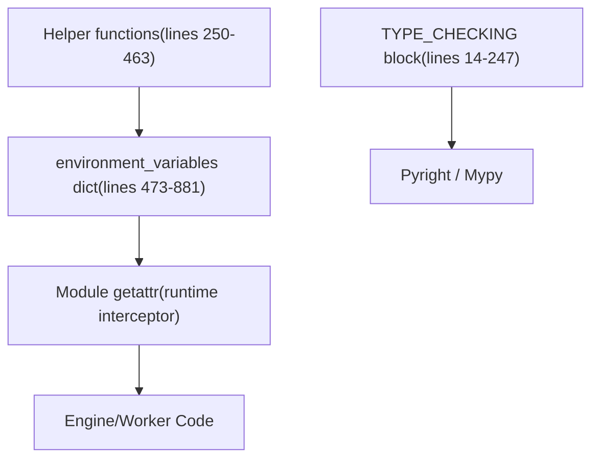
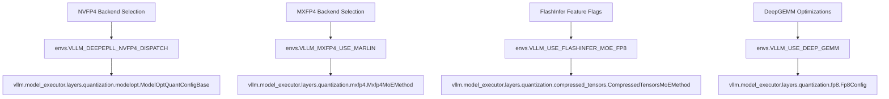
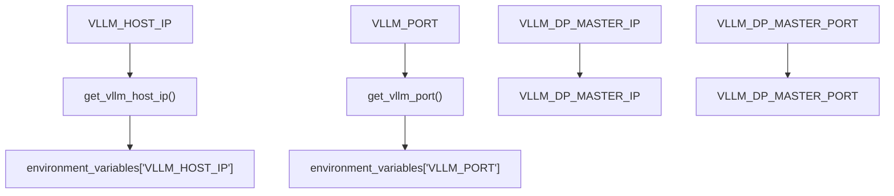

# 环境变量系统

相关源文件

-   [vllm/envs.py](https://github.com/vllm-project/vllm/blob/7cc302dd/vllm/envs.py)
-   [vllm/model\_executor/layers/fused\_moe/config.py](https://github.com/vllm-project/vllm/blob/7cc302dd/vllm/model_executor/layers/fused_moe/config.py)
-   [vllm/model\_executor/layers/fused\_moe/gpt\_oss\_triton\_kernels\_moe.py](https://github.com/vllm-project/vllm/blob/7cc302dd/vllm/model_executor/layers/fused_moe/gpt_oss_triton_kernels_moe.py)
-   [vllm/model\_executor/layers/fused\_moe/layer.py](https://github.com/vllm-project/vllm/blob/7cc302dd/vllm/model_executor/layers/fused_moe/layer.py)
-   [vllm/model\_executor/layers/fused\_moe/rocm\_aiter\_fused\_moe.py](https://github.com/vllm-project/vllm/blob/7cc302dd/vllm/model_executor/layers/fused_moe/rocm_aiter_fused_moe.py)
-   [vllm/model\_executor/layers/quantization/awq\_marlin.py](https://github.com/vllm-project/vllm/blob/7cc302dd/vllm/model_executor/layers/quantization/awq_marlin.py)
-   [vllm/model\_executor/layers/quantization/bitsandbytes.py](https://github.com/vllm-project/vllm/blob/7cc302dd/vllm/model_executor/layers/quantization/bitsandbytes.py)
-   [vllm/model\_executor/layers/quantization/compressed\_tensors/compressed\_tensors\_moe.py](https://github.com/vllm-project/vllm/blob/7cc302dd/vllm/model_executor/layers/quantization/compressed_tensors/compressed_tensors_moe.py)
-   [vllm/model\_executor/layers/quantization/experts\_int8.py](https://github.com/vllm-project/vllm/blob/7cc302dd/vllm/model_executor/layers/quantization/experts_int8.py)
-   [vllm/model\_executor/layers/quantization/fp8.py](https://github.com/vllm-project/vllm/blob/7cc302dd/vllm/model_executor/layers/quantization/fp8.py)
-   [vllm/model\_executor/layers/quantization/gguf.py](https://github.com/vllm-project/vllm/blob/7cc302dd/vllm/model_executor/layers/quantization/gguf.py)
-   [vllm/model\_executor/layers/quantization/gptq\_marlin.py](https://github.com/vllm-project/vllm/blob/7cc302dd/vllm/model_executor/layers/quantization/gptq_marlin.py)
-   [vllm/model\_executor/layers/quantization/modelopt.py](https://github.com/vllm-project/vllm/blob/7cc302dd/vllm/model_executor/layers/quantization/modelopt.py)
-   [vllm/model\_executor/layers/quantization/moe\_wna16.py](https://github.com/vllm-project/vllm/blob/7cc302dd/vllm/model_executor/layers/quantization/moe_wna16.py)
-   [vllm/model\_executor/layers/quantization/mxfp4.py](https://github.com/vllm-project/vllm/blob/7cc302dd/vllm/model_executor/layers/quantization/mxfp4.py)
-   [vllm/model\_executor/layers/quantization/quark/quark\_moe.py](https://github.com/vllm-project/vllm/blob/7cc302dd/vllm/model_executor/layers/quantization/quark/quark_moe.py)

本页记录了 `vllm/envs.py`，即 vLLM 的集中式环境变量注册表。它涵盖了该模块的结构、访问机制、辅助工具，以及所有 `VLLM_*` 变量的分类引用。有关这些变量如何在引擎启动时馈入强类型配置对象的信息，请参见 [配置对象 (Configuration Objects)](/vllm-project/vllm/2.2-vllmconfig-and-specialized-configuration-objects)。有关编译特定的设置，请参见 [VllmConfig](/vllm-project/vllm/2.2-vllmconfig-and-specialized-configuration-objects) 和 [编译配置 (Compilation Configuration)](/vllm-project/vllm/2.4-compilation-configuration-and-optimization-levels)。

---

## 概览

`vllm/envs.py` 是 vLLM 中所有环境变量定义的唯一权威来源。所有变量都在一个地方声明，包含其类型、默认值和验证逻辑，而不是将 `os.environ.get(...)` 调用分散在整个代码库中。代码库的其他部分通过模块级的 `__getattr__` 读取变量，该方法会延迟评估来自 `environment_variables` 字典的相应可调用对象 [vllm/envs.py1-13](https://github.com/vllm-project/vllm/blob/7cc302dd/vllm/envs.py#L1-L13)。

整个代码库中的使用模式：

```
import vllm.envs as envs # 访问在读取时进行延迟评估：if envs.VLLM_ROCM_USE_AITER:    ... chunk_size = envs.VLLM_V1_OUTPUT_PROC_CHUNK_SIZE
```
---

## 模块结构

该文件被组织成三层，共同提供类型安全和运行时灵活性。

**模块结构图：`vllm/envs.py`**


来源：`<FileRef file-url="https://github.com/vllm-project/vllm/blob/7cc302dd/vllm/envs.py#L14-L247" min=14 max=247 file-path="vllm/envs.py">Hii</FileRef>`, `<FileRef file-url="https://github.com/vllm-project/vllm/blob/7cc302dd/vllm/envs.py#L250-L463" min=250 max=463 file-path="vllm/envs.py">Hii</FileRef>`, `<FileRef file-url="https://github.com/vllm-project/vllm/blob/7cc302dd/vllm/envs.py#L473-L881" min=473 max=881 file-path="vllm/envs.py">Hii</FileRef>`

### `TYPE_CHECKING` 块

`<FileRef file-url="https://github.com/vllm-project/vllm/blob/7cc302dd/vllm/envs.py#L14-L247" min=14 max=247 file-path="vllm/envs.py">Hii</FileRef>` 包含一个由 `if TYPE_CHECKING:` 保护的块。该块声明了所有变量及其 Python 类型和默认值。它**永远不会在运行时执行**；其唯一目的是在代码执行 `import vllm.envs as envs; envs.VLLM_CACHE_ROOT` 时，为类型检查器和 IDE 工具提供准确的类型信息。

### `environment_variables` 字典

`<FileRef file-url="https://github.com/vllm-project/vllm/blob/7cc302dd/vllm/envs.py#L473-L881" min=473 max=881 file-path="vllm/envs.py">Hii</FileRef>` 定义了字典，其中每个条目都是一个零参数的可调用对象（通常是 lambda）。这些 lambda 在**每次访问变量时**都会被评估，确保导入后的环境变化能反映在系统中。

### 模块 `__getattr__`

该模块定义了一个 `__getattr__` 函数来拦截属性访问。它在 `environment_variables` 字典中查找请求的名称并执行相关的 lambda。这种实现确保了环境变量不会在模块级别被缓存，除非有明确的意图。

---

## 辅助工具 (Helper Utilities)

定义了几个实用函数以减少重复，并为布尔值、整数和列表等类型提供一致的解析逻辑。

| 函数 | 位置 | 目的 |
| --- | --- | --- |
| `maybe_convert_int` | `<FileRef file-url="https://github.com/vllm-project/vllm/blob/7cc302dd/vllm/envs.py#L264-L267" min=264 max=267 file-path="vllm/envs.py">Hii</FileRef>` | 将字符串转换为整数或返回 `None`。 |
| `maybe_convert_bool` | `<FileRef file-url="https://github.com/vllm-project/vllm/blob/7cc302dd/vllm/envs.py#L270-L273" min=270 max=273 file-path="vllm/envs.py">Hii</FileRef>` | 将 `"0"`/`"1"` 或 `"True"`/`"False"` 转换为布尔值。 |
| `env_with_choices` | `<FileRef file-url="https://github.com/vllm-project/vllm/blob/7cc302dd/vllm/envs.py#L298-L340" min=298 max=340 file-path="vllm/envs.py">Hii</FileRef>` | 根据一组允许的字符串验证环境变量。 |
| `env_list_with_choices` | `<FileRef file-url="https://github.com/vllm-project/vllm/blob/7cc302dd/vllm/envs.py#L343-L395" min=343 max=395 file-path="vllm/envs.py">Hii</FileRef>` | 解析带验证的逗号分隔列表。 |
| `get_vllm_port` | `<FileRef file-url="https://github.com/vllm-project/vllm/blob/7cc302dd/vllm/envs.py#L416-L442" min=416 max=442 file-path="vllm/envs.py">Hii</FileRef>` | 使用针对 Kubernetes URL 字符串的特定逻辑解析 `VLLM_PORT`。 |

来源：`<FileRef file-url="https://github.com/vllm-project/vllm/blob/7cc302dd/vllm/envs.py#L250-L463" min=250 max=463 file-path="vllm/envs.py">Hii</FileRef>`

---

## 整个代码库中的访问模式

下图将“自然语言”环境设置连接到消费它们的特定“代码实体”，特别是在量化和 MoE 子系统中。

**代码空间中的环境变量消费者 (Environment Variable Consumers in Code Space)**


来源：`<FileRef file-url="https://github.com/vllm-project/vllm/blob/7cc302dd/vllm/envs.py#L148-L154" min=148 max=154 file-path="vllm/envs.py">Hii</FileRef>`, `<FileRef file-url="https://github.com/vllm-project/vllm/blob/7cc302dd/vllm/model_executor/layers/quantization/modelopt.py#L133-L144" min=133 max=144 file-path="vllm/model_executor/layers/quantization/modelopt.py">Hii</FileRef>`, `<FileRef file-url="https://github.com/vllm-project/vllm/blob/7cc302dd/vllm/model_executor/layers/quantization/mxfp4.py#L126-L130" min=126 max=130 file-path="vllm/model_executor/layers/quantization/mxfp4.py">Hii</FileRef>`, `<FileRef file-url="https://github.com/vllm-project/vllm/blob/7cc302dd/vllm/model_executor/layers/quantization/compressed_tensors/compressed_tensors_moe.py#L119-L125" min=119 max=125 file-path="vllm/model_executor/layers/quantization/compressed_tensors/compressed_tensors_moe.py">Hii</FileRef>`, `<FileRef file-url="https://github.com/vllm-project/vllm/blob/7cc302dd/vllm/model_executor/layers/quantization/fp8.py#L96-L105" min=96 max=105 file-path="vllm/model_executor/layers/quantization/fp8.py">Hii</FileRef>`

---

## 变量参考（按类别）

### 量化与内核 (Quantization and Kernels)

这些变量控制优化内核和量化后端的选择，特别是对于 FP8 和 FP4 格式。

| 变量 | 类型 | 默认值 | 目的 |
| --- | --- | --- | --- |
| `VLLM_USE_DEEP_GEMM` | `bool` | `True` | 使用 DeepGEMM FP8 内核的总开关。`<FileRef file-url="https://github.com/vllm-project/vllm/blob/7cc302dd/vllm/envs.py#L154-L154" min=154 file-path="vllm/envs.py">Hii</FileRef>` |
| `VLLM_MOE_USE_DEEP_GEMM` | `bool` | `True` | 专门为 MoE 层启用 DeepGEMM。`<FileRef file-url="https://github.com/vllm-project/vllm/blob/7cc302dd/vllm/envs.py#L155-L155" min=155 file-path="vllm/envs.py">Hii</FileRef>` |
| `VLLM_MXFP4_USE_MARLIN` | `bool` | `None` | 如果为 True，强制 MXFP4 使用 Marlin 后端。`<FileRef file-url="https://github.com/vllm-project/vllm/blob/7cc302dd/vllm/envs.py#L148-L148" min=148 file-path="vllm/envs.py">Hii</FileRef>` |
| `VLLM_MARLIN_USE_ATOMIC_ADD` | `bool` | `False` | 在 Marlin 内核中使用原子加（atomic add）以提高性能。`<FileRef file-url="https://github.com/vllm-project/vllm/blob/7cc302dd/vllm/envs.py#L146-L146" min=146 file-path="vllm/envs.py">Hii</FileRef>` |
| `VLLM_USE_FLASHINFER_MOE_FP8` | `bool` | `False` | 启用 FlashInfer FP8 MoE 内核。`<FileRef file-url="https://github.com/vllm-project/vllm/blob/7cc302dd/vllm/envs.py#L166-L166" min=166 file-path="vllm/envs.py">Hii</FileRef>` |
| `VLLM_FLASHINFER_MOE_BACKEND` | `str` | `"latency"` | 在 `"throughput"`, `"latency"`, 或 `"masked_gemm"` 之间选择。`<FileRef file-url="https://github.com/vllm-project/vllm/blob/7cc302dd/vllm/envs.py#L169-L169" min=169 file-path="vllm/envs.py">Hii</FileRef>` |

来源：`<FileRef file-url="https://github.com/vllm-project/vllm/blob/7cc302dd/vllm/envs.py#L146-L170" min=146 max=170 file-path="vllm/envs.py">Hii</FileRef>`, `<FileRef file-url="https://github.com/vllm-project/vllm/blob/7cc302dd/vllm/model_executor/layers/quantization/fp8.py#L84-L86" min=84 max=86 file-path="vllm/model_executor/layers/quantization/fp8.py">Hii</FileRef>`, `<FileRef file-url="https://github.com/vllm-project/vllm/blob/7cc302dd/vllm/model_executor/layers/quantization/mxfp4.py#L126-L130" min=126 max=130 file-path="vllm/model_executor/layers/quantization/mxfp4.py">Hii</FileRef>`

### 分布式与多 GPU (Distributed and Multi-GPU)

控制分布式环境中的进程管理和进程间通信的变量。

| 变量 | 类型 | 默认值 | 目的 |
| --- | --- | --- | --- |
| `VLLM_WORKER_MULTIPROC_METHOD` | `str` | `"fork"` | 进程启动方法：`"fork"` 或 `"spawn"`。`<FileRef file-url="https://github.com/vllm-project/vllm/blob/7cc302dd/vllm/envs.py#L61-L61" min=61 file-path="vllm/envs.py">Hii</FileRef>` |
| `VLLM_DP_SIZE` | `int` | `1` | 数据并行 (Data Parallel) 的 world size。`<FileRef file-url="https://github.com/vllm-project/vllm/blob/7cc302dd/vllm/envs.py#L135-L135" min=135 file-path="vllm/envs.py">Hii</FileRef>` |
| `VLLM_USE_RAY_COMPILED_DAG_CHANNEL_TYPE` | `str` | `"auto"` | Ray Compiled DAG 的通道类型（`"nccl"`, `"shm"`）。`<FileRef file-url="https://github.com/vllm-project/vllm/blob/7cc302dd/vllm/envs.py#L57-L57" min=57 file-path="vllm/envs.py">Hii</FileRef>` |
| `VLLM_RAY_PER_WORKER_GPUS` | `float` | `1.0` | 分配给每个 Ray worker 的 GPU 数量。`<FileRef file-url="https://github.com/vllm-project/vllm/blob/7cc302dd/vllm/envs.py#L130-L130" min=130 file-path="vllm/envs.py">Hii</FileRef>` |

来源：`<FileRef file-url="https://github.com/vllm-project/vllm/blob/7cc302dd/vllm/envs.py#L57-L143" min=57 max=143 file-path="vllm/envs.py">Hii</FileRef>`, `<FileRef file-url="https://github.com/vllm-project/vllm/blob/7cc302dd/vllm/model_executor/layers/fused_moe/layer.py#L15-L20" min=15 max=20 file-path="vllm/model_executor/layers/fused_moe/layer.py">Hii</FileRef>`

### MoE (Mixture of Experts)

MoE 子系统的控制，包括并行策略和内核选择。

| 变量 | 类型 | 默认值 | 目的 |
| --- | --- | --- | --- |
| `VLLM_MOE_DP_CHUNK_SIZE` | `int` | `256` | MoE 数据并行的块大小。`<FileRef file-url="https://github.com/vllm-project/vllm/blob/7cc302dd/vllm/envs.py#L140-L140" min=140 file-path="vllm/envs.py">Hii</FileRef>` |
| `VLLM_ENABLE_MOE_DP_CHUNK` | `bool` | `True` | 为 MoE DP 启用分块。`<FileRef file-url="https://github.com/vllm-project/vllm/blob/7cc302dd/vllm/envs.py#L141-L141" min=141 file-path="vllm/envs.py">Hii</FileRef>` |
| `VLLM_USE_FUSED_MOE_GROUPED_TOPK` | `bool` | `True` | 在 MoE 路由中使用分组 Top-k 算法。`<FileRef file-url="https://github.com/vllm-project/vllm/blob/7cc302dd/vllm/envs.py#L163-L163" min=163 file-path="vllm/envs.py">Hii</FileRef>` |
| `VLLM_ROCM_USE_AITER_MOE` | `bool` | `True` | 启用 ROCm AITER 优化的 MoE 内核。`<FileRef file-url="https://github.com/vllm-project/vllm/blob/7cc302dd/vllm/envs.py#L106-L106" min=106 file-path="vllm/envs.py">Hii</FileRef>` |

来源：`<FileRef file-url="https://github.com/vllm-project/vllm/blob/7cc302dd/vllm/envs.py#L106-L163" min=106 max=163 file-path="vllm/envs.py">Hii</FileRef>`, `<FileRef file-url="https://github.com/vllm-project/vllm/blob/7cc302dd/vllm/model_executor/layers/fused_moe/layer.py#L66-L101" min=66 max=101 file-path="vllm/model_executor/layers/fused_moe/layer.py">Hii</FileRef>`, `<FileRef file-url="https://github.com/vllm-project/vllm/blob/7cc302dd/vllm/model_executor/layers/fused_moe/rocm_aiter_fused_moe.py#L110-L121" min=110 max=121 file-path="vllm/model_executor/layers/fused_moe/rocm_aiter_fused_moe.py">Hii</FileRef>`

### 日志与调试 (Logging and Debugging)

可观测性和开发者诊断的配置。

| 变量 | 类型 | 默认值 | 目的 |
| --- | --- | --- | --- |
| `VLLM_LOGGING_LEVEL` | `str` | `"INFO"` | vLLM 日志记录器的日志级别。`<FileRef file-url="https://github.com/vllm-project/vllm/blob/7cc302dd/vllm/envs.py#L40-L40" min=40 file-path="vllm/envs.py">Hii</FileRef>` |
| `VLLM_DEBUG_LOG_API_SERVER_RESPONSE` | `bool` | `False` | 记录 API 服务器的完整响应体。`<FileRef file-url="https://github.com/vllm-project/vllm/blob/7cc302dd/vllm/envs.py#L28-L28" min=28 file-path="vllm/envs.py">Hii</FileRef>` |
| `VLLM_LOG_STATS_INTERVAL` | `float` | `10.0` | 记录引擎统计信息的时间间隔（秒）。`<FileRef file-url="https://github.com/vllm-project/vllm/blob/7cc302dd/vllm/envs.py#L46-L46" min=46 file-path="vllm/envs.py">Hii</FileRef>` |
| `VLLM_SERVER_DEV_MODE` | `bool` | `False` | 启用开发者模式特性。`<FileRef file-url="https://github.com/vllm-project/vllm/blob/7cc302dd/vllm/envs.py#L127-L127" min=127 file-path="vllm/envs.py">Hii</FileRef>` |

来源：`<FileRef file-url="https://github.com/vllm-project/vllm/blob/7cc302dd/vllm/envs.py#L28-L127" min=28 max=127 file-path="vllm/envs.py">Hii</FileRef>`, `<FileRef file-url="https://github.com/vllm-project/vllm/blob/7cc302dd/vllm/model_executor/layers/fused_moe/layer.py#L56-L56" min=56 file-path="vllm/model_executor/layers/fused_moe/layer.py">Hii</FileRef>`

---

## 端口与主机解析

API 服务器和分布式引擎使用特定的层次结构来解析网络地址。

**网络解析流程 (Network Resolution Flow)**


来源：`<FileRef file-url="https://github.com/vllm-project/vllm/blob/7cc302dd/vllm/envs.py#L416-L442" min=416 max=442 file-path="vllm/envs.py">Hii</FileRef>`, `<FileRef file-url="https://github.com/vllm-project/vllm/blob/7cc302dd/vllm/envs.py#L15-L16" min=15 max=16 file-path="vllm/envs.py">Hii</FileRef>`, `<FileRef file-url="https://github.com/vllm-project/vllm/blob/7cc302dd/vllm/envs.py#L138-L139" min=138 max=139 file-path="vllm/envs.py">Hii</FileRef>`

### Kubernetes 服务发现

`get_vllm_port()` 明确检查 `VLLM_PORT` 是否包含方案（例如 `tcp://`）。这是 Kubernetes 中一种常见的失败模式，即名为 `vllm` 的服务导致环境变量 `VLLM_PORT` 被填充为 URL。在这种情况下，vLLM 将抛出 `ValueError` 以引导用户进行正确的配置。`<FileRef file-url="https://github.com/vllm-project/vllm/blob/7cc302dd/vllm/envs.py#L416-L442" min=416 max=442 file-path="vllm/envs.py">Hii</FileRef>`
