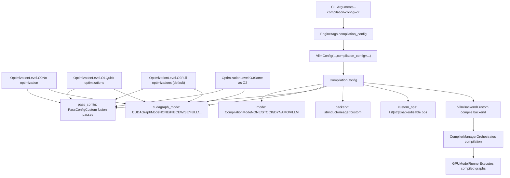
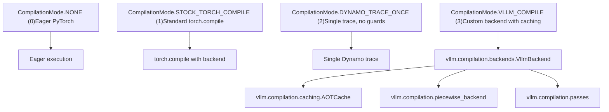
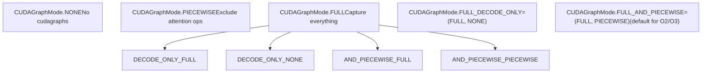
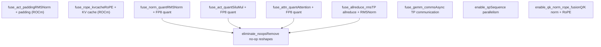
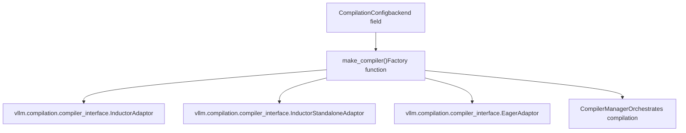

# 编译配置与优化级别

相关源文件

-   [benchmarks/kernels/benchmark\_trtllm\_decode\_attention.py](https://github.com/vllm-project/vllm/blob/7cc302dd/benchmarks/kernels/benchmark_trtllm_decode_attention.py)
-   [benchmarks/kernels/benchmark\_trtllm\_prefill\_attention.py](https://github.com/vllm-project/vllm/blob/7cc302dd/benchmarks/kernels/benchmark_trtllm_prefill_attention.py)
-   [csrc/activation\_kernels.cu](https://github.com/vllm-project/vllm/blob/7cc302dd/csrc/activation_kernels.cu)
-   [docs/usage/troubleshooting.md](https://github.com/vllm-project/vllm/blob/7cc302dd/docs/usage/troubleshooting.md?plain=1)
-   [docs/usage/v1\_guide.md](https://github.com/vllm-project/vllm/blob/7cc302dd/docs/usage/v1_guide.md?plain=1)
-   [tests/compile/README.md](https://github.com/vllm-project/vllm/blob/7cc302dd/tests/compile/README.md?plain=1)
-   [tests/compile/backend.py](https://github.com/vllm-project/vllm/blob/7cc302dd/tests/compile/backend.py)
-   [tests/compile/fullgraph/\_\_init\_\_.py](https://github.com/vllm-project/vllm/blob/7cc302dd/tests/compile/fullgraph/__init__.py)
-   [tests/compile/fullgraph/test\_basic\_correctness.py](https://github.com/vllm-project/vllm/blob/7cc302dd/tests/compile/fullgraph/test_basic_correctness.py)
-   [tests/compile/fullgraph/test\_full\_cudagraph.py](https://github.com/vllm-project/vllm/blob/7cc302dd/tests/compile/fullgraph/test_full_cudagraph.py)
-   [tests/compile/fullgraph/test\_full\_graph.py](https://github.com/vllm-project/vllm/blob/7cc302dd/tests/compile/fullgraph/test_full_graph.py)
-   [tests/compile/test\_aot\_compile.py](https://github.com/vllm-project/vllm/blob/7cc302dd/tests/compile/test_aot_compile.py)
-   [tests/compile/test\_compile\_ranges.py](https://github.com/vllm-project/vllm/blob/7cc302dd/tests/compile/test_compile_ranges.py)
-   [tests/compile/test\_config.py](https://github.com/vllm-project/vllm/blob/7cc302dd/tests/compile/test_config.py)
-   [tests/compile/test\_graph\_partition.py](https://github.com/vllm-project/vllm/blob/7cc302dd/tests/compile/test_graph_partition.py)
-   [tests/compile/test\_structured\_logging.py](https://github.com/vllm-project/vllm/blob/7cc302dd/tests/compile/test_structured_logging.py)
-   [tests/engine/test\_arg\_utils.py](https://github.com/vllm-project/vllm/blob/7cc302dd/tests/engine/test_arg_utils.py)
-   [tests/kernels/attention/test\_flashinfer\_trtllm\_attention.py](https://github.com/vllm-project/vllm/blob/7cc302dd/tests/kernels/attention/test_flashinfer_trtllm_attention.py)
-   [tests/kernels/core/test\_activation.py](https://github.com/vllm-project/vllm/blob/7cc302dd/tests/kernels/core/test_activation.py)
-   [tests/kernels/core/test\_activation.py](https://github.com/vllm-project/vllm/blob/7cc302dd/tests/kernels/core/test_activation.py)
-   [tests/models/quantization/test\_gpt\_oss.py](https://github.com/vllm-project/vllm/blob/7cc302dd/tests/models/quantization/test_gpt_oss.py)
-   [tests/test\_config.py](https://github.com/vllm-project/vllm/blob/7cc302dd/tests/test_config.py)
-   [vllm/compilation/backends.py](https://github.com/vllm-project/vllm/blob/7cc302dd/vllm/compilation/backends.py)
-   [vllm/compilation/caching.py](https://github.com/vllm-project/vllm/blob/7cc302dd/vllm/compilation/caching.py)
-   [vllm/compilation/compiler\_interface.py](https://github.com/vllm-project/vllm/blob/7cc302dd/vllm/compilation/compiler_interface.py)
-   [vllm/compilation/counter.py](https://github.com/vllm-project/vllm/blob/7cc302dd/vllm/compilation/counter.py)
-   [vllm/compilation/decorators.py](https://github.com/vllm-project/vllm/blob/7cc302dd/vllm/compilation/decorators.py)
-   [vllm/compilation/monitor.py](https://github.com/vllm-project/vllm/blob/7cc302dd/vllm/compilation/monitor.py)
-   [vllm/compilation/piecewise\_backend.py](https://github.com/vllm-project/vllm/blob/7cc302dd/vllm/compilation/piecewise_backend.py)
-   [vllm/compilation/wrapper.py](https://github.com/vllm-project/vllm/blob/7cc302dd/vllm/compilation/wrapper.py)
-   [vllm/config/\_\_init\_\_.py](https://github.com/vllm-project/vllm/blob/7cc302dd/vllm/config/__init__.py)
-   [vllm/config/compilation.py](https://github.com/vllm-project/vllm/blob/7cc302dd/vllm/config/compilation.py)
-   [vllm/config/model.py](https://github.com/vllm-project/vllm/blob/7cc302dd/vllm/config/model.py)
-   [vllm/config/vllm.py](https://github.com/vllm-project/vllm/blob/7cc302dd/vllm/config/vllm.py)
-   [vllm/engine/arg\_utils.py](https://github.com/vllm-project/vllm/blob/7cc302dd/vllm/engine/arg_utils.py)
-   [vllm/env\_override.py](https://github.com/vllm-project/vllm/blob/7cc302dd/vllm/env_override.py)
-   [vllm/model\_executor/layers/activation.py](https://github.com/vllm-project/vllm/blob/7cc302dd/vllm/model_executor/layers/activation.py)
-   [vllm/model\_executor/models/gpt\_oss.py](https://github.com/vllm-project/vllm/blob/7cc302dd/vllm/model_executor/models/gpt_oss.py)

本页记录了 vLLM 的编译配置系统，该系统控制 `torch.compile` 集成、CUDA 图捕获、自定义优化 pass 以及性能调优级别。有关常规配置架构，请参见 [VllmConfig 与专门的配置对象 (VllmConfig and Specialized Configuration Objects)](/vllm-project/vllm/2.2-vllmconfig-and-specialized-configuration-objects)。有关运行时执行行为，请参见 [GPUModelRunner](/vllm-project/vllm/4.1-gpumodelrunner)。

## 概览

vLLM 使用 PyTorch 的编译基础设施，通过多种策略优化模型执行：

1.  **torch.compile** 集成自定义后端。
2.  **CUDA 图捕获 (CUDA graph capture)** 以减少启动开销。
3.  **自定义 Inductor pass**，用于融合优化（FP8 量化、序列并行等）。
4.  **优化级别 (Optimization levels)** (O0-O3)，捆绑了常用配置。

编译系统由 `CompilationConfig` 控制，它是更大的 `VllmConfig` 对象的一部分。

标题：编译配置架构 (Compilation Configuration Architecture)


来源：[vllm/config/compilation.py357-404](https://github.com/vllm-project/vllm/blob/7cc302dd/vllm/config/compilation.py#L357-L404) [vllm/config/vllm.py67-80](https://github.com/vllm-project/vllm/blob/7cc302dd/vllm/config/vllm.py#L67-L80) [vllm/config/vllm.py167-243](https://github.com/vllm-project/vllm/blob/7cc302dd/vllm/config/vllm.py#L167-L243)

## CompilationConfig 结构

`CompilationConfig` 组织在 `vllm/config/compilation.py` 定义的功能区域中：

### 顶层编译控制 (Top-Level Compilation Control)

| 字段 | 类型 | 默认值 | 描述 |
| --- | --- | --- | --- |
| `mode` | `CompilationMode` | `None` (→ 3 对应 V1) | 编译方法：NONE, STOCK\_TORCH\_COMPILE, DYNAMO\_TRACE\_ONCE, 或 VLLM\_COMPILE。 |
| `backend` | `str` | `""` (→ inductor) | 后端名称："inductor", "eager", 或限定类名。 |
| `custom_ops` | `list[str]` | `[]` | 对自定义算子的细粒度控制（例如 `["+quant_fp8", "-rms_norm"]`）。 |
| `splitting_ops` | `list[str] | None` | `None` | 在分段编译中排除在 cudagraph 之外的算子。 |
| `compile_mm_encoder` | `bool` | `False` | 是否编译多模态编码器。 |
| `debug_dump_path` | `Path | None` | `None` | 调试产物的目录（depyf 输出、图形）。 |
| `cache_dir` | `str` | `""` | Inductor 缓存目录（如果为空则自动生成）。 |

### CUDA 图捕获设置 (CUDA Graph Capture Settings)

| 字段 | 类型 | 默认值 | 描述 |
| --- | --- | --- | --- |
| `cudagraph_mode` | `CUDAGraphMode` | `None` (由优化级别设置) | 使用哪种 cudagraph 策略。 |
| `cudagraph_capture_sizes` | `list[int] | None` | `None` | 要捕获的显式批处理大小（如果为 None 则自动生成）。 |
| `max_cudagraph_capture_size` | `int | None` | `None` | cudagraph 捕获的最大批处理大小。 |
| `cudagraph_num_of_warmups` | `int` | `0` | 捕获前的预热迭代次数。 |
| `cudagraph_copy_inputs` | `bool` | `False` | 将输入复制到 cudagraph 的静态缓冲区。 |

### Inductor 编译设置 (Inductor Compilation Settings)

| 字段 | 类型 | 默认值 | 描述 |
| --- | --- | --- | --- |
| `compile_sizes` | `list[int | str] | None` | `None` | Inductor 编译的大小（可以包含 "cudagraph\_capture\_sizes"）。 |
| `compile_ranges_endpoints` | `list[int] | None` | `None` | 分段编译的范围终点。 |
| `inductor_compile_config` | `dict` | `{}` | 额外的 inductor 配置。 |
| `pass_config` | `PassConfig` | `PassConfig()` | 自定义融合 pass 的配置。 |
| `use_inductor_graph_partition` | `bool` | `False` | 使用 inductor 级分区而不是 FX 级分区。 |

来源：[vllm/config/compilation.py357-565](https://github.com/vllm-project/vllm/blob/7cc302dd/vllm/config/compilation.py#L357-L565)

## CompilationMode

`CompilationMode` 枚举定义了四种编译方法，详见 [vllm/config/compilation.py35-49](https://github.com/vllm-project/vllm/blob/7cc302dd/vllm/config/compilation.py#L35-L49)：

标题：编译模式逻辑空间 (Compilation Mode Logic Space)


### 模式特性

-   **NONE (0)**：不编译，完全 eager PyTorch 模式。模型在没有任何图形捕获或优化的情况下按原样运行。用于调试或不希望编译的情况。
-   **STOCK\_TORCH\_COMPILE (1)**：使用标准的 `torch.compile(backend=...)` 流水线。整个模型前向传递被编译为单个图形。自定义选项有限。
-   **DYNAMO\_TRACE\_ONCE (2)**：没有重编译保护 (recompilation guards) 的单个 Dynamo 追踪。避免了依赖动态形状的控制流。要求模型没有基于张量大小的分支。启动速度更快，但灵活性较差。
-   **VLLM\_COMPILE (3)** (V1 的默认值)：自定义 vLLM 后端，具有：
    -   分段编译（在 attention 算子处拆分图形）。
    -   AOT 编译缓存，实现快速冷启动。
    -   形状特化和基于范围的编译。
    -   用于融合的自定义 Inductor pass。

来源：[vllm/config/compilation.py35-49](https://github.com/vllm-project/vllm/blob/7cc302dd/vllm/config/compilation.py#L35-L49) [vllm/compilation/backends.py90-116](https://github.com/vllm-project/vllm/blob/7cc302dd/vllm/compilation/backends.py#L90-L116)

## CUDAGraphMode

`CUDAGraphMode` 控制 CUDA 图捕获策略，定义见 [vllm/config/compilation.py51-102](https://github.com/vllm-project/vllm/blob/7cc302dd/vllm/config/compilation.py#L51-L102)：

标题：CUDA 图模式状态 (CUDA Graph Mode States)


### 模式详情

-   **NONE**：没有 CUDA 图捕获。所有操作都使用标准的 CUDA 内核启动来执行。
-   **PIECEWISE**：构建分段 cudagraph，排除不兼容 cudagraph 的算子（通常是 attention）。这些算子在图形之外运行。在性能和兼容性之间提供了良好的平衡。
-   **FULL**：在 CUDA 图中捕获整个前向传递。对于小型模型或具有小提示词的工作负载性能最佳。并非所有 attention 后端都支持。
-   **FULL\_DECODE\_ONLY**：对纯 decode 批处理使用全量 cudagraph，但在运行混合 prefill-decode 批处理时不使用 cudagraph。
-   **FULL\_AND\_PIECEWISE** (默认值)：对 decode 批处理捕获全量 cudagraph，对混合批处理捕获分段 cudagraph。总体性能最佳。由 O2 和 O3 优化级别使用。

该模式在 [vllm/config/compilation.py63-96](https://github.com/vllm-project/vllm/blob/7cc302dd/vllm/config/compilation.py#L63-L96) 提供了辅助方法，如 `decode_mode()`, `mixed_mode()`, `has_mode()`, 和 `requires_piecewise_compilation()`。

来源：[vllm/config/compilation.py51-102](https://github.com/vllm-project/vllm/blob/7cc302dd/vllm/config/compilation.py#L51-L102) [vllm/v1/cudagraph\_dispatcher.py1-29](https://github.com/vllm-project/vllm/blob/7cc302dd/vllm/v1/cudagraph_dispatcher.py#L1-L29)

## PassConfig

`PassConfig` 控制用于模型特定融合的自定义 Inductor 优化 pass，定义见 [vllm/config/compilation.py105-292](https://github.com/vllm-project/vllm/blob/7cc302dd/vllm/config/compilation.py#L105-L292)：

标题：融合 Pass 配置 (Fusion Pass Configuration)


### 关键 Pass 配置字段

| 字段 | 类型 | 默认值 | 描述 |
| --- | --- | --- | --- |
| `fuse_norm_quant` | `bool` | 由优化级别设置 | 融合 RMSNorm + FP8 量化自定义算子。 |
| `fuse_act_quant` | `bool` | 由优化级别设置 | 融合 SiluMul + FP8 量化自定义算子。 |
| `fuse_attn_quant` | `bool` | 由优化级别设置 | 融合 attention + FP8 量化算子。 |
| `fuse_allreduce_rms` | `bool` | 由优化级别设置 | 融合 TP allreduce + RMSNorm（仅限 Hopper/Blackwell）。 |
| `enable_sp` | `bool` | 由优化级别设置 | 启用序列并行 (Sequence Parallelism) (TP > 1)。 |
| `fuse_gemm_comms` | `bool` | 由优化级别设置 | 启用异步 TP 通信。 |
| `eliminate_noops` | `bool` | `True` | 移除无操作的 reshape（许多融合所需）。 |

来源：[vllm/config/compilation.py105-292](https://github.com/vllm-project/vllm/blob/7cc302dd/vllm/config/compilation.py#L105-L292) [vllm/compilation/passes/inductor\_pass.py1-49](https://github.com/vllm-project/vllm/blob/7cc302dd/vllm/compilation/passes/inductor_pass.py#L1-L49)

## 优化级别 (Optimization Levels)

vLLM 提供了四个优化级别 (O0-O3)，捆绑了常用配置。这些在 `VllmConfig` 的初始化后 (post-initialization) 阶段被应用。

### 优化级别定义

```
class OptimizationLevel(IntEnum):    O0 = 0  # 无优化    O1 = 1  # 快速优化    O2 = 2  # 完全优化 (默认值)    O3 = 3  # 与 O2 相同
```
来源：[vllm/config/vllm.py67-80](https://github.com/vllm-project/vllm/blob/7cc302dd/vllm/config/vllm.py#L67-L80)

### 级别配置

优化级别到配置的映射定义在 `vllm/config/vllm.py`：

标题：优化级别默认映射 (Optimization Level Default Mappings)

```mermaid
flowchart TD
    O2_Mode["cudagraph_mode: FULL_AND_PIECEWISE"]
    O2_Norm["fuse_norm_quant: enable_norm_fusion"]
    O2_Act["fuse_act_quant: enable_act_fusion"]
    O2_Allreduce["fuse_allreduce_rms: enable_allreduce_rms_fusion"]
    O2_AttnQuant["fuse_attn_quant: IS_QUANTIZED"]
    O2_SP["enable_sp: IS_DENSE"]
    O2_Gemm["fuse_gemm_comms: IS_DENSE"]
    O2_Autotune["enable_flashinfer_autotune: True"]
    O1_Mode["cudagraph_mode: PIECEWISE"]
    O1_Norm["fuse_norm_quant: enable_norm_fusion"]
    O1_Act["fuse_act_quant: enable_act_fusion"]
    O1_Autotune["enable_flashinfer_autotune: True"]
    O1_Other["Other fusions: False"]
    O0_Mode["cudagraph_mode: NONE"]
    O0_Passes["All fusion passes: False"]
    O0_Autotune["enable_flashinfer_autotune: False"]
    O0_Partition["use_inductor_graph_partition: False"]
```


### 条件性融合启用 (Conditional Fusion Enablement)

有几个融合根据引擎配置使用动态启用逻辑：

-   `enable_norm_fusion`：如果启用了 RMS norm 或量化 FP8 自定义算子，则激活 [vllm/config/vllm.py94-101](https://github.com/vllm-project/vllm/blob/7cc302dd/vllm/config/vllm.py#L94-L101)
-   `enable_act_fusion`：如果 SiLU+Mul 或量化 FP8 自定义算子被激活，或者对于 NVFP4 量化模型，则激活 [vllm/config/vllm.py103-114](https://github.com/vllm-project/vllm/blob/7cc302dd/vllm/config/vllm.py#L103-L114)
-   `enable_allreduce_rms_fusion`：如果 TP > 1，在具有 flashinfer 的 Hopper/Blackwell 上运行，且 DP=PP=1，则激活 [vllm/config/vllm.py116-135](https://github.com/vllm-project/vllm/blob/7cc302dd/vllm/config/vllm.py#L116-L135)
-   `enable_rope_kvcache_fusion`：对于 ROCm 平台，如果 `rotary_embedding` 自定义算子激活且启用了图形分区，则激活 [vllm/config/vllm.py138-151](https://github.com/vllm-project/vllm/blob/7cc302dd/vllm/config/vllm.py#L138-L151)

来源：[vllm/config/vllm.py167-243](https://github.com/vllm-project/vllm/blob/7cc302dd/vllm/config/vllm.py#L167-L243) [vllm/config/vllm.py94-151](https://github.com/vllm-project/vllm/blob/7cc302dd/vllm/config/vllm.py#L94-L151)

## 后端选择与编译器接口

### 后端架构

编译后端通过 `vllm/compilation/backends.py` 中的 `make_compiler` 选择并实例化 [vllm/compilation/backends.py90-116](https://github.com/vllm-project/vllm/blob/7cc302dd/vllm/compilation/backends.py#L90-L116)：

标题：编译器适配器注册表 (Compiler Adaptor Registry)


### CompilerInterface 方法

所有编译器适配器都实现了在 [vllm/compilation/compiler\_interface.py26-114](https://github.com/vllm-project/vllm/blob/7cc302dd/vllm/compilation/compiler_interface.py#L26-L114) 中定义的 `CompilerInterface`：

| 方法 | 目的 |
| --- | --- |
| `initialize_cache` | 为编译器建立缓存目录结构。 |
| `compute_hash` | 从 `VllmConfig` 生成缓存键的哈希值。 |
| `compile` | 编译 FX 图形，返回可调用对象和句柄。 |
| `load` | 从句柄加载编译产物。 |

### 编译缓存流程 (Compilation Caching Flow)

vLLM 实现了 AOT (Ahead-Of-Time) 缓存，以避免在引擎重启期间进行冗余编译。`CompilerManager` 维护了从 `(Range, graph_index, backend_name)` 到编译产物的映射 [vllm/compilation/backends.py118-138](https://github.com/vllm-project/vllm/blob/7cc302dd/vllm/compilation/backends.py#L118-L138)

标题：编译缓存序列 (Compilation Caching Sequence)

> **[Mermaid sequence]**
> *(图表结构无法解析)*

来源：[vllm/compilation/backends.py118-210](https://github.com/vllm-project/vllm/blob/7cc302dd/vllm/compilation/backends.py#L118-L210) [vllm/compilation/compiler\_interface.py26-114](https://github.com/vllm-project/vllm/blob/7cc302dd/vllm/compilation/compiler_interface.py#L26-L114)

## 环境变量

编译行为可以使用以下环境变量进行微调：

| 变量 | 作用 |
| --- | --- |
| `VLLM_DISABLE_COMPILE_CACHE` | 禁用 AOT 编译缓存 [vllm/compilation/compiler\_interface.py181](https://github.com/vllm-project/vllm/blob/7cc302dd/vllm/compilation/compiler_interface.py#L181-L181) |
| `VLLM_USE_STANDALONE_COMPILE` | 强制使用 Inductor 的独立编译流水线 [vllm/compilation/backends.py98](https://github.com/vllm-project/vllm/blob/7cc302dd/vllm/compilation/backends.py#L98-L98) |
| `VLLM_USE_MEGA_AOT_ARTIFACT` | 将多个 AOT 产物组合成单个文件 [vllm/compilation/backends.py91](https://github.com/vllm-project/vllm/blob/7cc302dd/vllm/compilation/backends.py#L91-L91) |
| `VLLM_COMPILE_CACHE_SAVE_FORMAT` | 设置保存格式为 "binary" 或 "unpacked" [vllm/compilation/compiler\_interface.py103](https://github.com/vllm-project/vllm/blob/7cc302dd/vllm/compilation/compiler_interface.py#L103-L103) |

来源：[vllm/compilation/backends.py90-116](https://github.com/vllm-project/vllm/blob/7cc302dd/vllm/compilation/backends.py#L90-L116) [vllm/compilation/compiler\_interface.py170-185](https://github.com/vllm-project/vllm/blob/7cc302dd/vllm/compilation/compiler_interface.py#L170-L185)
