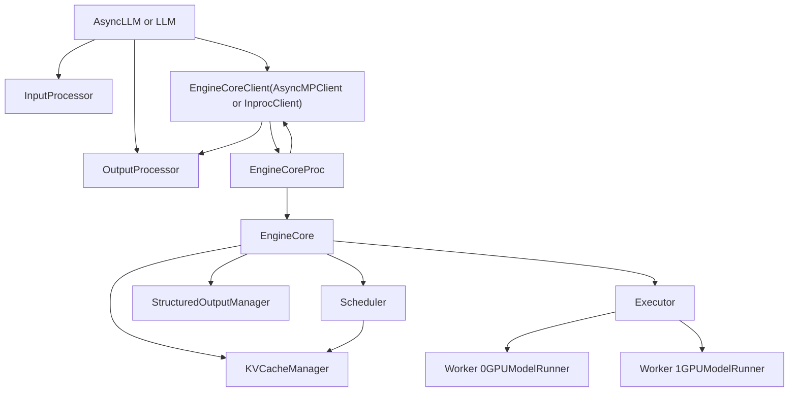
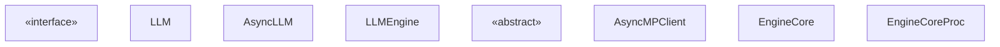
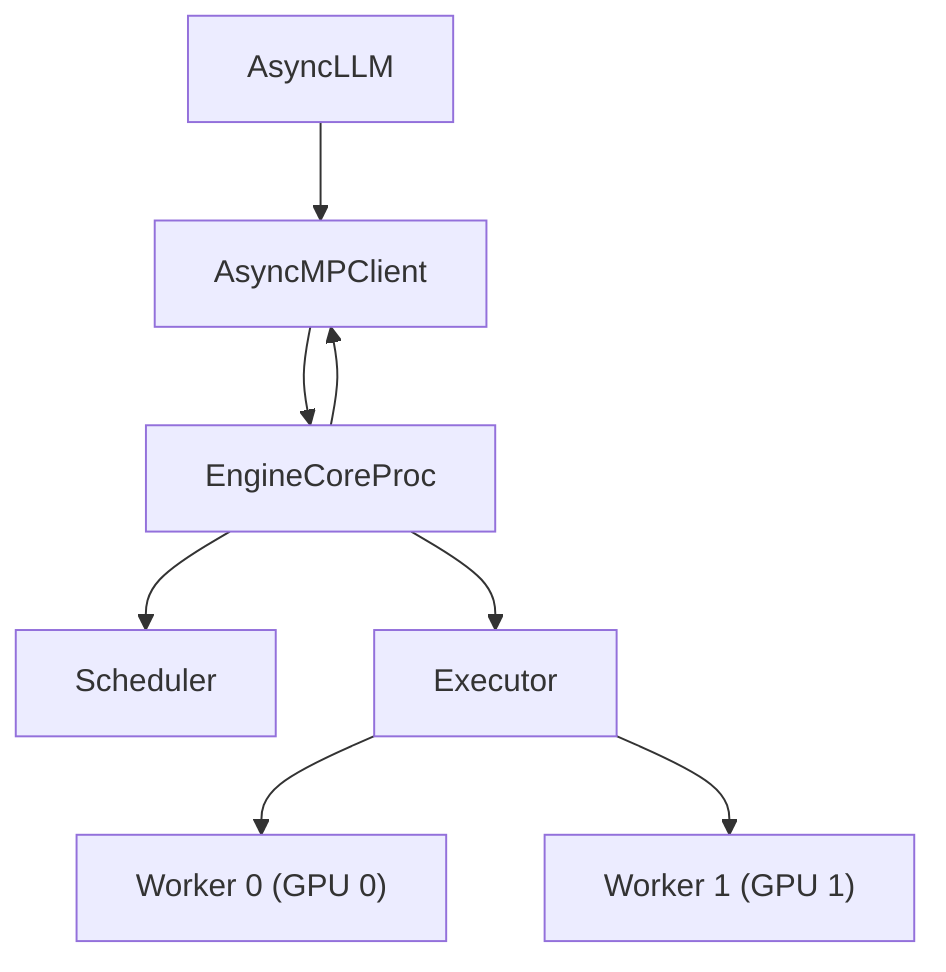

# 引擎架构

相关源文件

-   [tests/entrypoints/test\_api\_server\_process\_manager.py](https://github.com/vllm-project/vllm/blob/7cc302dd/tests/entrypoints/test_api_server_process_manager.py)
-   [tests/v1/core/test\_kv\_cache\_utils.py](https://github.com/vllm-project/vllm/blob/7cc302dd/tests/v1/core/test_kv_cache_utils.py)
-   [tests/v1/core/test\_prefix\_caching.py](https://github.com/vllm-project/vllm/blob/7cc302dd/tests/v1/core/test_prefix_caching.py)
-   [tests/v1/core/test\_scheduler.py](https://github.com/vllm-project/vllm/blob/7cc302dd/tests/v1/core/test_scheduler.py)
-   [tests/v1/core/test\_single\_type\_kv\_cache\_manager.py](https://github.com/vllm-project/vllm/blob/7cc302dd/tests/v1/core/test_single_type_kv_cache_manager.py)
-   [tests/v1/core/utils.py](https://github.com/vllm-project/vllm/blob/7cc302dd/tests/v1/core/utils.py)
-   [tests/v1/engine/test\_engine\_core.py](https://github.com/vllm-project/vllm/blob/7cc302dd/tests/v1/engine/test_engine_core.py)
-   [tests/v1/engine/test\_engine\_core\_client.py](https://github.com/vllm-project/vllm/blob/7cc302dd/tests/v1/engine/test_engine_core_client.py)
-   [vllm/config/parallel.py](https://github.com/vllm-project/vllm/blob/7cc302dd/vllm/config/parallel.py)
-   [vllm/engine/async\_llm\_engine.py](https://github.com/vllm-project/vllm/blob/7cc302dd/vllm/engine/async_llm_engine.py)
-   [vllm/engine/llm\_engine.py](https://github.com/vllm-project/vllm/blob/7cc302dd/vllm/engine/llm_engine.py)
-   [vllm/engine/protocol.py](https://github.com/vllm-project/vllm/blob/7cc302dd/vllm/engine/protocol.py)
-   [vllm/entrypoints/cli/serve.py](https://github.com/vllm-project/vllm/blob/7cc302dd/vllm/entrypoints/cli/serve.py)
-   [vllm/entrypoints/launcher.py](https://github.com/vllm-project/vllm/blob/7cc302dd/vllm/entrypoints/launcher.py)
-   [vllm/entrypoints/llm.py](https://github.com/vllm-project/vllm/blob/7cc302dd/vllm/entrypoints/llm.py)
-   [vllm/v1/core/block\_pool.py](https://github.com/vllm-project/vllm/blob/7cc302dd/vllm/v1/core/block_pool.py)
-   [vllm/v1/core/kv\_cache\_coordinator.py](https://github.com/vllm-project/vllm/blob/7cc302dd/vllm/v1/core/kv_cache_coordinator.py)
-   [vllm/v1/core/kv\_cache\_manager.py](https://github.com/vllm-project/vllm/blob/7cc302dd/vllm/v1/core/kv_cache_manager.py)
-   [vllm/v1/core/kv\_cache\_utils.py](https://github.com/vllm-project/vllm/blob/7cc302dd/vllm/v1/core/kv_cache_utils.py)
-   [vllm/v1/core/sched/scheduler.py](https://github.com/vllm-project/vllm/blob/7cc302dd/vllm/v1/core/sched/scheduler.py)
-   [vllm/v1/core/single\_type\_kv\_cache\_manager.py](https://github.com/vllm-project/vllm/blob/7cc302dd/vllm/v1/core/single_type_kv_cache_manager.py)
-   [vllm/v1/engine/__init__.py](https://github.com/vllm-project/vllm/blob/7cc302dd/vllm/v1/engine/__init__.py)
-   [vllm/v1/engine/async\_llm.py](https://github.com/vllm-project/vllm/blob/7cc302dd/vllm/v1/engine/async_llm.py)
-   [vllm/v1/engine/coordinator.py](https://github.com/vllm-project/vllm/blob/7cc302dd/vllm/v1/engine/coordinator.py)
-   [vllm/v1/engine/core.py](https://github.com/vllm-project/vllm/blob/7cc302dd/vllm/v1/engine/core.py)
-   [vllm/v1/engine/core\_client.py](https://github.com/vllm-project/vllm/blob/7cc302dd/vllm/v1/engine/core_client.py)
-   [vllm/v1/engine/llm\_engine.py](https://github.com/vllm-project/vllm/blob/7cc302dd/vllm/v1/engine/llm_engine.py)
-   [vllm/v1/engine/utils.py](https://github.com/vllm-project/vllm/blob/7cc302dd/vllm/v1/engine/utils.py)
-   [vllm/v1/kv\_cache\_interface.py](https://github.com/vllm-project/vllm/blob/7cc302dd/vllm/v1/kv_cache_interface.py)
-   [vllm/v1/request.py](https://github.com/vllm-project/vllm/blob/7cc302dd/vllm/v1/request.py)
-   [vllm/v1/utils.py](https://github.com/vllm-project/vllm/blob/7cc302dd/vllm/v1/utils.py)

本文档描述了 vLLM v1 推理引擎的整体架构：其分层组件、这些组件如何通信，以及请求如何从 API 提交经过 GPU 执行再返回给调用方。各组件的详细文档见下方列出的子页面。

关于这些组件在启动时的配置，请参见 [配置与初始化](/vllm-project/vllm/2-configuration-and-initialization)。关于模型推理如何在 GPU 上执行，请参见 [GPU 上的模型执行](/vllm-project/vllm/4-model-execution-on-gpu)。关于构建在该引擎之上的 HTTP 服务层，请参见 [服务 API](/vllm-project/vllm/6-serving-apis)。

---

## 概览

vLLM 的 v1 引擎组织为一个多进程、多层架构，旨在支持高吞吐量推理服务。该引擎包括：

| 层 | 目的 | 关键类 | 详细覆盖 |
| --- | --- | --- | --- |
| **客户端 API** | 接收并返回请求 | `LLM`, `AsyncLLM`, `EngineClient` | [EngineCore 与客户端 API](/vllm-project/vllm/3.1-enginecore-and-client-apis) |
| **引擎核心** | 调度、执行、协调 | `EngineCore`, `EngineCoreProc`, `EngineCoreClient` | [EngineCore 与客户端 API](/vllm-project/vllm/3.1-enginecore-and-client-apis) |
| **请求管理** | 跟踪请求生命周期与状态 | `Request`, `RequestStatus`, `EngineCoreRequest` | [请求生命周期与状态管理](/vllm-project/vllm/3.2-request-lifecycle-and-state-management) |
| **调度器** | 对请求进行批处理并分配资源 | `Scheduler`, 调度策略 | [调度器与资源分配](/vllm-project/vllm/3.3-scheduler-and-resource-allocation) |
| **KV 缓存** | 管理 KV 缓存的 GPU 内存 | `KVCacheManager`, `BlockPool` | [KV 缓存管理与前缀缓存](/vllm-project/vllm/3.4-kv-cache-management-and-prefix-caching) |
| **I/O 处理** | 分词与反分词 | `InputProcessor`, `OutputProcessor` | [输入与输出处理](/vllm-project/vllm/3.5-input-and-output-processing) |
| **可观测性** | 指标、日志与监控 | `StatLoggerManager`, 指标收集器 | [指标与可观测性](/vllm-project/vllm/3.6-metrics-and-observability) |

### 进程架构

v1 引擎采用 **进程拆分架构**，面向客户端的层与 GPU 执行循环运行在独立进程中，通过 ZMQ 套接字进行通信。该设计将 GPU 工作与 HTTP/API 处理隔离，并支持请求的异步流水化处理。

**高层架构图：**

**另一种进程内模式**：使用 `InprocClient` 时，`EngineCore` 直接运行在客户端进程中，不再使用独立进程或 ZMQ 通信。这样更简单，但可扩展性较差。

来源： [vllm/v1/engine/core.py87-187](https://github.com/vllm-project/vllm/blob/7cc302dd/vllm/v1/engine/core.py#L87-L187) [vllm/v1/engine/async\_llm.py71-161](https://github.com/vllm-project/vllm/blob/7cc302dd/vllm/v1/engine/async_llm.py#L71-L161) [vllm/v1/engine/llm\_engine.py48-118](https://github.com/vllm-project/vllm/blob/7cc302dd/vllm/v1/engine/llm_engine.py#L48-L118) [vllm/v1/engine/core\_client.py69-103](https://github.com/vllm-project/vllm/blob/7cc302dd/vllm/v1/engine/core_client.py#L69-L103)

---

## 客户端 API 层

引擎有两个主要入口：

### `LLM` — 同步离线推理

`LLM` ([vllm/entrypoints/llm.py111-395](https://github.com/vllm-project/vllm/blob/7cc302dd/vllm/entrypoints/llm.py#L111-L395)) 面向离线批量推理。它封装 `LLMEngine` 并以同步方式驱动引擎循环。

-   `LLM.generate()` 接收提示词和 `SamplingParams`，提交请求并阻塞直到完成。
-   内部通过 `LLMEngine.from_engine_args()` 实例化引擎。

### `AsyncLLM` — 异步在线服务

`AsyncLLM` ([vllm/v1/engine/async\_llm.py71-210](https://github.com/vllm-project/vllm/blob/7cc302dd/vllm/v1/engine/async_llm.py#L71-L210)) 实现了 `EngineClient` ([vllm/engine/protocol.py71-130](https://github.com/vllm-project/vllm/blob/7cc302dd/vllm/engine/protocol.py#L71-L130))，也是 HTTP 服务器使用的引擎。它原生支持 asyncio，专为并发请求处理而设计。

-   `AsyncLLM.generate()` 是一个 `AsyncGenerator`，会随着 token 生成持续产出 `RequestOutput` 对象。
-   运行一个后台 asyncio 任务（`output_handler`），持续从引擎核心拉取 `EngineCoreOutputs`。
-   创建一个 `AsyncMPClient`，通过 ZMQ 与后台进程中的 `EngineCoreProc` 通信。

### `LLMEngine` — 遗留兼容包装器

`LLMEngine` ([vllm/v1/engine/llm\_engine.py48-185](https://github.com/vllm-project/vllm/blob/7cc302dd/vllm/v1/engine/llm_engine.py#L48-L185)) 保留用于向后兼容。它将 `EngineCoreClient`、`InputProcessor` 和 `OutputProcessor` 封装为一个同步、基于步骤的循环。

来源： [vllm/entrypoints/llm.py111-395](https://github.com/vllm-project/vllm/blob/7cc302dd/vllm/entrypoints/llm.py#L111-L395) [vllm/v1/engine/async\_llm.py71-185](https://github.com/vllm-project/vllm/blob/7cc302dd/vllm/v1/engine/async_llm.py#L71-L185) [vllm/v1/engine/llm\_engine.py48-185](https://github.com/vllm-project/vllm/blob/7cc302dd/vllm/v1/engine/llm_engine.py#L48-L185) [vllm/engine/protocol.py71-130](https://github.com/vllm-project/vllm/blob/7cc302dd/vllm/engine/protocol.py#L71-L130)

---

## 引擎核心层

### `EngineCore`

`EngineCore` ([vllm/v1/engine/core.py87-768](https://github.com/vllm-project/vllm/blob/7cc302dd/vllm/v1/engine/core.py#L87-L768)) 是内部执行循环。它负责初始化 `Executor`、为 KV 缓存分析 GPU 内存，并运行 `step()` 循环。

`EngineCore` 的关键方法：

| 方法 | 说明 |
| --- | --- |
| `_initialize_kv_caches()` | 分析 GPU 内存并初始化工作进程 |
| `step()` | 单步执行：调度、执行模型、更新调度器 |
| `step_with_batch_queue()` | 用于流水线并行部署的流水化步骤 |
| `add_request()` | 将 `Request` 转发给调度器 |

`step()` 方法 ([vllm/v1/engine/core.py379-408](https://github.com/vllm-project/vllm/blob/7cc302dd/vllm/v1/engine/core.py#L379-L408)) 协调调度器与执行器：

1.  `scheduler.schedule()` 生成 `SchedulerOutput`。
2.  `executor.execute_model()` 运行前向传播。
3.  `scheduler.update_from_output()` 处理结果。

### `EngineCoreProc`

`EngineCoreProc` 为多进程部署封装 `EngineCore`。它通过 ZMQ 套接字暴露引擎，并通过 `MsgpackEncoder`/`MsgpackDecoder` 处理序列化。

### `EngineCoreClient`

`EngineCoreClient` ([vllm/v1/engine/core\_client.py69-270](https://github.com/vllm-project/vllm/blob/7cc302dd/vllm/v1/engine/core_client.py#L69-L270)) 是抽象客户端接口。它有三个主要实现：

-   `InprocClient`：直接 Python 调用（不使用多进程）。
-   `SyncMPClient`：面向同步调用方的 ZMQ 通信。
-   `AsyncMPClient`：面向 `AsyncLLM` 的 ZMQ asyncio 套接字。

**类关系图：**

来源： [vllm/v1/engine/core.py87-768](https://github.com/vllm-project/vllm/blob/7cc302dd/vllm/v1/engine/core.py#L87-L768) [vllm/v1/engine/core\_client.py69-131](https://github.com/vllm-project/vllm/blob/7cc302dd/vllm/v1/engine/core_client.py#L69-L131) [vllm/v1/engine/async\_llm.py71-185](https://github.com/vllm-project/vllm/blob/7cc302dd/vllm/v1/engine/async_llm.py#L71-L185) [vllm/v1/engine/llm\_engine.py48-185](https://github.com/vllm-project/vllm/blob/7cc302dd/vllm/v1/engine/llm_engine.py#L48-L185)

---

## 调度器与 KV 缓存层

### `Scheduler`

`Scheduler` ([vllm/v1/core/sched/scheduler.py67-270](https://github.com/vllm-project/vllm/blob/7cc302dd/vllm/v1/core/sched/scheduler.py#L67-L270)) 管理请求队列和 KV 缓存分配。它为 `waiting` 和 `running` 请求维护优先队列。`schedule()` 方法生成一个 `SchedulerOutput`，其中指定 token 预算和 KV 块分配。

### `KVCacheManager`

`KVCacheManager` ([vllm/v1/core/kv\_cache\_manager.py106-153](https://github.com/vllm-project/vllm/blob/7cc302dd/vllm/v1/core/kv_cache_manager.py#L106-L153)) 管理物理 GPU 块。它针对不同的注意力后端委托给 `KVCacheCoordinator` ([vllm/v1/core/kv\_cache\_manager.py131](https://github.com/vllm-project/vllm/blob/7cc302dd/vllm/v1/core/kv_cache_manager.py#L131-L131))。它使用 `block_pool` ([vllm/v1/core/kv\_cache\_manager.py143](https://github.com/vllm-project/vllm/blob/7cc302dd/vllm/v1/core/kv_cache_manager.py#L143-L143)) 进行原始块计数和前缀缓存。

**调度器与 KV 缓存数据流：**

> **[Mermaid sequence]**
> *(图表结构无法解析)*

来源： [vllm/v1/core/sched/scheduler.py67-166](https://github.com/vllm-project/vllm/blob/7cc302dd/vllm/v1/core/sched/scheduler.py#L67-L166) [vllm/v1/core/kv\_cache\_manager.py106-153](https://github.com/vllm-project/vllm/blob/7cc302dd/vllm/v1/core/kv_cache_manager.py#L106-L153) [vllm/v1/core/kv\_cache\_utils.py109-157](https://github.com/vllm-project/vllm/blob/7cc302dd/vllm/v1/core/kv_cache_utils.py#L109-L157)

---

## 请求生命周期

### `Request` 和 `RequestStatus`

`Request` ([vllm/v1/request.py59-270](https://github.com/vllm-project/vllm/blob/7cc302dd/vllm/v1/request.py#L59-L270)) 是内部状态容器。它跟踪已生成 token、已计算 token 数量以及 KV 块哈希。它的生命周期由 `RequestStatus` ([vllm/v1/request.py1-57](https://github.com/vllm-project/vllm/blob/7cc302dd/vllm/v1/request.py#L1-L57)) 管理，从 `WAITING` 迁移到 `RUNNING`，最终进入 `FINISHED`。

### 端到端请求流程

1.  **输入**：`InputProcessor` ([vllm/v1/engine/async\_llm.py143](https://github.com/vllm-project/vllm/blob/7cc302dd/vllm/v1/engine/async_llm.py#L143-L143)) 对提示进行分词并提取多模态特征。
2.  **提交**：`AsyncLLM` 通过 ZMQ 向 `EngineCoreProc` 发送 `EngineCoreRequest`。
3.  **调度**：`Scheduler` ([vllm/v1/core/sched/scheduler.py67](https://github.com/vllm-project/vllm/blob/7cc302dd/vllm/v1/core/sched/scheduler.py#L67-L67)) 将请求移入 `RUNNING` 并分配 KV 块。
4.  **执行**：`Executor` 在 GPU 上运行模型。
5.  **输出**：`OutputProcessor` ([vllm/v1/engine/async\_llm.py146](https://github.com/vllm-project/vllm/blob/7cc302dd/vllm/v1/engine/async_llm.py#L146-L146)) 将生成的 ID 反分词并产出 `RequestOutput`。

来源： [vllm/v1/request.py59-270](https://github.com/vllm-project/vllm/blob/7cc302dd/vllm/v1/request.py#L59-L270) [vllm/v1/engine/async\_llm.py142-151](https://github.com/vllm-project/vllm/blob/7cc302dd/vllm/v1/engine/async_llm.py#L142-L151) [vllm/v1/core/sched/scheduler.py156-270](https://github.com/vllm-project/vllm/blob/7cc302dd/vllm/v1/core/sched/scheduler.py#L156-L270)

---

## 进程架构与通信

当设置 `VLLM_ENABLE_V1_MULTIPROCESSING` 时，引擎使用 ZMQ 进行进程间通信。

通信优化手段包括：

-   **`MsgpackEncoder`**：高效的二进制序列化 ([vllm/v1/engine/core.py75](https://github.com/vllm-project/vllm/blob/7cc302dd/vllm/v1/engine/core.py#L75-L75))。
-   **Handshake**：`EngineHandshakeMetadata` ([vllm/v1/engine/core.py65](https://github.com/vllm-project/vllm/blob/7cc302dd/vllm/v1/engine/core.py#L65-L65)) 在启动期间协调客户端与引擎进程之间的 ZMQ 地址。

来源： [vllm/v1/engine/core.py87-187](https://github.com/vllm-project/vllm/blob/7cc302dd/vllm/v1/engine/core.py#L87-L187) [vllm/v1/engine/core\_client.py20-55](https://github.com/vllm-project/vllm/blob/7cc302dd/vllm/v1/engine/core_client.py#L20-L55) [vllm/v1/engine/async\_llm.py154-161](https://github.com/vllm-project/vllm/blob/7cc302dd/vllm/v1/engine/async_llm.py#L154-L161)

---

## 支持性子系统

在 `EngineCore` 内部，若干子系统支撑调度与执行流水线：

| 组件 | 类 | 目的 |
| --- | --- | --- |
| **结构化输出** | `StructuredOutputManager` | 管理用于引导解码的语法与位掩码 |
| **多模态缓存** | `mm_receiver_cache` | 缓存多模态特征以避免重复处理 |
| **流水线并行** | `batch_queue` | 管理已调度批次队列以消除气泡 |
| **KV 传输** | `KVConnectorFactory` | 处理用于解耦式服务的 KV 缓存迁移 |

来源： [vllm/v1/engine/core.py125-187](https://github.com/vllm-project/vllm/blob/7cc302dd/vllm/v1/engine/core.py#L125-L187) [vllm/v1/core/sched/scheduler.py120-148](https://github.com/vllm-project/vllm/blob/7cc302dd/vllm/v1/core/sched/scheduler.py#L120-L148)
