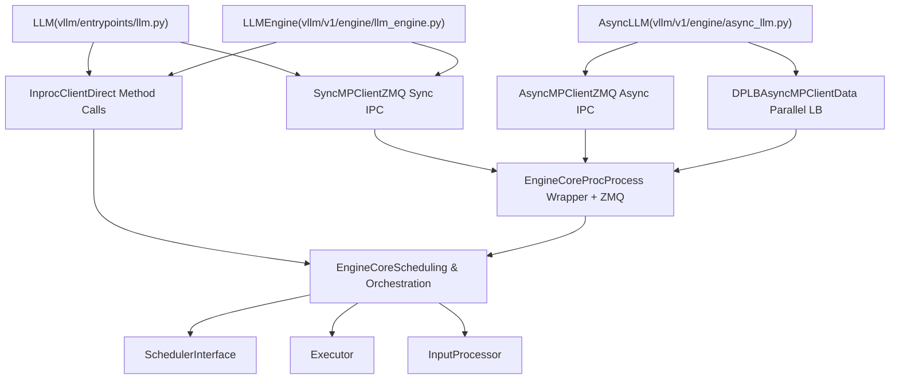
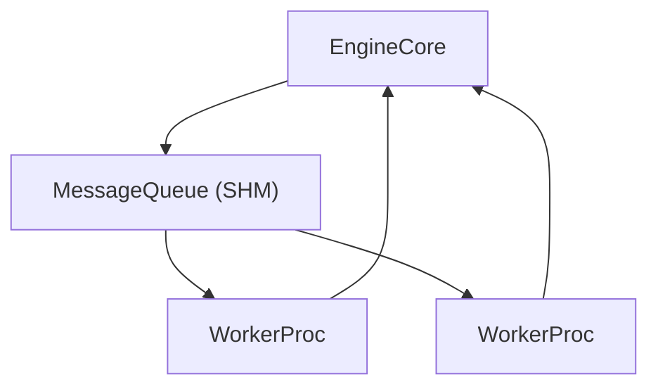

# EngineCore 与客户端 API

相关源文件

-   [tests/entrypoints/test\_api\_server\_process\_manager.py](https://github.com/vllm-project/vllm/blob/7cc302dd/tests/entrypoints/test_api_server_process_manager.py)
-   [tests/v1/engine/test\_engine\_core.py](https://github.com/vllm-project/vllm/blob/7cc302dd/tests/v1/engine/test_engine_core.py)
-   [tests/v1/engine/test\_engine\_core\_client.py](https://github.com/vllm-project/vllm/blob/7cc302dd/tests/v1/engine/test_engine_core_client.py)
-   [vllm/config/parallel.py](https://github.com/vllm-project/vllm/blob/7cc302dd/vllm/config/parallel.py)
-   [vllm/engine/async\_llm\_engine.py](https://github.com/vllm-project/vllm/blob/7cc302dd/vllm/engine/async_llm_engine.py)
-   [vllm/engine/llm\_engine.py](https://github.com/vllm-project/vllm/blob/7cc302dd/vllm/engine/llm_engine.py)
-   [vllm/engine/protocol.py](https://github.com/vllm-project/vllm/blob/7cc302dd/vllm/engine/protocol.py)
-   [vllm/entrypoints/cli/serve.py](https://github.com/vllm-project/vllm/blob/7cc302dd/vllm/entrypoints/cli/serve.py)
-   [vllm/entrypoints/launcher.py](https://github.com/vllm-project/vllm/blob/7cc302dd/vllm/entrypoints/launcher.py)
-   [vllm/entrypoints/llm.py](https://github.com/vllm-project/vllm/blob/7cc302dd/vllm/entrypoints/llm.py)
-   [vllm/v1/engine/async\_llm.py](https://github.com/vllm-project/vllm/blob/7cc302dd/vllm/v1/engine/async_llm.py)
-   [vllm/v1/engine/coordinator.py](https://github.com/vllm-project/vllm/blob/7cc302dd/vllm/v1/engine/coordinator.py)
-   [vllm/v1/engine/core.py](https://github.com/vllm-project/vllm/blob/7cc302dd/vllm/v1/engine/core.py)
-   [vllm/v1/engine/core\_client.py](https://github.com/vllm-project/vllm/blob/7cc302dd/vllm/v1/engine/core_client.py)
-   [vllm/v1/engine/llm\_engine.py](https://github.com/vllm-project/vllm/blob/7cc302dd/vllm/v1/engine/llm_engine.py)
-   [vllm/v1/engine/utils.py](https://github.com/vllm-project/vllm/blob/7cc302dd/vllm/v1/engine/utils.py)
-   [vllm/v1/utils.py](https://github.com/vllm-project/vllm/blob/7cc302dd/vllm/v1/utils.py)

## 目的与范围

本文档介绍 **EngineCore** 与 **EngineCoreClient** 的架构，它们构成了 vLLM V1 引擎的执行骨干。EngineCore 是负责调度请求、编排模型执行并生成输出的“内循环”。EngineCoreClient 提供一层抽象，使 EngineCore 可以在进程内运行，也可以在独立的后台进程中以不同的并发模型运行。

关于进入 EngineCore 的配置，请参见 [VllmConfig 和专用配置对象](/vllm-project/vllm/2.2-vllmconfig-and-specialized-configuration-objects)。关于调度器内部机制，请参见 [调度器与资源分配](/vllm-project/vllm/3.3-scheduler-and-resource-allocation)。关于 EngineCore 所编排的模型执行层，请参见 [GPUModelRunner](/vllm-project/vllm/4.1-gpumodelrunner)。

## 架构概览

EngineCore 和客户端 API 将执行职责拆分为两层：

1.  **EngineCore 层**：核心调度与执行逻辑。
2.  **客户端层**：IPC 抽象与并发管理。

### 系统架构图

"代码实体空间：引擎架构"

**来源：** [vllm/v1/engine/core.py87-187](https://github.com/vllm-project/vllm/blob/7cc302dd/vllm/v1/engine/core.py#L87-L187) [vllm/v1/engine/core\_client.py69-131](https://github.com/vllm-project/vllm/blob/7cc302dd/vllm/v1/engine/core_client.py#L69-L131) [vllm/v1/engine/async\_llm.py71-161](https://github.com/vllm-project/vllm/blob/7cc302dd/vllm/v1/engine/async_llm.py#L71-L161) [vllm/v1/engine/llm\_engine.py48-117](https://github.com/vllm-project/vllm/blob/7cc302dd/vllm/v1/engine/llm_engine.py#L48-L117)

## EngineCore：核心调度与执行

### 类结构

`EngineCore` 定义在 [vllm/v1/engine/core.py87-187](https://github.com/vllm-project/vllm/blob/7cc302dd/vllm/v1/engine/core.py#L87-L187) 中，作为 vLLM 引擎的“内循环”。它编排模型执行器、调度器以及多模态注册表。

| 组件 | 作用 | 关键类/接口 |
| --- | --- | --- |
| **模型执行器** | 处理分布式前向传播 | `vllm.v1.executor.Executor` [vllm/v1/engine/core.py114](https://github.com/vllm-project/vllm/blob/7cc302dd/vllm/v1/engine/core.py#L114-L114) |
| **调度器** | 管理请求队列和 KV 块 | `vllm.v1.core.sched.interface.SchedulerInterface` [vllm/v1/engine/core.py143-150](https://github.com/vllm-project/vllm/blob/7cc302dd/vllm/v1/engine/core.py#L143-L150) |
| **输入处理器** | 准备请求并执行分词 | `vllm.v1.engine.input_processor.InputProcessor` [vllm/v1/engine/async\_llm.py143](https://github.com/vllm-project/vllm/blob/7cc302dd/vllm/v1/engine/async_llm.py#L143-L143) |
| **输出处理器** | 反分词并流式输出 | `vllm.v1.engine.output_processor.OutputProcessor` [vllm/v1/engine/async\_llm.py146-151](https://github.com/vllm-project/vllm/blob/7cc302dd/vllm/v1/engine/async_llm.py#L146-L151) |

**来源：** [vllm/v1/engine/core.py112-150](https://github.com/vllm-project/vllm/blob/7cc302dd/vllm/v1/engine/core.py#L112-L150) [vllm/v1/engine/async\_llm.py143-151](https://github.com/vllm-project/vllm/blob/7cc302dd/vllm/v1/engine/async_llm.py#L143-L151)

### 初始化流程

初始化序列会先对 KV 缓存进行 GPU 内存分析，然后再实例化调度器。

> **[Mermaid sequence]**
> *(图表结构无法解析)*

**来源：** [vllm/v1/engine/core.py114-150](https://github.com/vllm-project/vllm/blob/7cc302dd/vllm/v1/engine/core.py#L114-L150)

### 步骤函数

EngineCore 为处理批次提供两种主要执行模式：

1.  **同步 `step()`**：执行一次调度和模型前向传播迭代。 [vllm/v1/engine/core.py385-414](https://github.com/vllm-project/vllm/blob/7cc302dd/vllm/v1/engine/core.py#L385-L414)
2.  **流水化 `step_with_batch_queue()`**：在 `max_concurrent_batches > 1`（流水线并行）时使用。它维护一个由 Future 对象组成的 `batch_queue` 以消除流水线气泡。 [vllm/v1/engine/core.py426-541](https://github.com/vllm-project/vllm/blob/7cc302dd/vllm/v1/engine/core.py#L426-L541)

## EngineCoreClient 抽象

### 客户端接口

`EngineCoreClient` 是一个抽象基类，它为与 `EngineCore` 交互提供统一接口，无论该核心是在进程内还是在独立后台进程中运行。 [vllm/v1/engine/core\_client.py69-270](https://github.com/vllm-project/vllm/blob/7cc302dd/vllm/v1/engine/core_client.py#L69-L270)

### 客户端选择逻辑

客户端会根据引擎配置通过 `EngineCoreClient.make_client()` 实例化。

| 客户端实现 | 并发模型 | 使用场景 |
| --- | --- | --- |
| `InprocClient` | 单进程 | 遗留 `LLMEngine`（V0 风格）、调试。 [vllm/v1/engine/core\_client.py103](https://github.com/vllm-project/vllm/blob/7cc302dd/vllm/v1/engine/core_client.py#L103-L103) |
| `SyncMPClient` | 多进程（线程式） | 离线 `LLM` 类。 [vllm/v1/engine/core\_client.py101](https://github.com/vllm-project/vllm/blob/7cc302dd/vllm/v1/engine/core_client.py#L101-L101) |
| `AsyncMPClient` | 多进程（Asyncio） | `AsyncLLM`（FastAPI / OpenAI Server）。 [vllm/v1/engine/core\_client.py107-130](https://github.com/vllm-project/vllm/blob/7cc302dd/vllm/v1/engine/core_client.py#L107-L130) |
| `DPLBAsyncMPClient` | 数据并行负载均衡 | 多节点/多 GPU 数据并行服务。 [vllm/v1/engine/core\_client.py129](https://github.com/vllm-project/vllm/blob/7cc302dd/vllm/v1/engine/core_client.py#L129-L129) |

**来源：** [vllm/v1/engine/core\_client.py81-131](https://github.com/vllm-project/vllm/blob/7cc302dd/vllm/v1/engine/core_client.py#L81-L131)

## IPC 机制与 MultiprocExecutor

### ZMQ 通信

对于多进程模式，vLLM 使用 **ZeroMQ（ZMQ）** 在客户端与 `EngineCoreProc` 之间进行低延迟 IPC。

-   **输入套接字**：`zmq.ROUTER`（客户端）到 `zmq.DEALER`（引擎）。用于发送 `EngineCoreRequest`。 [vllm/v1/engine/core\_client.py521-528](https://github.com/vllm-project/vllm/blob/7cc302dd/vllm/v1/engine/core_client.py#L521-L528)
-   **输出套接字**：`zmq.PUSH`（引擎）到 `zmq.PULL`（客户端）。用于流式传输 `EngineCoreOutputs`。 [vllm/v1/engine/core\_client.py521-528](https://github.com/vllm-project/vllm/blob/7cc302dd/vllm/v1/engine/core_client.py#L521-L528)

### MultiprocExecutor

`MultiprocExecutor` 负责管理工作进程的生命周期，以及通过共享内存或专用 IPC 传递 `SchedulerOutput`。

"代码实体空间：分布式执行 IPC"

**来源：** [vllm/v1/executor/multiproc\_executor.py129-151](https://github.com/vllm-project/vllm/blob/7cc302dd/vllm/v1/executor/multiproc_executor.py#L129-L151) [vllm/v1/executor/multiproc\_executor.py168-181](https://github.com/vllm-project/vllm/blob/7cc302dd/vllm/v1/executor/multiproc_executor.py#L168-L181)

## 数据并行协调

当 `data_parallel_size > 1` 时，引擎使用 `DPCoordinator` 聚合统计信息，并使用 `DPLBAsyncMPClient` 进行负载均衡。

-   **粘性路由**：对于 Late Interaction 之类的任务，客户端使用 `get_late_interaction_engine_index` 将相关查询和文档路由到同一个 DP rank。 [vllm/v1/engine/core\_client.py57](https://github.com/vllm-project/vllm/blob/7cc302dd/vllm/v1/engine/core_client.py#L57-L57) [vllm/v1/engine/core\_client.py1372-1385](https://github.com/vllm-project/vllm/blob/7cc302dd/vllm/v1/engine/core_client.py#L1372-L1385)
-   **负载均衡**：`DPLBAsyncMPClient` 跟踪 `reqs_in_flight` 和 `lb_engines`（等待/运行计数），将请求分配给负载最低的 rank。 [vllm/v1/engine/core\_client.py1356-1370](https://github.com/vllm-project/vllm/blob/7cc302dd/vllm/v1/engine/core_client.py#L1356-L1370)

**来源：** [vllm/v1/engine/core\_client.py1282-1473](https://github.com/vllm-project/vllm/blob/7cc302dd/vllm/v1/engine/core_client.py#L1282-L1473) [vllm/v1/engine/coordinator.py27-111](https://github.com/vllm-project/vllm/blob/7cc302dd/vllm/v1/engine/coordinator.py#L27-L111)

## 关键数据结构

### EngineCoreRequest

客户端传递给引擎的主要输入结构。 [vllm/v1/engine/__init__.py](https://github.com/vllm-project/vllm/blob/7cc302dd/vllm/v1/engine/__init__.py)

-   `request_id`：请求的唯一 ID。
-   `prompt_token_ids`：分词后的输入。
-   `sampling_params`：生成参数（例如 temperature）。
-   `mm_features`：多模态数据（图像、视频）。

### EngineCoreOutputs

从引擎流式返回的响应结构。 [vllm/v1/engine/__init__.py](https://github.com/vllm-project/vllm/blob/7cc302dd/vllm/v1/engine/__init__.py)

-   `outputs`：`EngineCoreOutput` 列表（包含 `new_token_ids`、`finished` 标志）。
-   `scheduler_stats`：关于引擎负载和 KV 缓存使用情况的元数据。

**来源：** [vllm/v1/engine/core.py48-61](https://github.com/vllm-project/vllm/blob/7cc302dd/vllm/v1/engine/core.py#L48-L61)
