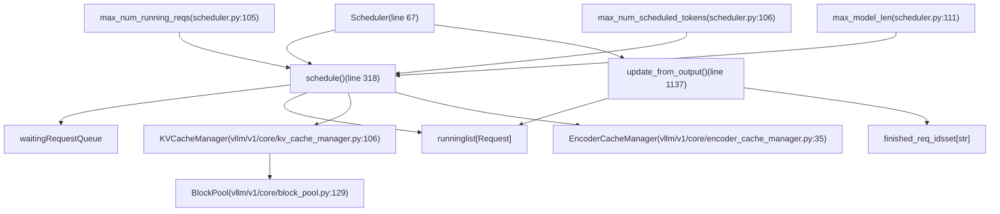
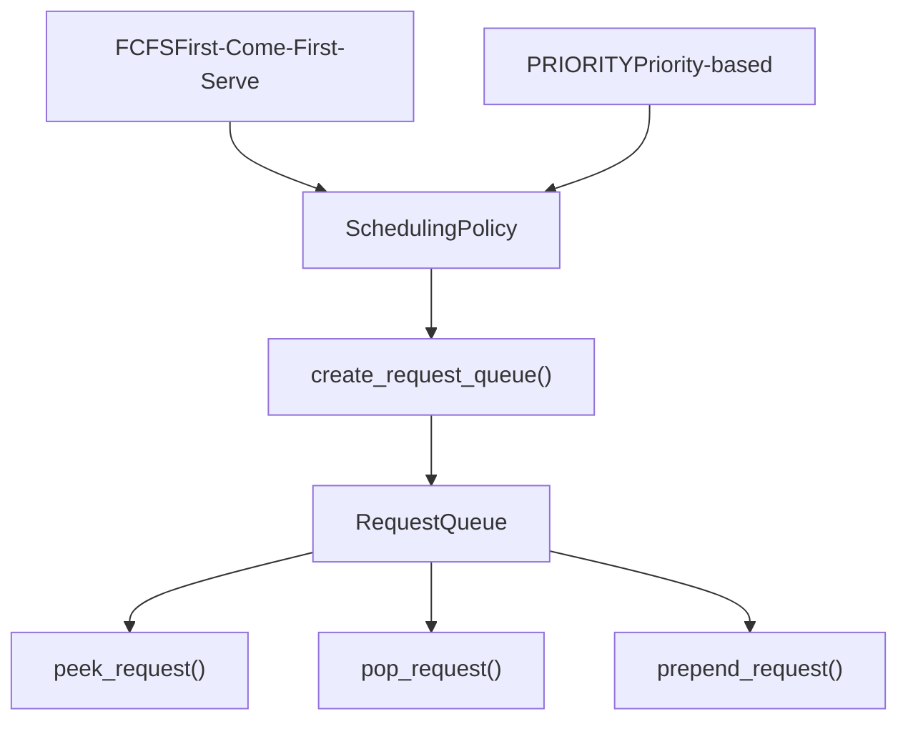

# 调度器与资源分配

相关源文件

-   [tests/v1/core/test\_kv\_cache\_utils.py](https://github.com/vllm-project/vllm/blob/7cc302dd/tests/v1/core/test_kv_cache_utils.py)
-   [tests/v1/core/test\_prefix\_caching.py](https://github.com/vllm-project/vllm/blob/7cc302dd/tests/v1/core/test_prefix_caching.py)
-   [tests/v1/core/test\_scheduler.py](https://github.com/vllm-project/vllm/blob/7cc302dd/tests/v1/core/test_scheduler.py)
-   [tests/v1/core/test\_single\_type\_kv\_cache\_manager.py](https://github.com/vllm-project/vllm/blob/7cc302dd/tests/v1/core/test_single_type_kv_cache_manager.py)
-   [tests/v1/core/utils.py](https://github.com/vllm-project/vllm/blob/7cc302dd/tests/v1/core/utils.py)
-   [vllm/v1/core/block\_pool.py](https://github.com/vllm-project/vllm/blob/7cc302dd/vllm/v1/core/block_pool.py)
-   [vllm/v1/core/kv\_cache\_coordinator.py](https://github.com/vllm-project/vllm/blob/7cc302dd/vllm/v1/core/kv_cache_coordinator.py)
-   [vllm/v1/core/kv\_cache\_manager.py](https://github.com/vllm-project/vllm/blob/7cc302dd/vllm/v1/core/kv_cache_manager.py)
-   [vllm/v1/core/kv\_cache\_utils.py](https://github.com/vllm-project/vllm/blob/7cc302dd/vllm/v1/core/kv_cache_utils.py)
-   [vllm/v1/core/sched/scheduler.py](https://github.com/vllm-project/vllm/blob/7cc302dd/vllm/v1/core/sched/scheduler.py)
-   [vllm/v1/core/single\_type\_kv\_cache\_manager.py](https://github.com/vllm-project/vllm/blob/7cc302dd/vllm/v1/core/single_type_kv_cache_manager.py)
-   [vllm/v1/engine/__init__.py](https://github.com/vllm-project/vllm/blob/7cc302dd/vllm/v1/engine/__init__.py)
-   [vllm/v1/kv\_cache\_interface.py](https://github.com/vllm-project/vllm/blob/7cc302dd/vllm/v1/kv_cache_interface.py)
-   [vllm/v1/request.py](https://github.com/vllm-project/vllm/blob/7cc302dd/vllm/v1/request.py)

## 目的与范围

本文档介绍 vLLM v1 引擎架构中的调度算法与资源分配机制。`Scheduler` 类负责决定每一步要处理哪些请求，为请求分配 GPU 内存（KV 缓存块），并管理资源约束，以在防止 OOM 的同时最大化吞吐量。

关于调度器在整体引擎架构中的位置，请参见 [EngineCore 与客户端 API](https://github.com/vllm-project/vllm/blob/7cc302dd/Engine Core and Client APIs)()。关于请求状态迁移和生命周期，请参见 [请求生命周期与状态管理](https://github.com/vllm-project/vllm/blob/7cc302dd/Request Lifecycle and State Management)()。关于 KV 缓存块管理的实现细节，请参见 [KV 缓存管理](https://github.com/vllm-project/vllm/blob/7cc302dd/KV Cache Management)()。

**来源：** [vllm/v1/core/sched/scheduler.py1-100](https://github.com/vllm-project/vllm/blob/7cc302dd/vllm/v1/core/sched/scheduler.py#L1-L100) [vllm/v1/request.py1-100](https://github.com/vllm-project/vllm/blob/7cc302dd/vllm/v1/request.py#L1-L100) [vllm/v1/core/kv\_cache\_manager.py1-120](https://github.com/vllm-project/vllm/blob/7cc302dd/vllm/v1/core/kv_cache_manager.py#L1-L120)

## 调度器架构概览

`Scheduler` 类作为中心协调器，在每个引擎步骤做出调度决策。它维护请求队列、跟踪资源使用情况，并与 `KVCacheManager` 接口交互，为请求执行分配内存块。

### 调度器组件图

**来源：** [vllm/v1/core/sched/scheduler.py67-115](https://github.com/vllm-project/vllm/blob/7cc302dd/vllm/v1/core/sched/scheduler.py#L67-L115) [vllm/v1/core/kv\_cache\_manager.py106-142](https://github.com/vllm-project/vllm/blob/7cc302dd/vllm/v1/core/kv_cache_manager.py#L106-L142) [vllm/v1/core/kv\_cache\_coordinator.py49-55](https://github.com/vllm-project/vllm/blob/7cc302dd/vllm/v1/core/kv_cache_coordinator.py#L49-L55) [vllm/v1/core/encoder\_cache\_manager.py35-40](https://github.com/vllm-project/vllm/blob/7cc302dd/vllm/v1/core/encoder_cache_manager.py#L35-L40)

## 请求队列系统

调度器维护主要数据结构，用于根据 [vllm/v1/request.py59](https://github.com/vllm-project/vllm/blob/7cc302dd/vllm/v1/request.py#L59-L59) 中定义的 `RequestStatus` 跟踪请求。

| 队列 | 类型 | 目的 |
| --- | --- | --- |
| `waiting` | `RequestQueue` | 保存等待调度的请求（`WAITING`、`WAITING_FOR_FSM`、`WAITING_FOR_REMOTE_KVS` 状态） [vllm/v1/core/sched/scheduler.py166](https://github.com/vllm-project/vllm/blob/7cc302dd/vllm/v1/core/sched/scheduler.py#L166-L166) |
| `running` | `list[Request]` | 保存当前正在执行的请求（`RUNNING` 状态） [vllm/v1/core/sched/scheduler.py168](https://github.com/vllm-project/vllm/blob/7cc302dd/vllm/v1/core/sched/scheduler.py#L168-L168) |
| `preempted_reqs` | `list[Request]` | 当前 `schedule` 调用中被抢占请求的临时存储 [vllm/v1/core/sched/scheduler.py321](https://github.com/vllm-project/vllm/blob/7cc302dd/vllm/v1/core/sched/scheduler.py#L321-L321) |

`RequestQueue` 实现通过 `SchedulingPolicy` 枚举支持不同的调度策略 [vllm/v1/core/sched/request\_queue.py50](https://github.com/vllm-project/vllm/blob/7cc302dd/vllm/v1/core/sched/request_queue.py#L50-L50)：

**来源：** [vllm/v1/core/sched/scheduler.py158-169](https://github.com/vllm-project/vllm/blob/7cc302dd/vllm/v1/core/sched/scheduler.py#L158-L169) [vllm/v1/core/sched/request\_queue.py50-52](https://github.com/vllm-project/vllm/blob/7cc302dd/vllm/v1/core/sched/request_queue.py#L50-L52)

## 调度算法

`schedule()` 方法 [vllm/v1/core/sched/scheduler.py318](https://github.com/vllm-project/vllm/blob/7cc302dd/vllm/v1/core/sched/scheduler.py#L318-L318) 执行一个多阶段算法：

### 阶段 1：调度运行中的请求

调度器首先尝试继续处理已经在 `running` 列表中的请求。如果 GPU 内存不足以为运行中的请求扩展 KV 缓存，调度器会执行抢占 [vllm/v1/core/sched/scheduler.py443](https://github.com/vllm-project/vllm/blob/7cc302dd/vllm/v1/core/sched/scheduler.py#L443-L443)

> **[Mermaid sequence]**
> *(图表结构无法解析)*

**来源：** [vllm/v1/core/sched/scheduler.py318-520](https://github.com/vllm-project/vllm/blob/7cc302dd/vllm/v1/core/sched/scheduler.py#L318-L520)

### 阶段 2：调度等待中的请求

在满足运行中请求之后，调度器会从 `waiting` 队列中取请求，直到达到 `token_budget` 或 `max_num_running_reqs` 为止 [vllm/v1/core/sched/scheduler.py531](https://github.com/vllm-project/vllm/blob/7cc302dd/vllm/v1/core/sched/scheduler.py#L531-L531)

> **[Mermaid sequence]**
> *(图表结构无法解析)*

**来源：** [vllm/v1/core/sched/scheduler.py531-831](https://github.com/vllm-project/vllm/blob/7cc302dd/vllm/v1/core/sched/scheduler.py#L531-L831)

## 资源约束与预算

调度器通过多种约束来确保稳定性和性能：

| 约束 | 代码实体 | 目的 |
| --- | --- | --- |
| **Token 预算** | `max_num_scheduled_tokens` | 限制批次中的总 token 数，以防止 OOM/延迟尖峰 [vllm/v1/core/sched/scheduler.py106](https://github.com/vllm-project/vllm/blob/7cc302dd/vllm/v1/core/sched/scheduler.py#L106-L106) |
| **请求上限** | `max_num_running_reqs` | 限制并发序列数 [vllm/v1/core/sched/scheduler.py105](https://github.com/vllm-project/vllm/blob/7cc302dd/vllm/v1/core/sched/scheduler.py#L105-L105) |
| **KV 缓存** | `KVCacheManager` | 物理 GPU 内存可用性 [vllm/v1/core/kv\_cache\_manager.py106](https://github.com/vllm-project/vllm/blob/7cc302dd/vllm/v1/core/kv_cache_manager.py#L106-L106) |
| **Encoder 预算** | `max_num_encoder_input_tokens` | 限制多模态 encoder 计算量 [vllm/v1/core/sched/scheduler.py1753](https://github.com/vllm-project/vllm/blob/7cc302dd/vllm/v1/core/sched/scheduler.py#L1753-L1753) |
| **LoRA 上限** | `max_loras` | 限制批次中的唯一 LoRA adapter 数量 [vllm/v1/core/sched/scheduler.py521](https://github.com/vllm-project/vllm/blob/7cc302dd/vllm/v1/core/sched/scheduler.py#L521-L521) |

**来源：** [vllm/v1/core/sched/scheduler.py101-115](https://github.com/vllm-project/vllm/blob/7cc302dd/vllm/v1/core/sched/scheduler.py#L101-L115) [vllm/v1/core/sched/scheduler.py521-530](https://github.com/vllm-project/vllm/blob/7cc302dd/vllm/v1/core/sched/scheduler.py#L521-L530) [vllm/v1/core/sched/scheduler.py1753-1760](https://github.com/vllm-project/vllm/blob/7cc302dd/vllm/v1/core/sched/scheduler.py#L1753-L1760)

## KV 缓存槽位分配

KV 缓存分配通过 `KVCacheManager.allocate_slots()` 方法进行管理 [vllm/v1/core/kv\_cache\_manager.py206](https://github.com/vllm-project/vllm/blob/7cc302dd/vllm/v1/core/kv_cache_manager.py#L206-L206)。该管理器跨多个 KV 缓存组（例如 Attention、Mamba、Cross-Attention）进行协调。

### 分配逻辑流程

1.  **前缀缓存**：使用 `get_computed_blocks()` 在 `BlockPool` 中查找已有块 [vllm/v1/core/kv\_cache\_manager.py176-187](https://github.com/vllm-project/vllm/blob/7cc302dd/vllm/v1/core/kv_cache_manager.py#L176-L187)
2.  **增长计算**：委托给 `KVCacheCoordinator.get_num_blocks_to_allocate()`，以确定所有组一共需要多少新块 [vllm/v1/core/kv\_cache\_coordinator.py71-79](https://github.com/vllm-project/vllm/blob/7cc302dd/vllm/v1/core/kv_cache_coordinator.py#L71-L79)
3.  **物理分配**：通过 `coordinator.allocate_new_blocks()` 从 `BlockPool` 请求块 [vllm/v1/core/kv\_cache\_coordinator.py143-149](https://github.com/vllm-project/vllm/blob/7cc302dd/vllm/v1/core/kv_cache_coordinator.py#L143-L149)
4.  **哈希**：完整块会被哈希并在 `BlockHashToBlockMap` 中建立索引，以便未来复用 [vllm/v1/core/block\_pool.py33-59](https://github.com/vllm-project/vllm/blob/7cc302dd/vllm/v1/core/block_pool.py#L33-L59)

**来源：** [vllm/v1/core/kv\_cache\_manager.py176-376](https://github.com/vllm-project/vllm/blob/7cc302dd/vllm/v1/core/kv_cache_manager.py#L176-L376) [vllm/v1/core/kv\_cache\_coordinator.py71-177](https://github.com/vllm-project/vllm/blob/7cc302dd/vllm/v1/core/kv_cache_coordinator.py#L71-L177) [vllm/v1/core/block\_pool.py33-128](https://github.com/vllm-project/vllm/blob/7cc302dd/vllm/v1/core/block_pool.py#L33-L128)

## 抢占策略

当内存耗尽时，调度器会调用 `_preempt_request()` [vllm/v1/core/sched/scheduler.py833](https://github.com/vllm-project/vllm/blob/7cc302dd/vllm/v1/core/sched/scheduler.py#L833-L833)

### 抢占行为

-   **释放内存**：调用 `kv_cache_manager.free(request.request_id)`，将块归还给 `FreeKVCacheBlockQueue` [vllm/v1/core/sched/scheduler.py844](https://github.com/vllm-project/vllm/blob/7cc302dd/vllm/v1/core/sched/scheduler.py#L844-L844) [vllm/v1/core/kv\_cache\_utils.py158](https://github.com/vllm-project/vllm/blob/7cc302dd/vllm/v1/core/kv_cache_utils.py#L158-L158)
-   **状态重置**：增加 `request.num_preemptions`，并将状态设为 `PREEMPTED` [vllm/v1/core/sched/scheduler.py863-864](https://github.com/vllm-project/vllm/blob/7cc302dd/vllm/v1/core/sched/scheduler.py#L863-L864)
-   **重新入队**：将请求重新追加到 `waiting` 队列前端，以便在下一步优先处理 [vllm/v1/core/sched/scheduler.py874](https://github.com/vllm-project/vllm/blob/7cc302dd/vllm/v1/core/sched/scheduler.py#L874-L874)

**来源：** [vllm/v1/core/sched/scheduler.py833-876](https://github.com/vllm-project/vllm/blob/7cc302dd/vllm/v1/core/sched/scheduler.py#L833-L876) [vllm/v1/core/kv\_cache\_manager.py383-385](https://github.com/vllm-project/vllm/blob/7cc302dd/vllm/v1/core/kv_cache_manager.py#L383-L385) [vllm/v1/core/kv\_cache\_utils.py158-178](https://github.com/vllm-project/vllm/blob/7cc302dd/vllm/v1/core/kv_cache_utils.py#L158-L178)

## 特殊调度场景

### 分块预填充

如果设置了 `long_prefill_token_threshold`，调度器会限制单个请求在一次步骤中处理的 token 数量 [vllm/v1/core/sched/scheduler.py379-380](https://github.com/vllm-project/vllm/blob/7cc302dd/vllm/v1/core/sched/scheduler.py#L379-L380)。请求仍然保留在 `running` 列表中，但会被标记为 `is_prefill_chunk = True` [vllm/v1/request.py153](https://github.com/vllm-project/vllm/blob/7cc302dd/vllm/v1/request.py#L153-L153)

### Mamba 块对齐

对于带有 Mamba 层的模型，调度器会强制执行块对齐切分 [vllm/v1/core/sched/scheduler.py407](https://github.com/vllm-project/vllm/blob/7cc302dd/vllm/v1/core/sched/scheduler.py#L407-L407)。这一行为由 `_mamba_block_aligned_split()` 处理，它确保预填充分块与 Mamba 状态管理所需的 `block_size` 对齐 [vllm/v1/core/sched/scheduler.py268-316](https://github.com/vllm-project/vllm/blob/7cc302dd/vllm/v1/core/sched/scheduler.py#L268-L316)

### 推测解码

调度器会为草稿 token 分配额外的“前瞻”槽位 [vllm/v1/core/sched/scheduler.py491](https://github.com/vllm-project/vllm/blob/7cc302dd/vllm/v1/core/sched/scheduler.py#L491-L491)。它会跟踪 `scheduled_spec_decode_tokens`，并与 `SpeculativeConfig` 协调以管理草稿/验证循环 [vllm/v1/core/sched/scheduler.py205-214](https://github.com/vllm-project/vllm/blob/7cc302dd/vllm/v1/core/sched/scheduler.py#L205-L214)

**来源：** [vllm/v1/core/sched/scheduler.py268-316](https://github.com/vllm-project/vllm/blob/7cc302dd/vllm/v1/core/sched/scheduler.py#L268-L316) [vllm/v1/core/sched/scheduler.py379-380](https://github.com/vllm-project/vllm/blob/7cc302dd/vllm/v1/core/sched/scheduler.py#L379-L380) [vllm/v1/core/sched/scheduler.py491-502](https://github.com/vllm-project/vllm/blob/7cc302dd/vllm/v1/core/sched/scheduler.py#L491-L502) [vllm/v1/request.py153-154](https://github.com/vllm-project/vllm/blob/7cc302dd/vllm/v1/request.py#L153-L154)
