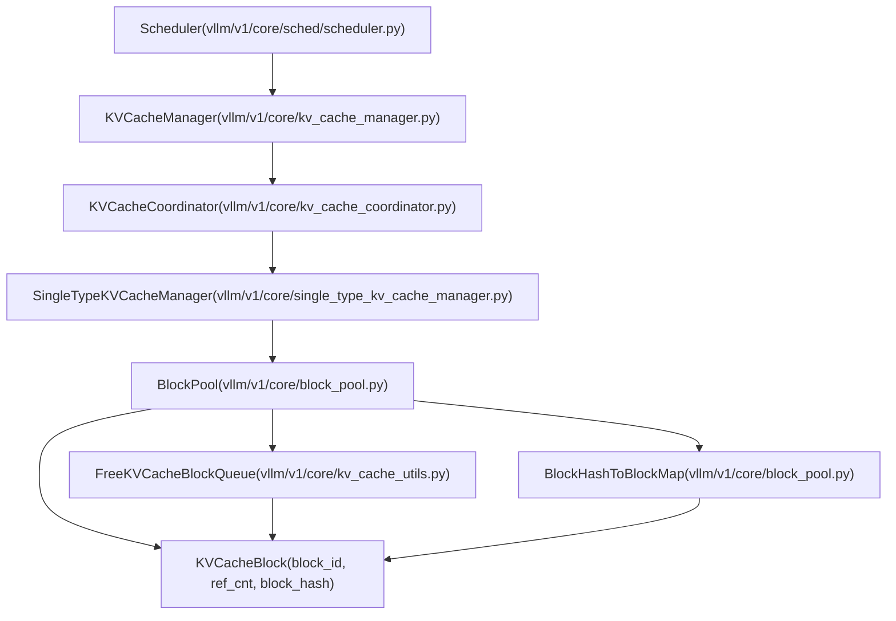
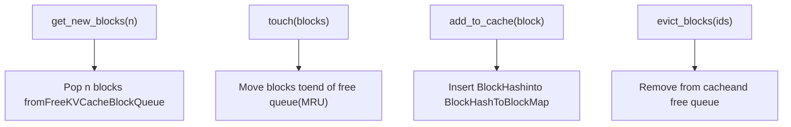
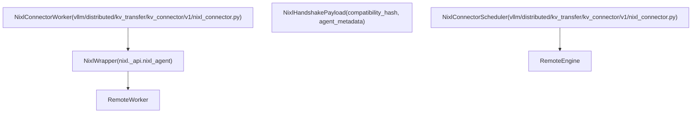

# KV 缓存管理与前缀缓存

相关源文件

-   [docs/features/nixl\_connector\_usage.md](https://github.com/vllm-project/vllm/blob/7cc302dd/docs/features/nixl_connector_usage.md?plain=1)
-   [tests/v1/core/test\_kv\_cache\_utils.py](https://github.com/vllm-project/vllm/blob/7cc302dd/tests/v1/core/test_kv_cache_utils.py)
-   [tests/v1/core/test\_prefix\_caching.py](https://github.com/vllm-project/vllm/blob/7cc302dd/tests/v1/core/test_prefix_caching.py)
-   [tests/v1/core/test\_scheduler.py](https://github.com/vllm-project/vllm/blob/7cc302dd/tests/v1/core/test_scheduler.py)
-   [tests/v1/core/test\_single\_type\_kv\_cache\_manager.py](https://github.com/vllm-project/vllm/blob/7cc302dd/tests/v1/core/test_single_type_kv_cache_manager.py)
-   [tests/v1/core/utils.py](https://github.com/vllm-project/vllm/blob/7cc302dd/tests/v1/core/utils.py)
-   [tests/v1/kv\_connector/nixl\_integration/run\_accuracy\_test.sh](https://github.com/vllm-project/vllm/blob/7cc302dd/tests/v1/kv_connector/nixl_integration/run_accuracy_test.sh)
-   [tests/v1/kv\_connector/nixl\_integration/run\_edge\_case\_test.sh](https://github.com/vllm-project/vllm/blob/7cc302dd/tests/v1/kv_connector/nixl_integration/run_edge_case_test.sh)
-   [tests/v1/kv\_connector/unit/test\_multi\_connector.py](https://github.com/vllm-project/vllm/blob/7cc302dd/tests/v1/kv_connector/unit/test_multi_connector.py)
-   [tests/v1/kv\_connector/unit/test\_nixl\_connector.py](https://github.com/vllm-project/vllm/blob/7cc302dd/tests/v1/kv_connector/unit/test_nixl_connector.py)
-   [tests/v1/kv\_connector/unit/utils.py](https://github.com/vllm-project/vllm/blob/7cc302dd/tests/v1/kv_connector/unit/utils.py)
-   [vllm/distributed/kv\_transfer/kv\_connector/factory.py](https://github.com/vllm-project/vllm/blob/7cc302dd/vllm/distributed/kv_transfer/kv_connector/factory.py)
-   [vllm/distributed/kv\_transfer/kv\_connector/utils.py](https://github.com/vllm-project/vllm/blob/7cc302dd/vllm/distributed/kv_transfer/kv_connector/utils.py)
-   [vllm/distributed/kv\_transfer/kv\_connector/v1/base.py](https://github.com/vllm-project/vllm/blob/7cc302dd/vllm/distributed/kv_transfer/kv_connector/v1/base.py)
-   [vllm/distributed/kv\_transfer/kv\_connector/v1/multi\_connector.py](https://github.com/vllm-project/vllm/blob/7cc302dd/vllm/distributed/kv_transfer/kv_connector/v1/multi_connector.py)
-   [vllm/distributed/kv\_transfer/kv\_connector/v1/nixl\_connector.py](https://github.com/vllm-project/vllm/blob/7cc302dd/vllm/distributed/kv_transfer/kv_connector/v1/nixl_connector.py)
-   [vllm/distributed/kv\_transfer/kv\_transfer\_state.py](https://github.com/vllm-project/vllm/blob/7cc302dd/vllm/distributed/kv_transfer/kv_transfer_state.py)
-   [vllm/v1/core/block\_pool.py](https://github.com/vllm-project/vllm/blob/7cc302dd/vllm/v1/core/block_pool.py)
-   [vllm/v1/core/kv\_cache\_coordinator.py](https://github.com/vllm-project/vllm/blob/7cc302dd/vllm/v1/core/kv_cache_coordinator.py)
-   [vllm/v1/core/kv\_cache\_manager.py](https://github.com/vllm-project/vllm/blob/7cc302dd/vllm/v1/core/kv_cache_manager.py)
-   [vllm/v1/core/kv\_cache\_utils.py](https://github.com/vllm-project/vllm/blob/7cc302dd/vllm/v1/core/kv_cache_utils.py)
-   [vllm/v1/core/sched/scheduler.py](https://github.com/vllm-project/vllm/blob/7cc302dd/vllm/v1/core/sched/scheduler.py)
-   [vllm/v1/core/single\_type\_kv\_cache\_manager.py](https://github.com/vllm-project/vllm/blob/7cc302dd/vllm/v1/core/single_type_kv_cache_manager.py)
-   [vllm/v1/engine/\_\_init\_\_.py](https://github.com/vllm-project/vllm/blob/7cc302dd/vllm/v1/engine/__init__.py)
-   [vllm/v1/kv\_cache\_interface.py](https://github.com/vllm-project/vllm/blob/7cc302dd/vllm/v1/kv_cache_interface.py)
-   [vllm/v1/outputs.py](https://github.com/vllm-project/vllm/blob/7cc302dd/vllm/v1/outputs.py)
-   [vllm/v1/request.py](https://github.com/vllm-project/vllm/blob/7cc302dd/vllm/v1/request.py)
-   [vllm/v1/worker/kv\_connector\_model\_runner\_mixin.py](https://github.com/vllm-project/vllm/blob/7cc302dd/vllm/v1/worker/kv_connector_model_runner_mixin.py)

## 目的与范围

本文档介绍 vLLM 的 KV 缓存管理系统及其前缀缓存实现（Automatic Prefix Caching，APC）。KV 缓存管理器负责推理过程中 key-value 张量的内存分配，从而使共享相同令牌序列的请求能够高效复用已缓存的计算结果。

**范围：**

-   通过 `KVCacheManager` 和 `BlockPool` 进行基于块的内存分配与管理。
-   使用 `BlockHash` 的前缀缓存机制，用于去重计算。
-   面向不同注意力类型（Full、Sliding Window、MLA、Mamba）的块分配策略。
-   与调度器集成，以实现感知内存的请求调度。

**相关页面：**

-   关于调度器集成和请求管理，请参见 [调度器与资源分配](/vllm-project/vllm/3.3-scheduler-and-resource-allocation)。
-   关于 GPU 执行和模型运行器细节，请参见 [GPUModelRunner](/vllm-project/vllm/4.1-gpumodelrunner)。
-   关于分布式 KV 缓存传输，请参见 [KV 缓存传输与解耦式服务](/vllm-project/vllm/9.4-kv-cache-transfer-and-disaggregated-serving)。

---

## 核心概念

### 块与块大小

KV 缓存按固定大小的**块**组织，每个块存储固定数量令牌（通常为 16）的 KV 张量。这种基于块的方法能够实现：

1.  **高效内存管理**：以块大小为单位分配和释放内存。
2.  **前缀缓存**：在具有公共令牌前缀的请求之间共享块。
3.  **内存碎片控制**：固定大小分配可减少碎片。

一个块为 `block_size` 个令牌存储 KV 张量。对于具有 `num_kv_heads` 个注意力头和 `head_size` 维度的模型：

-   块内存 = `2 * block_size * num_kv_heads * head_size * dtype_size`。
-   系数 2 表示 Key 和 Value 张量各占一份。

**来源：** [vllm/v1/kv\_cache\_interface.py19-88](https://github.com/vllm-project/vllm/blob/7cc302dd/vllm/v1/kv_cache_interface.py#L19-L88) [vllm/v1/core/kv\_cache\_utils.py109-156](https://github.com/vllm-project/vllm/blob/7cc302dd/vllm/v1/core/kv_cache_utils.py#L109-L156)

### 前缀缓存概览

**前缀缓存**（也称 Automatic Prefix Caching，APC）允许 vLLM 在共享公共令牌序列的请求之间复用 KV 缓存块。当新请求到来时，系统会：

1.  通过 `get_request_block_hasher` 为请求令牌序列中的完整块计算块哈希 [vllm/v1/core/kv\_cache\_utils.py32](https://github.com/vllm-project/vllm/blob/7cc302dd/vllm/v1/core/kv_cache_utils.py#L32-L32)
2.  通过 `BlockPool` 在前缀缓存中查找这些哈希 [vllm/v1/core/kv\_cache\_manager.py143](https://github.com/vllm-project/vllm/blob/7cc302dd/vllm/v1/core/kv_cache_manager.py#L143-L143)
3.  为匹配的前缀复用缓存块。
4.  仅计算尚未缓存的新令牌。

这会为重复提示、多轮对话和 few-shot 学习带来显著的性能提升。

**来源：** [vllm/v1/core/kv\_cache\_manager.py176-216](https://github.com/vllm-project/vllm/blob/7cc302dd/vllm/v1/core/kv_cache_manager.py#L176-L216) [tests/v1/core/test\_prefix\_caching.py1-40](https://github.com/vllm-project/vllm/blob/7cc302dd/tests/v1/core/test_prefix_caching.py#L1-L40)

### 块哈希

每个完整块都由一个 `BlockHash` 标识，该哈希由以下部分计算得出：

1.  **父块哈希**：前一个块的哈希（形成哈希链）。
2.  **当前块令牌**：该块中的令牌 ID。
3.  **额外键**（可选）：
    -   包含多模态（MM）令牌的块的多模态标识符 [vllm/v1/request.py138-139](https://github.com/vllm-project/vllm/blob/7cc302dd/vllm/v1/request.py#L138-L139)
    -   用于 LoRA 特定缓存的 LoRA 请求名称 [vllm/v1/request.py82](https://github.com/vllm-project/vllm/blob/7cc302dd/vllm/v1/request.py#L82-L82)
    -   用于请求级缓存隔离的缓存盐值 [vllm/v1/request.py136](https://github.com/vllm-project/vllm/blob/7cc302dd/vllm/v1/request.py#L136-L136)
    -   用于基于 embedding 输入的提示 embedding 哈希 [vllm/v1/request.py118](https://github.com/vllm-project/vllm/blob/7cc302dd/vllm/v1/request.py#L118-L118)

哈希函数（默认 `sha256`）会为每个块的内容和上下文生成唯一标识。`init_none_hash` 会初始化哈希链的基础种子 [vllm/v1/core/kv\_cache\_utils.py91-107](https://github.com/vllm-project/vllm/blob/7cc302dd/vllm/v1/core/kv_cache_utils.py#L91-L107)

**来源：** [vllm/v1/core/kv\_cache\_utils.py49-107](https://github.com/vllm-project/vllm/blob/7cc302dd/vllm/v1/core/kv_cache_utils.py#L49-L107) [vllm/v1/request.py58-178](https://github.com/vllm-project/vllm/blob/7cc302dd/vllm/v1/request.py#L58-L178)

---

## 架构概览

### KV 缓存系统层次结构

下图展示了高级调度实体如何与底层块管理类交互。


**来源：** [vllm/v1/core/kv\_cache\_manager.py106-154](https://github.com/vllm-project/vllm/blob/7cc302dd/vllm/v1/core/kv_cache_manager.py#L106-L154) [vllm/v1/core/kv\_cache\_coordinator.py11-40](https://github.com/vllm-project/vllm/blob/7cc302dd/vllm/v1/core/kv_cache_coordinator.py#L11-L40) [vllm/v1/core/block\_pool.py129-150](https://github.com/vllm-project/vllm/blob/7cc302dd/vllm/v1/core/block_pool.py#L129-L150) [vllm/v1/core/sched/scheduler.py39-40](https://github.com/vllm-project/vllm/blob/7cc302dd/vllm/v1/core/sched/scheduler.py#L39-L40)

---

## 关键组件

### KVCacheManager

`KVCacheManager` 是 KV 缓存操作的主入口，为 `Scheduler` 提供统一接口。它封装了 `KVCacheCoordinator`，用于处理多个 `KVCacheGroup` 规格（例如同时包含 Attention 和 Mamba 层的混合模型） [vllm/v1/core/kv\_cache\_manager.py131-142](https://github.com/vllm-project/vllm/blob/7cc302dd/vllm/v1/core/kv_cache_manager.py#L131-L142)

**关键方法：**

| 方法 | 作用 | 返回值 |
| --- | --- | --- |
| `get_computed_blocks()` | 查找请求的前缀缓存命中 | `(KVCacheBlocks, num_cached_tokens)` |
| `allocate_slots()` | 为新令牌分配块 | `KVCacheBlocks` 或在 OOM 时返回 `None` |
| `free()` | 释放已完成请求的所有块 | `None` |
| `cache_blocks()` | 将块加入前缀缓存 | `None` |
| `reset_prefix_cache()` | 清空所有已缓存块 | `bool`（是否成功） |

**来源：** [vllm/v1/core/kv\_cache\_manager.py106-154](https://github.com/vllm-project/vllm/blob/7cc302dd/vllm/v1/core/kv_cache_manager.py#L106-L154) [vllm/v1/core/kv\_cache\_manager.py176-507](https://github.com/vllm-project/vllm/blob/7cc302dd/vllm/v1/core/kv_cache_manager.py#L176-L507)

### BlockPool

`BlockPool` 管理物理块并实现前缀缓存。它维护：

1.  **所有块**：`KVCacheBlock` 对象数组（索引 = `block_id`）。
2.  **空闲块队列**：按 LRU 顺序排列的可用块 `FreeKVCacheBlockQueue`。
3.  **缓存块映射**：将 `BlockHashWithGroupId` 映射到 `KVCacheBlock` 的 `BlockHashToBlockMap`。

**关键操作：**


**来源：** [vllm/v1/core/block\_pool.py129-507](https://github.com/vllm-project/vllm/blob/7cc302dd/vllm/v1/core/block_pool.py#L129-L507) [vllm/v1/core/kv\_cache\_utils.py158-180](https://github.com/vllm-project/vllm/blob/7cc302dd/vllm/v1/core/kv_cache_utils.py#L158-L180)

### KVCacheBlock

`KVCacheBlock` 表示一个带有元数据的单独块。它使用 `__slots__` 来最小化内存开销 [vllm/v1/core/kv\_cache\_utils.py109](https://github.com/vllm-project/vllm/blob/7cc302dd/vllm/v1/core/kv_cache_utils.py#L109-L109)

```
# vllm/v1/core/kv_cache_utils.py:109-127@dataclass(slots=True)class KVCacheBlock:    block_id: int                              # Physical block ID    ref_cnt: int = 0                          # Reference count    _block_hash: BlockHashWithGroupId | None = None  # Hash when cached    prev_free_block: "KVCacheBlock | None" = None     # Free list prev    next_free_block: "KVCacheBlock | None" = None     # Free list next    is_null: bool = False                     # Null block flag
```
**来源：** [vllm/v1/core/kv\_cache\_utils.py109-156](https://github.com/vllm-project/vllm/blob/7cc302dd/vllm/v1/core/kv_cache_utils.py#L109-L156)

### 块哈希系统

#### 块哈希类型

```
# vllm/v1/core/kv_cache_utils.py:33-41BlockHash = NewType("BlockHash", bytes)  # Raw hash (e.g., SHA256 digest)BlockHashWithGroupId = NewType("BlockHashWithGroupId", bytes)  # Hash + group_id
```
`BlockHashWithGroupId` 将哈希和 KV 缓存组 ID 打包到一个字节键中，使不同的注意力类型能够共享同一个物理池，同时保持彼此独立的逻辑缓存 [vllm/v1/core/kv\_cache\_utils.py49-58](https://github.com/vllm-project/vllm/blob/7cc302dd/vllm/v1/core/kv_cache_utils.py#L49-L58)

**来源：** [vllm/v1/core/kv\_cache\_utils.py49-68](https://github.com/vllm-project/vllm/blob/7cc302dd/vllm/v1/core/kv_cache_utils.py#L49-L68)

---

## 块分配流程

### 详细分配顺序

`Scheduler` 与 `KVCacheManager` 在每个调度步骤中的交互遵循严格的顺序。

> **[Mermaid sequence]**
> *(图表结构无法解析)*

**来源：** [vllm/v1/core/kv\_cache\_manager.py218-388](https://github.com/vllm-project/vllm/blob/7cc302dd/vllm/v1/core/kv_cache_manager.py#L218-L388) [vllm/v1/core/single\_type\_kv\_cache\_manager.py77-220](https://github.com/vllm-project/vllm/blob/7cc302dd/vllm/v1/core/single_type_kv_cache_manager.py#L77-L220) [vllm/v1/core/sched/scheduler.py615-625](https://github.com/vllm-project/vllm/blob/7cc302dd/vllm/v1/core/sched/scheduler.py#L615-L625)

### 块驱逐与 LRU 策略

在分配新块且空闲队列耗尽时，块会按照 LRU（Least Recently Used，最近最少使用）顺序被逐出。`FreeKVCacheBlockQueue` 维护这一顺序 [vllm/v1/core/kv\_cache\_utils.py158-166](https://github.com/vllm-project/vllm/blob/7cc302dd/vllm/v1/core/kv_cache_utils.py#L158-L166)

1.  **LRU 排序**：最近最少使用的块位于队列前端。
2.  **哈希链尾部优先**：如果两个块的最后访问时间相同（由同一序列分配），则包含更多哈希令牌的那个块（即尾部）位于前端 [vllm/v1/core/kv\_cache\_utils.py172-174](https://github.com/vllm-project/vllm/blob/7cc302dd/vllm/v1/core/kv_cache_utils.py#L172-L174)
3.  **引用计数**：只有当 `ref_cnt == 0` 时，块才有资格进入空闲队列 [vllm/v1/core/kv\_cache\_utils.py110-114](https://github.com/vllm-project/vllm/blob/7cc302dd/vllm/v1/core/kv_cache_utils.py#L110-L114)

**来源：** [vllm/v1/core/kv\_cache\_utils.py158-180](https://github.com/vllm-project/vllm/blob/7cc302dd/vllm/v1/core/kv_cache_utils.py#L158-L180) [vllm/v1/core/block\_pool.py180-240](https://github.com/vllm-project/vllm/blob/7cc302dd/vllm/v1/core/block_pool.py#L180-L240)

---

## 分布式 KV 传输（NIXL）

对于解耦式服务（Prefill/Decode 分离），vLLM 使用 `NixlConnector` 在不同引擎之间传输 KV 缓存块。

### NIXL 连接器组件


**来源：** [vllm/distributed/kv\_transfer/kv\_connector/v1/nixl\_connector.py171-187](https://github.com/vllm-project/vllm/blob/7cc302dd/vllm/distributed/kv_transfer/kv_connector/v1/nixl_connector.py#L171-L187) [vllm/distributed/kv\_transfer/kv\_connector/v1/nixl\_connector.py337-339](https://github.com/vllm-project/vllm/blob/7cc302dd/vllm/distributed/kv_transfer/kv_connector/v1/nixl_connector.py#L337-L339) [vllm/distributed/kv\_transfer/kv\_connector/v1/nixl\_connector.py410](https://github.com/vllm-project/vllm/blob/7cc302dd/vllm/distributed/kv_transfer/kv_connector/v1/nixl_connector.py#L410-L410)

### 兼容性与版本控制

NIXL 使用 `compatibility_hash` 来确保两个引擎能够成功传输 KV 缓存数据。该哈希包含 vLLM 版本、模型架构和注意力后端等因素 [vllm/distributed/kv\_transfer/kv\_connector/v1/nixl\_connector.py189-213](https://github.com/vllm-project/vllm/blob/7cc302dd/vllm/distributed/kv_transfer/kv_connector/v1/nixl_connector.py#L189-L213)

**来源：** [vllm/distributed/kv\_transfer/kv\_connector/v1/nixl\_connector.py94](https://github.com/vllm-project/vllm/blob/7cc302dd/vllm/distributed/kv_transfer/kv_connector/v1/nixl_connector.py#L94-L94) [vllm/distributed/kv\_transfer/kv\_connector/v1/nixl\_connector.py189-213](https://github.com/vllm-project/vllm/blob/7cc302dd/vllm/distributed/kv_transfer/kv_connector/v1/nixl_connector.py#L189-L213)
