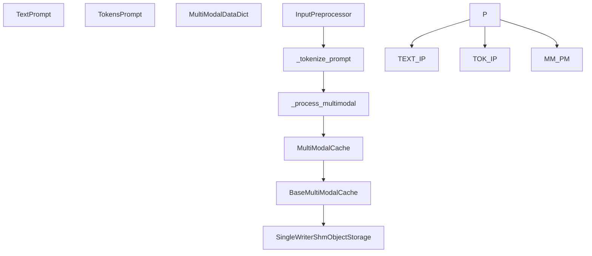

# 输入与输出处理

相关源文件

-   [tests/config/test\_multimodal\_config.py](https://github.com/vllm-project/vllm/blob/7cc302dd/tests/config/test_multimodal_config.py)
-   [tests/distributed/test\_shm\_buffer.py](https://github.com/vllm-project/vllm/blob/7cc302dd/tests/distributed/test_shm_buffer.py)
-   [tests/distributed/test\_shm\_storage.py](https://github.com/vllm-project/vllm/blob/7cc302dd/tests/distributed/test_shm_storage.py)
-   [tests/multimodal/test\_cache.py](https://github.com/vllm-project/vllm/blob/7cc302dd/tests/multimodal/test_cache.py)
-   [tests/quantization/test\_mixed\_precision.py](https://github.com/vllm-project/vllm/blob/7cc302dd/tests/quantization/test_mixed_precision.py)
-   [tests/samplers/test\_logprobs.py](https://github.com/vllm-project/vllm/blob/7cc302dd/tests/samplers/test_logprobs.py)
-   [tests/test\_logprobs.py](https://github.com/vllm-project/vllm/blob/7cc302dd/tests/test_logprobs.py)
-   [tests/tool\_use/test\_tool\_choice\_required.py](https://github.com/vllm-project/vllm/blob/7cc302dd/tests/tool_use/test_tool_choice_required.py)
-   [tests/v1/engine/test\_output\_processor.py](https://github.com/vllm-project/vllm/blob/7cc302dd/tests/v1/engine/test_output_processor.py)
-   [tests/v1/engine/utils.py](https://github.com/vllm-project/vllm/blob/7cc302dd/tests/v1/engine/utils.py)
-   [tests/v1/structured\_output/test\_utils.py](https://github.com/vllm-project/vllm/blob/7cc302dd/tests/v1/structured_output/test_utils.py)
-   [tests/v1/test\_serial\_utils.py](https://github.com/vllm-project/vllm/blob/7cc302dd/tests/v1/test_serial_utils.py)
-   [tests/v1/test\_tensor\_ipc\_queue.py](https://github.com/vllm-project/vllm/blob/7cc302dd/tests/v1/test_tensor_ipc_queue.py)
-   [vllm/config/multimodal.py](https://github.com/vllm-project/vllm/blob/7cc302dd/vllm/config/multimodal.py)
-   [vllm/distributed/device\_communicators/shm\_object\_storage.py](https://github.com/vllm-project/vllm/blob/7cc302dd/vllm/distributed/device_communicators/shm_object_storage.py)
-   [vllm/logprobs.py](https://github.com/vllm-project/vllm/blob/7cc302dd/vllm/logprobs.py)
-   [vllm/multimodal/cache.py](https://github.com/vllm-project/vllm/blob/7cc302dd/vllm/multimodal/cache.py)
-   [vllm/outputs.py](https://github.com/vllm-project/vllm/blob/7cc302dd/vllm/outputs.py)
-   [vllm/sequence.py](https://github.com/vllm-project/vllm/blob/7cc302dd/vllm/sequence.py)
-   [vllm/v1/engine/logprobs.py](https://github.com/vllm-project/vllm/blob/7cc302dd/vllm/v1/engine/logprobs.py)
-   [vllm/v1/engine/output\_processor.py](https://github.com/vllm-project/vllm/blob/7cc302dd/vllm/v1/engine/output_processor.py)
-   [vllm/v1/engine/tensor\_ipc.py](https://github.com/vllm-project/vllm/blob/7cc302dd/vllm/v1/engine/tensor_ipc.py)
-   [vllm/v1/serial\_utils.py](https://github.com/vllm-project/vllm/blob/7cc302dd/vllm/v1/serial_utils.py)
-   [vllm/v1/structured\_output/\_\_init\_\_.py](https://github.com/vllm-project/vllm/blob/7cc302dd/vllm/v1/structured_output/__init__.py)
-   [vllm/v1/structured\_output/backend\_guidance.py](https://github.com/vllm-project/vllm/blob/7cc302dd/vllm/v1/structured_output/backend_guidance.py)
-   [vllm/v1/structured\_output/backend\_lm\_format\_enforcer.py](https://github.com/vllm-project/vllm/blob/7cc302dd/vllm/v1/structured_output/backend_lm_format_enforcer.py)
-   [vllm/v1/structured\_output/backend\_outlines.py](https://github.com/vllm-project/vllm/blob/7cc302dd/vllm/v1/structured_output/backend_outlines.py)
-   [vllm/v1/structured\_output/backend\_types.py](https://github.com/vllm-project/vllm/blob/7cc302dd/vllm/v1/structured_output/backend_types.py)
-   [vllm/v1/structured\_output/backend\_xgrammar.py](https://github.com/vllm-project/vllm/blob/7cc302dd/vllm/v1/structured_output/backend_xgrammar.py)
-   [vllm/v1/structured\_output/request.py](https://github.com/vllm-project/vllm/blob/7cc302dd/vllm/v1/structured_output/request.py)
-   [vllm/v1/structured\_output/utils.py](https://github.com/vllm-project/vllm/blob/7cc302dd/vllm/v1/structured_output/utils.py)

## 目的与范围

本文档介绍 vLLM 如何将输入提示处理为可供模型使用的张量，并将 `EngineCore` 输出的原始模型结果——采样得到的令牌 ID 和 logprobs——转换为返回给调用方的 `RequestOutput` 和 `CompletionOutput` 对象。该流水线涵盖多模态输入解析、增量反分词、停止字符串检测、logprobs 累积以及结构化输出（grammar）处理。

关于 GPU 模型运行器如何采样令牌，请参见 [4.4](https://github.com/vllm-project/vllm/blob/7cc302dd/4.4) 页。关于调度器如何生成 `EngineCoreOutput` 对象，请参见 [3.3](https://github.com/vllm-project/vllm/blob/7cc302dd/3.3) 页。

---

## 输入预处理与多模态处理

`InputPreprocessor` 负责将各种提示格式（文本、令牌或多模态字典）转换为统一的 `LLMInputs` 格式。

### 多模态注册中心与数据流

vLLM 使用 `MultiModalRegistry` 根据模型架构分发数据处理。多模态数据以 `MultiModalDataDict` 的形式传递，该字典将模态名称（例如 "image"、"audio"）映射到各自的数据项。

为优化性能，vLLM 实现了 `MultiModalCache` [vllm/multimodal/cache.py98](https://github.com/vllm-project/vllm/blob/7cc302dd/vllm/multimodal/cache.py#L98-L98) 和 `BaseMultiModalCache` [vllm/multimodal/cache.py175](https://github.com/vllm-project/vllm/blob/7cc302dd/vllm/multimodal/cache.py#L175-L175) 系统。该系统支持通过共享内存（`shm`）或基于 LRU 的镜像机制，在 API 前端（P0）与引擎核心（P1）之间同步缓存的多模态项 [vllm/config/multimodal.py131-137](https://github.com/vllm-project/vllm/blob/7cc302dd/vllm/config/multimodal.py#L131-L137)

**图：输入预处理与多模态缓存流水线**

来源： [vllm/multimodal/cache.py98-230](https://github.com/vllm-project/vllm/blob/7cc302dd/vllm/multimodal/cache.py#L98-L230) [vllm/config/multimodal.py73-137](https://github.com/vllm-project/vllm/blob/7cc302dd/vllm/config/multimodal.py#L73-L137) [vllm/multimodal/inputs.py150-156](https://github.com/vllm-project/vllm/blob/7cc302dd/vllm/multimodal/inputs.py#L150-L156)

---

## 结构化输出处理

vLLM 通过 `StructuredOutputManager` 支持使用语法、JSON schema 或正则表达式进行引导生成 [vllm/v1/structured\_output/\_\_init\_\_.py35](https://github.com/vllm-project/vllm/blob/7cc302dd/vllm/v1/structured_output/__init__.py#L35-L35)

### 后端架构

vLLM 为结构化输出支持多个后端。管理器会在收到首个请求时初始化后端 [vllm/v1/structured\_output/\_\_init\_\_.py112-147](https://github.com/vllm-project/vllm/blob/7cc302dd/vllm/v1/structured_output/__init__.py#L112-L147)

| 后端 | 类 | 描述 |
| --- | --- | --- |
| **xgrammar** | `XgrammarBackend` | 使用 `xgrammar` 的高性能、基于位掩码的有限状态机 [vllm/v1/structured\_output/backend\_xgrammar.py35](https://github.com/vllm-project/vllm/blob/7cc302dd/vllm/v1/structured_output/backend_xgrammar.py#L35-L35) |
| **guidance** | `GuidanceBackend` | 与 `llguidance` 库集成 [vllm/v1/structured\_output/backend\_guidance.py86](https://github.com/vllm-project/vllm/blob/7cc302dd/vllm/v1/structured_output/backend_guidance.py#L86-L86) |
| **outlines** | `OutlinesBackend` | 与 Outlines 集成，用于基于 FSM 的解码 [vllm/v1/structured\_output/backend\_outlines.py](https://github.com/vllm-project/vllm/blob/7cc302dd/vllm/v1/structured_output/backend_outlines.py) |
| **lm-format-enforcer** | `LMFormatEnforcerBackend` | 与 LM Format Enforcer 集成 [vllm/v1/structured\_output/backend\_lm\_format\_enforcer.py](https://github.com/vllm-project/vllm/blob/7cc302dd/vllm/v1/structured_output/backend_lm_format_enforcer.py) |

### 位掩码应用与序列化

引擎会生成一个令牌位掩码，并在采样前将其应用到模型的 logits 上。为提高分布式环境中的效率，vLLM 使用专门的 `MsgpackEncoder` [vllm/v1/serial\_utils.py136](https://github.com/vllm-project/vllm/blob/7cc302dd/vllm/v1/serial_utils.py#L136-L136) 来处理张量和 numpy 数组的零拷贝序列化 [vllm/v1/serial\_utils.py147-165](https://github.com/vllm-project/vllm/blob/7cc302dd/vllm/v1/serial_utils.py#L147-L165)

`apply_grammar_bitmask` 函数 [vllm/v1/structured\_output/utils.py45](https://github.com/vllm-project/vllm/blob/7cc302dd/vllm/v1/structured_output/utils.py#L45-L45) 会重新排列位掩码，使其与 `InputBatch` 中的批次索引一致，并使用 `xgr.apply_token_bitmask_inplace` [vllm/v1/structured\_output/utils.py76-98](https://github.com/vllm-project/vllm/blob/7cc302dd/vllm/v1/structured_output/utils.py#L76-L98) 将其应用 [vllm/v1/structured\_output/utils.py122](https://github.com/vllm-project/vllm/blob/7cc302dd/vllm/v1/structured_output/utils.py#L122-L122)

**图：结构化输出逻辑与序列化**

> **[Mermaid sequence]**
> *(图表结构无法解析)*

来源： [vllm/v1/structured\_output/\_\_init\_\_.py97-153](https://github.com/vllm-project/vllm/blob/7cc302dd/vllm/v1/structured_output/__init__.py#L97-L153) [vllm/v1/structured\_output/backend\_xgrammar.py77-125](https://github.com/vllm-project/vllm/blob/7cc302dd/vllm/v1/structured_output/backend_xgrammar.py#L77-L125) [vllm/v1/structured\_output/utils.py45-136](https://github.com/vllm-project/vllm/blob/7cc302dd/vllm/v1/structured_output/utils.py#L45-L136) [vllm/v1/serial\_utils.py136-190](https://github.com/vllm-project/vllm/blob/7cc302dd/vllm/v1/serial_utils.py#L136-L190)

---

## 输出处理器与反分词

引擎输出的原始令牌 ID 会由 `OutputProcessor` 处理为人类可读的文本 [vllm/v1/engine/output\_processor.py413](https://github.com/vllm-project/vllm/blob/7cc302dd/vllm/v1/engine/output_processor.py#L413-L413)

### RequestState 与增量反分词

每个请求都由一个 `RequestState` 跟踪。它管理 `arrival_time`、`lora_request` 以及 `IncrementalDetokenizer` 等元数据 [vllm/v1/engine/output\_processor.py129](https://github.com/vllm-project/vllm/blob/7cc302dd/vllm/v1/engine/output_processor.py#L129-L129) [vllm/v1/engine/output\_processor.py130-152](https://github.com/vllm-project/vllm/blob/7cc302dd/vllm/v1/engine/output_processor.py#L130-L152)

**反分词器类型：**

1.  **`FastIncrementalDetokenizer`**：使用高性能解码流。
2.  **`SlowIncrementalDetokenizer`**：基于 Python 的回退实现。

### RequestOutputCollector

在 `AsyncLLM` 中，`RequestOutputCollector` [vllm/v1/engine/output\_processor.py45](https://github.com/vllm-project/vllm/blob/7cc302dd/vllm/v1/engine/output_processor.py#L45-L45) 充当流式输出的队列。

-   **聚合**：如果 `output_kind` 为 `DELTA`，它会合并后续的 `RequestOutput` 对象 [vllm/v1/engine/output\_processor.py72](https://github.com/vllm-project/vllm/blob/7cc302dd/vllm/v1/engine/output_processor.py#L72-L72)
-   **非阻塞操作**：支持 `put()` [vllm/v1/engine/output\_processor.py62](https://github.com/vllm-project/vllm/blob/7cc302dd/vllm/v1/engine/output_processor.py#L62-L62) 和 `get_nowait()` [vllm/v1/engine/output\_processor.py88](https://github.com/vllm-project/vllm/blob/7cc302dd/vllm/v1/engine/output_processor.py#L88-L88)

---

## 关键数据结构总览

### 客户端侧输出对象

定义于 `vllm/outputs.py`。

| 类 | 作用 |
| --- | --- |
| `RequestOutput` | 包含某个请求所有完成序列的顶层对象 [vllm/outputs.py85](https://github.com/vllm-project/vllm/blob/7cc302dd/vllm/outputs.py#L85-L85) |
| `CompletionOutput` | 单个生成序列的数据，包括文本、令牌 ID 和 logprobs [vllm/outputs.py22](https://github.com/vllm-project/vllm/blob/7cc302dd/vllm/outputs.py#L22-L22) |
| `PoolingOutput` | 用于嵌入模型的输出，包含原始隐藏状态张量 [vllm/outputs.py67](https://github.com/vllm-project/vllm/blob/7cc302dd/vllm/outputs.py#L67-L67) |
| `PoolingRequestOutput` | 与请求关联的 `PoolingOutput` 容器 [vllm/outputs.py192](https://github.com/vllm-project/vllm/blob/7cc302dd/vllm/outputs.py#L192-L192) |

### 序列化工具

vLLM V1 使用 `msgpack` 在 API 服务器和引擎核心之间进行快速 IPC。

-   **`MsgpackEncoder`**：带有面向 `torch.Tensor` 和 `np.ndarray` 的 `enc_hook` 的自定义编码器 [vllm/v1/serial\_utils.py191-212](https://github.com/vllm-project/vllm/blob/7cc302dd/vllm/v1/serial_utils.py#L191-L212)
-   **`MsgpackDecoder`**：将字节流解码回 Python 对象或特定 dataclass [vllm/v1/serial\_utils.py270](https://github.com/vllm-project/vllm/blob/7cc302dd/vllm/v1/serial_utils.py#L270-L270)

来源： [vllm/outputs.py22-192](https://github.com/vllm-project/vllm/blob/7cc302dd/vllm/outputs.py#L22-L192) [vllm/v1/engine/output\_processor.py45-187](https://github.com/vllm-project/vllm/blob/7cc302dd/vllm/v1/engine/output_processor.py#L45-L187) [vllm/v1/serial\_utils.py136-300](https://github.com/vllm-project/vllm/blob/7cc302dd/vllm/v1/serial_utils.py#L136-L300)
