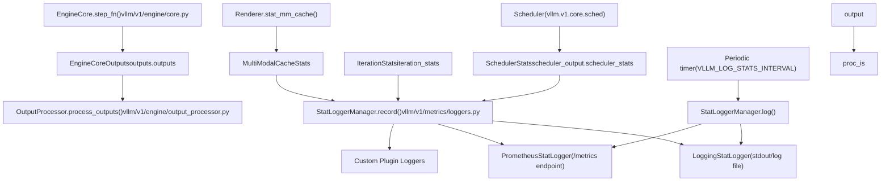
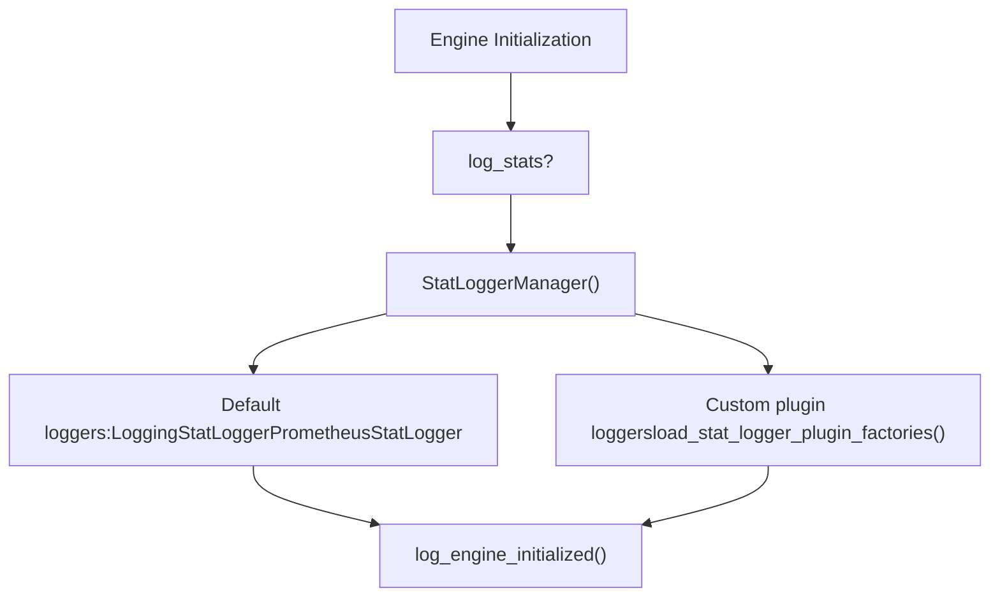
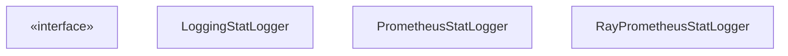

# 指标与可观测性

相关源文件

-   [docs/cli/README.md](https://github.com/vllm-project/vllm/blob/7cc302dd/docs/cli/README.md?plain=1)
-   [docs/configuration/engine\_args.md](https://github.com/vllm-project/vllm/blob/7cc302dd/docs/configuration/engine_args.md?plain=1)
-   [docs/deployment/nginx.md](https://github.com/vllm-project/vllm/blob/7cc302dd/docs/deployment/nginx.md?plain=1)
-   [docs/design/fused\_moe\_modular\_kernel.md](https://github.com/vllm-project/vllm/blob/7cc302dd/docs/design/fused_moe_modular_kernel.md?plain=1)
-   [docs/design/metrics.md](https://github.com/vllm-project/vllm/blob/7cc302dd/docs/design/metrics.md?plain=1)
-   [docs/design/prefix\_caching.md](https://github.com/vllm-project/vllm/blob/7cc302dd/docs/design/prefix_caching.md?plain=1)
-   [docs/mkdocs/hooks/generate\_metrics.py](https://github.com/vllm-project/vllm/blob/7cc302dd/docs/mkdocs/hooks/generate_metrics.py)
-   [docs/usage/metrics.md](https://github.com/vllm-project/vllm/blob/7cc302dd/docs/usage/metrics.md?plain=1)
-   [docs/usage/reproducibility.md](https://github.com/vllm-project/vllm/blob/7cc302dd/docs/usage/reproducibility.md?plain=1)
-   [examples/offline\_inference/reproducibility.py](https://github.com/vllm-project/vllm/blob/7cc302dd/examples/offline_inference/reproducibility.py)
-   [tests/v1/metrics/test\_perf\_metrics.py](https://github.com/vllm-project/vllm/blob/7cc302dd/tests/v1/metrics/test_perf_metrics.py)
-   [tests/v1/metrics/test\_ray\_metrics.py](https://github.com/vllm-project/vllm/blob/7cc302dd/tests/v1/metrics/test_ray_metrics.py)
-   [tests/v1/metrics/test\_stats.py](https://github.com/vllm-project/vllm/blob/7cc302dd/tests/v1/metrics/test_stats.py)
-   [vllm/distributed/kv\_transfer/kv\_connector/v1/metrics.py](https://github.com/vllm-project/vllm/blob/7cc302dd/vllm/distributed/kv_transfer/kv_connector/v1/metrics.py)
-   [vllm/v1/metrics/loggers.py](https://github.com/vllm-project/vllm/blob/7cc302dd/vllm/v1/metrics/loggers.py)
-   [vllm/v1/metrics/perf.py](https://github.com/vllm-project/vllm/blob/7cc302dd/vllm/v1/metrics/perf.py)
-   [vllm/v1/metrics/ray\_wrappers.py](https://github.com/vllm-project/vllm/blob/7cc302dd/vllm/v1/metrics/ray_wrappers.py)
-   [vllm/v1/metrics/stats.py](https://github.com/vllm-project/vllm/blob/7cc302dd/vllm/v1/metrics/stats.py)
-   [vllm/v1/metrics/utils.py](https://github.com/vllm-project/vllm/blob/7cc302dd/vllm/v1/metrics/utils.py)
-   [vllm/v1/spec\_decode/metrics.py](https://github.com/vllm-project/vllm/blob/7cc302dd/vllm/v1/spec_decode/metrics.py)

本文档介绍 vLLM 如何收集、聚合并暴露运行时指标。内容涵盖 v1 统计数据类、日志记录器层级、Prometheus 指标、请求延迟拆分，以及与 Ray 和自定义插件日志记录器的集成。

---

## 架构概览

指标系统由一个**统计收集层**和一个**日志记录层**组成：前者在每个引擎步骤之后汇总数据，后者消费这些统计信息并将其写入标准输出或通过兼容 Prometheus 的端点暴露出来。

指标在同步执行路径中的 `LLMEngine.step()` 以及异步执行路径中的 `AsyncLLM._run_output_handler()` 中收集。两条路径都会从 `EngineCoreOutput` 创建 `IterationStats`，并将其传递给 `StatLoggerManager` 实例。

**指标系统中的数据流**

来源： [vllm/v1/metrics/loggers.py40-64](https://github.com/vllm-project/vllm/blob/7cc302dd/vllm/v1/metrics/loggers.py#L40-L64) [vllm/v1/metrics/stats.py171-200](https://github.com/vllm-project/vllm/blob/7cc302dd/vllm/v1/metrics/stats.py#L171-L200) [vllm/v1/metrics/stats.py303-330](https://github.com/vllm-project/vllm/blob/7cc302dd/vllm/v1/metrics/stats.py#L303-L330) [vllm/v1/metrics/loggers.py1022-1050](https://github.com/vllm-project/vllm/blob/7cc302dd/vllm/v1/metrics/loggers.py#L1022-L1050)

---

## StatLoggerManager 初始化

`StatLoggerManager` 负责协调所有已注册的统计日志记录器。它会在引擎初始化期间、当 `log_stats=True` 时实例化，并维护一组 `StatLoggerBase` 实现。

**初始化流程**

来源： [vllm/v1/metrics/loggers.py1022-1118](https://github.com/vllm-project/vllm/blob/7cc302dd/vllm/v1/metrics/loggers.py#L1022-L1118) [vllm/v1/metrics/loggers.py70-84](https://github.com/vllm-project/vllm/blob/7cc302dd/vllm/v1/metrics/loggers.py#L70-L84) [vllm/v1/metrics/loggers.py1044-1065](https://github.com/vllm-project/vllm/blob/7cc302dd/vllm/v1/metrics/loggers.py#L1044-L1065)

---

## 统计收集层

统计对象定义在 `vllm/v1/metrics/stats.py` 中，采用 dataclass 形式，便于在引擎核心与前端之间轻松传递。

### SchedulerStats

由调度器在每个步骤后生成，携带资源分配和缓存使用的当前状态。

| 字段 | 类型 | 描述 |
| --- | --- | --- |
| `num_running_reqs` | `int` | 当前处于模型执行批次中的请求。 |
| `num_waiting_reqs` | `int` | 等待队列中的请求。 |
| `kv_cache_usage` | `float` | 已使用的 KV 缓存块比例（0.0–1.0）。 |
| `prefix_cache_stats` | `PrefixCacheStats` | 本地前缀缓存命中/未命中计数。 |
| `spec_decoding_stats` | `SpecDecodingStats` | 推测解码性能统计。 |
| `perf_stats` | `PerfStats` | MFU 和硬件性能统计。 |
| `kv_connector_stats` | `dict[str, Any]` | 解耦式 KV 传输统计。 |

来源： [vllm/v1/metrics/stats.py171-198](https://github.com/vllm-project/vllm/blob/7cc302dd/vllm/v1/metrics/stats.py#L171-L198)

### IterationStats

`OutputProcessor` 基于一批 `EngineCoreOutput` 对象组装该结构。它跟踪令牌计数和已完成请求的摘要。

| 字段 | 类型 | 描述 |
| --- | --- | --- |
| `num_generation_tokens` | `int` | 本步骤中的生成令牌总数。 |
| `prompt_token_stats` | `PromptTokenStats` | 按来源（计算 vs 缓存）划分的提示令牌明细。 |
| `finished_requests` | `list[FinishedRequestStats]` | 本次迭代中已完成请求的摘要。 |

来源： [vllm/v1/metrics/stats.py303-330](https://github.com/vllm-project/vllm/blob/7cc302dd/vllm/v1/metrics/stats.py#L303-L330)

### CachingMetrics

维护最近 $N$ 个请求的滑动窗口命中率（默认 1000）。

-   **实现**：使用由 `(requests, queries, hits)` 元组组成的 `deque`。
-   **命中率**：计算公式为 `aggregated_query_hit / aggregated_query_total`。
-   **重置**：由 `BaseCacheStats.reset` 触发（例如手动清空缓存后）。

来源： [vllm/v1/metrics/stats.py35-111](https://github.com/vllm-project/vllm/blob/7cc302dd/vllm/v1/metrics/stats.py#L35-L111)

---

## 日志记录器层级

该系统使用抽象基类 `StatLoggerBase` 来定义所有日志记录器的接口。

来源： [vllm/v1/metrics/loggers.py40-64](https://github.com/vllm-project/vllm/blob/7cc302dd/vllm/v1/metrics/loggers.py#L40-L64) [vllm/v1/metrics/loggers.py95-100](https://github.com/vllm-project/vllm/blob/7cc302dd/vllm/v1/metrics/loggers.py#L95-L100) [vllm/v1/metrics/loggers.py389-400](https://github.com/vllm-project/vllm/blob/7cc302dd/vllm/v1/metrics/loggers.py#L389-L400) [vllm/v1/metrics/ray\_wrappers.py193-202](https://github.com/vllm-project/vllm/blob/7cc302dd/vllm/v1/metrics/ray_wrappers.py#L193-L202)

### LoggingStatLogger

将易于阅读的摘要写入标准 info 日志。它在本地日志记录间隔内跟踪吞吐量，并在每次 `log()` 调用后重置计数器。它还负责 `SpecDecodingLogging` 和 `KVConnectorLogging` 的日志记录。

来源： [vllm/v1/metrics/loggers.py95-134](https://github.com/vllm-project/vllm/blob/7cc302dd/vllm/v1/metrics/loggers.py#L95-L134) [vllm/v1/metrics/loggers.py165-190](https://github.com/vllm-project/vllm/blob/7cc302dd/vllm/v1/metrics/loggers.py#L165-L190)

### PrometheusStatLogger

注册并更新 Prometheus 指标。它使用 `prometheus_client` 暴露 Gauge、Counter 和 Histogram。

-   **指标前缀**：所有指标都使用 `vllm:` 前缀。
-   **多进程**：支持 `prometheus_client.multiprocess`，适用于存在多个 API 服务器的部署。
-   **MFU 指标**：如果在 `ObservabilityConfig` 中启用，可使用 `PerfMetricsProm` 选择性记录 Model Flops Utilization（MFU）。

来源： [vllm/v1/metrics/loggers.py389-450](https://github.com/vllm-project/vllm/blob/7cc302dd/vllm/v1/metrics/loggers.py#L389-L450) [vllm/v1/metrics/loggers.py423-445](https://github.com/vllm-project/vllm/blob/7cc302dd/vllm/v1/metrics/loggers.py#L423-L445) [vllm/v1/metrics/perf.py1221-1250](https://github.com/vllm-project/vllm/blob/7cc302dd/vllm/v1/metrics/perf.py#L1221-L1250)

---

## Ray 与分布式可观测性

对于运行在 Ray 上的部署，vLLM 提供 `RayPrometheusStatLogger`。该日志记录器使用 `ray.util.metrics` 将标准 Prometheus 指标包装为与 Ray 兼容的指标。

-   **RayGaugeWrapper / RayCounterWrapper**：将 Prometheus API 适配为 Ray 的指标系统。
-   **规范化**：通过 `_get_sanitized_opentelemetry_name` 清理指标名称，将 `:` 等字符替换为 `_`，以兼容 OpenTelemetry。
-   **副本 ID**：自动将 Ray Serve `ReplicaId` 作为标签附加到所有指标上。

来源： [vllm/v1/metrics/ray\_wrappers.py30-75](https://github.com/vllm-project/vllm/blob/7cc302dd/vllm/v1/metrics/ray_wrappers.py#L30-L75) [vllm/v1/metrics/ray\_wrappers.py193-202](https://github.com/vllm-project/vllm/blob/7cc302dd/vllm/v1/metrics/ray_wrappers.py#L193-L202) [vllm/v1/metrics/ray\_wrappers.py78-134](https://github.com/vllm-project/vllm/blob/7cc302dd/vllm/v1/metrics/ray_wrappers.py#L78-L134)

---

## 请求延迟拆分

该系统为每个请求跟踪多个延迟区间，主要在 `IterationStats.update_from_finished_request()` 中计算。这些区间会以 histogram 的形式暴露到 Prometheus 中。

| 区间 | 计算方式 | 代码实体 |
| --- | --- | --- |
| `queue_time` | `scheduled_ts - queued_ts` | `FinishedRequestStats.queue_time` |
| `prefill_time` | `first_token_ts - scheduled_ts` | `FinishedRequestStats.prefill_time` |
| `decode_time` | `last_token_ts - first_token_ts` | `FinishedRequestStats.decode_time` |
| `e2e_latency` | `now - arrival_time` | `FinishedRequestStats.e2e_latency` |

来源： [vllm/v1/metrics/stats.py222-238](https://github.com/vllm-project/vllm/blob/7cc302dd/vllm/v1/metrics/stats.py#L222-L238) [vllm/v1/metrics/stats.py410-456](https://github.com/vllm-project/vllm/blob/7cc302dd/vllm/v1/metrics/stats.py#L410-L456)

---

## 性能与 MFU 指标

vLLM 在 `vllm/v1/metrics/perf.py` 中包含一个用于分析 FLOPs/内存估算的模块。它用于为运行中的模型推导 Model Flops Utilization（MFU）统计信息。

-   **PerfStats**：包含 `num_flops_per_gpu`、`num_read_bytes_per_gpu` 和 `num_write_bytes_per_gpu` 的 dataclass。
-   **ExecutionContext**：汇总批次统计信息（prefill 与 decode），为 FLOPs 计算提供上下文。
-   **量化支持**：`_QUANT_WEIGHT_BYTE_SIZE` 映射使估算器在计算内存带宽使用时能够考虑多种量化方法（FP8、GPTQ、AWQ 等）。

来源： [vllm/v1/metrics/perf.py52-77](https://github.com/vllm-project/vllm/blob/7cc302dd/vllm/v1/metrics/perf.py#L52-L77) [vllm/v1/metrics/perf.py96-100](https://github.com/vllm-project/vllm/blob/7cc302dd/vllm/v1/metrics/perf.py#L96-L100) [vllm/v1/metrics/perf.py104-142](https://github.com/vllm-project/vllm/blob/7cc302dd/vllm/v1/metrics/perf.py#L104-L142)

---

## 推测解码指标

推测解码性能通过 `SpecDecodingStats` 跟踪。这些统计信息由 `SpecDecodingLogging`（用于 stdout）和 `SpecDecodingProm`（用于 Prometheus）聚合。

关键指标包括：

-   **平均接受长度**：每个 draft 平均接受的令牌数（计算公式为 `1 + (num_accepted_tokens / num_drafts)`）。
-   **接受率**：`num_accepted_tokens / num_draft_tokens`。
-   **按位置接受率**：一个向量，用于跟踪每个特定 draft 位置被接受的概率。

来源： [vllm/v1/spec\_decode/metrics.py17-45](https://github.com/vllm-project/vllm/blob/7cc302dd/vllm/v1/spec_decode/metrics.py#L17-L45) [vllm/v1/spec\_decode/metrics.py88-99](https://github.com/vllm-project/vllm/blob/7cc302dd/vllm/v1/spec_decode/metrics.py#L88-L99) [vllm/v1/spec\_decode/metrics.py121-140](https://github.com/vllm-project/vllm/blob/7cc302dd/vllm/v1/spec_decode/metrics.py#L121-L140)

---

## 自定义日志记录器插件系统

用户可以通过继承 `StatLoggerBase` 并通过 `vllm.stat_loggers` entry point 组注册来自定义日志记录器。

1.  **发现**：`load_stat_logger_plugin_factories()` 在运行时使用 `load_plugins_by_group(STAT_LOGGER_PLUGINS_GROUP)` 搜索插件。
2.  **校验**：系统确保所有插件都是 `StatLoggerBase` 的子类。
3.  **执行**：`StatLoggerManager` 除默认日志记录器外，还会对所有已注册插件调用 `record()` 和 `log()`。

来源： [vllm/v1/metrics/loggers.py70-84](https://github.com/vllm-project/vllm/blob/7cc302dd/vllm/v1/metrics/loggers.py#L70-L84) [vllm/v1/metrics/loggers.py1022-1050](https://github.com/vllm-project/vllm/blob/7cc302dd/vllm/v1/metrics/loggers.py#L1022-L1050) [vllm/v1/metrics/loggers.py19-20](https://github.com/vllm-project/vllm/blob/7cc302dd/vllm/v1/metrics/loggers.py#L19-L20)
