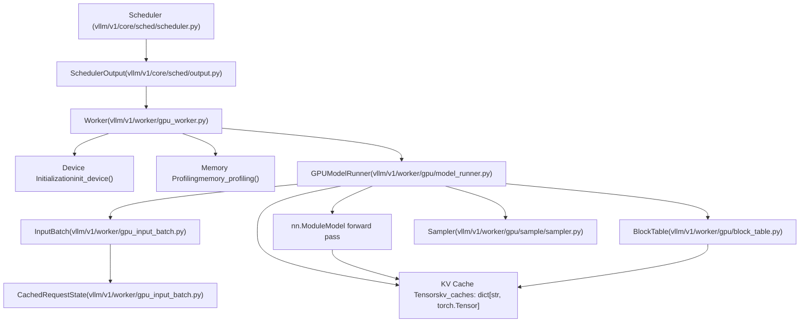
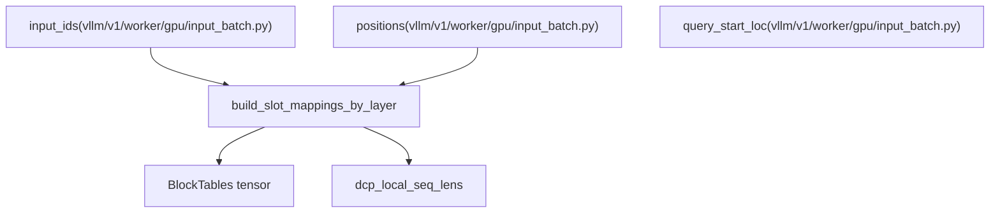

# GPU 上的模型执行 (Model Execution on GPU)

相关源文件

-   [.buildkite/test\_areas/model\_runner\_v2.yaml](https://github.com/vllm-project/vllm/blob/7cc302dd/.buildkite/test_areas/model_runner_v2.yaml)
-   [tests/v1/ec\_connector/integration/test\_epd\_correctness.py](https://github.com/vllm-project/vllm/blob/7cc302dd/tests/v1/ec_connector/integration/test_epd_correctness.py)
-   [tests/v1/executor/test\_executor.py](https://github.com/vllm-project/vllm/blob/7cc302dd/tests/v1/executor/test_executor.py)
-   [tests/v1/kv\_connector/unit/test\_output\_aggregator.py](https://github.com/vllm-project/vllm/blob/7cc302dd/tests/v1/kv_connector/unit/test_output_aggregator.py)
-   [tests/v1/spec\_decode/test\_synthetic\_rejection\_sampler\_utils.py](https://github.com/vllm-project/vllm/blob/7cc302dd/tests/v1/spec_decode/test_synthetic_rejection_sampler_utils.py)
-   [tests/v1/worker/test\_gpu\_input\_batch.py](https://github.com/vllm-project/vllm/blob/7cc302dd/tests/v1/worker/test_gpu_input_batch.py)
-   [tests/v1/worker/test\_gpu\_model\_runner.py](https://github.com/vllm-project/vllm/blob/7cc302dd/tests/v1/worker/test_gpu_model_runner.py)
-   [vllm/v1/core/sched/output.py](https://github.com/vllm-project/vllm/blob/7cc302dd/vllm/v1/core/sched/output.py)
-   [vllm/v1/executor/abstract.py](https://github.com/vllm-project/vllm/blob/7cc302dd/vllm/v1/executor/abstract.py)
-   [vllm/v1/executor/multiproc\_executor.py](https://github.com/vllm-project/vllm/blob/7cc302dd/vllm/v1/executor/multiproc_executor.py)
-   [vllm/v1/executor/ray\_executor.py](https://github.com/vllm-project/vllm/blob/7cc302dd/vllm/v1/executor/ray_executor.py)
-   [vllm/v1/executor/ray\_utils.py](https://github.com/vllm-project/vllm/blob/7cc302dd/vllm/v1/executor/ray_utils.py)
-   [vllm/v1/executor/uniproc\_executor.py](https://github.com/vllm-project/vllm/blob/7cc302dd/vllm/v1/executor/uniproc_executor.py)
-   [vllm/v1/worker/block\_table.py](https://github.com/vllm-project/vllm/blob/7cc302dd/vllm/v1/worker/block_table.py)
-   [vllm/v1/worker/gpu/async\_utils.py](https://github.com/vllm-project/vllm/blob/7cc302dd/vllm/v1/worker/gpu/async_utils.py)
-   [vllm/v1/worker/gpu/attn\_utils.py](https://github.com/vllm-project/vllm/blob/7cc302dd/vllm/v1/worker/gpu/attn_utils.py)
-   [vllm/v1/worker/gpu/block\_table.py](https://github.com/vllm-project/vllm/blob/7cc302dd/vllm/v1/worker/gpu/block_table.py)
-   [vllm/v1/worker/gpu/buffer\_utils.py](https://github.com/vllm-project/vllm/blob/7cc302dd/vllm/v1/worker/gpu/buffer_utils.py)
-   [vllm/v1/worker/gpu/cudagraph\_utils.py](https://github.com/vllm-project/vllm/blob/7cc302dd/vllm/v1/worker/gpu/cudagraph_utils.py)
-   [vllm/v1/worker/gpu/dp\_utils.py](https://github.com/vllm-project/vllm/blob/7cc302dd/vllm/v1/worker/gpu/dp_utils.py)
-   [vllm/v1/worker/gpu/input\_batch.py](https://github.com/vllm-project/vllm/blob/7cc302dd/vllm/v1/worker/gpu/input_batch.py)
-   [vllm/v1/worker/gpu/mm/\_\_init\_\_.py](https://github.com/vllm-project/vllm/blob/7cc302dd/vllm/v1/worker/gpu/mm/__init__.py)
-   [vllm/v1/worker/gpu/mm/encoder\_cache.py](https://github.com/vllm-project/vllm/blob/7cc302dd/vllm/v1/worker/gpu/mm/encoder_cache.py)
-   [vllm/v1/worker/gpu/mm/encoder\_runner.py](https://github.com/vllm-project/vllm/blob/7cc302dd/vllm/v1/worker/gpu/mm/encoder_runner.py)
-   [vllm/v1/worker/gpu/mm/rope.py](https://github.com/vllm-project/vllm/blob/7cc302dd/vllm/v1/worker/gpu/mm/rope.py)
-   [vllm/v1/worker/gpu/model\_runner.py](https://github.com/vllm-project/vllm/blob/7cc302dd/vllm/v1/worker/gpu/model_runner.py)
-   [vllm/v1/worker/gpu/sample/\_\_init\_\_.py](https://github.com/vllm-project/vllm/blob/7cc302dd/vllm/v1/worker/gpu/sample/__init__.py)
-   [vllm/v1/worker/gpu/sample/bad\_words.py](https://github.com/vllm-project/vllm/blob/7cc302dd/vllm/v1/worker/gpu/sample/bad_words.py)
-   [vllm/v1/worker/gpu/sample/gumbel.py](https://github.com/vllm-project/vllm/blob/7cc302dd/vllm/v1/worker/gpu/sample/gumbel.py)
-   [vllm/v1/worker/gpu/sample/logit\_bias.py](https://github.com/vllm-project/vllm/blob/7cc302dd/vllm/v1/worker/gpu/sample/logit_bias.py)
-   [vllm/v1/worker/gpu/sample/logprob.py](https://github.com/vllm-project/vllm/blob/7cc302dd/vllm/v1/worker/gpu/sample/logprob.py)
-   [vllm/v1/worker/gpu/sample/min\_p.py](https://github.com/vllm-project/vllm/blob/7cc302dd/vllm/v1/worker/gpu/sample/min_p.py)
-   [vllm/v1/worker/gpu/sample/output.py](https://github.com/vllm-project/vllm/blob/7cc302dd/vllm/v1/worker/gpu/sample/output.py)
-   [vllm/v1/worker/gpu/sample/penalties.py](https://github.com/vllm-project/vllm/blob/7cc302dd/vllm/v1/worker/gpu/sample/penalties.py)
-   [vllm/v1/worker/gpu/sample/prompt\_logprob.py](https://github.com/vllm-project/vllm/blob/7cc302dd/vllm/v1/worker/gpu/sample/prompt_logprob.py)
-   [vllm/v1/worker/gpu/sample/sampler.py](https://github.com/vllm-project/vllm/blob/7cc302dd/vllm/v1/worker/gpu/sample/sampler.py)
-   [vllm/v1/worker/gpu/sample/states.py](https://github.com/vllm-project/vllm/blob/7cc302dd/vllm/v1/worker/gpu/sample/states.py)
-   [vllm/v1/worker/gpu/spec\_decode/eagle/cudagraph.py](https://github.com/vllm-project/vllm/blob/7cc302dd/vllm/v1/worker/gpu/spec_decode/eagle/cudagraph.py)
-   [vllm/v1/worker/gpu/spec\_decode/eagle/speculator.py](https://github.com/vllm-project/vllm/blob/7cc302dd/vllm/v1/worker/gpu/spec_decode/eagle/speculator.py)
-   [vllm/v1/worker/gpu/spec\_decode/rejection\_sampler.py](https://github.com/vllm-project/vllm/blob/7cc302dd/vllm/v1/worker/gpu/spec_decode/rejection_sampler.py)
-   [vllm/v1/worker/gpu/spec\_decode/synthetic\_rejection\_sampler\_utils.py](https://github.com/vllm-project/vllm/blob/7cc302dd/vllm/v1/worker/gpu/spec_decode/synthetic_rejection_sampler_utils.py)
-   [vllm/v1/worker/gpu/states.py](https://github.com/vllm-project/vllm/blob/7cc302dd/vllm/v1/worker/gpu/states.py)
-   [vllm/v1/worker/gpu/structured\_outputs.py](https://github.com/vllm-project/vllm/blob/7cc302dd/vllm/v1/worker/gpu/structured_outputs.py)
-   [vllm/v1/worker/gpu\_input\_batch.py](https://github.com/vllm-project/vllm/blob/7cc302dd/vllm/v1/worker/gpu_input_batch.py)
-   [vllm/v1/worker/gpu\_model\_runner.py](https://github.com/vllm-project/vllm/blob/7cc302dd/vllm/v1/worker/gpu_model_runner.py)
-   [vllm/v1/worker/gpu\_worker.py](https://github.com/vllm-project/vllm/blob/7cc302dd/vllm/v1/worker/gpu_worker.py)
-   [vllm/v1/worker/utils.py](https://github.com/vllm-project/vllm/blob/7cc302dd/vllm/v1/worker/utils.py)
-   [vllm/v1/worker/worker\_base.py](https://github.com/vllm-project/vllm/blob/7cc302dd/vllm/v1/worker/worker_base.py)

本文档描述了 vLLM 中基于 GPU 的模型执行子系统，该子系统负责运行模型前向传播、管理设备资源，以及协调推理所需的显存分配。执行层位于调度器（决定运行什么）与模型实现（定义计算逻辑）之间。

**范围**：本页涵盖 GPU 执行的整体架构和生命周期。关于具体组件的详细信息，请参阅：

-   GPU 模型运行器实现细节：[GPU 模型运行器](/vllm-project/vllm/4.1-gpumodelrunner)
-   工作进程初始化与设备管理：[Worker 和 Executor 架构](/vllm-project/vllm/4.2-worker-and-executor-architecture)
-   请求批处理与状态管理：[InputBatch 和请求状态管理](/vllm-project/vllm/4.3-inputbatch-and-request-state-management)
-   采样与令牌生成：[采样与令牌生成](/vllm-project/vllm/4.4-sampling-and-token-generation)
-   推测解码机制：[推测解码](/vllm-project/vllm/4.5-speculative-decoding)

---

## 架构概览 (Architecture Overview)

GPU 执行子系统由三个主要组件协同完成模型推理：

**来源**：[vllm/v1/worker/gpu_worker.py105-156](https://github.com/vllm-project/vllm/blob/7cc302dd/vllm/v1/worker/gpu_worker.py#L105-L156) [vllm/v1/worker/gpu/model_runner.py103-173](https://github.com/vllm-project/vllm/blob/7cc302dd/vllm/v1/worker/gpu/model_runner.py#L103-L173) [vllm/v1/worker/gpu\_input\_batch.py29-157](https://github.com/vllm-project/vllm/blob/7cc302dd/vllm/v1/worker/gpu_input_batch.py#L29-L157) [vllm/v1/core/sched/output.py179-190](https://github.com/vllm-project/vllm/blob/7cc302dd/vllm/v1/core/sched/output.py#L179-L190)

---

## 工作进程生命周期 (Worker Lifecycle)

`Worker` 类负责管理 GPU 资源的完整生命周期，从设备初始化到模型加载再到显存分析。

### 设备初始化 (Device Initialization)

工作进程会在执行任何模型操作之前初始化 GPU 设备和分布式环境：

> **[Mermaid sequence]**
> *(图表结构无法解析)*

**`Worker` 中的关键操作**：

1.  **精度设置**：根据环境变量配置 `torch.set_float32_matmul_precision` [vllm/v1/worker/gpu\_worker.py123-124](https://github.com/vllm-project/vllm/blob/7cc302dd/vllm/v1/worker/gpu_worker.py#L123-L124)
2.  **分布式初始化**：为张量并行 (TP)、流水线并行 (PP) 和数据并行 (DP) 建立通信组 [vllm/v1/worker/gpu\_worker.py20-37](https://github.com/vllm-project/vllm/blob/7cc302dd/vllm/v1/worker/gpu_worker.py#L20-L37)
3.  **显存管理**：在休眠/唤醒周期中使用 `CuMemAllocator` 管理显存，在空闲时释放数 GiB 显存 [vllm/v1/worker/gpu\_worker.py157-180](https://github.com/vllm-project/vllm/blob/7cc302dd/vllm/v1/worker/gpu_worker.py#L157-L180)

**来源**：[vllm/v1/worker/gpu_worker.py105-180](https://github.com/vllm-project/vllm/blob/7cc302dd/vllm/v1/worker/gpu_worker.py#L105-L180) [vllm/v1/worker/gpu_worker.py20-49](https://github.com/vllm-project/vllm/blob/7cc302dd/vllm/v1/worker/gpu_worker.py#L20-L49) [vllm/v1/executor/multiproc\_executor.py168-181](https://github.com/vllm-project/vllm/blob/7cc302dd/vllm/v1/executor/multiproc_executor.py#L168-L181)

### 显存分析与 CUDA 图 (Memory Profiling and CUDA Graphs)

加载模型后，工作进程会分析可用显存，以确定 KV 缓存容量。这其中还会考虑 CUDA 图带来的开销。

**分析流程**：

1.  **分析运行**：执行虚拟前向传播以测量峰值激活显存 [vllm/v1/worker/gpu\_worker.py48-50](https://github.com/vllm-project/vllm/blob/7cc302dd/vllm/v1/worker/gpu_worker.py#L48-L50)
2.  **CUDA 图管理**：`CudaGraphManager` 会为不同的 token 数量构建按优先级排序的候选列表，以尽量减少图捕获开销 [vllm/v1/worker/gpu/cudagraph\_utils.py108-155](https://github.com/vllm-project/vllm/blob/7cc302dd/vllm/v1/worker/gpu/cudagraph_utils.py#L108-L155)
3.  **捕获逻辑**：会同时为 `PIECEWISE` 和 `FULL` 模式捕获图，以优化不同的批次形状 [vllm/v1/worker/gpu/cudagraph\_utils.py123-155](https://github.com/vllm-project/vllm/blob/7cc302dd/vllm/v1/worker/gpu/cudagraph_utils.py#L123-L155)

**来源**：[vllm/v1/worker/gpu/cudagraph\_utils.py80-155](https://github.com/vllm-project/vllm/blob/7cc302dd/vllm/v1/worker/gpu/cudagraph_utils.py#L80-L155) [vllm/v1/worker/gpu\_worker.py48-50](https://github.com/vllm-project/vllm/blob/7cc302dd/vllm/v1/worker/gpu_worker.py#L48-L50)

---

## 模型执行流水线 (Model Execution Pipeline)

执行流水线通过多个阶段将 `SchedulerOutput` 转换为 `ModelRunnerOutput`。

### 阶段 1：更新状态 (Stage 1: Update States)

`GPUModelRunner` 会将其内部状态与调度器的决策同步。

**操作**：

-   **输入批处理**：使用 `InputBatch` 管理 GPU 上请求的生命周期，包括 `token_ids`、`positions` 和 `block_table` 映射 [vllm/v1/worker/gpu\_input\_batch.py81-157](https://github.com/vllm-project/vllm/blob/7cc302dd/vllm/v1/worker/gpu_input_batch.py#L81-L157)
-   **请求状态**：在 `CachedRequestState` 中跟踪每个请求的元数据，例如 `num_computed_tokens` 和 `output_token_ids` [vllm/v1/worker/gpu\_input\_batch.py30-55](https://github.com/vllm-project/vllm/blob/7cc302dd/vllm/v1/worker/gpu_input_batch.py#L30-L55)
-   **V2 运行器状态**：实验性的 V2 运行器使用 `RequestState` 在 UVA 内存中管理 `all_token_ids`，以节省 GPU 显存 [vllm/v1/worker/gpu/states.py30-38](https://github.com/vllm-project/vllm/blob/7cc302dd/vllm/v1/worker/gpu/states.py#L30-L38)

**来源**：[vllm/v1/worker/gpu\_input\_batch.py29-157](https://github.com/vllm-project/vllm/blob/7cc302dd/vllm/v1/worker/gpu_input_batch.py#L29-L157) [vllm/v1/worker/gpu/model\_runner.py103-173](https://github.com/vllm-project/vllm/blob/7cc302dd/vllm/v1/worker/gpu/model_runner.py#L103-L173) [vllm/v1/worker/gpu/states.py9-53](https://github.com/vllm-project/vllm/blob/7cc302dd/vllm/v1/worker/gpu/states.py#L9-L53)

### 阶段 2：准备输入 (Stage 2: Prepare Inputs)

运行器会为模型前向传播构建 GPU 张量：

**已准备的关键张量**：

-   `input_ids`：当前步骤的 token ID [vllm/v1/worker/gpu/input\_batch.py23](https://github.com/vllm-project/vllm/blob/7cc302dd/vllm/v1/worker/gpu/input_batch.py#L23-L23)
-   `positions`：用于 RoPE 的序列位置 [vllm/v1/worker/gpu/input\_batch.py24](https://github.com/vllm-project/vllm/blob/7cc302dd/vllm/v1/worker/gpu/input_batch.py#L24-L24)
-   `query_start_loc`：批次中可变长度序列的累积偏移 [vllm/v1/worker/gpu/input\_batch.py25](https://github.com/vllm-project/vllm/blob/7cc302dd/vllm/v1/worker/gpu/input_batch.py#L25-L25)

**来源**：[vllm/v1/worker/gpu/input\_batch.py12-33](https://github.com/vllm-project/vllm/blob/7cc302dd/vllm/v1/worker/gpu/input_batch.py#L12-L33) [vllm/v1/worker/gpu/attn\_utils.py173-177](https://github.com/vllm-project/vllm/blob/7cc302dd/vllm/v1/worker/gpu/attn_utils.py#L173-L177)

### 阶段 3：执行模型并采样 (Stage 3: Execute Model and Sample)

模型前向传播之后是令牌采样。

**执行流程**：

1.  **前向传播**：如果兼容，则通过 `CudagraphDispatcher`（V1）或 `ModelCudaGraphManager`（V2）调度，否则使用 eager 模式 [vllm/v1/worker/gpu/model\_runner.py61](https://github.com/vllm-project/vllm/blob/7cc302dd/vllm/v1/worker/gpu/model_runner.py#L61-L61)
2.  **采样**：`Sampler` 会应用 `SamplingParams`（temperature、top-p、top-k）以及惩罚项（frequency、presence） [vllm/v1/worker/gpu\_input\_batch.py166-188](https://github.com/vllm-project/vllm/blob/7cc302dd/vllm/v1/worker/gpu_input_batch.py#L166-L188)
3.  **Logits 处理**：在采样前使用 `LogitsProcessors` 修改分布 [vllm/v1/worker/gpu\_input\_batch.py19-24](https://github.com/vllm-project/vllm/blob/7cc302dd/vllm/v1/worker/gpu_input_batch.py#L19-L24)

**来源**：[vllm/v1/worker/gpu/model\_runner.py59-90](https://github.com/vllm-project/vllm/blob/7cc302dd/vllm/v1/worker/gpu/model_runner.py#L59-L90) [vllm/v1/worker/gpu\_input\_batch.py159-188](https://github.com/vllm-project/vllm/blob/7cc302dd/vllm/v1/worker/gpu_input_batch.py#L159-L188)

---

## 显存与 KV 缓存管理 (Memory and KV Cache Management)

### 块表转换 (Block Table Translation)

`MultiGroupBlockTable` 将逻辑请求索引转换为物理 GPU 内存块。它处理多个 KV 缓存组（例如针对不同层或编码器-解码器架构） [vllm/v1/worker/gpu\_input\_batch.py153-163](https://github.com/vllm-project/vllm/blob/7cc302dd/vllm/v1/worker/gpu_input_batch.py#L153-L163)

### KV 缓存清零 (KV Cache Zeroing)

新分配的块在使用前必须清零，以防止脏数据影响注意力计算。`KVBlockZeroer` 使用专门的 Triton 内核，在一次启动中高效清零所有分段中的块 [vllm/v1/worker/utils.py40-78](https://github.com/vllm-project/vllm/blob/7cc302dd/vllm/v1/worker/utils.py#L40-L78)

**来源**：[vllm/v1/worker/gpu\_input\_batch.py147-157](https://github.com/vllm-project/vllm/blob/7cc302dd/vllm/v1/worker/gpu_input_batch.py#L147-L157) [vllm/v1/worker/utils.py80-190](https://github.com/vllm-project/vllm/blob/7cc302dd/vllm/v1/worker/utils.py#L80-L190)

---

## 子页面 (Child Pages)

如需更详细的技术信息，请参阅以下子页面：

-   **[GPU 模型运行器](/vllm-project/vllm/4.1-gpumodelrunner)**：深入解析 `GPUModelRunner` 类，协调前向传播、KV 缓存交互和多模态支持。涵盖稳定版运行器和 V2。
-   **[Worker 和 Executor 架构](/vllm-project/vllm/4.2-worker-and-executor-architecture)**：关于 `Worker` 初始化、用于显存管理的 `CuMemAllocator` 以及通过 `MultiprocExecutor` 进行分布式协调的详细说明。
-   **[InputBatch 和请求状态管理](/vllm-project/vllm/4.3-inputbatch-and-request-state-management)**：详细说明 `InputBatch` 和 `CachedRequestState` 如何跨步骤跟踪请求数据。
-   **[采样与令牌生成](/vllm-project/vllm/4.4-sampling-and-token-generation)**：采样流水线的文档，包括 logits 处理器和惩罚内核。
-   **[推测解码](/vllm-project/vllm/4.5-speculative-decoding)**：概述 Eagle 和 Medusa 等推测方法，以及草稿令牌如何被验证。
