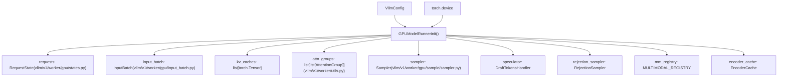
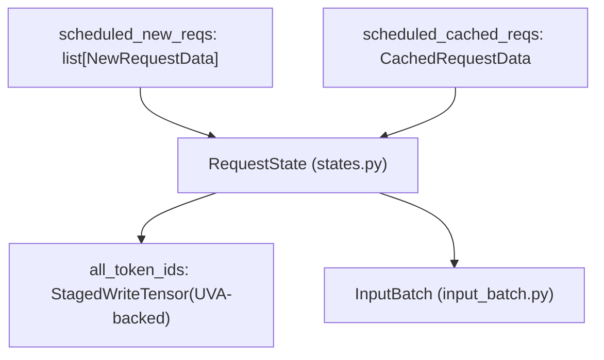

# GPU 模型运行器 (GPUModelRunner)

相关源文件

-   [.buildkite/test\_areas/model\_runner\_v2.yaml](https://github.com/vllm-project/vllm/blob/7cc302dd/.buildkite/test_areas/model_runner_v2.yaml)
-   [tests/v1/ec\_connector/integration/test\_epd\_correctness.py](https://github.com/vllm-project/vllm/blob/7cc302dd/tests/v1/ec_connector/integration/test_epd_correctness.py)
-   [tests/v1/executor/test\_executor.py](https://github.com/vllm-project/vllm/blob/7cc302dd/tests/v1/executor/test_executor.py)
-   [tests/v1/kv\_connector/unit/test\_output\_aggregator.py](https://github.com/vllm-project/vllm/blob/7cc302dd/tests/v1/kv_connector/unit/test_output_aggregator.py)
-   [tests/v1/spec\_decode/test\_synthetic\_rejection\_sampler\_utils.py](https://github.com/vllm-project/vllm/blob/7cc302dd/tests/v1/spec_decode/test_synthetic_rejection_sampler_utils.py)
-   [tests/v1/worker/test\_gpu\_input\_batch.py](https://github.com/vllm-project/vllm/blob/7cc302dd/tests/v1/worker/test_gpu_input_batch.py)
-   [tests/v1/worker/test\_gpu\_model\_runner.py](https://github.com/vllm-project/vllm/blob/7cc302dd/tests/v1/worker/test_gpu_model_runner.py)
-   [vllm/v1/core/sched/output.py](https://github.com/vllm-project/vllm/blob/7cc302dd/vllm/v1/core/sched/output.py)
-   [vllm/v1/executor/abstract.py](https://github.com/vllm-project/vllm/blob/7cc302dd/vllm/v1/executor/abstract.py)
-   [vllm/v1/executor/multiproc\_executor.py](https://github.com/vllm-project/vllm/blob/7cc302dd/vllm/v1/executor/multiproc_executor.py)
-   [vllm/v1/executor/ray\_executor.py](https://github.com/vllm-project/vllm/blob/7cc302dd/vllm/v1/executor/ray_executor.py)
-   [vllm/v1/executor/ray\_utils.py](https://github.com/vllm-project/vllm/blob/7cc302dd/vllm/v1/executor/ray_utils.py)
-   [vllm/v1/executor/uniproc\_executor.py](https://github.com/vllm-project/vllm/blob/7cc302dd/vllm/v1/executor/uniproc_executor.py)
-   [vllm/v1/worker/block\_table.py](https://github.com/vllm-project/vllm/blob/7cc302dd/vllm/v1/worker/block_table.py)
-   [vllm/v1/worker/gpu/async\_utils.py](https://github.com/vllm-project/vllm/blob/7cc302dd/vllm/v1/worker/gpu/async_utils.py)
-   [vllm/v1/worker/gpu/attn\_utils.py](https://github.com/vllm-project/vllm/blob/7cc302dd/vllm/v1/worker/gpu/attn_utils.py)
-   [vllm/v1/worker/gpu/block\_table.py](https://github.com/vllm-project/vllm/blob/7cc302dd/vllm/v1/worker/gpu/block_table.py)
-   [vllm/v1/worker/gpu/buffer\_utils.py](https://github.com/vllm-project/vllm/blob/7cc302dd/vllm/v1/worker/gpu/buffer_utils.py)
-   [vllm/v1/worker/gpu/cudagraph\_utils.py](https://github.com/vllm-project/vllm/blob/7cc302dd/vllm/v1/worker/gpu/cudagraph_utils.py)
-   [vllm/v1/worker/gpu/dp\_utils.py](https://github.com/vllm-project/vllm/blob/7cc302dd/vllm/v1/worker/gpu/dp_utils.py)
-   [vllm/v1/worker/gpu/input\_batch.py](https://github.com/vllm-project/vllm/blob/7cc302dd/vllm/v1/worker/gpu/input_batch.py)
-   [vllm/v1/worker/gpu/mm/\_\_init\_\_.py](https://github.com/vllm-project/vllm/blob/7cc302dd/vllm/v1/worker/gpu/mm/__init__.py)
-   [vllm/v1/worker/gpu/mm/encoder\_cache.py](https://github.com/vllm-project/vllm/blob/7cc302dd/vllm/v1/worker/gpu/mm/encoder_cache.py)
-   [vllm/v1/worker/gpu/mm/encoder\_runner.py](https://github.com/vllm-project/vllm/blob/7cc302dd/vllm/v1/worker/gpu/mm/encoder_runner.py)
-   [vllm/v1/worker/gpu/mm/rope.py](https://github.com/vllm-project/vllm/blob/7cc302dd/vllm/v1/worker/gpu/mm/rope.py)
-   [vllm/v1/worker/gpu/model\_runner.py](https://github.com/vllm-project/vllm/blob/7cc302dd/vllm/v1/worker/gpu/model_runner.py)
-   [vllm/v1/worker/gpu/sample/\_\_init\_\_.py](https://github.com/vllm-project/vllm/blob/7cc302dd/vllm/v1/worker/gpu/sample/__init__.py)
-   [vllm/v1/worker/gpu/sample/bad\_words.py](https://github.com/vllm-project/vllm/blob/7cc302dd/vllm/v1/worker/gpu/sample/bad_words.py)
-   [vllm/v1/worker/gpu/sample/gumbel.py](https://github.com/vllm-project/vllm/blob/7cc302dd/vllm/v1/worker/gpu/sample/gumbel.py)
-   [vllm/v1/worker/gpu/sample/logit\_bias.py](https://github.com/vllm-project/vllm/blob/7cc302dd/vllm/v1/worker/gpu/sample/logit_bias.py)
-   [vllm/v1/worker/gpu/sample/logprob.py](https://github.com/vllm-project/vllm/blob/7cc302dd/vllm/v1/worker/gpu/sample/logprob.py)
-   [vllm/v1/worker/gpu/sample/min\_p.py](https://github.com/vllm-project/vllm/blob/7cc302dd/vllm/v1/worker/gpu/sample/min_p.py)
-   [vllm/v1/worker/gpu/sample/output.py](https://github.com/vllm-project/vllm/blob/7cc302dd/vllm/v1/worker/gpu/sample/output.py)
-   [vllm/v1/worker/gpu/sample/penalties.py](https://github.com/vllm-project/vllm/blob/7cc302dd/vllm/v1/worker/gpu/sample/penalties.py)
-   [vllm/v1/worker/gpu/sample/prompt\_logprob.py](https://github.com/vllm-project/vllm/blob/7cc302dd/vllm/v1/worker/gpu/sample/prompt_logprob.py)
-   [vllm/v1/worker/gpu/sample/sampler.py](https://github.com/vllm-project/vllm/blob/7cc302dd/vllm/v1/worker/gpu/sample/sampler.py)
-   [vllm/v1/worker/gpu/sample/states.py](https://github.com/vllm-project/vllm/blob/7cc302dd/vllm/v1/worker/gpu/sample/states.py)
-   [vllm/v1/worker/gpu/spec\_decode/eagle/cudagraph.py](https://github.com/vllm-project/vllm/blob/7cc302dd/vllm/v1/worker/gpu/spec_decode/eagle/cudagraph.py)
-   [vllm/v1/worker/gpu/spec\_decode/eagle/speculator.py](https://github.com/vllm-project/vllm/blob/7cc302dd/vllm/v1/worker/gpu/spec_decode/eagle/speculator.py)
-   [vllm/v1/worker/gpu/spec\_decode/rejection\_sampler.py](https://github.com/vllm-project/vllm/blob/7cc302dd/vllm/v1/worker/gpu/spec_decode/rejection_sampler.py)
-   [vllm/v1/worker/gpu/spec\_decode/synthetic\_rejection\_sampler\_utils.py](https://github.com/vllm-project/vllm/blob/7cc302dd/vllm/v1/worker/gpu/spec_decode/synthetic_rejection_sampler_utils.py)
-   [vllm/v1/worker/gpu/states.py](https://github.com/vllm-project/vllm/blob/7cc302dd/vllm/v1/worker/gpu/states.py)
-   [vllm/v1/worker/gpu/structured\_outputs.py](https://github.com/vllm-project/vllm/blob/7cc302dd/vllm/v1/worker/gpu/structured_outputs.py)
-   [vllm/v1/worker/gpu\_input\_batch.py](https://github.com/vllm-project/vllm/blob/7cc302dd/vllm/v1/worker/gpu_input_batch.py)
-   [vllm/v1/worker/gpu\_model\_runner.py](https://github.com/vllm-project/vllm/blob/7cc302dd/vllm/v1/worker/gpu_model_runner.py)
-   [vllm/v1/worker/gpu\_worker.py](https://github.com/vllm-project/vllm/blob/7cc302dd/vllm/v1/worker/gpu_worker.py)
-   [vllm/v1/worker/utils.py](https://github.com/vllm-project/vllm/blob/7cc302dd/vllm/v1/worker/utils.py)
-   [vllm/v1/worker/worker\_base.py](https://github.com/vllm-project/vllm/blob/7cc302dd/vllm/v1/worker/worker_base.py)

## 概览 (Overview)

`GPUModelRunner` 是 vLLM v1 引擎中负责 GPU 上模型执行的核心协调器。它编排语言模型的前向传播，管理请求状态，协调 KV 缓存分配，并与采样子系统集成以生成令牌。该组件连接了调度层（决定运行什么）与实际模型执行，处理所有 GPU 特定操作，包括注意力元数据准备、批次组装和 token 采样。

vLLM 提供两种实现：稳定版 `gpu_model_runner` 和实验性的模型运行器 V2（位于 `vllm/v1/worker/gpu/`）。V2 架构强调模块化，将状态管理、输入缓冲和推测解码等职责拆分到专门的类中。

**范围**：本页涵盖 `GPUModelRunner` 类及其在协调模型执行中的作用。关于以下内容：

-   请求调度和资源分配，请参阅 [3.3 调度器与资源分配](https://github.com/vllm-project/vllm/blob/7cc302dd/3.3 Scheduler and Resource Allocation)
-   KV 缓存内存管理，请参阅 [3.4 KV 缓存管理与前缀缓存](https://github.com/vllm-project/vllm/blob/7cc302dd/3.4 KV Cache Management and Prefix Caching)
-   采样与令牌生成，请参阅 [4.4 采样与令牌生成](https://github.com/vllm-project/vllm/blob/7cc302dd/4.4 Sampling and Token Generation)
-   工作进程初始化与设备管理，请参阅 [4.2 Worker 和 Executor 架构](https://github.com/vllm-project/vllm/blob/7cc302dd/4.2-worker-and-executor-architecture)
-   详细的批次状态管理，请参阅 [4.3 InputBatch 和请求状态管理](https://github.com/vllm-project/vllm/blob/7cc302dd/4.3-inputbatch-and-request-state-management)

来源：[vllm/v1/worker/gpu_model_runner.py102-173](https://github.com/vllm-project/vllm/blob/7cc302dd/vllm/v1/worker/gpu_model_runner.py#L102-L173) [vllm/v1/worker/gpu/model\_runner.py103-173](https://github.com/vllm-project/vllm/blob/7cc302dd/vllm/v1/worker/gpu/model_runner.py#L103-L173)

## 架构与核心组件 (Architecture and Core Components)

`GPUModelRunner` 作为 vLLM GPU 推理流水线中的执行协调器。它使用 `VllmConfig` 初始化，并维护所有活跃请求的状态、管理输入批次，并与多个子系统协同工作。

### 组件关系图 (Component Relationship Diagram)

此图将概念上的“执行协调器”与 `vllm/v1/worker/gpu/` 目录中的具体代码实体对应起来。

来源：[vllm/v1/worker/gpu/model\_runner.py103-216](https://github.com/vllm-project/vllm/blob/7cc302dd/vllm/v1/worker/gpu/model_runner.py#L103-L216) [vllm/v1/worker/gpu/states.py9-77](https://github.com/vllm-project/vllm/blob/7cc302dd/vllm/v1/worker/gpu/states.py#L9-L77) [vllm/v1/worker/gpu/input\_batch.py36-80](https://github.com/vllm-project/vllm/blob/7cc302dd/vllm/v1/worker/gpu/input_batch.py#L36-L80)

### 关键数据结构 (Key Data Structures)

运行器维护若干关键数据结构以跟踪请求生命周期：

| 数据结构 | 类型 | 用途 |
| --- | --- | --- |
| `requests` | `RequestState` | 使用基于 UVA 的张量管理每个请求的元数据、`all_token_ids` 和 `num_computed_tokens`，以节省 GPU 显存。 |
| `input_batch` | `InputBatch` | 封装当前迭代的 GPU 张量，如 `input_ids`、`positions` 和 `query_start_loc`。 |
| `kv_caches` | `list[torch.Tensor]` | 为模型各层之间的 KV 缓存存储分配的物理内存缓冲区。 |
| `attn_groups` | `list[list[AttentionGroup]]` | 将共享相同注意力后端和元数据构建器的层进行分组。 |
| `sampler` | `Sampler` | 编排 logits 处理和令牌选择。 |

来源：[vllm/v1/worker/gpu/model\_runner.py103-173](https://github.com/vllm-project/vllm/blob/7cc302dd/vllm/v1/worker/gpu/model_runner.py#L103-L173) [vllm/v1/worker/gpu/states.py9-77](https://github.com/vllm-project/vllm/blob/7cc302dd/vllm/v1/worker/gpu/states.py#L9-L77) [vllm/v1/worker/gpu/input\_batch.py36-80](https://github.com/vllm-project/vllm/blob/7cc302dd/vllm/v1/worker/gpu/input_batch.py#L36-L80)

## 请求生命周期与状态管理 (Request Lifecycle and State Management)

`GPUModelRunner` 处理 CPU 调度器与 GPU 执行状态之间的同步。在模型运行器 V2 中，`RequestState` 使用 `StagedWriteTensor` 和 `UvaBackedTensor` 高效管理大型令牌缓冲区（例如 `all_token_ids`），而不会耗尽 GPU VRAM。

### 请求状态映射 (Request State Mapping)

下图展示了来自核心引擎的 `SchedulerOutput` 如何转换为驻留在 GPU 上的状态。

来源：[vllm/v1/worker/gpu/states.py30-53](https://github.com/vllm-project/vllm/blob/7cc302dd/vllm/v1/worker/gpu/states.py#L30-L53) [vllm/v1/worker/gpu/model\_runner.py343-424](https://github.com/vllm-project/vllm/blob/7cc302dd/vllm/v1/worker/gpu/model_runner.py#L343-L424) [vllm/v1/core/sched/output.py179-195](https://github.com/vllm-project/vllm/blob/7cc302dd/vllm/v1/core/sched/output.py#L179-L195)

### 状态更新流程 (State Update Process)

`_update_states()` 方法在 `GPUModelRunner` 中分几个步骤处理 `SchedulerOutput`：

1.  **移除已完成请求**：调用 `remove_request`，释放 `RequestState` 池中的索引。
2.  **添加新请求**：为首次调度的请求初始化状态。
3.  **更新缓存请求**：更新现有请求的令牌计数和块 ID。
4.  **应用分阶段写入**：将 CPU 侧更新一次性同步到 UVA/GPU 内存中。

来源：[vllm/v1/worker/gpu/model\_runner.py343-424](https://github.com/vllm-project/vllm/blob/7cc302dd/vllm/v1/worker/gpu/model_runner.py#L343-L424) [vllm/v1/worker/gpu/states.py105-110](https://github.com/vllm-project/vllm/blob/7cc302dd/vllm/v1/worker/gpu/states.py#L105-L110)

## 模型执行流水线 (Model Execution Pipeline)

执行流水线通过结构化的元数据准备和模型调用序列，将输入数据转换为生成的令牌。

### 执行顺序 (Execution Sequence)

> **[Mermaid sequence]**
> *(图表结构无法解析)*

来源：[vllm/v1/worker/gpu/model\_runner.py228-341](https://github.com/vllm-project/vllm/blob/7cc302dd/vllm/v1/worker/gpu/model_runner.py#L228-L341) [vllm/v1/worker/gpu/input\_batch.py186-207](https://github.com/vllm-project/vllm/blob/7cc302dd/vllm/v1/worker/gpu/input_batch.py#L186-L207) [vllm/v1/executor/multiproc\_executor.py61](https://github.com/vllm-project/vllm/blob/7cc302dd/vllm/v1/executor/multiproc_executor.py#L61-L61)

### 输入准备内核 (Input Preparation Kernels)

为避免昂贵的 CPU-GPU 拷贝，vLLM 使用 Triton 内核来准备模型输入。例如，`prepare_prefill_inputs` 会将令牌 ID 直接从基于 UVA 的 `all_token_ids` 缓冲区复制到前向传播所使用的 GPU `input_ids` 缓冲区中。

来源：[vllm/v1/worker/gpu/input\_batch.py149-185](https://github.com/vllm-project/vllm/blob/7cc302dd/vllm/v1/worker/gpu/input_batch.py#L149-L185)

## 注意力与 KV 缓存集成 (Attention and KV Cache Integration)

运行器管理多个 `AttentionGroup` 对象，这些对象按其注意力需求对模型层进行分类（例如自注意力与交叉注意力）。

### 注意力元数据准备 (Attention Metadata Preparation)

`_prepare_attn_metadata` 负责编排后端特定元数据的创建（例如用于 FlashAttention 或 FlashInfer）。它利用 `AttentionMetadataBuilder` 构建基于块的注意力所需的张量。

来源：[vllm/v1/worker/gpu/model\_runner.py461-512](https://github.com/vllm-project/vllm/blob/7cc302dd/vllm/v1/worker/gpu/model_runner.py#L461-L512) [vllm/v1/worker/gpu/attn\_utils.py32-90](https://github.com/vllm-project/vllm/blob/7cc302dd/vllm/v1/worker/gpu/attn_utils.py#L32-L90)

### KV 缓存分配 (KV Cache Allocation)

物理 KV 缓存以一组原始张量的形式分配，随后会根据所选 `AttentionBackend` 的要求对其进行重塑和重排。

来源：[vllm/v1/worker/gpu/attn\_utils.py93-170](https://github.com/vllm-project/vllm/blob/7cc302dd/vllm/v1/worker/gpu/attn_utils.py#L93-L170) [vllm/v1/worker/utils.py80-188](https://github.com/vllm-project/vllm/blob/7cc302dd/vllm/v1/worker/utils.py#L80-L188)

## CUDA 图管理 (CUDA Graph Management)

为尽量减少小批次下的内核启动开销，`GPUModelRunner` 使用 `CudaGraphManager`。

1.  **捕获**：运行器会为特定批次大小（例如 2 的幂）记录模型前向传播的执行。
2.  **重放**：在运行时，如果当前批次大小与某个已捕获的图匹配，运行器会更新固定输入缓冲区并触发图重放，而不是执行标准的 eager 模式。

来源：[vllm/v1/worker/gpu/cudagraph\_utils.py80-183](https://github.com/vllm-project/vllm/blob/7cc302dd/vllm/v1/worker/gpu/cudagraph_utils.py#L80-L183) [vllm/v1/worker/gpu/model\_runner.py228-341](https://github.com/vllm-project/vllm/blob/7cc302dd/vllm/v1/worker/gpu/model_runner.py#L228-L341)

## 性能优化 (Performance Optimizations)

| 优化 | 实现 | 来源 |
| --- | --- | --- |
| **UVA 缓冲区** | `RequestState` 使用统一虚拟寻址 (UVA) 存储 token ID，以节省 GPU 显存。 | [vllm/v1/worker/gpu/states.py33-38](https://github.com/vllm-project/vllm/blob/7cc302dd/vllm/v1/worker/gpu/states.py#L33-L38) |
| **Triton 清零** | `KVBlockZeroer` 使用 Triton 内核高效清零新分配的 KV 块。 | [vllm/v1/worker/utils.py80-188](https://github.com/vllm-project/vllm/blob/7cc302dd/vllm/v1/worker/utils.py#L80-L188) |
| **异步调度** | `logits` 存储在 `AsyncOutput` 中，使引擎能够将采样与下一次迭代的调度重叠执行。 | [vllm/v1/worker/gpu/model\_runner.py321-325](https://github.com/vllm-project/vllm/blob/7cc302dd/vllm/v1/worker/gpu/model_runner.py#L321-L325) |
| **分阶段写入** | CPU 到 GPU 的更新会汇总后在每次迭代中一次性应用。 | [vllm/v1/worker/gpu/states.py105-110](https://github.com/vllm-project/vllm/blob/7cc302dd/vllm/v1/worker/gpu/states.py#L105-L110) |

来源：[vllm/v1/worker/gpu/states.py33-110](https://github.com/vllm-project/vllm/blob/7cc302dd/vllm/v1/worker/gpu/states.py#L33-L110) [vllm/v1/worker/utils.py80-188](https://github.com/vllm-project/vllm/blob/7cc302dd/vllm/v1/worker/utils.py#L80-L188) [vllm/v1/worker/gpu/model\_runner.py321-325](https://github.com/vllm-project/vllm/blob/7cc302dd/vllm/v1/worker/gpu/model_runner.py#L321-L325)
