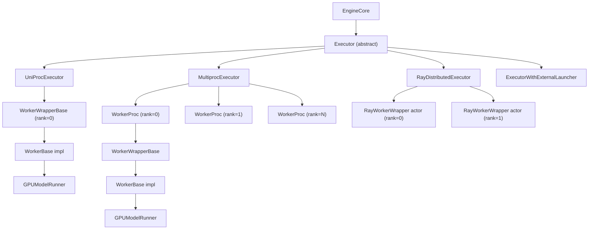
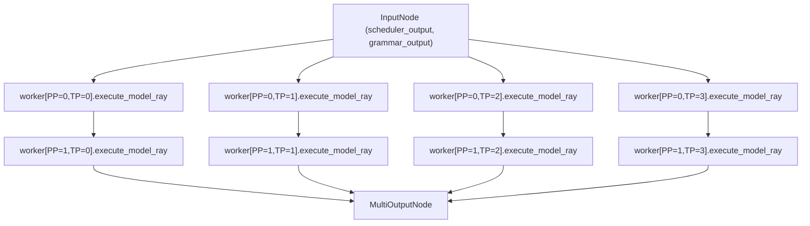
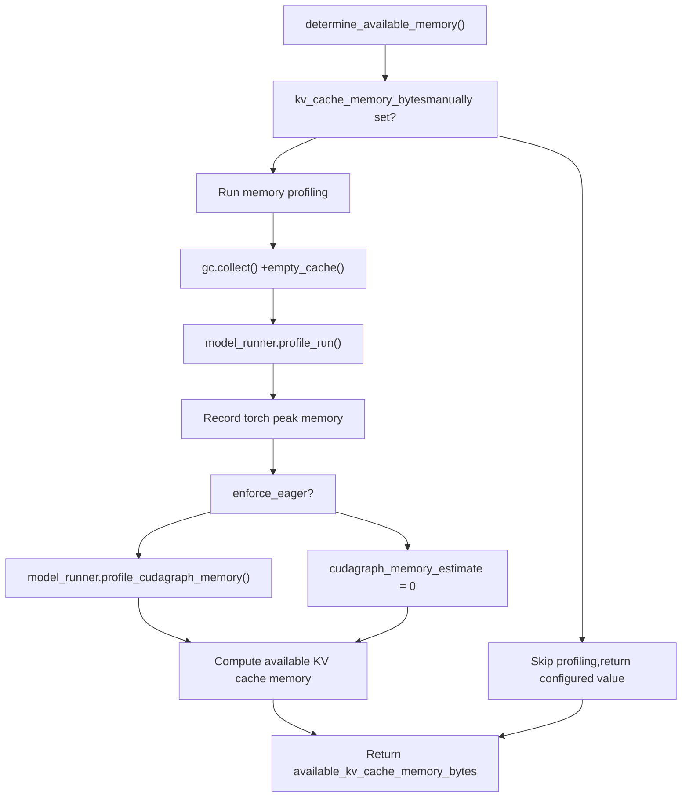
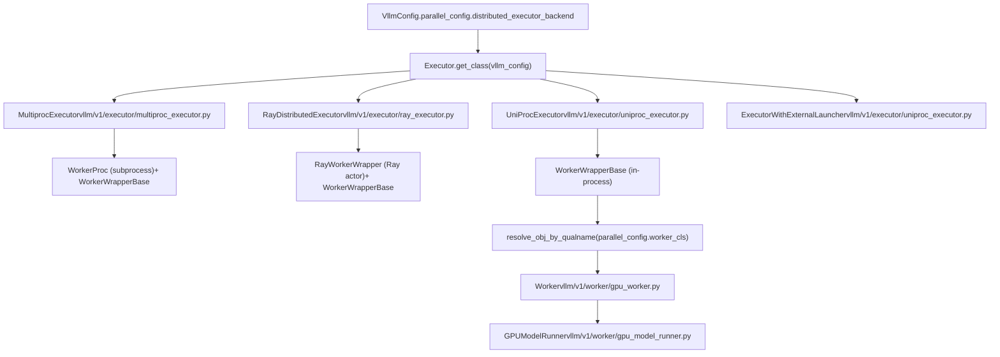

# Worker 和 Executor 架构 (Worker and Executor Architecture)

相关源文件

-   [tests/test\_ray\_env.py](https://github.com/vllm-project/vllm/blob/7cc302dd/tests/test_ray_env.py)
-   [tests/v1/executor/test\_executor.py](https://github.com/vllm-project/vllm/blob/7cc302dd/tests/v1/executor/test_executor.py)
-   [tests/v1/kv\_connector/unit/test\_output\_aggregator.py](https://github.com/vllm-project/vllm/blob/7cc302dd/tests/v1/kv_connector/unit/test_output_aggregator.py)
-   [tests/v1/worker/test\_gpu\_input\_batch.py](https://github.com/vllm-project/vllm/blob/7cc302dd/tests/v1/worker/test_gpu_input_batch.py)
-   [tests/v1/worker/test\_gpu\_model\_runner.py](https://github.com/vllm-project/vllm/blob/7cc302dd/tests/v1/worker/test_gpu_model_runner.py)
-   [vllm/ray/ray\_env.py](https://github.com/vllm-project/vllm/blob/7cc302dd/vllm/ray/ray_env.py)
-   [vllm/utils/\_\_init\_\_.py](https://github.com/vllm-project/vllm/blob/7cc302dd/vllm/utils/__init__.py)
-   [vllm/v1/core/sched/output.py](https://github.com/vllm-project/vllm/blob/7cc302dd/vllm/v1/core/sched/output.py)
-   [vllm/v1/executor/abstract.py](https://github.com/vllm-project/vllm/blob/7cc302dd/vllm/v1/executor/abstract.py)
-   [vllm/v1/executor/multiproc\_executor.py](https://github.com/vllm-project/vllm/blob/7cc302dd/vllm/v1/executor/multiproc_executor.py)
-   [vllm/v1/executor/ray\_executor.py](https://github.com/vllm-project/vllm/blob/7cc302dd/vllm/v1/executor/ray_executor.py)
-   [vllm/v1/executor/ray\_utils.py](https://github.com/vllm-project/vllm/blob/7cc302dd/vllm/v1/executor/ray_utils.py)
-   [vllm/v1/executor/uniproc\_executor.py](https://github.com/vllm-project/vllm/blob/7cc302dd/vllm/v1/executor/uniproc_executor.py)
-   [vllm/v1/worker/block\_table.py](https://github.com/vllm-project/vllm/blob/7cc302dd/vllm/v1/worker/block_table.py)
-   [vllm/v1/worker/gpu\_input\_batch.py](https://github.com/vllm-project/vllm/blob/7cc302dd/vllm/v1/worker/gpu_input_batch.py)
-   [vllm/v1/worker/gpu\_model\_runner.py](https://github.com/vllm-project/vllm/blob/7cc302dd/vllm/v1/worker/gpu_model_runner.py)
-   [vllm/v1/worker/gpu\_worker.py](https://github.com/vllm-project/vllm/blob/7cc302dd/vllm/v1/worker/gpu_worker.py)
-   [vllm/v1/worker/utils.py](https://github.com/vllm-project/vllm/blob/7cc302dd/vllm/v1/worker/utils.py)
-   [vllm/v1/worker/worker\_base.py](https://github.com/vllm-project/vllm/blob/7cc302dd/vllm/v1/worker/worker_base.py)

## 目的与范围 (Purpose and Scope)

本页面记录了 vLLM 用来跨硬件管理模型执行的两层抽象：**Executor** 层和 **Worker** 层。

-   **Executor** 由引擎核心 (engine core) 拥有，并充当一个或多个工作进程 (worker processes) 或 actor 的代理。它负责进程生命周期、RPC 调度和结果收集。
-   **Worker** 运行在每个进程（或 Ray actor）内部，负责设备初始化、模型加载、KV 缓存分配以及执行单个前向传播 (forward passes)。

本页面重点介绍 `vllm/v1/executor/` 和 `vllm/v1/worker/` 下的 v1 实现。关于 `EngineCore` 如何持有和调用 executor，请参阅 [3.1](https://github.com/vllm-project/vllm/blob/7cc302dd/3.1)。关于 `GPUModelRunner` 在 worker 内部做什么，请参阅 [4.1](https://github.com/vllm-project/vllm/blob/7cc302dd/4.1)。关于分布式通信原语（`MessageQueue`、`ShmRingBuffer`），请参阅 [9.2](https://github.com/vllm-project/vllm/blob/7cc302dd/9.2)。

---

## 架构概览 (Architecture Overview)

**两层模型执行架构**


来源：[vllm/v1/executor/abstract.py36-86](https://github.com/vllm-project/vllm/blob/7cc302dd/vllm/v1/executor/abstract.py#L36-L86) [vllm/v1/executor/uniproc\_executor.py25-130](https://github.com/vllm-project/vllm/blob/7cc302dd/vllm/v1/executor/uniproc_executor.py#L25-L130) [vllm/v1/executor/multiproc\_executor.py96-225](https://github.com/vllm-project/vllm/blob/7cc302dd/vllm/v1/executor/multiproc_executor.py#L96-L225) [vllm/v1/executor/ray\_executor.py62-98](https://github.com/vllm-project/vllm/blob/7cc302dd/vllm/v1/executor/ray_executor.py#L62-L98)

---

## Executor 抽象 (The Executor Abstraction)

`Executor` ([vllm/v1/executor/abstract.py36-355](https://github.com/vllm-project/vllm/blob/7cc302dd/vllm/v1/executor/abstract.py#L36-L355)) 是所有 executor 实现的抽象基类。它由引擎核心实例化，并提供统一的接口，无论使用了多少个 GPU 或进程。

### 后端选择 (Backend Selection)

`Executor.get_class(vllm_config)` 读取 `parallel_config.distributed_executor_backend` 来选取具体的类：

| `distributed_executor_backend` | Executor 类 | 文件 |
| --- | --- | --- |
| `"mp"` | `MultiprocExecutor` | `vllm/v1/executor/multiproc_executor.py` |
| `"ray"` | `RayDistributedExecutor` | `vllm/v1/executor/ray_executor.py` |
| `"uni"` | `UniProcExecutor` | `vllm/v1/executor/uniproc_executor.py` |
| `"external_launcher"` | `ExecutorWithExternalLauncher` | `vllm/v1/executor/uniproc_executor.py` |
| 继承 `Executor` 的 `type` | 直接使用该类 | — |
| 完全限定字符串 (fully-qualified string) | 通过 `resolve_obj_by_qualname` 解析 | — |

来源：[vllm/v1/executor/abstract.py46-86](https://github.com/vllm-project/vllm/blob/7cc302dd/vllm/v1/executor/abstract.py#L46-L86)

### `collective_rpc` 接口 (The `collective_rpc` Interface)

所有 executor 实现都暴露了 `collective_rpc()`，这是核心的 RPC 原语。它向所有 worker 发送方法调用（按名称或序列化的可调用对象），并带有位置参数和关键字参数，然后收集结果列表。

```
collective_rpc(method, timeout, args, kwargs, non_block) -> list[result] | Future[list[result]]
```
更高级别的方法（`execute_model`、`sample_tokens`、`initialize_from_config` 等）在基类中通过委托给 `collective_rpc` 来实现。子类仅在需要额外行为（例如处理流水线并行 Pipeline Parallelism）时才重写它们。

来源：[vllm/v1/executor/abstract.py141-191](https://github.com/vllm-project/vllm/blob/7cc302dd/vllm/v1/executor/abstract.py#L141-L191) [vllm/v1/executor/abstract.py112-126](https://github.com/vllm-project/vllm/blob/7cc302dd/vllm/v1/executor/abstract.py#L112-L126)

### Executor 关键方法 (Key Executor Methods)

| 方法 | 描述 |
| --- | --- |
| `_init_executor()` | 抽象方法。创建并初始化 worker 进程/actor。 |
| `initialize_from_config(kv_cache_configs)` | 向 worker 发送 KV 缓存配置，然后触发 `compile_or_warm_up_model`。 |
| `determine_available_memory()` | 在所有 worker 上调用 `determine_available_memory`；返回字节列表。 |
| `get_kv_cache_specs()` | 返回来自所有 worker 的 KV 缓存规格 (spec) 字典。 |
| `execute_model(scheduler_output)` | 向所有 worker 调度一次前向传播。 |
| `sample_tokens(grammar_output)` | 在延迟的 `execute_model` 之后调度采样。 |
| `sleep(level)` / `wake_up(tags)` | 卸载/恢复 GPU 显存（休眠模式）。 |
| `check_health()` | 抽象方法。如果 executor 不健康则抛出异常。 |
| `shutdown()` | 终止所有 worker。 |

来源：[vllm/v1/executor/abstract.py108-354](https://github.com/vllm-project/vllm/blob/7cc302dd/vllm/v1/executor/abstract.py#L108-L354)

---

## UniProcExecutor

[vllm/v1/executor/uniproc\_executor.py25-129](https://github.com/vllm-project/vllm/blob/7cc302dd/vllm/v1/executor/uniproc_executor.py#L25-L129)

`UniProcExecutor` **在与引擎核心相同的进程中**运行单个 worker。它是单 GPU 部署的默认选择（即 TP=1, PP=1, 且不需要独立进程的数据并行）。

-   `_init_executor()` 创建一个 `WorkerWrapperBase(rpc_rank=0)`，在进程内调用 `init_worker()`、`init_device()` 和 `load_model()`。
-   `collective_rpc()` 直接调用 `run_method(self.driver_worker, method, args, kwargs)` —— 无 IPC（进程间通信），无序列化。
-   当 `async_scheduling=True` 时，会创建一个 `ThreadPoolExecutor`（单线程）来在主线程之外处理 `AsyncModelRunnerOutput.get_output()`，从而允许调度器与输出处理重叠。

### ExecutorWithExternalLauncher

[vllm/v1/executor/uniproc\_executor.py131-177](https://github.com/vllm-project/vllm/blob/7cc302dd/vllm/v1/executor/uniproc_executor.py#L131-L177)

`UniProcExecutor` 的一个子类，专为与 `torchrun` 兼容的启动器设计。不是由一个 executor 管理多个 worker，而是用户为每个 GPU 启动一个引擎。`distributed_init_method` 设置为 `"env://"`，rank/local\_rank 从 `RANK` 和 `LOCAL_RANK` 中读取。`determine_available_memory()` 在所有 rank 之间执行 `all_reduce` 以选取最小可用显存。

---

## MultiprocExecutor

[vllm/v1/executor/multiproc\_executor.py96-466](https://github.com/vllm-project/vllm/blob/7cc302dd/vllm/v1/executor/multiproc_executor.py#L96-L466)

`MultiprocExecutor` 为每个本地 GPU 派生一个 worker **子进程 (subprocess)**。当 `distributed_executor_backend="mp"` 时选择它，它是单节点多 GPU 推理的标准后端。

### Worker 进程派生 (Worker Process Spawning)

**MultiprocExecutor 初始化序列**

> **[Mermaid sequence]**
> *(图表结构无法解析)*

来源：[vllm/v1/executor/multiproc\_executor.py103-225](https://github.com/vllm-project/vllm/blob/7cc302dd/vllm/v1/executor/multiproc_executor.py#L103-L225) [vllm/v1/executor/multiproc\_executor.py603-643](https://github.com/vllm-project/vllm/blob/7cc302dd/vllm/v1/executor/multiproc_executor.py#L603-L643) [vllm/v1/executor/multiproc\_executor.py712-810](https://github.com/vllm-project/vllm/blob/7cc302dd/vllm/v1/executor/multiproc_executor.py#L712-L810)

### 消息队列通信 (Message Queue Communication)

每个 worker 子进程都有两个 `MessageQueue` 通道（由共享内存支持）：

| 队列 | 方向 | 目的 |
| --- | --- | --- |
| `rpc_broadcast_mq` | Executor → 所有 worker | 广播 `(method, args, kwargs, output_rank)` |
| `worker_response_mq` | Worker → Executor | 为每次调用返回 `(status, result)` |

executor 的 `collective_rpc()` [vllm/v1/executor/multiproc\_executor.py317-389](https://github.com/vllm-project/vllm/blob/7cc302dd/vllm/v1/executor/multiproc_executor.py#L317-L389) 在 `rpc_broadcast_mq` 上将调用元组入队，然后从相应的 `response_mqs` 中出队。当 `non_block=True` 时，它返回一个 `FutureWrapper` 并延迟读取直到调用 `.result()`。

Worker 运行 `worker_busy_loop()`（在文件中未完全显示，但在 [vllm/v1/executor/multiproc\_executor.py791](https://github.com/vllm-project/vllm/blob/7cc302dd/vllm/v1/executor/multiproc_executor.py#L791-L791) 处调用），该循环持续从 `rpc_broadcast_mq` 读取并调度 `execute_method()`。

### Worker 进程句柄 (Worker Process Handles)

| 类 | 目的 |
| --- | --- |
| `UnreadyWorkerProcHandle` | 在 READY 信号之前持有 `proc`、`rank`、`ready_pipe`、`death_writer` |
| `WorkerProcHandle` | 在 ready 之后持有 `proc`、`rank`、`worker_response_mq`、`peer_worker_response_mqs`、`death_writer` |

**死亡管道 (death pipe)** (`death_writer`/`death_reader`) 是一个单向管道。父进程保持 `death_writer` 开启。当父进程退出时，子进程在 `death_reader` 上收到 `EOFError` 并干净地关闭。

### 健康监测 (Health Monitoring)

一个守护线程 (`MultiprocWorkerMonitor`) 监视进程哨兵 (sentinels)。如果任何 worker 意外退出，它会记录错误，调用 `shutdown()`，并触发注册的 `FailureCallback` 以通知引擎核心。

来源：[vllm/v1/executor/multiproc\_executor.py246-283](https://github.com/vllm-project/vllm/blob/7cc302dd/vllm/v1/executor/multiproc_executor.py#L246-L283)

### 输出 Rank (Output Rank)

只有一个 worker 产生 `ModelRunnerOutput` —— 最后一个 PP 阶段的第一个 TP worker。executor 将其计算为：

```
output_rank = world_size - tensor_parallel_size * prefill_context_parallel_size
```
来源：[vllm/v1/executor/multiproc\_executor.py451-465](https://github.com/vllm-project/vllm/blob/7cc302dd/vllm/v1/executor/multiproc_executor.py#L451-L465)

---

## RayDistributedExecutor

[vllm/v1/executor/ray\_executor.py62-643](https://github.com/vllm-project/vllm/blob/7cc302dd/vllm/v1/executor/ray_executor.py#L62-L643)

`RayDistributedExecutor` 将 worker 分布为 **Ray actors**，并使用 Ray 的 Compiled DAG（编译的有向无环图）作为执行路径。

### Worker 创建 (Worker Creation)

`_init_workers_ray()` [vllm/v1/executor/ray\_executor.py160-398](https://github.com/vllm-project/vllm/blob/7cc302dd/vllm/v1/executor/ray_executor.py#L160-L398):

1.  从 Ray 放置组 (placement group)（或从 `VLLM_RAY_BUNDLE_INDICES`）解析 `bundle_indices`。
2.  创建 `RayWorkerWrapper` 远程 actor，每个 rank 一个。
3.  从所有 actor 收集 IP 地址并对 worker 重新排序，使 driver 所在的节点排在首位。
4.  通过 `collective_rpc("adjust_rank", ...)` 调整 rank 以考虑重新排序。
5.  通过 `collective_rpc("update_environment_variables", ...)` 在每个节点设置 `CUDA_VISIBLE_DEVICES` 环境变量。
6.  在所有 actor 上调用 `collective_rpc("init_worker", ...)`、`"init_device"`、`"load_model"`。
7.  将 worker 组织到 `pp_tp_workers[pp_rank][tp_rank]` 中用于 DAG 构建。

### 通过 Compiled DAG 执行 (Execution via Compiled DAG)

在第一次 `execute_model()` 调用时，`_compiled_ray_dag()` 构建一个 Ray `CompiledDAG` [vllm/v1/executor/ray\_executor.py542-635](https://github.com/vllm-project/vllm/blob/7cc302dd/vllm/v1/executor/ray_executor.py#L542-L635)。它链接 PP 阶段，使得中间张量 (intermediate tensors) 从 PP rank 0 流向 PP rank N−1。然后通过 `forward_dag.execute((scheduler_output, grammar_output))` 调用该 DAG。

**PP=2, TP=4 的 Ray DAG 结构：**


来源：[vllm/v1/executor/ray\_executor.py542-635](https://github.com/vllm-project/vllm/blob/7cc302dd/vllm/v1/executor/ray_executor.py#L542-L635)

### Ray 中的 `collective_rpc` (`collective_rpc` in Ray)

`collective_rpc()` [vllm/v1/executor/ray\_executor.py485-510](https://github.com/vllm-project/vllm/blob/7cc302dd/vllm/v1/executor/ray_executor.py#L485-L510) 在每个 actor 上使用 `worker.execute_method.remote(method, *args, **kwargs)`，并使用 `ray.get()` 阻塞。方法可调用对象使用 `cloudpickle` 序列化。

---

## Worker 抽象 (The Worker Abstraction)

### `WorkerBase`

[vllm/v1/worker/worker\_base.py34-176](https://github.com/vllm-project/vllm/blob/7cc302dd/vllm/v1/worker/worker_base.py#L34-L176)

`WorkerBase` 定义了每个 worker 实现必须满足的接口。它存储分解后的 `VllmConfig` 字段和 rank 信息。

**WorkerBase 接口摘要**

| 方法 | 描述 |
| --- | --- |
| `init_device()` | 设置设备（CUDA 上下文、分布式进程组、model runner）。 |
| `load_model()` | 将模型权重加载到设备上。 |
| `determine_available_memory()` | 分析峰值显存使用；返回可用于 KV 缓存的字节数。 |
| `get_kv_cache_spec()` | 返回用于 KV 缓存规划的 `dict[str, KVCacheSpec]`。 |
| `initialize_from_config(kv_cache_config)` | 分配 KV 缓存并初始化 KV 传输连接器 (transfer connectors)。 |
| `compile_or_warm_up_model()` | 捕获 CUDA 图，运行预热迭代。返回以秒为单位的编译时间。 |
| `execute_model(scheduler_output)` | 运行模型前向传播。返回 `ModelRunnerOutput` 或 `None`。 |
| `sample_tokens(grammar_output)` | 如果 `execute_model` 返回 `None`，则完成采样。 |
| `check_health()` | 活跃度检查。 |
| `shutdown()` | 释放资源。 |
| `add_lora / remove_lora / pin_lora / list_loras` | LoRA 适配器管理。 |
| `sleep(level) / wake_up(tags)` | GPU 显存休眠/唤醒（仅在 `Worker` 中）。 |

来源：[vllm/v1/worker/worker\_base.py34-176](https://github.com/vllm-project/vllm/blob/7cc302dd/vllm/v1/worker/worker_base.py#L34-L176)

### `WorkerWrapperBase`

[vllm/v1/worker/worker\_base.py179-372](https://github.com/vllm-project/vllm/blob/7cc302dd/vllm/v1/worker/worker_base.py#L179-L372)

`WorkerWrapperBase` 位于 executor 和 `WorkerBase` 实例之间。其职责包括：

1.  **延迟初始化 (Lazy initialization)** —— 仅在调用 `init_worker()` 时创建 `WorkerBase` 子类。
2.  **Worker 类解析 (Worker class resolution)** —— 读取 `parallel_config.worker_cls`（完全限定类名字符串）并通过 `resolve_obj_by_qualname` 实例化。
3.  **Worker 扩展注入 (Worker extension injection)** —— 如果设置了 `parallel_config.worker_extension_cls`，则动态将该类插入 `worker_class.__bases__` 以在不使用子类的情况下添加方法。
4.  **多模态共享内存缓存 (Multimodal shared memory cache)** —— 如果已配置，则设置 `mm_receiver_cache`，用于在转发给 worker 之前从共享内存读取多模态特征。
5.  **方法调度 (Method dispatch)** —— `execute_method(method, *args, **kwargs)` 调用 `run_method(self, ...)`。`__getattr__` 透明地将任何未处理的属性委托给 `self.worker`。

```
WorkerWrapperBase
  .rpc_rank         — executor worker 列表中的索引
  .global_rank      — 分布式组中的全局 rank
  .worker           — 实际的 WorkerBase 实例（在 init_worker() 之后设置）
  .mm_receiver_cache — 可选的多模态特征缓存
```
来源：[vllm/v1/worker/worker\_base.py179-372](https://github.com/vllm-project/vllm/blob/7cc302dd/vllm/v1/worker/worker_base.py#L179-L372)

---

## GPU Worker (`Worker`)

[vllm/v1/worker/gpu\_worker.py105-900](https://github.com/vllm-project/vllm/blob/7cc302dd/vllm/v1/worker/gpu_worker.py#L105-L900)

`Worker` 是用于 GPU 执行的 `WorkerBase` 具体实现。它在分布式环境、`GPUModelRunner` 以及可选功能（如休眠模式和权重传输）之间进行协调。

### 类关系 (Class Relationships)

**GPU worker 层中的代码实体**


来源：[vllm/v1/worker/gpu\_worker.py105-156](https://github.com/vllm-project/vllm/blob/7cc302dd/vllm/v1/worker/gpu_worker.py#L105-L156) [vllm/v1/worker/worker\_base.py34-80](https://github.com/vllm-project/vllm/blob/7cc302dd/vllm/v1/worker/worker_base.py#L34-L80) [vllm/v1/worker/worker\_base.py179-215](https://github.com/vllm-project/vllm/blob/7cc302dd/vllm/v1/worker/worker_base.py#L179-L215)

### 初始化生命周期 (Initialization Lifecycle)

**Worker 初始化序列**

> **[Mermaid sequence]**
> *(图表结构无法解析)*

来源：[vllm/v1/worker/gpu\_worker.py222-315](https://github.com/vllm-project/vllm/blob/7cc302dd/vllm/v1/worker/gpu_worker.py#L222-L315) [vllm/v1/worker/gpu\_worker.py319-343](https://github.com/vllm-project/vllm/blob/7cc302dd/vllm/v1/worker/gpu_worker.py#L319-L343) [vllm/v1/worker/gpu\_worker.py350-429](https://github.com/vllm-project/vllm/blob/7cc302dd/vllm/v1/worker/gpu_worker.py#L350-L429) [vllm/v1/worker/gpu\_worker.py462-481](https://github.com/vllm-project/vllm/blob/7cc302dd/vllm/v1/worker/gpu_worker.py#L462-L481) [vllm/v1/worker/gpu\_worker.py482-608](https://github.com/vllm-project/vllm/blob/7cc302dd/vllm/v1/worker/gpu_worker.py#L482-L608)

### 设备初始化 (`init_device()`)

`init_device()` 方法设置 GPU 设备并初始化分布式环境。

**设备初始化序列：**

> **[Mermaid sequence]**
> *(图表结构无法解析)*

来源：[vllm/v1/worker/gpu\_worker.py222-293](https://github.com/vllm-project/vllm/blob/7cc302dd/vllm/v1/worker/gpu_worker.py#L222-L293) [vllm/v1/worker/gpu\_worker.py64-65](https://github.com/vllm-project/vllm/blob/7cc302dd/vllm/v1/worker/gpu_worker.py#L64-L65) [vllm/v1/worker/workspace.py60](https://github.com/vllm-project/vllm/blob/7cc302dd/vllm/v1/worker/workspace.py#L60-L60)

### 显存分析 (`determine_available_memory()`)

`determine_available_memory()` 方法分析模型的显存使用情况，以确定可以为 KV 缓存分配多少显存。

**显存分析流程：**


来源：[vllm/v1/worker/gpu\_worker.py353-502](https://github.com/vllm-project/vllm/blob/7cc302dd/vllm/v1/worker/gpu_worker.py#L353-L502) [vllm/utils/mem\_utils.py48](https://github.com/vllm-project/vllm/blob/7cc302dd/vllm/utils/mem_utils.py#L48-L48)

### 模型执行与流水线并行 (Model Execution and Pipeline Parallelism)

`execute_model()` 方法编排一次前向传播。行为根据流水线并行 (PP) rank 而有所不同。

**流水线并行执行流：**

> **[Mermaid sequence]**
> *(图表结构无法解析)*

来源：[vllm/v1/worker/gpu\_worker.py668-757](https://github.com/vllm-project/vllm/blob/7cc302dd/vllm/v1/worker/gpu_worker.py#L668-L757) [vllm/v1/worker/gpu\_worker.py73-102](https://github.com/vllm-project/vllm/blob/7cc302dd/vllm/v1/worker/gpu_worker.py#L73-L102)

### 显存管理：休眠与唤醒 (Memory Management: Sleep and Wake)

当 `enable_sleep_mode=True` 时，Worker 支持通过 `sleep()` 和 `wake_up()` 进行 GPU 显存卸载。

**休眠级别 (Sleep levels)：**

| 级别 | 卸载内容 | 保留内容 | 使用场景 |
| --- | --- | --- | --- |
| 1 | 模型权重 | KV 缓存、缓冲区 | 在模型之间快速切换 |
| 2 | 模型权重、KV 缓存 | 不可卸载的缓冲区（保存到 CPU） | 深度休眠 |

来源：[vllm/v1/worker/gpu\_worker.py157-203](https://github.com/vllm-project/vllm/blob/7cc302dd/vllm/v1/worker/gpu_worker.py#L157-L203)

---

## Executor 选择与初始化流程 (Executor Selection and Initialization Flow)

**Executor 后端选择与 worker 类解析**


来源：[vllm/v1/executor/abstract.py46-86](https://github.com/vllm-project/vllm/blob/7cc302dd/vllm/v1/executor/abstract.py#L46-L86) [vllm/v1/worker/worker\_base.py251-314](https://github.com/vllm-project/vllm/blob/7cc302dd/vllm/v1/worker/worker_base.py#L251-L314)

---

## 摘要参考表 (Summary Reference Table)

| 类 | 文件 | 角色 |
| --- | --- | --- |
| `Executor` | `vllm/v1/executor/abstract.py` | 抽象基类；拥有 `collective_rpc` 契约 |
| `UniProcExecutor` | `vllm/v1/executor/uniproc_executor.py` | 进程内单 worker 执行 |
| `ExecutorWithExternalLauncher` | `vllm/v1/executor/uniproc_executor.py` | 每个 torchrun 启动的引擎一个 worker |
| `MultiprocExecutor` | `vllm/v1/executor/multiproc_executor.py` | 通过分叉子进程 + `MessageQueue` 实现多 GPU |
| `RayDistributedExecutor` | `vllm/v1/executor/ray_executor.py` | 通过 Ray actor + 编译的 DAG 实现多 GPU/多节点 |
| `WorkerProc` | `vllm/v1/executor/multiproc_executor.py` | 在子进程中运行一个 worker；拥有忙循环 |
| `WorkerProcHandle` | `vllm/v1/executor/multiproc_executor.py` | Executor 对就绪的 `WorkerProc` 的句柄 |
| `WorkerBase` | `vllm/v1/worker/worker_base.py` | 抽象 worker 接口 |
| `WorkerWrapperBase` | `vllm/v1/worker/worker_base.py` | 延迟初始化、方法调度、扩展注入 |
| `Worker` | `vllm/v1/worker/gpu_worker.py` | 具体 GPU worker；驱动 `GPUModelRunner` |
| `AsyncIntermediateTensors` | `vllm/v1/worker/gpu_worker.py` | 延迟同步的 PP 中间张量 |
