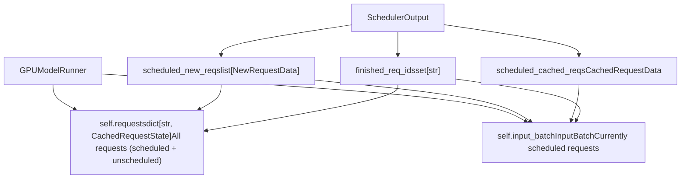
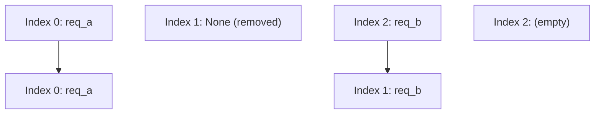
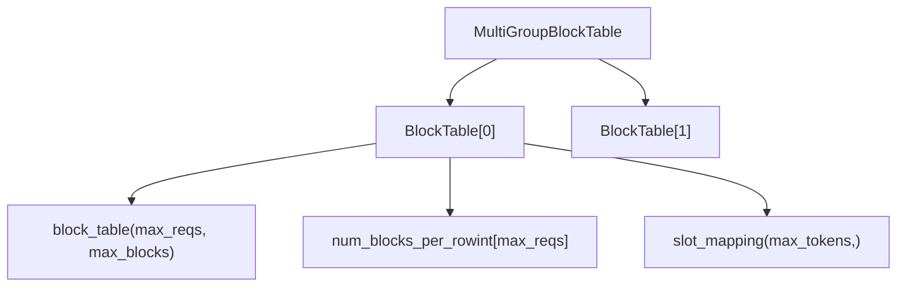
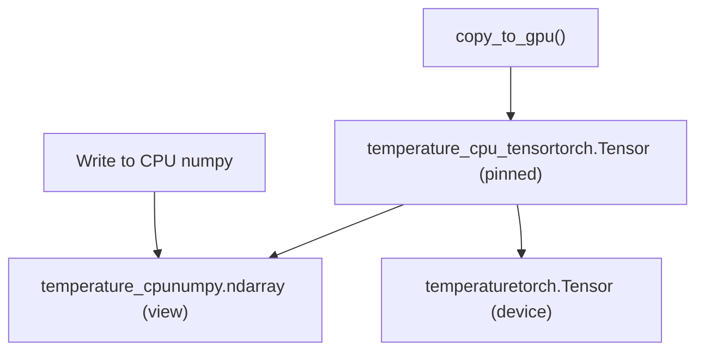
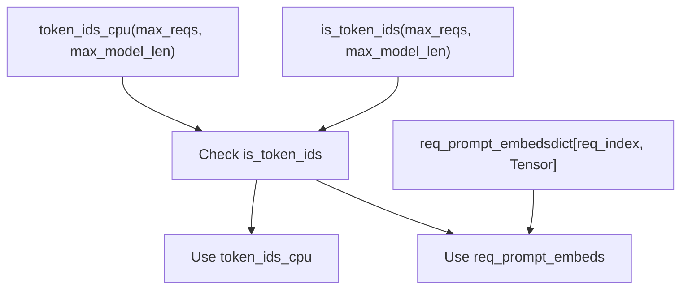

# InputBatch 和请求状态管理 (InputBatch and Request State Management)

相关源文件

-   [.buildkite/test\_areas/model\_runner\_v2.yaml](https://github.com/vllm-project/vllm/blob/7cc302dd/.buildkite/test_areas/model_runner_v2.yaml)
-   [tests/v1/ec\_connector/integration/test\_epd\_correctness.py](https://github.com/vllm-project/vllm/blob/7cc302dd/tests/v1/ec_connector/integration/test_epd_correctness.py)
-   [tests/v1/executor/test\_executor.py](https://github.com/vllm-project/vllm/blob/7cc302dd/tests/v1/executor/test_executor.py)
-   [tests/v1/kv\_connector/unit/test\_output\_aggregator.py](https://github.com/vllm-project/vllm/blob/7cc302dd/tests/v1/kv_connector/unit/test_output_aggregator.py)
-   [tests/v1/spec\_decode/test\_synthetic\_rejection\_sampler\_utils.py](https://github.com/vllm-project/vllm/blob/7cc302dd/tests/v1/spec_decode/test_synthetic_rejection_sampler_utils.py)
-   [tests/v1/worker/test\_gpu\_input\_batch.py](https://github.com/vllm-project/vllm/blob/7cc302dd/tests/v1/worker/test_gpu_input_batch.py)
-   [tests/v1/worker/test\_gpu\_model\_runner.py](https://github.com/vllm-project/vllm/blob/7cc302dd/tests/v1/worker/test_gpu_model_runner.py)
-   [vllm/v1/core/sched/output.py](https://github.com/vllm-project/vllm/blob/7cc302dd/vllm/v1/core/sched/output.py)
-   [vllm/v1/executor/abstract.py](https://github.com/vllm-project/vllm/blob/7cc302dd/vllm/v1/executor/abstract.py)
-   [vllm/v1/executor/multiproc\_executor.py](https://github.com/vllm-project/vllm/blob/7cc302dd/vllm/v1/executor/multiproc_executor.py)
-   [vllm/v1/executor/ray\_executor.py](https://github.com/vllm-project/vllm/blob/7cc302dd/vllm/v1/executor/ray_executor.py)
-   [vllm/v1/executor/ray\_utils.py](https://github.com/vllm-project/vllm/blob/7cc302dd/vllm/v1/executor/ray_utils.py)
-   [vllm/v1/executor/uniproc\_executor.py](https://github.com/vllm-project/vllm/blob/7cc302dd/vllm/v1/executor/uniproc_executor.py)
-   [vllm/v1/worker/block\_table.py](https://github.com/vllm-project/vllm/blob/7cc302dd/vllm/v1/worker/block_table.py)
-   [vllm/v1/worker/gpu/async\_utils.py](https://github.com/vllm-project/vllm/blob/7cc302dd/vllm/v1/worker/gpu/async_utils.py)
-   [vllm/v1/worker/gpu/attn\_utils.py](https://github.com/vllm-project/vllm/blob/7cc302dd/vllm/v1/worker/gpu/attn_utils.py)
-   [vllm/v1/worker/gpu/block\_table.py](https://github.com/vllm-project/vllm/blob/7cc302dd/vllm/v1/worker/gpu/block_table.py)
-   [vllm/v1/worker/gpu/buffer\_utils.py](https://github.com/vllm-project/vllm/blob/7cc302dd/vllm/v1/worker/gpu/buffer_utils.py)
-   [vllm/v1/worker/gpu/cudagraph\_utils.py](https://github.com/vllm-project/vllm/blob/7cc302dd/vllm/v1/worker/gpu/cudagraph_utils.py)
-   [vllm/v1/worker/gpu/dp\_utils.py](https://github.com/vllm-project/vllm/blob/7cc302dd/vllm/v1/worker/gpu/dp_utils.py)
-   [vllm/v1/worker/gpu/input\_batch.py](https://github.com/vllm-project/vllm/blob/7cc302dd/vllm/v1/worker/gpu/input_batch.py)
-   [vllm/v1/worker/gpu/mm/\_\_init\_\_.py](https://github.com/vllm-project/vllm/blob/7cc302dd/vllm/v1/worker/gpu/mm/__init__.py)
-   [vllm/v1/worker/gpu/mm/encoder\_cache.py](https://github.com/vllm-project/vllm/blob/7cc302dd/vllm/v1/worker/gpu/mm/encoder_cache.py)
-   [vllm/v1/worker/gpu/mm/encoder\_runner.py](https://github.com/vllm-project/vllm/blob/7cc302dd/vllm/v1/worker/gpu/mm/encoder_runner.py)
-   [vllm/v1/worker/gpu/mm/rope.py](https://github.com/vllm-project/vllm/blob/7cc302dd/vllm/v1/worker/gpu/mm/rope.py)
-   [vllm/v1/worker/gpu/model\_runner.py](https://github.com/vllm-project/vllm/blob/7cc302dd/vllm/v1/worker/gpu/model_runner.py)
-   [vllm/v1/worker/gpu/sample/\_\_init\_\_.py](https://github.com/vllm-project/vllm/blob/7cc302dd/vllm/v1/worker/gpu/sample/__init__.py)
-   [vllm/v1/worker/gpu/sample/bad\_words.py](https://github.com/vllm-project/vllm/blob/7cc302dd/vllm/v1/worker/gpu/sample/bad_words.py)
-   [vllm/v1/worker/gpu/sample/gumbel.py](https://github.com/vllm-project/vllm/blob/7cc302dd/vllm/v1/worker/gpu/sample/gumbel.py)
-   [vllm/v1/worker/gpu/sample/logit\_bias.py](https://github.com/vllm-project/vllm/blob/7cc302dd/vllm/v1/worker/gpu/sample/logit_bias.py)
-   [vllm/v1/worker/gpu/sample/logprob.py](https://github.com/vllm-project/vllm/blob/7cc302dd/vllm/v1/worker/gpu/sample/logprob.py)
-   [vllm/v1/worker/gpu/sample/min\_p.py](https://github.com/vllm-project/vllm/blob/7cc302dd/vllm/v1/worker/gpu/sample/min_p.py)
-   [vllm/v1/worker/gpu/sample/output.py](https://github.com/vllm-project/vllm/blob/7cc302dd/vllm/v1/worker/gpu/sample/output.py)
-   [vllm/v1/worker/gpu/sample/penalties.py](https://github.com/vllm-project/vllm/blob/7cc302dd/vllm/v1/worker/gpu/sample/penalties.py)
-   [vllm/v1/worker/gpu/sample/prompt\_logprob.py](https://github.com/vllm-project/vllm/blob/7cc302dd/vllm/v1/worker/gpu/sample/prompt_logprob.py)
-   [vllm/v1/worker/gpu/sample/sampler.py](https://github.com/vllm-project/vllm/blob/7cc302dd/vllm/v1/worker/gpu/sample/sampler.py)
-   [vllm/v1/worker/gpu/sample/states.py](https://github.com/vllm-project/vllm/blob/7cc302dd/vllm/v1/worker/gpu/sample/states.py)
-   [vllm/v1/worker/gpu/spec\_decode/eagle/cudagraph.py](https://github.com/vllm-project/vllm/blob/7cc302dd/vllm/v1/worker/gpu/spec_decode/eagle/cudagraph.py)
-   [vllm/v1/worker/gpu/spec\_decode/eagle/speculator.py](https://github.com/vllm-project/vllm/blob/7cc302dd/vllm/v1/worker/gpu/spec_decode/eagle/speculator.py)
-   [vllm/v1/worker/gpu/spec\_decode/rejection\_sampler.py](https://github.com/vllm-project/vllm/blob/7cc302dd/vllm/v1/worker/gpu/spec_decode/rejection_sampler.py)
-   [vllm/v1/worker/gpu/spec\_decode/synthetic\_rejection\_sampler\_utils.py](https://github.com/vllm-project/vllm/blob/7cc302dd/vllm/v1/worker/gpu/spec_decode/synthetic_rejection_sampler_utils.py)
-   [vllm/v1/worker/gpu/states.py](https://github.com/vllm-project/vllm/blob/7cc302dd/vllm/v1/worker/gpu/states.py)
-   [vllm/v1/worker/gpu/structured\_outputs.py](https://github.com/vllm-project/vllm/blob/7cc302dd/vllm/v1/worker/gpu/structured_outputs.py)
-   [vllm/v1/worker/gpu\_input\_batch.py](https://github.com/vllm-project/vllm/blob/7cc302dd/vllm/v1/worker/gpu_input_batch.py)
-   [vllm/v1/worker/gpu\_model\_runner.py](https://github.com/vllm-project/vllm/blob/7cc302dd/vllm/v1/worker/gpu_model_runner.py)
-   [vllm/v1/worker/gpu\_worker.py](https://github.com/vllm-project/vllm/blob/7cc302dd/vllm/v1/worker/gpu_worker.py)
-   [vllm/v1/worker/utils.py](https://github.com/vllm-project/vllm/blob/7cc302dd/vllm/v1/worker/utils.py)
-   [vllm/v1/worker/worker\_base.py](https://github.com/vllm-project/vllm/blob/7cc302dd/vllm/v1/worker/worker_base.py)

本文档描述了 vLLM v1 worker 架构中的逐请求状态跟踪和批处理执行状态管理。它涵盖了用于单个请求元数据的 `CachedRequestState` 和用于管理多个请求的批处理执行状态的 `InputBatch`。

关于调度器端的请求管理和调度决策，请参阅 [调度器和资源分配 (Scheduler and Resource Allocation)](/vllm-project/vllm/3.3-scheduler-and-resource-allocation)。关于使用这些结构进行模型执行协调的信息，请参阅 [GPUModelRunner](/vllm-project/vllm/4.1-gpumodelrunner)。关于采样配置，请参阅 [采样和令牌生成 (Sampling and Token Generation)](/vllm-project/vllm/4.4-sampling-and-token-generation)。

**范围**：本页面侧重于在模型执行期间维持请求状态和批次组成的数据结构及操作。它不涵盖调度器的决策逻辑或实际的模型前向传播。

---

## 核心数据结构 (Core Data Structures)

### CachedRequestState

`CachedRequestState` 存储了跨多个执行步骤所需的所有逐请求元数据。每个请求维护自己的实例，并在其在系统中的整个生命周期内持久存在。

标题：CachedRequestState 结构

**关键字段**：

-   `req_id`: 唯一的请求标识符 [vllm/v1/worker/gpu\_input\_batch.py31](https://github.com/vllm-project/vllm/blob/7cc302dd/vllm/v1/worker/gpu_input_batch.py#L31-L31)
-   `prompt_token_ids`: 输入令牌序列（如果使用 `prompt_embeds` 则为 None） [vllm/v1/worker/gpu\_input\_batch.py32](https://github.com/vllm-project/vllm/blob/7cc302dd/vllm/v1/worker/gpu_input_batch.py#L32-L32)
-   `block_ids`: 块 ID 列表元组，每个 KV 缓存组对应一个 [vllm/v1/worker/gpu\_input\_batch.py37](https://github.com/vllm-project/vllm/blob/7cc302dd/vllm/v1/worker/gpu_input_batch.py#L37-L37)
-   `num_computed_tokens`: 模型已经处理过的令牌数量 [vllm/v1/worker/gpu\_input\_batch.py38](https://github.com/vllm-project/vllm/blob/7cc302dd/vllm/v1/worker/gpu_input_batch.py#L38-L38)
-   `output_token_ids`: 截至目前生成的令牌 [vllm/v1/worker/gpu\_input\_batch.py39](https://github.com/vllm-project/vllm/blob/7cc302dd/vllm/v1/worker/gpu_input_batch.py#L39-L39)
-   `mrope_positions`/`xdrope_positions`: 用于多模态模型的特殊位置编码 [vllm/v1/worker/gpu\_input\_batch.py41-44](https://github.com/vllm-project/vllm/blob/7cc302dd/vllm/v1/worker/gpu_input_batch.py#L41-L44)
-   `prev_num_draft_len`: 用于推测解码 (speculative decoding) 的异步调度 [vllm/v1/worker/gpu\_input\_batch.py50](https://github.com/vllm-project/vllm/blob/7cc302dd/vllm/v1/worker/gpu_input_batch.py#L50-L50)

来源：[vllm/v1/worker/gpu\_input\_batch.py29-79](https://github.com/vllm-project/vllm/blob/7cc302dd/vllm/v1/worker/gpu_input_batch.py#L29-L79)

### InputBatch

`InputBatch` 管理所有当前调度请求的批次执行状态。它同时维护 CPU 和 GPU 张量以实现高效的数据传输，并支持动态批次组成。

标题：InputBatch 组件关系

```mermaid
flowchart TD
    IB["InputBatch"]
    ReqMap["req_id_to_indexdict[str, int]"]
    ReqIDs["_req_idslist[str | None]"]
    TokenIDs["token_ids_cpu_tensor(max_num_reqs, max_model_len)"]
    IsTokenIDs["is_token_ids_tensorbool flags"]
    PromptEmbeds["req_prompt_embedsdict[int, Tensor]"]
    NumComputed["num_computed_tokens_cpu"]
    BlockTable["MultiGroupBlockTableblock_sizes, kernel_block_sizes"]
    SlotMapping["slot_mappingper-token KV slots"]
    Temperature["temperature (CPU/GPU)"]
    TopP["top_p (CPU/GPU)"]
    TopK["top_k (CPU/GPU)"]
    Penalties["frequency/presence/repetitionpenalties"]
    AllowedMask["allowed_token_ids_mask"]
    SamplingMeta["sampling_metadataSamplingMetadata"]
    PoolingMeta["pooling_params/statesfor pooling models"]
    LogitsProcs["logitsprocsLogitsProcessors"]
    BatchUpdate["batch_update_builderBatchUpdateBuilder"]
    LoRAMap["request_lora_mappingreq_index -> lora_id"]
    LoRARequests["lora_id_to_lora_request"]

    IB --> ReqMap
    IB --> ReqIDs
    IB --> TokenIDs
    IB --> IsTokenIDs
    IB --> PromptEmbeds
    IB --> BlockTable
    IB --> Temperature
    IB --> TopP
    IB --> TopK
    IB --> Penalties
    IB --> AllowedMask
    IB --> SamplingMeta
    IB --> PoolingMeta
    IB --> LogitsProcs
    IB --> BatchUpdate
    IB --> LoRAMap
    IB --> LoRARequests
```

**CPU/GPU 缓冲区模式**：大多数张量遵循同步的 CPU 和 GPU 版本，以实现 CPU 准备与 GPU 执行的重叠。

-   CPU 张量以 `_cpu_tensor` 或 `_cpu` 结尾 [vllm/v1/worker/gpu\_input\_batch.py115-150](https://github.com/vllm-project/vllm/blob/7cc302dd/vllm/v1/worker/gpu_input_batch.py#L115-L150)
-   GPU 张量存储在设备内存中 [vllm/v1/worker/gpu\_input\_batch.py166-188](https://github.com/vllm-project/vllm/blob/7cc302dd/vllm/v1/worker/gpu_input_batch.py#L166-L188)
-   显式的 `copy_to_gpu()` 调用用于同步状态 [vllm/v1/worker/gpu\_input\_batch.py1010-1033](https://github.com/vllm-project/vllm/blob/7cc302dd/vllm/v1/worker/gpu_input_batch.py#L1010-L1033)

来源：[vllm/v1/worker/gpu\_input\_batch.py81-268](https://github.com/vllm-project/vllm/blob/7cc302dd/vllm/v1/worker/gpu_input_batch.py#L81-L268)

---

## GPUModelRunner 中的请求状态管理 (Request State Management in GPUModelRunner)

`GPUModelRunner` 维护着两层请求状态：

标题：GPUModelRunner 状态协调

**权责分离 (Separation of Concerns)**：

1.  `self.requests`：所有请求状态的长期存储，由 `req_id` 索引 [vllm/v1/worker/gpu\_model\_runner.py199](https://github.com/vllm-project/vllm/blob/7cc302dd/vllm/v1/worker/gpu_model_runner.py#L199-L199)。请求即使在未调度（被抢占）时仍保留在此处。
2.  `self.input_batch`：当前执行步骤的短期批次组成 [vllm/v1/worker/gpu\_model\_runner.py200](https://github.com/vllm-project/vllm/blob/7cc302dd/vllm/v1/worker/gpu_model_runner.py#L200-L200)。
3.  `input_batch.req_id_to_index` 映射提供从请求 ID 到批次索引的 O(1) 查找 [vllm/v1/worker/gpu\_input\_batch.py109](https://github.com/vllm-project/vllm/blob/7cc302dd/vllm/v1/worker/gpu_input_batch.py#L109-L109)。

来源：[vllm/v1/worker/gpu\_model\_runner.py199-200](https://github.com/vllm-project/vllm/blob/7cc302dd/vllm/v1/worker/gpu_model_runner.py#L199-L200) [vllm/v1/worker/gpu\_input\_batch.py109](https://github.com/vllm-project/vllm/blob/7cc302dd/vllm/v1/worker/gpu_input_batch.py#L109-L109)

---

## 请求生命周期和状态转换 (Request Lifecycle and State Transitions)

### 添加新请求 (Adding New Requests)

当请求第一次被调度时，`GPUModelRunner` 会创建一个 `CachedRequestState` 并将其添加到 `InputBatch` 中。

标题：新请求添加序列

> **[Mermaid sequence]**
> *(图表结构无法解析)*

`add_request()` 操作：

1.  调用 `_register_add_request()` 来分配批次索引 [vllm/v1/worker/gpu\_input\_batch.py284](https://github.com/vllm-project/vllm/blob/7cc302dd/vllm/v1/worker/gpu_input_batch.py#L284-L284)。
2.  通过 `batch_update_builder.pop_removed()` 复用最近移除请求留下的索引 [vllm/v1/worker/gpu\_input\_batch.py274](https://github.com/vllm-project/vllm/blob/7cc302dd/vllm/v1/worker/gpu_input_batch.py#L274-L274)。
3.  将提示词 (prompt) 和输出令牌复制到 CPU 张量 [vllm/v1/worker/gpu\_input\_batch.py314-323](https://github.com/vllm-project/vllm/blob/7cc302dd/vllm/v1/worker/gpu_input_batch.py#L314-L323)。
4.  初始化采样参数（temperature, top\_p, top\_k, penalties） [vllm/v1/worker/gpu\_input\_batch.py334-386](https://github.com/vllm-project/vllm/blob/7cc302dd/vllm/v1/worker/gpu_input_batch.py#L334-L386)。

来源：[vllm/v1/worker/gpu\_input\_batch.py284-447](https://github.com/vllm-project/vllm/blob/7cc302dd/vllm/v1/worker/gpu_input_batch.py#L284-L447) [vllm/v1/worker/gpu\_model\_runner.py1327-1355](https://github.com/vllm-project/vllm/blob/7cc302dd/vllm/v1/worker/gpu_model_runner.py#L1327-L1355)

### 移除已完成的请求 (Removing Finished Requests)

标题：请求移除序列

> **[Mermaid sequence]**
> *(图表结构无法解析)*

**重要**：`remove_request()` 之后必须调用 `condense()` 来压缩批次 [vllm/v1/worker/gpu\_input\_batch.py632](https://github.com/vllm-project/vllm/blob/7cc302dd/vllm/v1/worker/gpu_input_batch.py#L632-L632)。移除的槽位 (slots) 会被暂时标记为 `None` [vllm/v1/worker/gpu\_input\_batch.py479](https://github.com/vllm-project/vllm/blob/7cc302dd/vllm/v1/worker/gpu_input_batch.py#L479-L479)。

来源：[vllm/v1/worker/gpu\_input\_batch.py475-527](https://github.com/vllm-project/vllm/blob/7cc302dd/vllm/v1/worker/gpu_input_batch.py#L475-L527) [vllm/v1/worker/gpu\_model\_runner.py1400-1407](https://github.com/vllm-project/vllm/blob/7cc302dd/vllm/v1/worker/gpu_model_runner.py#L1400-L1407)

---

## 批次状态操作 (Batch State Operations)

### 压缩 (Condensation/Compaction)

`condense()` 操作通过将活跃请求滑动到最低可用索引来填补移除请求留下的空隙 [vllm/v1/worker/gpu\_input\_batch.py632-715](https://github.com/vllm-project/vllm/blob/7cc302dd/vllm/v1/worker/gpu_input_batch.py#L632-L715)。

标题：批次压缩逻辑

**算法**：

1.  遍历 `_req_ids` 以查找 `None` 条目（空槽位） [vllm/v1/worker/gpu\_input\_batch.py641](https://github.com/vllm-project/vllm/blob/7cc302dd/vllm/v1/worker/gpu_input_batch.py#L641-L641)。
2.  对于每个空槽位，寻找下一个非 `None` 条目 [vllm/v1/worker/gpu\_input\_batch.py645](https://github.com/vllm-project/vllm/blob/7cc302dd/vllm/v1/worker/gpu_input_batch.py#L645-L645)。
3.  调用 `move_row()` 将请求向下移动 [vllm/v1/worker/gpu\_input\_batch.py650](https://github.com/vllm-project/vllm/blob/7cc302dd/vllm/v1/worker/gpu_input_batch.py#L650-L650)。
4.  更新 `req_id_to_index` 映射 [vllm/v1/worker/gpu\_input\_batch.py651](https://github.com/vllm-project/vllm/blob/7cc302dd/vllm/v1/worker/gpu_input_batch.py#L651-L651)。

来源：[vllm/v1/worker/gpu\_input\_batch.py632-715](https://github.com/vllm-project/vllm/blob/7cc302dd/vllm/v1/worker/gpu_input_batch.py#L632-L715)

---

## 块表管理 (Block Table Management)

`MultiGroupBlockTable` 管理跨多个 KV 缓存组（用于具有多种注意力类型或 KV 共享的模型）的块表 [vllm/v1/worker/block\_table.py147](https://github.com/vllm-project/vllm/blob/7cc302dd/vllm/v1/worker/block_table.py#L147-L147)。

标题：多组块表结构

**混合块大小 (Hybrid Block Sizes)**：当 KV 缓存管理器的块大小与注意力内核支持的块大小时不同，`BlockTable` 会细分这些块 [vllm/v1/worker/block\_table.py38-42](https://github.com/vllm-project/vllm/blob/7cc302dd/vllm/v1/worker/block_table.py#L38-L42)。

来源：[vllm/v1/worker/block\_table.py16-251](https://github.com/vllm-project/vllm/blob/7cc302dd/vllm/v1/worker/block_table.py#L16-L251) [vllm/v1/worker/block\_table.py253-343](https://github.com/vllm-project/vllm/blob/7cc302dd/vllm/v1/worker/block_table.py#L253-L343)

---

## 内存布局和缓冲区管理 (Memory Layout and Buffer Management)

### CPU/GPU 缓冲区同步 (CPU/GPU Buffer Synchronization)

标题：缓冲区同步策略

**设计原理 (Design Rationale)**：

-   CPU 数组允许在批次准备期间进行快速的 NumPy 操作 [vllm/v1/worker/gpu\_input\_batch.py121](https://github.com/vllm-project/vllm/blob/7cc302dd/vllm/v1/worker/gpu_input_batch.py#L121-L121)。
-   固定内存 (Pinned memory) 能够实现更快的非阻塞 GPU 传输 [vllm/v1/worker/gpu\_input\_batch.py164](https://github.com/vllm-project/vllm/blob/7cc302dd/vllm/v1/worker/gpu_input_batch.py#L164-L164)。
-   显式的 `copy_to_gpu()` 调用可以对 GPU 传输进行批处理 [vllm/v1/worker/gpu\_input\_batch.py1010](https://github.com/vllm-project/vllm/blob/7cc302dd/vllm/v1/worker/gpu_input_batch.py#L1010-L1010)。

来源：[vllm/v1/worker/gpu\_input\_batch.py160-212](https://github.com/vllm-project/vllm/blob/7cc302dd/vllm/v1/worker/gpu_input_batch.py#L160-L212) [vllm/v1/worker/gpu\_input\_batch.py1010-1033](https://github.com/vllm-project/vllm/blob/7cc302dd/vllm/v1/worker/gpu_input_batch.py#L1010-L1033)

### 令牌存储策略 (Token Storage Strategy)

令牌 ID 使用一套存储策略，以同时处理令牌 ID 和提示词嵌入 (prompt embeddings) [vllm/v1/worker/gpu\_input\_batch.py115-129](https://github.com/vllm-project/vllm/blob/7cc302dd/vllm/v1/worker/gpu_input_batch.py#L115-L129)。

标题：令牌和嵌入映射

来源：[vllm/v1/worker/gpu\_input\_batch.py115-144](https://github.com/vllm-project/vllm/blob/7cc302dd/vllm/v1/worker/gpu_input_batch.py#L115-L144) [vllm/v1/worker/gpu\_model\_runner.py1828-1920](https://github.com/vllm-project/vllm/blob/7cc302dd/vllm/v1/worker/gpu_model_runner.py#L1828-L1920)
