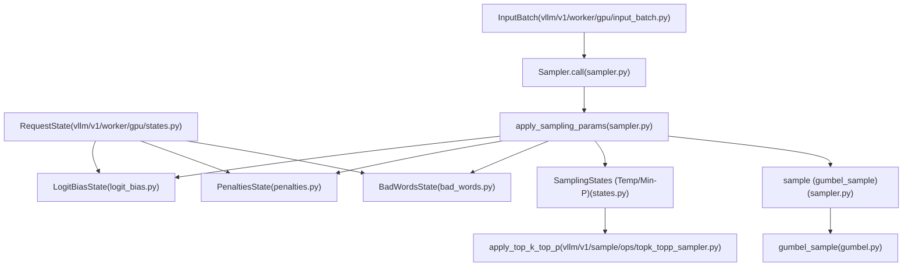
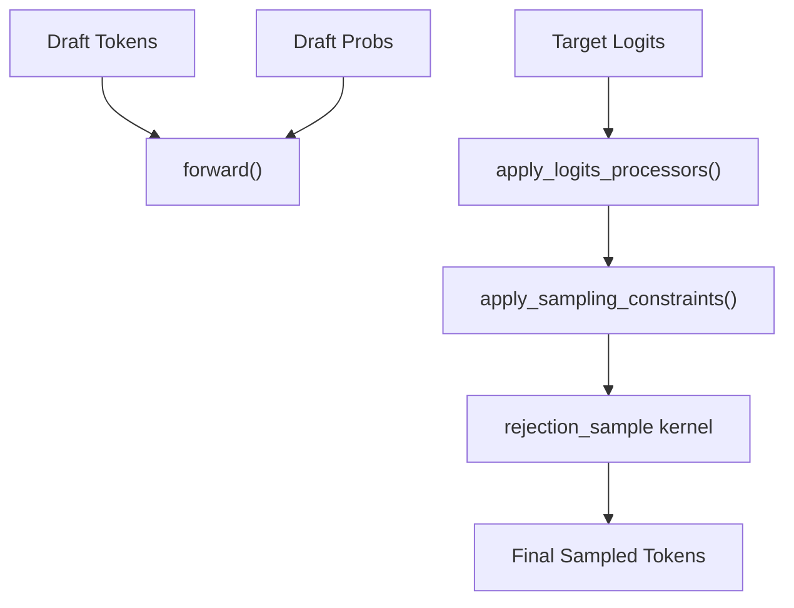

# 采样和令牌生成 (Sampling and Token Generation)

相关源文件

-   [.buildkite/test\_areas/model\_runner\_v2.yaml](https://github.com/vllm-project/vllm/blob/7cc302dd/.buildkite/test_areas/model_runner_v2.yaml)
-   [benchmarks/benchmark\_topk\_topp.py](https://github.com/vllm-project/vllm/blob/7cc302dd/benchmarks/benchmark_topk_topp.py)
-   [tests/samplers/test\_beam\_search.py](https://github.com/vllm-project/vllm/blob/7cc302dd/tests/samplers/test_beam_search.py)
-   [tests/test\_regression.py](https://github.com/vllm-project/vllm/blob/7cc302dd/tests/test_regression.py)
-   [tests/utils\_/test\_mem\_utils.py](https://github.com/vllm-project/vllm/blob/7cc302dd/tests/utils_/test_mem_utils.py)
-   [tests/v1/core/test\_async\_scheduler.py](https://github.com/vllm-project/vllm/blob/7cc302dd/tests/v1/core/test_async_scheduler.py)
-   [tests/v1/ec\_connector/integration/test\_epd\_correctness.py](https://github.com/vllm-project/vllm/blob/7cc302dd/tests/v1/ec_connector/integration/test_epd_correctness.py)
-   [tests/v1/sample/test\_logprobs.py](https://github.com/vllm-project/vllm/blob/7cc302dd/tests/v1/sample/test_logprobs.py)
-   [tests/v1/sample/test\_rejection\_sampler.py](https://github.com/vllm-project/vllm/blob/7cc302dd/tests/v1/sample/test_rejection_sampler.py)
-   [tests/v1/sample/test\_sampler.py](https://github.com/vllm-project/vllm/blob/7cc302dd/tests/v1/sample/test_sampler.py)
-   [tests/v1/sample/test\_topk\_topp\_sampler.py](https://github.com/vllm-project/vllm/blob/7cc302dd/tests/v1/sample/test_topk_topp_sampler.py)
-   [tests/v1/sample/utils.py](https://github.com/vllm-project/vllm/blob/7cc302dd/tests/v1/sample/utils.py)
-   [tests/v1/spec\_decode/test\_ngram.py](https://github.com/vllm-project/vllm/blob/7cc302dd/tests/v1/spec_decode/test_ngram.py)
-   [tests/v1/spec\_decode/test\_synthetic\_rejection\_sampler\_utils.py](https://github.com/vllm-project/vllm/blob/7cc302dd/tests/v1/spec_decode/test_synthetic_rejection_sampler_utils.py)
-   [tools/pre\_commit/check\_torch\_cuda.py](https://github.com/vllm-project/vllm/blob/7cc302dd/tools/pre_commit/check_torch_cuda.py)
-   [vllm/beam\_search.py](https://github.com/vllm-project/vllm/blob/7cc302dd/vllm/beam_search.py)
-   [vllm/v1/sample/metadata.py](https://github.com/vllm-project/vllm/blob/7cc302dd/vllm/v1/sample/metadata.py)
-   [vllm/v1/sample/ops/bad\_words.py](https://github.com/vllm-project/vllm/blob/7cc302dd/vllm/v1/sample/ops/bad_words.py)
-   [vllm/v1/sample/ops/topk\_topp\_sampler.py](https://github.com/vllm-project/vllm/blob/7cc302dd/vllm/v1/sample/ops/topk_topp_sampler.py)
-   [vllm/v1/sample/ops/topk\_topp\_triton.py](https://github.com/vllm-project/vllm/blob/7cc302dd/vllm/v1/sample/ops/topk_topp_triton.py)
-   [vllm/v1/sample/rejection\_sampler.py](https://github.com/vllm-project/vllm/blob/7cc302dd/vllm/v1/sample/rejection_sampler.py)
-   [vllm/v1/sample/sampler.py](https://github.com/vllm-project/vllm/blob/7cc302dd/vllm/v1/sample/sampler.py)
-   [vllm/v1/spec\_decode/ngram\_proposer.py](https://github.com/vllm-project/vllm/blob/7cc302dd/vllm/v1/spec_decode/ngram_proposer.py)
-   [vllm/v1/spec\_decode/suffix\_decoding.py](https://github.com/vllm-project/vllm/blob/7cc302dd/vllm/v1/spec_decode/suffix_decoding.py)
-   [vllm/v1/worker/gpu/async\_utils.py](https://github.com/vllm-project/vllm/blob/7cc302dd/vllm/v1/worker/gpu/async_utils.py)
-   [vllm/v1/worker/gpu/attn\_utils.py](https://github.com/vllm-project/vllm/blob/7cc302dd/vllm/v1/worker/gpu/attn_utils.py)
-   [vllm/v1/worker/gpu/block\_table.py](https://github.com/vllm-project/vllm/blob/7cc302dd/vllm/v1/worker/gpu/block_table.py)
-   [vllm/v1/worker/gpu/buffer\_utils.py](https://github.com/vllm-project/vllm/blob/7cc302dd/vllm/v1/worker/gpu/buffer_utils.py)
-   [vllm/v1/worker/gpu/cudagraph\_utils.py](https://github.com/vllm-project/vllm/blob/7cc302dd/vllm/v1/worker/gpu/cudagraph_utils.py)
-   [vllm/v1/worker/gpu/dp\_utils.py](https://github.com/vllm-project/vllm/blob/7cc302dd/vllm/v1/worker/gpu/dp_utils.py)
-   [vllm/v1/worker/gpu/input\_batch.py](https://github.com/vllm-project/vllm/blob/7cc302dd/vllm/v1/worker/gpu/input_batch.py)
-   [vllm/v1/worker/gpu/mm/\_\_init\_\_.py](https://github.com/vllm-project/vllm/blob/7cc302dd/vllm/v1/worker/gpu/mm/__init__.py)
-   [vllm/v1/worker/gpu/mm/encoder\_cache.py](https://github.com/vllm-project/vllm/blob/7cc302dd/vllm/v1/worker/gpu/mm/encoder_cache.py)
-   [vllm/v1/worker/gpu/mm/encoder\_runner.py](https://github.com/vllm-project/vllm/blob/7cc302dd/vllm/v1/worker/gpu/mm/encoder_runner.py)
-   [vllm/v1/worker/gpu/mm/rope.py](https://github.com/vllm-project/vllm/blob/7cc302dd/vllm/v1/worker/gpu/mm/rope.py)
-   [vllm/v1/worker/gpu/model\_runner.py](https://github.com/vllm-project/vllm/blob/7cc302dd/vllm/v1/worker/gpu/model_runner.py)
-   [vllm/v1/worker/gpu/sample/\_\_init\_\_.py](https://github.com/vllm-project/vllm/blob/7cc302dd/vllm/v1/worker/gpu/sample/__init__.py)
-   [vllm/v1/worker/gpu/sample/bad\_words.py](https://github.com/vllm-project/vllm/blob/7cc302dd/vllm/v1/worker/gpu/sample/bad_words.py)
-   [vllm/v1/worker/gpu/sample/gumbel.py](https://github.com/vllm-project/vllm/blob/7cc302dd/vllm/v1/worker/gpu/sample/gumbel.py)
-   [vllm/v1/worker/gpu/sample/logit\_bias.py](https://github.com/vllm-project/vllm/blob/7cc302dd/vllm/v1/worker/gpu/sample/logit_bias.py)
-   [vllm/v1/worker/gpu/sample/logprob.py](https://github.com/vllm-project/vllm/blob/7cc302dd/vllm/v1/worker/gpu/sample/logprob.py)
-   [vllm/v1/worker/gpu/sample/min\_p.py](https://github.com/vllm-project/vllm/blob/7cc302dd/vllm/v1/worker/gpu/sample/min_p.py)
-   [vllm/v1/worker/gpu/sample/output.py](https://github.com/vllm-project/vllm/blob/7cc302dd/vllm/v1/worker/gpu/sample/output.py)
-   [vllm/v1/worker/gpu/sample/penalties.py](https://github.com/vllm-project/vllm/blob/7cc302dd/vllm/v1/worker/gpu/sample/penalties.py)
-   [vllm/v1/worker/gpu/sample/prompt\_logprob.py](https://github.com/vllm-project/vllm/blob/7cc302dd/vllm/v1/worker/gpu/sample/prompt_logprob.py)
-   [vllm/v1/worker/gpu/sample/sampler.py](https://github.com/vllm-project/vllm/blob/7cc302dd/vllm/v1/worker/gpu/sample/sampler.py)
-   [vllm/v1/worker/gpu/sample/states.py](https://github.com/vllm-project/vllm/blob/7cc302dd/vllm/v1/worker/gpu/sample/states.py)
-   [vllm/v1/worker/gpu/spec\_decode/eagle/cudagraph.py](https://github.com/vllm-project/vllm/blob/7cc302dd/vllm/v1/worker/gpu/spec_decode/eagle/cudagraph.py)
-   [vllm/v1/worker/gpu/spec\_decode/eagle/speculator.py](https://github.com/vllm-project/vllm/blob/7cc302dd/vllm/v1/worker/gpu/spec_decode/eagle/speculator.py)
-   [vllm/v1/worker/gpu/spec\_decode/rejection\_sampler.py](https://github.com/vllm-project/vllm/blob/7cc302dd/vllm/v1/worker/gpu/spec_decode/rejection_sampler.py)
-   [vllm/v1/worker/gpu/spec\_decode/synthetic\_rejection\_sampler\_utils.py](https://github.com/vllm-project/vllm/blob/7cc302dd/vllm/v1/worker/gpu/spec_decode/synthetic_rejection_sampler_utils.py)
-   [vllm/v1/worker/gpu/states.py](https://github.com/vllm-project/vllm/blob/7cc302dd/vllm/v1/worker/gpu/states.py)
-   [vllm/v1/worker/gpu/structured\_outputs.py](https://github.com/vllm-project/vllm/blob/7cc302dd/vllm/v1/worker/gpu/structured_outputs.py)
-   [vllm/v1/worker/tpu\_input\_batch.py](https://github.com/vllm-project/vllm/blob/7cc302dd/vllm/v1/worker/tpu_input_batch.py)

## 目的与范围 (Purpose and Scope)

本文档描述了 vLLM GPU 模型执行流水线中的采样和令牌生成子系统，特别侧重于 V1 引擎架构。它涵盖了模型前向传播产生的 Logits 如何通过各种采样策略、惩罚和约束转换为离散的令牌 ID。这包括采样参数的配置、批次级采样元数据的构建、Logits 处理以及最终的令牌选择机制。

## 采样组件概览 (Sampling Components Overview)

采样子系统由几个关键组件组成，它们协同工作将模型 Logits 转换为令牌 ID。在 V1 引擎中，`Sampler` 类负责协调这些操作，通常会使用专门的状态对象和优化的内核。

### 自然语言到代码实体的映射：采样流水线 (Natural Language to Code Entity Mapping: Sampling Pipeline)

下图展示了采样阶段在逻辑上是如何映射到 V1 引擎中负责它们的具体代码实体的。

**来源：** [vllm/v1/worker/gpu/sample/sampler.py22-56](https://github.com/vllm-project/vllm/blob/7cc302dd/vllm/v1/worker/gpu/sample/sampler.py#L22-L56) [vllm/v1/worker/gpu/sample/sampler.py57-103](https://github.com/vllm-project/vllm/blob/7cc302dd/vllm/v1/worker/gpu/sample/sampler.py#L57-L103) [vllm/v1/worker/gpu/sample/sampler.py105-152](https://github.com/vllm-project/vllm/blob/7cc302dd/vllm/v1/worker/gpu/sample/sampler.py#L105-L152) [vllm/v1/worker/gpu/states.py9-77](https://github.com/vllm-project/vllm/blob/7cc302dd/vllm/v1/worker/gpu/states.py#L9-L77)

## SamplingParams 和状态管理 (SamplingParams and State Management)

每个请求通过 `SamplingParams` 指定其采样行为。在 V1 引擎中，这些参数被分阶段写入 `Sampler` 内的专门状态对象中，以实现高效的批处理。

### 状态对象 (State Objects)

-   **`SamplingStates`**：管理整个批次中的温度 (temperature)、种子 (seeds) 和 `min_p` 参数 [vllm/v1/worker/gpu/sample/states.py18](https://github.com/vllm-project/vllm/blob/7cc302dd/vllm/v1/worker/gpu/sample/states.py#L18-L18)。
-   **`PenaltiesState`**：跟踪令牌频率和出现情况，以应用重复惩罚 (repetition penalty)、频率惩罚 (frequency penalty) 和出现惩罚 (presence penalty) [vllm/v1/worker/gpu/sample/penalties.py17](https://github.com/vllm-project/vllm/blob/7cc302dd/vllm/v1/worker/gpu/sample/penalties.py#L17-L17)。
-   **`LogitBiasState`**：处理 Logit 偏置，包括 `allowed_token_ids` 和 `min_tokens` 约束 [vllm/v1/worker/gpu/sample/logit\_bias.py14](https://github.com/vllm-project/vllm/blob/7cc302dd/vllm/v1/worker/gpu/sample/logit_bias.py#L14-L14)。
-   **`BadWordsState`**：管理特定令牌序列的排除 [vllm/v1/worker/gpu/sample/bad\_words.py12](https://github.com/vllm-project/vllm/blob/7cc302dd/vllm/v1/worker/gpu/sample/bad_words.py#L12-L12)。

`Sampler` 使用分阶段写入模式：通过 `add_request` 添加参数，然后在执行前通过 `apply_staged_writes` 提交到 GPU/UVA 缓冲区 [vllm/v1/worker/gpu/sample/sampler.py43-55](https://github.com/vllm-project/vllm/blob/7cc302dd/vllm/v1/worker/gpu/sample/sampler.py#L43-L55)。

**来源：** [vllm/v1/worker/gpu/sample/sampler.py22-41](https://github.com/vllm-project/vllm/blob/7cc302dd/vllm/v1/worker/gpu/sample/sampler.py#L22-L41) [vllm/v1/worker/gpu/sample/sampler.py43-55](https://github.com/vllm-project/vllm/blob/7cc302dd/vllm/v1/worker/gpu/sample/sampler.py#L43-L55)

## Sampler 实现和执行流程 (Sampler Implementation and Execution Flow)

`vllm/v1/worker/gpu/sample/sampler.py` 中的 `Sampler` 类实现了核心的令牌选择逻辑。它在模型前向传播之后被调用。

### 执行步骤 (Execution Steps)

1.  **Logits 准备**：Logits 被复制到一个新的 FP32 张量中，用于高精度处理 [vllm/v1/worker/gpu/sample/sampler.py115](https://github.com/vllm-project/vllm/blob/7cc302dd/vllm/v1/worker/gpu/sample/sampler.py#L115-L115)。
2.  **Logit 偏置与惩罚 (Logit Bias & Penalties)**：就地调用 `apply_logit_bias`、`apply_penalties` 和 `apply_bad_words` [vllm/v1/worker/gpu/sample/sampler.py118-139](https://github.com/vllm-project/vllm/blob/7cc302dd/vllm/v1/worker/gpu/sample/sampler.py#L118-L139)。
3.  **温度与过滤 (Temperature & Filtering)**：应用温度缩放和 `min_p`，随后进行 `top_k`/`top_p` 过滤 [vllm/v1/worker/gpu/sample/sampler.py142-152](https://github.com/vllm-project/vllm/blob/7cc302dd/vllm/v1/worker/gpu/sample/sampler.py#L142-L152)。
4.  **令牌选择**：使用 `gumbel_sample` 函数根据处理后的分布选择下一个令牌 [vllm/v1/worker/gpu/sample/sampler.py173-180](https://github.com/vllm-project/vllm/blob/7cc302dd/vllm/v1/worker/gpu/sample/sampler.py#L173-L180)。
5.  **Logprobs 计算**：如果请求了，则使用处理后的 logits 计算 top-k logprobs [vllm/v1/worker/gpu/sample/sampler.py81-89](https://github.com/vllm-project/vllm/blob/7cc302dd/vllm/v1/worker/gpu/sample/sampler.py#L81-L89)。

### 后端选择 (TopKTopPSampler) (Backend Selection (TopKTopPSampler))

`TopKTopPSampler`（在 `SamplingStates` 内部使用）动态选择实现后端：

| 后端 | 条件 |
| --- | --- |
| **FlashInfer** | 在兼容的 NVIDIA GPU 上通过 `VLLM_USE_FLASHINFER_SAMPLER=1` 启用 [vllm/v1/sample/ops/topk\_topp\_sampler.py39-55](https://github.com/vllm-project/vllm/blob/7cc302dd/vllm/v1/sample/ops/topk_topp_sampler.py#L39-L55) |
| **AITER** | 如果 `aiter.ops.sampling` 可用，则在 ROCm 平台上使用 [vllm/v1/sample/ops/topk\_topp\_sampler.py73-84](https://github.com/vllm-project/vllm/blob/7cc302dd/vllm/v1/sample/ops/topk_topp_sampler.py#L73-L84) |
| **CPU 优化 (CPU Optimized)** | 针对 x86/ARM CPU 的原生实现 [vllm/v1/sample/ops/topk\_topp\_sampler.py64-72](https://github.com/vllm-project/vllm/blob/7cc302dd/vllm/v1/sample/ops/topk_topp_sampler.py#L64-L72) |
| **原生 PyTorch (Native PyTorch)** | 针对其他情况或需要中间 logprobs 时的备选方案 [vllm/v1/sample/ops/topk\_topp\_sampler.py94-114](https://github.com/vllm-project/vllm/blob/7cc302dd/vllm/v1/sample/ops/topk_topp_sampler.py#L94-L114) |

**来源：** [vllm/v1/worker/gpu/sample/sampler.py57-103](https://github.com/vllm-project/vllm/blob/7cc302dd/vllm/v1/worker/gpu/sample/sampler.py#L57-L103) [vllm/v1/sample/ops/topk\_topp\_sampler.py22-92](https://github.com/vllm-project/vllm/blob/7cc302dd/vllm/v1/sample/ops/topk_topp_sampler.py#L22-L92)

## 推测解码：RejectionSampler (Speculative Decoding: RejectionSampler)

对于推测解码 (speculative decoding)，`RejectionSampler` 实现了接受算法，以根据目标模型验证草稿令牌 (draft tokens)。

### 接受逻辑 (Acceptance Logic)

`RejectionSampler` 遵循来自 [arXiv:2211.17192](https://arxiv.org/abs/2211.17192) 的算法：

-   **接受令牌 (Accepted Tokens)**：通过草稿模型和目标模型之间的概率比率测试的令牌 [vllm/v1/sample/rejection\_sampler.py35-36](https://github.com/vllm-project/vllm/blob/7cc302dd/vllm/v1/sample/rejection_sampler.py#L35-L36)。
-   **恢复令牌 (Recovered Tokens)**：如果一个草稿令牌被拒绝，则从调整后的分布中采样一个新的令牌 [vllm/v1/sample/rejection\_sampler.py37-39](https://github.com/vllm-project/vllm/blob/7cc302dd/vllm/v1/sample/rejection_sampler.py#L37-L39)。
-   **奖励令牌 (Bonus Tokens)**：如果所有草稿令牌都被接受，则从目标模型中采样一个额外的令牌 [vllm/v1/sample/rejection\_sampler.py40-47](https://github.com/vllm-project/vllm/blob/7cc302dd/vllm/v1/sample/rejection_sampler.py#L40-L47)。

### 推测解码数据流 (Speculative Decoding Data Flow)

**来源：** [vllm/v1/sample/rejection\_sampler.py60-90](https://github.com/vllm-project/vllm/blob/7cc302dd/vllm/v1/sample/rejection_sampler.py#L60-L90) [vllm/v1/sample/rejection\_sampler.py101-150](https://github.com/vllm-project/vllm/blob/7cc302dd/vllm/v1/sample/rejection_sampler.py#L101-L150)

## Logprobs 和元数据 (Logprobs and Metadata)

### Logprobs 计算 (Logprobs Computation)

vLLM 支持为采样令牌和 top-k 候选令牌返回 logprobs。

-   **`compute_topk_logprobs`**：从 logits 张量中提取 top-k logprobs 及其索引 [vllm/v1/worker/gpu/sample/logprob.py15](https://github.com/vllm-project/vllm/blob/7cc302dd/vllm/v1/worker/gpu/sample/logprob.py#L15-L15)。
-   **模式 (Modes)**：支持 `raw_logprobs`（从原始 logits 计算）和 `processed_logprobs`（在惩罚/温度处理后计算） [vllm/v1/worker/gpu/sample/sampler.py32-34](https://github.com/vllm-project/vllm/blob/7cc302dd/vllm/v1/worker/gpu/sample/sampler.py#L32-L34)。

### 采样元数据 (Sampling Metadata)

`SamplingMetadata` 类（及其推测解码变体 `SpecDecodeMetadata`）封装了采样步骤所需的所有信息，包括扁平化批次中奖励令牌和目标 logits 的索引 [vllm/v1/sample/metadata.py1-11](https://github.com/vllm-project/vllm/blob/7cc302dd/vllm/v1/sample/metadata.py#L1-L11) [vllm/v1/spec\_decode/metadata.py19](https://github.com/vllm-project/vllm/blob/7cc302dd/vllm/v1/spec_decode/metadata.py#L19-L19)。

**来源：** [vllm/v1/worker/gpu/sample/sampler.py81-91](https://github.com/vllm-project/vllm/blob/7cc302dd/vllm/v1/worker/gpu/sample/sampler.py#L81-L91) [vllm/v1/sample/rejection\_sampler.py152-161](https://github.com/vllm-project/vllm/blob/7cc302dd/vllm/v1/sample/rejection_sampler.py#L152-L161)
