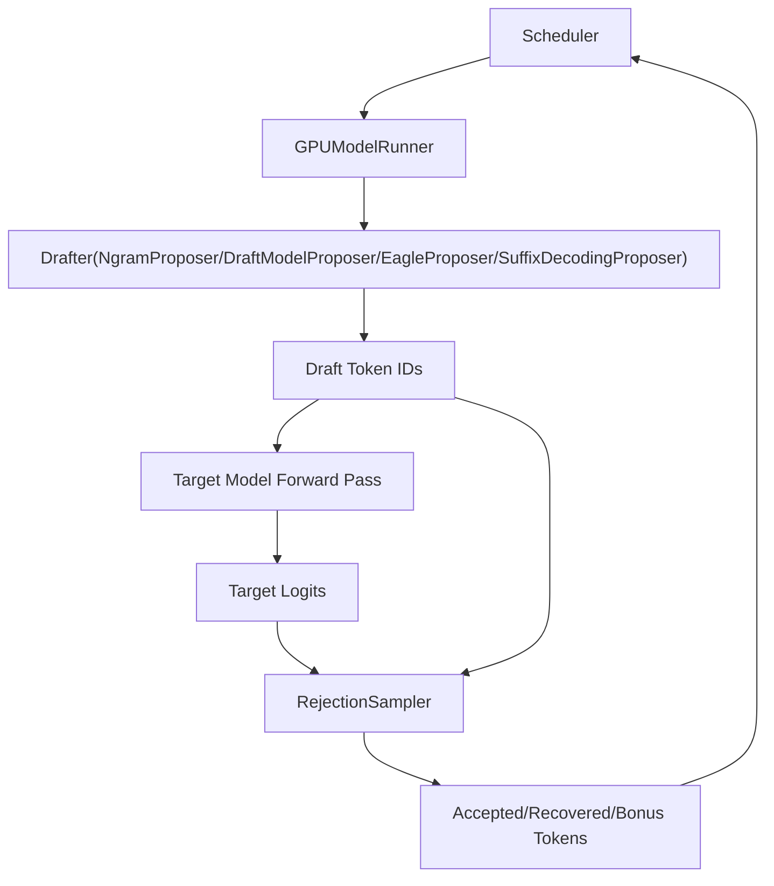
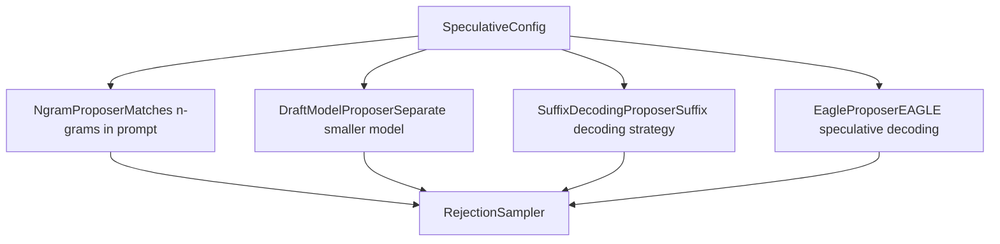
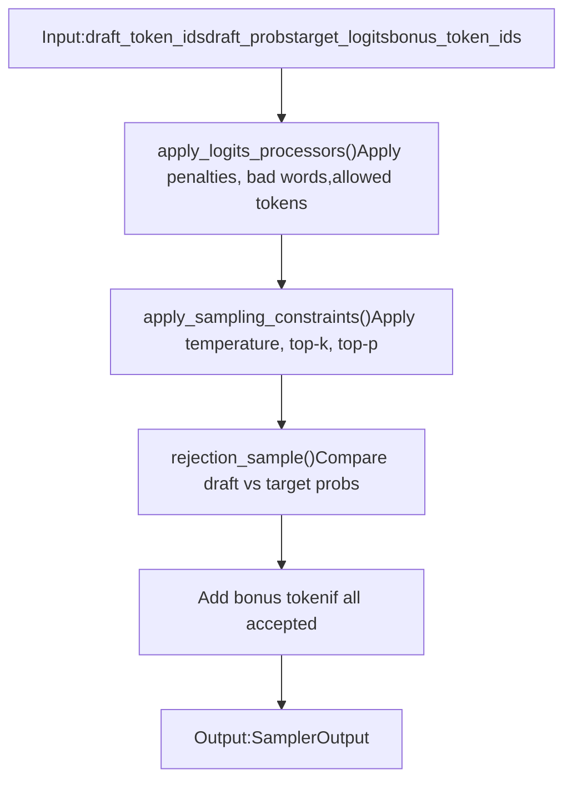

# 推测解码 (Speculative Decoding)

相关源文件

-   [tests/basic\_correctness/test\_cumem.py](https://github.com/vllm-project/vllm/blob/7cc302dd/tests/basic_correctness/test_cumem.py)
-   [tests/model\_executor/test\_eagle\_quantization.py](https://github.com/vllm-project/vllm/blob/7cc302dd/tests/model_executor/test_eagle_quantization.py)
-   [tests/utils.py](https://github.com/vllm-project/vllm/blob/7cc302dd/tests/utils.py)
-   [tests/v1/core/test\_async\_scheduler.py](https://github.com/vllm-project/vllm/blob/7cc302dd/tests/v1/core/test_async_scheduler.py)
-   [tests/v1/e2e/spec\_decode/test\_spec\_decode.py](https://github.com/vllm-project/vllm/blob/7cc302dd/tests/v1/e2e/spec_decode/test_spec_decode.py)
-   [tests/v1/sample/test\_logprobs.py](https://github.com/vllm-project/vllm/blob/7cc302dd/tests/v1/sample/test_logprobs.py)
-   [tests/v1/sample/test\_rejection\_sampler.py](https://github.com/vllm-project/vllm/blob/7cc302dd/tests/v1/sample/test_rejection_sampler.py)
-   [tests/v1/sample/test\_sampler.py](https://github.com/vllm-project/vllm/blob/7cc302dd/tests/v1/sample/test_sampler.py)
-   [tests/v1/sample/utils.py](https://github.com/vllm-project/vllm/blob/7cc302dd/tests/v1/sample/utils.py)
-   [tests/v1/spec\_decode/test\_eagle.py](https://github.com/vllm-project/vllm/blob/7cc302dd/tests/v1/spec_decode/test_eagle.py)
-   [tests/v1/spec\_decode/test\_mtp.py](https://github.com/vllm-project/vllm/blob/7cc302dd/tests/v1/spec_decode/test_mtp.py)
-   [tests/v1/spec\_decode/test\_ngram.py](https://github.com/vllm-project/vllm/blob/7cc302dd/tests/v1/spec_decode/test_ngram.py)
-   [vllm/config/speculative.py](https://github.com/vllm-project/vllm/blob/7cc302dd/vllm/config/speculative.py)
-   [vllm/model\_executor/models/deepseek\_eagle.py](https://github.com/vllm-project/vllm/blob/7cc302dd/vllm/model_executor/models/deepseek_eagle.py)
-   [vllm/model\_executor/models/llama.py](https://github.com/vllm-project/vllm/blob/7cc302dd/vllm/model_executor/models/llama.py)
-   [vllm/model\_executor/models/llama4\_eagle.py](https://github.com/vllm-project/vllm/blob/7cc302dd/vllm/model_executor/models/llama4_eagle.py)
-   [vllm/model\_executor/models/llama\_eagle.py](https://github.com/vllm-project/vllm/blob/7cc302dd/vllm/model_executor/models/llama_eagle.py)
-   [vllm/model\_executor/models/llama\_eagle3.py](https://github.com/vllm-project/vllm/blob/7cc302dd/vllm/model_executor/models/llama_eagle3.py)
-   [vllm/model\_executor/models/qwen2.py](https://github.com/vllm-project/vllm/blob/7cc302dd/vllm/model_executor/models/qwen2.py)
-   [vllm/model\_executor/models/qwen3.py](https://github.com/vllm-project/vllm/blob/7cc302dd/vllm/model_executor/models/qwen3.py)
-   [vllm/model\_executor/models/utils.py](https://github.com/vllm-project/vllm/blob/7cc302dd/vllm/model_executor/models/utils.py)
-   [vllm/transformers\_utils/configs/eagle.py](https://github.com/vllm-project/vllm/blob/7cc302dd/vllm/transformers_utils/configs/eagle.py)
-   [vllm/transformers\_utils/configs/extract\_hidden\_states.py](https://github.com/vllm-project/vllm/blob/7cc302dd/vllm/transformers_utils/configs/extract_hidden_states.py)
-   [vllm/transformers\_utils/configs/medusa.py](https://github.com/vllm-project/vllm/blob/7cc302dd/vllm/transformers_utils/configs/medusa.py)
-   [vllm/utils/mem\_utils.py](https://github.com/vllm-project/vllm/blob/7cc302dd/vllm/utils/mem_utils.py)
-   [vllm/v1/sample/metadata.py](https://github.com/vllm-project/vllm/blob/7cc302dd/vllm/v1/sample/metadata.py)
-   [vllm/v1/sample/ops/bad\_words.py](https://github.com/vllm-project/vllm/blob/7cc302dd/vllm/v1/sample/ops/bad_words.py)
-   [vllm/v1/sample/rejection\_sampler.py](https://github.com/vllm-project/vllm/blob/7cc302dd/vllm/v1/sample/rejection_sampler.py)
-   [vllm/v1/sample/sampler.py](https://github.com/vllm-project/vllm/blob/7cc302dd/vllm/v1/sample/sampler.py)
-   [vllm/v1/spec\_decode/draft\_model.py](https://github.com/vllm-project/vllm/blob/7cc302dd/vllm/v1/spec_decode/draft_model.py)
-   [vllm/v1/spec\_decode/eagle.py](https://github.com/vllm-project/vllm/blob/7cc302dd/vllm/v1/spec_decode/eagle.py)
-   [vllm/v1/spec\_decode/ngram\_proposer.py](https://github.com/vllm-project/vllm/blob/7cc302dd/vllm/v1/spec_decode/ngram_proposer.py)
-   [vllm/v1/spec\_decode/suffix\_decoding.py](https://github.com/vllm-project/vllm/blob/7cc302dd/vllm/v1/spec_decode/suffix_decoding.py)
-   [vllm/v1/spec\_decode/utils.py](https://github.com/vllm-project/vllm/blob/7cc302dd/vllm/v1/spec_decode/utils.py)

## 目的与范围 (Purpose and Scope)

本文档描述了 vLLM 在 V1 引擎架构中的推测解码 (speculative decoding) 实现。推测解码是一种推理优化技术，它通过提出“草稿 (draft)”令牌并根据目标模型的输出分布对其进行验证，从而在每次前向传播中生成多个令牌。该系统支持多种草稿令牌生成策略，包括 N-gram 匹配、草稿模型 (draft models)、EAGLE 和后缀解码 (suffix decoding)。

有关不带推测解码的一般采样过程的信息，请参阅 [采样和令牌生成 (Sampling and Token Generation)](/vllm-project/vllm/4.4-sampling-and-token-generation)。有关配置选项，请参阅 [VllmConfig 和专门的配置对象 (VllmConfig and Specialized Configuration Objects)](/vllm-project/vllm/2.2-vllmconfig-and-specialized-configuration-objects)。

## 架构概览 (Architecture Overview)

vLLM 中的推测解码由两个主要阶段组成：**草稿令牌建议 (draft token proposal)** 和 **通过拒绝采样 (rejection sampling) 进行验证**。该系统集成在 `GPUModelRunner` 中，并运行在最后一个流水线并行 (pipeline parallel) rank 上。

### 高层流程图 (High-Level Flow Diagram)

**来源**：[vllm/v1/sample/rejection\_sampler.py30-51](https://github.com/vllm-project/vllm/blob/7cc302dd/vllm/v1/sample/rejection_sampler.py#L30-L51) [vllm/config/speculative.py64-165](https://github.com/vllm-project/vllm/blob/7cc302dd/vllm/config/speculative.py#L64-L165)

## 建议器类型 (Proposer Types)

vLLM 支持多种用于生成草稿令牌的建议器实现。建议器根据 `speculative_config.method` 进行选择。

### 建议器选择与初始化 (Proposer Selection and Initialization)

**来源**：[vllm/config/speculative.py51-60](https://github.com/vllm-project/vllm/blob/7cc302dd/vllm/config/speculative.py#L51-L60) [vllm/v1/spec\_decode/eagle.py59-127](https://github.com/vllm-project/vllm/blob/7cc302dd/vllm/v1/spec_decode/eagle.py#L59-L127)

### N-gram 建议器 (N-gram Proposer)

`NgramProposer` 通过在提示词中寻找最长的匹配 n-gram 并建议该匹配项之后的令牌来生成草稿令牌。这是一种零成本的方法，不需要额外的模型权重。

**关键参数**：

-   `prompt_lookup_min`：要匹配的最小 n-gram 长度。[vllm/config/speculative.py131-132](https://github.com/vllm-project/vllm/blob/7cc302dd/vllm/config/speculative.py#L131-L132)
-   `prompt_lookup_max`：要匹配的最大 n-gram 长度。[vllm/config/speculative.py127-128](https://github.com/vllm-project/vllm/blob/7cc302dd/vllm/config/speculative.py#L127-L128)
-   `num_speculative_tokens`：要建议的令牌总数。[vllm/config/speculative.py71-73](https://github.com/vllm-project/vllm/blob/7cc302dd/vllm/config/speculative.py#L71-L73)

### EAGLE 和 EAGLE3 建议器 (EAGLE and EAGLE3 Proposers)

`EagleProposer` 实现了 EAGLE（Extrapolation Algorithm for Greater Language-model Efficiency）方法。与标准的草稿模型不同，EAGLE 结合使用令牌嵌入 (token embeddings) 和来自前一步的隐状态 (hidden states) 来预测下一个令牌。

**EAGLE3 增强功能**：

-   **辅助隐状态 (Auxiliary Hidden States)**：EAGLE3 可以利用来自目标模型的辅助隐状态来提高预测准确性。[vllm/v1/spec\_decode/eagle.py116-118](https://github.com/vllm-project/vllm/blob/7cc302dd/vllm/v1/spec_decode/eagle.py#L116-L118)
-   **并行建议 (Parallel Drafting)**：如果模型为此进行了训练，则支持并行而不是顺序地生成多个令牌。[vllm/v1/spec\_decode/eagle.py87-90](https://github.com/vllm-project/vllm/blob/7cc302dd/vllm/v1/spec_decode/eagle.py#L87-L90)

**EAGLE 模型架构**：

-   `Eagle3LlamaForCausalLM`：专为 EAGLE3 设计的 Llama 实现。[vllm/v1/spec\_decode/eagle.py25](https://github.com/vllm-project/vllm/blob/7cc302dd/vllm/v1/spec_decode/eagle.py#L25-L25) [vllm/model\_executor/models/llama\_eagle3.py133-173](https://github.com/vllm-project/vllm/blob/7cc302dd/vllm/model_executor/models/llama_eagle3.py#L133-L173)
-   `LlamaDecoderLayer`：经过修改的层，在第一层处理拼接的嵌入和隐状态。[vllm/model\_executor/models/llama\_eagle3.py38-67](https://github.com/vllm-project/vllm/blob/7cc302dd/vllm/model_executor/models/llama_eagle3.py#L38-L67)

**来源**：[vllm/v1/spec\_decode/eagle.py59-165](https://github.com/vllm-project/vllm/blob/7cc302dd/vllm/v1/spec_decode/eagle.py#L59-L165) [vllm/model\_executor/models/llama\_eagle3.py1-122](https://github.com/vllm-project/vllm/blob/7cc302dd/vllm/model_executor/models/llama_eagle3.py#L1-L122)

### 后缀解码建议器 (Suffix Decoding Proposer)

`SuffixDecodingProposer` 实现了一种利用全局和提示词特定的后缀树，基于历史生成模式来推测令牌的策略。

**关键参数**：

-   `suffix_decoding_max_tree_depth`：限制前缀匹配长度和推测长度之和。[vllm/config/speculative.py157-159](https://github.com/vllm-project/vllm/blob/7cc302dd/vllm/config/speculative.py#L157-L159)
-   `suffix_decoding_max_cached_requests`：要在全局后缀树中缓存的最大请求数。[vllm/config/speculative.py161-165](https://github.com/vllm-project/vllm/blob/7cc302dd/vllm/config/speculative.py#L161-L165)

**来源**：[vllm/config/speculative.py157-165](https://github.com/vllm-project/vllm/blob/7cc302dd/vllm/config/speculative.py#L157-L165) [vllm/v1/spec\_decode/suffix\_decoding.py1-12](https://github.com/vllm-project/vllm/blob/7cc302dd/vllm/v1/spec_decode/suffix_decoding.py#L1-L12)

## 拒绝采样 (Rejection Sampling)

`RejectionSampler` 根据目标模型的概率分布验证草稿令牌。它严格遵循 [arXiv:2211.17192](https://arxiv.org/abs/2211.17192) 中描述的算法。

### 令牌分类 (Token Classification)

拒绝采样器将生成的令牌分为三类：

| 令牌类型 | 描述 | 来源 |
| --- | --- | --- |
| **接受令牌 (Accepted Tokens)** | 在阈值内匹配目标模型分布的草稿令牌。 | [vllm/v1/sample/rejection\_sampler.py35-36](https://github.com/vllm-project/vllm/blob/7cc302dd/vllm/v1/sample/rejection_sampler.py#L35-L36) |
| **恢复令牌 (Recovered Tokens)** | 当草稿令牌被拒绝时，从调整后的分布中采样的令牌。 | [vllm/v1/sample/rejection\_sampler.py37-39](https://github.com/vllm-project/vllm/blob/7cc302dd/vllm/v1/sample/rejection_sampler.py#L37-L39) |
| **奖励令牌 (Bonus Tokens)** | 如果所有草稿都被接受，则从目标分布中采样的额外令牌。 | [vllm/v1/sample/rejection\_sampler.py40-47](https://github.com/vllm-project/vllm/blob/7cc302dd/vllm/v1/sample/rejection_sampler.py#L40-L47) |

**输出公式**：`输出令牌 = 接受令牌 + 恢复令牌 + 奖励令牌`。[vllm/v1/sample/rejection\_sampler.py50](https://github.com/vllm-project/vllm/blob/7cc302dd/vllm/v1/sample/rejection_sampler.py#L50-L50)

### 拒绝采样算法流程 (Rejection Sampling Algorithm Flow)

**来源**：[vllm/v1/sample/rejection\_sampler.py60-150](https://github.com/vllm-project/vllm/blob/7cc302dd/vllm/v1/sample/rejection_sampler.py#L60-L150)

### Logits 处理与约束 (Logits Processing and Constraints)

在拒绝采样之前，目标 logits 会经历几次转换：

1.  **Logits 处理器**：应用可能影响贪婪采样 (greedy sampling) 的处理器（例如 `MinTokensLogitsProcessor`）。[vllm/v1/sample/rejection\_sampler.py129-131](https://github.com/vllm-project/vllm/blob/7cc302dd/vllm/v1/sample/rejection_sampler.py#L129-L131) [vllm/v1/sample/sampler.py33-36](https://github.com/vllm-project/vllm/blob/7cc302dd/vllm/v1/sample/sampler.py#L33-L36)
2.  **采样约束**：应用温度、top-k 和 top-p 过滤。[vllm/v1/sample/rejection\_sampler.py135-139](https://github.com/vllm-project/vllm/blob/7cc302dd/vllm/v1/sample/rejection_sampler.py#L135-L139) [vllm/v1/sample/ops/topk\_topp\_sampler.py17](https://github.com/vllm-project/vllm/blob/7cc302dd/vllm/v1/sample/ops/topk_topp_sampler.py#L17-L17)
3.  **惩罚**：应用重复惩罚、频率惩罚和出现惩罚。[vllm/v1/sample/ops/penalties.py16-17](https://github.com/vllm-project/vllm/blob/7cc302dd/vllm/v1/sample/ops/penalties.py#L16-L17) [vllm/v1/sample/sampler.py37-40](https://github.com/vllm-project/vllm/blob/7cc302dd/vllm/v1/sample/sampler.py#L37-L40)

**来源**：[vllm/v1/sample/rejection\_sampler.py120-140](https://github.com/vllm-project/vllm/blob/7cc302dd/vllm/v1/sample/rejection_sampler.py#L120-L140) [vllm/v1/sample/sampler.py20-59](https://github.com/vllm-project/vllm/blob/7cc302dd/vllm/v1/sample/sampler.py#L20-L59)

## 实现细节 (Implementation Details)

### EAGLE 输入准备 (EAGLE Input Preparation)

EAGLE 需要复杂的输入准备，因为它同时对嵌入和隐状态进行操作。`EagleProposer` 使用专门的 Triton 内核来进行高效的数据移动：

-   `eagle_prepare_inputs_padded_kernel`：为 EAGLE 前向传播准备输入张量。[vllm/v1/spec\_decode/eagle.py46](https://github.com/vllm-project/vllm/blob/7cc302dd/vllm/v1/spec_decode/eagle.py#L46-L46)
-   `copy_and_expand_eagle_inputs_kernel`：处理推测树的隐状态扩展。[vllm/v1/spec\_decode/eagle.py45](https://github.com/vllm-project/vllm/blob/7cc302dd/vllm/v1/spec_decode/eagle.py#L45-L45)
-   `eagle_prepare_next_token_padded_kernel`：准备下一个令牌输入。[vllm/v1/spec\_decode/eagle.py47](https://github.com/vllm-project/vllm/blob/7cc302dd/vllm/v1/spec_decode/eagle.py#L47-L47)

**来源**：[vllm/v1/spec\_decode/eagle.py42-50](https://github.com/vllm-project/vllm/blob/7cc302dd/vllm/v1/spec_decode/eagle.py#L42-L50)

### 草稿令牌管理 (Draft Token Management)

草稿令牌通过 `SpecDecodeMetadata` 进行管理，它跟踪用于验证的索引：

-   `target_logits_indices`：扁平化 logits 张量中对应推测位置的索引。[vllm/v1/sample/rejection\_sampler.py94](https://github.com/vllm-project/vllm/blob/7cc302dd/vllm/v1/sample/rejection_sampler.py#L94-L94)
-   `bonus_logits_indices`：对应推测窗口末尾潜在奖励令牌位置的索引。[vllm/v1/sample/rejection\_sampler.py93](https://github.com/vllm-project/vllm/blob/7cc302dd/vllm/v1/sample/rejection_sampler.py#L93-L93)

**来源**：[vllm/v1/sample/rejection\_sampler.py91-115](https://github.com/vllm-project/vllm/blob/7cc302dd/vllm/v1/sample/rejection_sampler.py#L91-L115)

### 接受指标 (Acceptance Metrics)

vLLM 通过接受指标跟踪推测解码的效率：

-   **接受率 (Acceptance Rate)**：接受的草稿令牌数与建议的草稿令牌总数之比。
-   **系统加速比 (System Speedup)**：与非推测执行相比，每秒令牌数的经验增长。

这些指标通过 `SamplerOutput` 进行监控，其中包括用于验证的 `sampled_token_ids`（包括奖励令牌）和 `logprobs_tensors`。[vllm/v1/sample/rejection\_sampler.py163-165](https://github.com/vllm-project/vllm/blob/7cc302dd/vllm/v1/sample/rejection_sampler.py#L163-L165)

**来源**：[vllm/v1/sample/rejection\_sampler.py152-165](https://github.com/vllm-project/vllm/blob/7cc302dd/vllm/v1/sample/rejection_sampler.py#L152-L165) [vllm/v1/outputs.py12-13](https://github.com/vllm-project/vllm/blob/7cc302dd/vllm/v1/outputs.py#L12-L13)
