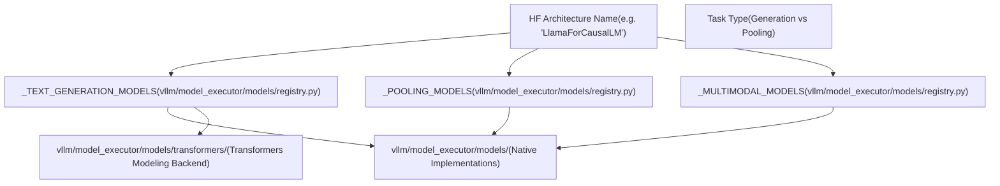
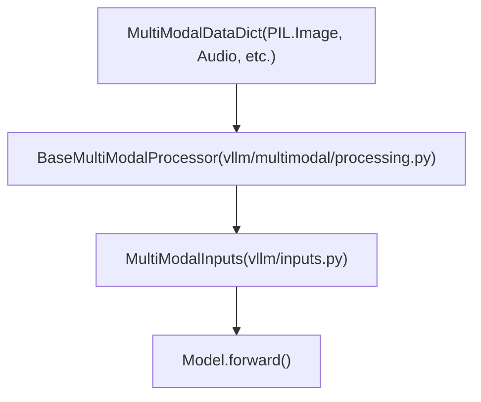

# 模型支持与注册 (Model Support and Registration)

相关源文件

-   [docs/.nav.yml](https://github.com/vllm-project/vllm/blob/7cc302dd/docs/.nav.yml)
-   [docs/contributing/model/README.md](https://github.com/vllm-project/vllm/blob/7cc302dd/docs/contributing/model/README.md?plain=1)
-   [docs/contributing/model/basic.md](https://github.com/vllm-project/vllm/blob/7cc302dd/docs/contributing/model/basic.md?plain=1)
-   [docs/contributing/model/multimodal.md](https://github.com/vllm-project/vllm/blob/7cc302dd/docs/contributing/model/multimodal.md?plain=1)
-   [docs/contributing/model/registration.md](https://github.com/vllm-project/vllm/blob/7cc302dd/docs/contributing/model/registration.md?plain=1)
-   [docs/contributing/model/tests.md](https://github.com/vllm-project/vllm/blob/7cc302dd/docs/contributing/model/tests.md?plain=1)
-   [docs/contributing/model/transcription.md](https://github.com/vllm-project/vllm/blob/7cc302dd/docs/contributing/model/transcription.md?plain=1)
-   [docs/deployment/frameworks/hf\_inference\_endpoints.md](https://github.com/vllm-project/vllm/blob/7cc302dd/docs/deployment/frameworks/hf_inference_endpoints.md?plain=1)
-   [docs/design/plugin\_system.md](https://github.com/vllm-project/vllm/blob/7cc302dd/docs/design/plugin_system.md?plain=1)
-   [docs/examples/README.md](https://github.com/vllm-project/vllm/blob/7cc302dd/docs/examples/README.md?plain=1)
-   [docs/features/README.md](https://github.com/vllm-project/vllm/blob/7cc302dd/docs/features/README.md?plain=1)
-   [docs/features/prompt\_embeds.md](https://github.com/vllm-project/vllm/blob/7cc302dd/docs/features/prompt_embeds.md?plain=1)
-   [docs/getting\_started/quickstart.md](https://github.com/vllm-project/vllm/blob/7cc302dd/docs/getting_started/quickstart.md?plain=1)
-   [docs/mkdocs/hooks/url\_schemes.py](https://github.com/vllm-project/vllm/blob/7cc302dd/docs/mkdocs/hooks/url_schemes.py)
-   [docs/models/generative\_models.md](https://github.com/vllm-project/vllm/blob/7cc302dd/docs/models/generative_models.md?plain=1)
-   [docs/models/pooling\_models/classify.md](https://github.com/vllm-project/vllm/blob/7cc302dd/docs/models/pooling_models/classify.md?plain=1)
-   [docs/models/pooling\_models/embed.md](https://github.com/vllm-project/vllm/blob/7cc302dd/docs/models/pooling_models/embed.md?plain=1)
-   [docs/models/pooling\_models/reward.md](https://github.com/vllm-project/vllm/blob/7cc302dd/docs/models/pooling_models/reward.md?plain=1)
-   [docs/models/pooling\_models/scoring.md](https://github.com/vllm-project/vllm/blob/7cc302dd/docs/models/pooling_models/scoring.md?plain=1)
-   [docs/models/supported\_models.md](https://github.com/vllm-project/vllm/blob/7cc302dd/docs/models/supported_models.md?plain=1)
-   [docs/serving/offline\_inference.md](https://github.com/vllm-project/vllm/blob/7cc302dd/docs/serving/offline_inference.md?plain=1)
-   [docs/serving/openai\_compatible\_server.md](https://github.com/vllm-project/vllm/blob/7cc302dd/docs/serving/openai_compatible_server.md?plain=1)
-   [examples/offline\_inference/audio\_language.py](https://github.com/vllm-project/vllm/blob/7cc302dd/examples/offline_inference/audio_language.py)
-   [examples/offline\_inference/vision\_language.py](https://github.com/vllm-project/vllm/blob/7cc302dd/examples/offline_inference/vision_language.py)
-   [examples/offline\_inference/vision\_language\_multi\_image.py](https://github.com/vllm-project/vllm/blob/7cc302dd/examples/offline_inference/vision_language_multi_image.py)
-   [examples/online_serving/disaggregated_encoder/README.md](https://github.com/vllm-project/vllm/blob/7cc302dd/examples/online_serving/disaggregated_encoder/README.md?plain=1)
-   [tests/distributed/test\_pipeline\_parallel.py](https://github.com/vllm-project/vllm/blob/7cc302dd/tests/distributed/test_pipeline_parallel.py)
-   [tests/models/multimodal/generation/test\_common.py](https://github.com/vllm-project/vllm/blob/7cc302dd/tests/models/multimodal/generation/test_common.py)
-   [tests/models/multimodal/generation/vlm\_utils/model\_utils.py](https://github.com/vllm-project/vllm/blob/7cc302dd/tests/models/multimodal/generation/vlm_utils/model_utils.py)
-   [tests/models/multimodal/processing/test\_common.py](https://github.com/vllm-project/vllm/blob/7cc302dd/tests/models/multimodal/processing/test_common.py)
-   [tests/models/registry.py](https://github.com/vllm-project/vllm/blob/7cc302dd/tests/models/registry.py)
-   [tests/models/test\_initialization.py](https://github.com/vllm-project/vllm/blob/7cc302dd/tests/models/test_initialization.py)
-   [vllm/model\_executor/models/config.py](https://github.com/vllm-project/vllm/blob/7cc302dd/vllm/model_executor/models/config.py)
-   [vllm/model\_executor/models/mistral\_large\_3\_eagle.py](https://github.com/vllm-project/vllm/blob/7cc302dd/vllm/model_executor/models/mistral_large_3_eagle.py)
-   [vllm/model\_executor/models/registry.py](https://github.com/vllm-project/vllm/blob/7cc302dd/vllm/model_executor/models/registry.py)
-   [vllm/transformers\_utils/config.py](https://github.com/vllm-project/vllm/blob/7cc302dd/vllm/transformers_utils/config.py)
-   [vllm/transformers\_utils/configs/\_\_init\_\_.py](https://github.com/vllm-project/vllm/blob/7cc302dd/vllm/transformers_utils/configs/__init__.py)
-   [vllm/transformers\_utils/configs/mistral.py](https://github.com/vllm-project/vllm/blob/7cc302dd/vllm/transformers_utils/configs/mistral.py)
-   [vllm/transformers\_utils/model\_arch\_config\_convertor.py](https://github.com/vllm-project/vllm/blob/7cc302dd/vllm/transformers_utils/model_arch_config_convertor.py)

## 目的与范围 (Purpose and Scope)

本文档解释了 vLLM 如何为给定的模型确定应使用的模型实现，以及新模型如何在系统中注册。它涵盖了：

-   将 HuggingFace 架构映射到 vLLM 实现的模型注册系统。
-   架构检测和配置加载机制。
-   模型实现后端（原生 vLLM 和 Transformers 建模后端）。
-   模型能力接口与查询。
-   多模态模型注册与数据流。

有关使用受支持模型的信息，请参阅 [docs/models/supported\_models.md](https://github.com/vllm-project/vllm/blob/7cc302dd/docs/models/supported_models.md?plain=1) 中的文档。

---

## 模型注册中心架构 (Model Registry Architecture)

模型注册中心是核心系统，负责将 HuggingFace `config.json` 文件中的模型架构名称映射到 vLLM 的模型实现类。当用户加载模型时，vLLM 会查询该注册中心以确定哪个 Python 类应当处理该模型的执行。

### 注册中心结构 (Registry Structure)

注册中心为不同的模型类型（如文本生成、池化（嵌入）和多模态模型）维护独立的字典。

**模型注册中心实体映射**


**注册中心映射格式** 每个注册中心条目将架构名称映射到一个元组 `(module_name, class_name)`：

```
_TEXT_GENERATION_MODELS = {    "LlamaForCausalLM": ("llama", "LlamaForCausalLM"),    "Qwen2ForCausalLM": ("qwen2", "Qwen2ForCausalLM"),    "MistralForCausalLM": ("mistral", "MistralForCausalLM"),    # Many architectures may map to the same implementation    "AquilaForCausalLM": ("llama", "LlamaForCausalLM"),    "InternLM3ForCausalLM": ("llama", "LlamaForCausalLM"),}
```
[vllm/model\_executor/models/registry.py70-152](https://github.com/vllm-project/vllm/blob/7cc302dd/vllm/model_executor/models/registry.py#L70-L152)

模块名称相对于 `vllm.model_executor.models`，因此 `"llama"` 指的是 `vllm/model_executor/models/llama.py`。

**来源：** [vllm/model\_executor/models/registry.py70-211](https://github.com/vllm-project/vllm/blob/7cc302dd/vllm/model_executor/models/registry.py#L70-L211) [vllm/model\_executor/models/registry.py213-278](https://github.com/vllm-project/vllm/blob/7cc302dd/vllm/model_executor/models/registry.py#L213-L278) [vllm/model\_executor/models/registry.py311-527](https://github.com/vllm-project/vllm/blob/7cc302dd/vllm/model_executor/models/registry.py#L311-L527)

---

## 架构检测与配置加载 (Architecture Detection and Config Loading)

vLLM 支持多种配置格式以及针对特定模型的自定义配置类，这些模型扩展了标准的 HuggingFace 属性或定义了新的架构。

### 配置加载流程 (Configuration Loading Flow)

**配置加载逻辑**

> **[Mermaid sequence]**
> *(图表结构无法解析)*

**自定义配置注册中心 (Custom Configuration Registry)** `vllm/transformers_utils/config.py` 中的 `_CONFIG_REGISTRY` 处理具有非标准配置的模型，或者那些需要 vLLM 特定覆盖的模型。[vllm/transformers\_utils/config.py80-121](https://github.com/vllm-project/vllm/blob/7cc302dd/vllm/transformers_utils/config.py#L80-L121)

| 模型类型 | 自定义配置类 | 用途 |
| --- | --- | --- |
| `afmoe` | `AfmoeConfig` | MoE 特定参数 |
| `eagle` | `EAGLEConfig` | 推测解码 |
| `qwen3_vl` | `Qwen3VLConfig` | 多模态分辨率 |
| `flex_olmo` | `FlexOlmoConfig` | 混合架构 |

**来源：** [vllm/transformers\_utils/config.py80-121](https://github.com/vllm-project/vllm/blob/7cc302dd/vllm/transformers_utils/config.py#L80-L121) [vllm/transformers\_utils/config.py155-202](https://github.com/vllm-project/vllm/blob/7cc302dd/vllm/transformers_utils/config.py#L155-L202) [vllm/transformers\_utils/configs/\_\_init\_\_.py17-73](https://github.com/vllm-project/vllm/blob/7cc302dd/vllm/transformers_utils/configs/__init__.py#L17-L73)

---

## 模型实现后端 (Model Implementation Backends)

vLLM 支持两种主要的模型后端：

### 1. 原生 vLLM 实现 (Native vLLM Implementations)

位于 `vllm/model_executor/models/`，这些是使用 vLLM 自定义内核（例如 `FusedMoE`）和注意力后端进行高度优化的实现。[docs/models/supported\_models.md10-14](https://github.com/vllm-project/vllm/blob/7cc302dd/docs/models/supported_models.md?plain=1#L10-L14)

### 2. Transformers 建模后端 (Transformers Modeling Backend)

对于没有原生实现的模型，vLLM 可以使用“Transformers 建模后端”。这允许直接运行来自 HuggingFace `transformers` 库的模型，同时仍然受益于 vLLM 的 PagedAttention 和连续批处理 (continuous batching)。[docs/models/supported\_models.md16-47](https://github.com/vllm-project/vllm/blob/7cc302dd/docs/models/supported_models.md?plain=1#L16-L47)

**Transformers 后端的兼容性要求：**

-   模型必须是兼容 Transformers 的自定义模型（带有 `auto_map`）。
-   注意力层必须使用 `ALL_ATTENTION_FUNCTIONS`。
-   模型必须设置 `_supports_attention_backend = True`。
-   对于 MoE，稀疏块必须具有 `experts` 属性。

**来源：** [docs/models/supported\_models.md16-142](https://github.com/vllm-project/vllm/blob/7cc302dd/docs/models/supported_models.md?plain=1#L16-L142) [vllm/model\_executor/models/registry.py279-308](https://github.com/vllm-project/vllm/blob/7cc302dd/vllm/model_executor/models/registry.py#L279-L308)

---

## 模型能力接口 (Model Capability Interfaces)

vLLM 使用接口系统来动态查询模型能力。这避免了在整个引擎中硬编码架构检查。

| 接口 / 函数 | 代码实体 | 用途 |
| --- | --- | --- |
| 多模态支持 | `supports_multimodal()` | 检测模型是否接受非文本输入。 |
| 流水线并行 | `supports_pp()` | 检查模型逻辑是否允许 PP 切分。 |
| 无注意力 (Attention Free) | `is_attention_free()` | 识别 RNN/Mamba 风格的模型。 |
| 池化支持 | `is_pooling_model()` | 识别嵌入/分类模型。 |
| 转录 (Transcription) | `supports_transcription()` | 识别 ASR（语音识别）模型。 |

**来源：** [vllm/model\_executor/models/registry.py46-58](https://github.com/vllm-project/vllm/blob/7cc302dd/vllm/model_executor/models/registry.py#L46-L58) [vllm/model\_executor/models/interfaces\_base.py59-66](https://github.com/vllm-project/vllm/blob/7cc302dd/vllm/model_executor/models/interfaces_base.py#L59-L66)

---

## 多模态模型支持 (Multimodal Model Support)

多模态模型（VLM、音频大模型）需要特殊的注册来处理图像、视频和音频等多样化数据类型。

### 多模态注册中心 (Multimodal Registry)

`_MULTIMODAL_MODELS` 注册中心将架构映射到可以处理 `MultiModalDataDict` 输入的实现。[vllm/model\_executor/models/registry.py311-527](https://github.com/vllm-project/vllm/blob/7cc302dd/vllm/model_executor/models/registry.py#L311-L527)

**注册中心支持的模态：**

-   **视觉：** `Qwen2_5VL`、`Llava`、`Aria`、`Idefics3`。
-   **音频：** `Ultravox`、`Qwen2Audio`。
-   **视频：** `Qwen2.5VL`、`HunyuanVideo`。

### MultiModalDataDict 与处理 (MultiModalDataDict and Processing)

多模态输入通过 `MultiModalDataDict` 传递，该字典在被送入模型的视觉/音频编码器之前，由模型特定的处理器进行处理。

**多模态数据流**


详情请参阅 [多模态模型支持 (Multimodal Model Support)](/vllm-project/vllm/5.4-multimodal-model-support) 和 [多模态数据处理 (Multimodal Data Processing)](/vllm-project/vllm/5.5-multimodal-data-processing)。

**来源：** [vllm/multimodal/processing.py21-25](https://github.com/vllm-project/vllm/blob/7cc302dd/vllm/multimodal/processing.py#L21-L25) [vllm/inputs.py18](https://github.com/vllm-project/vllm/blob/7cc302dd/vllm/inputs.py#L18-L18) [tests/models/multimodal/processing/test\_common.py18-24](https://github.com/vllm-project/vllm/blob/7cc302dd/tests/models/multimodal/processing/test_common.py#L18-L24)

---

## 配置验证与更新 (Configuration Verification and Update)

在模型执行之前，vLLM 提供了一种机制，通过 `VerifyAndUpdateConfig` 接口，根据引擎设置或硬件能力来验证并更新模型配置。

**配置覆盖示例：**

-   **DeepSeek V3：** 如果请求了 `bfloat16` 以获得性能，则自动将 `cache_dtype` 设置为 `auto`。[vllm/model\_executor/models/config.py30-44](https://github.com/vllm-project/vllm/blob/7cc302dd/vllm/model_executor/models/config.py#L30-L44)
-   **混合模型：** 为具有循环层（Mamba、SSM）的模型禁用 `calculate_kv_scales`，以避免从未初始化的状态中产生损坏。[vllm/model\_executor/models/config.py103-130](https://github.com/vllm-project/vllm/blob/7cc302dd/vllm/model_executor/models/config.py#L103-L130)

**来源：** [vllm/model\_executor/models/config.py20-28](https://github.com/vllm-project/vllm/blob/7cc302dd/vllm/model_executor/models/config.py#L20-L28) [vllm/model\_executor/models/config.py103-130](https://github.com/vllm-project/vllm/blob/7cc302dd/vllm/model_executor/models/config.py#L103-L130)

---

## 子页面 (Child Pages)

-   [模型注册中心与架构检测 (Model Registry and Architecture Detection)](/vllm-project/vllm/5.1-model-registry-and-architecture-detection) —— HF 架构到 vLLM 实现的详细映射及能力查询。
-   [配置加载与解析 (Configuration Loading and Parsing)](/vllm-project/vllm/5.2-configuration-loading-and-parsing) —— 关于 `HFConfigParser`、`MistralConfigParser` 和配置适配的文档。
-   [Transformers 建模后端 (Transformers Modeling Backend)](/vllm-project/vllm/5.3-transformers-modeling-backend) —— 为非原生模型使用 Transformers 后端的系统细节。
-   [多模态模型支持 (Multimodal Model Support)](/vllm-project/vllm/5.4-multimodal-model-support) —— VLM 和音频模型的接口定义及受支持的模态。
-   [多模态数据处理 (Multimodal Data Processing)](/vllm-project/vllm/5.5-multimodal-data-processing) —— `MultiModalDataDict` 的处理以及图像/音频/视频的张量转换。
