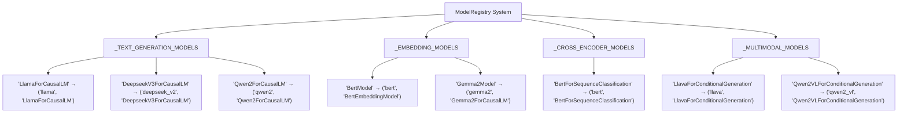
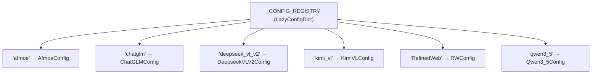
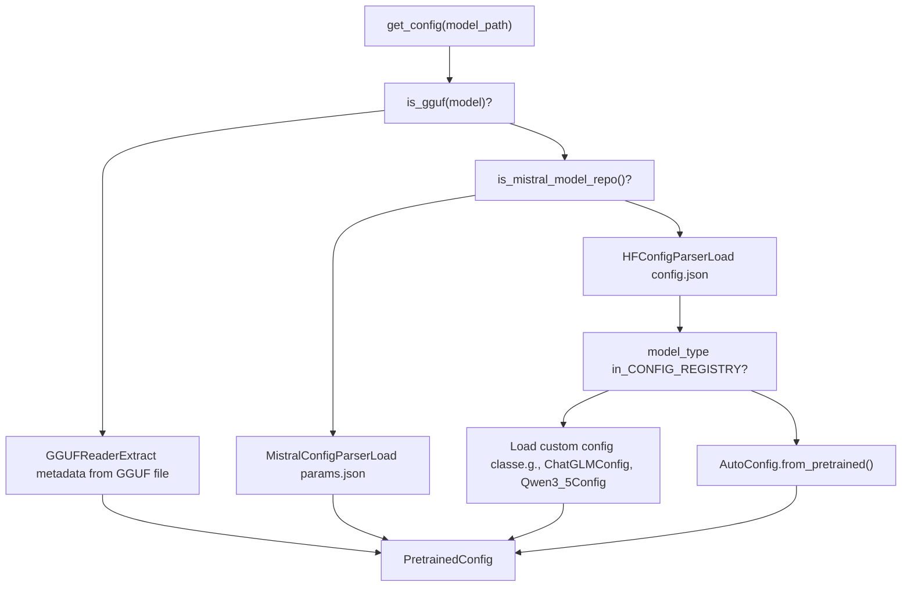
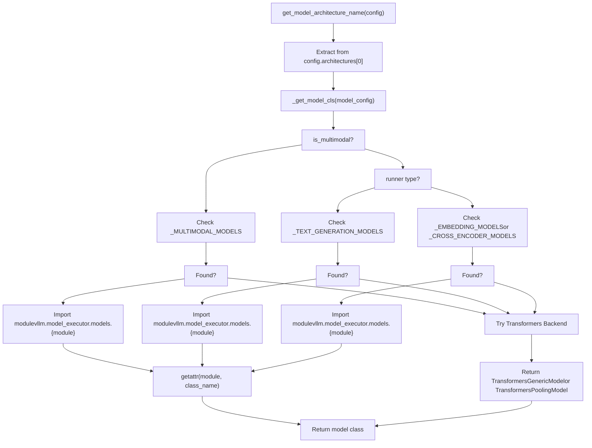
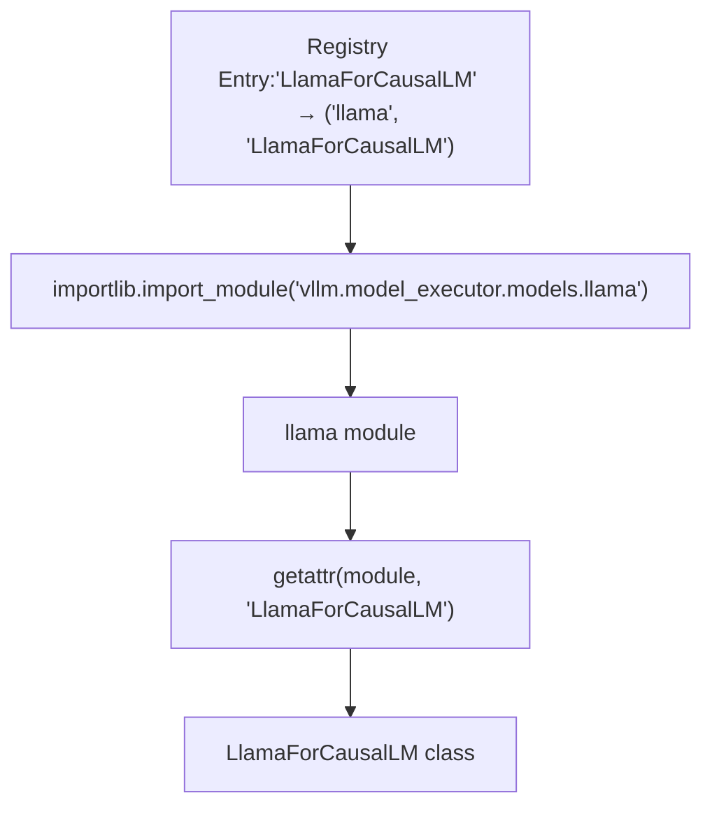
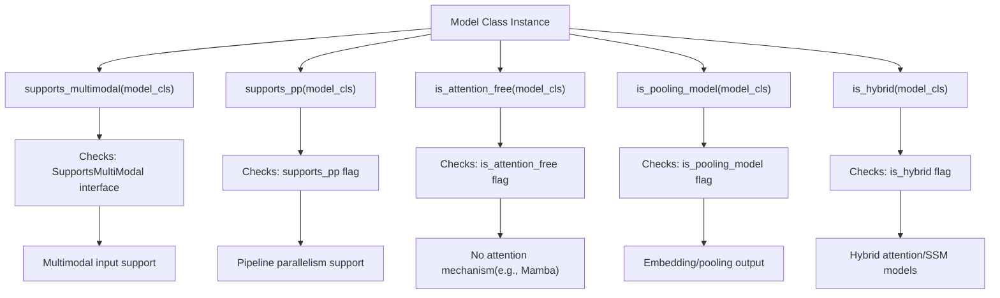

# 模型注册中心与架构检测 (Model Registry and Architecture Detection)

相关源文件

-   [docs/models/supported\_models.md](https://github.com/vllm-project/vllm/blob/7cc302dd/docs/models/supported_models.md?plain=1)
-   [examples/offline\_inference/audio\_language.py](https://github.com/vllm-project/vllm/blob/7cc302dd/examples/offline_inference/audio_language.py)
-   [examples/offline\_inference/vision\_language.py](https://github.com/vllm-project/vllm/blob/7cc302dd/examples/offline_inference/vision_language.py)
-   [examples/offline\_inference/vision\_language\_multi\_image.py](https://github.com/vllm-project/vllm/blob/7cc302dd/examples/offline_inference/vision_language_multi_image.py)
-   [examples/online\_serving/openai\_transcription\_client.py](https://github.com/vllm-project/vllm/blob/7cc302dd/examples/online_serving/openai_transcription_client.py)
-   [tests/distributed/test\_pipeline\_parallel.py](https://github.com/vllm-project/vllm/blob/7cc302dd/tests/distributed/test_pipeline_parallel.py)
-   [tests/entrypoints/openai/conftest.py](https://github.com/vllm-project/vllm/blob/7cc302dd/tests/entrypoints/openai/conftest.py)
-   [tests/entrypoints/pooling/classify/test\_online.py](https://github.com/vllm-project/vllm/blob/7cc302dd/tests/entrypoints/pooling/classify/test_online.py)
-   [tests/models/multimodal/generation/test\_common.py](https://github.com/vllm-project/vllm/blob/7cc302dd/tests/models/multimodal/generation/test_common.py)
-   [tests/models/multimodal/generation/vlm\_utils/model\_utils.py](https://github.com/vllm-project/vllm/blob/7cc302dd/tests/models/multimodal/generation/vlm_utils/model_utils.py)
-   [tests/models/multimodal/processing/test\_common.py](https://github.com/vllm-project/vllm/blob/7cc302dd/tests/models/multimodal/processing/test_common.py)
-   [tests/models/registry.py](https://github.com/vllm-project/vllm/blob/7cc302dd/tests/models/registry.py)
-   [tests/models/test\_initialization.py](https://github.com/vllm-project/vllm/blob/7cc302dd/tests/models/test_initialization.py)
-   [vllm/entrypoints/openai/generate/\_\_init\_\_.py](https://github.com/vllm-project/vllm/blob/7cc302dd/vllm/entrypoints/openai/generate/__init__.py)
-   [vllm/model\_executor/models/eagle2\_5\_vl.py](https://github.com/vllm-project/vllm/blob/7cc302dd/vllm/model_executor/models/eagle2_5_vl.py)
-   [vllm/model\_executor/models/funaudiochat.py](https://github.com/vllm-project/vllm/blob/7cc302dd/vllm/model_executor/models/funaudiochat.py)
-   [vllm/model\_executor/models/interfaces.py](https://github.com/vllm-project/vllm/blob/7cc302dd/vllm/model_executor/models/interfaces.py)
-   [vllm/model\_executor/models/mistral\_large\_3\_eagle.py](https://github.com/vllm-project/vllm/blob/7cc302dd/vllm/model_executor/models/mistral_large_3_eagle.py)
-   [vllm/model\_executor/models/openpangu\_vl.py](https://github.com/vllm-project/vllm/blob/7cc302dd/vllm/model_executor/models/openpangu_vl.py)
-   [vllm/model\_executor/models/qwen3\_asr.py](https://github.com/vllm-project/vllm/blob/7cc302dd/vllm/model_executor/models/qwen3_asr.py)
-   [vllm/model\_executor/models/registry.py](https://github.com/vllm-project/vllm/blob/7cc302dd/vllm/model_executor/models/registry.py)
-   [vllm/model\_executor/models/whisper.py](https://github.com/vllm-project/vllm/blob/7cc302dd/vllm/model_executor/models/whisper.py)
-   [vllm/transformers\_utils/config.py](https://github.com/vllm-project/vllm/blob/7cc302dd/vllm/transformers_utils/config.py)
-   [vllm/transformers\_utils/configs/\_\_init\_\_.py](https://github.com/vllm-project/vllm/blob/7cc302dd/vllm/transformers_utils/configs/__init__.py)
-   [vllm/transformers\_utils/configs/mistral.py](https://github.com/vllm-project/vllm/blob/7cc302dd/vllm/transformers_utils/configs/mistral.py)
-   [vllm/transformers\_utils/model\_arch\_config\_convertor.py](https://github.com/vllm-project/vllm/blob/7cc302dd/vllm/transformers_utils/model_arch_config_convertor.py)

本文档说明 vLLM 如何根据模型的架构识别并加载合适的模型实现。模型注册中心是 HuggingFace 模型架构与其对应 vLLM 实现之间的核心映射。

## 注册中心架构概览 (Architecture Registry Overview)

模型注册中心维护从 HuggingFace 架构名称（它们出现在 `config.json` 文件中）到 vLLM 模型实现的映射。这些映射按模型主要用例进行组织。

### 注册中心结构 (Registry Structure)

注册中心由按模型主要用例分类的主字典组成：

vLLM 模型注册中心组织结构


**注册中心字典格式**

注册中心中的每个条目都会将一个架构名称映射为 `(module_name, class_name)` 元组：

-   **键**：来自 HuggingFace `config.json` 的架构名称（例如 `"LlamaForCausalLM"`）
-   **值**：`(module_name, vllm_class_name)` 元组
    -   `module_name`：`vllm.model_executor.models` 下的 Python 模块（例如 `"llama"`）
    -   `vllm_class_name`：vLLM 模型类名（例如 `"LlamaForCausalLM"`）

来源： [vllm/model\_executor/models/registry.py70-211](https://github.com/vllm-project/vllm/blob/7cc302dd/vllm/model_executor/models/registry.py#L70-L211) [vllm/model\_executor/models/registry.py213-278](https://github.com/vllm-project/vllm/blob/7cc302dd/vllm/model_executor/models/registry.py#L213-L278) [vllm/model\_executor/models/registry.py280-309](https://github.com/vllm-project/vllm/blob/7cc302dd/vllm/model_executor/models/registry.py#L280-L309) [vllm/model\_executor/models/registry.py311-585](https://github.com/vllm-project/vllm/blob/7cc302dd/vllm/model_executor/models/registry.py#L311-L585)

### 架构别名与变体 (Architecture Aliases and Variants)

某些架构有多个 HuggingFace 名称，但它们映射到同一个 vLLM 实现：

| HF 架构 | vLLM 模块 | 备注 |
| --- | --- | --- |
| `AquilaModel` | `llama` | 映射到 Llama 实现 [vllm/model\_executor/models/registry.py74](https://github.com/vllm-project/vllm/blob/7cc302dd/vllm/model_executor/models/registry.py#L74-L74) |
| `DeepseekV32ForCausalLM` | `deepseek_v2` | DeepSeek V3 变体 [vllm/model\_executor/models/registry.py98](https://github.com/vllm-project/vllm/blob/7cc302dd/vllm/model_executor/models/registry.py#L98-L98) |
| `BaiChuanForCausalLM` | `baichuan` | 大写 'C'（baichuan-7b） [vllm/model\_executor/models/registry.py80](https://github.com/vllm-project/vllm/blob/7cc302dd/vllm/model_executor/models/registry.py#L80-L80) |
| `BaichuanForCausalLM` | `baichuan` | 小写 'c'（baichuan-13b） [vllm/model\_executor/models/registry.py82](https://github.com/vllm-project/vllm/blob/7cc302dd/vllm/model_executor/models/registry.py#L82-L82) |
| `LLaMAForCausalLM` | `llama` | decapoda-research 模型的遗留命名 [vllm/model\_executor/models/registry.py152](https://github.com/vllm-project/vllm/blob/7cc302dd/vllm/model_executor/models/registry.py#L152-L152) |
| `RWForCausalLM` | `falcon` | 原始 Falcon 模型 [vllm/model\_executor/models/registry.py166](https://github.com/vllm-project/vllm/blob/7cc302dd/vllm/model_executor/models/registry.py#L166-L166) |

来源： [vllm/model\_executor/models/registry.py74-76](https://github.com/vllm-project/vllm/blob/7cc302dd/vllm/model_executor/models/registry.py#L74-L76) [vllm/model\_executor/models/registry.py80-82](https://github.com/vllm-project/vllm/blob/7cc302dd/vllm/model_executor/models/registry.py#L80-L82) [vllm/model\_executor/models/registry.py152](https://github.com/vllm-project/vllm/blob/7cc302dd/vllm/model_executor/models/registry.py#L152-L152) [vllm/model\_executor/models/registry.py166-167](https://github.com/vllm-project/vllm/blob/7cc302dd/vllm/model_executor/models/registry.py#L166-L167)

### 自定义配置类 (Custom Configuration Classes)

vLLM 维护了一个独立的自定义配置类注册中心，用于覆盖或扩展 HuggingFace 配置：

配置注册中心映射


在以下情况下会使用这些自定义配置：

-   HF Hub 或 Transformers 库未定义配置文件 [vllm/transformers\_utils/configs/\_\_init\_\_.py6](https://github.com/vllm-project/vllm/blob/7cc302dd/vllm/transformers_utils/configs/__init__.py#L6-L6)
-   需要覆盖现有配置以支持 vLLM [vllm/transformers\_utils/configs/\_\_init\_\_.py7](https://github.com/vllm-project/vllm/blob/7cc302dd/vllm/transformers_utils/configs/__init__.py#L7-L7)
-   HF 的 `model_type` 无法被 Transformers 识别，但可以映射到现有配置 [vllm/transformers\_utils/configs/\_\_init\_\_.py8-10](https://github.com/vllm-project/vllm/blob/7cc302dd/vllm/transformers_utils/configs/__init__.py#L8-L10)

来源： [vllm/transformers\_utils/config.py70-121](https://github.com/vllm-project/vllm/blob/7cc302dd/vllm/transformers_utils/config.py#L70-L121) [vllm/transformers\_utils/configs/\_\_init\_\_.py17-73](https://github.com/vllm-project/vllm/blob/7cc302dd/vllm/transformers_utils/configs/__init__.py#L17-L73)

## 架构检测流程 (Architecture Detection Process)

架构检测遵循一个多步骤流程：先加载模型配置，再确定应使用哪种 vLLM 实现。

### 检测流程图 (Detection Flow Diagram)

模型加载与架构检测

> **[Mermaid sequence]**
> *(图表结构无法解析)*

来源： [vllm/transformers\_utils/config.py155-202](https://github.com/vllm-project/vllm/blob/7cc302dd/vllm/transformers_utils/config.py#L155-L202) [vllm/model\_executor/models/registry.py736-791](https://github.com/vllm-project/vllm/blob/7cc302dd/vllm/model_executor/models/registry.py#L736-L791) [vllm/model\_executor/models/registry.py793-890](https://github.com/vllm-project/vllm/blob/7cc302dd/vllm/model_executor/models/registry.py#L793-L890)

### 配置解析器选择 (Configuration Parser Selection)

vLLM 支持多种配置格式，每种格式都由专门的解析器处理：

解析器选择逻辑


来源： [vllm/transformers\_utils/config.py242-259](https://github.com/vllm-project/vllm/blob/7cc302dd/vllm/transformers_utils/config.py#L242-L259) [vllm/transformers\_utils/config.py155-202](https://github.com/vllm-project/vllm/blob/7cc302dd/vllm/transformers_utils/config.py#L155-L202) [vllm/transformers\_utils/config.py204-240](https://github.com/vllm-project/vllm/blob/7cc302dd/vllm/transformers_utils/config.py#L204-L240)

### 架构名称解析 (Architecture Name Resolution)

架构名称从配置的 `architectures` 字段中提取，并带有回退逻辑：

```
# From config.json{  "architectures": ["LlamaForCausalLM"],  "model_type": "llama",  ...}
```
**解析优先级**：

1.  `config.architectures` 列表中的第一个架构 [vllm/model\_executor/models/registry.py741-744](https://github.com/vllm-project/vllm/blob/7cc302dd/vllm/model_executor/models/registry.py#L741-L744)
2.  如果 `architectures` 为空，则检查 `speculators_config` → 返回 `"speculators"` [vllm/transformers\_utils/config.py177-179](https://github.com/vllm-project/vllm/blob/7cc302dd/vllm/transformers_utils/config.py#L177-L179)
3.  如果提供了 `hf_overrides.architectures`，则检查该值 [vllm/transformers\_utils/config.py182-192](https://github.com/vllm-project/vllm/blob/7cc302dd/vllm/transformers_utils/config.py#L182-L192)
4.  对 Transformers 后端回退到架构自动检测 [docs/models/supported\_models.md18-25](https://github.com/vllm-project/vllm/blob/7cc302dd/docs/models/supported_models.md?plain=1#L18-L25)

来源： [vllm/model\_executor/models/registry.py736-755](https://github.com/vllm-project/vllm/blob/7cc302dd/vllm/model_executor/models/registry.py#L736-L755) [vllm/transformers\_utils/config.py155-161](https://github.com/vllm-project/vllm/blob/7cc302dd/vllm/transformers_utils/config.py#L155-L161)

## 模型类解析 (Model Class Resolution)

一旦识别出架构，注册中心就会将其解析为相应的 vLLM 模型类。

### 注册中心查找流程 (Registry Lookup Process)

模型解析流水线


来源： [vllm/model\_executor/models/registry.py793-890](https://github.com/vllm-project/vllm/blob/7cc302dd/vllm/model_executor/models/registry.py#L793-L890) [vllm/model\_executor/models/registry.py892-986](https://github.com/vllm-project/vllm/blob/7cc302dd/vllm/model_executor/models/registry.py#L892-L986)

### 运行器类型与模型选择 (Runner Type and Model Selection)

`runner` 参数决定要搜索哪个注册中心字典：

| 运行器 | 主注册中心 | 回退注册中心 | 用例 |
| --- | --- | --- | --- |
| `"generate"` | `_TEXT_GENERATION_MODELS` | `_MULTIMODAL_MODELS` | 文本生成、对话 [vllm/model\_executor/models/registry.py854-862](https://github.com/vllm-project/vllm/blob/7cc302dd/vllm/model_executor/models/registry.py#L854-L862) |
| `"pooling"` | `_EMBEDDING_MODELS` | `_CROSS_ENCODER_MODELS` | 嵌入、重排序 [vllm/model\_executor/models/registry.py864-874](https://github.com/vllm-project/vllm/blob/7cc302dd/vllm/model_executor/models/registry.py#L864-L874) |

**多模态覆盖规则**：如果 `supports_multimodal(model_cls)` 返回 `True`，则无论 runner 类型如何，`_MULTIMODAL_MODELS` 注册中心都具有优先级 [vllm/model\_executor/models/registry.py840-850](https://github.com/vllm-project/vllm/blob/7cc302dd/vllm/model_executor/models/registry.py#L840-L850)

来源： [vllm/model\_executor/models/registry.py854-874](https://github.com/vllm-project/vllm/blob/7cc302dd/vllm/model_executor/models/registry.py#L854-L874) [vllm/model\_executor/models/registry.py46-66](https://github.com/vllm-project/vllm/blob/7cc302dd/vllm/model_executor/models/registry.py#L46-L66)

### 动态模块加载 (Dynamic Module Loading)

模型类通过 Python 的导入系统动态加载：

动态导入逻辑


这种方式支持延迟加载——模型实现仅在需要时才会导入 [vllm/model\_executor/models/registry.py918-925](https://github.com/vllm-project/vllm/blob/7cc302dd/vllm/model_executor/models/registry.py#L918-L925)

来源： [vllm/model\_executor/models/registry.py892-940](https://github.com/vllm-project/vllm/blob/7cc302dd/vllm/model_executor/models/registry.py#L892-L940)

## 模型能力查询 (Model Capability Queries)

注册中心及其关联的接口函数允许查询模型能力，以判断特性支持情况。

### 接口检测 (Interface Detection)

vLLM 使用接口检测函数来识别模型能力：

接口检测系统


**关键接口函数**：

-   `supports_multimodal()`：检查模型是否接受图像/视频/音频输入 [vllm/model\_executor/models/interfaces.py53](https://github.com/vllm-project/vllm/blob/7cc302dd/vllm/model_executor/models/interfaces.py#L53-L53)
-   `supports_pp()`：检查流水线并行兼容性 [vllm/model\_executor/models/interfaces.py56](https://github.com/vllm-project/vllm/blob/7cc302dd/vllm/model_executor/models/interfaces.py#L56-L56)
-   `is_attention_free()`：检测没有注意力机制的模型（例如 Mamba） [vllm/model\_executor/models/interfaces.py49](https://github.com/vllm-project/vllm/blob/7cc302dd/vllm/model_executor/models/interfaces.py#L49-L49)
-   `is_pooling_model()`：判断模型是否输出嵌入向量 [vllm/model\_executor/models/interfaces\_base.py64](https://github.com/vllm-project/vllm/blob/7cc302dd/vllm/model_executor/models/interfaces_base.py#L64-L64)

来源： [vllm/model\_executor/models/registry.py46-66](https://github.com/vllm-project/vllm/blob/7cc302dd/vllm/model_executor/models/registry.py#L46-L66) [vllm/model\_executor/models/interfaces\_base.py59-66](https://github.com/vllm-project/vllm/blob/7cc302dd/vllm/model_executor/models/interfaces_base.py#L59-L66) [vllm/model\_executor/models/interfaces.py46-58](https://github.com/vllm-project/vllm/blob/7cc302dd/vllm/model_executor/models/interfaces.py#L46-L58)

### 支持的多模态限制 (Supported Multimodal Limits)

对于多模态模型，注册中心可以查询支持的模态上限。这些上限定义了单个提示词中每种模态允许的最大项目数 [examples/offline\_inference/vision\_language.py51](https://github.com/vllm-project/vllm/blob/7cc302dd/examples/offline_inference/vision_language.py#L51-L51)

| 模型 | 图像上限 | 视频上限 | 备注 |
| --- | --- | --- | --- |
| Aria | 1 | N/A | [examples/offline\_inference/vision\_language.py51](https://github.com/vllm-project/vllm/blob/7cc302dd/examples/offline_inference/vision_language.py#L51-L51) |
| Aya Vision | 1 | N/A | [examples/offline\_inference/vision\_language.py81](https://github.com/vllm-project/vllm/blob/7cc302dd/examples/offline_inference/vision_language.py#L81-L81) |
| DeepSeek-VL2 | N (dynamic) | N/A | [examples/offline\_inference/vision\_language\_multi\_image.py189](https://github.com/vllm-project/vllm/blob/7cc302dd/examples/offline_inference/vision_language_multi_image.py#L189-L189) |
| Qwen2.5-VL | N (dynamic) | N (dynamic) | [tests/models/multimodal/generation/test\_common.py127](https://github.com/vllm-project/vllm/blob/7cc302dd/tests/models/multimodal/generation/test_common.py#L127-L127) |

来源： [vllm/model\_executor/models/interfaces.py53-55](https://github.com/vllm-project/vllm/blob/7cc302dd/vllm/model_executor/models/interfaces.py#L53-L55) [examples/offline\_inference/vision\_language.py41-118](https://github.com/vllm-project/vllm/blob/7cc302dd/examples/offline_inference/vision_language.py#L41-L118)

## 测试模型注册中心 (Test Model Registry)

测试套件在 `tests/models/registry.py` 中维护了一个并行注册中心，为每种架构提供示例模型。

**测试注册中心特性**：

-   将架构映射到用于测试的示例 HuggingFace 模型 ID [tests/models/registry.py193-544](https://github.com/vllm-project/vllm/blob/7cc302dd/tests/models/registry.py#L193-L544)
-   在 `_HfExamplesInfo` 中存储元数据，例如 `trust_remote_code`、版本要求和特殊配置 [tests/models/registry.py16-120](https://github.com/vllm-project/vllm/blob/7cc302dd/tests/models/registry.py#L16-L120)
-   提供 `check_transformers_version()` 以验证兼容性 [tests/models/registry.py121-175](https://github.com/vllm-project/vllm/blob/7cc302dd/tests/models/registry.py#L121-L175)
-   包含 `extras` 字段，用于测试模型变体（例如量化版本） [tests/models/registry.py20](https://github.com/vllm-project/vllm/blob/7cc302dd/tests/models/registry.py#L20-L20)

来源： [tests/models/registry.py15-114](https://github.com/vllm-project/vllm/blob/7cc302dd/tests/models/registry.py#L15-L114) [tests/models/registry.py193-544](https://github.com/vllm-project/vllm/blob/7cc302dd/tests/models/registry.py#L193-L544) [tests/models/registry.py546-650](https://github.com/vllm-project/vllm/blob/7cc302dd/tests/models/registry.py#L546-L650)

## 模型实现发现 (Model Implementation Discovery)

在向 vLLM 添加新模型时：

1.  **创建实现**：在 `vllm/model_executor/models/{model_name}.py` 中添加模型文件。
2.  **注册架构**：向 `vllm/model_executor/models/registry.py` 中相应的注册中心字典添加映射。
3.  **添加测试示例**：在 `tests/models/registry.py` 中包含示例模型。
4.  **文档**：更新 `docs/models/supported_models.md`，补充模型详情。

来源： [vllm/model\_executor/models/registry.py70-211](https://github.com/vllm-project/vllm/blob/7cc302dd/vllm/model_executor/models/registry.py#L70-L211) [tests/models/registry.py193-544](https://github.com/vllm-project/vllm/blob/7cc302dd/tests/models/registry.py#L193-L544) [docs/models/supported\_models.md1-50](https://github.com/vllm-project/vllm/blob/7cc302dd/docs/models/supported_models.md?plain=1#L1-L50)
