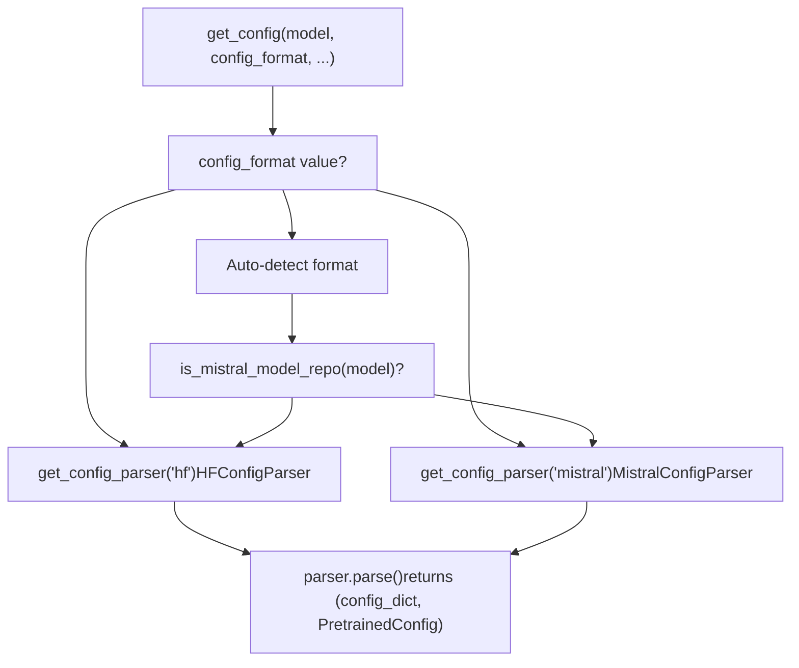
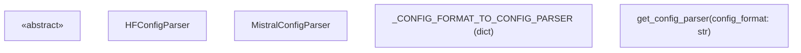
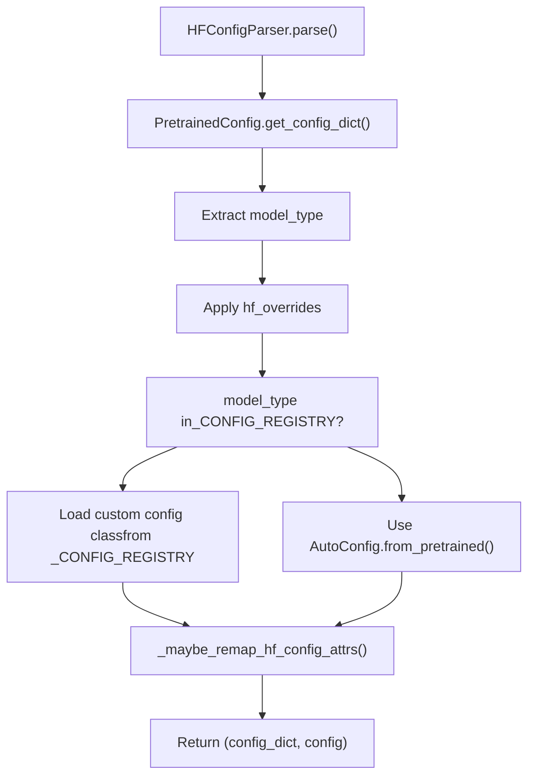
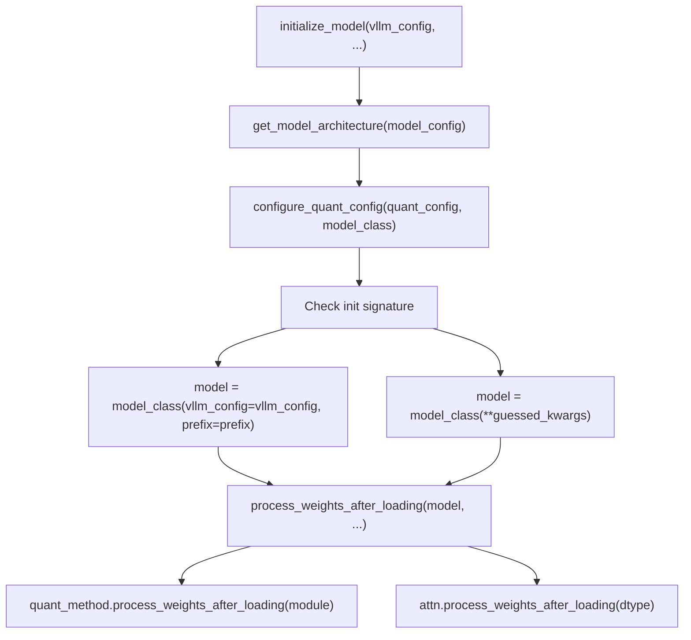

# 配置加载与解析

相关源文件

-   [docs/models/supported\_models.md](https://github.com/vllm-project/vllm/blob/7cc302dd/docs/models/supported_models.md?plain=1)
-   [examples/offline\_inference/audio\_language.py](https://github.com/vllm-project/vllm/blob/7cc302dd/examples/offline_inference/audio_language.py)
-   [examples/offline\_inference/vision\_language.py](https://github.com/vllm-project/vllm/blob/7cc302dd/examples/offline_inference/vision_language.py)
-   [examples/offline\_inference/vision\_language\_multi\_image.py](https://github.com/vllm-project/vllm/blob/7cc302dd/examples/offline_inference/vision_language_multi_image.py)
-   [tests/distributed/test\_pipeline\_parallel.py](https://github.com/vllm-project/vllm/blob/7cc302dd/tests/distributed/test_pipeline_parallel.py)
-   [tests/model\_executor/model\_loader/test\_ep\_weight\_filter.py](https://github.com/vllm-project/vllm/blob/7cc302dd/tests/model_executor/model_loader/test_ep_weight_filter.py)
-   [tests/model\_executor/model\_loader/test\_registry.py](https://github.com/vllm-project/vllm/blob/7cc302dd/tests/model_executor/model_loader/test_registry.py)
-   [tests/models/multimodal/generation/test\_common.py](https://github.com/vllm-project/vllm/blob/7cc302dd/tests/models/multimodal/generation/test_common.py)
-   [tests/models/multimodal/generation/vlm\_utils/model\_utils.py](https://github.com/vllm-project/vllm/blob/7cc302dd/tests/models/multimodal/generation/vlm_utils/model_utils.py)
-   [tests/models/multimodal/processing/test\_common.py](https://github.com/vllm-project/vllm/blob/7cc302dd/tests/models/multimodal/processing/test_common.py)
-   [tests/models/registry.py](https://github.com/vllm-project/vllm/blob/7cc302dd/tests/models/registry.py)
-   [tests/models/test\_initialization.py](https://github.com/vllm-project/vllm/blob/7cc302dd/tests/models/test_initialization.py)
-   [vllm/config/load.py](https://github.com/vllm-project/vllm/blob/7cc302dd/vllm/config/load.py)
-   [vllm/model\_executor/model\_loader/\_\_init\_\_.py](https://github.com/vllm-project/vllm/blob/7cc302dd/vllm/model_executor/model_loader/__init__.py)
-   [vllm/model\_executor/model\_loader/base\_loader.py](https://github.com/vllm-project/vllm/blob/7cc302dd/vllm/model_executor/model_loader/base_loader.py)
-   [vllm/model\_executor/model\_loader/bitsandbytes\_loader.py](https://github.com/vllm-project/vllm/blob/7cc302dd/vllm/model_executor/model_loader/bitsandbytes_loader.py)
-   [vllm/model\_executor/model\_loader/default\_loader.py](https://github.com/vllm-project/vllm/blob/7cc302dd/vllm/model_executor/model_loader/default_loader.py)
-   [vllm/model\_executor/model\_loader/dummy\_loader.py](https://github.com/vllm-project/vllm/blob/7cc302dd/vllm/model_executor/model_loader/dummy_loader.py)
-   [vllm/model\_executor/model\_loader/ep\_weight\_filter.py](https://github.com/vllm-project/vllm/blob/7cc302dd/vllm/model_executor/model_loader/ep_weight_filter.py)
-   [vllm/model\_executor/model\_loader/gguf\_loader.py](https://github.com/vllm-project/vllm/blob/7cc302dd/vllm/model_executor/model_loader/gguf_loader.py)
-   [vllm/model\_executor/model\_loader/runai\_streamer\_loader.py](https://github.com/vllm-project/vllm/blob/7cc302dd/vllm/model_executor/model_loader/runai_streamer_loader.py)
-   [vllm/model\_executor/model\_loader/sharded\_state\_loader.py](https://github.com/vllm-project/vllm/blob/7cc302dd/vllm/model_executor/model_loader/sharded_state_loader.py)
-   [vllm/model\_executor/model\_loader/tensorizer.py](https://github.com/vllm-project/vllm/blob/7cc302dd/vllm/model_executor/model_loader/tensorizer.py)
-   [vllm/model\_executor/model\_loader/tensorizer\_loader.py](https://github.com/vllm-project/vllm/blob/7cc302dd/vllm/model_executor/model_loader/tensorizer_loader.py)
-   [vllm/model\_executor/model\_loader/utils.py](https://github.com/vllm-project/vllm/blob/7cc302dd/vllm/model_executor/model_loader/utils.py)
-   [vllm/model\_executor/model\_loader/weight\_utils.py](https://github.com/vllm-project/vllm/blob/7cc302dd/vllm/model_executor/model_loader/weight_utils.py)
-   [vllm/model\_executor/models/mistral\_large\_3\_eagle.py](https://github.com/vllm-project/vllm/blob/7cc302dd/vllm/model_executor/models/mistral_large_3_eagle.py)
-   [vllm/model\_executor/models/registry.py](https://github.com/vllm-project/vllm/blob/7cc302dd/vllm/model_executor/models/registry.py)
-   [vllm/model\_executor/utils.py](https://github.com/vllm-project/vllm/blob/7cc302dd/vllm/model_executor/utils.py)
-   [vllm/transformers\_utils/config.py](https://github.com/vllm-project/vllm/blob/7cc302dd/vllm/transformers_utils/config.py)
-   [vllm/transformers\_utils/configs/\_\_init\_\_.py](https://github.com/vllm-project/vllm/blob/7cc302dd/vllm/transformers_utils/configs/__init__.py)
-   [vllm/transformers\_utils/configs/mistral.py](https://github.com/vllm-project/vllm/blob/7cc302dd/vllm/transformers_utils/configs/mistral.py)
-   [vllm/transformers\_utils/model\_arch\_config\_convertor.py](https://github.com/vllm-project/vllm/blob/7cc302dd/vllm/transformers_utils/model_arch_config_convertor.py)

本页记录 vLLM 如何从各种格式和来源加载模型配置。模型配置加载是一个关键步骤，发生在模型架构检测之后、模型实例化之前。该配置决定了模型的关键属性，例如层数、注意力机制、词表大小以及架构特定参数。

有关配置如何用于实例化模型，请参见 **Model Registry and Architecture Detection (5.1)**。有关 `ModelConfig` 和 `VllmConfig` 等配置对象的详细信息，请参见 **VllmConfig and Specialized Configuration Objects (2.2)**。

## 配置格式支持

`ConfigFormat` 类型别名定义了三种受支持的格式：

```
ConfigFormat = Literal["auto", "hf", "mistral"]
```
| 格式 | 说明 | 配置文件 | 主要用例 |
| --- | --- | --- | --- |
| `hf` | 标准 Transformers 格式 | `config.json` | 来自 HF Hub 或本地路径的大多数模型 |
| `mistral` | Mistral AI 原生格式 | `params.json` | Mistral 格式检查点 |
| `auto` | 运行时自动检测 | — | 先尝试 Mistral 检测，失败后回退到 HF |

> **关于 GGUF 的说明：** GGUF 格式模型并不是独立的 `config_format`。GGUF 检测（`is_gguf()`、`is_remote_gguf()`）在 `ModelConfig` 层执行，而 GGUF 元数据会通过 `maybe_patch_hf_config_from_gguf()` 修补到已加载的 HF 配置中。

### 格式检测流程

选择解析器并检测格式的逻辑由 `get_config()` 和 `get_config_parser()` 负责。

**`get_config_parser()` 分发与 `get_config()` 自动检测**


来源： [vllm/transformers\_utils/config.py237-253](https://github.com/vllm-project/vllm/blob/7cc302dd/vllm/transformers_utils/config.py#L237-L253) [vllm/transformers\_utils/repo\_utils.py29](https://github.com/vllm-project/vllm/blob/7cc302dd/vllm/transformers_utils/repo_utils.py#L29-L29) [vllm/transformers\_utils/gguf\_utils.py37-42](https://github.com/vllm-project/vllm/blob/7cc302dd/vllm/transformers_utils/gguf_utils.py#L37-L42)

## 配置解析器架构

配置加载系统以 `ConfigParserBase` 抽象类为核心，并为 HuggingFace 和 Mistral 格式提供具体实现。

**解析器类层次与关系**


**解析器工厂模式**

`get_config_parser()` 会查找 `_CONFIG_FORMAT_TO_CONFIG_PARSER` 并返回一个新的解析器实例。可通过 `@register_config_parser()` 装饰器注册自定义解析器，该装饰器会验证子类关系，并在覆盖已有注册时发出警告。

来源： [vllm/transformers\_utils/config.py155-234](https://github.com/vllm-project/vllm/blob/7cc302dd/vllm/transformers_utils/config.py#L155-L234) [vllm/transformers\_utils/config.py237-253](https://github.com/vllm-project/vllm/blob/7cc302dd/vllm/transformers_utils/config.py#L237-L253) [vllm/transformers\_utils/config.py255-303](https://github.com/vllm-project/vllm/blob/7cc302dd/vllm/transformers_utils/config.py#L255-L303)

## HuggingFace 配置加载

`HFConfigParser` 是默认解析器，负责处理大多数模型。它实现了一套解析流程，并集成了 vLLM 的自定义配置注册表。

**HuggingFace 配置加载流程**


### 自定义配置注册表 (`_CONFIG_REGISTRY`)

`_CONFIG_REGISTRY` 是一个 `LazyConfigDict`，它将来自 `config.json` 的 `model_type` 字符串映射到 vLLM 特定的 `PretrainedConfig` 子类。值以字符串类名形式延迟解析，并在首次访问时通过 `vllm.transformers_utils.configs` 进行加载，以尽量降低启动开销。

| `model_type` 键 | 配置类 | 说明 |
| --- | --- | --- |
| `afmoe` | `AfmoeConfig` | [vllm/transformers\_utils/config.py81](https://github.com/vllm-project/vllm/blob/7cc302dd/vllm/transformers_utils/config.py#L81-L81) |
| `deepseek_v32` | `DeepseekV3Config` | 将 V3.2 映射到 V3 [vllm/transformers\_utils/config.py90](https://github.com/vllm-project/vllm/blob/7cc302dd/vllm/transformers_utils/config.py#L90-L90) |
| `eagle` | `EAGLEConfig` | 投机解码 [vllm/transformers\_utils/config.py105](https://github.com/vllm-project/vllm/blob/7cc302dd/vllm/transformers_utils/config.py#L105-L105) |
| `RefinedWeb` | `RWConfig` | 用于 Falcon 模型 [vllm/transformers\_utils/config.py99-100](https://github.com/vllm-project/vllm/blob/7cc302dd/vllm/transformers_utils/config.py#L99-L100) |
| `speculators` | `SpeculatorsConfig` | [vllm/transformers\_utils/config.py106](https://github.com/vllm-project/vllm/blob/7cc302dd/vllm/transformers_utils/config.py#L106-L106) |
| `kimi_linear` | `KimiLinearConfig` | [vllm/transformers\_utils/config.py96](https://github.com/vllm-project/vllm/blob/7cc302dd/vllm/transformers_utils/config.py#L96-L96) |
| `lfm2_moe` | `Lfm2MoeConfig` | [vllm/transformers\_utils/config.py118](https://github.com/vllm-project/vllm/blob/7cc302dd/vllm/transformers_utils/config.py#L118-L118) |

来源： [vllm/transformers\_utils/config.py70-121](https://github.com/vllm-project/vllm/blob/7cc302dd/vllm/transformers_utils/config.py#L70-L121) [vllm/transformers\_utils/config.py155-196](https://github.com/vllm-project/vllm/blob/7cc302dd/vllm/transformers_utils/config.py#L155-L196) [vllm/transformers\_utils/configs/\_\_init\_\_.py17-73](https://github.com/vllm-project/vllm/blob/7cc302dd/vllm/transformers_utils/configs/__init__.py#L17-L73)

## Mistral 配置格式

Mistral AI 使用自定义配置格式，以 `params.json` 代替 HuggingFace 的 `config.json`。`MistralConfigParser` 会通过 `adapt_config_dict()` 将其适配为预期的 HuggingFace 风格结构。

**Mistral 配置适配**

解析器会下载 `params.json`，并通过 `adapt_config_dict()` 执行适配。如果某些字段（例如 `max_position_embeddings`）缺失，它会尝试从仓库中对应的 HuggingFace `config.json` 获取这些字段（如果该文件存在）。

来源： [vllm/transformers\_utils/config.py65](https://github.com/vllm-project/vllm/blob/7cc302dd/vllm/transformers_utils/config.py#L65-L65) [vllm/transformers\_utils/config.py198-234](https://github.com/vllm-project/vllm/blob/7cc302dd/vllm/transformers_utils/config.py#L198-L234)

## 配置后处理与补丁

### RoPE 参数补丁

RoPE（Rotary Position Embedding）参数通过 `patch_rope_parameters()` 在不同 Transformers 版本和模型实现之间进行标准化。它会处理诸如 `rotary_emb_base` 之类的旧字段名，并将 `rope_scaling` 标准化为现代的 `rope_parameters` 格式。

来源： [vllm/transformers\_utils/config.py306-399](https://github.com/vllm-project/vllm/blob/7cc302dd/vllm/transformers_utils/config.py#L306-L399) [vllm/transformers\_utils/config.py134-139](https://github.com/vllm-project/vllm/blob/7cc302dd/vllm/transformers_utils/config.py#L134-L139)

### 属性重映射与覆盖

vLLM 维护了一组映射，用于修正非标准配置属性，并提供架构特定的初始化覆盖。

-   **`_CONFIG_ATTRS_MAPPING`**：将 `llm_config` 等属性映射到 `text_config`，以确保内部一致性。
-   **`_AUTO_CONFIG_KWARGS_OVERRIDES`**：为某些架构提供特定的初始化标志（例如 `internvl_chat` 需要 `has_no_defaults_at_init: True`）。

来源： [vllm/transformers\_utils/config.py123-131](https://github.com/vllm-project/vllm/blob/7cc302dd/vllm/transformers_utils/config.py#L123-L131) [vllm/transformers\_utils/config.py476-483](https://github.com/vllm-project/vllm/blob/7cc302dd/vllm/transformers_utils/config.py#L476-L483)

## `hf_overrides` 机制

`hf_overrides` 参数允许用户在运行时以编程方式修改配置。它在 `HFConfigParser.parse()` 中处理：

1.  **直接字典**：如果提供的是字典，则会将其中的键应用到配置中。如果存在 `model_type`，它会在注册表查找之前覆盖来自 `config.json` 的值。
2.  **可调用对象**：如果提供的是可调用对象，则会先用一个空配置执行它，以确定目标 `model_type`；或者将其作用于最终的配置对象，以执行更复杂的修改。

来源： [vllm/transformers\_utils/config.py182-192](https://github.com/vllm-project/vllm/blob/7cc302dd/vllm/transformers_utils/config.py#L182-L192)

## 模型初始化与权重加载

完成配置解析后，模型会通过 `initialize_model` 进行初始化。该函数同时支持“新式”模型类（接受 `vllm_config` 和 `prefix`）以及“旧式”类（接受 `config`、`cache_config` 等），以保持向后兼容。

**初始化与加载后流程**


来源： [vllm/model\_executor/model\_loader/utils.py36-92](https://github.com/vllm-project/vllm/blob/7cc302dd/vllm/model_executor/model_loader/utils.py#L36-L92) [vllm/model\_executor/model\_loader/utils.py95-120](https://github.com/vllm-project/vllm/blob/7cc302dd/vllm/model_executor/model_loader/utils.py#L95-L120)
