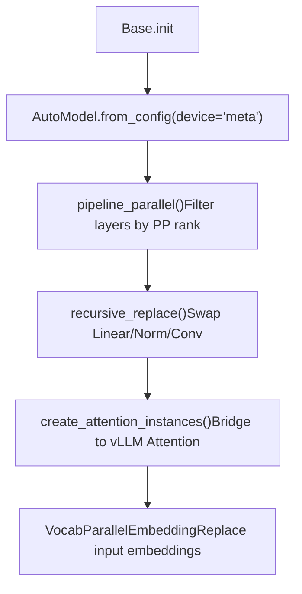

# Transformers 模型后端

相关源文件

-   [tests/models/multimodal/test\_mapping.py](https://github.com/vllm-project/vllm/blob/7cc302dd/tests/models/multimodal/test_mapping.py)
-   [tests/models/test\_transformers.py](https://github.com/vllm-project/vllm/blob/7cc302dd/tests/models/test_transformers.py)
-   [vllm/model\_executor/models/transformers/\_\_init\_\_.py](https://github.com/vllm-project/vllm/blob/7cc302dd/vllm/model_executor/models/transformers/__init__.py)
-   [vllm/model\_executor/models/transformers/base.py](https://github.com/vllm-project/vllm/blob/7cc302dd/vllm/model_executor/models/transformers/base.py)
-   [vllm/model\_executor/models/transformers/causal.py](https://github.com/vllm-project/vllm/blob/7cc302dd/vllm/model_executor/models/transformers/causal.py)
-   [vllm/model\_executor/models/transformers/legacy.py](https://github.com/vllm-project/vllm/blob/7cc302dd/vllm/model_executor/models/transformers/legacy.py)
-   [vllm/model\_executor/models/transformers/moe.py](https://github.com/vllm-project/vllm/blob/7cc302dd/vllm/model_executor/models/transformers/moe.py)
-   [vllm/model\_executor/models/transformers/multimodal.py](https://github.com/vllm-project/vllm/blob/7cc302dd/vllm/model_executor/models/transformers/multimodal.py)
-   [vllm/model\_executor/models/transformers/pooling.py](https://github.com/vllm-project/vllm/blob/7cc302dd/vllm/model_executor/models/transformers/pooling.py)
-   [vllm/model\_executor/models/transformers/utils.py](https://github.com/vllm-project/vllm/blob/7cc302dd/vllm/model_executor/models/transformers/utils.py)

## 目的与范围

Transformers 后端（[vllm/model\_executor/models/transformers/base.py17-100](https://github.com/vllm-project/vllm/blob/7cc302dd/vllm/model_executor/models/transformers/base.py#L17-L100)）使 vLLM 能够原生运行 Hugging Face Transformers 模型，而无需专门的 vLLM 模型实现。它封装了任何兼容的 `PreTrainedModel`，并将其与 vLLM 的分页 KV 缓存、张量并行、流水线并行、量化以及权重加载基础设施集成起来。

本页介绍该后端的类层次结构、模块替换逻辑、注意力集成、权重加载，以及由 mixin 组合出的具体模型类。

---

## 启用方式

该后端在启动时通过 `model_impl` 参数（或 `--model-impl` CLI 标志）选择。当注册表将架构名称解析到 `_get_transformers_backend_cls()` 时，加载器会选择 `vllm/model_executor/models/transformers/__init__.py` 中定义的具体类之一。

| `model_impl` 值 | 行为 |
| --- | --- |
| `"vllm"` | 使用 vLLM 的原生实现；如果不存在则报错。 |
| `"transformers"` | 始终使用 Transformers 后端。 |
| `"auto"` | 如果可用则使用 vLLM 的原生实现；否则带警告回退到 Transformers 后端。 |

来源： [tests/models/test\_transformers.py40-42](https://github.com/vllm-project/vllm/blob/7cc302dd/tests/models/test_transformers.py#L40-L42) [tests/models/test\_transformers.py60-67](https://github.com/vllm-project/vllm/blob/7cc302dd/tests/models/test_transformers.py#L60-L67) [tests/models/test\_transformers.py145-162](https://github.com/vllm-project/vllm/blob/7cc302dd/tests/models/test_transformers.py#L145-L162)

---

## 类层次结构与 mixin

该后端通过 Python 多重继承来组合。具体模型类是在 `Base` 类之上叠加各个 mixin 构建而成。

### Mixin 组合图

下图展示了不同模型能力如何混入 `Base` Transformers 类中。

来源： [vllm/model\_executor/models/transformers/base.py102-110](https://github.com/vllm-project/vllm/blob/7cc302dd/vllm/model_executor/models/transformers/base.py#L102-L110) [vllm/model\_executor/models/transformers/causal.py32-37](https://github.com/vllm-project/vllm/blob/7cc302dd/vllm/model_executor/models/transformers/causal.py#L32-L37) [vllm/model\_executor/models/transformers/moe.py119-123](https://github.com/vllm-project/vllm/blob/7cc302dd/vllm/model_executor/models/transformers/moe.py#L119-L123) [vllm/model\_executor/models/transformers/pooling.py33-46](https://github.com/vllm-project/vllm/blob/7cc302dd/vllm/model_executor/models/transformers/pooling.py#L33-L46) [vllm/model\_executor/models/transformers/pooling.py48-55](https://github.com/vllm-project/vllm/blob/7cc302dd/vllm/model_executor/models/transformers/pooling.py#L48-L55) [vllm/model\_executor/models/transformers/legacy.py29-31](https://github.com/vllm-project/vllm/blob/7cc302dd/vllm/model_executor/models/transformers/legacy.py#L29-L31)

### 具体模型类

这些具体类通过组合上述 mixin，为特定模型类型提供完整功能（例如因果语言模型、MoE、多模态）。

```mermaid
flowchart TD
    E["TransformersEmbeddingModel(EmbeddingMixin, LegacyMixin, Base)"]
    F["TransformersForSequenceClassification(SequenceClassificationMixin, LegacyMixin, Base)"]
    C["TransformersMultiModalForCausalLM(MultiModalMixin, CausalMixin, Base)"]
    D["TransformersMultiModalMoEForCausalLM(MoEMixin, MultiModalMixin, CausalMixin, Base)"]
    A["TransformersForCausalLM(CausalMixin, Base)"]
    B["TransformersMoEForCausalLM(MoEMixin, CausalMixin, Base)"]
```

来源： [vllm/model\_executor/models/transformers/\_\_init\_\_.py40-118](https://github.com/vllm-project/vllm/blob/7cc302dd/vllm/model_executor/models/transformers/__init__.py#L40-L118)

---

## `Base` 类实现

`Base` 类（[vllm/model\_executor/models/transformers/base.py102-110](https://github.com/vllm-project/vllm/blob/7cc302dd/vllm/model_executor/models/transformers/base.py#L102-L110)）负责管理底层 Hugging Face 模型的生命周期。

### 初始化流程

1.  **HF 模型创建**：使用 `AutoModel.from_config` 在 `meta` 设备上实例化模型。这会将缓冲区分配推迟到 vLLM 准备就绪时。
2.  **流水线并行**：`pipeline_parallel()` 会把不在当前 rank 上的层替换为 `PPMissingLayer`。
3.  **递归替换**：`recursive_replace()` 会将标准 `nn` 模块（Linear、RMSNorm、Conv）替换为 vLLM 优化过的张量并行版本。
4.  **注意力挂钩**：`create_attention_instances()` 会创建 `Attention` 对象，用于桥接 HF 的 forward 调用与 vLLM 的注意力后端。

来源： [vllm/model\_executor/models/transformers/base.py113-217](https://github.com/vllm-project/vllm/blob/7cc302dd/vllm/model_executor/models/transformers/base.py#L113-L217)

---

## 模块替换与并行

### Linear 和 Norm 替换

`Base.recursive_replace()` 使用工具函数将标准模块替换为并行版本：

-   **Linear**：`replace_linear_class` 会根据模型的并行规划，将 `nn.Linear` 转换为 `ColumnParallelLinear`、`RowParallelLinear` 或 `ReplicatedLinear`。
-   **Norm**：`replace_rms_norm_class` 通过检测权重初始化来判断某层是标准 `RMSNorm` 还是 `GemmaRMSNorm`。
-   **Conv**：`replace_conv_class` 会将 `nn.Conv2d`/`nn.Conv3d` 替换为 vLLM 的优化实现。

来源： [vllm/model\_executor/models/transformers/utils.py100-137](https://github.com/vllm-project/vllm/blob/7cc302dd/vllm/model_executor/models/transformers/utils.py#L100-L137) [vllm/model\_executor/models/transformers/utils.py144-176](https://github.com/vllm-project/vllm/blob/7cc302dd/vllm/model_executor/models/transformers/utils.py#L144-L176) [vllm/model\_executor/models/transformers/utils.py179-215](https://github.com/vllm-project/vllm/blob/7cc302dd/vllm/model_executor/models/transformers/utils.py#L179-L215) [vllm/model\_executor/models/transformers/base.py278-347](https://github.com/vllm-project/vllm/blob/7cc302dd/vllm/model_executor/models/transformers/base.py#L278-L347)

### 注意力集成

该后端会修补全局 Transformers 注意力注册表：`ALL_ATTENTION_FUNCTIONS["vllm"] = vllm_flash_attention_forward`

当调用模型的 attention forward 时，`vllm_flash_attention_forward` 会获取对应 `layer_idx` 的 `Attention` 实例，并执行 vLLM 的分页注意力逻辑。

来源： [vllm/model\_executor/models/transformers/base.py77-99](https://github.com/vllm-project/vllm/blob/7cc302dd/vllm/model_executor/models/transformers/base.py#L77-L99) [vllm/model\_executor/models/transformers/base.py349-405](https://github.com/vllm-project/vllm/blob/7cc302dd/vllm/model_executor/models/transformers/base.py#L349-L405)

---

## Mixture of Experts（MoE）支持

`MoEMixin`（[vllm/model\_executor/models/transformers/moe.py119-123](https://github.com/vllm-project/vllm/blob/7cc302dd/vllm/model_executor/models/transformers/moe.py#L119-L123)）使 Transformers 后端能够支持 Mixtral 或 OLMoE 等 MoE 架构。

### 融合 MoE 实现

它注册了一个自定义操作 `transformers_fused_moe`，该操作扩展了 vLLM 的 `FusedMoE`。与由 vLLM 负责路由计算的标准 MoE 不同，Transformers 后端假设 HF 模型已经计算好了 `topk_ids` 和 `topk_weights`。

-   **路由**：`TransformersFusedMoE` 中的 `custom_routing_function` 会通过 `transformers_moe_forward` 获取在 HF 前向过程中存储在该层中的 `topk_ids`。
-   **EP/TP 处理**：必要时，它会在 expert-parallel 或 data-parallel rank 之间对 `topk_ids` 执行 `all_gatherv`。

来源： [vllm/model\_executor/models/transformers/moe.py41-83](https://github.com/vllm-project/vllm/blob/7cc302dd/vllm/model_executor/models/transformers/moe.py#L41-L83) [vllm/model\_executor/models/transformers/moe.py86-97](https://github.com/vllm-project/vllm/blob/7cc302dd/vllm/model_executor/models/transformers/moe.py#L86-L97) [vllm/model\_executor/models/transformers/moe.py154-188](https://github.com/vllm-project/vllm/blob/7cc302dd/vllm/model_executor/models/transformers/moe.py#L154-L188)

---

## 多模态支持

`MultiModalMixin`（[vllm/model\_executor/models/transformers/multimodal.py17-140](https://github.com/vllm-project/vllm/blob/7cc302dd/vllm/model_executor/models/transformers/multimodal.py#L17-L140)）为视觉语言和其他多模态模型提供集成支持。

### 处理流程

它使用 `MultiModalProcessor` 来处理输入。`MultiModalProcessingInfo` 提供诸如 `get_max_image_tokens` 之类的元数据，该方法会根据图像分辨率以及底层 HF 处理器的逻辑来计算 token 配额。

-   **字段配置**：`_get_mm_fields_config` 定义多模态张量（如 `image_grid_thw` 或 `num_image_patches`）如何进行批处理和分片。
-   **虚拟输入**：`MultiModalDummyInputsBuilder` 生成用于内存剖析和图捕获的合成数据。

来源： [vllm/model\_executor/models/transformers/multimodal.py65-85](https://github.com/vllm-project/vllm/blob/7cc302dd/vllm/model_executor/models/transformers/multimodal.py#L65-L85) [vllm/model\_executor/models/transformers/multimodal.py120-162](https://github.com/vllm-project/vllm/blob/7cc302dd/vllm/model_executor/models/transformers/multimodal.py#L120-L162) [vllm/model\_executor/models/transformers/multimodal.py176-186](https://github.com/vllm-project/vllm/blob/7cc302dd/vllm/model_executor/models/transformers/multimodal.py#L176-L186)

---

## 权重加载基础设施

Transformers 后端使用 `WeightsMapper` 和 `AutoWeightsLoader` 将 Hugging Face 检查点键映射到 vLLM 内部结构。

### `WeightsMapper`

`WeightsMapper` 允许定义 regex、前缀或后缀映射。

-   **自动映射**：在初始化期间，`Base` 会创建一个映射器，用于处理从 HF 扁平检查点键到 vLLM 嵌套模块结构的转换。
-   **绑定权重**：如果词嵌入是绑定的，`CausalMixin` 会将 `lm_head.` 添加到 `skip_prefixes` 中，以避免重复加载。

### `AutoWeightsLoader`

`AutoWeightsLoader` 会对权重进行一次遍历式加载。它会检查某个模块是否实现了自定义的 `load_weights` 方法，或者某个参数是否具有 `weight_loader`。

来源： [vllm/model\_executor/models/transformers/base.py168-172](https://github.com/vllm-project/vllm/blob/7cc302dd/vllm/model_executor/models/transformers/base.py#L168-L172) [vllm/model\_executor/models/transformers/causal.py39-44](https://github.com/vllm-project/vllm/blob/7cc302dd/vllm/model_executor/models/transformers/causal.py#L39-L44) [tests/models/multimodal/test\_mapping.py111-115](https://github.com/vllm-project/vllm/blob/7cc302dd/tests/models/multimodal/test_mapping.py#L111-L115)

---

## 数据流：模型前向传播

`Base.forward` 中的前向传播将标准的 vLLM 执行流程（`input_ids`、`positions` 张量）桥接到 Hugging Face `PreTrainedModel` 接口。

1.  **输入准备**：根据流水线并行的 rank 处理 `input_ids` 或 `inputs_embeds`。
2.  **位置 ID**：根据 vLLM 的 `positions` 张量构造 `position_ids`。对于像 RoBERTa 这样的旧式模型，`LegacyMixin` 会对其进行调整以处理 padding 偏移。
3.  **HF 前向**：调用 `self.model(...)`，并传入 `attention_instances`，以确保已被修补的注意力函数能够找到自己的状态。
4.  **输出处理**：提取隐藏状态，并处理 `IntermediateTensors` 以支持流水线并行。

来源： [vllm/model\_executor/models/transformers/base.py440-493](https://github.com/vllm-project/vllm/blob/7cc302dd/vllm/model_executor/models/transformers/base.py#L440-L493) [vllm/model\_executor/models/transformers/legacy.py60-77](https://github.com/vllm-project/vllm/blob/7cc302dd/vllm/model_executor/models/transformers/legacy.py#L60-L77)

---

## 池化与序列分类

### `EmbeddingMixin`

为 embedding 任务附加 `DispatchPooler`。它默认使用 `"CLS"` 池化，并用于 `TransformersEmbeddingModel`。来源： [vllm/model\_executor/models/transformers/pooling.py33-46](https://github.com/vllm-project/vllm/blob/7cc302dd/vllm/model_executor/models/transformers/pooling.py#L33-L46)

### `SequenceClassificationMixin`

它会在 `meta` 设备上实例化 `AutoModelForSequenceClassification`，以提取分类头（`classifier` 或 `score`）。它使用 `ClassifierWithReshape` 将池化器输出（对序列维度进行 unsqueeze）桥接到分类头期望的输入形状。来源： [vllm/model\_executor/models/transformers/pooling.py48-103](https://github.com/vllm-project/vllm/blob/7cc302dd/vllm/model_executor/models/transformers/pooling.py#L48-L103)
