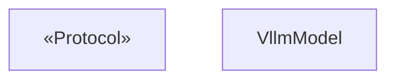
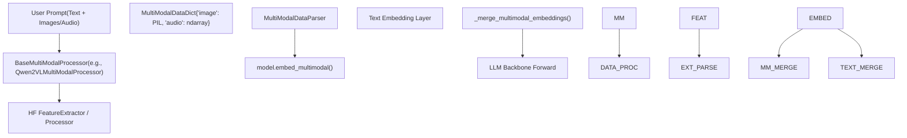

# 多模态模型支持

相关源文件

-   [examples/online\_serving/openai\_transcription\_client.py](https://github.com/vllm-project/vllm/blob/7cc302dd/examples/online_serving/openai_transcription_client.py)
-   [tests/entrypoints/openai/conftest.py](https://github.com/vllm-project/vllm/blob/7cc302dd/tests/entrypoints/openai/conftest.py)
-   [tests/entrypoints/pooling/classify/test\_online.py](https://github.com/vllm-project/vllm/blob/7cc302dd/tests/entrypoints/pooling/classify/test_online.py)
-   [tests/models/multimodal/processing/test\_minimax\_vl\_01.py](https://github.com/vllm-project/vllm/blob/7cc302dd/tests/models/multimodal/processing/test_minimax_vl_01.py)
-   [vllm/entrypoints/openai/generate/\_\_init\_\_.py](https://github.com/vllm-project/vllm/blob/7cc302dd/vllm/entrypoints/openai/generate/__init__.py)
-   [vllm/model\_executor/models/aimv2.py](https://github.com/vllm-project/vllm/blob/7cc302dd/vllm/model_executor/models/aimv2.py)
-   [vllm/model\_executor/models/aria.py](https://github.com/vllm-project/vllm/blob/7cc302dd/vllm/model_executor/models/aria.py)
-   [vllm/model\_executor/models/aya\_vision.py](https://github.com/vllm-project/vllm/blob/7cc302dd/vllm/model_executor/models/aya_vision.py)
-   [vllm/model\_executor/models/blip.py](https://github.com/vllm-project/vllm/blob/7cc302dd/vllm/model_executor/models/blip.py)
-   [vllm/model\_executor/models/blip2.py](https://github.com/vllm-project/vllm/blob/7cc302dd/vllm/model_executor/models/blip2.py)
-   [vllm/model\_executor/models/chameleon.py](https://github.com/vllm-project/vllm/blob/7cc302dd/vllm/model_executor/models/chameleon.py)
-   [vllm/model\_executor/models/cohere2\_vision.py](https://github.com/vllm-project/vllm/blob/7cc302dd/vllm/model_executor/models/cohere2_vision.py)
-   [vllm/model\_executor/models/deepseek\_vl2.py](https://github.com/vllm-project/vllm/blob/7cc302dd/vllm/model_executor/models/deepseek_vl2.py)
-   [vllm/model\_executor/models/dots\_ocr.py](https://github.com/vllm-project/vllm/blob/7cc302dd/vllm/model_executor/models/dots_ocr.py)
-   [vllm/model\_executor/models/eagle2\_5\_vl.py](https://github.com/vllm-project/vllm/blob/7cc302dd/vllm/model_executor/models/eagle2_5_vl.py)
-   [vllm/model\_executor/models/ernie45\_vl.py](https://github.com/vllm-project/vllm/blob/7cc302dd/vllm/model_executor/models/ernie45_vl.py)
-   [vllm/model\_executor/models/funaudiochat.py](https://github.com/vllm-project/vllm/blob/7cc302dd/vllm/model_executor/models/funaudiochat.py)
-   [vllm/model\_executor/models/fuyu.py](https://github.com/vllm-project/vllm/blob/7cc302dd/vllm/model_executor/models/fuyu.py)
-   [vllm/model\_executor/models/gemma3\_mm.py](https://github.com/vllm-project/vllm/blob/7cc302dd/vllm/model_executor/models/gemma3_mm.py)
-   [vllm/model\_executor/models/gemma3n.py](https://github.com/vllm-project/vllm/blob/7cc302dd/vllm/model_executor/models/gemma3n.py)
-   [vllm/model\_executor/models/gemma3n\_mm.py](https://github.com/vllm-project/vllm/blob/7cc302dd/vllm/model_executor/models/gemma3n_mm.py)
-   [vllm/model\_executor/models/glm4\_1v.py](https://github.com/vllm-project/vllm/blob/7cc302dd/vllm/model_executor/models/glm4_1v.py)
-   [vllm/model\_executor/models/glm4v.py](https://github.com/vllm-project/vllm/blob/7cc302dd/vllm/model_executor/models/glm4v.py)
-   [vllm/model\_executor/models/granite\_speech.py](https://github.com/vllm-project/vllm/blob/7cc302dd/vllm/model_executor/models/granite_speech.py)
-   [vllm/model\_executor/models/h2ovl.py](https://github.com/vllm-project/vllm/blob/7cc302dd/vllm/model_executor/models/h2ovl.py)
-   [vllm/model\_executor/models/hyperclovax\_vision.py](https://github.com/vllm-project/vllm/blob/7cc302dd/vllm/model_executor/models/hyperclovax_vision.py)
-   [vllm/model\_executor/models/idefics2\_vision\_model.py](https://github.com/vllm-project/vllm/blob/7cc302dd/vllm/model_executor/models/idefics2_vision_model.py)
-   [vllm/model\_executor/models/interfaces.py](https://github.com/vllm-project/vllm/blob/7cc302dd/vllm/model_executor/models/interfaces.py)
-   [vllm/model\_executor/models/intern\_vit.py](https://github.com/vllm-project/vllm/blob/7cc302dd/vllm/model_executor/models/intern_vit.py)
-   [vllm/model\_executor/models/interns1\_vit.py](https://github.com/vllm-project/vllm/blob/7cc302dd/vllm/model_executor/models/interns1_vit.py)
-   [vllm/model\_executor/models/keye.py](https://github.com/vllm-project/vllm/blob/7cc302dd/vllm/model_executor/models/keye.py)
-   [vllm/model\_executor/models/llava.py](https://github.com/vllm-project/vllm/blob/7cc302dd/vllm/model_executor/models/llava.py)
-   [vllm/model\_executor/models/llava\_next.py](https://github.com/vllm-project/vllm/blob/7cc302dd/vllm/model_executor/models/llava_next.py)
-   [vllm/model\_executor/models/llava\_next\_video.py](https://github.com/vllm-project/vllm/blob/7cc302dd/vllm/model_executor/models/llava_next_video.py)
-   [vllm/model\_executor/models/llava\_onevision.py](https://github.com/vllm-project/vllm/blob/7cc302dd/vllm/model_executor/models/llava_onevision.py)
-   [vllm/model\_executor/models/minicpmo.py](https://github.com/vllm-project/vllm/blob/7cc302dd/vllm/model_executor/models/minicpmo.py)
-   [vllm/model\_executor/models/minicpmv.py](https://github.com/vllm-project/vllm/blob/7cc302dd/vllm/model_executor/models/minicpmv.py)
-   [vllm/model\_executor/models/minimax\_vl\_01.py](https://github.com/vllm-project/vllm/blob/7cc302dd/vllm/model_executor/models/minimax_vl_01.py)
-   [vllm/model\_executor/models/mistral3.py](https://github.com/vllm-project/vllm/blob/7cc302dd/vllm/model_executor/models/mistral3.py)
-   [vllm/model\_executor/models/mllama4.py](https://github.com/vllm-project/vllm/blob/7cc302dd/vllm/model_executor/models/mllama4.py)
-   [vllm/model\_executor/models/molmo.py](https://github.com/vllm-project/vllm/blob/7cc302dd/vllm/model_executor/models/molmo.py)
-   [vllm/model\_executor/models/openpangu\_vl.py](https://github.com/vllm-project/vllm/blob/7cc302dd/vllm/model_executor/models/openpangu_vl.py)
-   [vllm/model\_executor/models/paddleocr\_vl.py](https://github.com/vllm-project/vllm/blob/7cc302dd/vllm/model_executor/models/paddleocr_vl.py)
-   [vllm/model\_executor/models/paligemma.py](https://github.com/vllm-project/vllm/blob/7cc302dd/vllm/model_executor/models/paligemma.py)
-   [vllm/model\_executor/models/phi3v.py](https://github.com/vllm-project/vllm/blob/7cc302dd/vllm/model_executor/models/phi3v.py)
-   [vllm/model\_executor/models/phi4mm.py](https://github.com/vllm-project/vllm/blob/7cc302dd/vllm/model_executor/models/phi4mm.py)
-   [vllm/model\_executor/models/pixtral.py](https://github.com/vllm-project/vllm/blob/7cc302dd/vllm/model_executor/models/pixtral.py)
-   [vllm/model\_executor/models/qwen2\_5\_omni\_thinker.py](https://github.com/vllm-project/vllm/blob/7cc302dd/vllm/model_executor/models/qwen2_5_omni_thinker.py)
-   [vllm/model\_executor/models/qwen2\_5\_vl.py](https://github.com/vllm-project/vllm/blob/7cc302dd/vllm/model_executor/models/qwen2_5_vl.py)
-   [vllm/model\_executor/models/qwen2\_vl.py](https://github.com/vllm-project/vllm/blob/7cc302dd/vllm/model_executor/models/qwen2_vl.py)
-   [vllm/model\_executor/models/qwen3\_asr.py](https://github.com/vllm-project/vllm/blob/7cc302dd/vllm/model_executor/models/qwen3_asr.py)
-   [vllm/model\_executor/models/qwen3\_omni\_moe\_thinker.py](https://github.com/vllm-project/vllm/blob/7cc302dd/vllm/model_executor/models/qwen3_omni_moe_thinker.py)
-   [vllm/model\_executor/models/qwen3\_vl.py](https://github.com/vllm-project/vllm/blob/7cc302dd/vllm/model_executor/models/qwen3_vl.py)
-   [vllm/model\_executor/models/qwen\_vl.py](https://github.com/vllm-project/vllm/blob/7cc302dd/vllm/model_executor/models/qwen_vl.py)
-   [vllm/model\_executor/models/siglip2navit.py](https://github.com/vllm-project/vllm/blob/7cc302dd/vllm/model_executor/models/siglip2navit.py)
-   [vllm/model\_executor/models/step3\_vl.py](https://github.com/vllm-project/vllm/blob/7cc302dd/vllm/model_executor/models/step3_vl.py)
-   [vllm/model\_executor/models/step\_vl.py](https://github.com/vllm-project/vllm/blob/7cc302dd/vllm/model_executor/models/step_vl.py)
-   [vllm/model\_executor/models/tarsier.py](https://github.com/vllm-project/vllm/blob/7cc302dd/vllm/model_executor/models/tarsier.py)
-   [vllm/model\_executor/models/terratorch.py](https://github.com/vllm-project/vllm/blob/7cc302dd/vllm/model_executor/models/terratorch.py)
-   [vllm/model\_executor/models/vision.py](https://github.com/vllm-project/vllm/blob/7cc302dd/vllm/model_executor/models/vision.py)
-   [vllm/model\_executor/models/voxtral.py](https://github.com/vllm-project/vllm/blob/7cc302dd/vllm/model_executor/models/voxtral.py)
-   [vllm/model\_executor/models/whisper.py](https://github.com/vllm-project/vllm/blob/7cc302dd/vllm/model_executor/models/whisper.py)
-   [vllm/transformers\_utils/processors/internvl.py](https://github.com/vllm-project/vllm/blob/7cc302dd/vllm/transformers_utils/processors/internvl.py)
-   [vllm/transformers\_utils/processors/kimi\_k25.py](https://github.com/vllm-project/vllm/blob/7cc302dd/vllm/transformers_utils/processors/kimi_k25.py)
-   [vllm/transformers\_utils/processors/step3\_vl.py](https://github.com/vllm-project/vllm/blob/7cc302dd/vllm/transformers_utils/processors/step3_vl.py)

## 目的与范围

本页记录 vLLM 的多模态模型支持系统，涵盖架构接口、受支持的模态（图像、视频、音频）以及从原始输入到模型嵌入的数据流。它详细说明了将 HuggingFace 架构映射到 vLLM 实现的注册机制，以及处理多样化多模态数据所需的专门流程。

vLLM 支持广泛的多模态架构，包括 Qwen2.5-VL 和 LLaVA 这类视觉语言模型（VLM），以及 Whisper 和 Voxtral 这类音频模型。

**来源：**

-   [vllm/model\_executor/models/interfaces.py89-206](https://github.com/vllm-project/vllm/blob/7cc302dd/vllm/model_executor/models/interfaces.py#L89-L206)
-   [vllm/multimodal/inputs.py1-80](https://github.com/vllm-project/vllm/blob/7cc302dd/vllm/multimodal/inputs.py#L1-L80)

## 模型架构与接口

vLLM 在 `vllm/model_executor/models/interfaces.py` 中定义了一组标准的 Python Protocol（接口），多模态模型必须实现这些接口才能集成到引擎的执行流水线中。

### `SupportsMultiModal` 接口

任何支持多模态输入的模型都必须实现 `SupportsMultiModal` 协议。该接口确保模型能够处理非文本数据，并为引擎的调度器和内存管理器提供必要的元数据。

-   **`embed_multimodal`**：这是核心功能要求。它接收多模态关键字参数（例如 `pixel_values`、`image_grid_thw`），并返回要与文本嵌入合并的 `MultiModalEmbeddings`（张量）。 [vllm/model\_executor/models/interfaces.py153-163](https://github.com/vllm-project/vllm/blob/7cc302dd/vllm/model_executor/models/interfaces.py#L153-L163)
-   **`get_language_model`**：返回底层语言模型（通常是仅解码器骨干），该模型负责处理合并后的嵌入。 [vllm/model\_executor/models/interfaces.py176-211](https://github.com/vllm-project/vllm/blob/7cc302dd/vllm/model_executor/models/interfaces.py#L176-L211)
-   **`configure_mm_token_handling`**：处理多模态占位符 token 处于词表外（OOV）的情况，确保它们在文本嵌入查找时被屏蔽。 [vllm/model\_executor/models/interfaces.py165-174](https://github.com/vllm-project/vllm/blob/7cc302dd/vllm/model_executor/models/interfaces.py#L165-L174)

**来源：**

-   [vllm/model\_executor/models/interfaces.py94-211](https://github.com/vllm-project/vllm/blob/7cc302dd/vllm/model_executor/models/interfaces.py#L94-L211)

### 专用多模态接口

模型还可以实现额外接口，以表明其支持特定功能：

| 接口 | 作用 |
| --- | --- |
| `SupportsMRoPE` | 表示支持多模态旋转位置嵌入（MRoPE），用于 Qwen2.5-VL 等模型。 [vllm/model\_executor/models/interfaces.py255-263](https://github.com/vllm-project/vllm/blob/7cc302dd/vllm/model_executor/models/interfaces.py#L255-L263) |
| `SupportsTranscription` | 用于执行语音转文本的音频模型，需要特定的输出处理。 [vllm/model\_executor/models/interfaces.py266-274](https://github.com/vllm-project/vllm/blob/7cc302dd/vllm/model_executor/models/interfaces.py#L266-L274) |
| `SupportsMultiModalPruning` | 允许模型在进入 LLM backbone 之前剪枝或压缩多模态 token。 [vllm/model\_executor/models/interfaces.py245-252](https://github.com/vllm-project/vllm/blob/7cc302dd/vllm/model_executor/models/interfaces.py#L245-L252) |
| `SupportsEncoderCudaGraph` | 表示多模态编码器支持用于性能优化的 CUDA Graph 捕获。 [vllm/model\_executor/models/qwen3\_vl.py106](https://github.com/vllm-project/vllm/blob/7cc302dd/vllm/model_executor/models/qwen3_vl.py#L106-L106) |

**来源：**

-   [vllm/model\_executor/models/interfaces.py245-274](https://github.com/vllm-project/vllm/blob/7cc302dd/vllm/model_executor/models/interfaces.py#L245-L274)
-   [vllm/model\_executor/models/qwen3\_vl.py102-113](https://github.com/vllm-project/vllm/blob/7cc302dd/vllm/model_executor/models/qwen3_vl.py#L102-L113)

## 数据流：从输入到嵌入

下图连接了 **自然语言空间**（用户提示）与 **代码实体空间**（vLLM 的类和张量）。

### 多模态输入处理流水线

**来源：**

-   [vllm/model\_executor/models/qwen2\_vl.py81-87](https://github.com/vllm-project/vllm/blob/7cc302dd/vllm/model_executor/models/qwen2_vl.py#L81-L87)
-   [vllm/model\_executor/models/qwen3\_vl.py89-95](https://github.com/vllm-project/vllm/blob/7cc302dd/vllm/model_executor/models/qwen3_vl.py#L89-L95)
-   [vllm/model\_executor/models/utils.py133-135](https://github.com/vllm-project/vllm/blob/7cc302dd/vllm/model_executor/models/utils.py#L133-L135)

## 支持的模态与模型实现

vLLM 支持多种模态，每种模态都有通过 `TensorSchema` 定义的特定输入模式。

### 1\. 图像模态

大多数视觉语言模型（VLM）都将 `pixel_values` 作为主要输入。

-   **示例实现**：`LlavaForConditionalGeneration` 使用 `LlavaMultiModalProjector` 将 CLIP/SigLIP 视觉特征映射到 LLM 的隐藏维度。 [vllm/model\_executor/models/llava.py130-162](https://github.com/vllm-project/vllm/blob/7cc302dd/vllm/model_executor/models/llava.py#L130-L162)
-   **高级特性**：像 `Qwen2_5_VL` 这样的模型通过 `image_grid_thw` 张量支持动态分辨率，这些张量表示补丁的时间、高度和宽度网格。 [vllm/model\_executor/models/qwen2\_5\_vl.py123-149](https://github.com/vllm-project/vllm/blob/7cc302dd/vllm/model_executor/models/qwen2_5_vl.py#L123-L149)
-   **Gemma 3**：使用 `Gemma3ImagePixelInputs` 跟踪每张图像的 `num_patches`，以处理 “pan and scan” 裁剪。 [vllm/model\_executor/models/gemma3\_mm.py57-75](https://github.com/vllm-project/vllm/blob/7cc302dd/vllm/model_executor/models/gemma3_mm.py#L57-L75)

### 2\. 视频模态

视频通常被视为一系列帧或一个三维补丁体。

-   **输入模式**：`pixel_values_videos` 通常具有 `(num_patches, channels * temporal_patch_size * patch_size * patch_size)` 这样的维度。 [vllm/model\_executor/models/qwen2\_5\_vl.py184-215](https://github.com/vllm-project/vllm/blob/7cc302dd/vllm/model_executor/models/qwen2_5_vl.py#L184-L215)
-   **时序处理**：像 `Qwen3_VL` 这样的模型在其视觉编码器中使用 `Conv3dLayer` 来处理跨帧的时序信息。 [vllm/model\_executor/models/qwen3\_vl.py149-175](https://github.com/vllm-project/vllm/blob/7cc302dd/vllm/model_executor/models/qwen3_vl.py#L149-L175)

### 3\. 音频模态

音频模型处理波形或梅尔频谱图。

-   **输入模式**：`WhisperAudioInputs` 期望形状为 `(batch, num_mel_bins, time_frames)` 的 `input_features`。 [vllm/model\_executor/models/whisper.py95-108](https://github.com/vllm-project/vllm/blob/7cc302dd/vllm/model_executor/models/whisper.py#L95-L108)
-   **Omni 模型**：像 `Qwen2_5-Omni` 和 `Qwen3-Omni-Moe` 这样的模型可以通过 `merge_interleaved_embeddings` 基于 token 位置合并嵌入，从而处理交错的音频和视频。 [vllm/model\_executor/models/qwen2\_5\_omni\_thinker.py162-192](https://github.com/vllm-project/vllm/blob/7cc302dd/vllm/model_executor/models/qwen2_5_omni_thinker.py#L162-L192) [vllm/model\_executor/models/qwen3\_omni\_moe\_thinker.py90-97](https://github.com/vllm-project/vllm/blob/7cc302dd/vllm/model_executor/models/qwen3_omni_moe_thinker.py#L90-L97)

**来源：**

-   [vllm/model\_executor/models/qwen2\_5\_vl.py123-215](https://github.com/vllm-project/vllm/blob/7cc302dd/vllm/model_executor/models/qwen2_5_vl.py#L123-L215)
-   [vllm/model\_executor/models/whisper.py95-108](https://github.com/vllm-project/vllm/blob/7cc302dd/vllm/model_executor/models/whisper.py#L95-L108)
-   [vllm/model\_executor/models/gemma3\_mm.py57-75](https://github.com/vllm-project/vllm/blob/7cc302dd/vllm/model_executor/models/gemma3_mm.py#L57-L75)

## 关键实现细节

### 嵌入合并逻辑

多模态推理中的一个关键步骤，是将视觉/音频嵌入正确放置到文本嵌入序列中占位符 token 所在的位置。

-   **函数**：`_merge_multimodal_embeddings`（位于 `vllm/model_executor/models/utils.py`）
-   **逻辑**：它使用布尔掩码 `is_multimodal` 来识别输入序列中多模态 token 的位置，并将 `embed_multimodal` 返回的特征散布到这些位置。 [vllm/model\_executor/models/qwen3\_vl.py133-135](https://github.com/vllm-project/vllm/blob/7cc302dd/vllm/model_executor/models/qwen3_vl.py#L133-L135)
-   **交错数据**：对于 “Omni” 模型，`check_interleaved_audio_video` 会判断音频和视频 token 是否在单个连续区域内交错出现，并据此触发专门的合并逻辑。 [vllm/model\_executor/models/qwen2\_5\_omni\_thinker.py117-159](https://github.com/vllm-project/vllm/blob/7cc302dd/vllm/model_executor/models/qwen2_5_omni_thinker.py#L117-L159)

### 多模态旋转位置嵌入（MRoPE）

MRoPE 将标准 RoPE 扩展到多个维度（时间、高度、宽度），以更好地表示图像和视频中的空间与时间关系。

-   **实现**：`compute_mrope_for_media` 工具会根据视觉补丁的网格坐标，计算特定的旋转偏移量。 [vllm/model\_executor/models/qwen2\_5\_vl.py71-76](https://github.com/vllm-project/vllm/blob/7cc302dd/vllm/model_executor/models/qwen2_5_vl.py#L71-L76)
-   **执行**：`run_dp_sharded_mrope_vision_model` 函数允许在数据并行（DP）rank 之间运行带 MRoPE 的视觉编码器。 [vllm/model\_executor/models/qwen2\_5\_vl.py112-116](https://github.com/vllm-project/vllm/blob/7cc302dd/vllm/model_executor/models/qwen2_5_vl.py#L112-L116)

**来源：**

-   [vllm/model\_executor/models/qwen2\_5\_omni\_thinker.py117-192](https://github.com/vllm-project/vllm/blob/7cc302dd/vllm/model_executor/models/qwen2_5_omni_thinker.py#L117-L192)
-   [vllm/model\_executor/models/qwen2\_5\_vl.py71-116](https://github.com/vllm-project/vllm/blob/7cc302dd/vllm/model_executor/models/qwen2_5_vl.py#L71-L116)

## 模型特定要求表

| 模型族 | 主要模态 | 关键类 / 函数 |
| --- | --- | --- |
| **Qwen2.5-VL** | 图像、视频 | `Qwen2_5_VLImagePixelInputs`、`Qwen2_5_VisionTransformer` [vllm/model\_executor/models/qwen2\_5\_vl.py123-215](https://github.com/vllm-project/vllm/blob/7cc302dd/vllm/model_executor/models/qwen2_5_vl.py#L123-L215) |
| **Qwen3-VL** | 图像、视频 | `Qwen3_VisionPatchEmbed`、`MMEncoderAttention` [vllm/model\_executor/models/qwen3\_vl.py149-175](https://github.com/vllm-project/vllm/blob/7cc302dd/vllm/model_executor/models/qwen3_vl.py#L149-L175) |
| **Pixtral** | 图像 | `PixtralMultiModalProcessor`、`MistralCommonPixtralProcessor` [vllm/model\_executor/models/pixtral.py64-209](https://github.com/vllm-project/vllm/blob/7cc302dd/vllm/model_executor/models/pixtral.py#L64-L209) |
| **Whisper** | 音频 | `WhisperEncoder`、`WhisperEncoderAttention` [vllm/model\_executor/models/whisper.py28-134](https://github.com/vllm-project/vllm/blob/7cc302dd/vllm/model_executor/models/whisper.py#L28-L134) |
| **Gemma 3** | 图像 | `Gemma3ProcessingInfo`、`SiglipVisionModel` [vllm/model\_executor/models/gemma3\_mm.py46-78](https://github.com/vllm-project/vllm/blob/7cc302dd/vllm/model_executor/models/gemma3_mm.py#L46-L78) |
| **Voxtral** | 音频 | `VoxtralMultiModalProcessor`、`WhisperCausalEncoder` [vllm/model\_executor/models/voxtral.py32-197](https://github.com/vllm-project/vllm/blob/7cc302dd/vllm/model_executor/models/voxtral.py#L32-L197) |
| **Llama 4** | 图像 | `Llama4ImagePatchInputs`、`Llama4VisionPixelShuffleMLP` [vllm/model\_executor/models/mllama4.py85-205](https://github.com/vllm-project/vllm/blob/7cc302dd/vllm/model_executor/models/mllama4.py#L85-L205) |

**来源：**

-   [vllm/model\_executor/models/qwen2\_5\_vl.py123-215](https://github.com/vllm-project/vllm/blob/7cc302dd/vllm/model_executor/models/qwen2_5_vl.py#L123-L215)
-   [vllm/model\_executor/models/qwen3\_vl.py149-175](https://github.com/vllm-project/vllm/blob/7cc302dd/vllm/model_executor/models/qwen3_vl.py#L149-L175)
-   [vllm/model\_executor/models/pixtral.py64-209](https://github.com/vllm-project/vllm/blob/7cc302dd/vllm/model_executor/models/pixtral.py#L64-L209)
-   [vllm/model\_executor/models/whisper.py28-134](https://github.com/vllm-project/vllm/blob/7cc302dd/vllm/model_executor/models/whisper.py#L28-L134)
-   [vllm/model\_executor/models/gemma3\_mm.py46-78](https://github.com/vllm-project/vllm/blob/7cc302dd/vllm/model_executor/models/gemma3_mm.py#L46-L78)
-   [vllm/model\_executor/models/voxtral.py32-197](https://github.com/vllm-project/vllm/blob/7cc302dd/vllm/model_executor/models/voxtral.py#L32-L197)
-   [vllm/model\_executor/models/mllama4.py85-205](https://github.com/vllm-project/vllm/blob/7cc302dd/vllm/model_executor/models/mllama4.py#L85-L205)
