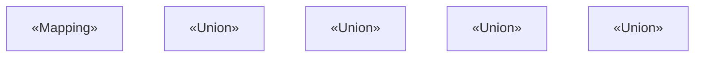
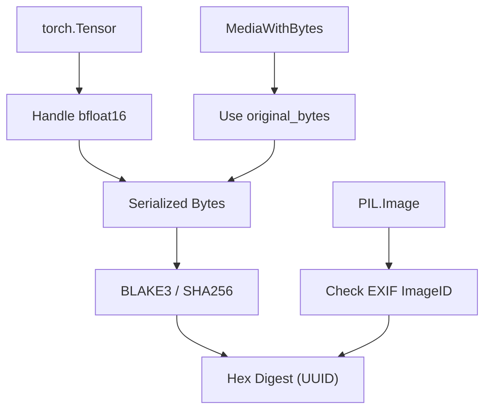

# 多模态数据处理

相关源文件

-   [tests/entrypoints/pooling/embed/test\_online\_vision.py](https://github.com/vllm-project/vllm/blob/7cc302dd/tests/entrypoints/pooling/embed/test_online_vision.py)
-   [tests/models/multimodal/processing/test\_mllama4.py](https://github.com/vllm-project/vllm/blob/7cc302dd/tests/models/multimodal/processing/test_mllama4.py)
-   [tests/multimodal/assets/corrupted.mp4](https://github.com/vllm-project/vllm/blob/7cc302dd/tests/multimodal/assets/corrupted.mp4)
-   [tests/multimodal/assets/image1.png](https://github.com/vllm-project/vllm/blob/7cc302dd/tests/multimodal/assets/image1.png)
-   [tests/multimodal/assets/image2.png](https://github.com/vllm-project/vllm/blob/7cc302dd/tests/multimodal/assets/image2.png)
-   [tests/multimodal/media/test\_connector.py](https://github.com/vllm-project/vllm/blob/7cc302dd/tests/multimodal/media/test_connector.py)
-   [tests/multimodal/test\_hasher.py](https://github.com/vllm-project/vllm/blob/7cc302dd/tests/multimodal/test_hasher.py)
-   [tests/multimodal/test\_image.py](https://github.com/vllm-project/vllm/blob/7cc302dd/tests/multimodal/test_image.py)
-   [tests/multimodal/test\_inputs.py](https://github.com/vllm-project/vllm/blob/7cc302dd/tests/multimodal/test_inputs.py)
-   [tests/multimodal/test\_processing.py](https://github.com/vllm-project/vllm/blob/7cc302dd/tests/multimodal/test_processing.py)
-   [tests/multimodal/test\_utils.py](https://github.com/vllm-project/vllm/blob/7cc302dd/tests/multimodal/test_utils.py)
-   [tests/multimodal/test\_video.py](https://github.com/vllm-project/vllm/blob/7cc302dd/tests/multimodal/test_video.py)
-   [tests/multimodal/utils.py](https://github.com/vllm-project/vllm/blob/7cc302dd/tests/multimodal/utils.py)
-   [tests/test\_inputs.py](https://github.com/vllm-project/vllm/blob/7cc302dd/tests/test_inputs.py)
-   [tests/v1/core/test\_encoder\_cache\_manager.py](https://github.com/vllm-project/vllm/blob/7cc302dd/tests/v1/core/test_encoder_cache_manager.py)
-   [vllm/inputs/preprocess.py](https://github.com/vllm-project/vllm/blob/7cc302dd/vllm/inputs/preprocess.py)
-   [vllm/model\_executor/models/keye\_vl1\_5.py](https://github.com/vllm-project/vllm/blob/7cc302dd/vllm/model_executor/models/keye_vl1_5.py)
-   [vllm/model\_executor/models/kimi\_k25.py](https://github.com/vllm-project/vllm/blob/7cc302dd/vllm/model_executor/models/kimi_k25.py)
-   [vllm/model\_executor/models/kimi\_k25\_vit.py](https://github.com/vllm-project/vllm/blob/7cc302dd/vllm/model_executor/models/kimi_k25_vit.py)
-   [vllm/multimodal/\_\_init\_\_.py](https://github.com/vllm-project/vllm/blob/7cc302dd/vllm/multimodal/__init__.py)
-   [vllm/multimodal/hasher.py](https://github.com/vllm-project/vllm/blob/7cc302dd/vllm/multimodal/hasher.py)
-   [vllm/multimodal/image.py](https://github.com/vllm-project/vllm/blob/7cc302dd/vllm/multimodal/image.py)
-   [vllm/multimodal/inputs.py](https://github.com/vllm-project/vllm/blob/7cc302dd/vllm/multimodal/inputs.py)
-   [vllm/multimodal/media/\_\_init\_\_.py](https://github.com/vllm-project/vllm/blob/7cc302dd/vllm/multimodal/media/__init__.py)
-   [vllm/multimodal/media/connector.py](https://github.com/vllm-project/vllm/blob/7cc302dd/vllm/multimodal/media/connector.py)
-   [vllm/multimodal/processing/context.py](https://github.com/vllm-project/vllm/blob/7cc302dd/vllm/multimodal/processing/context.py)
-   [vllm/multimodal/processing/processor.py](https://github.com/vllm-project/vllm/blob/7cc302dd/vllm/multimodal/processing/processor.py)
-   [vllm/multimodal/registry.py](https://github.com/vllm-project/vllm/blob/7cc302dd/vllm/multimodal/registry.py)
-   [vllm/multimodal/utils.py](https://github.com/vllm-project/vllm/blob/7cc302dd/vllm/multimodal/utils.py)
-   [vllm/multimodal/video.py](https://github.com/vllm-project/vllm/blob/7cc302dd/vllm/multimodal/video.py)
-   [vllm/transformers\_utils/processor.py](https://github.com/vllm-project/vllm/blob/7cc302dd/vllm/transformers_utils/processor.py)
-   [vllm/transformers\_utils/processors/isaac.py](https://github.com/vllm-project/vllm/blob/7cc302dd/vllm/transformers_utils/processors/isaac.py)
-   [vllm/transformers\_utils/processors/pixtral.py](https://github.com/vllm-project/vllm/blob/7cc302dd/vllm/transformers_utils/processors/pixtral.py)
-   [vllm/transformers\_utils/processors/voxtral.py](https://github.com/vllm-project/vllm/blob/7cc302dd/vllm/transformers_utils/processors/voxtral.py)
-   [vllm/v1/attention/selector.py](https://github.com/vllm-project/vllm/blob/7cc302dd/vllm/v1/attention/selector.py)
-   [vllm/v1/core/encoder\_cache\_manager.py](https://github.com/vllm-project/vllm/blob/7cc302dd/vllm/v1/core/encoder_cache_manager.py)

vLLM 中的多模态数据处理负责将图像、音频、视频和嵌入从各种格式转换为多模态模型所需的内部表示。这包括解析包含多模态内容的聊天消息、处理不同输入格式（PIL 图像、URL、base64、嵌入），以及为模型执行准备数据。

## 概览

多模态处理流水线由几个关键阶段组成：

1.  **聊天消息解析** - 从兼容 OpenAI 的聊天消息中提取多模态内容。
2.  **内容片段处理** - 将不同的内容格式（URL、PIL 图像、嵌入）转换为标准表示。
3.  **MultiModalDataDict 组装** - 按模态组织已处理的数据。
4.  **模型特定处理** - 通过 `BaseMultiModalProcessor` 应用模型特定转换。

**高级处理流程**

```mermaid
flowchart TD
    CHAT["OpenAIChatCompletionMessageParam"]
    DICT["PromptType{prompt, multi_modal_data}"]
    EXTRACT["Extract content parts"]
    PARSE_IMG["_parse_chat_message_content_part()"]
    PARSE_AUD["_parse_chat_message_content_part()"]
    PARSE_VID["_parse_chat_message_content_part()"]
    MM_DICT["MultiModalDataDict"]
    IMG_LIST["image: ModalityData[ImageItem]"]
    AUD_LIST["audio: ModalityData[AudioItem]"]
    VID_LIST["video: ModalityData[VideoItem]"]
    EMB_DICT["image_embeds: str | dict"]
    MM_REG["MultiModalRegistry"]
    MM_PROC["BaseMultiModalProcessor"]
    MM_INPUT["MultiModalInputs"]

    CHAT --> EXTRACT
    DICT --> MM_DICT
    EXTRACT --> PARSE_IMG
    EXTRACT --> PARSE_AUD
    EXTRACT --> PARSE_VID
    PARSE --> IMG_IMG_LIST
    PARSE --> AUD_AUD_LIST
    PARSE --> VID_VID_LIST
    IMG --> LIST_MM_DICT
    AUD --> LIST_MM_DICT
    VID --> LIST_MM_DICT
    MM --> DICT_MM_REG
    MM --> REG_MM_PROC
    MM --> PROC_MM_INPUT
```


**来源：** [vllm/multimodal/registry.py98-132](https://github.com/vllm-project/vllm/blob/7cc302dd/vllm/multimodal/registry.py#L98-L132) [vllm/inputs/preprocess.py90-109](https://github.com/vllm-project/vllm/blob/7cc302dd/vllm/inputs/preprocess.py#L90-L109) [vllm/multimodal/processing/processor.py22-28](https://github.com/vllm-project/vllm/blob/7cc302dd/vllm/multimodal/processing/processor.py#L22-L28)

## MultiModalDataDict 结构

`MultiModalDataDict` 是一种类型别名，用于表示按模态组织多模态数据的映射。它作为通过 `LLM.generate` 或 `LLM.chat` 接口向 vLLM 模型传递多模态输入的标准容器。

**MultiModalDataDict 类型结构**


**模态类型**

| 模态 | 类型 | 说明 |
| --- | --- | --- |
| `image` | `ModalityData[ImageItem]` | 单张或多张图像（PIL、Tensor 或 Media 包装器）。 [vllm/multimodal/inputs.py58-66](https://github.com/vllm-project/vllm/blob/7cc302dd/vllm/multimodal/inputs.py#L58-L66) |
| `audio` | `ModalityData[AudioItem]` | 音频数据，通常是 `(waveform, sample_rate)` 或嵌入。 [vllm/multimodal/inputs.py81-93](https://github.com/vllm-project/vllm/blob/7cc302dd/vllm/multimodal/inputs.py#L81-L93) |
| `video` | `ModalityData[VideoItem]` | 带有可选元数据的视频帧或片段。 [vllm/multimodal/inputs.py68-79](https://github.com/vllm-project/vllm/blob/7cc302dd/vllm/multimodal/inputs.py#L68-L79) |
| `vision_chunk` | `ModalityData[VisionChunk]` | 用于 Kimi-K2.5 等模型的图像和视频片段统一模态。 [vllm/multimodal/inputs.py96-114](https://github.com/vllm-project/vllm/blob/7cc302dd/vllm/multimodal/inputs.py#L96-L114) |

**来源：** [vllm/multimodal/inputs.py38-114](https://github.com/vllm-project/vllm/blob/7cc302dd/vllm/multimodal/inputs.py#L38-L114) [vllm/inputs/preprocess.py38-43](https://github.com/vllm-project/vllm/blob/7cc302dd/vllm/inputs/preprocess.py#L38-L43)

### MultiModalUUIDDict

`MultiModalUUIDDict` 用于存储用户为多模态项提供的 UUID。这些 UUID 会用于所有缓存目的的项标识，包括输入处理、嵌入缓存以及前缀缓存。

```
MultiModalUUIDDict: TypeAlias = Mapping[str, Sequence[str | None] | str]
```
**来源：** [vllm/inputs/preprocess.py39](https://github.com/vllm-project/vllm/blob/7cc302dd/vllm/inputs/preprocess.py#L39-L39)

## 数据哈希与去重

当未提供 UUID 时，vLLM 使用 `MultiModalHasher` 为多模态数据生成唯一标识。这对于 `EncoderCacheManager` 至关重要，因为它可以避免对不同请求中的相同媒体进行重复处理。

**哈希流程**


**来源：** [vllm/multimodal/hasher.py50-132](https://github.com/vllm-project/vllm/blob/7cc302dd/vllm/multimodal/hasher.py#L50-L132) [vllm/multimodal/hasher.py154-162](https://github.com/vllm-project/vllm/blob/7cc302dd/vllm/multimodal/hasher.py#L154-L162)

## 图像数据处理

图像通常通过 `InputPreprocessor` 进行处理。vLLM 支持标准的 OpenAI 图像 URL、本地文件路径以及直接的 PIL 图像对象。

### 图像 URL 类型

1.  **数据 URL**：Base64 编码字符串（例如 `data:image/jpeg;base64,...`）。
2.  **网页 URL**：HTTP/HTTPS 链接。
3.  **本地文件**：`file://` 路径。

**来源：** [vllm/multimodal/utils.py56-84](https://github.com/vllm-project/vllm/blob/7cc302dd/vllm/multimodal/utils.py#L56-L84) [vllm/inputs/preprocess.py161-188](https://github.com/vllm-project/vllm/blob/7cc302dd/vllm/inputs/preprocess.py#L161-L188)

### 图像嵌入

模型可以直接接收预计算的嵌入。这些嵌入会被视为图像嵌入，并直接传递给模型，而不会经过 HF 处理。vLLM 会根据输入是 3 维张量还是由 2 维张量组成的批次来决定批处理策略。

**来源：** [vllm/multimodal/inputs.py58-66](https://github.com/vllm-project/vllm/blob/7cc302dd/vllm/multimodal/inputs.py#L58-L66) [vllm/inputs/preprocess.py111-115](https://github.com/vllm-project/vllm/blob/7cc302dd/vllm/inputs/preprocess.py#L111-L115)

## 音频与视频处理

### 音频

音频数据表示为 `HfAudioItem`（list、np.ndarray 或 torch.Tensor）。如果提供的是元组 `(audio, sampling_rate)`，则会在处理前重采样到模型的采样率。

**来源：** [vllm/multimodal/inputs.py81-93](https://github.com/vllm-project/vllm/blob/7cc302dd/vllm/multimodal/inputs.py#L81-L93) [vllm/multimodal/utils.py33-53](https://github.com/vllm-project/vllm/blob/7cc302dd/vllm/multimodal/utils.py#L33-L53)

### 视频

视频处理涉及帧提取和元数据管理。vLLM 通过 `VIDEO_LOADER_REGISTRY` 支持多个后端。

**视频关键函数：**

-   `sample_frames_from_video`：使用线性插值提取指定数量的帧。 [vllm/multimodal/video.py47-54](https://github.com/vllm-project/vllm/blob/7cc302dd/vllm/multimodal/video.py#L47-L54)
-   `resize_video`：使用 OpenCV 调整视频张量中所有帧的大小。 [vllm/multimodal/video.py26-36](https://github.com/vllm-project/vllm/blob/7cc302dd/vllm/multimodal/video.py#L26-L36)
-   `_read_frames_with_recovery`：一种基于 OpenCV 的方法，通过向前扫描尝试从加载过程中的帧抓取失败中恢复。 [vllm/multimodal/video.py164-214](https://github.com/vllm-project/vllm/blob/7cc302dd/vllm/multimodal/video.py#L164-L214)

**来源：** [vllm/multimodal/video.py73-109](https://github.com/vllm-project/vllm/blob/7cc302dd/vllm/multimodal/video.py#L73-L109) [vllm/multimodal/video.py114-138](https://github.com/vllm-project/vllm/blob/7cc302dd/vllm/multimodal/video.py#L114-L138)

## 多模态输入预处理

`InputPreprocessor` 类负责将高层提示类型转换为 `EngineInput`。

**转换逻辑：**

1.  **模态检测**：检查提示字典中的 `multi_modal_data`。 [vllm/inputs/preprocess.py169-175](https://github.com/vllm-project/vllm/blob/7cc302dd/vllm/inputs/preprocess.py#L169-L175)
2.  **处理器调用**：调用 `self.renderer._process_multimodal` 以应用模型特定处理。 [vllm/inputs/preprocess.py103-109](https://github.com/vllm-project/vllm/blob/7cc302dd/vllm/inputs/preprocess.py#L103-L109)
3.  **占位符管理**：`PlaceholderRange` 跟踪提示中多模态占位符的偏移量和长度。 [vllm/multimodal/inputs.py118-140](https://github.com/vllm-project/vllm/blob/7cc302dd/vllm/multimodal/inputs.py#L118-L140)

**来源：** [vllm/inputs/preprocess.py48-60](https://github.com/vllm-project/vllm/blob/7cc302dd/vllm/inputs/preprocess.py#L48-L60) [vllm/multimodal/inputs.py118-140](https://github.com/vllm-project/vllm/blob/7cc302dd/vllm/multimodal/inputs.py#L118-L140)

## 模型注册表与处理器创建

多模态模型通过 `MULTIMODAL_REGISTRY` 注册其处理器。该注册将模型类与 `MultiModalProcessorFactory`、`ProcessingInfoFactory` 和 `DummyInputsBuilderFactory` 关联起来。

**处理器生命周期**

> **[Mermaid 序列图]**
> *(图表结构无法解析)*

**来源：** [vllm/multimodal/registry.py81-96](https://github.com/vllm-project/vllm/blob/7cc302dd/vllm/multimodal/registry.py#L81-L96) [vllm/multimodal/registry.py134-166](https://github.com/vllm-project/vllm/blob/7cc302dd/vllm/multimodal/registry.py#L134-L166) [vllm/multimodal/registry.py196-220](https://github.com/vllm-project/vllm/blob/7cc302dd/vllm/multimodal/registry.py#L196-L220)

## 多模态项批处理

当多个请求被批处理时，`group_and_batch_mm_items` 可确保多模态数据在模型前向传播时被正确分组。如果满足以下条件，项必须被拆分到不同批次中：

1.  它们具有不同的字段（例如，将图像像素值与预计算嵌入混合）。 [vllm/multimodal/utils.py174-175](https://github.com/vllm-project/vllm/blob/7cc302dd/vllm/multimodal/utils.py#L174-L175)
2.  它们在 `MultiModalSharedField` 中具有不同的值。 [vllm/multimodal/utils.py176](https://github.com/vllm-project/vllm/blob/7cc302dd/vllm/multimodal/utils.py#L176-L176)

**来源：** [vllm/multimodal/utils.py163-210](https://github.com/vllm-project/vllm/blob/7cc302dd/vllm/multimodal/utils.py#L163-L210) [vllm/multimodal/utils.py211-235](https://github.com/vllm-project/vllm/blob/7cc302dd/vllm/multimodal/utils.py#L211-L235)

## 编码器缓存管理（V1）

在 V1 引擎中，`EncoderCacheManager` 负责管理多模态编码器输出（例如视觉嵌入）的生命周期。

-   **去重**：使用 `mm_hash` 在不同请求之间共享嵌入。 [vllm/v1/core/encoder\_cache\_manager.py35-38](https://github.com/vllm-project/vllm/blob/7cc302dd/vllm/v1/core/encoder_cache_manager.py#L35-L38)
-   **逐出**：当缓存空间已满时，实现一种 LRU 风格的逐出策略，优先处理引用数为零的条目。 [vllm/v1/core/encoder\_cache\_manager.py39-40](https://github.com/vllm-project/vllm/blob/7cc302dd/vllm/v1/core/encoder_cache_manager.py#L39-L40)
-   **分配**：`can_allocate` 检查是否有足够的空闲或可回收空间来容纳新的多模态输入。 [vllm/v1/core/encoder\_cache\_manager.py119-153](https://github.com/vllm-project/vllm/blob/7cc302dd/vllm/v1/core/encoder_cache_manager.py#L119-L153)

**来源：** [vllm/v1/core/encoder\_cache\_manager.py17-65](https://github.com/vllm-project/vllm/blob/7cc302dd/vllm/v1/core/encoder_cache_manager.py#L17-L65) [vllm/v1/core/encoder\_cache\_manager.py91-117](https://github.com/vllm-project/vllm/blob/7cc302dd/vllm/v1/core/encoder_cache_manager.py#L91-L117)
