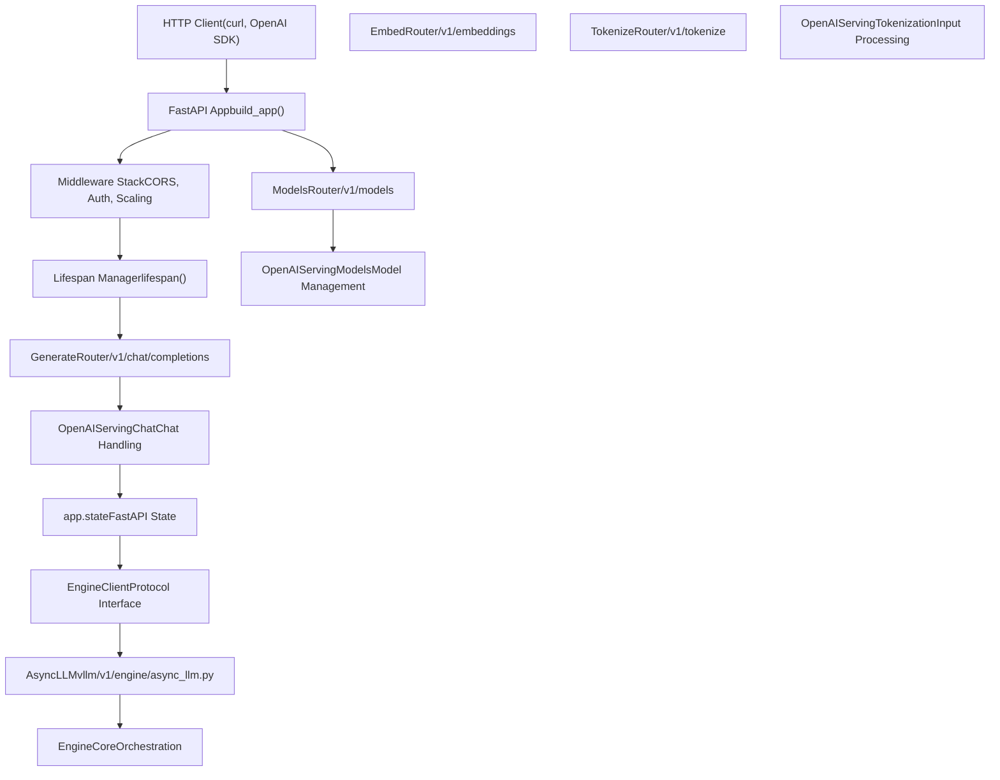
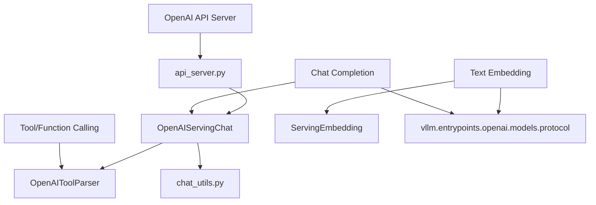

# 服务 API (Serving APIs)

相关源文件

-   [docs/configuration/conserving\_memory.md](https://github.com/vllm-project/vllm/blob/7cc302dd/docs/configuration/conserving_memory.md?plain=1)
-   [docs/configuration/optimization.md](https://github.com/vllm-project/vllm/blob/7cc302dd/docs/configuration/optimization.md?plain=1)
-   [docs/features/multimodal\_inputs.md](https://github.com/vllm-project/vllm/blob/7cc302dd/docs/features/multimodal_inputs.md?plain=1)
-   [examples/offline\_inference/mistral-small.py](https://github.com/vllm-project/vllm/blob/7cc302dd/examples/offline_inference/mistral-small.py)
-   [examples/online\_serving/openai\_chat\_completion\_client\_for\_multimodal.py](https://github.com/vllm-project/vllm/blob/7cc302dd/examples/online_serving/openai_chat_completion_client_for_multimodal.py)
-   [examples/online\_serving/openai\_responses\_client\_with\_mcp\_tools.py](https://github.com/vllm-project/vllm/blob/7cc302dd/examples/online_serving/openai_responses_client_with_mcp_tools.py)
-   [examples/online\_serving/utils.py](https://github.com/vllm-project/vllm/blob/7cc302dd/examples/online_serving/utils.py)
-   [tests/entrypoints/test\_chat\_utils.py](https://github.com/vllm-project/vllm/blob/7cc302dd/tests/entrypoints/test_chat_utils.py)
-   [tests/test\_envs.py](https://github.com/vllm-project/vllm/blob/7cc302dd/tests/test_envs.py)
-   [vllm/entrypoints/chat\_utils.py](https://github.com/vllm-project/vllm/blob/7cc302dd/vllm/entrypoints/chat_utils.py)
-   [vllm/entrypoints/openai/api\_server.py](https://github.com/vllm-project/vllm/blob/7cc302dd/vllm/entrypoints/openai/api_server.py)
-   [vllm/entrypoints/openai/cli\_args.py](https://github.com/vllm-project/vllm/blob/7cc302dd/vllm/entrypoints/openai/cli_args.py)
-   [vllm/tool\_parsers/openai\_tool\_parser.py](https://github.com/vllm-project/vllm/blob/7cc302dd/vllm/tool_parsers/openai_tool_parser.py)

## 目的与范围 (Purpose and Scope)

本文档介绍 vLLM 的服务层，它通过 OpenAI 兼容的 HTTP API 暴露推理能力。它涵盖 FastAPI 应用设置、引擎客户端集成、路由注册、中间件以及应用状态初始化。服务层充当外部 HTTP 客户端与 vLLM 内部引擎组件之间的接口，支持文本生成、多模态输入和专用池化任务。

有关 FastAPI 应用结构和路由注册的详细信息，请参阅 [OpenAI 兼容 API 服务器 (OpenAI-Compatible API Server)](/vllm-project/vllm/6.1-openai-compatible-api-server)。有关聊天模板处理和消息解析，请参阅 [聊天实用工具与消息处理 (Chat Utilities and Message Processing)](/vllm-project/vllm/6.2-chat-utilities-and-message-processing)。有关函数调用和结构化输出，请参阅 [工具调用与结构化输出 (Tool Calling and Structured Output)](/vllm-project/vllm/6.3-tool-calling-and-structured-output)。有关动态适配器管理，请参阅 [LoRA 适配器管理 (LoRA Adapter Management)](/vllm-project/vllm/6.4-lora-adapter-management)。

## 系统架构 (System Architecture)

服务层由一个 FastAPI 应用组成，它负责管理 HTTP 接口，与引擎客户端协调执行推理，并提供 OpenAI 兼容端点。该系统支持多种部署模式，包括单进程、多进程 API 服务器（通过 RPC）以及专用的仅渲染服务器。

### 高层组件关系 (High-Level Component Relationships)

**来源：** [vllm/entrypoints/openai/api\_server.py157-180](https://github.com/vllm-project/vllm/blob/7cc302dd/vllm/entrypoints/openai/api_server.py#L157-L180) [vllm/entrypoints/openai/api\_server.py182-200](https://github.com/vllm-project/vllm/blob/7cc302dd/vllm/entrypoints/openai/api_server.py#L182-L200) [vllm/entrypoints/openai/api\_server.py126-155](https://github.com/vllm-project/vllm/blob/7cc302dd/vllm/entrypoints/openai/api_server.py#L126-L155)

### 服务实体映射 (Serving Entity Mapping)

该图将服务概念与实现这些概念的具体代码实体对应起来，包括用于请求/响应校验的协议定义。

**来源：** [vllm/entrypoints/openai/api\_server.py182-210](https://github.com/vllm-project/vllm/blob/7cc302dd/vllm/entrypoints/openai/api_server.py#L182-L210) [vllm/tool\_parsers/openai\_tool\_parser.py31-40](https://github.com/vllm-project/vllm/blob/7cc302dd/vllm/tool_parsers/openai_tool_parser.py#L31-L40) [vllm/entrypoints/chat\_utils.py734-750](https://github.com/vllm-project/vllm/blob/7cc302dd/vllm/entrypoints/chat_utils.py#L734-L750)

## 支持的 API 套件 (Supported API Suites)

vLLM 提供了除基础文本生成之外的多种 API 接口。这些接口会根据模型支持的任务和配置进行条件注册。

### 生成与多模态 API (Generative and Multimodal APIs)

这是面向大语言模型（LLM）和视觉-语言模型（VLM）的主要接口。vLLM 在聊天补全框架中支持复杂的多模态输入，包括图像、音频和视频。

-   **补全：** `/v1/completions`
-   **聊天补全：** `/v1/chat/completions`（支持 `image_url`、`audio_url` 和 `video_url`。）
-   **多模态处理：** 通过 `parse_chat_messages` 处理，它会将 OpenAI 格式的消息转换为 `MultiModalDataDict`。

有关多模态输入格式和消息解析的详细信息，请参阅 [聊天实用工具与消息处理 (Chat Utilities and Message Processing)](/vllm-project/vllm/6.2-chat-utilities-and-message-processing)。

### 池化与实用 API (Pooling and Utility APIs)

面向非生成任务的专用端点。

-   **嵌入：** `/v1/embeddings`（OpenAI 兼容）。
-   **分词：** `/v1/tokenize` 和 `/v1/detokenize`。
-   **元数据：** `/v1/models` 和 `/tokenizer_info`。

| 功能 | 代码实现 | 请求协议 |
| --- | --- | --- |
| 聊天 | `OpenAIServingChat` | `ChatCompletionRequest` |
| 分词 | `OpenAIServingTokenization` | `TokenizeRequest` |
| 模型 | `OpenAIServingModels` | `BaseModelPath` |

**来源：** [vllm/entrypoints/openai/api\_server.py186-210](https://github.com/vllm-project/vllm/blob/7cc302dd/vllm/entrypoints/openai/api_server.py#L186-L210) [vllm/entrypoints/chat\_utils.py734-750](https://github.com/vllm-project/vllm/blob/7cc302dd/vllm/entrypoints/chat_utils.py#L734-L750) [vllm/entrypoints/openai/models/serving.py34-40](https://github.com/vllm-project/vllm/blob/7cc302dd/vllm/entrypoints/openai/models/serving.py#L34-L40)

## 引擎客户端集成 (Engine Client Integration)

服务层通过 `EngineClient` 协议与 vLLM 的推理引擎通信。`build_async_engine_client` 函数负责管理该连接的生命周期，支持进程内和多进程 RPC 模式（使用 `forkserver` 预加载大型模块）。

> **[Mermaid sequence]**
> *(图表结构无法解析)*

**来源：** [vllm/entrypoints/openai/api\_server.py78-106](https://github.com/vllm-project/vllm/blob/7cc302dd/vllm/entrypoints/openai/api_server.py#L78-L106) [vllm/entrypoints/openai/api\_server.py108-155](https://github.com/vllm-project/vllm/blob/7cc302dd/vllm/entrypoints/openai/api_server.py#L108-L155)

## 服务实用工具 (Serving Utilities)

### 聊天模板与渲染 (Chat Templates and Rendering)

vLLM 使用 Jinja2 模板将结构化聊天消息转换为原始文本提示。该行为可以通过 `--chat-template` 或 `--chat-template-content-format` 自定义（支持 `string` 或 `openai` 格式）。有关详细信息，请参阅 [聊天实用工具与消息处理 (Chat Utilities and Message Processing)](/vllm-project/vllm/6.2-chat-utilities-and-message-processing)。

### 工具调用与结构化输出 (Tool Calling and Structured Output)

vLLM 通过 `ToolParserManager` 支持自动工具选择和模型生成工具调用的解析。它会与 `OpenAIToolParser` 等各种解析器集成，从模型输出中提取函数调用。有关详细信息，请参阅 [工具调用与结构化输出 (Tool Calling and Structured Output)](/vllm-project/vllm/6.3-tool-calling-and-structured-output)。

### LoRA 管理 (LoRA Management)

API 服务器支持动态加载和卸载 LoRA 适配器。适配器可以在启动时通过 `--lora-modules` 指定，使用 `name=path` 格式或 JSON 配置。有关详细信息，请参阅 [LoRA 适配器管理 (LoRA Adapter Management)](/vllm-project/vllm/6.4-lora-adapter-management)。

## 配置与 CLI (Configuration and CLI)

服务器通过 `BaseFrontendArgs` 和 `AsyncEngineArgs` 进行配置。这些参数负责网络设置、安全性（API 密钥、CORS）以及引擎特定的性能调优。

| 参数类别 | 类 | 关键字段 |
| --- | --- | --- |
| 网络/SSL | `BaseFrontendArgs` | `host`、`port`、`ssl_keyfile`、`api_key` |
| 聊天/模板 | `BaseFrontendArgs` | `chat_template`、`tool_call_parser`、`lora_modules` |
| 安全 | `BaseFrontendArgs` | `allowed_media_domains`、`trust_request_chat_template` |

**来源：** [vllm/entrypoints/openai/cli\_args.py70-158](https://github.com/vllm-project/vllm/blob/7cc302dd/vllm/entrypoints/openai/cli_args.py#L70-L158) [vllm/entrypoints/openai/api\_server.py31-34](https://github.com/vllm-project/vllm/blob/7cc302dd/vllm/entrypoints/openai/api_server.py#L31-L34)
