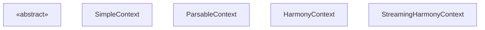
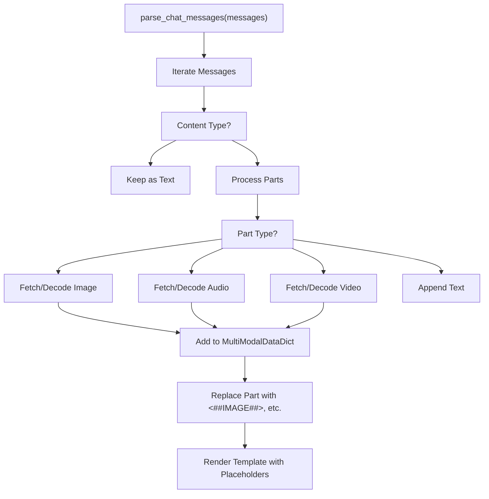
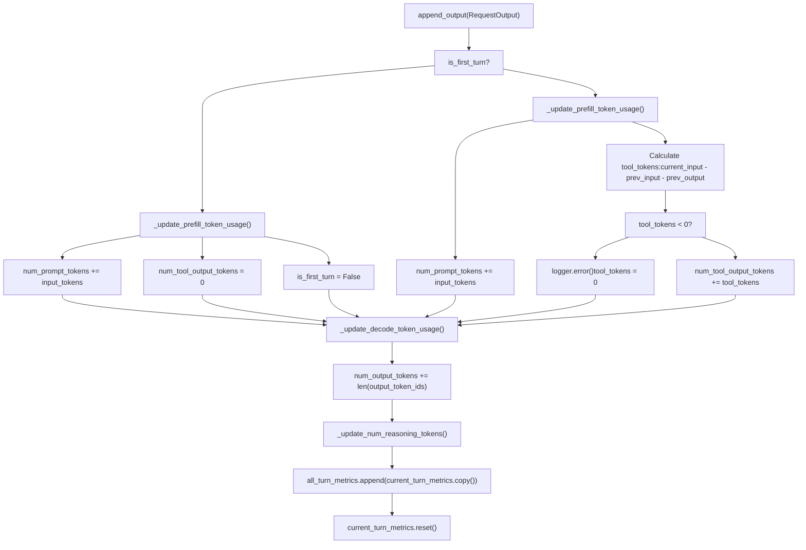

# 聊天实用工具与消息处理 (Chat Utilities and Message Processing)

相关源文件

-   [docs/configuration/conserving\_memory.md](https://github.com/vllm-project/vllm/blob/7cc302dd/docs/configuration/conserving_memory.md?plain=1)
-   [docs/configuration/optimization.md](https://github.com/vllm-project/vllm/blob/7cc302dd/docs/configuration/optimization.md?plain=1)
-   [docs/features/multimodal\_inputs.md](https://github.com/vllm-project/vllm/blob/7cc302dd/docs/features/multimodal_inputs.md?plain=1)
-   [examples/offline\_inference/mistral-small.py](https://github.com/vllm-project/vllm/blob/7cc302dd/examples/offline_inference/mistral-small.py)
-   [examples/online\_serving/openai\_chat\_completion\_client\_for\_multimodal.py](https://github.com/vllm-project/vllm/blob/7cc302dd/examples/online_serving/openai_chat_completion_client_for_multimodal.py)
-   [examples/online\_serving/utils.py](https://github.com/vllm-project/vllm/blob/7cc302dd/examples/online_serving/utils.py)
-   [tests/entrypoints/openai/tool\_parsers/test\_openai\_tool\_parser.py](https://github.com/vllm-project/vllm/blob/7cc302dd/tests/entrypoints/openai/tool_parsers/test_openai_tool_parser.py)
-   [tests/entrypoints/test\_chat\_utils.py](https://github.com/vllm-project/vllm/blob/7cc302dd/tests/entrypoints/test_chat_utils.py)
-   [tests/tokenizers\_/test\_basic.py](https://github.com/vllm-project/vllm/blob/7cc302dd/tests/tokenizers_/test_basic.py)
-   [tests/tokenizers\_/test\_registry.py](https://github.com/vllm-project/vllm/blob/7cc302dd/tests/tokenizers_/test_registry.py)
-   [tests/tool\_parsers/test\_mistral\_tool\_parser.py](https://github.com/vllm-project/vllm/blob/7cc302dd/tests/tool_parsers/test_mistral_tool_parser.py)
-   [vllm/entrypoints/chat\_utils.py](https://github.com/vllm-project/vllm/blob/7cc302dd/vllm/entrypoints/chat_utils.py)
-   [vllm/entrypoints/serve/instrumentator/metrics.py](https://github.com/vllm-project/vllm/blob/7cc302dd/vllm/entrypoints/serve/instrumentator/metrics.py)
-   [vllm/tokenizers/\_\_init\_\_.py](https://github.com/vllm-project/vllm/blob/7cc302dd/vllm/tokenizers/__init__.py)
-   [vllm/tokenizers/deepseek\_v32.py](https://github.com/vllm-project/vllm/blob/7cc302dd/vllm/tokenizers/deepseek_v32.py)
-   [vllm/tokenizers/deepseek\_v32\_encoding.py](https://github.com/vllm-project/vllm/blob/7cc302dd/vllm/tokenizers/deepseek_v32_encoding.py)
-   [vllm/tokenizers/hf.py](https://github.com/vllm-project/vllm/blob/7cc302dd/vllm/tokenizers/hf.py)
-   [vllm/tokenizers/mistral.py](https://github.com/vllm-project/vllm/blob/7cc302dd/vllm/tokenizers/mistral.py)
-   [vllm/tokenizers/protocol.py](https://github.com/vllm-project/vllm/blob/7cc302dd/vllm/tokenizers/protocol.py)
-   [vllm/tokenizers/registry.py](https://github.com/vllm-project/vllm/blob/7cc302dd/vllm/tokenizers/registry.py)
-   [vllm/tool\_parsers/hermes\_tool\_parser.py](https://github.com/vllm-project/vllm/blob/7cc302dd/vllm/tool_parsers/hermes_tool_parser.py)
-   [vllm/tool\_parsers/jamba\_tool\_parser.py](https://github.com/vllm-project/vllm/blob/7cc302dd/vllm/tool_parsers/jamba_tool_parser.py)
-   [vllm/tool\_parsers/mistral\_tool\_parser.py](https://github.com/vllm-project/vllm/blob/7cc302dd/vllm/tool_parsers/mistral_tool_parser.py)
-   [vllm/transformers\_utils/tokenizer.py](https://github.com/vllm-project/vllm/blob/7cc302dd/vllm/transformers_utils/tokenizer.py)

本文档介绍 vLLM 的聊天消息实用工具，这些工具用于在 OpenAI 兼容的 API 面上解析、校验并处理聊天会话。这些工具负责聊天模板加载、消息格式校验、多模态内容处理，以及不同消息表示之间的转换。

有关 OpenAI API 服务器架构，请参阅 [6.1](https://github.com/vllm-project/vllm/blob/7cc302dd/6.1)。有关工具调用与结构化输出，请参阅 [6.3](https://github.com/vllm-project/vllm/blob/7cc302dd/6.3)。

## 会话上下文概览 (Overview of Conversation Contexts)

vLLM 提供了多个上下文实现，用于在会话轮次之间管理状态、跟踪 token 使用情况并处理工具交互。所有上下文都实现抽象的 `ConversationContext` 接口。

### 上下文层级 (Context Hierarchy)

**来源：**

-   `vllm/entrypoints/openai/responses/context.py`（类定义分布在文件的多个区段）

## 聊天消息解析与多模态处理 (Chat Message Parsing and Multimodal Handling)

处理聊天消息的核心工具是 `parse_chat_messages`（及其异步对应版本 `parse_chat_messages_async`）。该函数会将 OpenAI 风格的消息列表转换为适合 vLLM 引擎的格式，并专门处理图像、音频和视频等多模态内容。

### 多模态处理流程 (Multimodal Processing Flow)

当聊天消息包含多模态内容（例如 `image_url`、`audio_url`）时，vLLM 会提取数据并将内容替换为模态占位符。

**关键多模态工具：**

-   `MODALITY_PLACEHOLDERS_MAP`：将模态映射到内部占位符，例如 `<##IMAGE##>`、`<##AUDIO##>` 和 `<##VIDEO##>` [vllm/entrypoints/chat\_utils.py96-100](https://github.com/vllm-project/vllm/blob/7cc302dd/vllm/entrypoints/chat_utils.py#L96-L100)
-   `MultiModalDataDict`：一个将各种模态映射到处理后数据列表的字典（例如 `PIL.Image` 对象或张量）[vllm/entrypoints/chat\_utils.py43](https://github.com/vllm-project/vllm/blob/7cc302dd/vllm/entrypoints/chat_utils.py#L43-L43)
-   `parse_chat_messages`：同步消息解析的主要入口 [vllm/entrypoints/chat\_utils.py981](https://github.com/vllm-project/vllm/blob/7cc302dd/vllm/entrypoints/chat_utils.py#L981-L981)
-   `parse_chat_messages_async`：处理远程 URL 获取的异步版本 [vllm/entrypoints/chat\_utils.py1152](https://github.com/vllm-project/vllm/blob/7cc302dd/vllm/entrypoints/chat_utils.py#L1152-L1152)

### 多模态输入约束 (Multimodal Input Constraints)

系统通过 `ModelConfig.limit_mm_per_prompt` 对每个 prompt 中的多模态项数量进行限制。如果请求超出这些限制，将抛出 `VLLMValidationError` [vllm/entrypoints/chat\_utils.py1085-1090](https://github.com/vllm-project/vllm/blob/7cc302dd/vllm/entrypoints/chat_utils.py#L1085-L1090)

**来源：**

-   [vllm/entrypoints/chat\_utils.py96-100](https://github.com/vllm-project/vllm/blob/7cc302dd/vllm/entrypoints/chat_utils.py#L96-L100)
-   [vllm/entrypoints/chat\_utils.py981-1150](https://github.com/vllm-project/vllm/blob/7cc302dd/vllm/entrypoints/chat_utils.py#L981-L1150)
-   [vllm/entrypoints/chat\_utils.py1152-1200](https://github.com/vllm-project/vllm/blob/7cc302dd/vllm/entrypoints/chat_utils.py#L1152-L1200)

## 聊天模板处理 (Chat Template Processing)

vLLM 使用 Jinja2 模板将消息列表转换为最终的 prompt 字符串。这一过程主要由 `BaseRenderer` 及其子类负责。

### 模板解析 (Template Resolution)

模板可以通过以下方式提供：

1.  API 服务器中的 `chat_template` 参数。
2.  文件路径。
3.  HuggingFace `tokenizer_config.json` 中模型的默认模板。

位于 `vllm.renderers.hf` 中的 `resolve_chat_template` 函数（在 `chat_utils.py` 中以别名方式引用）负责处理这一解析逻辑 [vllm/entrypoints/chat\_utils.py72-83](https://github.com/vllm-project/vllm/blob/7cc302dd/vllm/entrypoints/chat_utils.py#L72-L83)

### 特殊分词器与模板 (Specialized Tokenizers and Templates)

vLLM 支持针对某些不使用标准 Jinja 模板的模型的专用分词器逻辑：

-   **Mistral：** 使用 `mistral-common` 库中的 `MistralTokenizer` [vllm/tokenizers/mistral.py24-26](https://github.com/vllm-project/vllm/blob/7cc302dd/vllm/tokenizers/mistral.py#L24-L26) 它包含截断工具调用 ID 的逻辑 [vllm/tokenizers/mistral.py92-121](https://github.com/vllm-project/vllm/blob/7cc302dd/vllm/tokenizers/mistral.py#L92-L121)
-   **DeepSeek V3.2：** 使用自定义的 `DeepseekV32Tokenizer`，它封装了 HF 分词器并采用特定的消息编码逻辑 [vllm/tokenizers/deepseek\_v32.py15-18](https://github.com/vllm-project/vllm/blob/7cc302dd/vllm/tokenizers/deepseek_v32.py#L15-L18)

### OpenAIServingChat 中的渲染流程 (Rendering Flow in OpenAIServingChat)

> **[Mermaid sequence]**
> *(图表结构无法解析)*

**来源：**

-   [vllm/entrypoints/chat\_utils.py72-83](https://github.com/vllm-project/vllm/blob/7cc302dd/vllm/entrypoints/chat_utils.py#L72-L83)
-   [vllm/tokenizers/mistral.py92-121](https://github.com/vllm-project/vllm/blob/7cc302dd/vllm/tokenizers/mistral.py#L92-L121)
-   [vllm/tokenizers/deepseek\_v32.py15-18](https://github.com/vllm-project/vllm/blob/7cc302dd/vllm/tokenizers/deepseek_v32.py#L15-L18)

## Token 跟踪与用量统计 (Token Tracking and Usage Accounting)

用量信息通过 `UsageInfo` 类进行跟踪。在 `Responses` API 中，这由上下文对象负责管理。

### 用量指标结构 (Usage Metrics Structure)

vLLM 提供了 token 用量的详细拆分，包括 prompt 缓存命中和多模态细节。

| 字段 | 说明 |
| --- | --- |
| `prompt_tokens` | 输入中的 token 总数。 |
| `completion_tokens` | 模型生成的 token。 |
| `cached_tokens` | 从前缀缓存中检索到的 token。 |
| `reasoning_tokens` | 在推理/思考块中生成的 token。 |

**来源：**

-   `vllm/entrypoints/openai/engine/protocol.py`
-   `vllm/entrypoints/openai/chat_completion/protocol.py`

## SimpleContext 与流式处理 (SimpleContext and Streaming)

`SimpleContext` 提供基础的 token 跟踪和输出累积，不支持工具。它用于简单的补全场景。

### 流式模式下的 token 累积 (Token Accumulation in Streaming Mode)

> **[Mermaid sequence]**
> *(图表结构无法解析)*

**来源：**

-   `vllm/entrypoints/openai/responses/context.py`

## HarmonyContext 与多轮逻辑 (HarmonyContext and Multi-Turn Logic)

`HarmonyContext` 提供功能完整的多轮会话管理以及详细的 token 跟踪，包括工具输出 token 和推理 token。它使用 OpenAI Harmony 消息格式。

### Token 计算流程 (Token Calculation Flow)

**来源：**

-   `vllm/entrypoints/openai/responses/context.py`

## 工具解析实用工具 (Tool Parsing Utilities)

当模型生成工具调用时，vLLM 会使用专门的解析器从原始文本中提取结构化数据。

### Hermes 与 Mistral 解析器 (Hermes and Mistral Parsers)

-   **Hermes2ProToolParser：** 使用正则表达式查找 `<tool_call>` 标签，并使用 `partial_json_parser` 处理流式 JSON 工具参数 [vllm/tool\_parsers/hermes\_tool\_parser.py34-54](https://github.com/vllm-project/vllm/blob/7cc302dd/vllm/tool_parsers/hermes_tool_parser.py#L34-L54)
-   **MistralToolParser：** 专为 Mistral 模型设计，处理 Mistral 工具调用实现中使用的特定 token 和格式 [vllm/tool\_parsers/mistral\_tool\_parser.py20](https://github.com/vllm-project/vllm/blob/7cc302dd/vllm/tool_parsers/mistral_tool_parser.py#L20-L20)

**来源：**

-   [vllm/tool\_parsers/hermes\_tool\_parser.py34-54](https://github.com/vllm-project/vllm/blob/7cc302dd/vllm/tool_parsers/hermes_tool_parser.py#L34-L54)
-   [vllm/tool\_parsers/mistral\_tool\_parser.py20](https://github.com/vllm-project/vllm/blob/7cc302dd/vllm/tool_parsers/mistral_tool_parser.py#L20-L20)
