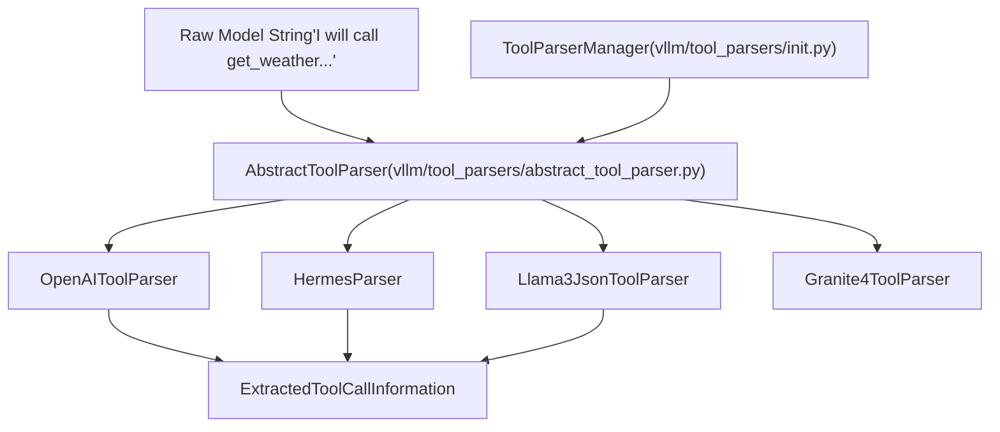
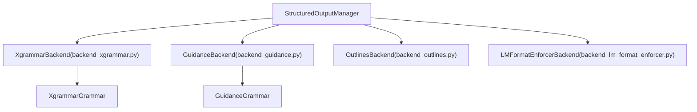

# 工具调用与结构化输出 (Tool Calling and Structured Output)

相关源文件

-   [docs/features/reasoning\_outputs.md](https://github.com/vllm-project/vllm/blob/7cc302dd/docs/features/reasoning_outputs.md?plain=1)
-   [docs/features/tool\_calling.md](https://github.com/vllm-project/vllm/blob/7cc302dd/docs/features/tool_calling.md?plain=1)
-   [examples/tool\_chat\_template\_deepseekv31.jinja](https://github.com/vllm-project/vllm/blob/7cc302dd/examples/tool_chat_template_deepseekv31.jinja)
-   [examples/tool\_chat\_template\_minimax\_m1.jinja](https://github.com/vllm-project/vllm/blob/7cc302dd/examples/tool_chat_template_minimax_m1.jinja)
-   [tests/entrypoints/openai/chat\_completion/test\_chat\_error.py](https://github.com/vllm-project/vllm/blob/7cc302dd/tests/entrypoints/openai/chat_completion/test_chat_error.py)
-   [tests/entrypoints/openai/chat\_completion/test\_serving\_chat.py](https://github.com/vllm-project/vllm/blob/7cc302dd/tests/entrypoints/openai/chat_completion/test_serving_chat.py)
-   [tests/entrypoints/openai/completion/test\_completion\_error.py](https://github.com/vllm-project/vllm/blob/7cc302dd/tests/entrypoints/openai/completion/test_completion_error.py)
-   [tests/entrypoints/openai/completion/test\_lora\_resolvers.py](https://github.com/vllm-project/vllm/blob/7cc302dd/tests/entrypoints/openai/completion/test_lora_resolvers.py)
-   [tests/entrypoints/openai/parser/\_\_init\_\_.py](https://github.com/vllm-project/vllm/blob/7cc302dd/tests/entrypoints/openai/parser/__init__.py)
-   [tests/entrypoints/openai/utils.py](https://github.com/vllm-project/vllm/blob/7cc302dd/tests/entrypoints/openai/utils.py)
-   [tests/models/multimodal/generation/test\_voxtral.py](https://github.com/vllm-project/vllm/blob/7cc302dd/tests/models/multimodal/generation/test_voxtral.py)
-   [tests/reasoning/test\_base\_thinking\_reasoning\_parser.py](https://github.com/vllm-project/vllm/blob/7cc302dd/tests/reasoning/test_base_thinking_reasoning_parser.py)
-   [tests/reasoning/test\_deepseekv3\_reasoning\_parser.py](https://github.com/vllm-project/vllm/blob/7cc302dd/tests/reasoning/test_deepseekv3_reasoning_parser.py)
-   [tests/reasoning/test\_glm4\_moe\_reasoning\_parser.py](https://github.com/vllm-project/vllm/blob/7cc302dd/tests/reasoning/test_glm4_moe_reasoning_parser.py)
-   [tests/reasoning/test\_gptoss\_reasoning\_parser.py](https://github.com/vllm-project/vllm/blob/7cc302dd/tests/reasoning/test_gptoss_reasoning_parser.py)
-   [tests/reasoning/test\_holo2\_reasoning\_parser.py](https://github.com/vllm-project/vllm/blob/7cc302dd/tests/reasoning/test_holo2_reasoning_parser.py)
-   [tests/reasoning/test\_hunyuan\_reasoning\_parser.py](https://github.com/vllm-project/vllm/blob/7cc302dd/tests/reasoning/test_hunyuan_reasoning_parser.py)
-   [tests/reasoning/test\_mistral\_reasoning\_parser.py](https://github.com/vllm-project/vllm/blob/7cc302dd/tests/reasoning/test_mistral_reasoning_parser.py)
-   [tests/reasoning/utils.py](https://github.com/vllm-project/vllm/blob/7cc302dd/tests/reasoning/utils.py)
-   [tests/renderers/test\_completions.py](https://github.com/vllm-project/vllm/blob/7cc302dd/tests/renderers/test_completions.py)
-   [tests/tool\_use/test\_tool\_choice\_required.py](https://github.com/vllm-project/vllm/blob/7cc302dd/tests/tool_use/test_tool_choice_required.py)
-   [tests/v1/structured\_output/test\_reasoning\_structured\_output.py](https://github.com/vllm-project/vllm/blob/7cc302dd/tests/v1/structured_output/test_reasoning_structured_output.py)
-   [tests/v1/structured\_output/test\_utils.py](https://github.com/vllm-project/vllm/blob/7cc302dd/tests/v1/structured_output/test_utils.py)
-   [vllm/entrypoints/mcp/\_\_init\_\_.py](https://github.com/vllm-project/vllm/blob/7cc302dd/vllm/entrypoints/mcp/__init__.py)
-   [vllm/entrypoints/mcp/tool.py](https://github.com/vllm-project/vllm/blob/7cc302dd/vllm/entrypoints/mcp/tool.py)
-   [vllm/entrypoints/mcp/tool\_server.py](https://github.com/vllm-project/vllm/blob/7cc302dd/vllm/entrypoints/mcp/tool_server.py)
-   [vllm/reasoning/\_\_init\_\_.py](https://github.com/vllm-project/vllm/blob/7cc302dd/vllm/reasoning/__init__.py)
-   [vllm/reasoning/abs\_reasoning\_parsers.py](https://github.com/vllm-project/vllm/blob/7cc302dd/vllm/reasoning/abs_reasoning_parsers.py)
-   [vllm/reasoning/basic\_parsers.py](https://github.com/vllm-project/vllm/blob/7cc302dd/vllm/reasoning/basic_parsers.py)
-   [vllm/reasoning/deepseek\_v3\_reasoning\_parser.py](https://github.com/vllm-project/vllm/blob/7cc302dd/vllm/reasoning/deepseek_v3_reasoning_parser.py)
-   [vllm/reasoning/gptoss\_reasoning\_parser.py](https://github.com/vllm-project/vllm/blob/7cc302dd/vllm/reasoning/gptoss_reasoning_parser.py)
-   [vllm/reasoning/hunyuan\_a13b\_reasoning\_parser.py](https://github.com/vllm-project/vllm/blob/7cc302dd/vllm/reasoning/hunyuan_a13b_reasoning_parser.py)
-   [vllm/reasoning/identity\_reasoning\_parser.py](https://github.com/vllm-project/vllm/blob/7cc302dd/vllm/reasoning/identity_reasoning_parser.py)
-   [vllm/reasoning/kimi\_k2\_reasoning\_parser.py](https://github.com/vllm-project/vllm/blob/7cc302dd/vllm/reasoning/kimi_k2_reasoning_parser.py)
-   [vllm/reasoning/mistral\_reasoning\_parser.py](https://github.com/vllm-project/vllm/blob/7cc302dd/vllm/reasoning/mistral_reasoning_parser.py)
-   [vllm/reasoning/step3\_reasoning\_parser.py](https://github.com/vllm-project/vllm/blob/7cc302dd/vllm/reasoning/step3_reasoning_parser.py)
-   [vllm/renderers/base.py](https://github.com/vllm-project/vllm/blob/7cc302dd/vllm/renderers/base.py)
-   [vllm/renderers/deepseek\_v32.py](https://github.com/vllm-project/vllm/blob/7cc302dd/vllm/renderers/deepseek_v32.py)
-   [vllm/renderers/grok2.py](https://github.com/vllm-project/vllm/blob/7cc302dd/vllm/renderers/grok2.py)
-   [vllm/renderers/hf.py](https://github.com/vllm-project/vllm/blob/7cc302dd/vllm/renderers/hf.py)
-   [vllm/renderers/mistral.py](https://github.com/vllm-project/vllm/blob/7cc302dd/vllm/renderers/mistral.py)
-   [vllm/renderers/registry.py](https://github.com/vllm-project/vllm/blob/7cc302dd/vllm/renderers/registry.py)
-   [vllm/renderers/terratorch.py](https://github.com/vllm-project/vllm/blob/7cc302dd/vllm/renderers/terratorch.py)
-   [vllm/third\_party/flashmla/\_\_init\_\_.py](https://github.com/vllm-project/vllm/blob/7cc302dd/vllm/third_party/flashmla/__init__.py)
-   [vllm/tool\_parsers/\_\_init\_\_.py](https://github.com/vllm-project/vllm/blob/7cc302dd/vllm/tool_parsers/__init__.py)
-   [vllm/tool\_parsers/granite4\_tool\_parser.py](https://github.com/vllm-project/vllm/blob/7cc302dd/vllm/tool_parsers/granite4_tool_parser.py)
-   [vllm/v1/attention/ops/flashmla.py](https://github.com/vllm-project/vllm/blob/7cc302dd/vllm/v1/attention/ops/flashmla.py)
-   [vllm/v1/structured\_output/\_\_init\_\_.py](https://github.com/vllm-project/vllm/blob/7cc302dd/vllm/v1/structured_output/__init__.py)
-   [vllm/v1/structured\_output/backend\_guidance.py](https://github.com/vllm-project/vllm/blob/7cc302dd/vllm/v1/structured_output/backend_guidance.py)
-   [vllm/v1/structured\_output/backend\_lm\_format\_enforcer.py](https://github.com/vllm-project/vllm/blob/7cc302dd/vllm/v1/structured_output/backend_lm_format_enforcer.py)
-   [vllm/v1/structured\_output/backend\_outlines.py](https://github.com/vllm-project/vllm/blob/7cc302dd/vllm/v1/structured_output/backend_outlines.py)
-   [vllm/v1/structured\_output/backend\_types.py](https://github.com/vllm-project/vllm/blob/7cc302dd/vllm/v1/structured_output/backend_types.py)
-   [vllm/v1/structured\_output/backend\_xgrammar.py](https://github.com/vllm-project/vllm/blob/7cc302dd/vllm/v1/structured_output/backend_xgrammar.py)
-   [vllm/v1/structured\_output/request.py](https://github.com/vllm-project/vllm/blob/7cc302dd/vllm/v1/structured_output/request.py)
-   [vllm/v1/structured\_output/utils.py](https://github.com/vllm-project/vllm/blob/7cc302dd/vllm/v1/structured_output/utils.py)

本文档介绍 vLLM 的工具调用和结构化输出系统。这些功能使模型能够生成符合特定格式的输出（通过语法实现结构化输出），并调用外部工具或函数（工具调用）。

---

## 目的与范围 (Purpose and Scope)

工具调用和结构化输出系统提供以下能力：

1.  **工具调用**：使模型能够以 OpenAI 兼容格式生成函数/工具调用的机制，支持工具解析器、MCP（Model Context Protocol）集成以及自动工具选择 [docs/features/tool\_calling.md1-14](https://github.com/vllm-project/vllm/blob/7cc302dd/docs/features/tool_calling.md?plain=1#L1-L14)
2.  **结构化输出**：基于语法的输出约束，使用 FSM（Finite State Machine，有限状态机）编译（通过 `xgrammar`、`outlines` 或 `llguidance` 等后端），以确保模型输出符合指定的 JSON schema、正则表达式或 EBNF 语法 [vllm/v1/structured\_output/\_\_init\_\_.py111-146](https://github.com/vllm-project/vllm/blob/7cc302dd/vllm/v1/structured_output/__init__.py#L111-L146)
3.  **推理集成**：支持推理模型（例如 DeepSeek R1）将 CoT（Chain of Thought，思维链）与最终结构化结论分离 [docs/features/reasoning\_outputs.md1-9](https://github.com/vllm-project/vllm/blob/7cc302dd/docs/features/reasoning_outputs.md?plain=1#L1-L9)

---

## 工具调用架构 (Tool Calling Architecture)

### 工具解析器系统 (Tool Parser System)

工具解析器从模型生成的文本中提取结构化的工具调用信息。vLLM 支持命名函数调用，以及 `tool_choice` 字段的 `auto`、`required` 和 `none` 选项 [docs/features/tool\_calling.md1-4](https://github.com/vllm-project/vllm/blob/7cc302dd/docs/features/tool_calling.md?plain=1#L1-L4)

**自然语言空间到代码实体空间：工具解析**

来源： [vllm/tool\_parsers/abstract\_tool\_parser.py10-50](https://github.com/vllm-project/vllm/blob/7cc302dd/vllm/tool_parsers/abstract_tool_parser.py#L10-L50) [vllm/tool\_parsers/\_\_init\_\_.py1-20](https://github.com/vllm-project/vllm/blob/7cc302dd/vllm/tool_parsers/__init__.py#L1-L20) [vllm/tool\_parsers/granite4\_tool\_parser.py15-30](https://github.com/vllm-project/vllm/blob/7cc302dd/vllm/tool_parsers/granite4_tool_parser.py#L15-L30)

### 约束解码行为 (Constrained Decoding Behavior)

vLLM 在生成过程中是否强制执行 schema 取决于 `tool_choice` 模式 [docs/features/tool\_calling.md110-121](https://github.com/vllm-project/vllm/blob/7cc302dd/docs/features/tool_calling.md?plain=1#L110-L121)：

| `tool_choice` | 受 schema 约束 | 行为 |
| --- | --- | --- |
| **命名函数** | 是 | 通过结构化输出后端，参数保证与特定函数的 JSON schema 匹配。 |
| **`"required"`** | 是 | 模型必须至少生成一个与提供列表匹配的工具调用。 |
| **`"auto"`** | 否 | 模型自由生成；解析器负责提取调用，参数可能格式不合法。 |
| **`"none"`** | 不适用 | 不会生成任何工具调用。 |

### MCP (Model Context Protocol) 集成

vLLM 支持 MCP 工具以集成外部服务。当存在 `ToolServer` 时，`ReasoningParser` 可以准备结构化标签，用于格式化推理输出 [vllm/reasoning/abs\_reasoning\_parsers.py153-162](https://github.com/vllm-project/vllm/blob/7cc302dd/vllm/reasoning/abs_reasoning_parsers.py#L153-L162)。例如，`GptOssReasoningParser` 会检查 `ToolServer` 上是否存在 `browser`、`python` 或 `container` 等内置工具，以调整推理标签 [vllm/reasoning/gptoss\_reasoning\_parser.py161-176](https://github.com/vllm-project/vllm/blob/7cc302dd/vllm/reasoning/gptoss_reasoning_parser.py#L161-L176)

---

## 结构化输出系统 (Structured Output System)

### 后端管理 (Backend Management)

vLLM V1 使用 `StructuredOutputManager` 来协调 FSM 编译和 logit 掩码。它支持多个后端：`xgrammar`、`guidance`（通过 `llguidance`）、`outlines` 和 `lm-format-enforcer` [vllm/v1/structured\_output/\_\_init\_\_.py35-146](https://github.com/vllm-project/vllm/blob/7cc302dd/vllm/v1/structured_output/__init__.py#L35-L146)

**代码实体空间：结构化输出逻辑**

来源： [vllm/v1/structured\_output/\_\_init\_\_.py111-146](https://github.com/vllm-project/vllm/blob/7cc302dd/vllm/v1/structured_output/__init__.py#L111-L146) [vllm/v1/structured\_output/backend\_xgrammar.py35-122](https://github.com/vllm-project/vllm/blob/7cc302dd/vllm/v1/structured_output/backend_xgrammar.py#L35-L122) [vllm/v1/structured\_output/backend\_guidance.py85-122](https://github.com/vllm-project/vllm/blob/7cc302dd/vllm/v1/structured_output/backend_guidance.py#L85-L122)

### 编译流水线 (The Compilation Pipeline)

1.  **初始化**：对于包含 `structured_outputs` 的请求，会调用 `grammar_init`。它会在首个请求时初始化后端 [vllm/v1/structured\_output/\_\_init\_\_.py97-112](https://github.com/vllm-project/vllm/blob/7cc302dd/vllm/v1/structured_output/__init__.py#L97-L112)
2.  **异步编译**：编译会卸载到 `ThreadPoolExecutor`（除非使用 `external_launcher`），以避免阻塞引擎 [vllm/v1/structured\_output/\_\_init\_\_.py49-153](https://github.com/vllm-project/vllm/blob/7cc302dd/vllm/v1/structured_output/__init__.py#L49-L153)
3.  **位掩码生成**：在前向传播过程中，后端（例如 `XgrammarBackend`）会分配并填充位掩码 [vllm/v1/structured\_output/backend\_xgrammar.py124-125](https://github.com/vllm-project/vllm/blob/7cc302dd/vllm/v1/structured_output/backend_xgrammar.py#L124-L125)
4.  **Logit 掩码**：使用 `xgr.apply_token_bitmask_inplace` 将位掩码应用到 logits 上 [vllm/v1/structured\_output/utils.py122-136](https://github.com/vllm-project/vllm/blob/7cc302dd/vllm/v1/structured_output/utils.py#L122-L136)

### Logit 掩码数据流 (Logit Masking Data Flow)

> **[Mermaid sequence]**
> *(图表结构无法解析)*

来源： [vllm/v1/structured\_output/\_\_init\_\_.py97-166](https://github.com/vllm-project/vllm/blob/7cc302dd/vllm/v1/structured_output/__init__.py#L97-L166) [vllm/v1/structured\_output/utils.py45-137](https://github.com/vllm-project/vllm/blob/7cc302dd/vllm/v1/structured_output/utils.py#L45-L137)

---

## 推理与结构化输出 (Reasoning and Structured Output)

推理模型（如 DeepSeek R1）会在最终响应之前生成一个推理块（通常包裹在 `<think>` 等标签中）。vLLM 使用 `ReasoningParser` 处理这一拆分 [docs/features/reasoning\_outputs.md3-5](https://github.com/vllm-project/vllm/blob/7cc302dd/docs/features/reasoning_outputs.md?plain=1#L3-L5)。

### 推理解析器 (Reasoning Parsers)

`ReasoningParserManager` 负责注册各类模型的解析器 [vllm/reasoning/\_\_init\_\_.py22-175](https://github.com/vllm-project/vllm/blob/7cc302dd/vllm/reasoning/__init__.py#L22-L175)：

-   **DeepSeek R1**：使用 `DeepSeekR1ReasoningParser`。
-   **GptOss**：使用 `GptOssReasoningParser`，它会与 “Harmony” 协议交互，以检测推理结束并提取内容 [vllm/reasoning/gptoss\_reasoning\_parser.py65-113](https://github.com/vllm-project/vllm/blob/7cc302dd/vllm/reasoning/gptoss_reasoning_parser.py#L65-L113)
-   **Qwen3**：使用 `Qwen3ReasoningParser`。
-   **Mistral**：使用 `MistralReasoningParser`。

### 与结构化输出的集成 (Integration with Structured Output)

对于推理模型，结构化输出约束通常在推理块结束之后才应用。`is_reasoning_end` 方法用于判断模型何时完成思考，以及何时开始应用语法约束 [vllm/reasoning/abs\_reasoning\_parsers.py42-57](https://github.com/vllm-project/vllm/blob/7cc302dd/vllm/reasoning/abs_reasoning_parsers.py#L42-L57)

| 功能 | 推理模型行为 |
| --- | --- |
| **流式输出** | `extract_reasoning_streaming` 会返回 `DeltaMessage` 对象，并分别包含推理增量和内容增量 [vllm/reasoning/abs\_reasoning\_parsers.py136-151](https://github.com/vllm-project/vllm/blob/7cc302dd/vllm/reasoning/abs_reasoning_parsers.py#L136-L151) [vllm/reasoning/gptoss\_reasoning\_parser.py121-148](https://github.com/vllm-project/vllm/blob/7cc302dd/vllm/reasoning/gptoss_reasoning_parser.py#L121-L148) |
| **Logits** | 只有在 `ReasoningParser` 发出推理结束信号后，才会应用位掩码。 |
| **计数** | `count_reasoning_tokens` 跟踪在思考阶段消耗的 token，用于用量指标 [vllm/reasoning/abs\_reasoning\_parsers.py96-113](https://github.com/vllm-project/vllm/blob/7cc302dd/vllm/reasoning/abs_reasoning_parsers.py#L96-L113) |

来源： [vllm/reasoning/abs\_reasoning\_parsers.py25-113](https://github.com/vllm-project/vllm/blob/7cc302dd/vllm/reasoning/abs_reasoning_parsers.py#L25-L113) [vllm/v1/structured\_output/\_\_init\_\_.py78-95](https://github.com/vllm-project/vllm/blob/7cc302dd/vllm/v1/structured_output/__init__.py#L78-L95) [docs/features/reasoning\_outputs.md12-27](https://github.com/vllm-project/vllm/blob/7cc302dd/docs/features/reasoning_outputs.md?plain=1#L12-L27)

---

## 后端概览 (Summary of Backends)

| 后端 | 能力 | 关键代码实体 |
| --- | --- | --- |
| **Xgrammar** | 高性能 JSON/正则/语法支持，带有 jump-forward 支持 | `XgrammarBackend` [vllm/v1/structured\_output/backend\_xgrammar.py35](https://github.com/vllm-project/vllm/blob/7cc302dd/vllm/v1/structured_output/backend_xgrammar.py#L35-L35) |
| **Guidance** | 通过 `llguidance` 提供高级 EBNF 和结构化标签支持 | `GuidanceBackend` [vllm/v1/structured\_output/backend\_guidance.py86](https://github.com/vllm-project/vllm/blob/7cc302dd/vllm/v1/structured_output/backend_guidance.py#L86-L86) |
| **Outlines** | 基于 FSM 的稳健正则和 JSON 约束 | `OutlinesBackend` [vllm/v1/structured\_output/backend\_outlines.py129](https://github.com/vllm-project/vllm/blob/7cc302dd/vllm/v1/structured_output/backend_outlines.py#L129-L129) |
| **LM Format Enforcer** | JSON Schema 约束 | `LMFormatEnforcerBackend` [vllm/v1/structured\_output/backend\_lm\_format\_enforcer.py141](https://github.com/vllm-project/vllm/blob/7cc302dd/vllm/v1/structured_output/backend_lm_format_enforcer.py#L141-L141) |

来源： [vllm/v1/structured\_output/\_\_init\_\_.py111-146](https://github.com/vllm-project/vllm/blob/7cc302dd/vllm/v1/structured_output/__init__.py#L111-L146) [vllm/v1/structured\_output/backend\_xgrammar.py132-142](https://github.com/vllm-project/vllm/blob/7cc302dd/vllm/v1/structured_output/backend_xgrammar.py#L132-L142)
