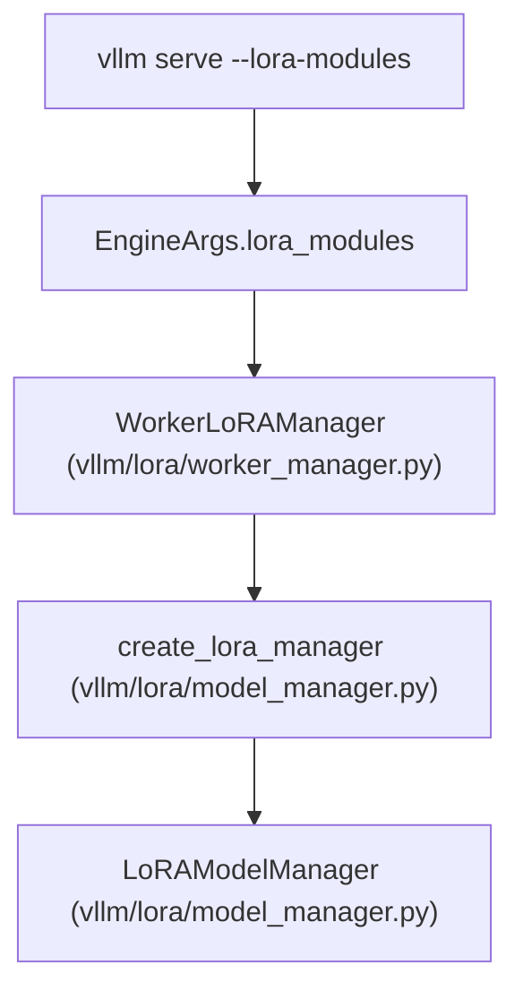

# LoRA 适配器管理 (LoRA Adapter Management)

相关源文件

-   [.buildkite/test\_areas/lora.yaml](https://github.com/vllm-project/vllm/blob/7cc302dd/.buildkite/test_areas/lora.yaml)
-   [benchmarks/kernels/benchmark\_lora.py](https://github.com/vllm-project/vllm/blob/7cc302dd/benchmarks/kernels/benchmark_lora.py)
-   [docs/features/lora.md](https://github.com/vllm-project/vllm/blob/7cc302dd/docs/features/lora.md?plain=1)
-   [tests/lora/conftest.py](https://github.com/vllm-project/vllm/blob/7cc302dd/tests/lora/conftest.py)
-   [tests/lora/test\_add\_lora.py](https://github.com/vllm-project/vllm/blob/7cc302dd/tests/lora/test_add_lora.py)
-   [tests/lora/test\_chatglm3\_tp.py](https://github.com/vllm-project/vllm/blob/7cc302dd/tests/lora/test_chatglm3_tp.py)
-   [tests/lora/test\_fused\_moe\_lora\_kernel.py](https://github.com/vllm-project/vllm/blob/7cc302dd/tests/lora/test_fused_moe_lora_kernel.py)
-   [tests/lora/test\_gptoss\_tp.py](https://github.com/vllm-project/vllm/blob/7cc302dd/tests/lora/test_gptoss_tp.py)
-   [tests/lora/test\_layers.py](https://github.com/vllm-project/vllm/blob/7cc302dd/tests/lora/test_layers.py)
-   [tests/lora/test\_llama\_tp.py](https://github.com/vllm-project/vllm/blob/7cc302dd/tests/lora/test_llama_tp.py)
-   [tests/lora/test\_lora\_checkpoints.py](https://github.com/vllm-project/vllm/blob/7cc302dd/tests/lora/test_lora_checkpoints.py)
-   [tests/lora/test\_lora\_functions.py](https://github.com/vllm-project/vllm/blob/7cc302dd/tests/lora/test_lora_functions.py)
-   [tests/lora/test\_lora\_huggingface.py](https://github.com/vllm-project/vllm/blob/7cc302dd/tests/lora/test_lora_huggingface.py)
-   [tests/lora/test\_lora\_manager.py](https://github.com/vllm-project/vllm/blob/7cc302dd/tests/lora/test_lora_manager.py)
-   [tests/lora/test\_minicpmv\_tp.py](https://github.com/vllm-project/vllm/blob/7cc302dd/tests/lora/test_minicpmv_tp.py)
-   [tests/lora/test\_mixtral.py](https://github.com/vllm-project/vllm/blob/7cc302dd/tests/lora/test_mixtral.py)
-   [tests/lora/test\_moe\_lora\_align\_sum.py](https://github.com/vllm-project/vllm/blob/7cc302dd/tests/lora/test_moe_lora_align_sum.py)
-   [tests/lora/test\_olmoe\_tp.py](https://github.com/vllm-project/vllm/blob/7cc302dd/tests/lora/test_olmoe_tp.py)
-   [tests/lora/test\_quant\_model.py](https://github.com/vllm-project/vllm/blob/7cc302dd/tests/lora/test_quant_model.py)
-   [tests/lora/test\_qwen35\_densemodel\_lora.py](https://github.com/vllm-project/vllm/blob/7cc302dd/tests/lora/test_qwen35_densemodel_lora.py)
-   [tests/lora/test\_utils.py](https://github.com/vllm-project/vllm/blob/7cc302dd/tests/lora/test_utils.py)
-   [tests/lora/test\_worker.py](https://github.com/vllm-project/vllm/blob/7cc302dd/tests/lora/test_worker.py)
-   [tests/lora/utils.py](https://github.com/vllm-project/vllm/blob/7cc302dd/tests/lora/utils.py)
-   [tests/utils\_/test\_async\_utils.py](https://github.com/vllm-project/vllm/blob/7cc302dd/tests/utils_/test_async_utils.py)
-   [vllm/lora/layers/\_\_init\_\_.py](https://github.com/vllm-project/vllm/blob/7cc302dd/vllm/lora/layers/__init__.py)
-   [vllm/lora/layers/base.py](https://github.com/vllm-project/vllm/blob/7cc302dd/vllm/lora/layers/base.py)
-   [vllm/lora/layers/base\_linear.py](https://github.com/vllm-project/vllm/blob/7cc302dd/vllm/lora/layers/base_linear.py)
-   [vllm/lora/layers/column\_parallel\_linear.py](https://github.com/vllm-project/vllm/blob/7cc302dd/vllm/lora/layers/column_parallel_linear.py)
-   [vllm/lora/layers/fused\_moe.py](https://github.com/vllm-project/vllm/blob/7cc302dd/vllm/lora/layers/fused_moe.py)
-   [vllm/lora/layers/logits\_processor.py](https://github.com/vllm-project/vllm/blob/7cc302dd/vllm/lora/layers/logits_processor.py)
-   [vllm/lora/layers/replicated\_linear.py](https://github.com/vllm-project/vllm/blob/7cc302dd/vllm/lora/layers/replicated_linear.py)
-   [vllm/lora/layers/row\_parallel\_linear.py](https://github.com/vllm-project/vllm/blob/7cc302dd/vllm/lora/layers/row_parallel_linear.py)
-   [vllm/lora/layers/utils.py](https://github.com/vllm-project/vllm/blob/7cc302dd/vllm/lora/layers/utils.py)
-   [vllm/lora/layers/vocal\_parallel\_embedding.py](https://github.com/vllm-project/vllm/blob/7cc302dd/vllm/lora/layers/vocal_parallel_embedding.py)
-   [vllm/lora/lora\_model.py](https://github.com/vllm-project/vllm/blob/7cc302dd/vllm/lora/lora_model.py)
-   [vllm/lora/lora\_weights.py](https://github.com/vllm-project/vllm/blob/7cc302dd/vllm/lora/lora_weights.py)
-   [vllm/lora/model\_manager.py](https://github.com/vllm-project/vllm/blob/7cc302dd/vllm/lora/model_manager.py)
-   [vllm/lora/ops/triton\_ops/README\_TUNING.md](https://github.com/vllm-project/vllm/blob/7cc302dd/vllm/lora/ops/triton_ops/README_TUNING.md?plain=1)
-   [vllm/lora/ops/triton\_ops/\_\_init\_\_.py](https://github.com/vllm-project/vllm/blob/7cc302dd/vllm/lora/ops/triton_ops/__init__.py)
-   [vllm/lora/ops/triton\_ops/fused\_moe\_lora\_fp8\_op.py](https://github.com/vllm-project/vllm/blob/7cc302dd/vllm/lora/ops/triton_ops/fused_moe_lora_fp8_op.py)
-   [vllm/lora/ops/triton\_ops/fused\_moe\_lora\_op.py](https://github.com/vllm-project/vllm/blob/7cc302dd/vllm/lora/ops/triton_ops/fused_moe_lora_op.py)
-   [vllm/lora/ops/triton\_ops/lora\_expand\_op.py](https://github.com/vllm-project/vllm/blob/7cc302dd/vllm/lora/ops/triton_ops/lora_expand_op.py)
-   [vllm/lora/ops/triton\_ops/lora\_kernel\_metadata.py](https://github.com/vllm-project/vllm/blob/7cc302dd/vllm/lora/ops/triton_ops/lora_kernel_metadata.py)
-   [vllm/lora/ops/triton\_ops/lora\_shrink\_op.py](https://github.com/vllm-project/vllm/blob/7cc302dd/vllm/lora/ops/triton_ops/lora_shrink_op.py)
-   [vllm/lora/ops/triton\_ops/utils.py](https://github.com/vllm-project/vllm/blob/7cc302dd/vllm/lora/ops/triton_ops/utils.py)
-   [vllm/lora/peft\_helper.py](https://github.com/vllm-project/vllm/blob/7cc302dd/vllm/lora/peft_helper.py)
-   [vllm/lora/punica\_wrapper/punica\_base.py](https://github.com/vllm-project/vllm/blob/7cc302dd/vllm/lora/punica_wrapper/punica_base.py)
-   [vllm/lora/punica\_wrapper/punica\_gpu.py](https://github.com/vllm-project/vllm/blob/7cc302dd/vllm/lora/punica_wrapper/punica_gpu.py)
-   [vllm/lora/punica\_wrapper/utils.py](https://github.com/vllm-project/vllm/blob/7cc302dd/vllm/lora/punica_wrapper/utils.py)
-   [vllm/lora/request.py](https://github.com/vllm-project/vllm/blob/7cc302dd/vllm/lora/request.py)
-   [vllm/lora/utils.py](https://github.com/vllm-project/vllm/blob/7cc302dd/vllm/lora/utils.py)
-   [vllm/lora/worker\_manager.py](https://github.com/vllm-project/vllm/blob/7cc302dd/vllm/lora/worker_manager.py)
-   [vllm/model\_executor/layers/fused\_moe/oracle/mxfp4.py](https://github.com/vllm-project/vllm/blob/7cc302dd/vllm/model_executor/layers/fused_moe/oracle/mxfp4.py)
-   [vllm/v1/worker/lora\_model\_runner\_mixin.py](https://github.com/vllm-project/vllm/blob/7cc302dd/vllm/v1/worker/lora_model_runner_mixin.py)

本文档介绍如何通过静态配置和动态 API 端点在 vLLM 中加载、管理和使用 LoRA 适配器。它涵盖 `LoRARequest` 结构、用于替换适配器的 `load_inplace` 行为，以及从加载到使用再到卸载的完整适配器生命周期。

有关 LoRA 内核在推理期间如何应用的内部实现细节，请参阅第 7 页（量化与 MoE 优化）。有关 OpenAI 兼容 API 服务器的设置，请参阅第 6.1 页（OpenAI 兼容 API 服务器）。

---

## 概述 (Overview)

vLLM 支持 **多 LoRA 服务**：单个服务器可以同时使用不同的 LoRA 适配器处理请求，并共享同一个基础模型。适配器可以：

1.  **在启动时静态加载**，通过 `--lora-modules` [docs/features/lora.md52-61](https://github.com/vllm-project/vllm/blob/7cc302dd/docs/features/lora.md?plain=1#L52-L61)
2.  **在运行时动态加载/卸载**，通过 HTTP 端点完成（当 `VLLM_ALLOW_RUNTIME_LORA_UPDATING=True` 时） [docs/features/lora.md112-118](https://github.com/vllm-project/vllm/blob/7cc302dd/docs/features/lora.md?plain=1#L112-L118)

每个适配器都由唯一的名称和整数 ID 标识。当生成请求包含 `LoRARequest` 时，vLLM 会使用 Punica 或基于 Triton 的 LoRA 算子等专用内核，将该适配器的权重应用到基础模型上，以服务该特定请求 [vllm/lora/punica\_wrapper/punica\_gpu.py33-38](https://github.com/vllm-project/vllm/blob/7cc302dd/vllm/lora/punica_wrapper/punica_gpu.py#L33-L38)

来源： [vllm/lora/request.py8-67](https://github.com/vllm-project/vllm/blob/7cc302dd/vllm/lora/request.py#L8-L67) [docs/features/lora.md1-118](https://github.com/vllm-project/vllm/blob/7cc302dd/docs/features/lora.md?plain=1#L1-L118)

---

## LoRARequest 结构 (LoRARequest Structure)

`LoRARequest` 类表示一个单独的 LoRA 适配器，同时用于静态配置和运行时 API 请求 [vllm/lora/request.py11-30](https://github.com/vllm-project/vllm/blob/7cc302dd/vllm/lora/request.py#L11-L30)

| 字段 | 类型 | 必需 | 描述 |
| --- | --- | --- | --- |
| `lora_name` | `str` | 是 | 适配器的人类可读名称 |
| `lora_int_id` | `int` | 是 | 全局唯一的整数 ID（必须大于 0） |
| `lora_path` | `str` | 是 | 本地路径或 HuggingFace 仓库 ID |
| `base_model_name` | `str | None` | 否 | 可选的基础模型名称，用于校验 |
| `tensorizer_config_dict` | `dict | None` | 否 | 张量化适配器的配置 |
| `load_inplace` | `bool` | 否 | 如果为 `True`，则替换具有相同 ID 的现有适配器 |

**关键行为：**

-   **唯一 ID 要求**：`lora_int_id` 必须是正整数。该 ID 在内部用于跟踪适配器权重并将其路由到 GPU 内存槽位 [vllm/lora/request.py32-37](https://github.com/vllm-project/vllm/blob/7cc302dd/vllm/lora/request.py#L32-L37)
-   **路径解析**：`lora_path` 可以是本地文件系统路径，也可以是 HuggingFace Hub 仓库 ID。解析由 `get_adapter_absolute_path` 负责 [vllm/lora/worker\_manager.py116-117](https://github.com/vllm-project/vllm/blob/7cc302dd/vllm/lora/worker_manager.py#L116-L117)
-   **相等性与哈希**：如果两个 `LoRARequest` 实例具有相同的 `lora_name`，则它们被视为相等 [vllm/lora/request.py53-57](https://github.com/vllm-project/vllm/blob/7cc302dd/vllm/lora/request.py#L53-L57)

来源： [vllm/lora/request.py8-67](https://github.com/vllm-project/vllm/blob/7cc302dd/vllm/lora/request.py#L8-L67) [vllm/lora/worker\_manager.py103-147](https://github.com/vllm-project/vllm/blob/7cc302dd/vllm/lora/worker_manager.py#L103-L147)

---

## 静态 LoRA 加载 (Static LoRA Loading)

可以在服务器启动时使用 `--lora-modules` 参数预加载适配器。这是生产部署的推荐方式。

### 命令行格式 (Command-Line Format)

`--lora-modules` 参数接受两种格式 [docs/features/lora.md52-61](https://github.com/vllm-project/vllm/blob/7cc302dd/docs/features/lora.md?plain=1#L52-L61)：

**旧格式（name=path）：**

```
vllm serve meta-llama/Llama-3.2-3B-Instruct \  --enable-lora \  --lora-modules sql-lora=jeeejeee/llama32-3b-text2sql-spider
```
**JSON 格式（推荐）：**

```
vllm serve meta-llama/Llama-3.2-3B-Instruct \  --enable-lora \  --lora-modules '{"name":"sql-lora","path":"jeeejeee/llama32-3b-text2sql-spider","base_model_name":"llama-3.2"}'
```
### 静态初始化流程 (Static Initialization Flow)

下图展示了从 CLI 参数到 `LoRAModelManager` 的转换过程。


来源： [vllm/lora/worker\_manager.py29-101](https://github.com/vllm-project/vllm/blob/7cc302dd/vllm/lora/worker_manager.py#L29-L101) [vllm/lora/model\_manager.py63-118](https://github.com/vllm-project/vllm/blob/7cc302dd/vllm/lora/model_manager.py#L63-L118) [docs/features/lora.md52-61](https://github.com/vllm-project/vllm/blob/7cc302dd/docs/features/lora.md?plain=1#L52-L61)

---

## 通过 API 进行动态 LoRA 管理 (Dynamic LoRA Management via API)

当 `VLLM_ALLOW_RUNTIME_LORA_UPDATING=True` 时，服务器会暴露专门的端点来在运行时管理适配器 [docs/features/lora.md112-118](https://github.com/vllm-project/vllm/blob/7cc302dd/docs/features/lora.md?plain=1#L112-L118)

### API 端点 (API Endpoints)

-   **`POST /v1/load_lora_adapter`**：将新适配器加载到引擎中。负载包含名称和路径 [docs/features/lora.md129-135](https://github.com/vllm-project/vllm/blob/7cc302dd/docs/features/lora.md?plain=1#L129-L135)
-   **`POST /v1/unload_lora_adapter`**：从引擎和管理层移除一个适配器 [docs/features/lora.md149-155](https://github.com/vllm-project/vllm/blob/7cc302dd/docs/features/lora.md?plain=1#L149-L155)

### 动态加载流程 (Dynamic Loading Sequence)

下图展示了运行时请求如何流经工作进程管理层。

> **[Mermaid sequence]**
> *(图表结构无法解析)*

来源： [vllm/lora/worker\_manager.py103-147](https://github.com/vllm-project/vllm/blob/7cc302dd/vllm/lora/worker_manager.py#L103-L147) [vllm/lora/model\_manager.py52-62](https://github.com/vllm-project/vllm/blob/7cc302dd/vllm/lora/model_manager.py#L52-L62) [docs/features/lora.md121-156](https://github.com/vllm-project/vllm/blob/7cc302dd/docs/features/lora.md?plain=1#L121-L156)

---

## `load_inplace` 行为 (The `load_inplace` Behavior)

`load_inplace` 参数决定 vLLM 是否替换具有相同标识符的现有适配器 [vllm/lora/request.py19-30](https://github.com/vllm-project/vllm/blob/7cc302dd/vllm/lora/request.py#L19-L30)

-   **`load_inplace=False`（默认）**：如果已加载了相同 ID/名称的适配器，引擎通常会拒绝新的加载请求，或保留现有适配器，以避免意外覆盖。
-   **`load_inplace=True`**：引擎会替换分配给现有适配器的 GPU 槽位中的权重。这样可以在不更改请求 ID 的情况下更新权重。

来源： [vllm/lora/request.py19-30](https://github.com/vllm-project/vllm/blob/7cc302dd/vllm/lora/request.py#L19-L30)

---

## 实现细节：LoRAModelManager (Implementation Details: LoRAModelManager)

`LoRAModelManager` [vllm/lora/model\_manager.py63-118](https://github.com/vllm-project/vllm/blob/7cc302dd/vllm/lora/model_manager.py#L63-L118) 是引擎核心中负责适配器生命周期的中心实体。

### 适配器生命周期阶段 (Adapter Lifecycle Stages)

1.  **初始化**：`_create_lora_modules()` 扫描模型中受支持的层，并通过 `from_layer()` 将其替换为支持 LoRA 的版本 [vllm/lora/model\_manager.py115](https://github.com/vllm-project/vllm/blob/7cc302dd/vllm/lora/model_manager.py#L115-L115) [vllm/lora/utils.py106-124](https://github.com/vllm-project/vllm/blob/7cc302dd/vllm/lora/utils.py#L106-L124)
2.  **权重加载**：`WorkerLoRAManager` 使用 `LoRAModel.from_local_checkpoint()` 从磁盘加载权重，然后将其注册到管理器中 [vllm/lora/worker\_manager.py136-147](https://github.com/vllm-project/vllm/blob/7cc302dd/vllm/lora/worker_manager.py#L136-L147)
3.  **请求映射**：对于每个推理批次，管理器使用 `LoRAMapping` 将序列关联到特定的 LoRA 槽位 [vllm/lora/model\_manager.py17-19](https://github.com/vllm-project/vllm/blob/7cc302dd/vllm/lora/model_manager.py#L17-L19)
4.  **驱逐**：如果适配器数量超过容量，`AdapterLRUCache` 会触发 `deactivate_fn`，卸载最近最少使用的适配器 [vllm/lora/model\_manager.py52-60](https://github.com/vllm-project/vllm/blob/7cc302dd/vllm/lora/model_manager.py#L52-L60)

### MoE LoRA 支持 (MoE LoRA Support)

对于 Mixture-of-Experts（MoE）模型，会使用 `FusedMoEWithLoRA` [vllm/lora/layers/fused\_moe.py44-58](https://github.com/vllm-project/vllm/blob/7cc302dd/vllm/lora/layers/fused_moe.py#L44-L58)。它负责管理融合的 `w13` 和 `w2` 投影的 LoRA 权重，并包装 MoE 前向传播以注入 LoRA 计算 [vllm/lora/layers/fused\_moe.py163-175](https://github.com/vllm-project/vllm/blob/7cc302dd/vllm/lora/layers/fused_moe.py#L163-L175)

来源： [vllm/lora/model\_manager.py52-118](https://github.com/vllm-project/vllm/blob/7cc302dd/vllm/lora/model_manager.py#L52-L118) [vllm/lora/layers/fused\_moe.py44-175](https://github.com/vllm-project/vllm/blob/7cc302dd/vllm/lora/layers/fused_moe.py#L44-L175) [vllm/lora/utils.py106-124](https://github.com/vllm-project/vllm/blob/7cc302dd/vllm/lora/utils.py#L106-L124)

---

## Punica 与 Triton 内核 (Punica and Triton Kernels)

LoRA 权重的实际应用通过 `PunicaWrapperGPU` 完成 [vllm/lora/punica\_wrapper/punica\_gpu.py33-38](https://github.com/vllm-project/vllm/blob/7cc302dd/vllm/lora/punica_wrapper/punica_gpu.py#L33-L38)

-   **`add_shrink`**：使用 `lora_shrink` 将输入隐藏状态投影到 LoRA rank [vllm/lora/punica\_wrapper/punica\_gpu.py90-121](https://github.com/vllm-project/vllm/blob/7cc302dd/vllm/lora/punica_wrapper/punica_gpu.py#L90-L121)
-   **`add_expand`**：使用 `lora_expand` 将 rank 大小的中间表示投影回模型的隐藏维度 [vllm/lora/punica\_wrapper/punica\_gpu.py123-165](https://github.com/vllm-project/vllm/blob/7cc302dd/vllm/lora/punica_wrapper/punica_gpu.py#L123-L165)
-   **`fused_moe_lora`**：用于 MoE 层的专用 Triton 内核，在应用适配器偏移的同时处理 token 到 expert 的路由 [vllm/lora/ops/triton\_ops/fused\_moe\_lora\_op.py158-226](https://github.com/vllm-project/vllm/blob/7cc302dd/vllm/lora/ops/triton_ops/fused_moe_lora_op.py#L158-L226)

来源： [vllm/lora/punica\_wrapper/punica\_gpu.py33-165](https://github.com/vllm-project/vllm/blob/7cc302dd/vllm/lora/punica_wrapper/punica_gpu.py#L33-L165) [vllm/lora/ops/triton\_ops/fused\_moe\_lora\_op.py158-226](https://github.com/vllm-project/vllm/blob/7cc302dd/vllm/lora/ops/triton_ops/fused_moe_lora_op.py#L158-L226)
