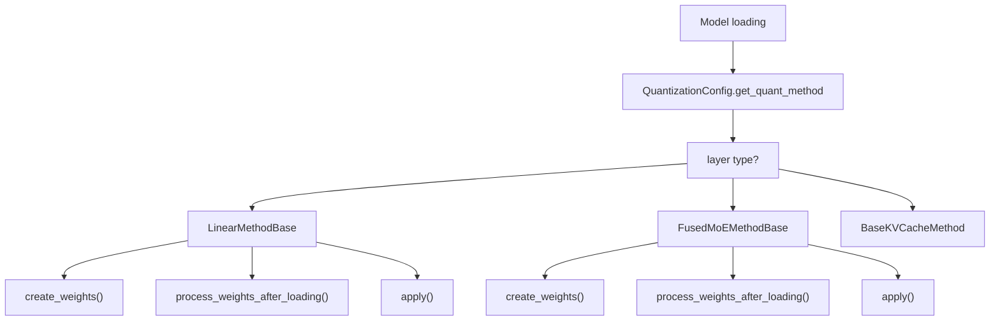
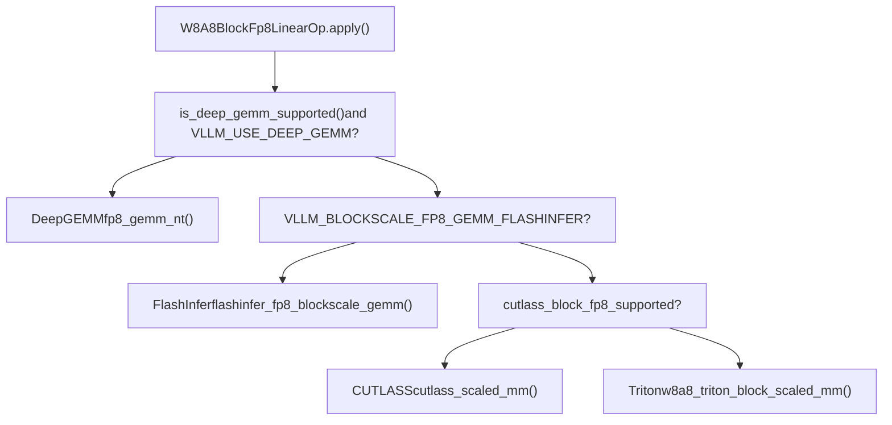
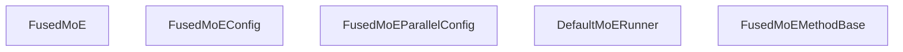
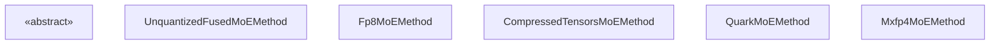

# 量化与 MoE 优化

相关源码文件

-   [vllm/envs.py](https://github.com/vllm-project/vllm/blob/7cc302dd/vllm/envs.py)
-   [vllm/model\_executor/layers/fused\_moe/batched\_deep\_gemm\_moe.py](https://github.com/vllm-project/vllm/blob/7cc302dd/vllm/model_executor/layers/fused_moe/batched_deep_gemm_moe.py)
-   [vllm/model\_executor/layers/fused\_moe/config.py](https://github.com/vllm-project/vllm/blob/7cc302dd/vllm/model_executor/layers/fused_moe/config.py)
-   [vllm/model\_executor/layers/fused\_moe/cutlass\_moe.py](https://github.com/vllm-project/vllm/blob/7cc302dd/vllm/model_executor/layers/fused_moe/cutlass_moe.py)
-   [vllm/model\_executor/layers/fused\_moe/deep\_gemm\_moe.py](https://github.com/vllm-project/vllm/blob/7cc302dd/vllm/model_executor/layers/fused_moe/deep_gemm_moe.py)
-   [vllm/model\_executor/layers/fused\_moe/fused\_batched\_moe.py](https://github.com/vllm-project/vllm/blob/7cc302dd/vllm/model_executor/layers/fused_moe/fused_batched_moe.py)
-   [vllm/model\_executor/layers/fused\_moe/fused\_moe.py](https://github.com/vllm-project/vllm/blob/7cc302dd/vllm/model_executor/layers/fused_moe/fused_moe.py)
-   [vllm/model\_executor/layers/fused\_moe/gpt\_oss\_triton\_kernels\_moe.py](https://github.com/vllm-project/vllm/blob/7cc302dd/vllm/model_executor/layers/fused_moe/gpt_oss_triton_kernels_moe.py)
-   [vllm/model\_executor/layers/fused\_moe/layer.py](https://github.com/vllm-project/vllm/blob/7cc302dd/vllm/model_executor/layers/fused_moe/layer.py)
-   [vllm/model\_executor/layers/fused\_moe/modular\_kernel.py](https://github.com/vllm-project/vllm/blob/7cc302dd/vllm/model_executor/layers/fused_moe/modular_kernel.py)
-   [vllm/model\_executor/layers/fused\_moe/rocm\_aiter\_fused\_moe.py](https://github.com/vllm-project/vllm/blob/7cc302dd/vllm/model_executor/layers/fused_moe/rocm_aiter_fused_moe.py)
-   [vllm/model\_executor/layers/fused\_moe/triton\_deep\_gemm\_moe.py](https://github.com/vllm-project/vllm/blob/7cc302dd/vllm/model_executor/layers/fused_moe/triton_deep_gemm_moe.py)
-   [vllm/model\_executor/layers/fused\_moe/utils.py](https://github.com/vllm-project/vllm/blob/7cc302dd/vllm/model_executor/layers/fused_moe/utils.py)
-   [vllm/model\_executor/layers/quantization/awq\_marlin.py](https://github.com/vllm-project/vllm/blob/7cc302dd/vllm/model_executor/layers/quantization/awq_marlin.py)
-   [vllm/model\_executor/layers/quantization/bitsandbytes.py](https://github.com/vllm-project/vllm/blob/7cc302dd/vllm/model_executor/layers/quantization/bitsandbytes.py)
-   [vllm/model\_executor/layers/quantization/compressed\_tensors/compressed\_tensors\_moe.py](https://github.com/vllm-project/vllm/blob/7cc302dd/vllm/model_executor/layers/quantization/compressed_tensors/compressed_tensors_moe.py)
-   [vllm/model\_executor/layers/quantization/experts\_int8.py](https://github.com/vllm-project/vllm/blob/7cc302dd/vllm/model_executor/layers/quantization/experts_int8.py)
-   [vllm/model\_executor/layers/quantization/fp8.py](https://github.com/vllm-project/vllm/blob/7cc302dd/vllm/model_executor/layers/quantization/fp8.py)
-   [vllm/model\_executor/layers/quantization/gguf.py](https://github.com/vllm-project/vllm/blob/7cc302dd/vllm/model_executor/layers/quantization/gguf.py)
-   [vllm/model\_executor/layers/quantization/gptq\_marlin.py](https://github.com/vllm-project/vllm/blob/7cc302dd/vllm/model_executor/layers/quantization/gptq_marlin.py)
-   [vllm/model\_executor/layers/quantization/modelopt.py](https://github.com/vllm-project/vllm/blob/7cc302dd/vllm/model_executor/layers/quantization/modelopt.py)
-   [vllm/model\_executor/layers/quantization/moe\_wna16.py](https://github.com/vllm-project/vllm/blob/7cc302dd/vllm/model_executor/layers/quantization/moe_wna16.py)
-   [vllm/model\_executor/layers/quantization/mxfp4.py](https://github.com/vllm-project/vllm/blob/7cc302dd/vllm/model_executor/layers/quantization/mxfp4.py)
-   [vllm/model\_executor/layers/quantization/quark/quark\_moe.py](https://github.com/vllm-project/vllm/blob/7cc302dd/vllm/model_executor/layers/quantization/quark/quark_moe.py)

本页涵盖了 vLLM 的量化基础设施和混合专家（Mixture-of-Experts, MoE）算子（kernel）系统。它解释了量化方法注册表、FP8 线性层和 MoE 流水线、模块化 MoE 算子抽象，以及如何在运行时进行后端选择。

有关承载量化权重的线性层和归一化（normalization）实现的详细信息，请参阅 [线性层和归一化](#7.5)。有关分布式专家并行（expert parallelism）配置，请参阅 [并行策略](/vllm-project/vllm/9.1-parallelism-strategies)。有关通用注意力后端系统，请参阅 [注意力后端](/vllm-project/vllm/8-attention-backends)。

---

## 量化系统概述

每种量化方案都实现了 `QuantizationConfig` 抽象基类 ([vllm/model\_executor/layers/quantization/base\_config.py](https://github.com/vllm-project/vllm/blob/7cc302dd/vllm/model_executor/layers/quantization/base_config.py)) 并注册在中心注册表中。加载模型时，每层都会调用配置的 `get_quant_method`，返回一个 `QuantizeMethodBase`，该对象知道如何 `create_weights`（创建权重）、`process_weights_after_loading`（加载后处理权重）以及 `apply`（应用）算子。

**量化方法分发图：**


来源：[vllm/model\_executor/layers/quantization/fp8.py172-195](https://github.com/vllm-project/vllm/blob/7cc302dd/vllm/model_executor/layers/quantization/fp8.py#L172-L195) [vllm/model\_executor/layers/quantization/modelopt.py183-217](https://github.com/vllm-project/vllm/blob/7cc302dd/vllm/model_executor/layers/quantization/modelopt.py#L183-L217)

---

### 支持的量化方法

| 方法 | 配置类 | 关键文件 |
| --- | --- | --- |
| `fp8` | `Fp8Config` | [vllm/model\_executor/layers/quantization/fp8.py96-170](https://github.com/vllm-project/vllm/blob/7cc302dd/vllm/model_executor/layers/quantization/fp8.py#L96-L170) |
| `modelopt` | `ModelOptQuantConfigBase` | [vllm/model\_executor/layers/quantization/modelopt.py133-181](https://github.com/vllm-project/vllm/blob/7cc302dd/vllm/model_executor/layers/quantization/modelopt.py#L133-L181) |
| `compressed_tensors` | `CompressedTensorsConfig` | [vllm/model\_executor/layers/quantization/compressed\_tensors/compressed\_tensors\_moe.py119-154](https://github.com/vllm-project/vllm/blob/7cc302dd/vllm/model_executor/layers/quantization/compressed_tensors/compressed_tensors_moe.py#L119-L154) |
| `gptq_marlin` | `GPTQMarlinConfig` | [vllm/model\_executor/layers/quantization/gptq\_marlin.py](https://github.com/vllm-project/vllm/blob/7cc302dd/vllm/model_executor/layers/quantization/gptq_marlin.py) |
| `awq_marlin` | `AWQMarlinConfig` | [vllm/model\_executor/layers/quantization/awq\_marlin.py](https://github.com/vllm-project/vllm/blob/7cc302dd/vllm/model_executor/layers/quantization/awq_marlin.py) |
| `bitsandbytes` | `BitsAndBytesConfig` | [vllm/model\_executor/layers/quantization/bitsandbytes.py](https://github.com/vllm-project/vllm/blob/7cc302dd/vllm/model_executor/layers/quantization/bitsandbytes.py) |
| `gguf` | `GGUFConfig` | [vllm/model\_executor/layers/quantization/gguf.py](https://github.com/vllm-project/vllm/blob/7cc302dd/vllm/model_executor/layers/quantization/gguf.py) |
| `mxfp4` | `Mxfp4Config` | [vllm/model\_executor/layers/quantization/mxfp4.py39-63](https://github.com/vllm-project/vllm/blob/7cc302dd/vllm/model_executor/layers/quantization/mxfp4.py#L39-L63) |
| `quark` | `QuarkConfig` | [vllm/model\_executor/layers/quantization/quark/quark\_moe.py63-108](https://github.com/vllm-project/vllm/blob/7cc302dd/vllm/model_executor/layers/quantization/quark/quark_moe.py#L63-L108) |

来源：[vllm/model\_executor/layers/quantization/fp8.py135-148](https://github.com/vllm-project/vllm/blob/7cc302dd/vllm/model_executor/layers/quantization/fp8.py#L135-L148) [vllm/model\_executor/layers/quantization/modelopt.py107-120](https://github.com/vllm-project/vllm/blob/7cc302dd/vllm/model_executor/layers/quantization/modelopt.py#L107-L120) [vllm/model\_executor/layers/quantization/mxfp4.py49-63](https://github.com/vllm-project/vllm/blob/7cc302dd/vllm/model_executor/layers/quantization/mxfp4.py#L49-L63)

---

## FP8 量化

### Fp8Config

`Fp8Config` ([vllm/model\_executor/layers/quantization/fp8.py96-170](https://github.com/vllm-project/vllm/blob/7cc302dd/vllm/model_executor/layers/quantization/fp8.py#L96-L170)) 控制：

-   `activation_scheme`：`"static"`（静态）或 `"dynamic"`（动态）—— 激活缩放比例（activation scale）是预先计算的还是在运行时按 token 计算的。
-   `is_checkpoint_fp8_serialized`：如果权重在 checkpoint 中以 FP8 格式存储，则为 `True`。
-   `weight_block_size`：启用分块量化（block-wise quantization，例如 `[128, 128]`）。需要 `is_checkpoint_fp8_serialized=True` 且 `activation_scheme="dynamic"`。
-   `ignored_layers`：要跳过的层名称前缀列表。

### 线性层方法类

| 类 | 使用场景 |
| --- | --- |
| `Fp8LinearMethod` | 加载带有静态权重缩放比例的 FP8 序列化 checkpoint |
| `Fp8OnlineLinearMethod` | 加载 BF16/FP16 checkpoint，在加载过程中对权重进行量化 |

对于没有 FP8 硬件支持（计算能力 < 89）的模型，或者当 `VLLM_TEST_FORCE_FP8_MARLIN=1` 时，两种方法都会回退到 Marlin FP8 算子 (`MarlinFP8ScaledMMLinearKernel`)。ROCm 平台跳过 Marlin 并使用 `rocm_aiter_ops`。

来源：[vllm/model\_executor/layers/quantization/fp8.py182-189](https://github.com/vllm-project/vllm/blob/7cc302dd/vllm/model_executor/layers/quantization/fp8.py#L182-L189) [vllm/model\_executor/layers/quantization/fp8.py47-81](https://github.com/vllm-project/vllm/blob/7cc302dd/vllm/model_executor/layers/quantization/fp8.py#L47-L81)

### W8A8BlockFp8LinearOp — 分块 FP8 GEMM 分发

对于分块 FP8（例如 DeepSeek-V3），`W8A8BlockFp8LinearOp` ([vllm/model\_executor/layers/quantization/utils/fp8\_utils.py48](https://github.com/vllm-project/vllm/blob/7cc302dd/vllm/model_executor/layers/quantization/utils/fp8_utils.py#L48-L48)) 分发到适当的后端：

**分块 FP8 GEMM 后端选择图：**


来源：[vllm/model\_executor/layers/quantization/utils/fp8\_utils.py48](https://github.com/vllm-project/vllm/blob/7cc302dd/vllm/model_executor/layers/quantization/utils/fp8_utils.py#L48-L48) [vllm/utils/deep\_gemm.py84-86](https://github.com/vllm-project/vllm/blob/7cc302dd/vllm/utils/deep_gemm.py#L84-L86)

### DeepGEMM 缩放格式

DeepGEMM 支持三种缩放格式（scale format），由 `VLLM_USE_DEEP_GEMM_E8M0` 和 `VLLM_USE_DEEP_GEMM_TMA_ALIGNED_SCALES` 环境变量控制。

来源：[vllm/envs.py154-157](https://github.com/vllm-project/vllm/blob/7cc302dd/vllm/envs.py#L154-L157) [vllm/utils/deep\_gemm.py84-86](https://github.com/vllm-project/vllm/blob/7cc302dd/vllm/utils/deep_gemm.py#L84-L86)

---

## FusedMoE 层架构

### FusedMoE 类

`FusedMoE` ([vllm/model\_executor/layers/fused\_moe/layer.py274](https://github.com/vllm-project/vllm/blob/7cc302dd/vllm/model_executor/layers/fused_moe/layer.py#L274-LNaN)) 是代表完整 MoE 层的顶级 `CustomOp`。它拥有：

-   权重张量 `w13` (gate+up) 和 `w2` (down)。
-   `FusedMoEConfig` —— 静态层配置。
-   `FusedMoEParallelConfig` —— 并行配置（TP, EP, DP）。
-   `quant_method: FusedMoEMethodBase` —— 当前激活的量化策略。
-   `router` —— top-K 路由 ([vllm/model\_executor/layers/fused\_moe/router/router\_factory.py](https://github.com/vllm-project/vllm/blob/7cc302dd/vllm/model_executor/layers/fused_moe/router/router_factory.py))。
-   `runner: DefaultMoERunner` —— 编排执行。

**FusedMoE 内部结构：**


来源：[vllm/model\_executor/layers/fused\_moe/layer.py274-320](https://github.com/vllm-project/vllm/blob/7cc302dd/vllm/model_executor/layers/fused_moe/layer.py#L274-L320) [vllm/model\_executor/layers/fused\_moe/config.py192-210](https://github.com/vllm-project/vllm/blob/7cc302dd/vllm/model_executor/layers/fused_moe/config.py#L192-210)

### 模块化算子架构

MoE 执行流水线通过 `modular_kernel.py` ([vllm/model\_executor/layers/fused\_moe/modular\_kernel.py](https://github.com/vllm-project/vllm/blob/7cc302dd/vllm/model_executor/layers/fused_moe/modular_kernel.py)) 中的抽象接口被分解为独立的阶段：

```
[Router] → [FusedMoEPrepareAndFinalize] → [FusedMoEExpertsModular]
```
| 接口 | 作用 |
| --- | --- |
| `FusedMoEPrepareAndFinalize` | 对输入进行量化、分发 token（例如 all2all）并收集结果。 |
| `FusedMoEExpertsModular` | 运行实际的专家 GEMM（permute → GEMM → unpermute）。 |
| `FusedMoEModularKernel` | 将准备/完成模块和专家模块组合成一个可调用对象。 |

来源：[vllm/model\_executor/layers/fused\_moe/modular\_kernel.py42-76](https://github.com/vllm-project/vllm/blob/7cc302dd/vllm/model_executor/layers/fused_moe/modular_kernel.py#L42-L76)

### FusedMoEExpertsModular 实现

| 类 | 后端 | 量化 |
| --- | --- | --- |
| `TritonExperts` | Triton 融合算子 | FP8, INT8, W4A16, W8A16, 未量化 |
| `CutlassExperts` | CUTLASS grouped GEMM | FP8 |
| `DeepGemmExperts` | DeepGEMM contiguous grouped GEMM | FP8 block |
| `MarlinExperts` | Marlin 算子 | INT4/FP4/FP8 |

来源：[vllm/model\_executor/layers/fused\_moe/cutlass\_moe.py](https://github.com/vllm-project/vllm/blob/7cc302dd/vllm/model_executor/layers/fused_moe/cutlass_moe.py) [vllm/model\_executor/layers/fused\_moe/deep\_gemm\_moe.py](https://github.com/vllm-project/vllm/blob/7cc302dd/vllm/model_executor/layers/fused_moe/deep_gemm_moe.py) [vllm/model\_executor/layers/fused\_moe/fused\_marlin\_moe.py](https://github.com/vllm-project/vllm/blob/7cc302dd/vllm/model_executor/layers/fused_moe/fused_marlin_moe.py)

---

## MoE 量化方法

每个量化配置都为 `FusedMoE` 层提供一个 `FusedMoEMethodBase` 子类。有关详细信息，请参阅 [MoE 量化与后端选择](/vllm-project/vllm/7.4-moe-quantization-and-backend-selection)。

**MoE 量化方法类层级：**


来源：[vllm/model\_executor/layers/fused\_moe/fused\_moe\_method\_base.py](https://github.com/vllm-project/vllm/blob/7cc302dd/vllm/model_executor/layers/fused_moe/fused_moe_method_base.py) [vllm/model\_executor/layers/quantization/fp8.py650-700](https://github.com/vllm-project/vllm/blob/7cc302dd/vllm/model_executor/layers/quantization/fp8.py#L650-L700) [vllm/model\_executor/layers/quantization/compressed\_tensors/compressed\_tensors\_moe.py119-150](https://github.com/vllm-project/vllm/blob/7cc302dd/vllm/model_executor/layers/quantization/compressed_tensors/compressed_tensors_moe.py#L119-L150) [vllm/model\_executor/layers/quantization/mxfp4.py95-125](https://github.com/vllm-project/vllm/blob/7cc302dd/vllm/model_executor/layers/quantization/mxfp4.py#L95-L125)

### MXFP4 MoE

`Mxfp4MoEMethod` ([vllm/model\_executor/layers/quantization/mxfp4.py95](https://github.com/vllm-project/vllm/blob/7cc302dd/vllm/model_executor/layers/quantization/mxfp4.py#L95-LNaN)) 通过 `select_mxfp4_moe_backend` 选择后端。它原地（in-place）修改共享的 `FusedMoEConfig`，以处理特定后端（如 CK (gfx950) 或 FlashInfer）所需的维度对齐。

来源：[vllm/model\_executor/layers/quantization/mxfp4.py110-120](https://github.com/vllm-project/vllm/blob/7cc302dd/vllm/model_executor/layers/quantization/mxfp4.py#L110-L120)

---

## 专家并行与专家映射

启用专家并行（Expert Parallelism, EP）时，`determine_expert_map` ([vllm/model\_executor/layers/fused\_moe/layer.py66-152](https://github.com/vllm-project/vllm/blob/7cc302dd/vllm/model_executor/layers/fused_moe/layer.py#L66-L152)) 计算分配给每个 rank 的专家数量。

-   `local_num_experts`：当前 rank 上的专家数量。
-   `expert_map`：全局索引到本地索引的映射张量；不在当前 rank 上的专家为 `-1`。
-   `expert_mask`：主要用于 AITER MOE 的二进制掩码。

来源：[vllm/model\_executor/layers/fused\_moe/layer.py66-152](https://github.com/vllm-project/vllm/blob/7cc302dd/vllm/model_executor/layers/fused_moe/layer.py#L66-L152)

---

## Triton 融合 MoE 算子

`fused_moe_kernel_gptq_awq` ([vllm/model\_executor/layers/fused\_moe/fused\_moe.py78-311](https://github.com/vllm-project/vllm/blob/7cc302dd/vllm/model_executor/layers/fused_moe/fused_moe.py#L78-L311)) 是一个核心 Triton 算子实现。它实现了“排序 token”（sorted token）MoE 模式：

1.  将程序 ID (program ID) 映射到它应该计算的输出块。
2.  加载当前块的专家 ID。如果是 `-1`，调用 `write_zeros_to_output`。
3.  在 K 方向上移动指针并累加结果。
4.  应用路由权重和激活。

来源：[vllm/model\_executor/layers/fused\_moe/fused\_moe.py155-200](https://github.com/vllm-project/vllm/blob/7cc302dd/vllm/model_executor/layers/fused_moe/fused_moe.py#L155-L200) [vllm/model\_executor/layers/fused\_moe/fused\_moe.py61-75](https://github.com/vllm-project/vllm/blob/7cc302dd/vllm/model_executor/layers/fused_moe/fused_moe.py#L61-L75)

---

## 关键环境变量

| 变量 | 默认值 | 作用 |
| --- | --- | --- |
| `VLLM_USE_DEEP_GEMM` | `True` | 启用 DeepGEMM 库进行 FP8 GEMM ([vllm/envs.py154](https://github.com/vllm-project/vllm/blob/7cc302dd/vllm/envs.py#L154-L154))。 |
| `VLLM_MOE_USE_DEEP_GEMM` | `True` | 启用 DeepGEMM 进行 MoE GEMM ([vllm/envs.py155](https://github.com/vllm-project/vllm/blob/7cc302dd/vllm/envs.py#L155-L155))。 |
| `VLLM_USE_FLASHINFER_MOE_FP8` | `False` | 使用 FlashInfer 进行 FP8 MoE ([vllm/envs.py166](https://github.com/vllm-project/vllm/blob/7cc302dd/vllm/envs.py#L166-L166))。 |
| `VLLM_ROCM_USE_AITER_MOE` | `True` | 在 ROCm 上使用 AITER 融合 MoE ([vllm/envs.py106](https://github.com/vllm-project/vllm/blob/7cc302dd/vllm/envs.py#L106-L106))。 |
| `VLLM_USE_FUSED_MOE_GROUPED_TOPK` | `True` | 使用融合的分组 top-K 路由 ([vllm/envs.py163](https://github.com/vllm-project/vllm/blob/7cc302dd/vllm/envs.py#L163-L163))。 |

---

## 权重缩放粒度

`FusedMoeWeightScaleSupported` 枚举 ([vllm/model\_executor/layers/fused\_moe/layer.py59-63](https://github.com/vllm-project/vllm/blob/7cc302dd/vllm/model_executor/layers/fused_moe/layer.py#L59-L63)) 捕获了 MoE 算子支持的缩放粒度（scale granularity）：`TENSOR`（张量）、`CHANNEL`（通道）、`GROUP`（组）和 `BLOCK`（块）。这些粒度决定了在融合专家计算期间如何存储和应用缩放比例。

来源：[vllm/model\_executor/layers/fused\_moe/layer.py59-63](https://github.com/vllm-project/vllm/blob/7cc302dd/vllm/model_executor/layers/fused_moe/layer.py#L59-L63)
