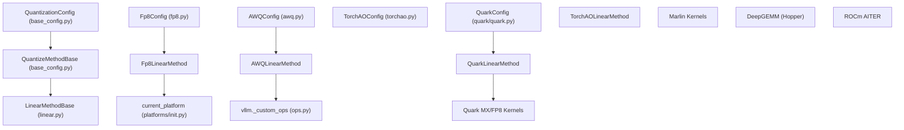

# 量化方法概述

相关源码文件

-   [.buildkite/lm-eval-harness/run-lm-eval-chartqa-vllm-vlm-baseline.sh](https://github.com/vllm-project/vllm/blob/7cc302dd/.buildkite/lm-eval-harness/run-lm-eval-chartqa-vllm-vlm-baseline.sh)
-   [.buildkite/lm-eval-harness/run-lm-eval-gsm-hf-baseline.sh](https://github.com/vllm-project/vllm/blob/7cc302dd/.buildkite/lm-eval-harness/run-lm-eval-gsm-hf-baseline.sh)
-   [.buildkite/lm-eval-harness/run-lm-eval-gsm-vllm-baseline.sh](https://github.com/vllm-project/vllm/blob/7cc302dd/.buildkite/lm-eval-harness/run-lm-eval-gsm-vllm-baseline.sh)
-   [.buildkite/lm-eval-harness/run-lm-eval-mmlupro-vllm-baseline.sh](https://github.com/vllm-project/vllm/blob/7cc302dd/.buildkite/lm-eval-harness/run-lm-eval-mmlupro-vllm-baseline.sh)
-   [docs/features/quantization/README.md](https://github.com/vllm-project/vllm/blob/7cc302dd/docs/features/quantization/README.md?plain=1)
-   [docs/features/quantization/auto\_awq.md](https://github.com/vllm-project/vllm/blob/7cc302dd/docs/features/quantization/auto_awq.md?plain=1)
-   [docs/features/quantization/fp8.md](https://github.com/vllm-project/vllm/blob/7cc302dd/docs/features/quantization/fp8.md?plain=1)
-   [docs/features/quantization/gguf.md](https://github.com/vllm-project/vllm/blob/7cc302dd/docs/features/quantization/gguf.md?plain=1)
-   [docs/features/quantization/gptqmodel.md](https://github.com/vllm-project/vllm/blob/7cc302dd/docs/features/quantization/gptqmodel.md?plain=1)
-   [docs/features/quantization/inc.md](https://github.com/vllm-project/vllm/blob/7cc302dd/docs/features/quantization/inc.md?plain=1)
-   [docs/features/quantization/int4.md](https://github.com/vllm-project/vllm/blob/7cc302dd/docs/features/quantization/int4.md?plain=1)
-   [docs/features/quantization/int8.md](https://github.com/vllm-project/vllm/blob/7cc302dd/docs/features/quantization/int8.md?plain=1)
-   [docs/features/quantization/modelopt.md](https://github.com/vllm-project/vllm/blob/7cc302dd/docs/features/quantization/modelopt.md?plain=1)
-   [docs/features/quantization/quantized\_kvcache.md](https://github.com/vllm-project/vllm/blob/7cc302dd/docs/features/quantization/quantized_kvcache.md?plain=1)
-   [docs/features/quantization/quark.md](https://github.com/vllm-project/vllm/blob/7cc302dd/docs/features/quantization/quark.md?plain=1)
-   [tests/models/language/generation/test\_gemma.py](https://github.com/vllm-project/vllm/blob/7cc302dd/tests/models/language/generation/test_gemma.py)
-   [tests/models/test\_gguf\_download.py](https://github.com/vllm-project/vllm/blob/7cc302dd/tests/models/test_gguf_download.py)
-   [tests/quantization/test\_auto\_round.py](https://github.com/vllm-project/vllm/blob/7cc302dd/tests/quantization/test_auto_round.py)
-   [tests/quantization/test\_configs.py](https://github.com/vllm-project/vllm/blob/7cc302dd/tests/quantization/test_configs.py)
-   [tests/quantization/test\_cpu\_offload.py](https://github.com/vllm-project/vllm/blob/7cc302dd/tests/quantization/test_cpu_offload.py)
-   [tests/quantization/test\_experts\_int8.py](https://github.com/vllm-project/vllm/blob/7cc302dd/tests/quantization/test_experts_int8.py)
-   [tests/quantization/test\_fp8.py](https://github.com/vllm-project/vllm/blob/7cc302dd/tests/quantization/test_fp8.py)
-   [tests/quantization/test\_gptq\_dynamic.py](https://github.com/vllm-project/vllm/blob/7cc302dd/tests/quantization/test_gptq_dynamic.py)
-   [tests/quantization/test\_lm\_head.py](https://github.com/vllm-project/vllm/blob/7cc302dd/tests/quantization/test_lm_head.py)
-   [tests/quantization/test\_modelopt.py](https://github.com/vllm-project/vllm/blob/7cc302dd/tests/quantization/test_modelopt.py)
-   [tests/quantization/test\_quark.py](https://github.com/vllm-project/vllm/blob/7cc302dd/tests/quantization/test_quark.py)
-   [tests/quantization/test\_register\_quantization\_config.py](https://github.com/vllm-project/vllm/blob/7cc302dd/tests/quantization/test_register_quantization_config.py)
-   [tests/quantization/test\_torchao.py](https://github.com/vllm-project/vllm/blob/7cc302dd/tests/quantization/test_torchao.py)
-   [tests/quantization/utils.py](https://github.com/vllm-project/vllm/blob/7cc302dd/tests/quantization/utils.py)
-   [tests/transformers\_utils/test\_utils.py](https://github.com/vllm-project/vllm/blob/7cc302dd/tests/transformers_utils/test_utils.py)
-   [vllm/model\_executor/layers/quantization/\_\_init\_\_.py](https://github.com/vllm-project/vllm/blob/7cc302dd/vllm/model_executor/layers/quantization/__init__.py)
-   [vllm/model\_executor/layers/quantization/awq.py](https://github.com/vllm-project/vllm/blob/7cc302dd/vllm/model_executor/layers/quantization/awq.py)
-   [vllm/model\_executor/layers/quantization/compressed\_tensors/schemes/compressed\_tensors\_w8a8\_int8.py](https://github.com/vllm-project/vllm/blob/7cc302dd/vllm/model_executor/layers/quantization/compressed_tensors/schemes/compressed_tensors_w8a8_int8.py)
-   [vllm/model\_executor/layers/quantization/inc.py](https://github.com/vllm-project/vllm/blob/7cc302dd/vllm/model_executor/layers/quantization/inc.py)
-   [vllm/model\_executor/layers/quantization/quark/quark.py](https://github.com/vllm-project/vllm/blob/7cc302dd/vllm/model_executor/layers/quantization/quark/quark.py)
-   [vllm/model\_executor/layers/quantization/quark/schemes/\_\_init\_\_.py](https://github.com/vllm-project/vllm/blob/7cc302dd/vllm/model_executor/layers/quantization/quark/schemes/__init__.py)
-   [vllm/model\_executor/layers/quantization/quark/schemes/quark\_w4a8\_mxfp4\_fp8.py](https://github.com/vllm-project/vllm/blob/7cc302dd/vllm/model_executor/layers/quantization/quark/schemes/quark_w4a8_mxfp4_fp8.py)
-   [vllm/model\_executor/layers/quantization/quark/schemes/quark\_w8a8\_fp8.py](https://github.com/vllm-project/vllm/blob/7cc302dd/vllm/model_executor/layers/quantization/quark/schemes/quark_w8a8_fp8.py)
-   [vllm/model\_executor/layers/quantization/quark/schemes/quark\_w8a8\_int8.py](https://github.com/vllm-project/vllm/blob/7cc302dd/vllm/model_executor/layers/quantization/quark/schemes/quark_w8a8_int8.py)
-   [vllm/model\_executor/layers/quantization/torchao.py](https://github.com/vllm-project/vllm/blob/7cc302dd/vllm/model_executor/layers/quantization/torchao.py)
-   [vllm/model\_executor/layers/quantization/utils/mxfp8\_utils.py](https://github.com/vllm-project/vllm/blob/7cc302dd/vllm/model_executor/layers/quantization/utils/mxfp8_utils.py)
-   [vllm/transformers\_utils/gguf\_utils.py](https://github.com/vllm-project/vllm/blob/7cc302dd/vllm/transformers_utils/gguf_utils.py)
-   [vllm/transformers\_utils/utils.py](https://github.com/vllm-project/vllm/blob/7cc302dd/vllm/transformers_utils/utils.py)

vLLM 支持多种量化方法，通过低精度算术来减少模型内存占用并加速推理。本页概述了可用的量化方案（FP8, GPTQ, AWQ, GGUF, MXFP4, NVFP4, BitsAndBytes, TorchAO, Quark），并为在不同硬件和用例中选择合适的方法提供指导。

量化应用于线性层和 MoE 专家，并根据硬件能力自动选择后端。系统使用三层架构：配置类 (`QuantizationConfig`)、方法类 (`LinearMethodBase`, `QuantizeMethodBase`) 和后端分发逻辑。

---

## 支持方法概览

下表总结了 vLLM 的量化方法、其特征及典型用例：

| 方法 | 位数 (Bits) | 类型 | 硬件 | 用例 |
| --- | --- | --- | --- | --- |
| **FP8** | 8 | 浮点 (Float) | SM89+, MI300+ | 在 Hopper/Blackwell/CDNA3 上精度/性能最佳 |
| **NVFP4** | 4 | 浮点 (Float) | SM100 | 在最新 Blackwell GPU 上具有高精度的 4 位浮点 |
| **MXFP4** | 4 | 浮点 (MX) | SM80+ | 4 位微缩放 (microscaling, OCP MX)，精度良好 |
| **GPTQ** | 4, 8 | 整数 (Integer) | SM75+ | 流行的 4 位仅权重 (weight-only) 量化方法 |
| **AWQ** | 4 | 整数 (Integer) | SM75+ | 激活感知权重量化 (Activation-aware weight quantization) |
| **GGUF** | 2-8 | 混合 (Mixed) | SM60+ | 多格式支持 (K-quants, I-matrix) |
| **BitsAndBytes** | 4, 8 | 整数 (Integer) | SM70+ | 易于使用，提供 NF4/FP4 选项 |
| **Compressed Tensors** | 多种 | 混合 (Mixed) | 多种 | 针对多种方案的统一格式 (Neural Magic) |
| **Quark** | 4, 8 | 浮点/整数 | SM80+, ROCm | AMD Quark 框架量化 |
| **TorchAO** | 多种 | 混合 (Mixed) | SM75+ | PyTorch 架构优化 (Architecture Optimization) 集成 |

**来源：** [vllm/model\_executor/layers/quantization/\_\_init\_\_.py12-37](https://github.com/vllm-project/vllm/blob/7cc302dd/vllm/model_executor/layers/quantization/__init__.py#L12-L37) [docs/features/quantization/README.md47-57](https://github.com/vllm-project/vllm/blob/7cc302dd/docs/features/quantization/README.md?plain=1#L47-L57)

---

## 架构概览

vLLM 的量化系统由三个主要部分组成：定义参数的配置类、实现权重创建和前向传递的方法类，以及选择最优算子（kernel）的后端选择器。

### 量化系统层级

**来源：** [vllm/model\_executor/layers/quantization/base\_config.py18-21](https://github.com/vllm-project/vllm/blob/7cc302dd/vllm/model_executor/layers/quantization/base_config.py#L18-L21) [vllm/model\_executor/layers/quantization/quark/quark.py49-82](https://github.com/vllm-project/vllm/blob/7cc302dd/vllm/model_executor/layers/quantization/quark/quark.py#L49-L82) [vllm/model\_executor/layers/quantization/torchao.py102-123](https://github.com/vllm-project/vllm/blob/7cc302dd/vllm/model_executor/layers/quantization/torchao.py#L102-L123)

---

## 量化配置系统

每种量化方法由一个 `QuantizationConfig` 子类定义。这些类使用 `@register_quantization_config` 装饰器在全局注册表中注册。

### 配置注册表

`get_quantization_config` 函数作为量化配置的中心工厂。

| 方法名称 | 配置类 | 实现文件 |
| --- | --- | --- |
| `fp8` | `Fp8Config` | `vllm/model_executor/layers/quantization/fp8.py` |
| `awq` | `AWQConfig` | `vllm/model_executor/layers/quantization/awq.py` |
| `gptq` | `GPTQConfig` | `vllm/model_executor/layers/quantization/gptq.py` |
| `torchao` | `TorchAOConfig` | `vllm/model_executor/layers/quantization/torchao.py` |
| `quark` | `QuarkConfig` | `vllm/model_executor/layers/quantization/quark/quark.py` |
| `bitsandbytes` | `BitsAndBytesConfig` | `vllm/model_executor/layers/quantization/bitsandbytes.py` |

**来源：** [vllm/model\_executor/layers/quantization/\_\_init\_\_.py51-98](https://github.com/vllm-project/vllm/blob/7cc302dd/vllm/model_executor/layers/quantization/__init__.py#L51-L98) [vllm/model\_executor/layers/quantization/\_\_init\_\_.py101-164](https://github.com/vllm-project/vllm/blob/7cc302dd/vllm/model_executor/layers/quantization/__init__.py#L101-L164)

---

## 量化方法详情

### FP8 量化

FP8 使用 `torch.float8_e4m3fn`（或在某些 ROCm 硬件上使用 `fnuz`）。它支持静态和动态激活缩放。vLLM 可以将 FP16/BF16 模型在线动态量化为 FP8。

-   **线性方法：** `Fp8LinearMethod` 处理标准线性层。
-   **KV 缓存：** `Fp8KVCacheMethod` 允许以 8 位浮点存储 KV 缓存。
-   **硬件支持：** 在计算能力 >= 8.9 的 NVIDIA GPU（Ada, Hopper）和 AMD MI300+ 上受支持。

**来源：** [docs/features/quantization/fp8.md1-18](https://github.com/vllm-project/vllm/blob/7cc302dd/docs/features/quantization/fp8.md?plain=1#L1-L18) [tests/quantization/test\_fp8.py139-160](https://github.com/vllm-project/vllm/blob/7cc302dd/tests/quantization/test_fp8.py#L139-L160)

### AMD Quark 集成

vLLM 利用 Quark 工具包在 AMD GPU 上进行高性能量化，支持 FP8, INT8 和 MXFP4。

-   **方案 (Schemes)：** 支持 `QuarkW8A8Fp8`, `QuarkW8A8Int8` 和 `QuarkW4A8_MXFP4_FP8`。[vllm/model\_executor/layers/quantization/quark/quark.py26-32](https://github.com/vllm-project/vllm/blob/7cc302dd/vllm/model_executor/layers/quantization/quark/quark.py#L26-L32)
-   **MoE 支持：** `QuarkMoEMethod` 为混合专家模型（Mixture-of-Experts）提供专门处理。[vllm/model\_executor/layers/quantization/quark/quark.py150-152](https://github.com/vllm-project/vllm/blob/7cc302dd/vllm/model_executor/layers/quantization/quark/quark.py#L150-L152)
-   **配置映射：** 包含一个 `apply_vllm_mapper`，用于将 HF 模型结构翻译为 vLLM 结构。[vllm/model\_executor/layers/quantization/quark/quark.py94-119](https://github.com/vllm-project/vllm/blob/7cc302dd/vllm/model_executor/layers/quantization/quark/quark.py#L94-L119)

**来源：** [docs/features/quantization/quark.md1-15](https://github.com/vllm-project/vllm/blob/7cc302dd/docs/features/quantization/quark.md?plain=1#L1-L15) [vllm/model\_executor/layers/quantization/quark/quark.py49-153](https://github.com/vllm-project/vllm/blob/7cc302dd/vllm/model_executor/layers/quantization/quark/quark.py#L49-L153)

### TorchAO 集成

vLLM 与 PyTorch 架构优化 (`torchao`) 集成，以支持新兴格式，如 `int8wo`, `int4wo` 和 `float8` 仅权重。

-   **在线量化：** 如果指定了 `quantization="torchao"` 及其配置字典或文件，vLLM 可以在加载期间对标准 FP16 模型进行量化。[tests/quantization/test\_torchao.py92-119](https://github.com/vllm-project/vllm/blob/7cc302dd/tests/quantization/test_torchao.py#L92-L119)
-   **序列化 Checkpoint：** 支持加载已通过 `torchao` 量化并保存的模型。[vllm/model\_executor/layers/quantization/torchao.py109-114](https://github.com/vllm-project/vllm/blob/7cc302dd/vllm/model_executor/layers/quantization/torchao.py#L109-L114)
-   **跳过模块：** 通过 `modules_to_not_convert` 支持鲁棒的跳过逻辑。[vllm/model\_executor/layers/quantization/torchao.py76-91](https://github.com/vllm-project/vllm/blob/7cc302dd/vllm/model_executor/layers/quantization/torchao.py#L76-L91)

**来源：** [vllm/model\_executor/layers/quantization/torchao.py102-180](https://github.com/vllm-project/vllm/blob/7cc302dd/vllm/model_executor/layers/quantization/torchao.py#L102-L180) [tests/quantization/test\_torchao.py21-29](https://github.com/vllm-project/vllm/blob/7cc302dd/tests/quantization/test_torchao.py#L21-L29)

### AWQ (激活感知权重量化)

AWQ 是一种流行的 4 位整数量化方法，通过根据激活幅度缩放权重来保持精度。

-   **线性方法：** `AWQLinearMethod` 实现权重创建和应用逻辑。[vllm/model\_executor/layers/quantization/awq.py165-184](https://github.com/vllm-project/vllm/blob/7cc302dd/vllm/model_executor/layers/quantization/awq.py#L165-L184)
-   **Marlin 回退：** 如果 Marlin 不支持特定的 MoE 层，则自动回退到 `MoeWNA16` 算子。[vllm/model\_executor/layers/quantization/awq.py113-128](https://github.com/vllm-project/vllm/blob/7cc302dd/vllm/model_executor/layers/quantization/awq.py#L113-L128)

**来源：** [vllm/model\_executor/layers/quantization/awq.py32-75](https://github.com/vllm-project/vllm/blob/7cc302dd/vllm/model_executor/layers/quantization/awq.py#L32-L75) [vllm/model\_executor/layers/quantization/awq.py95-141](https://github.com/vllm-project/vllm/blob/7cc302dd/vllm/model_executor/layers/quantization/awq.py#L95-L141)

---

## 权重加载与自定义注册

系统允许使用注册机制进行树外（out-of-tree）量化插件的注册。

### 自定义量化注册

> **[Mermaid sequence]**
> *(图表结构无法解析)*

**关键注册函数：**

-   `register_quantization_config(quantization)`：将新方法添加到 `QUANTIZATION_METHODS` 的装饰器。[vllm/model\_executor/layers/quantization/\_\_init\_\_.py51-98](https://github.com/vllm-project/vllm/blob/7cc302dd/vllm/model_executor/layers/quantization/__init__.py#L51-L98)
-   `get_quantization_config(quantization)`：返回与字符串标识符关联的配置类。[vllm/model\_executor/layers/quantization/\_\_init\_\_.py101-164](https://github.com/vllm-project/vllm/blob/7cc302dd/vllm/model_executor/layers/quantization/__init__.py#L101-L164)

**来源：** [vllm/model\_executor/layers/quantization/\_\_init\_\_.py51-164](https://github.com/vllm-project/vllm/blob/7cc302dd/vllm/model_executor/layers/quantization/__init__.py#L51-L164) [docs/features/quantization/README.md72-127](https://github.com/vllm-project/vllm/blob/7cc302dd/docs/features/quantization/README.md?plain=1#L72-L127)

---

## 总结表：硬件兼容性

| 实现 | Volta | Turing | Ampere | Ada | Hopper | AMD GPU | Intel GPU |
| --- | --- | --- | --- | --- | --- | --- | --- |
| **AWQ** | ❌ | ✅ | ✅ | ✅ | ✅ | ❌ | ✅ |
| **GPTQ** | ✅ | ✅ | ✅ | ✅ | ✅ | ❌ | ✅ |
| **Marlin** | ❌ | ✅ | ✅ | ✅ | ✅ | ❌ | ❌ |
| **INT8 (W8A8)** | ❌ | ✅ | ✅ | ✅ | ✅ | ❌ | ❌ |
| **FP8 (W8A8)** | ❌ | ❌ | ❌ | ✅ | ✅ | ✅ | ❌ |
| **GGUF** | ✅ | ✅ | ✅ | ✅ | ✅ | ✅ | ❌ |

**来源：** [docs/features/quantization/README.md47-57](https://github.com/vllm-project/vllm/blob/7cc302dd/docs/features/quantization/README.md?plain=1#L47-L57) [vllm/model\_executor/layers/quantization/awq.py72-75](https://github.com/vllm-project/vllm/blob/7cc302dd/vllm/model_executor/layers/quantization/awq.py#L72-L75)
