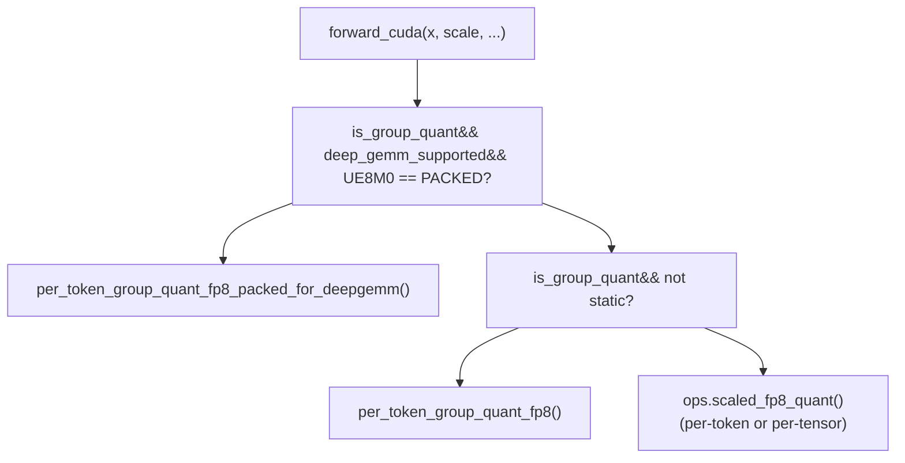
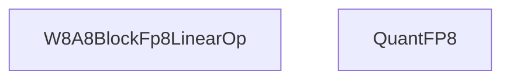
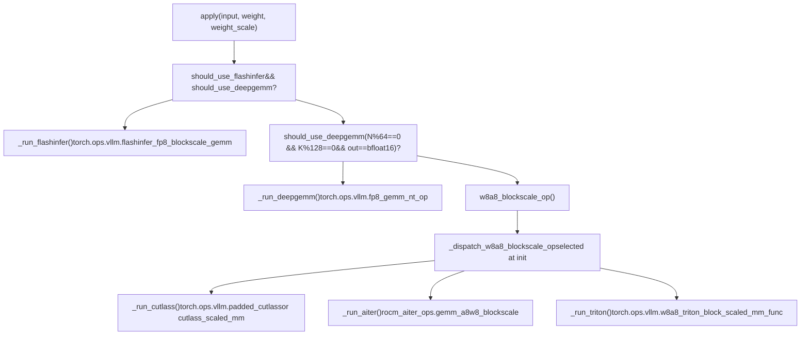

# FP8 与低精度量化

相关源码文件

-   [benchmarks/cutlass\_benchmarks/w8a8\_benchmarks.py](https://github.com/vllm-project/vllm/blob/7cc302dd/benchmarks/cutlass_benchmarks/w8a8_benchmarks.py)
-   [benchmarks/kernels/deepgemm/benchmark\_fp8\_block\_dense\_gemm.py](https://github.com/vllm-project/vllm/blob/7cc302dd/benchmarks/kernels/deepgemm/benchmark_fp8_block_dense_gemm.py)
-   [csrc/moe/marlin\_moe\_wna16/generate\_kernels.py](https://github.com/vllm-project/vllm/blob/7cc302dd/csrc/moe/marlin_moe_wna16/generate_kernels.py)
-   [csrc/moe/marlin\_moe\_wna16/kernel.h](https://github.com/vllm-project/vllm/blob/7cc302dd/csrc/moe/marlin_moe_wna16/kernel.h)
-   [csrc/moe/marlin\_moe\_wna16/marlin\_template.h](https://github.com/vllm-project/vllm/blob/7cc302dd/csrc/moe/marlin_moe_wna16/marlin_template.h)
-   [csrc/moe/marlin\_moe\_wna16/ops.cu](https://github.com/vllm-project/vllm/blob/7cc302dd/csrc/moe/marlin_moe_wna16/ops.cu)
-   [csrc/moe/moe\_wna16\_utils.h](https://github.com/vllm-project/vllm/blob/7cc302dd/csrc/moe/moe_wna16_utils.h)
-   [tests/kernels/quantization/test\_block\_fp8.py](https://github.com/vllm-project/vllm/blob/7cc302dd/tests/kernels/quantization/test_block_fp8.py)
-   [tests/kernels/quantization/test\_flashinfer\_nvfp4\_scaled\_mm.py](https://github.com/vllm-project/vllm/blob/7cc302dd/tests/kernels/quantization/test_flashinfer_nvfp4_scaled_mm.py)
-   [tests/kernels/quantization/test\_fp8\_quant.py](https://github.com/vllm-project/vllm/blob/7cc302dd/tests/kernels/quantization/test_fp8_quant.py)
-   [tests/kernels/quantization/test\_fp8\_quant\_group.py](https://github.com/vllm-project/vllm/blob/7cc302dd/tests/kernels/quantization/test_fp8_quant_group.py)
-   [tests/kernels/quantization/test\_nvfp4\_scaled\_mm.py](https://github.com/vllm-project/vllm/blob/7cc302dd/tests/kernels/quantization/test_nvfp4_scaled_mm.py)
-   [tests/quantization/test\_compressed\_tensors.py](https://github.com/vllm-project/vllm/blob/7cc302dd/tests/quantization/test_compressed_tensors.py)
-   [tests/v1/engine/conftest.py](https://github.com/vllm-project/vllm/blob/7cc302dd/tests/v1/engine/conftest.py)
-   [vllm/envs.py](https://github.com/vllm-project/vllm/blob/7cc302dd/vllm/envs.py)
-   [vllm/model\_executor/layers/fused\_moe/config.py](https://github.com/vllm-project/vllm/blob/7cc302dd/vllm/model_executor/layers/fused_moe/config.py)
-   [vllm/model\_executor/layers/fused\_moe/gpt\_oss\_triton\_kernels\_moe.py](https://github.com/vllm-project/vllm/blob/7cc302dd/vllm/model_executor/layers/fused_moe/gpt_oss_triton_kernels_moe.py)
-   [vllm/model\_executor/layers/fused\_moe/layer.py](https://github.com/vllm-project/vllm/blob/7cc302dd/vllm/model_executor/layers/fused_moe/layer.py)
-   [vllm/model\_executor/layers/fused\_moe/rocm\_aiter\_fused\_moe.py](https://github.com/vllm-project/vllm/blob/7cc302dd/vllm/model_executor/layers/fused_moe/rocm_aiter_fused_moe.py)
-   [vllm/model\_executor/layers/quantization/awq\_marlin.py](https://github.com/vllm-project/vllm/blob/7cc302dd/vllm/model_executor/layers/quantization/awq_marlin.py)
-   [vllm/model\_executor/layers/quantization/bitsandbytes.py](https://github.com/vllm-project/vllm/blob/7cc302dd/vllm/model_executor/layers/quantization/bitsandbytes.py)
-   [vllm/model\_executor/layers/quantization/compressed\_tensors/compressed\_tensors.py](https://github.com/vllm-project/vllm/blob/7cc302dd/vllm/model_executor/layers/quantization/compressed_tensors/compressed_tensors.py)
-   [vllm/model\_executor/layers/quantization/compressed\_tensors/compressed\_tensors\_moe.py](https://github.com/vllm-project/vllm/blob/7cc302dd/vllm/model_executor/layers/quantization/compressed_tensors/compressed_tensors_moe.py)
-   [vllm/model\_executor/layers/quantization/compressed\_tensors/schemes/\_\_init\_\_.py](https://github.com/vllm-project/vllm/blob/7cc302dd/vllm/model_executor/layers/quantization/compressed_tensors/schemes/__init__.py)
-   [vllm/model\_executor/layers/quantization/compressed\_tensors/schemes/compressed\_tensors\_w4a16\_mxfp4.py](https://github.com/vllm-project/vllm/blob/7cc302dd/vllm/model_executor/layers/quantization/compressed_tensors/schemes/compressed_tensors_w4a16_mxfp4.py)
-   [vllm/model\_executor/layers/quantization/compressed\_tensors/schemes/compressed\_tensors\_w4a16\_nvfp4.py](https://github.com/vllm-project/vllm/blob/7cc302dd/vllm/model_executor/layers/quantization/compressed_tensors/schemes/compressed_tensors_w4a16_nvfp4.py)
-   [vllm/model\_executor/layers/quantization/compressed\_tensors/schemes/compressed\_tensors\_w4a4\_nvfp4.py](https://github.com/vllm-project/vllm/blob/7cc302dd/vllm/model_executor/layers/quantization/compressed_tensors/schemes/compressed_tensors_w4a4_nvfp4.py)
-   [vllm/model\_executor/layers/quantization/compressed\_tensors/schemes/compressed\_tensors\_w8a16\_fp8.py](https://github.com/vllm-project/vllm/blob/7cc302dd/vllm/model_executor/layers/quantization/compressed_tensors/schemes/compressed_tensors_w8a16_fp8.py)
-   [vllm/model\_executor/layers/quantization/compressed\_tensors/schemes/compressed\_tensors\_w8a8\_fp8.py](https://github.com/vllm-project/vllm/blob/7cc302dd/vllm/model_executor/layers/quantization/compressed_tensors/schemes/compressed_tensors_w8a8_fp8.py)
-   [vllm/model\_executor/layers/quantization/experts\_int8.py](https://github.com/vllm-project/vllm/blob/7cc302dd/vllm/model_executor/layers/quantization/experts_int8.py)
-   [vllm/model\_executor/layers/quantization/fp8.py](https://github.com/vllm-project/vllm/blob/7cc302dd/vllm/model_executor/layers/quantization/fp8.py)
-   [vllm/model\_executor/layers/quantization/gguf.py](https://github.com/vllm-project/vllm/blob/7cc302dd/vllm/model_executor/layers/quantization/gguf.py)
-   [vllm/model\_executor/layers/quantization/gptq\_marlin.py](https://github.com/vllm-project/vllm/blob/7cc302dd/vllm/model_executor/layers/quantization/gptq_marlin.py)
-   [vllm/model\_executor/layers/quantization/input\_quant\_fp8.py](https://github.com/vllm-project/vllm/blob/7cc302dd/vllm/model_executor/layers/quantization/input_quant_fp8.py)
-   [vllm/model\_executor/layers/quantization/modelopt.py](https://github.com/vllm-project/vllm/blob/7cc302dd/vllm/model_executor/layers/quantization/modelopt.py)
-   [vllm/model\_executor/layers/quantization/moe\_wna16.py](https://github.com/vllm-project/vllm/blob/7cc302dd/vllm/model_executor/layers/quantization/moe_wna16.py)
-   [vllm/model\_executor/layers/quantization/mxfp4.py](https://github.com/vllm-project/vllm/blob/7cc302dd/vllm/model_executor/layers/quantization/mxfp4.py)
-   [vllm/model\_executor/layers/quantization/quark/quark\_moe.py](https://github.com/vllm-project/vllm/blob/7cc302dd/vllm/model_executor/layers/quantization/quark/quark_moe.py)
-   [vllm/model\_executor/layers/quantization/utils/fp8\_utils.py](https://github.com/vllm-project/vllm/blob/7cc302dd/vllm/model_executor/layers/quantization/utils/fp8_utils.py)
-   [vllm/model\_executor/layers/quantization/utils/marlin\_utils.py](https://github.com/vllm-project/vllm/blob/7cc302dd/vllm/model_executor/layers/quantization/utils/marlin_utils.py)
-   [vllm/model\_executor/layers/quantization/utils/marlin\_utils\_fp4.py](https://github.com/vllm-project/vllm/blob/7cc302dd/vllm/model_executor/layers/quantization/utils/marlin_utils_fp4.py)
-   [vllm/model\_executor/layers/quantization/utils/marlin\_utils\_fp8.py](https://github.com/vllm-project/vllm/blob/7cc302dd/vllm/model_executor/layers/quantization/utils/marlin_utils_fp8.py)
-   [vllm/model\_executor/layers/quantization/utils/nvfp4\_emulation\_utils.py](https://github.com/vllm-project/vllm/blob/7cc302dd/vllm/model_executor/layers/quantization/utils/nvfp4_emulation_utils.py)
-   [vllm/model\_executor/layers/quantization/utils/nvfp4\_utils.py](https://github.com/vllm-project/vllm/blob/7cc302dd/vllm/model_executor/layers/quantization/utils/nvfp4_utils.py)
-   [vllm/model\_executor/layers/quantization/utils/quant\_utils.py](https://github.com/vllm-project/vllm/blob/7cc302dd/vllm/model_executor/layers/quantization/utils/quant_utils.py)
-   [vllm/utils/deep\_gemm.py](https://github.com/vllm-project/vllm/blob/7cc302dd/vllm/utils/deep_gemm.py)

## 目的与范围

本页记录了 vLLM 中的低精度量化方法，重点关注 FP8, MXFP4 和 NVFP4 量化方案。内容涵盖了数据格式、后端选择策略以及每种量化类型的分发机制。本页解释了：

-   **FP8 量化**：8 位浮点数，具有按 token 组（per-token-group）的激活量化、按块（per-block）的权重量化、缩放因子（scale factor）格式（包括 UE8M0），以及通过 `W8A8BlockFp8LinearOp` 实现的多后端 GEMM 分发。
-   **MXFP4 量化**：微缩放（Microscaling）4 位格式，具有 8 位仅指数（exponent-only）缩放，后端选择逻辑以及平台特定优化。
-   **NVFP4 量化**：NVIDIA 4 位浮点格式，具有组缩放（group scales）和专门算子（kernel）。

有关这些量化方法如何应用于 MoE 专家层，请参阅 [7.3](https://github.com/vllm-project/vllm/blob/7cc302dd/7.3) 和 [7.4](https://github.com/vllm-project/vllm/blob/7cc302dd/7.4)。有关通用量化方法注册表以及量化方法如何连接到模型加载流水线，请参阅 [7.1](https://github.com/vllm-project/vllm/blob/7cc302dd/7.1)。

---

## FP8 数据类型

vLLM 使用适用于平台的 FP8 数据类型（dtypes）：

| 平台 | FP8 数据类型 | 备注 |
| --- | --- | --- |
| CUDA | `torch.float8_e4m3fn` | 标准 FP8，最大值 448.0 |
| ROCm | `torch.float8_e4m3fnuz` | 无符号零变体，最大值 224.0 |

[vllm/model\_executor/layers/quantization/utils/fp8\_utils.py53-56](https://github.com/vllm-project/vllm/blob/7cc302dd/vllm/model_executor/layers/quantization/utils/fp8_utils.py#L53-L56) 中的 `is_fp8` 辅助函数用于检查任一数据类型。平台正确的类型通过 `current_platform.fp8_dtype()` 获取。

---

## 量化粒度

vLLM 中的 Block-FP8 (W8A8) 对权重和激活使用两种不同的量化粒度（quantization granularities）：

| 张量 | 粒度 | 典型块形状 | 缩放张量形状 |
| --- | --- | --- | --- |
| 权重 | 按块 (2D tile) | `[128, 128]` (N×K) | `(num_N_tiles, num_K_tiles)` |
| 激活 | 按 token 组 (1D row group) | `[1, 128]` (每行段一个组) | `(M, K//128)` |

这与 DeepSeek-V3 等模型要求的格式一致，这些模型在两个维度上都使用 128 元素的组 [vllm/model\_executor/layers/quantization/utils/quant\_utils.py68-70](https://github.com/vllm-project/vllm/blob/7cc302dd/vllm/model_executor/layers/quantization/utils/quant_utils.py#L68-L70)。

---

## 缩放因子格式

使用了三种缩放因子（scale factor）格式，由 `DeepGemmQuantScaleFMT` 根据硬件和配置进行选择：

**`DeepGemmQuantScaleFMT` 枚举** — [vllm/utils/deep\_gemm.py45-54](https://github.com/vllm-project/vllm/blob/7cc302dd/vllm/utils/deep_gemm.py#L45-L54)

| 枚举值 | 描述 | 使用时机 |
| --- | --- | --- |
| `FLOAT32` | Float32 缩放张量，标准布局 | 禁用 DeepGEMM，或 Triton/CUTLASS 后端 |
| `FLOAT32_CEIL_UE8M0` | Float32 张量，数值向上取整到 2 的幂 | Hopper (SM90), `VLLM_USE_DEEP_GEMM_E8M0=1` |
| `UE8M0` | Int32 张量，每个元素打包 4 个 UE8M0 缩放值 | Blackwell (SM100+), `VLLM_USE_DEEP_GEMM_E8M0=1` |

决策结果在启动时通过 `DeepGemmQuantScaleFMT.init_oracle_cache()` [vllm/utils/deep\_gemm.py57-83](https://github.com/vllm-project/vllm/blob/7cc302dd/vllm/utils/deep_gemm.py#L57-L83) 进行缓存。当 UE8M0 路径处于激活状态时，辅助函数 `is_deep_gemm_e8m0_used()` [vllm/utils/deep\_gemm.py96-119](https://github.com/vllm-project/vllm/blob/7cc302dd/vllm/utils/deep_gemm.py#L96-L119) 返回 `True`。

**UE8M0 缩放编码**：每个缩放值 `s` 存储为 `2^ceil(log2(s))` —— 即 `s` 的下一个 2 的幂上限。这使得在 Blackwell 上能进行高效的硬件级反量化 [vllm/utils/deep\_gemm.py48-50](https://github.com/vllm-project/vllm/blob/7cc302dd/vllm/utils/deep_gemm.py#L48-L50)。

---

## 缩放张量内存布局

激活缩放张量的内存布局因后端而异：

**图表：`(M=4, K=256, group_size=128)` 的缩放张量布局变体 → 每行 2 个组**

布局由 `per_token_group_quant_fp8` 的参数控制：

-   `column_major_scales=False` → 行优先 (row-major)（Triton，默认）
-   `column_major_scales=True, tma_aligned_scales=False` → 列优先 (column-major)（CUTLASS）
-   `column_major_scales=True, tma_aligned_scales=True` → TMA 对齐（DeepGEMM Hopper）

来源：[vllm/model\_executor/layers/quantization/utils/fp8\_utils.py206-212](https://github.com/vllm-project/vllm/blob/7cc302dd/vllm/model_executor/layers/quantization/utils/fp8_utils.py#L206-L212)

---

## 输入量化：`QuantFP8`

`QuantFP8` 是一个 `CustomOp`，用于将输入激活量化为 FP8。它支持按张量、按 token、按通道和按组的量化模式。

**关键构造函数参数**：[vllm/model\_executor/layers/quantization/input\_quant\_fp8.py33-72](https://github.com/vllm-project/vllm/blob/7cc302dd/vllm/model_executor/layers/quantization/input_quant_fp8.py#L33-L72)

| 参数 | 类型 | 效果 |
| --- | --- | --- |
| `static` | bool | 静态（预计算）对比动态（在线）缩放 |
| `group_shape` | `GroupShape` | `PER_TOKEN`, `PER_TENSOR` 或用于块量化的 `(1, group_size)` |
| `column_major_scales` | bool | 以列优先布局输出缩放比例 |
| `tma_aligned_scales` | bool | 应用 TMA 步长对齐 (DeepGEMM Hopper) |
| `use_ue8m0` | bool | 使用 2 的幂缩放上限编码 |

**图表：`QuantFP8.forward_cuda` 分发逻辑**

来源：[vllm/model\_executor/layers/quantization/input\_quant\_fp8.py83-131](https://github.com/vllm-project/vllm/blob/7cc302dd/vllm/model_executor/layers/quantization/input_quant_fp8.py#L83-L131)

---

## GEMM 后端分发：`W8A8BlockFp8LinearOp`

`W8A8BlockFp8LinearOp` 是在线性层中运行块量化 FP8 矩阵乘法的核心类。

[vllm/model\_executor/layers/quantization/utils/fp8\_utils.py347-585](https://github.com/vllm-project/vllm/blob/7cc302dd/vllm/model_executor/layers/quantization/utils/fp8_utils.py#L347-L585)

**图表：`W8A8BlockFp8LinearOp` 结构和后端方法**

**图表：`apply()` 分发流程图**

来源：[vllm/model\_executor/layers/quantization/utils/fp8\_utils.py388-585](https://github.com/vllm-project/vllm/blob/7cc302dd/vllm/model_executor/layers/quantization/utils/fp8_utils.py#L388-L585)

---

## MXFP4 量化

MXFP4 (Microscaling 4-bit) 为一组 4 位数值使用共享的 8 位指数。vLLM 根据硬件能力和是否存在 LoRA 来选择 MXFP4 的后端。

### 后端选择逻辑

选择逻辑由 `select_mxfp4_moe_backend` 处理 [vllm/model\_executor/layers/quantization/mxfp4.py101](https://github.com/vllm-project/vllm/blob/7cc302dd/vllm/model_executor/layers/quantization/mxfp4.py#L101-L101)。

| 平台 | 能力 | 后端 | 条件 |
| --- | --- | --- | --- |
| CUDA | SM100 | `FLASHINFER_TRTLLM_MXFP4_MXFP8` | 带有 FlashInfer TRTLLM 的 SM100 [vllm/model\_executor/layers/quantization/mxfp4.py130](https://github.com/vllm-project/vllm/blob/7cc302dd/vllm/model_executor/layers/quantization/mxfp4.py#L130-L130) |
| CUDA | SM90 | `FLASHINFER_TRTLLM_MXFP4_MXFP8` | 带有 FlashInfer TRTLLM 的 SM90 [vllm/model\_executor/layers/quantization/mxfp4.py130](https://github.com/vllm-project/vllm/blob/7cc302dd/vllm/model_executor/layers/quantization/mxfp4.py#L130-L130) |
| CUDA | 任意 | `MARLIN` | `VLLM_MXFP4_USE_MARLIN=1` [vllm/envs.py148](https://github.com/vllm-project/vllm/blob/7cc302dd/vllm/envs.py#L148-L148) |
| ROCm | GFX950 | `CK` | 已启用 ROCm AITER [vllm/model\_executor/layers/quantization/mxfp4.py161](https://github.com/vllm-project/vllm/blob/7cc302dd/vllm/model_executor/layers/quantization/mxfp4.py#L161-L161) |

### 实现细节

`Mxfp4MoEMethod` 类 [vllm/model\_executor/layers/quantization/mxfp4.py95-121](https://github.com/vllm-project/vllm/blob/7cc302dd/vllm/model_executor/layers/quantization/mxfp4.py#L95-L121) 负责将 `w13_weight` 和 `w2_weight` 创建为 `torch.uint8` 参数 [vllm/model\_executor/layers/quantization/mxfp4.py168-193](https://github.com/vllm-project/vllm/blob/7cc302dd/vllm/model_executor/layers/quantization/mxfp4.py#L168-L193)。它还管理块大小为 32 的 `w13_weight_scale` 和 `w2_weight_scale` [vllm/model\_executor/layers/quantization/mxfp4.py144](https://github.com/vllm-project/vllm/blob/7cc302dd/vllm/model_executor/layers/quantization/mxfp4.py#L144-L144)。

---

## NVFP4 量化

NVFP4 是 NVIDIA Blackwell GPU 的原生 4 位浮点格式。vLLM 通过 `ModelOpt` 或 `CompressedTensors` 配置集成此格式。

### 后端选择

NVFP4 MoE 的后端选择由 `select_nvfp4_moe_backend` 执行 [vllm/model\_executor/layers/quantization/modelopt.py42-43](https://github.com/vllm-project/vllm/blob/7cc302dd/vllm/model_executor/layers/quantization/modelopt.py#L42-L43)。后端包括：

-   `DEEP_EP`：低延迟专家并行（expert parallel）后端 [vllm/model\_executor/layers/quantization/modelopt.py28](https://github.com/vllm-project/vllm/blob/7cc302dd/vllm/model_executor/layers/quantization/modelopt.py#L28-L28)。
-   `FLASHINFER`：高吞吐量注意力/GEMM 后端 [vllm/model\_executor/layers/quantization/modelopt.py40](https://github.com/vllm-project/vllm/blob/7cc302dd/vllm/model_executor/layers/quantization/modelopt.py#L40-L40)。

### 权重准备

对于 FlashInfer TRTLLM 风格的 NVFP4 算子（kernels），权重必须经过交织（interleaved）和置换（permuted）。这由 `convert_to_nvfp4_moe_kernel_format` 处理 [vllm/model\_executor/layers/quantization/modelopt.py38](https://github.com/vllm-project/vllm/blob/7cc302dd/vllm/model_executor/layers/quantization/modelopt.py#L38-L38)。

---

## 环境变量

| 变量 | 默认值 | 效果 |
| --- | --- | --- |
| `VLLM_USE_DEEP_GEMM` | `True` | 为 FP8 线性层和 MoE 传递启用 DeepGEMM 算子 [vllm/envs.py154](https://github.com/vllm-project/vllm/blob/7cc302dd/vllm/envs.py#L154-L154) |
| `VLLM_USE_DEEP_GEMM_E8M0` | `True` | 使用 UE8M0 (2 的幂) 缩放编码 [vllm/envs.py156](https://github.com/vllm-project/vllm/blob/7cc302dd/vllm/envs.py#L156-L156) |
| `VLLM_MXFP4_USE_MARLIN` | `None` | 强制为 MXFP4 使用 Marlin 后端 [vllm/envs.py148](https://github.com/vllm-project/vllm/blob/7cc302dd/vllm/envs.py#L148-L148) |
| `VLLM_BLOCKSCALE_FP8_GEMM_FLASHINFER` | `True` | 使用 FlashInfer 进行块缩放 (block-scale) FP8 GEMM [vllm/envs.py164](https://github.com/vllm-project/vllm/blob/7cc302dd/vllm/envs.py#L164-L164) |

来源：[vllm/envs.py145-170](https://github.com/vllm-project/vllm/blob/7cc302dd/vllm/envs.py#L145-L170) [vllm/utils/deep\_gemm.py96-119](https://github.com/vllm-project/vllm/blob/7cc302dd/vllm/utils/deep_gemm.py#L96-L119)

---

## Block-FP8 线性层数据流

**图表：Block-FP8 前向传递的端到端数据流**

> **[Mermaid sequence]**
> *(图表结构无法解析)*

来源：[vllm/model\_executor/layers/quantization/utils/fp8\_utils.py388-585](https://github.com/vllm-project/vllm/blob/7cc302dd/vllm/model_executor/layers/quantization/utils/fp8_utils.py#L388-L585)
