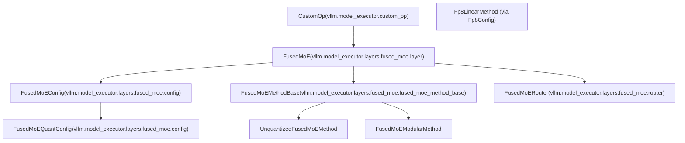
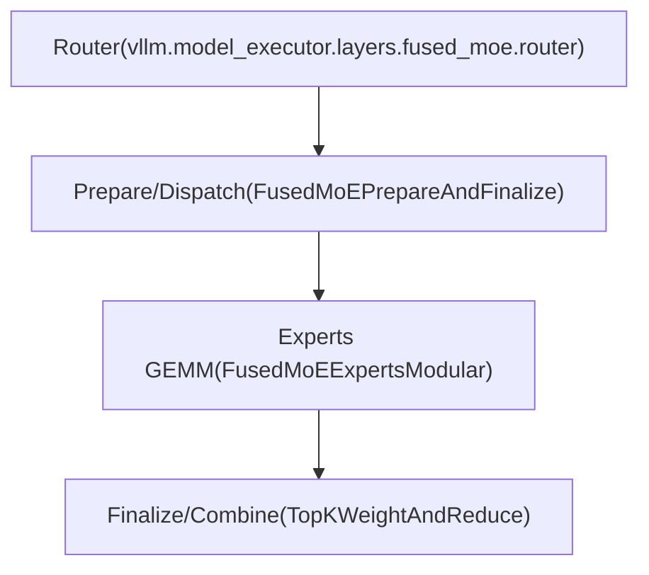
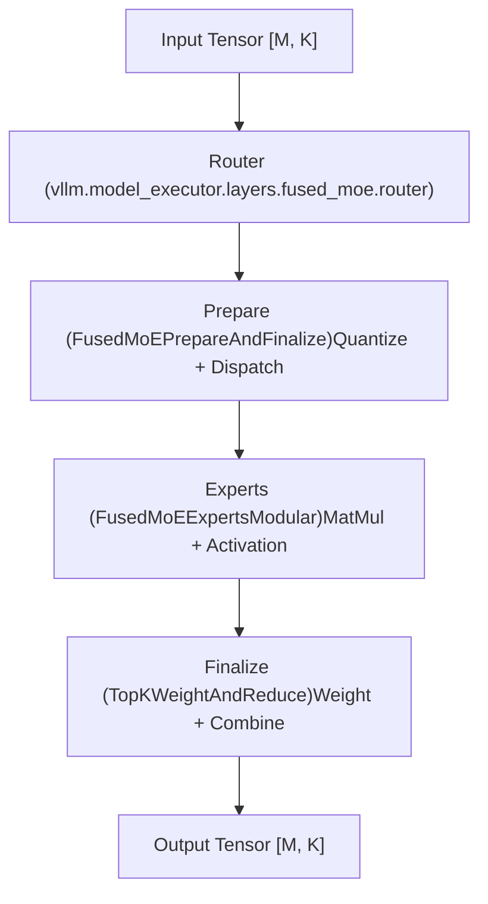

# FusedMoE 层架构

相关源码文件

-   [vllm/envs.py](https://github.com/vllm-project/vllm/blob/7cc302dd/vllm/envs.py)
-   [vllm/model\_executor/layers/fused\_moe/\_\_init\_\_.py](https://github.com/vllm-project/vllm/blob/7cc302dd/vllm/model_executor/layers/fused_moe/__init__.py)
-   [vllm/model\_executor/layers/fused\_moe/batched\_deep\_gemm\_moe.py](https://github.com/vllm-project/vllm/blob/7cc302dd/vllm/model_executor/layers/fused_moe/batched_deep_gemm_moe.py)
-   [vllm/model\_executor/layers/fused\_moe/config.py](https://github.com/vllm-project/vllm/blob/7cc302dd/vllm/model_executor/layers/fused_moe/config.py)
-   [vllm/model\_executor/layers/fused\_moe/cutlass\_moe.py](https://github.com/vllm-project/vllm/blob/7cc302dd/vllm/model_executor/layers/fused_moe/cutlass_moe.py)
-   [vllm/model\_executor/layers/fused\_moe/deep\_gemm\_moe.py](https://github.com/vllm-project/vllm/blob/7cc302dd/vllm/model_executor/layers/fused_moe/deep_gemm_moe.py)
-   [vllm/model\_executor/layers/fused\_moe/fused\_batched\_moe.py](https://github.com/vllm-project/vllm/blob/7cc302dd/vllm/model_executor/layers/fused_moe/fused_batched_moe.py)
-   [vllm/model\_executor/layers/fused\_moe/fused\_moe.py](https://github.com/vllm-project/vllm/blob/7cc302dd/vllm/model_executor/layers/fused_moe/fused_moe.py)
-   [vllm/model\_executor/layers/fused\_moe/fused\_moe\_method\_base.py](https://github.com/vllm-project/vllm/blob/7cc302dd/vllm/model_executor/layers/fused_moe/fused_moe_method_base.py)
-   [vllm/model\_executor/layers/fused\_moe/fused\_moe\_modular\_method.py](https://github.com/vllm-project/vllm/blob/7cc302dd/vllm/model_executor/layers/fused_moe/fused_moe_modular_method.py)
-   [vllm/model\_executor/layers/fused\_moe/gpt\_oss\_triton\_kernels\_moe.py](https://github.com/vllm-project/vllm/blob/7cc302dd/vllm/model_executor/layers/fused_moe/gpt_oss_triton_kernels_moe.py)
-   [vllm/model\_executor/layers/fused\_moe/layer.py](https://github.com/vllm-project/vllm/blob/7cc302dd/vllm/model_executor/layers/fused_moe/layer.py)
-   [vllm/model\_executor/layers/fused\_moe/modular\_kernel.py](https://github.com/vllm-project/vllm/blob/7cc302dd/vllm/model_executor/layers/fused_moe/modular_kernel.py)
-   [vllm/model\_executor/layers/fused\_moe/rocm\_aiter\_fused\_moe.py](https://github.com/vllm-project/vllm/blob/7cc302dd/vllm/model_executor/layers/fused_moe/rocm_aiter_fused_moe.py)
-   [vllm/model\_executor/layers/fused\_moe/triton\_deep\_gemm\_moe.py](https://github.com/vllm-project/vllm/blob/7cc302dd/vllm/model_executor/layers/fused_moe/triton_deep_gemm_moe.py)
-   [vllm/model\_executor/layers/fused\_moe/unquantized\_fused\_moe\_method.py](https://github.com/vllm-project/vllm/blob/7cc302dd/vllm/model_executor/layers/fused_moe/unquantized_fused_moe_method.py)
-   [vllm/model\_executor/layers/fused\_moe/utils.py](https://github.com/vllm-project/vllm/blob/7cc302dd/vllm/model_executor/layers/fused_moe/utils.py)
-   [vllm/model\_executor/layers/quantization/awq\_marlin.py](https://github.com/vllm-project/vllm/blob/7cc302dd/vllm/model_executor/layers/quantization/awq_marlin.py)
-   [vllm/model\_executor/layers/quantization/bitsandbytes.py](https://github.com/vllm-project/vllm/blob/7cc302dd/vllm/model_executor/layers/quantization/bitsandbytes.py)
-   [vllm/model\_executor/layers/quantization/compressed\_tensors/compressed\_tensors\_moe.py](https://github.com/vllm-project/vllm/blob/7cc302dd/vllm/model_executor/layers/quantization/compressed_tensors/compressed_tensors_moe.py)
-   [vllm/model\_executor/layers/quantization/experts\_int8.py](https://github.com/vllm-project/vllm/blob/7cc302dd/vllm/model_executor/layers/quantization/experts_int8.py)
-   [vllm/model\_executor/layers/quantization/fp8.py](https://github.com/vllm-project/vllm/blob/7cc302dd/vllm/model_executor/layers/quantization/fp8.py)
-   [vllm/model\_executor/layers/quantization/gguf.py](https://github.com/vllm-project/vllm/blob/7cc302dd/vllm/model_executor/layers/quantization/gguf.py)
-   [vllm/model\_executor/layers/quantization/gptq\_marlin.py](https://github.com/vllm-project/vllm/blob/7cc302dd/vllm/model_executor/layers/quantization/gptq_marlin.py)
-   [vllm/model\_executor/layers/quantization/modelopt.py](https://github.com/vllm-project/vllm/blob/7cc302dd/vllm/model_executor/layers/quantization/modelopt.py)
-   [vllm/model\_executor/layers/quantization/moe\_wna16.py](https://github.com/vllm-project/vllm/blob/7cc302dd/vllm/model_executor/layers/quantization/moe_wna16.py)
-   [vllm/model\_executor/layers/quantization/mxfp4.py](https://github.com/vllm-project/vllm/blob/7cc302dd/vllm/model_executor/layers/quantization/mxfp4.py)
-   [vllm/model\_executor/layers/quantization/quark/quark\_moe.py](https://github.com/vllm-project/vllm/blob/7cc302dd/vllm/model_executor/layers/quantization/quark/quark_moe.py)

本文档描述了 `FusedMoE` 层的架构，该层在 vLLM 中实现了混合专家（Mixture-of-Experts, MoE）功能。内容涵盖了核心层结构、模块化算子（kernel）接口、专家执行以及配置系统。

## 目的与范围

`FusedMoE` 层是 vLLM 对稀疏混合专家神经网络层的实现。它将多个专家网络与路由逻辑相结合，支持各种量化方案、并行化策略和硬件后端。该层处理：

-   专家权重的创建和管理。
-   通过 top-K 选择将 token 路由到专家。
-   具有多种分发策略的专家并行（Expert Parallelism, EP）。
-   针对不同硬件后端（Triton, CUTLASS, DeepGemm, FlashInfer, AITER）的模块化算子执行。
-   与张量并行（Tensor Parallel, TP）和数据并行（Data Parallel, DP）执行的集成。

## 核心 FusedMoE 类

`FusedMoE` 类是核心组件，继承自 `CustomOp`，并为跨不同量化方案和硬件平台的 MoE 操作提供统一接口。

**类结构图**

**来源：** [vllm/model\_executor/layers/fused\_moe/layer.py274-336](https://github.com/vllm-project/vllm/blob/7cc302dd/vllm/model_executor/layers/fused_moe/layer.py#L274-L336) [vllm/model\_executor/layers/fused\_moe/config.py192-268](https://github.com/vllm-project/vllm/blob/7cc302dd/vllm/model_executor/layers/fused_moe/config.py#L192-L268) [vllm/model\_executor/layers/fused\_moe/fused\_moe\_method\_base.py1-10](https://github.com/vllm-project/vllm/blob/7cc302dd/vllm/model_executor/layers/fused_moe/fused_moe_method_base.py#L1-L10)

### 关键初始化参数

`FusedMoE.__init__` 方法接受控制层行为的参数：

| 参数 | 类型 | 用途 |
| --- | --- | --- |
| `num_experts` | `int` | 所有 rank 上的全局专家数量 |
| `top_k` | `int` | 每个 token 选择的专家数量 |
| `hidden_size` | `int` | 输入/输出维度 |
| `intermediate_size` | `int` | 专家 MLP 中间维度 |
| `quant_config` | `QuantizationConfig` | 量化方案配置 |
| `tp_size`, `ep_size`, `dp_size` | `int` | 并行维度 |

**来源：** [vllm/model\_executor/layers/fused\_moe/layer.py300-335](https://github.com/vllm-project/vllm/blob/7cc302dd/vllm/model_executor/layers/fused_moe/layer.py#L300-L335)

## 模块化算子架构

vLLM 采用模块化算子（kernel）设计，将通信（分发/合并）与计算（专家 GEMM）解耦。这允许混合和匹配不同的后端，如 Triton, DeepGemm 和 DeepEP。

**模块化组件图**

### 模块化算子接口

该架构依赖于 `modular_kernel.py` 中定义的几个抽象基类：

1.  **`FusedMoEPrepareAndFinalize`**：处理输入量化以及将 token 分发给专家（例如，通过 All-to-All）。
    -   `prepare()`：将 token 分发给本地专家。[vllm/model\_executor/layers/fused\_moe/modular\_kernel.py216-224](https://github.com/vllm-project/vllm/blob/7cc302dd/vllm/model_executor/layers/fused_moe/modular_kernel.py#L216-L224)
    -   `finalize()`：将专家输出合并回原始 token 顺序。[vllm/model\_executor/layers/fused\_moe/modular\_kernel.py231-240](https://github.com/vllm-project/vllm/blob/7cc302dd/vllm/model_executor/layers/fused_moe/modular_kernel.py#L231-L240)
2.  **`FusedMoEExpertsModular`**：实现实际的专家计算（矩阵乘法 MatMul + 激活 Activation）。
    -   `run()`：执行专家 GEMM。[vllm/model\_executor/layers/fused\_moe/modular\_kernel.py446-455](https://github.com/vllm-project/vllm/blob/7cc302dd/vllm/model_executor/layers/fused_moe/modular_kernel.py#L446-L455)
3.  **`TopKWeightAndReduce`**：将路由权重应用于专家输出并执行最终归约（reduction）。[vllm/model\_executor/layers/fused\_moe/modular\_kernel.py113-132](https://github.com/vllm-project/vllm/blob/7cc302dd/vllm/model_executor/layers/fused_moe/modular_kernel.py#L113-L132)

**来源：** [vllm/model\_executor/layers/fused\_moe/modular\_kernel.py42-76](https://github.com/vllm-project/vllm/blob/7cc302dd/vllm/model_executor/layers/fused_moe/modular_kernel.py#L42-L76)

## 专家执行后端

vLLM 支持多个专门的专家执行后端，根据硬件能力和量化配置进行选择。

### Triton 后端

`TritonExperts` 类使用 Triton JIT 算子（kernels）执行融合 MoE 操作。它支持各种量化格式，包括 GPTQ, AWQ 和 FP8。

-   **算子 (Kernel)**：`fused_moe_kernel_gptq_awq` [vllm/model\_executor/layers/fused\_moe/fused\_moe.py78-125](https://github.com/vllm-project/vllm/blob/7cc302dd/vllm/model_executor/layers/fused_moe/fused_moe.py#L78-L125)
-   **逻辑**：Token 按专家 ID 排序，以确保块内连续的内存访问。[vllm/model\_executor/layers/fused\_moe/fused\_moe.py141-151](https://github.com/vllm-project/vllm/blob/7cc302dd/vllm/model_executor/layers/fused_moe/fused_moe.py#L141-L151)

### DeepGemm 后端

`DeepGemmExperts` 为 NVIDIA Hopper (SM90) 架构专门提供高度优化的 FP8 算子。

-   **支持**：通过 `VLLM_MOE_USE_DEEP_GEMM` 启用。[vllm/envs.py155](https://github.com/vllm-project/vllm/blob/7cc302dd/vllm/envs.py#L155-L155)
-   **对齐**：要求 M, N, K 对齐以适用于 TMA (Tensor Memory Accelerator)。[vllm/envs.py157](https://github.com/vllm-project/vllm/blob/7cc302dd/vllm/envs.py#L157-L157)

### CUTLASS 后端

`CutlassExpertsFp8` 利用 CUTLASS 进行分组 GEMM（grouped GEMM）操作，主要用于 SM89+ 设备上的 FP8 量化。

-   **函数**：`run_cutlass_moe_fp8` [vllm/model\_executor/layers/fused\_moe/cutlass\_moe.py51-76](https://github.com/vllm-project/vllm/blob/7cc302dd/vllm/model_executor/layers/fused_moe/cutlass_moe.py#L51-L76)

### ROCm AITER 后端

在 AMD 硬件上，vLLM 可以使用 AITER 后端处理 MoE。

-   **函数**：`rocm_aiter_fused_experts` [vllm/model\_executor/layers/fused\_moe/rocm\_aiter\_fused\_moe.py183-196](https://github.com/vllm-project/vllm/blob/7cc302dd/vllm/model_executor/layers/fused_moe/rocm_aiter_fused_moe.py#L183-L196)
-   **配置**：由 `VLLM_ROCM_USE_AITER_MOE` 控制。[vllm/envs.py106](https://github.com/vllm-project/vllm/blob/7cc302dd/vllm/envs.py#L106-L106)

**来源：** [vllm/model\_executor/layers/fused\_moe/fused\_moe.py78-125](https://github.com/vllm-project/vllm/blob/7cc302dd/vllm/model_executor/layers/fused_moe/fused_moe.py#L78-L125) [vllm/model\_executor/layers/fused\_moe/cutlass\_moe.py51-76](https://github.com/vllm-project/vllm/blob/7cc302dd/vllm/model_executor/layers/fused_moe/cutlass_moe.py#L51-L76) [vllm/model\_executor/layers/fused\_moe/rocm\_aiter\_fused\_moe.py183-196](https://github.com/vllm-project/vllm/blob/7cc302dd/vllm/model_executor/layers/fused_moe/rocm_aiter_fused_moe.py#L183-L196)

## 专家分发与并行

### 专家放置

FusedMoE 支持跨 rank 放置专家的不同策略：

-   **线性 (Linear)**：每个 rank 放置连续的专家块。[vllm/model\_executor/layers/fused\_moe/layer.py114-118](https://github.com/vllm-project/vllm/blob/7cc302dd/vllm/model_executor/layers/fused_moe/layer.py#L114-L118)
-   **轮询 (Round-Robin)**：在 rank 之间交错放置专家，通常与 DeepEP 低延迟算子配合使用。[vllm/model\_executor/layers/fused\_moe/layer.py119-126](https://github.com/vllm-project/vllm/blob/7cc302dd/vllm/model_executor/layers/fused_moe/layer.py#L119-L126)

### 通信 (DeepEP 与 NIXL)

对于专家并行（EP），vLLM 支持先进的通信后端：

-   **DeepEP**：针对 Hopper GPU 的低延迟算子。[vllm/model\_executor/layers/fused\_moe/layer.py178](https://github.com/vllm-project/vllm/blob/7cc302dd/vllm/model_executor/layers/fused_moe/layer.py#L178-L178)
-   **NIXL**：高性能 EP 后端。[vllm/model\_executor/layers/fused\_moe/layer.py179](https://github.com/vllm-project/vllm/blob/7cc302dd/vllm/model_executor/layers/fused_moe/layer.py#L179-L179)

**来源：** [vllm/model\_executor/layers/fused\_moe/layer.py66-152](https://github.com/vllm-project/vllm/blob/7cc302dd/vllm/model_executor/layers/fused_moe/layer.py#L66-L152) [vllm/model\_executor/layers/fused\_moe/layer.py162-189](https://github.com/vllm-project/vllm/blob/7cc302dd/vllm/model_executor/layers/fused_moe/layer.py#L162-L189)

## 配置系统

FusedMoE 层使用分层配置系统来管理不同精度和硬件的复杂性。

### FusedMoEConfig

包含基础维度和路由参数。

-   **字段**：`num_experts`, `top_k`, `hidden_dim`, `scoring_func`。[vllm/model\_executor/layers/fused\_moe/config.py422-567](https://github.com/vllm-project/vllm/blob/7cc302dd/vllm/model_executor/layers/fused_moe/config.py#L422-L567)

### FusedMoEParallelConfig

封装了并行化详情和后端选择。

-   **字段**：`tp_size`, `ep_size`, `dp_size`, `all2all_backend`。[vllm/model\_executor/layers/fused\_moe/config.py570-741](https://github.com/vllm-project/vllm/blob/7cc302dd/vllm/model_executor/layers/fused_moe/config.py#L570-L741)

### FusedMoEQuantConfig

描述了激活和权重（`a1`, `a2`, `w1`, `w2`）的量化参数。

-   **结构**：使用 `FusedMoEQuantDesc` 为每个组件定义 `dtype`, `shape` (GroupShape) 和 `scale`。[vllm/model\_executor/layers/fused\_moe/config.py153-205](https://github.com/vllm-project/vllm/blob/7cc302dd/vllm/model_executor/layers/fused_moe/config.py#L153-L205)

## 执行数据流

**关键辅助函数：**

-   `fused_topk`：计算路由概率和索引。[vllm/model\_executor/layers/fused\_moe/fused\_moe.py18](https://github.com/vllm-project/vllm/blob/7cc302dd/vllm/model_executor/layers/fused_moe/fused_moe.py#L18-L18)
-   `moe_align_block_size`：对 token 进行填充以满足算子块大小要求。[vllm/model\_executor/layers/fused\_moe/moe\_align\_block\_size.py28-30](https://github.com/vllm-project/vllm/blob/7cc302dd/vllm/model_executor/layers/fused_moe/moe_align_block_size.py#L28-L30)
-   `moe_kernel_quantize_input`：在专家分发前对激活进行量化。[vllm/model\_executor/layers/fused\_moe/utils.py37](https://github.com/vllm-project/vllm/blob/7cc302dd/vllm/model_executor/layers/fused_moe/utils.py#L37-L37)

**来源：** [vllm/model\_executor/layers/fused\_moe/layer.py348-430](https://github.com/vllm-project/vllm/blob/7cc302dd/vllm/model_executor/layers/fused_moe/layer.py#L348-L430) [vllm/model\_executor/layers/fused\_moe/modular\_kernel.py113-170](https://github.com/vllm-project/vllm/blob/7cc302dd/vllm/model_executor/layers/fused_moe/modular_kernel.py#L113-L170) [vllm/model\_executor/layers/fused\_moe/moe_align_block_size.py28-30](https://github.com/vllm-project/vllm/blob/7cc302dd/vllm/model_executor/layers/fused_moe/moe_align_block_size.py#L28-L30)
