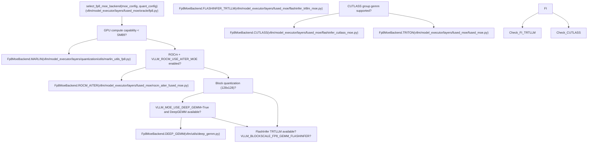
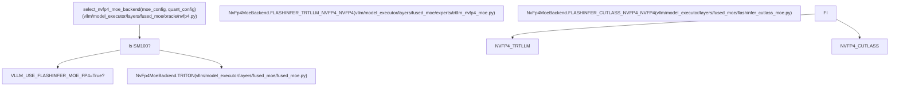
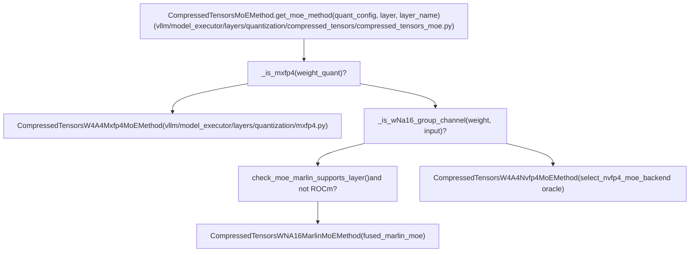

# MoE 量化与后端选择

相关源码文件

-   [benchmarks/kernels/benchmark\_moe.py](https://github.com/vllm-project/vllm/blob/7cc302dd/benchmarks/kernels/benchmark_moe.py)
-   [benchmarks/kernels/benchmark\_moe\_align\_block\_size.py](https://github.com/vllm-project/vllm/blob/7cc302dd/benchmarks/kernels/benchmark_moe_align_block_size.py)
-   [benchmarks/kernels/benchmark\_moe\_permute\_unpermute.py](https://github.com/vllm-project/vllm/blob/7cc302dd/benchmarks/kernels/benchmark_moe_permute_unpermute.py)
-   [csrc/moe/moe\_align\_sum\_kernels.cu](https://github.com/vllm-project/vllm/blob/7cc302dd/csrc/moe/moe_align_sum_kernels.cu)
-   [csrc/moe/moe\_ops.h](https://github.com/vllm-project/vllm/blob/7cc302dd/csrc/moe/moe_ops.h)
-   [csrc/moe/moe\_permute\_unpermute\_op.cu](https://github.com/vllm-project/vllm/blob/7cc302dd/csrc/moe/moe_permute_unpermute_op.cu)
-   [csrc/moe/permute\_unpermute\_kernels/moe\_permute\_unpermute\_kernel.cu](https://github.com/vllm-project/vllm/blob/7cc302dd/csrc/moe/permute_unpermute_kernels/moe_permute_unpermute_kernel.cu)
-   [csrc/moe/permute\_unpermute\_kernels/moe\_permute\_unpermute\_kernel.h](https://github.com/vllm-project/vllm/blob/7cc302dd/csrc/moe/permute_unpermute_kernels/moe_permute_unpermute_kernel.h)
-   [csrc/moe/permute\_unpermute\_kernels/moe\_permute\_unpermute\_kernel.inl](https://github.com/vllm-project/vllm/blob/7cc302dd/csrc/moe/permute_unpermute_kernels/moe_permute_unpermute_kernel.inl)
-   [csrc/moe/torch\_bindings.cpp](https://github.com/vllm-project/vllm/blob/7cc302dd/csrc/moe/torch_bindings.cpp)
-   [tests/kernels/moe/test\_cutedsl\_moe.py](https://github.com/vllm-project/vllm/blob/7cc302dd/tests/kernels/moe/test_cutedsl_moe.py)
-   [tests/kernels/moe/test\_cutlass\_moe.py](https://github.com/vllm-project/vllm/blob/7cc302dd/tests/kernels/moe/test_cutlass_moe.py)
-   [tests/kernels/moe/test\_flashinfer.py](https://github.com/vllm-project/vllm/blob/7cc302dd/tests/kernels/moe/test_flashinfer.py)
-   [tests/kernels/moe/test\_flashinfer\_moe.py](https://github.com/vllm-project/vllm/blob/7cc302dd/tests/kernels/moe/test_flashinfer_moe.py)
-   [tests/kernels/moe/test\_modular\_oai\_triton\_moe.py](https://github.com/vllm-project/vllm/blob/7cc302dd/tests/kernels/moe/test_modular_oai_triton_moe.py)
-   [tests/kernels/moe/test\_moe.py](https://github.com/vllm-project/vllm/blob/7cc302dd/tests/kernels/moe/test_moe.py)
-   [tests/kernels/moe/test\_moe\_align\_block\_size.py](https://github.com/vllm-project/vllm/blob/7cc302dd/tests/kernels/moe/test_moe_align_block_size.py)
-   [tests/kernels/moe/test\_moe\_permute\_unpermute.py](https://github.com/vllm-project/vllm/blob/7cc302dd/tests/kernels/moe/test_moe_permute_unpermute.py)
-   [tests/kernels/moe/test\_nvfp4\_moe.py](https://github.com/vllm-project/vllm/blob/7cc302dd/tests/kernels/moe/test_nvfp4_moe.py)
-   [tests/kernels/moe/utils.py](https://github.com/vllm-project/vllm/blob/7cc302dd/tests/kernels/moe/utils.py)
-   [vllm/envs.py](https://github.com/vllm-project/vllm/blob/7cc302dd/vllm/envs.py)
-   [vllm/model\_executor/layers/fused\_moe/config.py](https://github.com/vllm-project/vllm/blob/7cc302dd/vllm/model_executor/layers/fused_moe/config.py)
-   [vllm/model\_executor/layers/fused\_moe/configs/E=256,N=512,device\_name=NVIDIA\_H200,dtype=fp8\_w8a8,block\_shape=\[128,128\].json](vllm/model_executor/layers/fused_moe/configs/E=256,N=512,device_name=NVIDIA_H200,dtype=fp8_w8a8,block_shape=%5B128,128%5D.json)
-   [vllm/model\_executor/layers/fused\_moe/experts/flashinfer\_cutedsl\_moe.py](https://github.com/vllm-project/vllm/blob/7cc302dd/vllm/model_executor/layers/fused_moe/experts/flashinfer_cutedsl_moe.py)
-   [vllm/model\_executor/layers/fused\_moe/experts/trtllm\_fp8\_moe.py](https://github.com/vllm-project/vllm/blob/7cc302dd/vllm/model_executor/layers/fused_moe/experts/trtllm_fp8_moe.py)
-   [vllm/model\_executor/layers/fused\_moe/experts/trtllm\_nvfp4\_moe.py](https://github.com/vllm-project/vllm/blob/7cc302dd/vllm/model_executor/layers/fused_moe/experts/trtllm_nvfp4_moe.py)
-   [vllm/model\_executor/layers/fused\_moe/flashinfer\_cutlass\_moe.py](https://github.com/vllm-project/vllm/blob/7cc302dd/vllm/model_executor/layers/fused_moe/flashinfer_cutlass_moe.py)
-   [vllm/model\_executor/layers/fused\_moe/flashinfer\_trtllm\_moe.py](https://github.com/vllm-project/vllm/blob/7cc302dd/vllm/model_executor/layers/fused_moe/flashinfer_trtllm_moe.py)
-   [vllm/model\_executor/layers/fused\_moe/gpt\_oss\_triton\_kernels\_moe.py](https://github.com/vllm-project/vllm/blob/7cc302dd/vllm/model_executor/layers/fused_moe/gpt_oss_triton_kernels_moe.py)
-   [vllm/model\_executor/layers/fused\_moe/layer.py](https://github.com/vllm-project/vllm/blob/7cc302dd/vllm/model_executor/layers/fused_moe/layer.py)
-   [vllm/model\_executor/layers/fused\_moe/moe\_align\_block\_size.py](https://github.com/vllm-project/vllm/blob/7cc302dd/vllm/model_executor/layers/fused_moe/moe_align_block_size.py)
-   [vllm/model\_executor/layers/fused\_moe/moe\_permute\_unpermute.py](https://github.com/vllm-project/vllm/blob/7cc302dd/vllm/model_executor/layers/fused_moe/moe_permute_unpermute.py)
-   [vllm/model\_executor/layers/fused\_moe/oracle/fp8.py](https://github.com/vllm-project/vllm/blob/7cc302dd/vllm/model_executor/layers/fused_moe/oracle/fp8.py)
-   [vllm/model\_executor/layers/fused\_moe/oracle/nvfp4.py](https://github.com/vllm-project/vllm/blob/7cc302dd/vllm/model_executor/layers/fused_moe/oracle/nvfp4.py)
-   [vllm/model\_executor/layers/fused\_moe/rocm\_aiter\_fused\_moe.py](https://github.com/vllm-project/vllm/blob/7cc302dd/vllm/model_executor/layers/fused_moe/rocm_aiter_fused_moe.py)
-   [vllm/model\_executor/layers/fused\_moe/router/gate\_linear.py](https://github.com/vllm-project/vllm/blob/7cc302dd/vllm/model_executor/layers/fused_moe/router/gate_linear.py)
-   [vllm/model\_executor/layers/quantization/awq\_marlin.py](https://github.com/vllm-project/vllm/blob/7cc302dd/vllm/model_executor/layers/quantization/awq_marlin.py)
-   [vllm/model\_executor/layers/quantization/bitsandbytes.py](https://github.com/vllm-project/vllm/blob/7cc302dd/vllm/model_executor/layers/quantization/bitsandbytes.py)
-   [vllm/model\_executor/layers/quantization/compressed\_tensors/compressed\_tensors\_moe.py](https://github.com/vllm-project/vllm/blob/7cc302dd/vllm/model_executor/layers/quantization/compressed_tensors/compressed_tensors_moe.py)
-   [vllm/model\_executor/layers/quantization/experts\_int8.py](https://github.com/vllm-project/vllm/blob/7cc302dd/vllm/model_executor/layers/quantization/experts_int8.py)
-   [vllm/model\_executor/layers/quantization/fp8.py](https://github.com/vllm-project/vllm/blob/7cc302dd/vllm/model_executor/layers/quantization/fp8.py)
-   [vllm/model\_executor/layers/quantization/gguf.py](https://github.com/vllm-project/vllm/blob/7cc302dd/vllm/model_executor/layers/quantization/gguf.py)
-   [vllm/model\_executor/layers/quantization/gptq\_marlin.py](https://github.com/vllm-project/vllm/blob/7cc302dd/vllm/model_executor/layers/quantization/gptq_marlin.py)
-   [vllm/model\_executor/layers/quantization/modelopt.py](https://github.com/vllm-project/vllm/blob/7cc302dd/vllm/model_executor/layers/quantization/modelopt.py)
-   [vllm/model\_executor/layers/quantization/moe\_wna16.py](https://github.com/vllm-project/vllm/blob/7cc302dd/vllm/model_executor/layers/quantization/moe_wna16.py)
-   [vllm/model\_executor/layers/quantization/mxfp4.py](https://github.com/vllm-project/vllm/blob/7cc302dd/vllm/model_executor/layers/quantization/mxfp4.py)
-   [vllm/model\_executor/layers/quantization/quark/quark\_moe.py](https://github.com/vllm-project/vllm/blob/7cc302dd/vllm/model_executor/layers/quantization/quark/quark_moe.py)
-   [vllm/model\_executor/layers/quantization/utils/flashinfer\_fp4\_moe.py](https://github.com/vllm-project/vllm/blob/7cc302dd/vllm/model_executor/layers/quantization/utils/flashinfer_fp4_moe.py)
-   [vllm/model\_executor/layers/quantization/utils/flashinfer\_utils.py](https://github.com/vllm-project/vllm/blob/7cc302dd/vllm/model_executor/layers/quantization/utils/flashinfer_utils.py)
-   [vllm/utils/flashinfer.py](https://github.com/vllm-project/vllm/blob/7cc302dd/vllm/utils/flashinfer.py)

本页记录了如何在 vLLM 中将量化应用于混合专家（Mixture-of-Experts, MoE）层，以及运行时如何根据硬件和量化类型选择合适的计算算子（kernels）。主题包括：FP8, INT8, GPTQ-Marlin, AWQ-Marlin, 压缩张量（compressed tensors）, MXFP4/NVFP4 以及 ROCm AITER 变体。

有关模块化算子架构（`FusedMoEModularKernel`, `FusedMoEPrepareAndFinalize`, `FusedMoEPermuteExpertsUnpermute`），请参阅 [7.3](https://github.com/vllm-project/vllm/blob/7cc302dd/7.3)。有关线性层上的 FP8 量化，请参阅 [7.2](https://github.com/vllm-project/vllm/blob/7cc302dd/7.2)。有关通用量化方法注册表及其生命周期，请参阅 [7.1](https://github.com/vllm-project/vllm/blob/7cc302dd/7.1)。

---

## MoE 量化方法选择

在 `__init__` 过程中，每个 `FusedMoE` 层都会获取一个 `FusedMoEMethodBase` 实例。这通过 [vllm/model\_executor/layers/fused\_moe/layer.py578-593](https://github.com/vllm-project/vllm/blob/7cc302dd/vllm/model_executor/layers/fused_moe/layer.py#L578-L593) 处的 `_get_quant_method` 闭包实现，该闭包调用 `quant_config.get_quant_method(self, prefix)`，其中 `self` 是 `FusedMoE` 层。如果结果为 `None`，则回退到 `UnquantizedFusedMoEMethod`。

`FusedMoEMethodBase` 接口定义了：

-   `create_weights` — 分配量化权重参数 [vllm/model\_executor/layers/fused\_moe/fused\_moe\_method\_base.py34-42](https://github.com/vllm-project/vllm/blob/7cc302dd/vllm/model_executor/layers/fused_moe/fused_moe_method_base.py#L34-L42)
-   `process_weights_after_loading` — 针对目标算子重新格式化权重 [vllm/model\_executor/layers/fused\_moe/fused\_moe\_method\_base.py44-48](https://github.com/vllm-project/vllm/blob/7cc302dd/vllm/model_executor/layers/fused_moe/fused_moe_method_base.py#L44-L48)
-   `apply` — 执行量化前向传递 [vllm/model\_executor/layers/fused\_moe/fused\_moe\_method\_base.py50-71](https://github.com/vllm-project/vllm/blob/7cc302dd/vllm/model_executor/layers/fused_moe/fused_moe_method_base.py#L50-L71)
-   `maybe_make_prepare_finalize` — 返回用于模块化算子的 `FusedMoEPrepareAndFinalize`（如果方法是整体式的，则返回 `None`）[vllm/model\_executor/layers/fused\_moe/fused\_moe\_method\_base.py84-88](https://github.com/vllm-project/vllm/blob/7cc302dd/vllm/model_executor/layers/fused_moe/fused_moe_method_base.py#L84-L88)
-   `supports_internal_mk` / `is_monolithic` — 用于模块化算子初始化路径的标志 [vllm/model\_executor/layers/fused\_moe/fused\_moe\_method\_base.py100-112](https://github.com/vllm-project/vllm/blob/7cc302dd/vllm/model_executor/layers/fused_moe/fused_moe_method_base.py#L100-L112)
-   `supports_eplb` — 专家并行负载均衡（expert parallelism load balancing）支持 [vllm/model\_executor/layers/fused\_moe/fused\_moe\_method\_base.py114-117](https://github.com/vllm-project/vllm/blob/7cc302dd/vllm/model_executor/layers/fused_moe/fused_moe_method_base.py#L114-L117)

**图表：从 QuantizationConfig 到 FusedMoEMethodBase 的分发**

```mermaid
flowchart TD
    FusedMoE["FusedMoE.init(vllm/model_executor/layers/fused_moe/layer.py)"]
    GQM["_get_quant_method()→ quant_config.get_quant_method(layer, prefix)"]
    Fp8Config["Fp8Config(vllm/model_executor/layers/quantization/fp8.py)"]
    GPTQMarlinConfig["GPTQMarlinConfig(vllm/model_executor/layers/quantization/gptq_marlin.py)"]
    AWQMarlinConfig["AWQMarlinConfig(vllm/model_executor/layers/quantization/awq_marlin.py)"]
    CTConfig["CompressedTensorsConfig(vllm/model_executor/layers/quantization/compressed_tensors/compressed_tensors_moe.py)"]
    Mxfp4Config["Mxfp4Config(vllm/model_executor/layers/quantization/mxfp4.py)"]
    ModelOptConfig["ModelOptQuantConfigBase(vllm/model_executor/layers/quantization/modelopt.py)"]
    Fp8Method["Fp8MoEMethodFp8OnlineMoEMethod"]
    GPTQMethod["GPTQMarlinMoEMethod"]
    AWQMethod["AWQMarlinMoEMethod"]
    CTFactory["CompressedTensorsMoEMethod.get_moe_method()(factory → multiple subclasses)"]
    Mxfp4Method["Mxfp4MoEMethod"]
    ModelOptMethod["ModelOptFp8MoEMethodModelOptNvfp4MoEMethod"]

    FusedMoE --> GQM
    GQM --> Fp8Config
    GQM --> GPTQMarlinConfig
    GQM --> AWQMarlinConfig
    GQM --> CTConfig
    GQM --> Mxfp4Config
    GQM --> ModelOptConfig
    Fp8Config --> Fp8Method
    GPTQMarlinConfig --> GPTQMethod
    AWQMarlinConfig --> AWQMethod
    CTConfig --> CTFactory
    Mxfp4Config --> Mxfp4Method
    ModelOptConfig --> ModelOptMethod
```

来源：[vllm/model\_executor/layers/fused\_moe/layer.py578-593](https://github.com/vllm-project/vllm/blob/7cc302dd/vllm/model_executor/layers/fused_moe/layer.py#L578-L593) [vllm/model\_executor/layers/quantization/fp8.py184-216](https://github.com/vllm-project/vllm/blob/7cc302dd/vllm/model_executor/layers/quantization/fp8.py#L184-L216) [vllm/model\_executor/layers/quantization/compressed\_tensors/compressed\_tensors\_moe.py124-240](https://github.com/vllm-project/vllm/blob/7cc302dd/vllm/model_executor/layers/quantization/compressed_tensors/compressed_tensors_moe.py#L124-L240) [vllm/model\_executor/layers/quantization/mxfp4.py211-243](https://github.com/vllm-project/vllm/blob/7cc302dd/vllm/model_executor/layers/quantization/mxfp4.py#L211-L243) [vllm/model\_executor/layers/quantization/modelopt.py183-220](https://github.com/vllm-project/vllm/blob/7cc302dd/vllm/model_executor/layers/quantization/modelopt.py#L183-L220)

---

## FP8 MoE 量化

### 方法类

| 类 | 文件 | Checkpoint 类型 |
| --- | --- | --- |
| `Fp8MoEMethod` | `fp8.py` | 序列化 FP8（具有静态权重缩放比例） |
| `Fp8OnlineMoEMethod` | `fp8.py` | FP16/BF16 checkpoint；权重在加载过程中量化 |
| `CompressedTensorsW8A8Fp8MoEMethod` | `compressed_tensors_moe.py` | Compressed-tensors 格式的 FP8 |
| `ModelOptFp8MoEMethod` | `modelopt.py` | ModelOpt FP8 checkpoint |

`Fp8MoEMethod` 根据 `Fp8Config.weight_block_size` 和 `activation_scheme` 支持不同的权重缩放粒度（weight scale granularities）：

-   **按张量 (Per-tensor)** (`kFp8StaticTensorSym`) [vllm/model\_executor/layers/quantization/utils/quant\_utils.py75](https://github.com/vllm-project/vllm/blob/7cc302dd/vllm/model_executor/layers/quantization/utils/quant_utils.py#L75-L75)
-   **按通道 (Per-channel)** (`kFp8StaticChannelSym`) [vllm/model\_executor/layers/quantization/utils/quant\_utils.py86](https://github.com/vllm-project/vllm/blob/7cc302dd/vllm/model_executor/layers/quantization/utils/quant_utils.py#L86-L86)
-   **分块 (Block)** (`kFp8Static128BlockSym`) — 例如，128×128 的块 [vllm/model\_executor/layers/quantization/utils/quant\_utils.py74](https://github.com/vllm-project/vllm/blob/7cc302dd/vllm/model_executor/layers/quantization/utils/quant_utils.py#L74-L74)

### FP8 后端 Oracle

加载权重后，会通过 `select_fp8_moe_backend` [vllm/model\_executor/layers/fused\_moe/oracle/fp8.py145](https://github.com/vllm-project/vllm/blob/7cc302dd/vllm/model_executor/layers/fused_moe/oracle/fp8.py#L145-L145) 和 `make_fp8_moe_kernel` 调用 `vllm/model_executor/layers/fused_moe/oracle/fp8.py` 中的 oracle。它返回一个 `Fp8MoeBackend` 枚举值。

**图表：FP8 后端 Oracle 选择 (select\_fp8\_moe\_backend)**

来源：[vllm/model\_executor/layers/fused\_moe/oracle/fp8.py145-217](https://github.com/vllm-project/vllm/blob/7cc302dd/vllm/model_executor/layers/fused_moe/oracle/fp8.py#L145-L217) [vllm/model\_executor/layers/quantization/fp8.py650-900](https://github.com/vllm-project/vllm/blob/7cc302dd/vllm/model_executor/layers/quantization/fp8.py#L650-L900) [vllm/envs.py154-165](https://github.com/vllm-project/vllm/blob/7cc302dd/vllm/envs.py#L154-L165)

---

## MXFP4 / NVFP4 MoE 量化

### Mxfp4Backend 枚举

`vllm/model_executor/layers/fused_moe/oracle/mxfp4.py` 中的 `Mxfp4MoeBackend` 枚举了可用的后端 [vllm/model\_executor/layers/fused\_moe/oracle/mxfp4.py20-25](https://github.com/vllm-project/vllm/blob/7cc302dd/vllm/model_executor/layers/fused_moe/oracle/mxfp4.py#L20-L25)：

| 枚举值 | 算子 (Kernel) | 硬件 |
| --- | --- | --- |
| `FLASHINFER_TRTLLM_MXFP4_MXFP8` | FlashInfer TensorRT-LLM | Blackwell (SM100) |
| `FLASHINFER_TRTLLM_MXFP4_BF16` | FlashInfer, BF16 输出 | Blackwell (SM100) |
| `FLASHINFER_SM90_MXFP4_BF16` | FlashInfer, BF16 输出 | Hopper (SM90) |
| `TRITON` | OAI Triton 算子 | SM90/SM100 (无 FlashInfer) |

### NVFP4 后端选择

`select_nvfp4_moe_backend` [vllm/model\_executor/layers/fused\_moe/oracle/nvfp4.py42](https://github.com/vllm-project/vllm/blob/7cc302dd/vllm/model_executor/layers/fused_moe/oracle/nvfp4.py#L42-L42) 确定了用于 NVFP4 的算子。在 SM100 上，它优先选择 `FLASHINFER_TRTLLM_NVFP4_NVFP4` 或 `FLASHINFER_CUTLASS_NVFP4_NVFP4` [vllm/model\_executor/layers/fused\_moe/oracle/nvfp4.py53-62](https://github.com/vllm-project/vllm/blob/7cc302dd/vllm/model_executor/layers/fused_moe/oracle/nvfp4.py#L53-L62)。

**图表：NVFP4 后端 Oracle (select\_nvfp4\_moe\_backend)**

来源：[vllm/model\_executor/layers/fused\_moe/oracle/nvfp4.py42-80](https://github.com/vllm-project/vllm/blob/7cc302dd/vllm/model_executor/layers/fused_moe/oracle/nvfp4.py#L42-L80) [vllm/model\_executor/layers/quantization/utils/flashinfer\_fp4\_moe.py36-43](https://github.com/vllm-project/vllm/blob/7cc302dd/vllm/model_executor/layers/quantization/utils/flashinfer_fp4_moe.py#L36-L43)

---

## GPTQ-Marlin 与 AWQ-Marlin MoE

`GPTQMarlinMoEMethod` 和 `AWQMarlinMoEMethod` 使用 `vllm/model_executor/layers/fused_moe/fused_marlin_moe.py` 中的 `fused_marlin_moe` [vllm/model\_executor/layers/fused\_moe/fused\_marlin\_moe.py40](https://github.com/vllm-project/vllm/blob/7cc302dd/vllm/model_executor/layers/fused_moe/fused_marlin_moe.py#L40-L40)。

### 关键权重参数 (GPTQ-Marlin)

| 参数 | 描述 |
| --- | --- |
| `w13_qweight` / `w2_qweight` | 打包的 INT4 权重 |
| `w13_scales` / `w2_scales` | 按组的反量化缩放比例 |
| `w13_workspace` / `w2_workspace` | Marlin 工作区缓存 (workspace buffers) |

`process_weights_after_loading` 调用 `marlin_moe_permute_scales` [vllm/model\_executor/layers/quantization/utils/marlin\_utils.py78](https://github.com/vllm-project/vllm/blob/7cc302dd/vllm/model_executor/layers/quantization/utils/marlin_utils.py#L78-L78) 将缩放比例重新排序为 Marlin 布局。

来源：[vllm/model\_executor/layers/quantization/gptq\_marlin.py1-400](https://github.com/vllm-project/vllm/blob/7cc302dd/vllm/model_executor/layers/quantization/gptq_marlin.py#L1-L400) [vllm/model\_executor/layers/quantization/awq\_marlin.py1-400](https://github.com/vllm-project/vllm/blob/7cc302dd/vllm/model_executor/layers/quantization/awq_marlin.py#L1-L400)

---

## 压缩张量 (Compressed Tensors) MoE

`CompressedTensorsMoEMethod.get_moe_method` [vllm/model\_executor/layers/quantization/compressed\_tensors/compressed\_tensors\_moe.py121](https://github.com/vllm-project/vllm/blob/7cc302dd/vllm/model_executor/layers/quantization/compressed_tensors/compressed_tensors_moe.py#L121-L121) 检查权重和输入量化描述符以选择方法。

**图表：CompressedTensorsMoEMethod.get\_moe\_method 工厂**

来源：[vllm/model\_executor/layers/quantization/compressed\_tensors/compressed\_tensors\_moe.py124-240](https://github.com/vllm-project/vllm/blob/7cc302dd/vllm/model_executor/layers/quantization/compressed_tensors/compressed_tensors_moe.py#L124-L240)

---

## ROCm AITER MoE 变体

当 `VLLM_ROCM_USE_AITER_MOE=1` [vllm/envs.py106](https://github.com/vllm-project/vllm/blob/7cc302dd/vllm/envs.py#L106-L106) 时，AITER 通过 `vllm/model_executor/layers/fused_moe/rocm_aiter_fused_moe.py` 处理 MoE 计算。

### QuantMethod 枚举

`rocm_aiter_fused_moe.py` 中的 `QuantMethod` [vllm/model\_executor/layers/fused\_moe/rocm\_aiter\_fused\_moe.py31-45](https://github.com/vllm-project/vllm/blob/7cc302dd/vllm/model_executor/layers/fused_moe/rocm_aiter_fused_moe.py#L31-L45)：

| `QuantMethod` | 整数 | 描述 |
| --- | --- | --- |
| `NO` | 0 | A16W16 — 无量化 |
| `PER_TENSOR` | 1 | W8A8 按张量缩放 |
| `PER_TOKEN` | 2 | W8A8/W8A4 按 token 缩放 |
| `BLOCK_128x128` | 5 | W8A8 每 128×128 块缩放 |

### 共享专家融合

当 `VLLM_ROCM_USE_AITER_FUSION_SHARED_EXPERTS=1` [vllm/envs.py115](https://github.com/vllm-project/vllm/blob/7cc302dd/vllm/envs.py#L115-L115) 时，AITER 会融合共享专家。`init_aiter_topK_meta_data` [vllm/model\_executor/layers/fused\_moe/rocm\_aiter\_fused\_moe.py58](https://github.com/vllm-project/vllm/blob/7cc302dd/vllm/model_executor/layers/fused_moe/rocm_aiter_fused_moe.py#L58-L58) 预分配 top-K 缓存。

来源：[vllm/model\_executor/layers/fused\_moe/rocm\_aiter\_fused\_moe.py1-180](https://github.com/vllm-project/vllm/blob/7cc302dd/vllm/model_executor/layers/fused_moe/rocm_aiter_fused_moe.py#L1-L180) [vllm/model\_executor/layers/fused\_moe/layer.py36-38](https://github.com/vllm-project/vllm/blob/7cc302dd/vllm/model_executor/layers/fused_moe/layer.py#L36-L38)

---

## FusedMoEQuantConfig

`vllm/model_executor/layers/fused_moe/config.py` 中的 `FusedMoEQuantConfig` [vllm/model\_executor/layers/fused\_moe/config.py192](https://github.com/vllm-project/vllm/blob/7cc302dd/vllm/model_executor/layers/fused_moe/config.py#L192-L192) 包含四个 `FusedMoEQuantDesc` 对象：

| 字段 | 代表含义 |
| --- | --- |
| `a1` | 输入激活量化 [vllm/model\_executor/layers/fused\_moe/config.py214](https://github.com/vllm-project/vllm/blob/7cc302dd/vllm/model_executor/layers/fused_moe/config.py#L214-L214) |
| `w1` | Gate/up 权重量化 [vllm/model\_executor/layers/fused\_moe/config.py215](https://github.com/vllm-project/vllm/blob/7cc302dd/vllm/model_executor/layers/fused_moe/config.py#L215-L215) |
| `a2` | 中间激活量化 [vllm/model\_executor/layers/fused\_moe/config.py216](https://github.com/vllm-project/vllm/blob/7cc302dd/vllm/model_executor/layers/fused_moe/config.py#L216-L216) |
| `w2` | Down 权重量化 [vllm/model\_executor/layers/fused\_moe/config.py217](https://github.com/vllm-project/vllm/blob/7cc302dd/vllm/model_executor/layers/fused_moe/config.py#L217-L217) |

来源：[vllm/model\_executor/layers/fused\_moe/config.py152-450](https://github.com/vllm-project/vllm/blob/7cc302dd/vllm/model_executor/layers/fused_moe/config.py#L152-L450)

---

## 环境变量

| 变量 | 默认值 | 效果 |
| --- | --- | --- |
| `VLLM_MOE_USE_DEEP_GEMM` | `True` | 为 MoE 启用 DeepGEMM [vllm/envs.py155](https://github.com/vllm-project/vllm/blob/7cc302dd/vllm/envs.py#L155-L155) |
| `VLLM_BLOCKSCALE_FP8_GEMM_FLASHINFER` | `True` | 为块缩放 MoE 启用 FlashInfer [vllm/envs.py164](https://github.com/vllm-project/vllm/blob/7cc302dd/vllm/envs.py#L164-L164) |
| `VLLM_USE_FLASHINFER_MOE_FP8` | `False` | 为 FP8 MoE 强制使用 FlashInfer [vllm/envs.py166](https://github.com/vllm-project/vllm/blob/7cc302dd/vllm/envs.py#L166-L166) |
| `VLLM_FLASHINFER_MOE_BACKEND` | `"latency"` | 模式：`"throughput"`, `"latency"`, `"masked_gemm"` [vllm/envs.py168](https://github.com/vllm-project/vllm/blob/7cc302dd/vllm/envs.py#L168-L168) |
| `VLLM_ROCM_USE_AITER_MOE` | `True` | 在 ROCm 上启用 AITER MoE [vllm/envs.py106](https://github.com/vllm-project/vllm/blob/7cc302dd/vllm/envs.py#L106-L106) |

来源：[vllm/envs.py1-200](https://github.com/vllm-project/vllm/blob/7cc302dd/vllm/envs.py#L1-L200)
