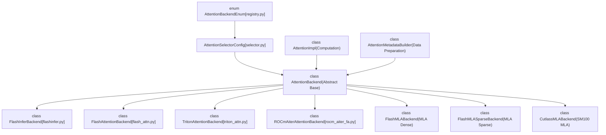
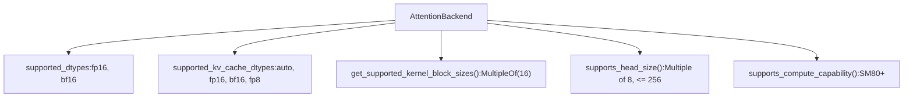
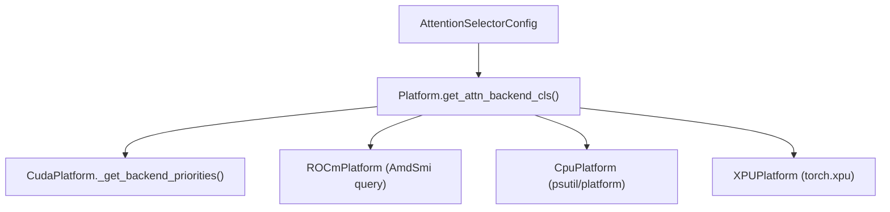

# 注意力后端

相关源文件

-   [cmake/external\_projects/flashmla.cmake](https://github.com/vllm-project/vllm/blob/7cc302dd/cmake/external_projects/flashmla.cmake)
-   [docs/design/attention\_backends.md](https://github.com/vllm-project/vllm/blob/7cc302dd/docs/design/attention_backends.md?plain=1)
-   [tests/kernels/attention/test\_attention\_selector.py](https://github.com/vllm-project/vllm/blob/7cc302dd/tests/kernels/attention/test_attention_selector.py)
-   [tests/kernels/attention/test\_flashmla.py](https://github.com/vllm-project/vllm/blob/7cc302dd/tests/kernels/attention/test_flashmla.py)
-   [tests/kernels/attention/test\_flashmla\_sparse.py](https://github.com/vllm-project/vllm/blob/7cc302dd/tests/kernels/attention/test_flashmla_sparse.py)
-   [tests/kernels/attention/test\_rocm\_attention\_selector.py](https://github.com/vllm-project/vllm/blob/7cc302dd/tests/kernels/attention/test_rocm_attention_selector.py)
-   [tests/kernels/test\_flex\_attention.py](https://github.com/vllm-project/vllm/blob/7cc302dd/tests/kernels/test_flex_attention.py)
-   [tests/test\_attention\_backend\_registry.py](https://github.com/vllm-project/vllm/blob/7cc302dd/tests/test_attention_backend_registry.py)
-   [tests/v1/attention/test\_attention\_backends.py](https://github.com/vllm-project/vllm/blob/7cc302dd/tests/v1/attention/test_attention_backends.py)
-   [tests/v1/attention/test\_mla\_backends.py](https://github.com/vllm-project/vllm/blob/7cc302dd/tests/v1/attention/test_mla_backends.py)
-   [tests/v1/attention/test\_rocm\_attention\_backends\_selection.py](https://github.com/vllm-project/vllm/blob/7cc302dd/tests/v1/attention/test_rocm_attention_backends_selection.py)
-   [tests/v1/attention/test\_sparse\_mla\_backends.py](https://github.com/vllm-project/vllm/blob/7cc302dd/tests/v1/attention/test_sparse_mla_backends.py)
-   [tests/v1/attention/utils.py](https://github.com/vllm-project/vllm/blob/7cc302dd/tests/v1/attention/utils.py)
-   [tests/v1/spec\_decode/test\_tree\_attention.py](https://github.com/vllm-project/vllm/blob/7cc302dd/tests/v1/spec_decode/test_tree_attention.py)
-   [tools/pre\_commit/generate\_attention\_backend\_docs.py](https://github.com/vllm-project/vllm/blob/7cc302dd/tools/pre_commit/generate_attention_backend_docs.py)
-   [vllm/\_aiter\_ops.py](https://github.com/vllm-project/vllm/blob/7cc302dd/vllm/_aiter_ops.py)
-   [vllm/model\_executor/layers/quantization/quark/schemes/quark\_ocp\_mx.py](https://github.com/vllm-project/vllm/blob/7cc302dd/vllm/model_executor/layers/quantization/quark/schemes/quark_ocp_mx.py)
-   [vllm/platforms/cpu.py](https://github.com/vllm-project/vllm/blob/7cc302dd/vllm/platforms/cpu.py)
-   [vllm/platforms/cuda.py](https://github.com/vllm-project/vllm/blob/7cc302dd/vllm/platforms/cuda.py)
-   [vllm/platforms/interface.py](https://github.com/vllm-project/vllm/blob/7cc302dd/vllm/platforms/interface.py)
-   [vllm/platforms/rocm.py](https://github.com/vllm-project/vllm/blob/7cc302dd/vllm/platforms/rocm.py)
-   [vllm/platforms/tpu.py](https://github.com/vllm-project/vllm/blob/7cc302dd/vllm/platforms/tpu.py)
-   [vllm/platforms/xpu.py](https://github.com/vllm-project/vllm/blob/7cc302dd/vllm/platforms/xpu.py)
-   [vllm/v1/attention/backends/flash\_attn.py](https://github.com/vllm-project/vllm/blob/7cc302dd/vllm/v1/attention/backends/flash_attn.py)
-   [vllm/v1/attention/backends/flashinfer.py](https://github.com/vllm-project/vllm/blob/7cc302dd/vllm/v1/attention/backends/flashinfer.py)
-   [vllm/v1/attention/backends/flex\_attention.py](https://github.com/vllm-project/vllm/blob/7cc302dd/vllm/v1/attention/backends/flex_attention.py)
-   [vllm/v1/attention/backends/mla/aiter\_triton\_mla.py](https://github.com/vllm-project/vllm/blob/7cc302dd/vllm/v1/attention/backends/mla/aiter_triton_mla.py)
-   [vllm/v1/attention/backends/mla/cutlass\_mla.py](https://github.com/vllm-project/vllm/blob/7cc302dd/vllm/v1/attention/backends/mla/cutlass_mla.py)
-   [vllm/v1/attention/backends/mla/flashattn\_mla.py](https://github.com/vllm-project/vllm/blob/7cc302dd/vllm/v1/attention/backends/mla/flashattn_mla.py)
-   [vllm/v1/attention/backends/mla/flashinfer\_mla.py](https://github.com/vllm-project/vllm/blob/7cc302dd/vllm/v1/attention/backends/mla/flashinfer_mla.py)
-   [vllm/v1/attention/backends/mla/flashinfer\_mla\_sparse.py](https://github.com/vllm-project/vllm/blob/7cc302dd/vllm/v1/attention/backends/mla/flashinfer_mla_sparse.py)
-   [vllm/v1/attention/backends/mla/flashmla.py](https://github.com/vllm-project/vllm/blob/7cc302dd/vllm/v1/attention/backends/mla/flashmla.py)
-   [vllm/v1/attention/backends/mla/flashmla\_sparse.py](https://github.com/vllm-project/vllm/blob/7cc302dd/vllm/v1/attention/backends/mla/flashmla_sparse.py)
-   [vllm/v1/attention/backends/mla/rocm\_aiter\_mla.py](https://github.com/vllm-project/vllm/blob/7cc302dd/vllm/v1/attention/backends/mla/rocm_aiter_mla.py)
-   [vllm/v1/attention/backends/mla/rocm\_aiter\_mla\_sparse.py](https://github.com/vllm-project/vllm/blob/7cc302dd/vllm/v1/attention/backends/mla/rocm_aiter_mla_sparse.py)
-   [vllm/v1/attention/backends/mla/triton\_mla.py](https://github.com/vllm-project/vllm/blob/7cc302dd/vllm/v1/attention/backends/mla/triton_mla.py)
-   [vllm/v1/attention/backends/rocm\_aiter\_fa.py](https://github.com/vllm-project/vllm/blob/7cc302dd/vllm/v1/attention/backends/rocm_aiter_fa.py)
-   [vllm/v1/attention/backends/rocm\_aiter\_unified\_attn.py](https://github.com/vllm-project/vllm/blob/7cc302dd/vllm/v1/attention/backends/rocm_aiter_unified_attn.py)
-   [vllm/v1/attention/backends/rocm\_attn.py](https://github.com/vllm-project/vllm/blob/7cc302dd/vllm/v1/attention/backends/rocm_attn.py)
-   [vllm/v1/attention/backends/triton\_attn.py](https://github.com/vllm-project/vllm/blob/7cc302dd/vllm/v1/attention/backends/triton_attn.py)
-   [vllm/v1/attention/backends/utils.py](https://github.com/vllm-project/vllm/blob/7cc302dd/vllm/v1/attention/backends/utils.py)
-   [vllm/v1/attention/ops/chunked\_prefill\_paged\_decode.py](https://github.com/vllm-project/vllm/blob/7cc302dd/vllm/v1/attention/ops/chunked_prefill_paged_decode.py)

## 目的与范围

注意力后端是可插拔组件，用于在 vLLM 的推理引擎中实现核心注意力计算。每个后端都为不同的硬件平台、注意力模式和数据类型提供优化内核。本文档介绍注意力后端架构、可用后端以及选择机制。

有关整体模型执行流程，请参见 [GPU 上的模型执行](/vllm-project/vllm/4-model-execution-on-gpu)。有关 KV 缓存管理，请参见 [KV 缓存管理和前缀缓存](/vllm-project/vllm/3.4-kv-cache-management-and-prefix-caching)。

## 架构概览

注意力后端系统采用抽象接口模式，使多个实现能够共存，并可根据硬件能力、模型需求和性能特征进行选择。

### 核心抽象

**来源：** [vllm/v1/attention/backend.py44-118](https://github.com/vllm-project/vllm/blob/7cc302dd/vllm/v1/attention/backend.py#L44-L118) [vllm/v1/attention/backends/registry.py1-30](https://github.com/vllm-project/vllm/blob/7cc302dd/vllm/v1/attention/backends/registry.py#L1-L30) [vllm/v1/attention/backends/flashinfer.py62-63](https://github.com/vllm-project/vllm/blob/7cc302dd/vllm/v1/attention/backends/flashinfer.py#L62-L63) [vllm/v1/attention/backends/flash\_attn.py62-63](https://github.com/vllm-project/vllm/blob/7cc302dd/vllm/v1/attention/backends/flash_attn.py#L62-L63)

注意力后端的三个核心组件如下：

| 组件 | 用途 | 关键方法 |
| --- | --- | --- |
| `AttentionBackend` | 后端元数据与能力 | `get_name()`, `get_impl_cls()`, `get_builder_cls()`, `get_kv_cache_shape()` [vllm/v1/attention/backend.py44-118](https://github.com/vllm-project/vllm/blob/7cc302dd/vllm/v1/attention/backend.py#L44-L118) |
| `AttentionImpl` | 实际的注意力计算 | `forward()`, `do_kv_cache_update()` [vllm/v1/attention/backend.py121-164](https://github.com/vllm-project/vllm/blob/7cc302dd/vllm/v1/attention/backend.py#L121-L164) |
| `AttentionMetadataBuilder` | 为注意力内核准备元数据 | `build()`, `get_cudagraph_support()` [vllm/v1/attention/backend.py175-200](https://github.com/vllm-project/vllm/blob/7cc302dd/vllm/v1/attention/backend.py#L175-L200) |

### 后端能力

每个后端通过静态方法声明其能力。例如，`FlashAttentionBackend` 定义了其支持的数据类型和计算能力 [vllm/v1/attention/backends/flash\_attn.py64-70](https://github.com/vllm-project/vllm/blob/7cc302dd/vllm/v1/attention/backends/flash_attn.py#L64-L70)

**来源：** [vllm/v1/attention/backends/flash\_attn.py64-180](https://github.com/vllm-project/vllm/blob/7cc302dd/vllm/v1/attention/backends/flash_attn.py#L64-L180) [vllm/v1/attention/backends/flashinfer.py279-383](https://github.com/vllm-project/vllm/blob/7cc302dd/vllm/v1/attention/backends/flashinfer.py#L279-L383)

## 标准注意力后端

### FlashInfer 后端

FlashInfer 是 NVIDIA GPU 的主要后端，提供经过优化的分页注意力。它支持诸如面向 Blackwell（SM100）GPU 的 TRTLLM 风格注意力等高级特性 [vllm/v1/attention/backends/flashinfer.py41-42](https://github.com/vllm-project/vllm/blob/7cc302dd/vllm/v1/attention/backends/flashinfer.py#L41-L42)

**主要特性：**

-   **TRTLLM 注意力路径：** 在支持时，解码阶段会自动使用 `trtllm_batch_decode_with_kv_cache` [vllm/v1/attention/backends/flashinfer.py17-18](https://github.com/vllm-project/vllm/blob/7cc302dd/vllm/v1/attention/backends/flashinfer.py#L17-L18)
-   **FP8 KV 缓存：** 通过 Triton 内核支持 FP8 量化 KV 缓存，并可动态反量化 [vllm/v1/attention/backends/flashinfer.py89-150](https://github.com/vllm-project/vllm/blob/7cc302dd/vllm/v1/attention/backends/flashinfer.py#L89-L150)
-   **级联注意力：** 使用 `MultiLevelCascadeAttentionWrapper` 高效处理前缀缓存 [vllm/v1/attention/backends/flashinfer.py15-16](https://github.com/vllm-project/vllm/blob/7cc302dd/vllm/v1/attention/backends/flashinfer.py#L15-L16)
-   **DCP 支持：** 通过 `BatchDCPPrefillWrapper` 提供分布式上下文并行支持，并进行 all-to-all LSE 归约 [vllm/v1/attention/backends/flashinfer.py203-212](https://github.com/vllm-project/vllm/blob/7cc302dd/vllm/v1/attention/backends/flashinfer.py#L203-L212)

详情请参见 [FlashAttention 和 FlashInfer](/vllm-project/vllm/8.2-flashattention-and-flashinfer)。

**来源：** [vllm/v1/attention/backends/flashinfer.py1-212](https://github.com/vllm-project/vllm/blob/7cc302dd/vllm/v1/attention/backends/flashinfer.py#L1-L212) [vllm/utils/flashinfer.py39-42](https://github.com/vllm-project/vllm/blob/7cc302dd/vllm/utils/flashinfer.py#L39-L42)

### FlashAttention 后端

FlashAttention 后端提供使用 `flash_attn_varlen_func` 的标准实现。它支持多种注意力类型，包括解码器、编码器以及编码器-解码器 [vllm/v1/attention/backends/flash\_attn.py98-105](https://github.com/vllm-project/vllm/blob/7cc302dd/vllm/v1/attention/backends/flash_attn.py#L98-L105)

**主要特性：**

-   **版本支持：** 检测 FlashAttention 版本及功能可用性（例如 sinks） [vllm/v1/attention/backends/fa\_utils.py22-35](https://github.com/vllm-project/vllm/blob/7cc302dd/vllm/v1/attention/backends/fa_utils.py#L22-L35)
-   **KV 缓存布局：** 支持 `NHD` 和 `HND` 等灵活布局 [vllm/v1/attention/backends/flash\_attn.py138-150](https://github.com/vllm-project/vllm/blob/7cc302dd/vllm/v1/attention/backends/flash_attn.py#L138-L150)
-   **FP8 支持：** 当 `flash_attn_supports_fp8()` 返回 true 时支持 FP8 KV 缓存 [vllm/v1/attention/backends/flash\_attn.py168-169](https://github.com/vllm-project/vllm/blob/7cc302dd/vllm/v1/attention/backends/flash_attn.py#L168-L169)

详情请参见 [FlashAttention 和 FlashInfer](/vllm-project/vllm/8.2-flashattention-and-flashinfer)。

**来源：** [vllm/v1/attention/backends/flash\_attn.py62-180](https://github.com/vllm-project/vllm/blob/7cc302dd/vllm/v1/attention/backends/flash_attn.py#L62-L180) [vllm/v1/attention/backends/fa\_utils.py20-35](https://github.com/vllm-project/vllm/blob/7cc302dd/vllm/v1/attention/backends/fa_utils.py#L20-L35)

### Triton 注意力后端

Triton 后端提供高性能的纯 Triton 实现。它使用阈值在 2D 和 3D 内核之间切换，并根据批大小优化占用率 [vllm/v1/attention/backends/triton\_attn.py154-167](https://github.com/vllm-project/vllm/blob/7cc302dd/vllm/v1/attention/backends/triton_attn.py#L154-L167)

**主要特性：**

-   **统一注意力：** 使用 `unified_attention` 实现灵活执行 [vllm/v1/attention/backends/triton\_attn.py35-36](https://github.com/vllm-project/vllm/blob/7cc302dd/vllm/v1/attention/backends/triton_attn.py#L35-L36)
-   **级联支持：** 为共享前缀实现级联注意力 [vllm/v1/attention/backends/triton\_attn.py70-76](https://github.com/vllm-project/vllm/blob/7cc302dd/vllm/v1/attention/backends/triton_attn.py#L70-L76)
-   **多模态支持：** 通过 `mm_prefix_range` 处理多模态模型的特殊前缀范围 [vllm/v1/attention/backends/triton\_attn.py83-114](https://github.com/vllm-project/vllm/blob/7cc302dd/vllm/v1/attention/backends/triton_attn.py#L83-L114)

**来源：** [vllm/v1/attention/backends/triton\_attn.py1-190](https://github.com/vllm-project/vllm/blob/7cc302dd/vllm/v1/attention/backends/triton_attn.py#L1-L190)

### ROCm AITER 后端

面向 AMD 硬件优化的 AITER 后端利用 `rocm_aiter_ops` 在 `gfx9` 架构上提供高效注意力内核 [vllm/v1/attention/backends/rocm\_aiter\_fa.py10-11](https://github.com/vllm-project/vllm/blob/7cc302dd/vllm/v1/attention/backends/rocm_aiter_fa.py#L10-L11)

**主要特性：**

-   **AMD 专用操作：** 利用 `rocm_aiter_ops` 在 ROCm 上实现高性能推理 [vllm/\_aiter\_ops.py36-56](https://github.com/vllm-project/vllm/blob/7cc302dd/vllm/_aiter_ops.py#L36-L56)
-   **布局支持：** 支持 `NHD` 和 `SHUFFLE` KV 缓存布局 [vllm/v1/attention/backends/rocm\_aiter\_fa.py93-121](https://github.com/vllm-project/vllm/blob/7cc302dd/vllm/v1/attention/backends/rocm_aiter_fa.py#L93-L121)
-   **聚合缓存：** 实现 `cp_mha_gather_cache_kernel` 以高效访问 KV 缓存 [vllm/v1/attention/backends/rocm\_aiter\_fa.py47-72](https://github.com/vllm-project/vllm/blob/7cc302dd/vllm/v1/attention/backends/rocm_aiter_fa.py#L47-L72)

详情请参见 [ROCm 和平台特定的注意力](/vllm-project/vllm/8.4-rocm-and-platform-specific-attention)。

**来源：** [vllm/v1/attention/backends/rocm\_aiter\_fa.py1-121](https://github.com/vllm-project/vllm/blob/7cc302dd/vllm/v1/attention/backends/rocm_aiter_fa.py#L1-L121) [vllm/\_aiter\_ops.py33-56](https://github.com/vllm-project/vllm/blob/7cc302dd/vllm/_aiter_ops.py#L33-L56)

## 多潜变量注意力（MLA）后端

MLA 是 DeepSeek-V3 等模型中使用的一种专用注意力机制。vLLM 提供多种 MLA 实现，并根据硬件进行选择。

**实现：**

-   **FlashMLA：** 针对 Hopper/Blackwell GPU 优化的稠密 MLA [vllm/platforms/cuda.py79-88](https://github.com/vllm-project/vllm/blob/7cc302dd/vllm/platforms/cuda.py#L79-L88)
-   **FlashInfer MLA：** 分页 MLA 实现 [vllm/platforms/cuda.py84-85](https://github.com/vllm-project/vllm/blob/7cc302dd/vllm/platforms/cuda.py#L84-L85)
-   **稀疏 MLA：** 面向使用 MLA 的稀疏 MoE 模型的专用后端，例如 `FLASHMLA_SPARSE` [vllm/platforms/cuda.py79-81](https://github.com/vllm-project/vllm/blob/7cc302dd/vllm/platforms/cuda.py#L79-L81)

详情请参见 [MLA 和专用注意力](/vllm-project/vllm/8.3-mla-and-specialized-attention)。

**来源：** [vllm/platforms/cuda.py58-98](https://github.com/vllm-project/vllm/blob/7cc302dd/vllm/platforms/cuda.py#L58-L98)

## 后端选择

选择逻辑与平台相关，并会考虑设备能力、模型架构（例如 MLA）以及用户配置。

**来源：** [vllm/platforms/cuda.py51-56](https://github.com/vllm-project/vllm/blob/7cc302dd/vllm/platforms/cuda.py#L51-L56) [vllm/platforms/rocm.py112-123](https://github.com/vllm-project/vllm/blob/7cc302dd/vllm/platforms/rocm.py#L112-L123) [vllm/platforms/cpu.py105-117](https://github.com/vllm-project/vllm/blob/7cc302dd/vllm/platforms/cpu.py#L105-L117) [vllm/platforms/xpu.py49-54](https://github.com/vllm-project/vllm/blob/7cc302dd/vllm/platforms/xpu.py#L49-L54)

详情请参见 [注意力后端选择](/vllm-project/vllm/8.1-attention-backend-selection)。

### 平台特定选择逻辑

-   **CUDA：** 优先级由 `DeviceCapability` 和是否存在 MLA 决定 [vllm/platforms/cuda.py51-113](https://github.com/vllm-project/vllm/blob/7cc302dd/vllm/platforms/cuda.py#L51-L113) 对于 SM100，通常会优先选择 `FLASHINFER` [vllm/platforms/cuda.py100-106](https://github.com/vllm-project/vllm/blob/7cc302dd/vllm/platforms/cuda.py#L100-L106)
-   **ROCm：** 逻辑会检测 GCN 架构（例如 MI300X 的 `gfx942`）以启用 AITER [vllm/platforms/rocm.py146-152](https://github.com/vllm-project/vllm/blob/7cc302dd/vllm/platforms/rocm.py#L146-L152)
-   **XPU：** 强制使用 `NHD` 布局，并默认选择 `FLASH_ATTN` 或 `TRITON_ATTN` [vllm/platforms/xpu.py55-89](https://github.com/vllm-project/vllm/blob/7cc302dd/vllm/platforms/xpu.py#L55-L89)
-   **CPU：** 仅使用 `CPU_ATTN`，并将块大小默认设为 128 [vllm/platforms/cpu.py105-117](https://github.com/vllm-project/vllm/blob/7cc302dd/vllm/platforms/cpu.py#L105-L117) [vllm/platforms/cpu.py165-166](https://github.com/vllm-project/vllm/blob/7cc302dd/vllm/platforms/cpu.py#L165-L166)

**来源：** [vllm/platforms/cuda.py51-113](https://github.com/vllm-project/vllm/blob/7cc302dd/vllm/platforms/cuda.py#L51-L113) [vllm/platforms/rocm.py146-152](https://github.com/vllm-project/vllm/blob/7cc302dd/vllm/platforms/rocm.py#L146-L152) [vllm/platforms/xpu.py55-89](https://github.com/vllm-project/vllm/blob/7cc302dd/vllm/platforms/xpu.py#L55-L89) [vllm/platforms/cpu.py105-117](https://github.com/vllm-project/vllm/blob/7cc302dd/vllm/platforms/cpu.py#L105-L117)

## 元数据构建与工具

注意力后端依赖工具函数来管理 KV 缓存布局和序列长度。

-   **KV 缓存布局：** 由 `get_kv_cache_layout()` 决定，它会检查 `VLLM_KV_CACHE_LAYOUT` [vllm/v1/attention/backends/utils.py52-78](https://github.com/vllm-project/vllm/blob/7cc302dd/vllm/v1/attention/backends/utils.py#L52-L78)
-   **分层参数：** `get_per_layer_parameters()` 会扫描模型各层，以推断滑动窗口大小和 logit soft cap [vllm/v1/attention/backends/utils.py105-135](https://github.com/vllm-project/vllm/blob/7cc302dd/vllm/v1/attention/backends/utils.py#L105-L135)
-   **超参数推断：** `infer_global_hyperparameters()` 会验证所有层是否共享兼容的注意力参数 [vllm/v1/attention/backends/utils.py138-165](https://github.com/vllm-project/vllm/blob/7cc302dd/vllm/v1/attention/backends/utils.py#L138-L165)

**来源：** [vllm/v1/attention/backends/utils.py52-165](https://github.com/vllm-project/vllm/blob/7cc302dd/vllm/v1/attention/backends/utils.py#L52-L165)
