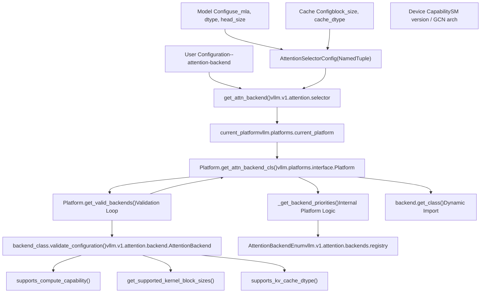
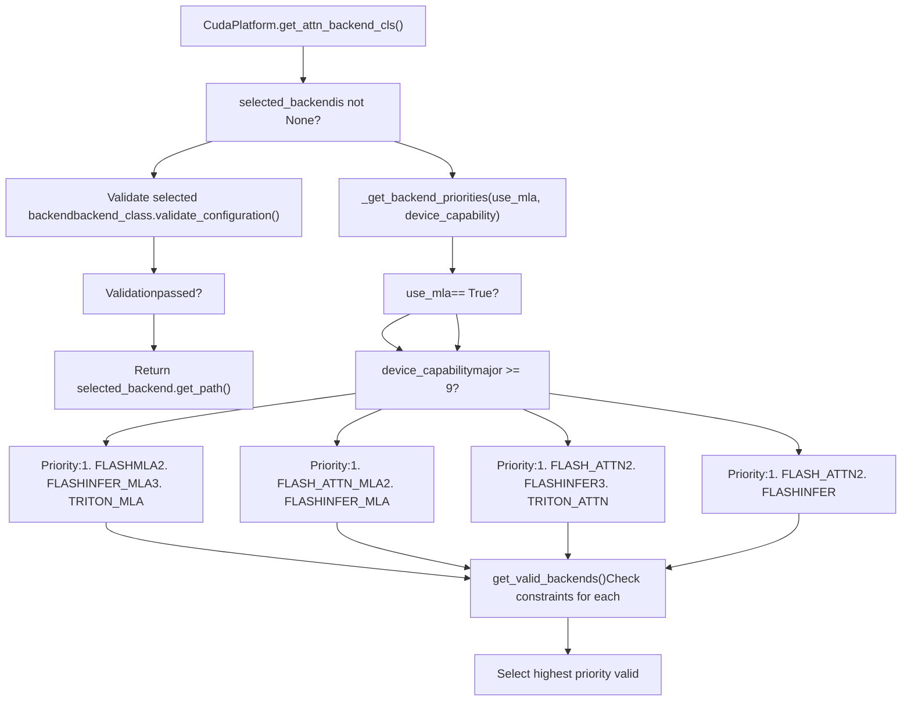

# 注意力后端选择

相关源文件

-   [cmake/external\_projects/flashmla.cmake](https://github.com/vllm-project/vllm/blob/7cc302dd/cmake/external_projects/flashmla.cmake)
-   [cmake/external\_projects/vllm\_flash\_attn.cmake](https://github.com/vllm-project/vllm/blob/7cc302dd/cmake/external_projects/vllm_flash_attn.cmake)
-   [docs/design/attention\_backends.md](https://github.com/vllm-project/vllm/blob/7cc302dd/docs/design/attention_backends.md?plain=1)
-   [tests/kernels/attention/test\_attention\_selector.py](https://github.com/vllm-project/vllm/blob/7cc302dd/tests/kernels/attention/test_attention_selector.py)
-   [tests/kernels/attention/test\_flashmla.py](https://github.com/vllm-project/vllm/blob/7cc302dd/tests/kernels/attention/test_flashmla.py)
-   [tests/kernels/attention/test\_flashmla\_sparse.py](https://github.com/vllm-project/vllm/blob/7cc302dd/tests/kernels/attention/test_flashmla_sparse.py)
-   [tests/kernels/attention/test\_rocm\_attention\_selector.py](https://github.com/vllm-project/vllm/blob/7cc302dd/tests/kernels/attention/test_rocm_attention_selector.py)
-   [tests/kernels/test\_flex\_attention.py](https://github.com/vllm-project/vllm/blob/7cc302dd/tests/kernels/test_flex_attention.py)
-   [tests/test\_attention\_backend\_registry.py](https://github.com/vllm-project/vllm/blob/7cc302dd/tests/test_attention_backend_registry.py)
-   [tests/v1/attention/test\_attention\_backends.py](https://github.com/vllm-project/vllm/blob/7cc302dd/tests/v1/attention/test_attention_backends.py)
-   [tests/v1/attention/test\_mla\_backends.py](https://github.com/vllm-project/vllm/blob/7cc302dd/tests/v1/attention/test_mla_backends.py)
-   [tests/v1/attention/test\_rocm\_attention\_backends\_selection.py](https://github.com/vllm-project/vllm/blob/7cc302dd/tests/v1/attention/test_rocm_attention_backends_selection.py)
-   [tests/v1/attention/test\_sparse\_mla\_backends.py](https://github.com/vllm-project/vllm/blob/7cc302dd/tests/v1/attention/test_sparse_mla_backends.py)
-   [tests/v1/attention/utils.py](https://github.com/vllm-project/vllm/blob/7cc302dd/tests/v1/attention/utils.py)
-   [tests/v1/cudagraph/test\_cudagraph\_dispatch.py](https://github.com/vllm-project/vllm/blob/7cc302dd/tests/v1/cudagraph/test_cudagraph_dispatch.py)
-   [tests/v1/cudagraph/test\_cudagraph\_mode.py](https://github.com/vllm-project/vllm/blob/7cc302dd/tests/v1/cudagraph/test_cudagraph_mode.py)
-   [tests/v1/kv\_connector/unit/test\_config.py](https://github.com/vllm-project/vllm/blob/7cc302dd/tests/v1/kv_connector/unit/test_config.py)
-   [tests/v1/spec\_decode/test\_tree\_attention.py](https://github.com/vllm-project/vllm/blob/7cc302dd/tests/v1/spec_decode/test_tree_attention.py)
-   [tools/pre\_commit/generate\_attention\_backend\_docs.py](https://github.com/vllm-project/vllm/blob/7cc302dd/tools/pre_commit/generate_attention_backend_docs.py)
-   [tools/pre\_commit/mypy.py](https://github.com/vllm-project/vllm/blob/7cc302dd/tools/pre_commit/mypy.py)
-   [vllm/config/attention.py](https://github.com/vllm-project/vllm/blob/7cc302dd/vllm/config/attention.py)
-   [vllm/config/cache.py](https://github.com/vllm-project/vllm/blob/7cc302dd/vllm/config/cache.py)
-   [vllm/forward\_context.py](https://github.com/vllm-project/vllm/blob/7cc302dd/vllm/forward_context.py)
-   [vllm/model\_executor/layers/attention/mla\_attention.py](https://github.com/vllm-project/vllm/blob/7cc302dd/vllm/model_executor/layers/attention/mla_attention.py)
-   [vllm/v1/attention/backend.py](https://github.com/vllm-project/vllm/blob/7cc302dd/vllm/v1/attention/backend.py)
-   [vllm/v1/attention/backends/fa\_utils.py](https://github.com/vllm-project/vllm/blob/7cc302dd/vllm/v1/attention/backends/fa_utils.py)
-   [vllm/v1/attention/backends/flash\_attn.py](https://github.com/vllm-project/vllm/blob/7cc302dd/vllm/v1/attention/backends/flash_attn.py)
-   [vllm/v1/attention/backends/flashinfer.py](https://github.com/vllm-project/vllm/blob/7cc302dd/vllm/v1/attention/backends/flashinfer.py)
-   [vllm/v1/attention/backends/flex\_attention.py](https://github.com/vllm-project/vllm/blob/7cc302dd/vllm/v1/attention/backends/flex_attention.py)
-   [vllm/v1/attention/backends/mla/aiter\_triton\_mla.py](https://github.com/vllm-project/vllm/blob/7cc302dd/vllm/v1/attention/backends/mla/aiter_triton_mla.py)
-   [vllm/v1/attention/backends/mla/cutlass\_mla.py](https://github.com/vllm-project/vllm/blob/7cc302dd/vllm/v1/attention/backends/mla/cutlass_mla.py)
-   [vllm/v1/attention/backends/mla/flashattn\_mla.py](https://github.com/vllm-project/vllm/blob/7cc302dd/vllm/v1/attention/backends/mla/flashattn_mla.py)
-   [vllm/v1/attention/backends/mla/flashinfer\_mla.py](https://github.com/vllm-project/vllm/blob/7cc302dd/vllm/v1/attention/backends/mla/flashinfer_mla.py)
-   [vllm/v1/attention/backends/mla/flashinfer\_mla\_sparse.py](https://github.com/vllm-project/vllm/blob/7cc302dd/vllm/v1/attention/backends/mla/flashinfer_mla_sparse.py)
-   [vllm/v1/attention/backends/mla/flashmla.py](https://github.com/vllm-project/vllm/blob/7cc302dd/vllm/v1/attention/backends/mla/flashmla.py)
-   [vllm/v1/attention/backends/mla/flashmla\_sparse.py](https://github.com/vllm-project/vllm/blob/7cc302dd/vllm/v1/attention/backends/mla/flashmla_sparse.py)
-   [vllm/v1/attention/backends/mla/rocm\_aiter\_mla.py](https://github.com/vllm-project/vllm/blob/7cc302dd/vllm/v1/attention/backends/mla/rocm_aiter_mla.py)
-   [vllm/v1/attention/backends/mla/rocm\_aiter\_mla\_sparse.py](https://github.com/vllm-project/vllm/blob/7cc302dd/vllm/v1/attention/backends/mla/rocm_aiter_mla_sparse.py)
-   [vllm/v1/attention/backends/mla/triton\_mla.py](https://github.com/vllm-project/vllm/blob/7cc302dd/vllm/v1/attention/backends/mla/triton_mla.py)
-   [vllm/v1/attention/backends/rocm\_aiter\_fa.py](https://github.com/vllm-project/vllm/blob/7cc302dd/vllm/v1/attention/backends/rocm_aiter_fa.py)
-   [vllm/v1/attention/backends/rocm\_aiter\_unified\_attn.py](https://github.com/vllm-project/vllm/blob/7cc302dd/vllm/v1/attention/backends/rocm_aiter_unified_attn.py)
-   [vllm/v1/attention/backends/rocm\_attn.py](https://github.com/vllm-project/vllm/blob/7cc302dd/vllm/v1/attention/backends/rocm_attn.py)
-   [vllm/v1/attention/backends/triton\_attn.py](https://github.com/vllm-project/vllm/blob/7cc302dd/vllm/v1/attention/backends/triton_attn.py)
-   [vllm/v1/attention/backends/utils.py](https://github.com/vllm-project/vllm/blob/7cc302dd/vllm/v1/attention/backends/utils.py)
-   [vllm/v1/attention/ops/chunked\_prefill\_paged\_decode.py](https://github.com/vllm-project/vllm/blob/7cc302dd/vllm/v1/attention/ops/chunked_prefill_paged_decode.py)
-   [vllm/v1/attention/ops/paged\_attn.py](https://github.com/vllm-project/vllm/blob/7cc302dd/vllm/v1/attention/ops/paged_attn.py)
-   [vllm/v1/cudagraph\_dispatcher.py](https://github.com/vllm-project/vllm/blob/7cc302dd/vllm/v1/cudagraph_dispatcher.py)
-   [vllm/v1/worker/dp\_utils.py](https://github.com/vllm-project/vllm/blob/7cc302dd/vllm/v1/worker/dp_utils.py)

## 目的与范围

本文档介绍 vLLM 的注意力后端选择系统，该系统决定在模型推理期间由哪个内核实现来执行注意力操作。该系统会根据硬件平台、设备能力、模型配置参数以及用户偏好来选择后端。

有关实际的注意力后端实现（FlashAttention、FlashInfer 等），请参见 [FlashAttention 和 FlashInfer](/vllm-project/vllm/8.2-flashattention-and-flashinfer)。有关 ROCm 和平台特定的注意力实现，请参见 [ROCm 和平台特定注意力](/vllm-project/vllm/8.4-rocm-and-platform-specific-attention)。有关多潜变量注意力（MLA）后端，请参见 [MLA 和专用注意力](/vllm-project/vllm/8.3-mla-and-specialized-attention)。

## 概览

注意力后端选择系统通过平台抽象层运行，其中每个受支持的硬件平台（CUDA、ROCm、XPU、CPU）都实现了自己的后端选择逻辑。选择过程会将后端需求与模型配置和硬件能力进行校验，然后选择优先级最高的有效后端。

### 注意力选择逻辑流程

**来源**： `vllm/v1/attention/backend.py:13-194`(), `vllm/v1/attention/backends/flash_attn.py:62-197`(), `vllm/v1/attention/backends/flashinfer.py:203-240`()

## 后端注册表与枚举

`AttentionBackendEnum` 定义了所有可用的注意力后端。每个枚举成员都会存储一个模块路径字符串，指向后端实现类。

| 后端枚举 | 模块路径 | 平台支持 |
| --- | --- | --- |
| `FLASH_ATTN` | `vllm.v1.attention.backends.flash_attn` | CUDA、ROCm、XPU |
| `FLASHINFER` | `vllm.v1.attention.backends.flashinfer` | CUDA、XPU |
| `TRITON_ATTN` | `vllm.v1.attention.backends.triton_attn` | CUDA、ROCm、XPU |
| `ROCM_AITER_FA` | `vllm.v1.attention.backends.rocm_aiter_fa` | 仅 ROCm |
| `FLEX_ATTENTION` | `vllm.v1.attention.backends.flex_attention` | CUDA |
| `FLASHMLA` | `vllm.v1.attention.backends.mla.flashmla` | CUDA（Hopper 及以上） |
| `ROCM_AITER_MLA` | `vllm.v1.attention.backends.mla.rocm_aiter_mla` | 仅 ROCm |

该枚举提供用于解析路径并动态导入类的方法。

**来源**： `vllm/v1/attention/backends/flash_attn.py:94-95`(), `vllm/v1/attention/backends/flashinfer.py:46-54`(), `vllm/v1/attention/backends/flex_attention.py:90-92`(), `vllm/v1/attention/backends/mla/flashmla.py:61-62`()

## 平台特定的后端选择

每个平台都会实现选择逻辑，以便根据硬件特性和模型需求对内核进行优先级排序。

### CUDA 后端选择

CUDA 平台会利用硬件能力（SM 版本）和模型拓扑来对内核排序。

**CUDA 特定的关键逻辑：**

1.  **Hopper GPU（SM 9.0）**：对 MLA 模型优先选择 `FLASHMLA` [vllm/v1/attention/backends/mla/flashmla.py73-74](https://github.com/vllm-project/vllm/blob/7cc302dd/vllm/v1/attention/backends/mla/flashmla.py#L73-L74)
2.  **FlashAttention FP8**：仅当版本为 3+ 或可用专用内核时才支持 [vllm/v1/attention/backends/flash\_attn.py108-110](https://github.com/vllm-project/vllm/blob/7cc302dd/vllm/v1/attention/backends/flash_attn.py#L108-L110)
3.  **FlashInfer MLA**：在 Blackwell 上通常作为回退或首选 [vllm/v1/attention/backends/flashinfer.py39-42](https://github.com/vllm-project/vllm/blob/7cc302dd/vllm/v1/attention/backends/flashinfer.py#L39-L42)

**来源**： `vllm/v1/attention/backends/flash_attn.py:179-180`(), `vllm/v1/attention/backends/mla/flashmla.py:73-74`(), `vllm/v1/attention/backends/flashinfer.py:69-73`()

### ROCm 后端选择

ROCm 的选择逻辑由 GCN 架构检测和 AITER 操作可用性驱动。

-   **AITER 集成**：如果启用了 `rocm_aiter_ops`，则优先选择 `ROCM_AITER_FA` 或 `ROCM_AITER_MLA` [vllm/v1/attention/backends/rocm\_aiter\_fa.py10-18](https://github.com/vllm-project/vllm/blob/7cc302dd/vllm/v1/attention/backends/rocm_aiter_fa.py#L10-L18)
-   **Triton 回退**：在 ROCm 上广泛使用 `TRITON_ATTN`，以兼容不同 GCN 版本 [vllm/v1/attention/backends/triton\_attn.py10-18](https://github.com/vllm-project/vllm/blob/7cc302dd/vllm/v1/attention/backends/triton_attn.py#L10-L18)
-   **ROCm 上的 MLA**：使用 `AiterMLABackend`，其借助 `rocm_aiter_ops` 实现高性能潜变量注意力 [vllm/v1/attention/backends/mla/rocm\_aiter\_mla.py30-51](https://github.com/vllm-project/vllm/blob/7cc302dd/vllm/v1/attention/backends/mla/rocm_aiter_mla.py#L30-L51)

**来源**： `vllm/v1/attention/backends/rocm_aiter_fa.py:19-28`(), `vllm/v1/attention/backends/mla/rocm_aiter_mla.py:41-51`()

## 后端验证系统

每个后端实现都继承自 `AttentionBackend`，并且必须实现验证逻辑，以确保与模型参数兼容。

### 验证约束

| 特性 | `FLASH_ATTN` | `FLASHINFER` | `TRITON_ATTN` | `FLEX_ATTENTION` |
| --- | --- | --- | --- | --- |
| **头尺寸** | 8 的倍数，$\le 256$ [vllm/v1/attention/backends/flash\_attn.py161-162](https://github.com/vllm-project/vllm/blob/7cc302dd/vllm/v1/attention/backends/flash_attn.py#L161-L162) | 灵活 [vllm/v1/attention/backends/flashinfer.py42-45](https://github.com/vllm-project/vllm/blob/7cc302dd/vllm/v1/attention/backends/flashinfer.py#L42-L45) | 灵活 | 未指定 [vllm/v1/attention/backends/flex\_attention.py127-128](https://github.com/vllm-project/vllm/blob/7cc302dd/vllm/v1/attention/backends/flex_attention.py#L127-L128) |
| **KV 缓存数据类型** | auto, fp16, bf16, fp8 [vllm/v1/attention/backends/flash\_attn.py65-69](https://github.com/vllm-project/vllm/blob/7cc302dd/vllm/v1/attention/backends/flash_attn.py#L65-L69) | auto, fp16, bf16, fp8, fp4 [vllm/v1/attention/backends/flashinfer.py28-35](https://github.com/vllm-project/vllm/blob/7cc302dd/vllm/v1/attention/backends/flashinfer.py#L28-L35) | 灵活 [vllm/v1/attention/backends/triton\_attn.py12-17](https://github.com/vllm-project/vllm/blob/7cc302dd/vllm/v1/attention/backends/triton_attn.py#L12-L17) | auto, fp16, bf16 [vllm/v1/attention/backends/flex\_attention.py82-86](https://github.com/vllm-project/vllm/blob/7cc302dd/vllm/v1/attention/backends/flex_attention.py#L82-L86) |
| **块大小** | 16 的倍数 [vllm/v1/attention/backends/flash\_attn.py128-129](https://github.com/vllm-project/vllm/blob/7cc302dd/vllm/v1/attention/backends/flash_attn.py#L128-L129) | 灵活 | 灵活 | 灵活 |
| **计算能力** | $\ge 8.0$ [vllm/v1/attention/backends/flash\_attn.py179-180](https://github.com/vllm-project/vllm/blob/7cc302dd/vllm/v1/attention/backends/flash_attn.py#L179-L180) | $\ge 8.0$ | $\ge 8.0$ [vllm/v1/attention/backends/triton\_attn.py18-19](https://github.com/vllm-project/vllm/blob/7cc302dd/vllm/v1/attention/backends/triton_attn.py#L18-L19) | $\ge 8.0$ |

**来源**： `vllm/v1/attention/backends/flash_attn.py:64-197`(), `vllm/v1/attention/backends/flashinfer.py:42-65`(), `vllm/v1/attention/backends/flex_attention.py:75-129`()

## 专用注意力逻辑

### 多潜变量注意力（MLA）

MLA 需要能够处理压缩 KV 缓存的特定后端。其选择取决于：

-   **FlashMLA：** Hopper（SM90）的首选 [vllm/v1/attention/backends/mla/flashmla.py73-74](https://github.com/vllm-project/vllm/blob/7cc302dd/vllm/v1/attention/backends/mla/flashmla.py#L73-L74)
-   **AiterMLA：** ROCm 的首选 [vllm/v1/attention/backends/mla/rocm\_aiter\_mla.py30-51](https://github.com/vllm-project/vllm/blob/7cc302dd/vllm/v1/attention/backends/mla/rocm_aiter_mla.py#L30-L51)
-   **TritonMLA：** 跨平台回退 [vllm/v1/attention/backends/mla/triton\_mla.py1-10](https://github.com/vllm-project/vllm/blob/7cc302dd/vllm/v1/attention/backends/mla/triton_mla.py#L1-L10)

### FlexAttention

`FlexAttentionBackend` 会在使用 `torch.compile` 或需要实验性掩码需求时被选中。它支持 `ENCODER_ONLY` 和 `DECODER` 类型 [vllm/v1/attention/backends/flex\_attention.py94-97](https://github.com/vllm-project/vllm/blob/7cc302dd/vllm/v1/attention/backends/flex_attention.py#L94-L97)

**来源**： `vllm/v1/attention/backends/mla/flashmla.py:46-75`(), `vllm/v1/attention/backends/flex_attention.py:75-106`()

## 实现细节

### 元数据构建器

每个后端都会提供一个 `get_builder_cls()`，它返回一个 `AttentionMetadataBuilder`。该构建器负责准备前向传播期间内核所需的硬件特定元数据（例如 `FlashAttentionMetadata`、`TritonAttentionMetadata`）。

-   `FlashAttentionMetadataBuilder`：准备 `cu_seqlens` 和 `block_tables` [vllm/v1/attention/backends/flash\_attn.py117-118](https://github.com/vllm-project/vllm/blob/7cc302dd/vllm/v1/attention/backends/flash_attn.py#L117-L118)
-   `TritonAttentionMetadataBuilder`：处理 Triton 内核的 2D 与 3D 启动网格选择 [vllm/v1/attention/backends/triton\_attn.py117-191](https://github.com/vllm-project/vllm/blob/7cc302dd/vllm/v1/attention/backends/triton_attn.py#L117-L191)
-   `FlashMLAMetadataBuilder`：管理持久缓冲区，以兼容 CUDA 图 [vllm/v1/attention/backends/mla/flashmla.py108-148](https://github.com/vllm-project/vllm/blob/7cc302dd/vllm/v1/attention/backends/mla/flashmla.py#L108-L148)

### 分层参数

对于 FlashInfer 等后端，系统会扫描所有层，以确保在规划执行之前，它们共享诸如 `window_left`、`logits_soft_cap` 和 `sm_scale` 之类的超参数 [vllm/v1/attention/backends/utils.py105-135](https://github.com/vllm-project/vllm/blob/7cc302dd/vllm/v1/attention/backends/utils.py#L105-L135)

**来源**： `vllm/v1/attention/backends/utils.py:138-165`(), `vllm/v1/attention/backends/triton_attn.py:148-154`(), `vllm/v1/attention/backends/mla/flashmla.py:135-147`()
