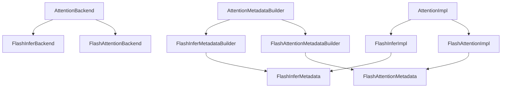
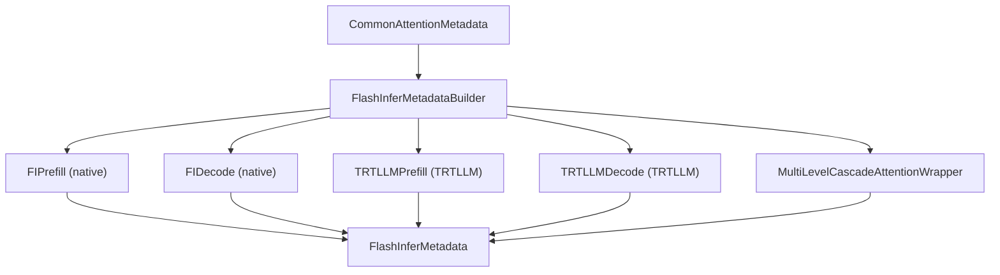
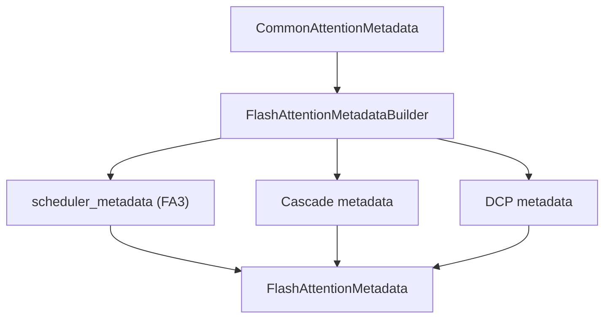
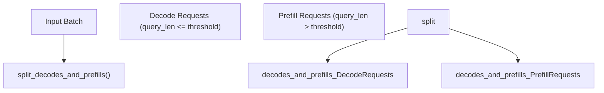
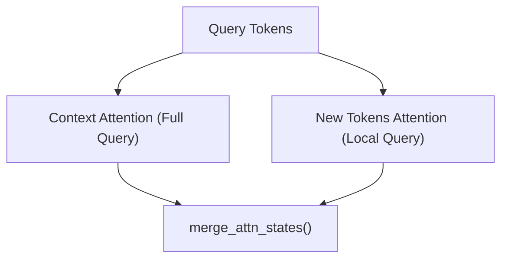

# FlashAttention 和 FlashInfer

相关源文件

-   [cmake/external\_projects/flashmla.cmake](https://github.com/vllm-project/vllm/blob/7cc302dd/cmake/external_projects/flashmla.cmake)
-   [docs/design/attention\_backends.md](https://github.com/vllm-project/vllm/blob/7cc302dd/docs/design/attention_backends.md?plain=1)
-   [tests/kernels/attention/test\_aiter\_flash\_attn.py](https://github.com/vllm-project/vllm/blob/7cc302dd/tests/kernels/attention/test_aiter_flash_attn.py)
-   [tests/kernels/attention/test\_attention.py](https://github.com/vllm-project/vllm/blob/7cc302dd/tests/kernels/attention/test_attention.py)
-   [tests/kernels/attention/test\_attention\_selector.py](https://github.com/vllm-project/vllm/blob/7cc302dd/tests/kernels/attention/test_attention_selector.py)
-   [tests/kernels/attention/test\_cascade\_flash\_attn.py](https://github.com/vllm-project/vllm/blob/7cc302dd/tests/kernels/attention/test_cascade_flash_attn.py)
-   [tests/kernels/attention/test\_cutlass\_mla\_decode.py](https://github.com/vllm-project/vllm/blob/7cc302dd/tests/kernels/attention/test_cutlass_mla_decode.py)
-   [tests/kernels/attention/test\_flash\_attn.py](https://github.com/vllm-project/vllm/blob/7cc302dd/tests/kernels/attention/test_flash_attn.py)
-   [tests/kernels/attention/test\_flashinfer.py](https://github.com/vllm-project/vllm/blob/7cc302dd/tests/kernels/attention/test_flashinfer.py)
-   [tests/kernels/attention/test\_flashinfer\_mla\_decode.py](https://github.com/vllm-project/vllm/blob/7cc302dd/tests/kernels/attention/test_flashinfer_mla_decode.py)
-   [tests/kernels/attention/test\_flashmla.py](https://github.com/vllm-project/vllm/blob/7cc302dd/tests/kernels/attention/test_flashmla.py)
-   [tests/kernels/attention/test\_flashmla\_sparse.py](https://github.com/vllm-project/vllm/blob/7cc302dd/tests/kernels/attention/test_flashmla_sparse.py)
-   [tests/kernels/attention/test\_lightning\_attn.py](https://github.com/vllm-project/vllm/blob/7cc302dd/tests/kernels/attention/test_lightning_attn.py)
-   [tests/kernels/attention/test\_prefix\_prefill.py](https://github.com/vllm-project/vllm/blob/7cc302dd/tests/kernels/attention/test_prefix_prefill.py)
-   [tests/kernels/attention/test\_rocm\_attention\_selector.py](https://github.com/vllm-project/vllm/blob/7cc302dd/tests/kernels/attention/test_rocm_attention_selector.py)
-   [tests/kernels/attention/test\_triton\_unified\_attention.py](https://github.com/vllm-project/vllm/blob/7cc302dd/tests/kernels/attention/test_triton_unified_attention.py)
-   [tests/kernels/test\_flex\_attention.py](https://github.com/vllm-project/vllm/blob/7cc302dd/tests/kernels/test_flex_attention.py)
-   [tests/models/multimodal/generation/test\_multimodal\_gguf.py](https://github.com/vllm-project/vllm/blob/7cc302dd/tests/models/multimodal/generation/test_multimodal_gguf.py)
-   [tests/models/quantization/test\_gguf.py](https://github.com/vllm-project/vllm/blob/7cc302dd/tests/models/quantization/test_gguf.py)
-   [tests/test\_attention\_backend\_registry.py](https://github.com/vllm-project/vllm/blob/7cc302dd/tests/test_attention_backend_registry.py)
-   [tests/v1/attention/test\_attention\_backends.py](https://github.com/vllm-project/vllm/blob/7cc302dd/tests/v1/attention/test_attention_backends.py)
-   [tests/v1/attention/test\_mla\_backends.py](https://github.com/vllm-project/vllm/blob/7cc302dd/tests/v1/attention/test_mla_backends.py)
-   [tests/v1/attention/test\_rocm\_attention\_backends\_selection.py](https://github.com/vllm-project/vllm/blob/7cc302dd/tests/v1/attention/test_rocm_attention_backends_selection.py)
-   [tests/v1/attention/test\_sparse\_mla\_backends.py](https://github.com/vllm-project/vllm/blob/7cc302dd/tests/v1/attention/test_sparse_mla_backends.py)
-   [tests/v1/attention/utils.py](https://github.com/vllm-project/vllm/blob/7cc302dd/tests/v1/attention/utils.py)
-   [tests/v1/spec\_decode/test\_tree\_attention.py](https://github.com/vllm-project/vllm/blob/7cc302dd/tests/v1/spec_decode/test_tree_attention.py)
-   [tests/v1/worker/test\_worker\_memory\_snapshot.py](https://github.com/vllm-project/vllm/blob/7cc302dd/tests/v1/worker/test_worker_memory_snapshot.py)
-   [tools/pre\_commit/generate\_attention\_backend\_docs.py](https://github.com/vllm-project/vllm/blob/7cc302dd/tools/pre_commit/generate_attention_backend_docs.py)
-   [vllm/v1/attention/backends/flash\_attn.py](https://github.com/vllm-project/vllm/blob/7cc302dd/vllm/v1/attention/backends/flash_attn.py)
-   [vllm/v1/attention/backends/flashinfer.py](https://github.com/vllm-project/vllm/blob/7cc302dd/vllm/v1/attention/backends/flashinfer.py)
-   [vllm/v1/attention/backends/flex\_attention.py](https://github.com/vllm-project/vllm/blob/7cc302dd/vllm/v1/attention/backends/flex_attention.py)
-   [vllm/v1/attention/backends/mla/aiter\_triton\_mla.py](https://github.com/vllm-project/vllm/blob/7cc302dd/vllm/v1/attention/backends/mla/aiter_triton_mla.py)
-   [vllm/v1/attention/backends/mla/cutlass\_mla.py](https://github.com/vllm-project/vllm/blob/7cc302dd/vllm/v1/attention/backends/mla/cutlass_mla.py)
-   [vllm/v1/attention/backends/mla/flashattn\_mla.py](https://github.com/vllm-project/vllm/blob/7cc302dd/vllm/v1/attention/backends/mla/flashattn_mla.py)
-   [vllm/v1/attention/backends/mla/flashinfer\_mla.py](https://github.com/vllm-project/vllm/blob/7cc302dd/vllm/v1/attention/backends/mla/flashinfer_mla.py)
-   [vllm/v1/attention/backends/mla/flashinfer\_mla\_sparse.py](https://github.com/vllm-project/vllm/blob/7cc302dd/vllm/v1/attention/backends/mla/flashinfer_mla_sparse.py)
-   [vllm/v1/attention/backends/mla/flashmla.py](https://github.com/vllm-project/vllm/blob/7cc302dd/vllm/v1/attention/backends/mla/flashmla.py)
-   [vllm/v1/attention/backends/mla/flashmla\_sparse.py](https://github.com/vllm-project/vllm/blob/7cc302dd/vllm/v1/attention/backends/mla/flashmla_sparse.py)
-   [vllm/v1/attention/backends/mla/rocm\_aiter\_mla.py](https://github.com/vllm-project/vllm/blob/7cc302dd/vllm/v1/attention/backends/mla/rocm_aiter_mla.py)
-   [vllm/v1/attention/backends/mla/rocm\_aiter\_mla\_sparse.py](https://github.com/vllm-project/vllm/blob/7cc302dd/vllm/v1/attention/backends/mla/rocm_aiter_mla_sparse.py)
-   [vllm/v1/attention/backends/mla/triton\_mla.py](https://github.com/vllm-project/vllm/blob/7cc302dd/vllm/v1/attention/backends/mla/triton_mla.py)
-   [vllm/v1/attention/backends/rocm\_aiter\_fa.py](https://github.com/vllm-project/vllm/blob/7cc302dd/vllm/v1/attention/backends/rocm_aiter_fa.py)
-   [vllm/v1/attention/backends/rocm\_aiter\_unified\_attn.py](https://github.com/vllm-project/vllm/blob/7cc302dd/vllm/v1/attention/backends/rocm_aiter_unified_attn.py)
-   [vllm/v1/attention/backends/rocm\_attn.py](https://github.com/vllm-project/vllm/blob/7cc302dd/vllm/v1/attention/backends/rocm_attn.py)
-   [vllm/v1/attention/backends/triton\_attn.py](https://github.com/vllm-project/vllm/blob/7cc302dd/vllm/v1/attention/backends/triton_attn.py)
-   [vllm/v1/attention/backends/utils.py](https://github.com/vllm-project/vllm/blob/7cc302dd/vllm/v1/attention/backends/utils.py)
-   [vllm/v1/attention/ops/chunked\_prefill\_paged\_decode.py](https://github.com/vllm-project/vllm/blob/7cc302dd/vllm/v1/attention/ops/chunked_prefill_paged_decode.py)

## 目的与范围

本文档介绍 vLLM 中用于标准解码器注意力的两种主要注意力后端实现：**FlashAttention** 和 **FlashInfer**。这些后端为 Transformer 模型提供基于分页 KV 缓存的高效注意力计算。

有关以下内容：

-   DeepSeek 模型的多层注意力（MLA）后端，请参见 [8.3](https://github.com/vllm-project/vllm/blob/7cc302dd/8.3)
-   后端选择逻辑和注册表，请参见 [8.1](https://github.com/vllm-project/vllm/blob/7cc302dd/8.1)
-   通用注意力后端架构，请参见 [8.1](https://github.com/vllm-project/vllm/blob/7cc302dd/8.1)
-   稀疏注意力实现，请参见 [8.3](https://github.com/vllm-project/vllm/blob/7cc302dd/8.3)

两种后端都支持：

-   支持可变序列长度的分页 KV 缓存 [vllm/v1/attention/backends/flash\_attn.py186-220](https://github.com/vllm-project/vllm/blob/7cc302dd/vllm/v1/attention/backends/flash_attn.py#L186-L220) [vllm/v1/attention/backends/flashinfer.py448-483](https://github.com/vllm-project/vllm/blob/7cc302dd/vllm/v1/attention/backends/flashinfer.py#L448-L483)
-   混合解码/预填充批次 [vllm/v1/attention/backends/utils.py64-65](https://github.com/vllm-project/vllm/blob/7cc302dd/vllm/v1/attention/backends/utils.py#L64-L65)
-   FP8 量化 KV 缓存 [vllm/v1/attention/backends/flash\_attn.py167-173](https://github.com/vllm-project/vllm/blob/7cc302dd/vllm/v1/attention/backends/flash_attn.py#L167-L173) [vllm/v1/attention/backends/flashinfer.py279-307](https://github.com/vllm-project/vllm/blob/7cc302dd/vllm/v1/attention/backends/flashinfer.py#L279-L307)
-   用于前缀共享的级联注意力 [vllm/v1/attention/backends/flash\_attn.py741-767](https://github.com/vllm-project/vllm/blob/7cc302dd/vllm/v1/attention/backends/flash_attn.py#L741-L767) [vllm/v1/attention/backends/flashinfer.py1148-1198](https://github.com/vllm-project/vllm/blob/7cc302dd/vllm/v1/attention/backends/flashinfer.py#L1148-L1198)
-   CUDA 图捕获 [vllm/v1/attention/backends/flash\_attn.py253-257](https://github.com/vllm-project/vllm/blob/7cc302dd/vllm/v1/attention/backends/flash_attn.py#L253-L257) [vllm/v1/attention/backends/flashinfer.py656-694](https://github.com/vllm-project/vllm/blob/7cc302dd/vllm/v1/attention/backends/flashinfer.py#L656-L694)
-   张量并行和数据并行 [vllm/v1/attention/backends/flash\_attn.py43-44](https://github.com/vllm-project/vllm/blob/7cc302dd/vllm/v1/attention/backends/flash_attn.py#L43-L44) [vllm/v1/attention/backends/flashinfer.py29-30](https://github.com/vllm-project/vllm/blob/7cc302dd/vllm/v1/attention/backends/flashinfer.py#L29-L30)

---

## 后端对比

| 特性 | FlashInfer | FlashAttention |
| --- | --- | --- |
| **主类** | `FlashInferBackend` | `FlashAttentionBackend` |
| **实现类** | `FlashInferImpl` | `FlashAttentionImpl` |
| **元数据构建器** | `FlashInferMetadataBuilder` | `FlashAttentionMetadataBuilder` |
| **计算能力** | SM75-SM121 | SM80+ |
| **块大小** | 16, 32, 64 | 16 的倍数 |
| **头尺寸** | 64, 128, 256 | 8 的倍数，≤256 |
| **FP8 KV 缓存** | 是（通过 TRTLLM） | 是（FA2/FA3） |
| **CUDA 图支持** | UNIFORM_BATCH（配合 TRTLLM） | ALWAYS（FA3），UNIFORM_BATCH（FA2） |
| **Sinks 支持** | 是（SM100 上配合 TRTLLM） | 是（FA3 在 SM90+ 上） |
| **DCP 支持** | 是（原生） | 是（通过自定义实现） |
| **TRTLLM 集成** | 是（SM100） | 否 |

来源： [vllm/v1/attention/backends/flashinfer.py279-383](https://github.com/vllm-project/vllm/blob/7cc302dd/vllm/v1/attention/backends/flashinfer.py#L279-L383) [vllm/v1/attention/backends/flash\_attn.py58-183](https://github.com/vllm-project/vllm/blob/7cc302dd/vllm/v1/attention/backends/flash_attn.py#L58-L183)

---

## 架构概览

### 类层次结构


**图：后端类结构**

该架构采用三组件模式：

1.  **后端类** - 定义能力和工厂方法。
2.  **元数据构建器** - 根据批次信息构建注意力元数据。
3.  **实现** - 执行实际的注意力计算。

来源： [vllm/v1/attention/backends/flashinfer.py279-307](https://github.com/vllm-project/vllm/blob/7cc302dd/vllm/v1/attention/backends/flashinfer.py#L279-L307) [vllm/v1/attention/backends/flash\_attn.py58-105](https://github.com/vllm-project/vllm/blob/7cc302dd/vllm/v1/attention/backends/flash_attn.py#L58-L105) [vllm/v1/attention/backends/flash\_attn.py115-121](https://github.com/vllm-project/vllm/blob/7cc302dd/vllm/v1/attention/backends/flash_attn.py#L115-L121)

---

## 元数据构建过程

### FlashInfer 元数据


**图：FlashInfer 元数据构建流程**

`FlashInferMetadataBuilder.build()` 方法会根据以下内容创建不同内部结构的 `FlashInferMetadata`：

1.  **级联注意力**：共享前缀优化。
2.  **后端选择**：原生 FlashInfer 还是 TRTLLM。
3.  **请求类型**：解码还是预填充。

**关键决策点** 见 [vllm/v1/attention/backends/flashinfer.py844-876](https://github.com/vllm-project/vllm/blob/7cc302dd/vllm/v1/attention/backends/flashinfer.py#L844-L876)：

```
use_cascade = common_prefix_len > 0prefill_use_trtllm = use_trtllm_attention(...)decode_use_trtllm = self.use_trtllm_decode_attention and self.dcp_world_size <= 1
```
元数据存储：

-   `num_decodes`, `num_prefills`, `num_decode_tokens`, `num_prefill_tokens` [vllm/v1/attention/backends/flashinfer.py448-455](https://github.com/vllm-project/vllm/blob/7cc302dd/vllm/v1/attention/backends/flashinfer.py#L448-L455)
-   `prefill`: `FIPrefill | TRTLLMPrefill | None` [vllm/v1/attention/backends/flashinfer.py456](https://github.com/vllm-project/vllm/blob/7cc302dd/vllm/v1/attention/backends/flashinfer.py#L456-L456)
-   `decode`: `FIDecode | TRTLLMDecode | None` [vllm/v1/attention/backends/flashinfer.py457](https://github.com/vllm-project/vllm/blob/7cc302dd/vllm/v1/attention/backends/flashinfer.py#L457-L457)
-   `use_cascade`, `cascade_wrapper` [vllm/v1/attention/backends/flashinfer.py458-459](https://github.com/vllm-project/vllm/blob/7cc302dd/vllm/v1/attention/backends/flashinfer.py#L458-L459)
-   用于 KV 缓存更新的 `slot_mapping` [vllm/v1/attention/backends/flashinfer.py460](https://github.com/vllm-project/vllm/blob/7cc302dd/vllm/v1/attention/backends/flashinfer.py#L460-L460)

来源： [vllm/v1/attention/backends/flashinfer.py448-483](https://github.com/vllm-project/vllm/blob/7cc302dd/vllm/v1/attention/backends/flashinfer.py#L448-L483) [vllm/v1/attention/backends/flashinfer.py821-917](https://github.com/vllm-project/vllm/blob/7cc302dd/vllm/v1/attention/backends/flashinfer.py#L821-L917)

### FlashAttention 元数据


**图：FlashAttention 元数据构建流程**

`FlashAttentionMetadata` 结构存储以下内容：

-   `query_start_loc`, `seq_lens`, `max_query_len`, `max_seq_len` [vllm/v1/attention/backends/flash\_attn.py202-211](https://github.com/vllm-project/vllm/blob/7cc302dd/vllm/v1/attention/backends/flash_attn.py#L202-L211)
-   `block_table`, `slot_mapping` [vllm/v1/attention/backends/flash\_attn.py212-213](https://github.com/vllm-project/vllm/blob/7cc302dd/vllm/v1/attention/backends/flash_attn.py#L212-L213)
-   **级联字段**：`use_cascade`, `cu_prefix_query_lens`, `prefix_kv_lens`, `suffix_kv_lens` [vllm/v1/attention/backends/flash\_attn.py215-220](https://github.com/vllm-project/vllm/blob/7cc302dd/vllm/v1/attention/backends/flash_attn.py#L215-L220)
-   **FA3 调度**：`scheduler_metadata`, `max_num_splits` [vllm/v1/attention/backends/flash\_attn.py240-241](https://github.com/vllm-project/vllm/blob/7cc302dd/vllm/v1/attention/backends/flash_attn.py#L240-L241)

**AOT 调度**（仅 FA3）见 [vllm/v1/attention/backends/flash\_attn.py392-418](https://github.com/vllm-project/vllm/blob/7cc302dd/vllm/v1/attention/backends/flash_attn.py#L392-L418)：

```
if aot_schedule:    return get_scheduler_metadata(        batch_size=batch_size,        max_seqlen_q=max_query_len,        max_seqlen_k=max_seq_len,        # ... other params    )
```
来源： [vllm/v1/attention/backends/flash\_attn.py186-220](https://github.com/vllm-project/vllm/blob/7cc302dd/vllm/v1/attention/backends/flash_attn.py#L186-L220) [vllm/v1/attention/backends/flash\_attn.py338-521](https://github.com/vllm-project/vllm/blob/7cc302dd/vllm/v1/attention/backends/flash_attn.py#L338-L521)

---

## 解码与预填充路径

### 请求拆分


**图：解码/预填充分割策略**

[vllm/v1/attention/backends/utils.py61-62](https://github.com/vllm-project/vllm/blob/7cc302dd/vllm/v1/attention/backends/utils.py#L61-L62) 中的 `split_decodes_and_prefills()` 函数假定输入是 **已重排的批次**，其中解码请求排在前面。它会确定：

```
query_lens = query_start_loc[1:] - query_start_loc[:-1]is_prefill = query_lens > decode_threshold# ... logic to find split point
```
来源： [vllm/v1/attention/backends/utils.py61-62](https://github.com/vllm-project/vllm/blob/7cc302dd/vllm/v1/attention/backends/utils.py#L61-L62) [vllm/v1/attention/backends/flashinfer.py829-834](https://github.com/vllm-project/vllm/blob/7cc302dd/vllm/v1/attention/backends/flashinfer.py#L829-L834)

### FlashInfer 前向传递

[vllm/v1/attention/backends/flashinfer.py1148-1367](https://github.com/vllm-project/vllm/blob/7cc302dd/vllm/v1/attention/backends/flashinfer.py#L1148-L1367) 中的实现会通过不同的内核路径进行路由：

1.  **级联路径**：使用 `MultiLevelCascadeAttentionWrapper` [vllm/v1/attention/backends/flashinfer.py1148-1198](https://github.com/vllm-project/vllm/blob/7cc302dd/vllm/v1/attention/backends/flashinfer.py#L1148-L1198)
2.  **DCP 预填充**：通过 `BatchDCPPrefillWrapper` 对解耦上下文预填充进行特殊处理 [vllm/v1/attention/backends/flashinfer.py206-277](https://github.com/vllm-project/vllm/blob/7cc302dd/vllm/v1/attention/backends/flashinfer.py#L206-L277)
3.  **原生 FlashInfer**：标准分页注意力包装器（`BatchPrefillWithPagedKVCacheWrapper`、`BatchDecodeWithPagedKVCacheWrapper`） [vllm/v1/attention/backends/flashinfer.py12-13](https://github.com/vllm-project/vllm/blob/7cc302dd/vllm/v1/attention/backends/flashinfer.py#L12-L13)
4.  **TRTLLM 路径**：对于带 FP8 的 SM100，直接调用 TRTLLM 内核 [vllm/v1/attention/backends/flashinfer.py1255-1272](https://github.com/vllm-project/vllm/blob/7cc302dd/vllm/v1/attention/backends/flashinfer.py#L1255-L1272)

来源： [vllm/v1/attention/backends/flashinfer.py1148-1367](https://github.com/vllm-project/vllm/blob/7cc302dd/vllm/v1/attention/backends/flashinfer.py#L1148-L1367)

### FlashAttention 前向传递

FlashAttention 后端使用 `flash_attn_varlen_func` 内核，通过统一的变长接口同时处理解码和预填充。 [vllm/v1/attention/backends/flash\_attn.py604-768](https://github.com/vllm-project/vllm/blob/7cc302dd/vllm/v1/attention/backends/flash_attn.py#L604-L768) 中的实现提供：

-   **统一内核**：单次 `flash_attn_varlen_func` 调用即可处理混合批次 [vllm/v1/attention/backends/flash\_attn.py728](https://github.com/vllm-project/vllm/blob/7cc302dd/vllm/v1/attention/backends/flash_attn.py#L728-L728)
-   **编码器支持**：为仅编码器注意力提供单独路径 [vllm/v1/attention/backends/flash\_attn.py651-665](https://github.com/vllm-project/vllm/blob/7cc302dd/vllm/v1/attention/backends/flash_attn.py#L651-L665)
-   **DCP 支持**：通过 all-gather 和 reduce-scatter 的自定义实现 [vllm/v1/attention/backends/flash\_attn.py667-710](https://github.com/vllm-project/vllm/blob/7cc302dd/vllm/v1/attention/backends/flash_attn.py#L667-L710)
-   **级联注意力**：合并前缀和后缀注意力状态 [vllm/v1/attention/backends/flash\_attn.py741-767](https://github.com/vllm-project/vllm/blob/7cc302dd/vllm/v1/attention/backends/flash_attn.py#L741-L767)

来源： [vllm/v1/attention/backends/flash\_attn.py604-768](https://github.com/vllm-project/vllm/blob/7cc302dd/vllm/v1/attention/backends/flash_attn.py#L604-L768)

---

## KV 缓存管理

### 缓存布局

两种后端都支持由 `get_kv_cache_layout()` 控制的两种 KV 缓存布局 [vllm/v1/attention/backends/utils.py52-78](https://github.com/vllm-project/vllm/blob/7cc302dd/vllm/v1/attention/backends/utils.py#L52-L78)：

| 布局 | 形状 | 用途 |
| --- | --- | --- |
| **NHD** | `(num_blocks, 2, block_size, num_kv_heads, head_size)` | 默认 [vllm/v1/attention/backends/flash\_attn.py132](https://github.com/vllm-project/vllm/blob/7cc302dd/vllm/v1/attention/backends/flash_attn.py#L132-L132) |
| **HND** | `(num_blocks, 2, num_kv_heads, block_size, head_size)` | SM100 上的 TRTLLM 所需 [vllm/v1/attention/backends/flash\_attn.py150](https://github.com/vllm-project/vllm/blob/7cc302dd/vllm/v1/attention/backends/flash_attn.py#L150-L150) |

`FlashInfer` 会在 SM100 上自动切换为 HND 布局 [vllm/v1/attention/backends/flashinfer.py376-382](https://github.com/vllm-project/vllm/blob/7cc302dd/vllm/v1/attention/backends/flashinfer.py#L376-L382)

来源： [vllm/v1/attention/backends/flashinfer.py309-337](https://github.com/vllm-project/vllm/blob/7cc302dd/vllm/v1/attention/backends/flashinfer.py#L309-L337) [vllm/v1/attention/backends/flash\_attn.py106-137](https://github.com/vllm-project/vllm/blob/7cc302dd/vllm/v1/attention/backends/flash_attn.py#L106-L137) [vllm/v1/attention/backends/utils.py41-78](https://github.com/vllm-project/vllm/blob/7cc302dd/vllm/v1/attention/backends/utils.py#L41-L78)

### 缓存更新

**FlashAttention** 使用 `reshape_and_cache_flash()` [vllm/v1/attention/backends/flash\_attn.py770-806](https://github.com/vllm-project/vllm/blob/7cc302dd/vllm/v1/attention/backends/flash_attn.py#L770-L806)：

```
def do_kv_cache_update(self, layer, key, value, kv_cache, slot_mapping):    key_cache, value_cache = kv_cache.unbind(0)    reshape_and_cache_flash(        key, value, key_cache, value_cache, slot_mapping,        self.kv_cache_dtype, layer._k_scale, layer._v_scale    )
```
**FlashInfer** 将更新委托给 `FlashInferAttention.update_kv_cache()` [vllm/v1/attention/backends/flashinfer.py1369-1372](https://github.com/vllm-project/vllm/blob/7cc302dd/vllm/v1/attention/backends/flashinfer.py#L1369-L1372)

来源： [vllm/v1/attention/backends/flash\_attn.py770-806](https://github.com/vllm-project/vllm/blob/7cc302dd/vllm/v1/attention/backends/flash_attn.py#L770-L806) [vllm/v1/attention/backends/flashinfer.py1369-1372](https://github.com/vllm-project/vllm/blob/7cc302dd/vllm/v1/attention/backends/flashinfer.py#L1369-L1372)

---

## FlashInfer 特有特性

### TRTLLM 注意力集成

FlashInfer 将 NVIDIA TensorRT-LLM 注意力内核集成到 SM100（Blackwell）GPU 上。该集成由 `use_trtllm_attention()` 控制 [vllm/v1/attention/backends/flashinfer.py44-45](https://github.com/vllm-project/vllm/blob/7cc302dd/vllm/v1/attention/backends/flashinfer.py#L44-L45)

**决策逻辑** 见 [vllm/v1/attention/backends/flashinfer.py850-868](https://github.com/vllm-project/vllm/blob/7cc302dd/vllm/v1/attention/backends/flashinfer.py#L850-L868)：

```
prefill_use_trtllm = use_trtllm_attention(...)
```
TRTLLM 的优势：

-   **FP8 查询量化**：除了 KV 缓存之外，还会量化 query 张量。
-   **注意力 sinks**：支持将初始 token 保留在缓存中。
-   **更优的 SM100 性能**：针对 Blackwell 架构进行了优化。

来源： [vllm/v1/attention/backends/flashinfer.py850-868](https://github.com/vllm-project/vllm/blob/7cc302dd/vllm/v1/attention/backends/flashinfer.py#L850-L868) [vllm/v1/attention/backends/flashinfer.py1148-1367](https://github.com/vllm-project/vllm/blob/7cc302dd/vllm/v1/attention/backends/flashinfer.py#L1148-L1367)

### DCP（解耦上下文预填充）

FlashInfer 通过 `BatchDCPPrefillWrapper` 提供原生 DCP 支持 [vllm/v1/attention/backends/flashinfer.py206-277](https://github.com/vllm-project/vllm/blob/7cc302dd/vllm/v1/attention/backends/flashinfer.py#L206-L277)


**图：使用 FlashInfer 的 DCP 预填充**

[vllm/v1/attention/backends/flashinfer.py233-276](https://github.com/vllm-project/vllm/blob/7cc302dd/vllm/v1/attention/backends/flashinfer.py#L233-L276) 中的包装器会同时运行上下文注意力和新 token 注意力，并通过 LSE 进行合并。

来源： [vllm/v1/attention/backends/flashinfer.py206-277](https://github.com/vllm-project/vllm/blob/7cc302dd/vllm/v1/attention/backends/flashinfer.py#L206-L277)

---

## FlashAttention 特有特性

### FlashAttention 版本

FlashAttention 后端同时支持 FA2 和 FA3。版本检测会影响：

-   `**_cudagraph_support**` [vllm/v1/attention/backends/flash\_attn.py253-257](https://github.com/vllm-project/vllm/blob/7cc302dd/vllm/v1/attention/backends/flash_attn.py#L253-L257)
-   `scheduler_metadata` 的生成 [vllm/v1/attention/backends/flash\_attn.py291-292](https://github.com/vllm-project/vllm/blob/7cc302dd/vllm/v1/attention/backends/flash_attn.py#L291-L292)

来源： [vllm/v1/attention/backends/flash\_attn.py253-257](https://github.com/vllm-project/vllm/blob/7cc302dd/vllm/v1/attention/backends/flash_attn.py#L253-L257) [vllm/v1/attention/backends/fa\_utils.py22](https://github.com/vllm-project/vllm/blob/7cc302dd/vllm/v1/attention/backends/fa_utils.py#L22-L22)

### 级联注意力

FlashAttention 在 [vllm/v1/attention/backends/flash\_attn.py741-767](https://github.com/vllm-project/vllm/blob/7cc302dd/vllm/v1/attention/backends/flash_attn.py#L741-L767) 中提供了自定义实现。它会分别在共享前缀（非因果）和每个请求的后缀（因果）上计算注意力，然后合并状态。

来源： [vllm/v1/attention/backends/flash\_attn.py741-767](https://github.com/vllm-project/vllm/blob/7cc302dd/vllm/v1/attention/backends/flash_attn.py#L741-L767)

---

## 性能考量

### 工作区缓冲区管理

FlashInfer 需要一个由 `envs.VLLM_FLASHINFER_WORKSPACE_BUFFER_SIZE` 指定大小的工作区缓冲区 [vllm/v1/attention/backends/flashinfer.py86-87](https://github.com/vllm-project/vllm/blob/7cc302dd/vllm/v1/attention/backends/flashinfer.py#L86-L87)。该缓冲区会在各个包装器之间共享 [vllm/v1/attention/backends/flashinfer.py696-758](https://github.com/vllm-project/vllm/blob/7cc302dd/vllm/v1/attention/backends/flashinfer.py#L696-L758)

### 后端选择标准

**以下情况下优先选择 FlashInfer：**

-   在支持 TRTLLM 的 Blackwell GPU（SM100）上运行。
-   需要带查询量化的 FP8 KV 缓存。
-   DCP 工作负载可受益于其原生支持。

**以下情况下优先选择 FlashAttention：**

-   需要更广泛的硬件支持（SM80+）。
-   可使用 FA3，以获得最佳 CUDA 图支持。
-   处理仅编码器或编码器-解码器模型。

来源： [vllm/v1/attention/backends/flashinfer.py376-382](https://github.com/vllm-project/vllm/blob/7cc302dd/vllm/v1/attention/backends/flashinfer.py#L376-L382) [vllm/v1/attention/backends/flash\_attn.py181-182](https://github.com/vllm-project/vllm/blob/7cc302dd/vllm/v1/attention/backends/flash_attn.py#L181-L182)
