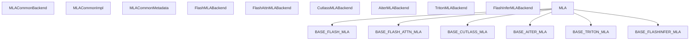
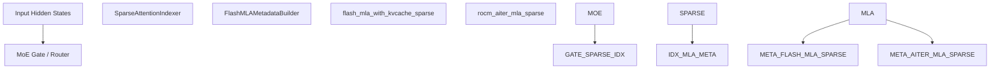

# MLA 与专用注意力机制

相关源文件

-   [cmake/external\_projects/flashmla.cmake](https://github.com/vllm-project/vllm/blob/7cc302dd/cmake/external_projects/flashmla.cmake)
-   [csrc/mamba/mamba\_ssm/selective\_scan.h](https://github.com/vllm-project/vllm/blob/7cc302dd/csrc/mamba/mamba_ssm/selective_scan.h)
-   [csrc/mamba/mamba\_ssm/selective\_scan\_fwd.cu](https://github.com/vllm-project/vllm/blob/7cc302dd/csrc/mamba/mamba_ssm/selective_scan_fwd.cu)
-   [docs/design/attention\_backends.md](https://github.com/vllm-project/vllm/blob/7cc302dd/docs/design/attention_backends.md?plain=1)
-   [tests/kernels/attention/test\_attention\_selector.py](https://github.com/vllm-project/vllm/blob/7cc302dd/tests/kernels/attention/test_attention_selector.py)
-   [tests/kernels/attention/test\_flashmla.py](https://github.com/vllm-project/vllm/blob/7cc302dd/tests/kernels/attention/test_flashmla.py)
-   [tests/kernels/attention/test\_flashmla\_sparse.py](https://github.com/vllm-project/vllm/blob/7cc302dd/tests/kernels/attention/test_flashmla_sparse.py)
-   [tests/kernels/attention/test\_rocm\_attention\_selector.py](https://github.com/vllm-project/vllm/blob/7cc302dd/tests/kernels/attention/test_rocm_attention_selector.py)
-   [tests/kernels/test\_flex\_attention.py](https://github.com/vllm-project/vllm/blob/7cc302dd/tests/kernels/test_flex_attention.py)
-   [tests/models/language/generation/test\_hybrid.py](https://github.com/vllm-project/vllm/blob/7cc302dd/tests/models/language/generation/test_hybrid.py)
-   [tests/test\_attention\_backend\_registry.py](https://github.com/vllm-project/vllm/blob/7cc302dd/tests/test_attention_backend_registry.py)
-   [tests/v1/attention/test\_attention\_backends.py](https://github.com/vllm-project/vllm/blob/7cc302dd/tests/v1/attention/test_attention_backends.py)
-   [tests/v1/attention/test\_mla\_backends.py](https://github.com/vllm-project/vllm/blob/7cc302dd/tests/v1/attention/test_mla_backends.py)
-   [tests/v1/attention/test\_rocm\_attention\_backends\_selection.py](https://github.com/vllm-project/vllm/blob/7cc302dd/tests/v1/attention/test_rocm_attention_backends_selection.py)
-   [tests/v1/attention/test\_sparse\_mla\_backends.py](https://github.com/vllm-project/vllm/blob/7cc302dd/tests/v1/attention/test_sparse_mla_backends.py)
-   [tests/v1/attention/utils.py](https://github.com/vllm-project/vllm/blob/7cc302dd/tests/v1/attention/utils.py)
-   [tests/v1/spec\_decode/test\_tree\_attention.py](https://github.com/vllm-project/vllm/blob/7cc302dd/tests/v1/spec_decode/test_tree_attention.py)
-   [tools/pre\_commit/generate\_attention\_backend\_docs.py](https://github.com/vllm-project/vllm/blob/7cc302dd/tools/pre_commit/generate_attention_backend_docs.py)
-   [vllm/model\_executor/layers/mamba/abstract.py](https://github.com/vllm-project/vllm/blob/7cc302dd/vllm/model_executor/layers/mamba/abstract.py)
-   [vllm/model\_executor/layers/mamba/mamba\_mixer.py](https://github.com/vllm-project/vllm/blob/7cc302dd/vllm/model_executor/layers/mamba/mamba_mixer.py)
-   [vllm/model\_executor/layers/mamba/mamba\_mixer2.py](https://github.com/vllm-project/vllm/blob/7cc302dd/vllm/model_executor/layers/mamba/mamba_mixer2.py)
-   [vllm/model\_executor/layers/mamba/mamba\_utils.py](https://github.com/vllm-project/vllm/blob/7cc302dd/vllm/model_executor/layers/mamba/mamba_utils.py)
-   [vllm/model\_executor/layers/mamba/ops/causal\_conv1d.py](https://github.com/vllm-project/vllm/blob/7cc302dd/vllm/model_executor/layers/mamba/ops/causal_conv1d.py)
-   [vllm/model\_executor/layers/mamba/short\_conv.py](https://github.com/vllm-project/vllm/blob/7cc302dd/vllm/model_executor/layers/mamba/short_conv.py)
-   [vllm/model\_executor/models/bamba.py](https://github.com/vllm-project/vllm/blob/7cc302dd/vllm/model_executor/models/bamba.py)
-   [vllm/model\_executor/models/falcon\_h1.py](https://github.com/vllm-project/vllm/blob/7cc302dd/vllm/model_executor/models/falcon_h1.py)
-   [vllm/model\_executor/models/granitemoehybrid.py](https://github.com/vllm-project/vllm/blob/7cc302dd/vllm/model_executor/models/granitemoehybrid.py)
-   [vllm/model\_executor/models/lfm2.py](https://github.com/vllm-project/vllm/blob/7cc302dd/vllm/model_executor/models/lfm2.py)
-   [vllm/model\_executor/models/lfm2\_moe.py](https://github.com/vllm-project/vllm/blob/7cc302dd/vllm/model_executor/models/lfm2_moe.py)
-   [vllm/model\_executor/models/lfm2\_vl.py](https://github.com/vllm-project/vllm/blob/7cc302dd/vllm/model_executor/models/lfm2_vl.py)
-   [vllm/model\_executor/models/longcat\_flash.py](https://github.com/vllm-project/vllm/blob/7cc302dd/vllm/model_executor/models/longcat_flash.py)
-   [vllm/model\_executor/models/mamba2.py](https://github.com/vllm-project/vllm/blob/7cc302dd/vllm/model_executor/models/mamba2.py)
-   [vllm/model\_executor/models/nemotron\_h.py](https://github.com/vllm-project/vllm/blob/7cc302dd/vllm/model_executor/models/nemotron_h.py)
-   [vllm/model\_executor/models/openpangu.py](https://github.com/vllm-project/vllm/blob/7cc302dd/vllm/model_executor/models/openpangu.py)
-   [vllm/model\_executor/models/plamo2.py](https://github.com/vllm-project/vllm/blob/7cc302dd/vllm/model_executor/models/plamo2.py)
-   [vllm/model\_executor/models/plamo3.py](https://github.com/vllm-project/vllm/blob/7cc302dd/vllm/model_executor/models/plamo3.py)
-   [vllm/model\_executor/models/zamba2.py](https://github.com/vllm-project/vllm/blob/7cc302dd/vllm/model_executor/models/zamba2.py)
-   [vllm/transformers\_utils/configs/nemotron\_h.py](https://github.com/vllm-project/vllm/blob/7cc302dd/vllm/transformers_utils/configs/nemotron_h.py)
-   [vllm/v1/attention/backends/flash\_attn.py](https://github.com/vllm-project/vllm/blob/7cc302dd/vllm/v1/attention/backends/flash_attn.py)
-   [vllm/v1/attention/backends/flashinfer.py](https://github.com/vllm-project/vllm/blob/7cc302dd/vllm/v1/attention/backends/flashinfer.py)
-   [vllm/v1/attention/backends/flex\_attention.py](https://github.com/vllm-project/vllm/blob/7cc302dd/vllm/v1/attention/backends/flex_attention.py)
-   [vllm/v1/attention/backends/gdn\_attn.py](https://github.com/vllm-project/vllm/blob/7cc302dd/vllm/v1/attention/backends/gdn_attn.py)
-   [vllm/v1/attention/backends/linear\_attn.py](https://github.com/vllm-project/vllm/blob/7cc302dd/vllm/v1/attention/backends/linear_attn.py)
-   [vllm/v1/attention/backends/mamba1\_attn.py](https://github.com/vllm-project/vllm/blob/7cc302dd/vllm/v1/attention/backends/mamba1_attn.py)
-   [vllm/v1/attention/backends/mamba2\_attn.py](https://github.com/vllm-project/vllm/blob/7cc302dd/vllm/v1/attention/backends/mamba2_attn.py)
-   [vllm/v1/attention/backends/mamba\_attn.py](https://github.com/vllm-project/vllm/blob/7cc302dd/vllm/v1/attention/backends/mamba_attn.py)
-   [vllm/v1/attention/backends/mla/aiter\_triton\_mla.py](https://github.com/vllm-project/vllm/blob/7cc302dd/vllm/v1/attention/backends/mla/aiter_triton_mla.py)
-   [vllm/v1/attention/backends/mla/cutlass\_mla.py](https://github.com/vllm-project/vllm/blob/7cc302dd/vllm/v1/attention/backends/mla/cutlass_mla.py)
-   [vllm/v1/attention/backends/mla/flashattn\_mla.py](https://github.com/vllm-project/vllm/blob/7cc302dd/vllm/v1/attention/backends/mla/flashattn_mla.py)
-   [vllm/v1/attention/backends/mla/flashinfer\_mla.py](https://github.com/vllm-project/vllm/blob/7cc302dd/vllm/v1/attention/backends/mla/flashinfer_mla.py)
-   [vllm/v1/attention/backends/mla/flashinfer\_mla\_sparse.py](https://github.com/vllm-project/vllm/blob/7cc302dd/vllm/v1/attention/backends/mla/flashinfer_mla_sparse.py)
-   [vllm/v1/attention/backends/mla/flashmla.py](https://github.com/vllm-project/vllm/blob/7cc302dd/vllm/v1/attention/backends/mla/flashmla.py)
-   [vllm/v1/attention/backends/mla/flashmla\_sparse.py](https://github.com/vllm-project/vllm/blob/7cc302dd/vllm/v1/attention/backends/mla/flashmla_sparse.py)
-   [vllm/v1/attention/backends/mla/rocm\_aiter\_mla.py](https://github.com/vllm-project/vllm/blob/7cc302dd/vllm/v1/attention/backends/mla/rocm_aiter_mla.py)
-   [vllm/v1/attention/backends/mla/rocm\_aiter\_mla\_sparse.py](https://github.com/vllm-project/vllm/blob/7cc302dd/vllm/v1/attention/backends/mla/rocm_aiter_mla_sparse.py)
-   [vllm/v1/attention/backends/mla/triton\_mla.py](https://github.com/vllm-project/vllm/blob/7cc302dd/vllm/v1/attention/backends/mla/triton_mla.py)
-   [vllm/v1/attention/backends/rocm\_aiter\_fa.py](https://github.com/vllm-project/vllm/blob/7cc302dd/vllm/v1/attention/backends/rocm_aiter_fa.py)
-   [vllm/v1/attention/backends/rocm\_aiter\_unified\_attn.py](https://github.com/vllm-project/vllm/blob/7cc302dd/vllm/v1/attention/backends/rocm_aiter_unified_attn.py)
-   [vllm/v1/attention/backends/rocm\_attn.py](https://github.com/vllm-project/vllm/blob/7cc302dd/vllm/v1/attention/backends/rocm_attn.py)
-   [vllm/v1/attention/backends/short\_conv\_attn.py](https://github.com/vllm-project/vllm/blob/7cc302dd/vllm/v1/attention/backends/short_conv_attn.py)
-   [vllm/v1/attention/backends/triton\_attn.py](https://github.com/vllm-project/vllm/blob/7cc302dd/vllm/v1/attention/backends/triton_attn.py)
-   [vllm/v1/attention/backends/utils.py](https://github.com/vllm-project/vllm/blob/7cc302dd/vllm/v1/attention/backends/utils.py)
-   [vllm/v1/attention/ops/chunked\_prefill\_paged\_decode.py](https://github.com/vllm-project/vllm/blob/7cc302dd/vllm/v1/attention/ops/chunked_prefill_paged_decode.py)

## 目的与范围

本页记录了多头潜在注意力（MLA）后端、用于混合模型（Mamba/SSM）的专用注意力实现，以及 vLLM 中的稀疏注意力机制。MLA 是 DeepSeek-V2 和 DeepSeek-V3 模型的核心架构特性之一，旨在通过潜空间压缩显著降低 KV 缓存的内存占用。本页涵盖 MLA 后端的架构、所使用的独特 KV 缓存格式，以及专用注意力在混合架构中的集成方式。

**来源：** [vllm/v1/attention/backends/mla/flashmla.py1-45](https://github.com/vllm-project/vllm/blob/7cc302dd/vllm/v1/attention/backends/mla/flashmla.py#L1-L45) [vllm/v1/attention/backends/mla/rocm_aiter_mla.py1-28](https://github.com/vllm-project/vllm/blob/7cc302dd/vllm/v1/attention/backends/mla/rocm_aiter_mla.py#L1-L28)

## 多头潜在注意力（MLA）架构

MLA 将 Key 和 Value 向量压缩到更低维度的潜在表示中。vLLM 实现了多个后端，以在不同硬件上处理这一专用计算。

### 自然语言到代码实体空间：MLA 后端层次结构

此图将 MLA 的逻辑组件映射到实现这些组件的具体类和文件。

**来源：** [vllm/v1/attention/backends/mla/flashmla.py46-71](https://github.com/vllm-project/vllm/blob/7cc302dd/vllm/v1/attention/backends/mla/flashmla.py#L46-L71) [vllm/v1/attention/backends/mla/rocm_aiter_mla.py30-60](https://github.com/vllm-project/vllm/blob/7cc302dd/vllm/v1/attention/backends/mla/rocm_aiter_mla.py#L30-L60) [tests/kernels/attention/test_attention_selector.py41-51](https://github.com/vllm-project/vllm/blob/7cc302dd/tests/kernels/attention/test_attention_selector.py#L41-L51)

### 后端实现

-   **FlashMLA（NVIDIA）**：针对 Hopper（SM90）和 Blackwell（SM100）进行了优化。它要求内核块大小为 64，并支持 FP8 量化 KV 缓存。它使用 `get_mla_metadata` 来准备 tile 调度。 [vllm/v1/attention/backends/mla/flashmla.py56-75](https://github.com/vllm-project/vllm/blob/7cc302dd/vllm/v1/attention/backends/mla/flashmla.py#L56-L75) [vllm/v1/attention/backends/mla/flashmla.py163-168](https://github.com/vllm-project/vllm/blob/7cc302dd/vllm/v1/attention/backends/mla/flashmla.py#L163-L168)
-   **ROCm Aiter MLA**：面向使用 `rocm_aiter_ops` 的 AMD 硬件。它采用块大小为 1，并维护一个持久化的 `paged_kv_indices` 缓冲区，以避免在 CUDA 图捕获期间出现数据相关索引开销。 [vllm/v1/attention/backends/mla/rocm\_aiter\_mla.py41-55](https://github.com/vllm-project/vllm/blob/7cc302dd/vllm/v1/attention/backends/mla/rocm_aiter_mla.py#L41-L55) [vllm/v1/attention/backends/mla/rocm\_aiter\_mla.py126-129](https://github.com/vllm-project/vllm/blob/7cc302dd/vllm/v1/attention/backends/mla/rocm_aiter_mla.py#L126-L129)
-   **Triton MLA**：一个使用 Triton 编写的回退实现，为 MLA 操作提供平台无关支持。 [tests/kernels/attention/test\_attention\_selector.py43-49](https://github.com/vllm-project/vllm/blob/7cc302dd/tests/kernels/attention/test_attention_selector.py#L43-L49)

**来源：** [vllm/v1/attention/backends/mla/flashmla.py46-71](https://github.com/vllm-project/vllm/blob/7cc302dd/vllm/v1/attention/backends/mla/flashmla.py#L46-L71) [vllm/v1/attention/backends/mla/rocm\_aiter\_mla.py108-112](https://github.com/vllm-project/vllm/blob/7cc302dd/vllm/v1/attention/backends/mla/rocm_aiter_mla.py#L108-L112)

## 混合模型与专用注意力

vLLM 支持将标准注意力与状态空间模型（SSM，如 Mamba）结合的混合模型。这类模型需要对其内部状态和注意力机制进行专门处理。

### Mamba 与混合架构

混合模型（例如 Jamba、Zamba2、Nemotron-H）会在注意力层和 Mamba 层之间交替。vLLM 管理这些模型的“Inner State”（内部状态），该状态会在解码步骤之间持续保留。

-   **MambaMixer2**：实现了核心的 Mamba-2 逻辑，包括因果卷积和 Selective State Space（SSD）组合扫描。 [vllm/model\_executor/layers/mamba/mamba\_mixer2.py49-55](https://github.com/vllm-project/vllm/blob/7cc302dd/vllm/model_executor/layers/mamba/mamba_mixer2.py#L49-L55) [vllm/model\_executor/layers/mamba/mamba\_mixer2.py34-36](https://github.com/vllm-project/vllm/blob/7cc302dd/vllm/model_executor/layers/mamba/mamba_mixer2.py#L34-L36)
-   **混合状态管理**：像 `NemotronH` 这样的模型实现了 `IsHybrid` 和 `HasInnerState` 接口。它们使用 `MambaStateShapeCalculator` 来确定 KV 缓存池中 SSM 状态所需的内存。 [vllm/model\_executor/models/nemotron\_h.py65-73](https://github.com/vllm-project/vllm/blob/7cc302dd/vllm/model_executor/models/nemotron_h.py#L65-L73) [vllm/model\_executor/models/nemotron\_h.py49-55](https://github.com/vllm-project/vllm/blob/7cc302dd/vllm/model_executor/models/nemotron_h.py#L49-L55)

**来源：** [vllm/model\_executor/models/nemotron\_h.py49-55](https://github.com/vllm-project/vllm/blob/7cc302dd/vllm/model_executor/models/nemotron_h.py#L49-L55) [vllm/model\_executor/layers/mamba/mamba\_mixer2.py23-36](https://github.com/vllm-project/vllm/blob/7cc302dd/vllm/model_executor/layers/mamba/mamba_mixer2.py#L23-L36) [tests/models/language/generation/test\_hybrid.py35-44](https://github.com/vllm-project/vllm/blob/7cc302dd/tests/models/language/generation/test_hybrid.py#L35-L44)

### FlexAttention

vLLM 集成了 `torch.nn.attention.flex_attention`，提供一个高度灵活的注意力后端，能够处理复杂的掩码需求，例如文档级注意力或具有特定前缀模式的模型。

-   **块掩码**：使用 `create_block_mask` 通过跳过注意力矩阵中被置零的块来优化注意力。 [vllm/v1/attention/backends/flex\_attention.py14-22](https://github.com/vllm-project/vllm/blob/7cc302dd/vllm/v1/attention/backends/flex_attention.py#L14-L22)
-   **物理到逻辑映射**：实现 `physical_to_logical_mapping`，将 Paged KV Cache 块表转换为与 FlexAttention 索引兼容的格式，确保即使物理块被复用（例如在滑动窗口注意力中），也只会访问有效的逻辑块。 [vllm/v1/attention/backends/flex\_attention.py132-163](https://github.com/vllm-project/vllm/blob/7cc302dd/vllm/v1/attention/backends/flex_attention.py#L132-L163)

**来源：** [vllm/v1/attention/backends/flex\_attention.py75-106](https://github.com/vllm-project/vllm/blob/7cc302dd/vllm/v1/attention/backends/flex_attention.py#L75-L106) [vllm/v1/attention/backends/flex\_attention.py132-198](https://github.com/vllm-project/vllm/blob/7cc302dd/vllm/v1/attention/backends/flex_attention.py#L132-L198)

## 稀疏注意力实现

稀疏注意力用于模型中，通过仅关注 token 子集或使用 Mixture-of-Experts（MoE）路由来减少计算量。

### 数据流：稀疏 MLA 与 MoE

此图将路由逻辑与专用注意力内核关联起来。

**来源：** [vllm/v1/attention/backends/mla/flashmla.py88-91](https://github.com/vllm-project/vllm/blob/7cc302dd/vllm/v1/attention/backends/mla/flashmla.py#L88-L91) [vllm/v1/attention/backends/mla/rocm\_aiter\_mla.py149-156](https://github.com/vllm-project/vllm/blob/7cc302dd/vllm/v1/attention/backends/mla/rocm_aiter_mla.py#L149-L156)

### 专用内核

-   **FlashMLA Sparse**：针对 NVIDIA GPU 上的稀疏 MLA 进行了优化。它通过 `is_flashmla_sparse_supported` 验证兼容性。 [vllm/v1/attention/backends/mla/flashmla.py88-91](https://github.com/vllm-project/vllm/blob/7cc302dd/vllm/v1/attention/backends/mla/flashmla.py#L88-L91)
-   **ROCm Aiter Unified Attention**：一个 ROCm 专用后端，将各种注意力类型统一到 AMD 硬件上的单一优化路径中。 [vllm/v1/attention/backends/rocm\_aiter\_fa.py150-164](https://github.com/vllm-project/vllm/blob/7cc302dd/vllm/v1/attention/backends/rocm_aiter_fa.py#L150-L164)
-   **Triton Unified Attention**：使用 `vllm/v1/attention/backends/triton_attn.py` 中的 `unified_attention`，通过一致的基于 Triton 的内核同时处理 prefill 和 decode 阶段。 [vllm/v1/attention/backends/triton\_attn.py31-35](https://github.com/vllm-project/vllm/blob/7cc302dd/vllm/v1/attention/backends/triton_attn.py#L31-L35)

**来源：** [vllm/v1/attention/backends/mla/flashmla.py88-95](https://github.com/vllm-project/vllm/blob/7cc302dd/vllm/v1/attention/backends/mla/flashmla.py#L88-L95) [vllm/v1/attention/backends/triton\_attn.py117-154](https://github.com/vllm-project/vllm/blob/7cc302dd/vllm/v1/attention/backends/triton_attn.py#L117-L154) [vllm/v1/attention/backends/rocm\_aiter\_fa.py1-32](https://github.com/vllm-project/vllm/blob/7cc302dd/vllm/v1/attention/backends/rocm_aiter_fa.py#L1-L32)

## 后端选择总结

`get_attn_backend` 函数会根据模型架构（MLA vs. Regular）、硬件能力和块大小选择最优后端。

| 平台 | 注意力类型 | 首选后端 | 条件 |
| --- | --- | --- | --- |
| **CUDA** | MLA | `FLASHMLA` | 块大小 64，SM90+ |
| **CUDA** | MLA | `CUTLASS_MLA` | 块大小 128，SM100 |
| **CUDA** | Regular | `FLASH_ATTN` | Ampere 及以上默认 |
| **ROCm** | MLA | `ROCM_AITER_MLA` | 块大小 1 |
| **ROCm** | MLA | `TRITON_MLA` | 块大小 != 1 |
| **ROCm** | Regular | `ROCM_ATTN` | CDNA 默认 |

**来源：** [tests/kernels/attention/test\_attention\_selector.py141-181](https://github.com/vllm-project/vllm/blob/7cc302dd/tests/kernels/attention/test_attention_selector.py#L141-L181) [vllm/v1/attention/backends/flash\_attn.py71-95](https://github.com/vllm-project/vllm/blob/7cc302dd/vllm/v1/attention/backends/flash_attn.py#L71-L95) [vllm/v1/attention/backends/flashinfer.py11-19](https://github.com/vllm-project/vllm/blob/7cc302dd/vllm/v1/attention/backends/flashinfer.py#L11-L19)
