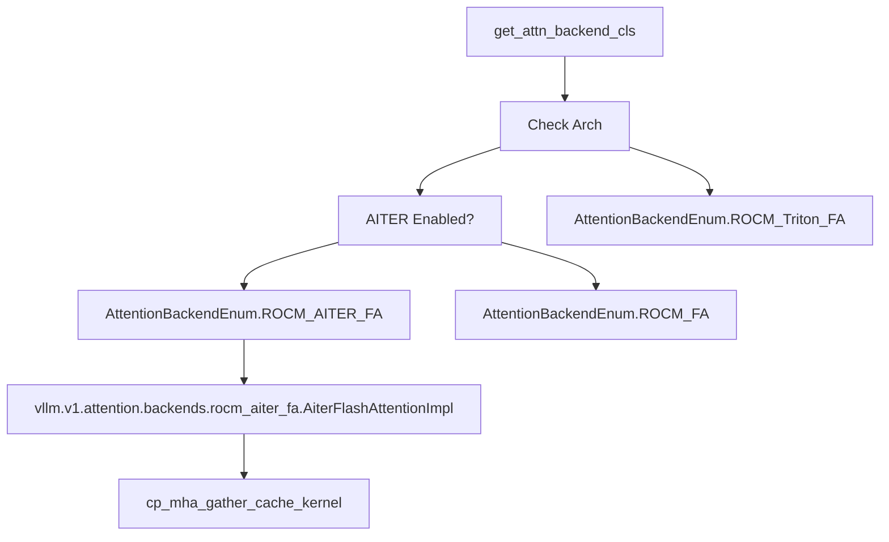

# ROCm 与平台特定注意力机制

相关源文件

-   [cmake/external\_projects/flashmla.cmake](https://github.com/vllm-project/vllm/blob/7cc302dd/cmake/external_projects/flashmla.cmake)
-   [csrc/cpu/cpu\_attn.cpp](https://github.com/vllm-project/vllm/blob/7cc302dd/csrc/cpu/cpu_attn.cpp)
-   [csrc/cpu/cpu\_attn\_amx.hpp](https://github.com/vllm-project/vllm/blob/7cc302dd/csrc/cpu/cpu_attn_amx.hpp)
-   [csrc/cpu/cpu\_attn\_impl.hpp](https://github.com/vllm-project/vllm/blob/7cc302dd/csrc/cpu/cpu_attn_impl.hpp)
-   [csrc/cpu/cpu\_attn\_neon.hpp](https://github.com/vllm-project/vllm/blob/7cc302dd/csrc/cpu/cpu_attn_neon.hpp)
-   [csrc/cpu/cpu\_attn\_neon\_bfmmla.hpp](https://github.com/vllm-project/vllm/blob/7cc302dd/csrc/cpu/cpu_attn_neon_bfmmla.hpp)
-   [csrc/cpu/cpu\_attn\_vec.hpp](https://github.com/vllm-project/vllm/blob/7cc302dd/csrc/cpu/cpu_attn_vec.hpp)
-   [csrc/cpu/cpu\_attn\_vec16.hpp](https://github.com/vllm-project/vllm/blob/7cc302dd/csrc/cpu/cpu_attn_vec16.hpp)
-   [csrc/cpu/cpu\_attn\_vxe.hpp](https://github.com/vllm-project/vllm/blob/7cc302dd/csrc/cpu/cpu_attn_vxe.hpp)
-   [csrc/cpu/cpu\_types\_arm.hpp](https://github.com/vllm-project/vllm/blob/7cc302dd/csrc/cpu/cpu_types_arm.hpp)
-   [csrc/cpu/cpu\_types\_vxe.hpp](https://github.com/vllm-project/vllm/blob/7cc302dd/csrc/cpu/cpu_types_vxe.hpp)
-   [csrc/cpu/generate\_cpu\_attn\_dispatch.py](https://github.com/vllm-project/vllm/blob/7cc302dd/csrc/cpu/generate_cpu_attn_dispatch.py)
-   [csrc/cpu/micro\_gemm/cpu\_micro\_gemm\_amx.hpp](https://github.com/vllm-project/vllm/blob/7cc302dd/csrc/cpu/micro_gemm/cpu_micro_gemm_amx.hpp)
-   [csrc/cpu/micro\_gemm/cpu\_micro\_gemm\_impl.hpp](https://github.com/vllm-project/vllm/blob/7cc302dd/csrc/cpu/micro_gemm/cpu_micro_gemm_impl.hpp)
-   [csrc/cpu/micro\_gemm/cpu\_micro\_gemm\_vec.hpp](https://github.com/vllm-project/vllm/blob/7cc302dd/csrc/cpu/micro_gemm/cpu_micro_gemm_vec.hpp)
-   [csrc/cpu/mla\_decode.cpp](https://github.com/vllm-project/vllm/blob/7cc302dd/csrc/cpu/mla_decode.cpp)
-   [csrc/cpu/utils.hpp](https://github.com/vllm-project/vllm/blob/7cc302dd/csrc/cpu/utils.hpp)
-   [docs/design/attention\_backends.md](https://github.com/vllm-project/vllm/blob/7cc302dd/docs/design/attention_backends.md?plain=1)
-   [examples/tool\_chat\_template\_phi4\_mini.jinja](https://github.com/vllm-project/vllm/blob/7cc302dd/examples/tool_chat_template_phi4_mini.jinja)
-   [tests/entrypoints/llm/test\_accuracy.py](https://github.com/vllm-project/vllm/blob/7cc302dd/tests/entrypoints/llm/test_accuracy.py)
-   [tests/kernels/attention/test\_attention\_selector.py](https://github.com/vllm-project/vllm/blob/7cc302dd/tests/kernels/attention/test_attention_selector.py)
-   [tests/kernels/attention/test\_flashmla.py](https://github.com/vllm-project/vllm/blob/7cc302dd/tests/kernels/attention/test_flashmla.py)
-   [tests/kernels/attention/test\_flashmla\_sparse.py](https://github.com/vllm-project/vllm/blob/7cc302dd/tests/kernels/attention/test_flashmla_sparse.py)
-   [tests/kernels/attention/test\_rocm\_attention\_selector.py](https://github.com/vllm-project/vllm/blob/7cc302dd/tests/kernels/attention/test_rocm_attention_selector.py)
-   [tests/kernels/test\_flex\_attention.py](https://github.com/vllm-project/vllm/blob/7cc302dd/tests/kernels/test_flex_attention.py)
-   [tests/test\_attention\_backend\_registry.py](https://github.com/vllm-project/vllm/blob/7cc302dd/tests/test_attention_backend_registry.py)
-   [tests/v1/attention/test\_attention\_backends.py](https://github.com/vllm-project/vllm/blob/7cc302dd/tests/v1/attention/test_attention_backends.py)
-   [tests/v1/attention/test\_mla\_backends.py](https://github.com/vllm-project/vllm/blob/7cc302dd/tests/v1/attention/test_mla_backends.py)
-   [tests/v1/attention/test\_rocm\_attention\_backends\_selection.py](https://github.com/vllm-project/vllm/blob/7cc302dd/tests/v1/attention/test_rocm_attention_backends_selection.py)
-   [tests/v1/attention/test\_sparse\_mla\_backends.py](https://github.com/vllm-project/vllm/blob/7cc302dd/tests/v1/attention/test_sparse_mla_backends.py)
-   [tests/v1/attention/utils.py](https://github.com/vllm-project/vllm/blob/7cc302dd/tests/v1/attention/utils.py)
-   [tests/v1/spec\_decode/test\_tree\_attention.py](https://github.com/vllm-project/vllm/blob/7cc302dd/tests/v1/spec_decode/test_tree_attention.py)
-   [tools/pre\_commit/generate\_attention\_backend\_docs.py](https://github.com/vllm-project/vllm/blob/7cc302dd/tools/pre_commit/generate_attention_backend_docs.py)
-   [vllm/\_aiter\_ops.py](https://github.com/vllm-project/vllm/blob/7cc302dd/vllm/_aiter_ops.py)
-   [vllm/model\_executor/layers/quantization/quark/schemes/quark\_ocp\_mx.py](https://github.com/vllm-project/vllm/blob/7cc302dd/vllm/model_executor/layers/quantization/quark/schemes/quark_ocp_mx.py)
-   [vllm/platforms/cpu.py](https://github.com/vllm-project/vllm/blob/7cc302dd/vllm/platforms/cpu.py)
-   [vllm/platforms/cuda.py](https://github.com/vllm-project/vllm/blob/7cc302dd/vllm/platforms/cuda.py)
-   [vllm/platforms/interface.py](https://github.com/vllm-project/vllm/blob/7cc302dd/vllm/platforms/interface.py)
-   [vllm/platforms/rocm.py](https://github.com/vllm-project/vllm/blob/7cc302dd/vllm/platforms/rocm.py)
-   [vllm/platforms/tpu.py](https://github.com/vllm-project/vllm/blob/7cc302dd/vllm/platforms/tpu.py)
-   [vllm/platforms/xpu.py](https://github.com/vllm-project/vllm/blob/7cc302dd/vllm/platforms/xpu.py)
-   [vllm/v1/attention/backends/cpu\_attn.py](https://github.com/vllm-project/vllm/blob/7cc302dd/vllm/v1/attention/backends/cpu_attn.py)
-   [vllm/v1/attention/backends/flash\_attn.py](https://github.com/vllm-project/vllm/blob/7cc302dd/vllm/v1/attention/backends/flash_attn.py)
-   [vllm/v1/attention/backends/flashinfer.py](https://github.com/vllm-project/vllm/blob/7cc302dd/vllm/v1/attention/backends/flashinfer.py)
-   [vllm/v1/attention/backends/flex\_attention.py](https://github.com/vllm-project/vllm/blob/7cc302dd/vllm/v1/attention/backends/flex_attention.py)
-   [vllm/v1/attention/backends/mla/aiter\_triton\_mla.py](https://github.com/vllm-project/vllm/blob/7cc302dd/vllm/v1/attention/backends/mla/aiter_triton_mla.py)
-   [vllm/v1/attention/backends/mla/cutlass\_mla.py](https://github.com/vllm-project/vllm/blob/7cc302dd/vllm/v1/attention/backends/mla/cutlass_mla.py)
-   [vllm/v1/attention/backends/mla/flashattn\_mla.py](https://github.com/vllm-project/vllm/blob/7cc302dd/vllm/v1/attention/backends/mla/flashattn_mla.py)
-   [vllm/v1/attention/backends/mla/flashinfer\_mla.py](https://github.com/vllm-project/vllm/blob/7cc302dd/vllm/v1/attention/backends/mla/flashinfer_mla.py)
-   [vllm/v1/attention/backends/mla/flashinfer\_mla\_sparse.py](https://github.com/vllm-project/vllm/blob/7cc302dd/vllm/v1/attention/backends/mla/flashinfer_mla_sparse.py)
-   [vllm/v1/attention/backends/mla/flashmla.py](https://github.com/vllm-project/vllm/blob/7cc302dd/vllm/v1/attention/backends/mla/flashmla.py)
-   [vllm/v1/attention/backends/mla/flashmla\_sparse.py](https://github.com/vllm-project/vllm/blob/7cc302dd/vllm/v1/attention/backends/mla/flashmla_sparse.py)
-   [vllm/v1/attention/backends/mla/rocm\_aiter\_mla.py](https://github.com/vllm-project/vllm/blob/7cc302dd/vllm/v1/attention/backends/mla/rocm_aiter_mla.py)
-   [vllm/v1/attention/backends/mla/rocm\_aiter\_mla\_sparse.py](https://github.com/vllm-project/vllm/blob/7cc302dd/vllm/v1/attention/backends/mla/rocm_aiter_mla_sparse.py)
-   [vllm/v1/attention/backends/mla/triton\_mla.py](https://github.com/vllm-project/vllm/blob/7cc302dd/vllm/v1/attention/backends/mla/triton_mla.py)
-   [vllm/v1/attention/backends/rocm\_aiter\_fa.py](https://github.com/vllm-project/vllm/blob/7cc302dd/vllm/v1/attention/backends/rocm_aiter_fa.py)
-   [vllm/v1/attention/backends/rocm\_aiter\_unified\_attn.py](https://github.com/vllm-project/vllm/blob/7cc302dd/vllm/v1/attention/backends/rocm_aiter_unified_attn.py)
-   [vllm/v1/attention/backends/rocm\_attn.py](https://github.com/vllm-project/vllm/blob/7cc302dd/vllm/v1/attention/backends/rocm_attn.py)
-   [vllm/v1/attention/backends/triton\_attn.py](https://github.com/vllm-project/vllm/blob/7cc302dd/vllm/v1/attention/backends/triton_attn.py)
-   [vllm/v1/attention/backends/utils.py](https://github.com/vllm-project/vllm/blob/7cc302dd/vllm/v1/attention/backends/utils.py)
-   [vllm/v1/attention/ops/chunked\_prefill\_paged\_decode.py](https://github.com/vllm-project/vllm/blob/7cc302dd/vllm/v1/attention/ops/chunked_prefill_paged_decode.py)

## 目的与范围

本页记录了 ROCm 专用的注意力后端、AITER（AMD Instinct Triton Enhanced Runtime）优化，以及平台特定的选择逻辑。ROCm（AMD 的 GPU 平台）相较于 CUDA 使用不同的注意力实现，包括针对 MI300/MI325（GFX942/GFX950）架构优化的 AITER 后端、自定义分页注意力内核，以及用于“窄矩阵”的专用 GEMM 操作。本页还介绍了 vLLM 如何检测 ROCm 硬件能力，并根据 GPU 代际、模型参数和环境配置选择合适的注意力后端。

对于通用的注意力后端架构，请参见 [后端选择与架构](/vllm-project/vllm/8.1-attention-backend-selection)。关于 FlashAttention 和 FlashInfer 后端（主要用于 CUDA），请参见 [FlashAttention 和 FlashInfer](/vllm-project/vllm/8.2-flashattention-and-flashinfer)。关于 ROCm 量化支持，请参见 [FP8 与低精度量化](/vllm-project/vllm/7.2-fp8-and-low-precision-quantization)。

## ROCm 平台检测与 GCN 架构

### GCN 架构检测

ROCm 平台检测会识别 GPU 的 GCN（Graphics Core Next）架构字符串，以确定可用的后端和优化。vLLM 区分 GFX9（CDNA 系列）和 GFX1X（RDNA 系列）。`ROCmPlatform` 类负责处理设备能力查询和配置更新 [vllm/platforms/rocm.py228-251](https://github.com/vllm-project/vllm/blob/7cc302dd/vllm/platforms/rocm.py#L228-L251)

**关键架构标识符**：

-   **GFX9**：包括 `gfx90a`（MI200）、`gfx942`（MI300）和 `gfx950` [vllm/platforms/rocm.py148-153](https://github.com/vllm-project/vllm/blob/7cc302dd/vllm/platforms/rocm.py#L148-L153)
-   **GFX950**：专门面向诸如 `wvSplitKrc` 之类的“Skinny GEMM”优化 [vllm/platforms/rocm.py152](https://github.com/vllm-project/vllm/blob/7cc302dd/vllm/platforms/rocm.py#L152-L152)
-   **GFX1X**：包括 `gfx11xx` 和 `gfx12xx`（RDNA 系列） [vllm/platforms/rocm.py148](https://github.com/vllm-project/vllm/blob/7cc302dd/vllm/platforms/rocm.py#L148-L148)

平台通过 `_ROCM_DEVICE_ID_NAME_MAP` 识别具体硬件，覆盖 MI300A/X、MI308X、MI325X 和 Radeon RX7900XTX [vllm/platforms/rocm.py57-67](https://github.com/vllm-project/vllm/blob/7cc302dd/vllm/platforms/rocm.py#L57-L67)

**来源**： [vllm/platforms/rocm.py57-153](https://github.com/vllm-project/vllm/blob/7cc302dd/vllm/platforms/rocm.py#L57-L153) [vllm/platforms/rocm.py228-251](https://github.com/vllm-project/vllm/blob/7cc302dd/vllm/platforms/rocm.py#L228-L251)

## AITER 后端与操作

AITER 为 ROCm 提供优化后的 Triton 和汇编内核。它主要支持 MI3XX（GFX942/GFX950）架构 [vllm/_aiter_ops.py52-56](https://github.com/vllm-project/vllm/blob/7cc302dd/vllm/_aiter_ops.py#L52-L56)

### AITER 能力检查

系统通过 `is_aiter_found_and_supported()` 判断是否可以使用 AITER，该函数会验证库是否存在以及 ROCm MI3XX 平台是否满足条件 [vllm/_aiter_ops.py36-56](https://github.com/vllm-project/vllm/blob/7cc302dd/vllm/_aiter_ops.py#L36-L56)

### AITER 优化操作

AITER 为 LLM 执行中的若干瓶颈提供了专用内核：

| 操作 | 实现函数 | 描述 |
| --- | --- | --- |
| **Fused MoE** | `_rocm_aiter_fused_moe_impl` | 融合式 Mixture-of-Experts 内核，支持多种量化和激活方法 [vllm/_aiter_ops.py74-121](https://github.com/vllm-project/vllm/blob/7cc302dd/vllm/_aiter_ops.py#L74-L121) |
| **ASM MoE** | `_rocm_aiter_asm_moe_tkw1_impl` | 面向 BF16 的汇编优化 MoE 内核 [vllm/_aiter_ops.py150-184](https://github.com/vllm-project/vllm/blob/7cc302dd/vllm/_aiter_ops.py#L150-L184) |
| **TopK Softmax** | `_rocm_aiter_topk_softmax_impl` | 用于门控的 TopK 与 Softmax 优化融合 [vllm/_aiter_ops.py205-216](https://github.com/vllm-project/vllm/blob/7cc302dd/vllm/_aiter_ops.py#L205-L216) |
| **Sparse MLA** | `rocm_aiter_sparse_attn_indexer` | 稀疏 Multi-Latent Attention 的索引器 [vllm/_aiter_ops.py12-15](https://github.com/vllm-project/vllm/blob/7cc302dd/vllm/_aiter_ops.py#L12-L15) |
| **Unified Attention** | `UnifiedAttentionImpl` | 面向 ROCm 的基于 AITER 的统一注意力实现 [vllm/v1/attention/backends/rocm\_aiter\_unified\_attn.py12-15](https://github.com/vllm-project/vllm/blob/7cc302dd/vllm/v1/attention/backends/rocm_aiter_unified_attn.py#L12-L15) |

**来源**： [vllm/_aiter_ops.py12-216](https://github.com/vllm-project/vllm/blob/7cc302dd/vllm/_aiter_ops.py#L12-L216) [vllm/v1/attention/backends/rocm\_aiter\_unified\_attn.py12-15](https://github.com/vllm-project/vllm/blob/7cc302dd/vllm/v1/attention/backends/rocm_aiter_unified_attn.py#L12-L15)

## 平台特定注意力选择

### ROCm 注意力选择

ROCm 在 `ROCmPlatform.get_attn_backend_cls` 中采用优先级选择逻辑 [vllm/platforms/rocm.py513-555](https://github.com/vllm-project/vllm/blob/7cc302dd/vllm/platforms/rocm.py#L513-L555)

1.  **AITER FA**：当启用 AITER 且平台为 GFX9 时选择 [vllm/platforms/rocm.py532-536](https://github.com/vllm-project/vllm/blob/7cc302dd/vllm/platforms/rocm.py#L532-L536)
2.  **Flash Attention**：在 GFX9 上，当 AITER 被禁用时作为回退方案 [vllm/platforms/rocm.py538-540](https://github.com/vllm-project/vllm/blob/7cc302dd/vllm/platforms/rocm.py#L538-L540)
3.  **Flash Attention Triton**：专门面向 GFX1X（RDNA）架构 [vllm/platforms/rocm.py527-529](https://github.com/vllm-project/vllm/blob/7cc302dd/vllm/platforms/rocm.py#L527-L529)
4.  **Torch SDPA**：特定场景下的最终回退方案。

### CPU 注意力

`CpuPlatform` 使用 `CPU_ATTN` 后端 [vllm/platforms/cpu.py105-118](https://github.com/vllm-project/vllm/blob/7cc302dd/vllm/platforms/cpu.py#L105-L118)。它不支持 MLA 或稀疏注意力 [vllm/platforms/cpu.py113-116](https://github.com/vllm-project/vllm/blob/7cc302dd/vllm/platforms/cpu.py#L113-L116)。它偏好块大小为 32 的倍数，以便优化 [vllm/platforms/cpu.py168-173](https://github.com/vllm-project/vllm/blob/7cc302dd/vllm/platforms/cpu.py#L168-L173)。

### XPU 注意力

`XPUPlatform` 默认使用 `FLASH_ATTN`，但在 `float32` 下会回退到 `TRITON_ATTN` [vllm/platforms/xpu.py73-81](https://github.com/vllm-project/vllm/blob/7cc302dd/vllm/platforms/xpu.py#L73-L81)。它会强制 KV 缓存布局为 `NHD` [vllm/platforms/xpu.py55-61](https://github.com/vllm-project/vllm/blob/7cc302dd/vllm/platforms/xpu.py#L55-L61)。

### TPU 注意力

`TpuPlatform` 依赖 `tpu_inference` 库 [vllm/platforms/tpu.py9-15](https://github.com/vllm-project/vllm/blob/7cc302dd/vllm/platforms/tpu.py#L9-L15)

**来源**： [vllm/platforms/rocm.py513-555](https://github.com/vllm-project/vllm/blob/7cc302dd/vllm/platforms/rocm.py#L513-L555) [vllm/platforms/cpu.py105-173](https://github.com/vllm-project/vllm/blob/7cc302dd/vllm/platforms/cpu.py#L105-L173) [vllm/platforms/xpu.py49-90](https://github.com/vllm-project/vllm/blob/7cc302dd/vllm/platforms/xpu.py#L49-L90) [vllm/platforms/tpu.py9-21](https://github.com/vllm-project/vllm/blob/7cc302dd/vllm/platforms/tpu.py#L9-L21)

## ROCm 注意力实现细节

### AITER Flash Attention（V1）

ROCm 的 `AiterFlashAttentionBackend` 提供基于 Triton 内核的 `reshape_and_cache` 操作 [vllm/v1/attention/backends/rocm\_aiter\_fa.py47-72](https://github.com/vllm-project/vllm/blob/7cc302dd/vllm/v1/attention/backends/rocm_aiter_fa.py#L47-L72)。它同时支持 `NHD` 和 `SHUFFLE` KV 缓存布局 [vllm/v1/attention/backends/rocm\_aiter\_fa.py93-149](https://github.com/vllm-project/vllm/blob/7cc302dd/vllm/v1/attention/backends/rocm_aiter_fa.py#L93-L149)

**来源**： [vllm/platforms/rocm.py513-555](https://github.com/vllm-project/vllm/blob/7cc302dd/vllm/platforms/rocm.py#L513-L555) [vllm/v1/attention/backends/rocm\_aiter\_fa.py47-149](https://github.com/vllm-project/vllm/blob/7cc302dd/vllm/v1/attention/backends/rocm_aiter_fa.py#L47-L149)

## 数据流：ROCm 上的 MoE 执行

下图将 AITER 库中的实体与 vLLM 中的 Mixture-of-Experts 实现连接起来。

> **[Mermaid 序列图]**
> *(图表结构无法解析)*

**关键交互点**：

-   **`_rocm_aiter_fused_moe_impl`**：将 vLLM 的 MoE 参数映射到 AITER 的 `ActivationType` 和 `QuantType` [vllm/_aiter_ops.py95-121](https://github.com/vllm-project/vllm/blob/7cc302dd/vllm/_aiter_ops.py#L95-L121)
-   **`is_aiter_found_and_supported`**：门控函数，会检查 `current_platform.is_rocm()` 和 `on_mi3xx()` [vllm/_aiter_ops.py52-56](https://github.com/vllm-project/vllm/blob/7cc302dd/vllm/_aiter_ops.py#L52-L56)
-   **`ROCmPlatform.import_kernels`**：触发 `vllm._rocm_C` 自定义算子的注册 [vllm/platforms/rocm.py47-50](https://github.com/vllm-project/vllm/blob/7cc302dd/vllm/platforms/rocm.py#L47-L50)

**来源**： [vllm/_aiter_ops.py36-121](https://github.com/vllm-project/vllm/blob/7cc302dd/vllm/_aiter_ops.py#L36-L121) [vllm/platforms/rocm.py45-56](https://github.com/vllm-project/vllm/blob/7cc302dd/vllm/platforms/rocm.py#L45-L56) [vllm/v1/attention/backends/rocm\_aiter\_fa.py10-15](https://github.com/vllm-project/vllm/blob/7cc302dd/vllm/v1/attention/backends/rocm_aiter_fa.py#L10-L15)

## 平台注意力选择优先级

每个平台都会实现 `get_attn_backend_cls`，以根据模型配置（MLA、稀疏）和数据类型确定最佳后端。

| 平台 | MLA 支持 | 稀疏支持 | 默认后端 |
| --- | --- | --- | --- |
| **ROCm** | `ROCM_AITER_MLA` / `TRITON_MLA` | `ROCM_AITER_MLA_SPARSE` | `ROCM_AITER_FA` / `ROCM_FA` [vllm/platforms/rocm.py513-555](https://github.com/vllm-project/vllm/blob/7cc302dd/vllm/platforms/rocm.py#L513-L555) |
| **XPU** | `TRITON_MLA` | `XPU_MLA_SPARSE` | `FLASH_ATTN` [vllm/platforms/xpu.py49-90](https://github.com/vllm-project/vllm/blob/7cc302dd/vllm/platforms/xpu.py#L49-L90) |
| **CPU** | 不支持 | 不支持 | `CPU_ATTN` [vllm/platforms/cpu.py105-118](https://github.com/vllm-project/vllm/blob/7cc302dd/vllm/platforms/cpu.py#L105-L118) |
| **CUDA** | `FLASH_ATTN_MLA` / `FLASHMLA` | `FLASHMLA_SPARSE` | `FLASH_ATTN` / `FLASHINFER` [vllm/platforms/cuda.py51-113](https://github.com/vllm-project/vllm/blob/7cc302dd/vllm/platforms/cuda.py#L51-L113) |

**来源**： [vllm/platforms/rocm.py513-555](https://github.com/vllm-project/vllm/blob/7cc302dd/vllm/platforms/rocm.py#L513-L555) [vllm/platforms/xpu.py49-90](https://github.com/vllm-project/vllm/blob/7cc302dd/vllm/platforms/xpu.py#L49-L90) [vllm/platforms/cpu.py105-118](https://github.com/vllm-project/vllm/blob/7cc302dd/vllm/platforms/cpu.py#L105-L118) [vllm/platforms/cuda.py51-113](https://github.com/vllm-project/vllm/blob/7cc302dd/vllm/platforms/cuda.py#L51-L113)
